# ND-500 Buddy System Memory Management

## Overview

The ND-500 CPU implements a **Buddy System** for dynamic memory allocation, providing an efficient mechanism for allocating and freeing variable-sized memory blocks from a pool called the **heap**. This system is fundamentally different from the traditional stack-based memory allocation and is designed to handle:

1. **Co-routines** - Multiple concurrent execution paths that may not return in LIFO order
2. **Dynamic data structures** - Trees, lists, and networks that grow and shrink during execution
3. **Non-LIFO deallocation** - Situations where the first allocated block isn't the last to be freed

The name "Buddy System" comes from the way memory blocks are split and paired - when a larger block is split in half, the two resulting blocks are "buddies" that can potentially be recombined later.

---

# DATA STRUCTURE DEFINITIONS

## Data Structure 1: Local Data Area (at B register)

The **Local Data Area** is the fundamental stack frame structure. The B register always points to the base of the current local data area.

### Memory Layout Table

| Byte Offset | Word Offset | Symbol | Size | Description |
|-------------|-------------|--------|------|-------------|
| 0 | 0 | **PREVB** | 4 bytes (1 word) | Previous B register value (return chain) |
| 4 | 1 | **RETA** | 4 bytes (1 word) | Return address |
| 8 | 2 | **SP** | 4 bytes (1 word) | Stack pointer (first free location) |
| 12 | 3 | **AUX/LOG** | 4 bytes (1 word) | Auxiliary data OR log₂(block size) for buddy |
| 16 | 4 | **N** | 4 bytes (1 word) | Number of arguments |
| 20 | 5 | **arg1** | 4 bytes (1 word) | Address of first argument |
| 24 | 6 | **arg2** | 4 bytes (1 word) | Address of second argument |
| ... | ... | **argN** | 4 bytes each | Addresses of remaining arguments |
| 20+N×4 | 5+N | | variable | Local variables (uninitialized) |

### Predefined Symbol Values (from manual)

| Symbol | Value (bytes) | Description |
|--------|---------------|-------------|
| PREVB | 0 | Offset to previous B |
| RETA | 4 | Offset to return address |
| SP | 8 | Offset to stack pointer |
| AUX | 12 | Offset to auxiliary location |
| N | 16 | Offset to argument count |

### Visual Memory Layout

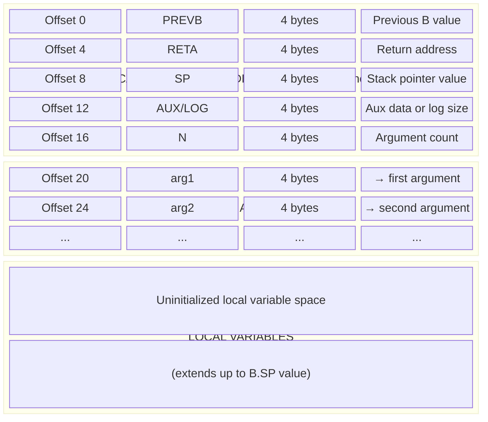

### How B Register References This Structure

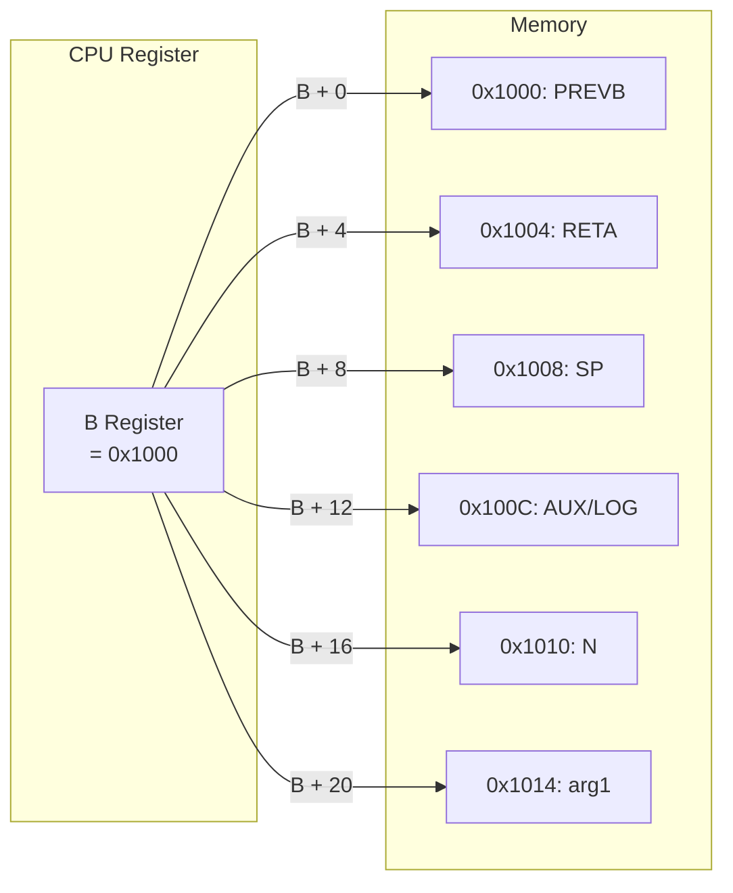

---

## Data Structure 2: Heap Variables (at TOS register)

The **Heap Variables** structure describes the buddy system's free memory pool. The TOS register always points to this structure.

### Memory Layout Table

| Byte Offset | Word Offset | Symbol | Size | Description |
|-------------|-------------|--------|------|-------------|
| 0 | 0 | **MAXL** | 4 bytes (1 word) | Maximum log₂ size of allocatable blocks |
| 4 | 1 | **STAH** | 4 bytes (1 word) | Start address of heap pool (informational) |
| 8 | 2 | **ENDH** | 4 bytes (1 word) | End address of heap pool (informational) |
| 12 | 3 | **FLOG0** | 4 bytes (1 word) | Freelist head for 2⁰ = 1 word blocks |
| 16 | 4 | **FLOG1** | 4 bytes (1 word) | Freelist head for 2¹ = 2 word blocks |
| 20 | 5 | **FLOG2** | 4 bytes (1 word) | Freelist head for 2² = 4 word blocks |
| ... | ... | **FLOGn** | 4 bytes each | Freelist heads continue... |
| 12+MAXL×4 | 3+MAXL | **FLOG\<MAXL\>** | 4 bytes (1 word) | Freelist head for 2^MAXL word blocks |

### FLOG Array Size

The FLOG array has **(MAXL + 1)** entries, from FLOG0 to FLOG\<MAXL\>.

| If MAXL = | FLOG entries | Total heap variables size |
|-----------|--------------|---------------------------|
| 5 | FLOG0-FLOG5 (6 entries) | 12 + 6×4 = 36 bytes |
| 7 | FLOG0-FLOG7 (8 entries) | 12 + 8×4 = 44 bytes |
| 10 | FLOG0-FLOG10 (11 entries) | 12 + 11×4 = 56 bytes |

### Visual Memory Layout

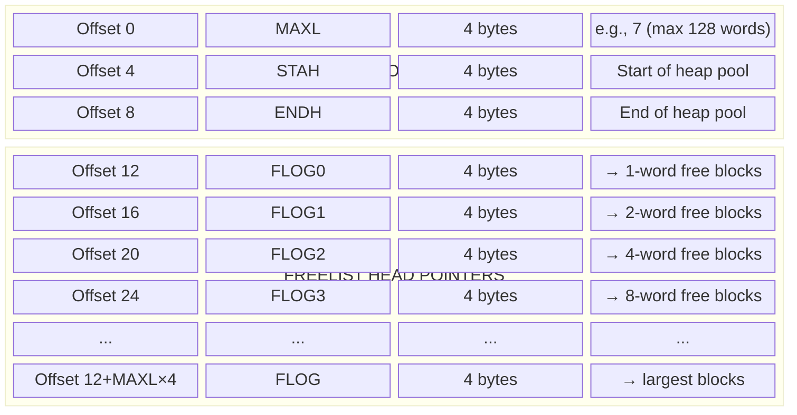

### How TOS Register References This Structure

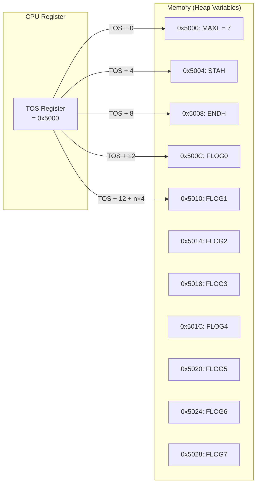

### Block Sizes by Log Value

| Log Size (n) | Block Size (words) | Block Size (bytes) | FLOG offset from TOS |
|--------------|--------------------|--------------------|----------------------|
| 0 | 2⁰ = 1 | 4 | TOS + 12 |
| 1 | 2¹ = 2 | 8 | TOS + 16 |
| 2 | 2² = 4 | 16 | TOS + 20 |
| 3 | 2³ = 8 | 32 | TOS + 24 |
| 4 | 2⁴ = 16 | 64 | TOS + 28 |
| 5 | 2⁵ = 32 | 128 | TOS + 32 |
| 6 | 2⁶ = 64 | 256 | TOS + 36 |
| 7 | 2⁷ = 128 | 512 | TOS + 40 |

**Formula:** `FLOG[n] address = TOS + 12 + (n × 4)`

---

## FLOG Initialization and Lifecycle

### Initial Setup (User Responsibility)

> *"The heap variables must be initialized by the user program and the user is responsible for building the lists."*
> — ND-05.009.4 EN, Section 3.3

**The CPU does NOT initialize the heap.** After INIT sets TOS, the user program must:

1. Write MAXL value at TOS+0
2. Write STAH (start of heap) at TOS+4 (informational only)
3. Write ENDH (end of heap) at TOS+8 (informational only)
4. Build the freelists by writing FLOG entries and linking free blocks

### Example: Initial Heap Setup

Assume after `INIT`, TOS = 0x15000, and we want to set up a heap pool from 0x20000 to 0x30000 with max block size 2^7 = 128 words.

**Step 1: Initialize Heap Variables**

| Address | Field | Value Written | Meaning |
|---------|-------|---------------|---------|
| 0x15000 | MAXL | 7 | Max block size = 2^7 = 128 words |
| 0x15004 | STAH | 0x20000 | Heap pool starts here |
| 0x15008 | ENDH | 0x30000 | Heap pool ends here |
| 0x1500C | FLOG0 | 0 | No 1-word blocks |
| 0x15010 | FLOG1 | 0 | No 2-word blocks |
| 0x15014 | FLOG2 | 0 | No 4-word blocks |
| 0x15018 | FLOG3 | 0 | No 8-word blocks |
| 0x1501C | FLOG4 | 0 | No 16-word blocks |
| 0x15020 | FLOG5 | 0 | No 32-word blocks |
| 0x15024 | FLOG6 | 0 | No 64-word blocks |
| 0x15028 | FLOG7 | 0x20000 | One 128-word block available |

**Step 2: Initialize Free Block at 0x20000**

| Address | Value Written | Meaning |
|---------|---------------|---------|
| 0x20000 | 0x20200 | Next 128-word block at 0x20200 |

**Step 3: Initialize Second Free Block at 0x20200**

| Address | Value Written | Meaning |
|---------|---------------|---------|
| 0x20200 | 0 | End of FLOG7 list |

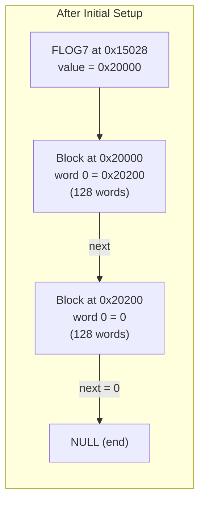

---

## How GETB Modifies FLOG (Step by Step)

### Scenario: `W3 GETB 5` (request 32-word block)

**Initial State:**
- FLOG5 (32-word) = 0 (empty)
- FLOG6 (64-word) = 0 (empty)  
- FLOG7 (128-word) = 0x20000 (one block available)
- Block at 0x20000: word 0 = 0 (end of list)

**Step-by-Step Execution:**

| Step | Action | Memory Read | Memory Write | Result |
|------|--------|-------------|--------------|--------|
| 1 | Check FLOG5 | Read 0x15020 → 0 | - | Empty, try larger |
| 2 | Check FLOG6 | Read 0x15024 → 0 | - | Empty, try larger |
| 3 | Check FLOG7 | Read 0x15028 → 0x20000 | - | Found block! |
| 4 | Unlink from FLOG7 | Read 0x20000 → 0 | Write 0x15028 ← 0 | FLOG7 now empty |
| 5 | Split 128→64+64 | - | Write 0x20100 ← 0 | Buddy at 0x20100 |
| 6 | Add buddy to FLOG6 | Read 0x15024 → 0 | Write 0x15024 ← 0x20100 | FLOG6 = 0x20100 |
| 7 | Split 64→32+32 | - | Write 0x20080 ← 0 | Buddy at 0x20080 |
| 8 | Add buddy to FLOG5 | Read 0x15020 → 0 | Write 0x15020 ← 0x20080 | FLOG5 = 0x20080 |
| 9 | Return block | - | - | W3 = 0x20000 |

**Final State:**

| Field | Before | After |
|-------|--------|-------|
| FLOG5 | 0 | 0x20080 (32-word block) |
| FLOG6 | 0 | 0x20100 (64-word block) |
| FLOG7 | 0x20000 | 0 (empty) |
| W3 | - | 0x20000 |

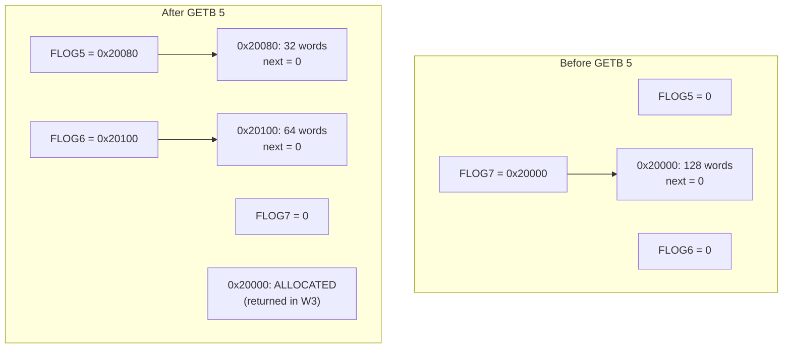

---

## How FREEB Modifies FLOG (Step by Step)

### Scenario: `FREEB 5, 0x20000` (free 32-word block)

**Initial State:**
- FLOG5 = 0x20080 (one block in list)
- Block at 0x20080: word 0 = 0 (end of list)

**Step-by-Step Execution:**

| Step | Action | Memory Read | Memory Write | Result |
|------|--------|-------------|--------------|--------|
| 1 | Calculate FLOG5 address | TOS + 32 = 0x15020 | - | - |
| 2 | Read old FLOG5 head | Read 0x15020 → 0x20080 | - | old_head = 0x20080 |
| 3 | Write next ptr in freed block | - | Write 0x20000 ← 0x20080 | Block points to old head |
| 4 | Update FLOG5 | - | Write 0x15020 ← 0x20000 | FLOG5 = freed block |

**Final State:**

| Field | Before | After |
|-------|--------|-------|
| FLOG5 | 0x20080 | 0x20000 |
| 0x20000 (word 0) | (was allocated data) | 0x20080 (next pointer) |

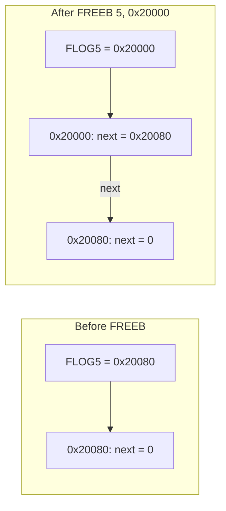

**Key Point:** FREEB **prepends** (adds to front), it does NOT append to end. This is O(1) operation.

---

## How RETB Works Internally (Step by Step)

### Scenario: RETB from subroutine entered via ENTB 5

**Initial State:**
- B = 0x20000 (local data area from heap)
- Memory at B:
  - B+0 (PREVB) = 0x10000
  - B+4 (RETA) = 0x8100
  - B+8 (SP) = 0x11000
  - B+12 (LOG) = 5 ← **This is the block size!**
- TOS = 0x15000
- FLOG5 (at TOS+32) = 0x20080

**Step-by-Step Execution:**

| Step | Action | Memory Read | Memory Write | Register Write |
|------|--------|-------------|--------------|----------------|
| 1 | Read LOG (block size) | Read 0x2000C → 5 | - | - |
| 2 | Read PREVB | Read 0x20000 → 0x10000 | - | - |
| 3 | Read RETA | Read 0x20004 → 0x8100 | - | - |
| 4 | **FREEB(5, B)** - Read old FLOG5 | Read 0x15020 → 0x20080 | - | - |
| 5 | **FREEB** - Write next ptr | - | Write 0x20000 ← 0x20080 | - |
| 6 | **FREEB** - Update FLOG5 | - | Write 0x15020 ← 0x20000 | - |
| 7 | Update B register | - | - | B = 0x10000 |
| 8 | Update P (jump) | - | - | P = 0x8100 |
| 9 | Update L | - | - | L = 0x8100 |
| 10 | Clear K flag (RETB) | - | - | STATUS.K = 0 |

**Final State:**

| Item | Before | After |
|------|--------|-------|
| B | 0x20000 | 0x10000 (restored) |
| P | (subroutine) | 0x8100 (return address) |
| L | (subroutine) | 0x8100 |
| STATUS.K | ? | 0 |
| FLOG5 | 0x20080 | 0x20000 (block returned!) |
| 0x20000 word 0 | 0x10000 (was PREVB) | 0x20080 (now next ptr) |

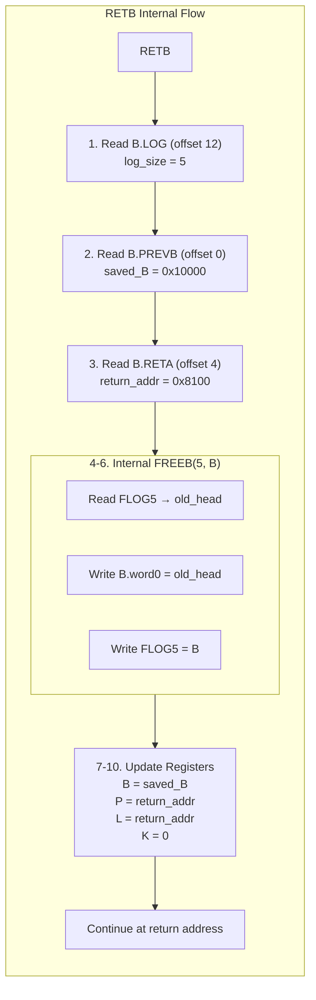

### Critical: RETB Overwrites B.PREVB with Next Pointer!

When RETB executes FREEB internally:
- The freed block's **word 0** becomes the **next pointer** for the freelist
- This **overwrites** whatever was in B.PREVB
- This is fine because we already read PREVB before calling FREEB

---

## Data Structure 3: Free Block (in Heap Pool)

Each free block in the heap pool has a simple structure - only the first word is used by the buddy system.

### Memory Layout Table

| Byte Offset | Word Offset | Description |
|-------------|-------------|-------------|
| 0 | 0 | **Next pointer** (address of next free block, or 0 if last) |
| 4+ | 1+ | Unused (available for allocation) |

### Freelist Linked Structure

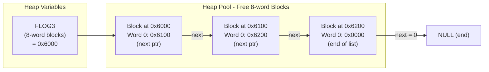

### Single Free Block Detail

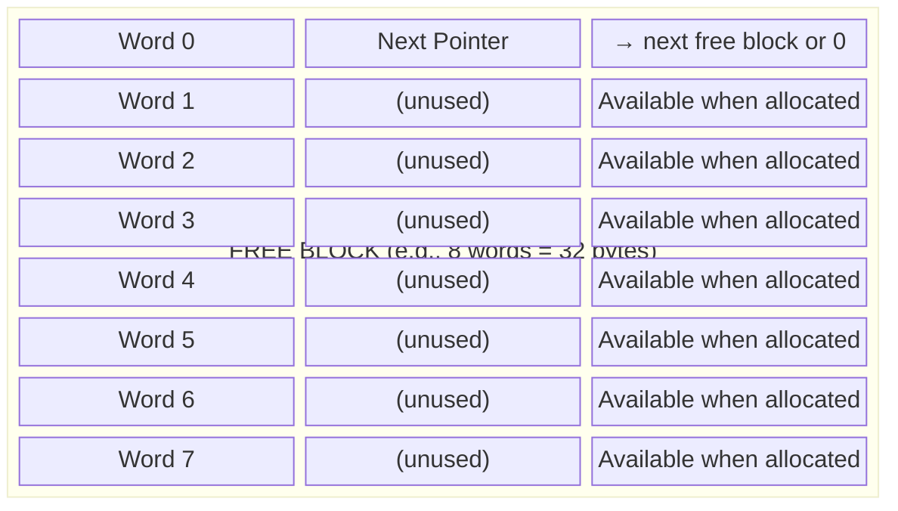

---

# INSTRUCTION OPERATIONS

## Which Instructions to Use for the Buddy System

The ND-500 manual describes the following instruction relationships:

| Instruction | Purpose | Changes TOS? | Used for Buddy System? |
|-------------|---------|--------------|------------------------|
| **INIT** | Initialize main program stack | **YES** | Yes - sets up TOS to point to heap variables |
| **ENTM** | Enter module (cross-segment/domain) | **YES** | Warning: changes TOS to new heap variables |
| **ENTS** | Enter stack subroutine | No | No - uses stack, not heap |
| **ENTB** | Enter buddy subroutine | No (reads TOS) | **YES** - allocates from heap |
| **GETB** | Get standalone heap element | No (reads TOS) | **YES** - allocates from heap |
| **FREEB** | Free heap element | No (reads TOS) | **YES** - returns to heap |
| **RETB/RETBK** | Return from buddy subroutine | No (reads TOS) | **YES** - frees block to heap |

### Typical Buddy System Setup

1. **INIT** - Initialize stack and set TOS to point to heap variables location
2. User code must **initialize heap variables** at TOS (MAXL, freelists, etc.)
3. **ENTB** - Enter subroutines that need heap-allocated local data
4. **GETB** - Allocate standalone elements from heap
5. **FREEB** - Return standalone elements to heap
6. **RETB/RETBK** - Return from buddy subroutines (frees local data area)

### Entry/Return Instruction Pairings (from Manual)

> *"The programmer must ensure that the appropriate return instruction is executed."*
> — ND-05.009.4 EN, Section 13.11

| Entry Instruction | Must Return Via | Notes |
|-------------------|-----------------|-------|
| ENTS, ENTSN, ENTF, ENTFN | RET, RETK, or IF K RET | Stack-based local data |
| ENTD | RETD | Direct entry (no local data init) |
| ENTT | RETT | Trap handler |
| **ENTB** | **RETB or RETBK** | **Buddy/heap-based local data** |

**Critical:** Using the wrong return instruction will cause incorrect behavior:
- If you use RET after ENTB: The heap block is **NOT freed** (memory leak)
- If you use RETB after ENTS: The stack frame is incorrectly added to heap freelist (corruption)

RETB/RETBK specifically:
1. Reads `B.LOG` (offset 12) to get the block size
2. Calls FREEB internally to return the block to the heap
3. Then performs the normal return (restore B, jump to RETA)

### Warning About ENTM (from Manual)

> *"Be aware that initializing a new stack by INIT or ENTM will change TOS, thus another set of heap variables will be used by the buddy instructions. The new heap variables may be initialized to the values of the old ones or to new values."*
> — ND-05.009.4 EN, Section 3.3

This means:
- If you use **ENTM** to enter a module, TOS will point to a **different** heap variables location
- The buddy instructions (GETB, FREEB, ENTB, RETB) will use the heap described by the **current TOS**
- You must ensure heap variables are properly initialized at the new TOS location

---

## INIT Instruction: Initialize Stack

**Source:** ND-05.009.4 EN, Section 13.9 (Page 229)

### Assembly Format

```
INIT <<bottom of stack>>, <stack demand of main program>, <total system stack demand>
```

| Mnemonic | Hex code | Octal code |
|----------|----------|------------|
| INIT | 0DCH | 334B |

### Operation Sequence (Exact from Manual)

| Step | Operation | Description |
|------|-----------|-------------|
| 1 | `<<bottom of stack>> → B` | Load B register with stack base address |
| 2 | `<<bottom of stack>> + <total system stack demand> → TOS` | Set TOS to end of stack area |
| 3 | `<<bottom of stack>> + <stack demand of main program> → B.SP` | Set stack pointer |
| 4 | `0 → B.PREVB` | Clear previous B (no caller) |
| 5 | `0 → B.RETA → L` | Clear return address and L register |

### Memory Writes

| Address | Value Written | Description |
|---------|---------------|-------------|
| `<<bottom of stack>> + 0` | `0x00000000` | PREVB = 0 |
| `<<bottom of stack>> + 4` | `0x00000000` | RETA = 0 |
| `<<bottom of stack>> + 8` | `<<bottom of stack>> + <stack demand of main program>` | SP value |

### Register Writes

| Register | Value Written |
|----------|---------------|
| **B** | `<<bottom of stack>>` |
| **TOS** | `<<bottom of stack>> + <total system stack demand>` |
| **L** | `0x00000000` |

### Concrete Example: INIT 0x10000, 0x1000, 0x5000

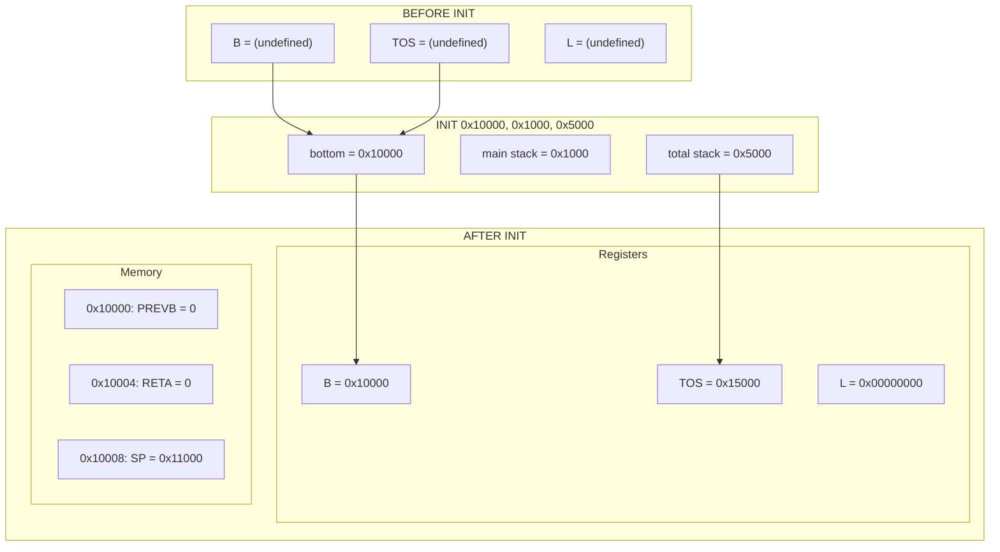

### Memory Map After INIT

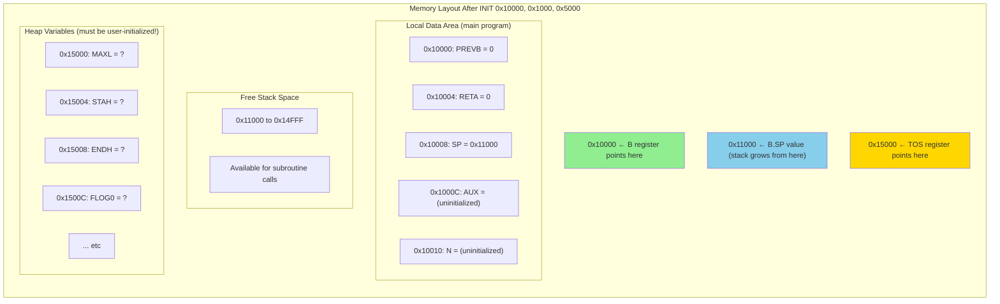

---

## ENTS Instruction: Enter Stack Subroutine

**Source:** ND-05.009.4 EN, Section 13.10 (Page 233)

### Assembly Format

```
ENTS <stack demand>
```

| Mnemonic | Hex code | Octal code |
|----------|----------|------------|
| ENTS | 0B8H | 270B |

### Stack Demand Note (from Manual)

> *"The `<stack demand>` is the number of bytes needed for the local data field of the subroutine, including the predefined locations PREVB, RETA, SP, AUX and N (a total of 20 bytes)."*

### Operation Sequence (Exact from Manual)

| Step | Operation | Description |
|------|-----------|-------------|
| 1 | `B.SP → B` | New B = old stack pointer |
| 2 | `oldB → B.PREVB` | Save old B for return |
| 3 | `return address → B.RETA → L` | Save return address |
| 4 | `newB + <stack demand> → B.SP` | Advance stack pointer |
| 5 | `number of arguments → B.N` | Store argument count |
| 6 | `addresses of arguments → B.ARG` | Copy argument addresses |

### Memory Writes

| Address | Value Written | Description |
|---------|---------------|-------------|
| `newB + 0` | `oldB` | PREVB = previous B |
| `newB + 4` | `return address` | RETA |
| `newB + 8` | `newB + <stack demand>` | SP = new stack pointer |
| `newB + 16` | `N` | Argument count |
| `newB + 20` | `arg1 address` | First argument |
| `newB + 24` | `arg2 address` | Second argument |
| ... | ... | Additional arguments |

### Register Writes

| Register | Value Written | Notes |
|----------|---------------|-------|
| **B** | `oldB.SP` | New base = where old stack pointer was |
| **L** | `return address` | For RETD compatibility |
| **TOS** | **(unchanged)** | TOS is NOT modified by ENTS |

### Concrete Example: ENTS 0x80 (128 bytes)

**Before state:**
- B = 0x10000
- B.SP (memory at 0x10008) = 0x11000
- TOS = 0x15000
- Calling with 2 arguments at 0x20000 and 0x20004

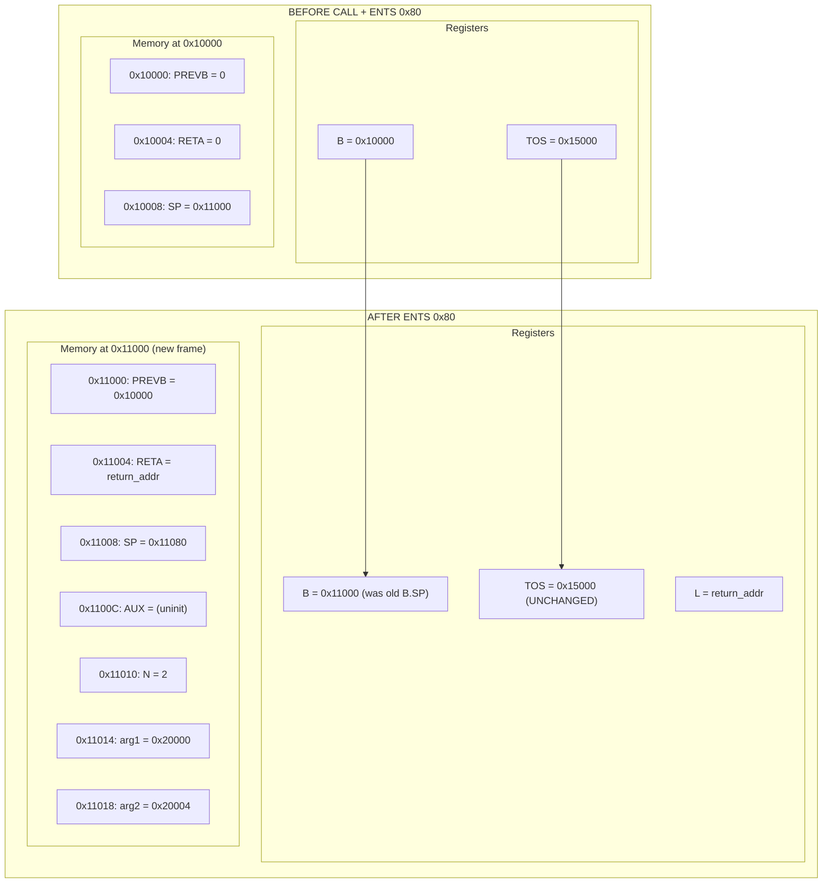

### Stack Growth Visualization

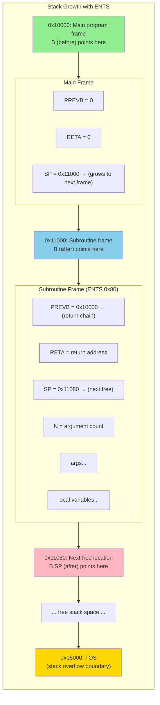

---

## ENTB Instruction: Enter Buddy Subroutine

**Source:** ND-05.009.4 EN, Section 13.10 (Page 237)

### Assembly Format

```
ENTB <log size>
```

| Mnemonic | Hex code | Octal code |
|----------|----------|------------|
| ENTB | 0BDH | 275B |

### Description (from Manual)

> *"A local data area of size 2^`<log size>` words is allocated from the heap and the subroutine is entered."*

### Operation Sequence (Exact from Manual)

| Step | Operation | Description |
|------|-----------|-------------|
| 1 | Allocate 2^`<log size>` words from heap | Uses TOS to find heap variables |
| 2 | `address of heap element → B` | New B = allocated block |
| 3 | `oldB → B.PREVB` | Save old B for return |
| 4 | `oldB.SP → B.SP` | **Inherit caller's stack pointer!** |
| 5 | `return address → B.RETA → L` | Save return address |
| 6 | `log size → B.LOG` | **Store block size for RETB!** |
| 7 | `number of arguments → B.N` | Store argument count |
| 8 | `addresses of arguments → B.ARG` | Copy argument addresses |

### Memory Writes

| Address | Value Written | Description |
|---------|---------------|-------------|
| `heapBlock + 0` | `oldB` | PREVB = previous B |
| `heapBlock + 4` | `return address` | RETA |
| `heapBlock + 8` | `oldB.SP` | **SP = caller's stack pointer (inherited!)** |
| `heapBlock + 12` | `<log size>` | **LOG = block size (crucial for RETB!)** |
| `heapBlock + 16` | `N` | Argument count |
| `heapBlock + 20+` | argument addresses | Arguments |

### Register Writes

| Register | Value Written | Notes |
|----------|---------------|-------|
| **B** | `address of heap element` | From heap allocation |
| **L** | `return address` | |
| **TOS** | **(unchanged)** | But TOS is **read** to find heap variables |

### Key Difference: ENTB vs ENTS

| Aspect | ENTS | ENTB |
|--------|------|------|
| New B comes from | `oldB.SP` (stack) | Heap allocation |
| New B.SP value | `newB + <stack demand>` | `oldB.SP` (inherited!) |
| AUX/LOG contains | Uninitialized | `<log size>` |
| TOS usage | Only for overflow check | **Read to find heap** |
| Return via | RET/RETK | RETB/RETBK |

### Heap Allocation Process

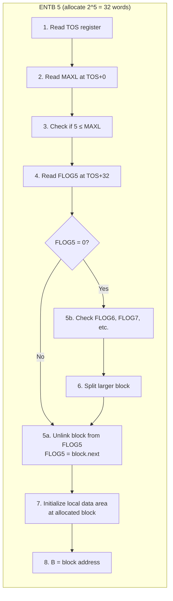

### Concrete Example: ENTB 5

**Before state:**
- B = 0x10000, B.SP = 0x11000
- TOS = 0x15000
- FLOG5 (at TOS+32 = 0x15020) = 0x20000 (free 32-word block)
- Block at 0x20000, word 0 = 0x20080 (next free block)

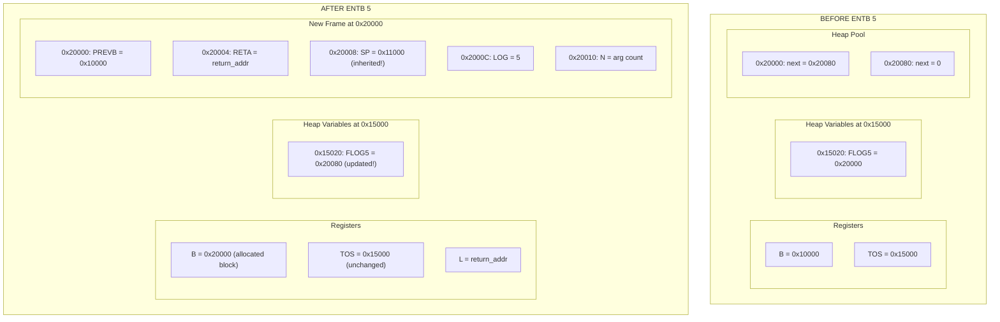

---

## GETB Instruction: Get Buddy Element

**Source:** ND-05.009.4 EN, Section 15.13 (Page 280)

### Assembly Format

```
Wn GETB <log size>
```

| Mnemonic | Hex code | Octal code |
|----------|----------|------------|
| W1 GETB | 0FE4CH | 177114B |
| W2 GETB | 0FE4DH | 177115B |
| W3 GETB | 0FE4EH | 177116B |
| W4 GETB | 0FE4FH | 177117B |

### Operation (from Manual)

> *"Allocate an element of size 2^`<log size>` words from the heap."*
> *"If an element of the given size is available, it is removed from the freelist and its address is returned to the specified register. Otherwise the list is examined for larger elements. If none are available, a stack overflow trap condition occurs. If a larger element is found, it is removed from its freelist and chopped into halves until an element of the desired size can be allocated. The other half of the chopped element(s) will be added to the appropriate freelists."*

### TOS Requirement (from Manual)

> *"When executing the GETB instruction, the TOS register must point to the variables describing the heap."*

### GETB Algorithm Flowchart

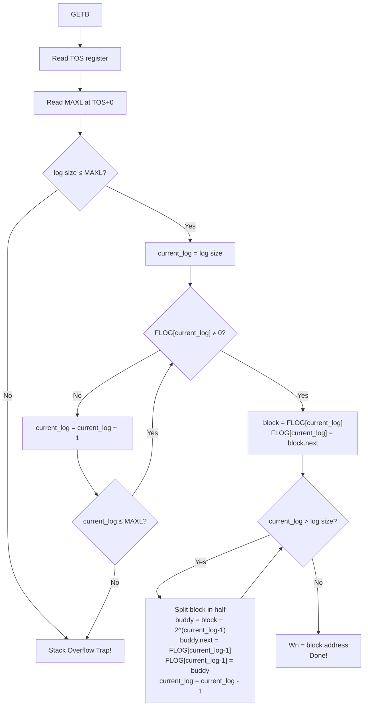

### Splitting Example

Request: `W3 GETB 4` (16 words), but only 64-word block available at FLOG6

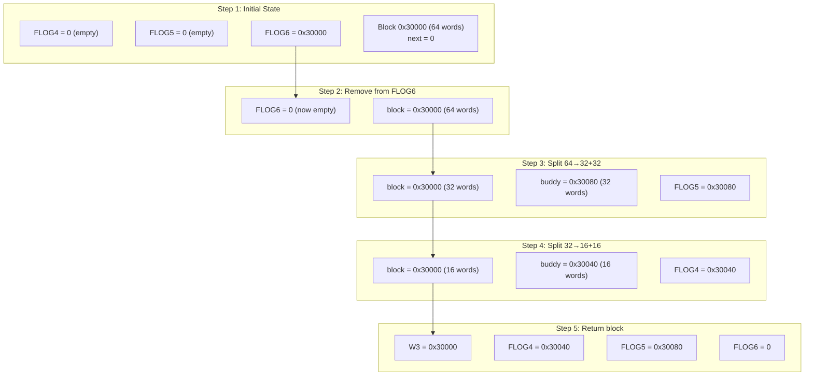

---

## FREEB Instruction: Free Buddy Element

**Source:** ND-05.009.4 EN, Section 15.14 (Page 281)

### Assembly Format

```
FREEB <log size>, <element>
```

| Mnemonic | Hex code | Octal code |
|----------|----------|------------|
| FREEB | 0FDB6H | 176666B |

### Operation (from Manual)

> *"The specified `<element>` is appended to the appropriate freelist of the heap. Elements are not combined; this may be done by a trap handler for the stack overflow condition."*

### TOS Requirement (from Manual)

> *"When executing the FREEB instruction, the TOS register must point to the variables describing the heap."*

### FREEB Algorithm

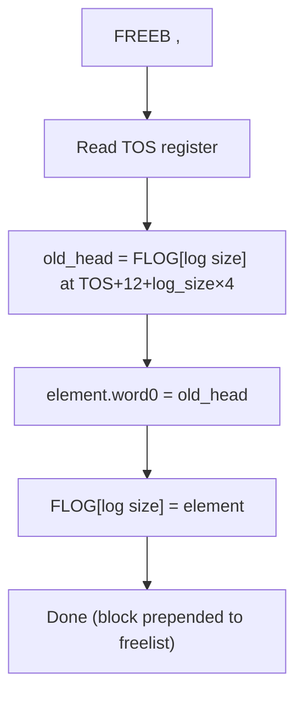

### Memory Operations

| Step | Memory Address | Operation | Value |
|------|----------------|-----------|-------|
| 1 | `TOS + 12 + log_size × 4` | Read | old FLOG head |
| 2 | `<element> + 0` | Write | old FLOG head (next pointer) |
| 3 | `TOS + 12 + log_size × 4` | Write | `<element>` address |

### Important: No Automatic Coalescing!

> *"Elements are not combined; this may be done by a trap handler for the stack overflow condition."*

The hardware does NOT merge buddies automatically. This is by design.

---

## RETB/RETBK Instructions: Return from Buddy Subroutine

**Source:** ND-05.009.4 EN, Section 13.11 (Page 238-239)

### Assembly Format

```
RETB      ; Clear K flag on return
RETBK     ; Set K flag on return (error return)
```

| Mnemonic | Hex code | Octal code | Description |
|----------|----------|------------|-------------|
| RETB | 0FE1CH | 177034B | Buddy subroutine return |
| RETBK | 0FE1DH | 177035B | Buddy subroutine **error** return |

### Description (from Manual)

> *"Return from subroutine using a heap element as local data area. The local data area is released to the heap described by the variables pointed at by the TOS register."*

### Trap Conditions (from Manual)

- Addressing traps
- Stack Underflow (STU)
- Branch Trap (BT)

### Data Status Bits

Unaffected

### Operation (Exact from Manual)

**RETB:**
```
Local data area released to heap
0 → STATUS.K
B.RETA → P → L
B.PREVB → B
```

**RETBK:**
```
Local data area released to heap
1 → STATUS.K
B.RETA → P → L
B.PREVB → B
```

### Operation Sequence

| Step | Operation | Description |
|------|-----------|-------------|
| 1 | Read `B.LOG` at `B + 12` | Get block size for FREEB |
| 2 | Read `B.PREVB` at `B + 0` | Get return B value |
| 3 | Read `B.RETA` at `B + 4` | Get return address |
| 4 | FREEB(B.LOG, B) | Release block to heap |
| 5 | `B.RETA → P` | Jump to return address |
| 6 | `B.RETA → L` | Update L register |
| 7 | `B.PREVB → B` | Restore previous B |
| 8 | `0/1 → STATUS.K` | Set/clear K flag |

### RETB Visualization

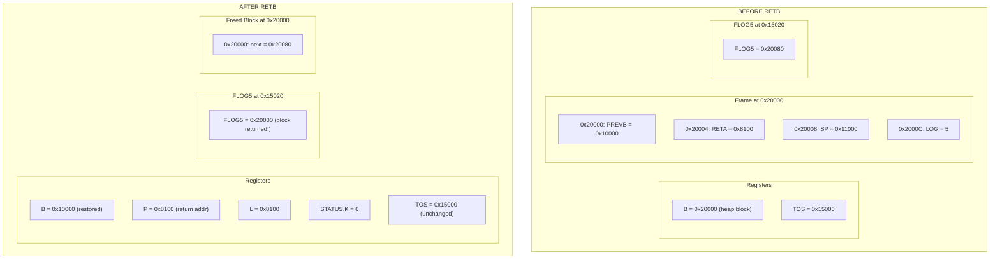

---

# COMPLETE SYSTEM DIAGRAM

## All Data Structures and Their Relationships

```mermaid
flowchart TB
    subgraph CPU["CPU Registers"]
        B["B Register"]
        TOS["TOS Register"]
        P["P (Program Counter)"]
        L["L (Link Register)"]
    end
    
    subgraph MEM["Memory"]
        subgraph STACK["Stack Area"]
            FRAME0["Main Frame<br/>(from INIT)"]
            FRAME1["Subroutine Frame 1<br/>(from ENTS)"]
            FRAME2["Subroutine Frame 2<br/>(from ENTS)"]
        end
        
        subgraph HEAPVARS["Heap Variables"]
            MAXL["MAXL"]
            STAH["STAH"]
            ENDH["ENDH"]
            FLOG0["FLOG0"]
            FLOG1["FLOG1"]
            FLOGN["FLOG..."]
        end
        
        subgraph HEAPPOOL["Heap Pool"]
            BUDDY1["Buddy Frame<br/>(from ENTB)"]
            FREE1["Free Block"]
            FREE2["Free Block"]
        end
    end
    
    B -->|"points to current frame"| FRAME2
    TOS -->|"points to"| MAXL
    
    FRAME2 -->|"PREVB"| FRAME1
    FRAME1 -->|"PREVB"| FRAME0
    
    FLOG1 -->|"head"| FREE1
    FREE1 -->|"next"| FREE2
    
    BUDDY1 -->|"PREVB"| FRAME1
    
    style TOS fill:#FFD700
    style B fill:#90EE90
    style HEAPVARS fill:#FFE4B5
    style HEAPPOOL fill:#E0FFE0
```

## Memory Address Flow Example

```mermaid
flowchart TB
    subgraph "Complete Memory Map Example"
        direction TB
        
        A1["0x10000: Main Frame (INIT)"]
        A2["├─ PREVB = 0"]
        A3["├─ RETA = 0"]
        A4["└─ SP = 0x11000"]
        
        B1["0x11000: Sub1 Frame (ENTS 0x200)"]
        B2["├─ PREVB = 0x10000"]
        B3["├─ RETA = addr1"]
        B4["└─ SP = 0x11200"]
        
        C1["0x11200: Sub2 Frame (ENTS 0x100)"]
        C2["├─ PREVB = 0x11000"]
        C3["├─ RETA = addr2"]
        C4["└─ SP = 0x11300 ← Current B.SP"]
        
        D1["0x11300 to 0x14FFF: Free Stack"]
        
        E1["0x15000: Heap Variables ← TOS"]
        E2["├─ MAXL = 7"]
        E3["├─ STAH = 0x20000"]
        E4["├─ ENDH = 0x40000"]
        E5["├─ FLOG0 = 0"]
        E6["├─ FLOG5 = 0x20000"]
        E7["└─ FLOG6 = 0x25000"]
        
        F1["0x20000: Free 32-word block"]
        F2["└─ next = 0x20080"]
        
        G1["0x20080: Free 32-word block"]
        G2["└─ next = 0"]
        
        H1["0x25000: Free 64-word block"]
        H2["└─ next = 0"]
        
        I1["0x30000: Buddy Frame (ENTB 5)"]
        I2["├─ PREVB = 0x11200"]
        I3["├─ RETA = addr3"]
        I4["├─ SP = 0x11300 (inherited!)"]
        I5["└─ LOG = 5 ← B points here"]
    end
    
    A1 --> B1
    B1 --> C1
    C1 --> D1
    D1 --> E1
    E1 --> F1
    F1 --> G1
    G1 --> H1
    H1 --> I1
    
    style E1 fill:#FFD700
    style I1 fill:#90EE90
```

---

# EMULATOR IMPLEMENTATION

## Data Structure Definitions (TypeScript)

```typescript
// Constants from ND-500 manual
const OFFSET_PREVB = 0;   // bytes
const OFFSET_RETA = 4;    // bytes
const OFFSET_SP = 8;      // bytes
const OFFSET_AUX_LOG = 12; // bytes
const OFFSET_N = 16;      // bytes
const OFFSET_ARGS = 20;   // bytes

// Heap variable offsets from TOS
const HEAP_OFFSET_MAXL = 0;   // bytes
const HEAP_OFFSET_STAH = 4;   // bytes
const HEAP_OFFSET_ENDH = 8;   // bytes
const HEAP_OFFSET_FLOG0 = 12; // bytes

// Calculate FLOG offset: TOS + 12 + (logSize * 4)
function getFlogOffset(logSize: number): number {
    return HEAP_OFFSET_FLOG0 + (logSize * 4);
}
```

## Memory Access Helpers

```typescript
class ND500Memory {
    private memory: DataView;
    
    // Read 32-bit word at byte address
    readWord(address: number): number {
        return this.memory.getUint32(address, false); // big-endian
    }
    
    // Write 32-bit word at byte address
    writeWord(address: number, value: number): void {
        this.memory.setUint32(address, value, false); // big-endian
    }
    
    // Read local data area field
    readLocalField(B: number, offset: number): number {
        return this.readWord(B + offset);
    }
    
    // Write local data area field
    writeLocalField(B: number, offset: number, value: number): void {
        this.writeWord(B + offset, value);
    }
    
    // Read heap variable
    readHeapVar(TOS: number, offset: number): number {
        return this.readWord(TOS + offset);
    }
    
    // Write heap variable
    writeHeapVar(TOS: number, offset: number, value: number): void {
        this.writeWord(TOS + offset, value);
    }
    
    // Read FLOG[n]
    readFLOG(TOS: number, logSize: number): number {
        return this.readHeapVar(TOS, getFlogOffset(logSize));
    }
    
    // Write FLOG[n]
    writeFLOG(TOS: number, logSize: number, value: number): void {
        this.writeHeapVar(TOS, getFlogOffset(logSize), value);
    }
}
```

## INIT Implementation

```typescript
executeINIT(bottomOfStack: number, mainStackDemand: number, 
            totalStackDemand: number): void {
    
    // Trap check: main demand must be less than total
    if (mainStackDemand >= totalStackDemand) {
        this.triggerTrap(TRAP_STACK_OVERFLOW);
        return;
    }
    
    // Operation sequence from manual:
    // <<bottom of stack>> -> B
    this.registers.B = bottomOfStack;
    
    // <<bottom of stack>> + <total system stack demand> -> TOS
    this.registers.TOS = bottomOfStack + totalStackDemand;
    
    // <<bottom of stack>> + <stack demand of main program> -> B.SP
    this.memory.writeLocalField(this.registers.B, OFFSET_SP, 
                                 bottomOfStack + mainStackDemand);
    
    // 0 -> B.PREVB
    this.memory.writeLocalField(this.registers.B, OFFSET_PREVB, 0);
    
    // 0 -> B.RETA -> L
    this.memory.writeLocalField(this.registers.B, OFFSET_RETA, 0);
    this.registers.L = 0;
}
```

## ENTS Implementation

```typescript
executeENTS(stackDemand: number, returnAddress: number,
            argCount: number, argAddresses: number[]): void {
    
    // Save old values
    const oldB = this.registers.B;
    const oldSP = this.memory.readLocalField(oldB, OFFSET_SP);
    
    // Trap check: new SP must be less than TOS
    const newSP = oldSP + stackDemand;
    if (newSP >= this.registers.TOS) {
        this.triggerTrap(TRAP_STACK_OVERFLOW);
        return;
    }
    
    // Operation sequence from manual:
    // B.SP -> B (new B = old stack pointer)
    const newB = oldSP;
    this.registers.B = newB;
    
    // oldB -> B.PREVB
    this.memory.writeLocalField(newB, OFFSET_PREVB, oldB);
    
    // return address -> B.RETA -> L
    this.memory.writeLocalField(newB, OFFSET_RETA, returnAddress);
    this.registers.L = returnAddress;
    
    // newB + <stack demand> -> B.SP
    this.memory.writeLocalField(newB, OFFSET_SP, newSP);
    
    // number of arguments -> B.N
    this.memory.writeLocalField(newB, OFFSET_N, argCount);
    
    // addresses of arguments -> B.ARG
    for (let i = 0; i < argCount; i++) {
        this.memory.writeWord(newB + OFFSET_ARGS + (i * 4), argAddresses[i]);
    }
    
    // Note: TOS is NOT modified
}
```

## ENTB Implementation

```typescript
executeENTB(logSize: number, returnAddress: number,
            argCount: number, argAddresses: number[]): void {
    
    // Allocate block from heap (this uses TOS internally)
    const blockAddress = this.allocateFromHeap(logSize);
    
    if (blockAddress === 0) {
        // Allocation failed - trap already triggered
        return;
    }
    
    // Save old values
    const oldB = this.registers.B;
    const oldSP = this.memory.readLocalField(oldB, OFFSET_SP);
    
    // Operation sequence from manual:
    // address of heap element -> B
    this.registers.B = blockAddress;
    
    // oldB -> B.PREVB
    this.memory.writeLocalField(blockAddress, OFFSET_PREVB, oldB);
    
    // oldB.SP -> B.SP (INHERITED - key difference from ENTS!)
    this.memory.writeLocalField(blockAddress, OFFSET_SP, oldSP);
    
    // return address -> B.RETA -> L
    this.memory.writeLocalField(blockAddress, OFFSET_RETA, returnAddress);
    this.registers.L = returnAddress;
    
    // log size -> B.LOG (crucial for RETB!)
    this.memory.writeLocalField(blockAddress, OFFSET_AUX_LOG, logSize);
    
    // number of arguments -> B.N
    this.memory.writeLocalField(blockAddress, OFFSET_N, argCount);
    
    // addresses of arguments -> B.ARG
    for (let i = 0; i < argCount; i++) {
        this.memory.writeWord(blockAddress + OFFSET_ARGS + (i * 4), argAddresses[i]);
    }
}

// Helper: Allocate from heap using buddy system
private allocateFromHeap(logSize: number): number {
    const TOS = this.registers.TOS;
    const MAXL = this.memory.readHeapVar(TOS, HEAP_OFFSET_MAXL);
    
    // Check valid size
    if (logSize > MAXL) {
        this.triggerTrap(TRAP_STACK_OVERFLOW);
        return 0;
    }
    
    // Search for available block
    let currentLog = logSize;
    while (currentLog <= MAXL) {
        const head = this.memory.readFLOG(TOS, currentLog);
        
        if (head !== 0) {
            // Found a block - unlink from freelist
            const nextBlock = this.memory.readWord(head);
            this.memory.writeFLOG(TOS, currentLog, nextBlock);
            
            // Split if we got a larger block
            while (currentLog > logSize) {
                currentLog--;
                const blockSizeWords = Math.pow(2, currentLog);
                const blockSizeBytes = blockSizeWords * 4;
                const buddyAddress = head + blockSizeBytes;
                
                // Add buddy to freelist
                const oldHead = this.memory.readFLOG(TOS, currentLog);
                this.memory.writeWord(buddyAddress, oldHead);
                this.memory.writeFLOG(TOS, currentLog, buddyAddress);
            }
            
            return head;
        }
        currentLog++;
    }
    
    // No block found
    this.triggerTrap(TRAP_STACK_OVERFLOW);
    return 0;
}
```

## GETB Implementation

```typescript
executeGETB(logSize: number, destRegister: number): void {
    const blockAddress = this.allocateFromHeap(logSize);
    
    if (blockAddress !== 0) {
        // Store address in destination register (W1-W4)
        this.registers.W[destRegister] = blockAddress;
    }
    // If allocation failed, trap was already triggered
}
```

## FREEB Implementation

```typescript
executeFREEB(logSize: number, elementAddress: number): void {
    const TOS = this.registers.TOS;
    
    // Get current freelist head
    const oldHead = this.memory.readFLOG(TOS, logSize);
    
    // Prepend element to freelist
    // element.word0 = old head (next pointer)
    this.memory.writeWord(elementAddress, oldHead);
    
    // FLOG[logSize] = element
    this.memory.writeFLOG(TOS, logSize, elementAddress);
    
    // Note: NO automatic coalescing per manual
}
```

## RETB/RETBK Implementation

```typescript
executeRETB(setKFlag: boolean): void {
    const B = this.registers.B;
    
    // Read local data area fields
    const prevB = this.memory.readLocalField(B, OFFSET_PREVB);
    const retAddr = this.memory.readLocalField(B, OFFSET_RETA);
    const logSize = this.memory.readLocalField(B, OFFSET_AUX_LOG);
    
    // Check for stack underflow (return past bottom)
    if (prevB === 0 && retAddr === 0) {
        this.handleStackUnderflow();
        return;
    }
    
    // Release block to heap
    this.executeFREEB(logSize, B);
    
    // Operation sequence from manual:
    // B.RETA -> P -> L
    this.registers.P = retAddr;
    this.registers.L = retAddr;
    
    // B.PREVB -> B
    this.registers.B = prevB;
    
    // Set/clear K flag
    this.registers.STATUS_K = setKFlag ? 1 : 0;
}
```

---

# REFERENCE TABLES

## Instruction Summary

| Instruction | Opcode (Hex) | Opcode (Octal) | TOS Read | TOS Write | Heap Access |
|-------------|--------------|----------------|----------|-----------|-------------|
| INIT | 0DCH | 334B | No | **Yes** | No |
| ENTS | 0B8H | 270B | Yes (check) | No | No |
| ENTB | 0BDH | 275B | **Yes** | No | **Read+Write** |
| RETB | 0FE1CH | 177034B | **Yes** | No | **Write** |
| RETBK | 0FE1DH | 177035B | **Yes** | No | **Write** |
| Wn GETB | 0FE4C+(n-1) | 177114B+(n-1) | **Yes** | No | **Read+Write** |
| FREEB | 0FDB6H | 176666B | **Yes** | No | **Write** |

## Memory Offset Summary

### Local Data Area (B register base)

| Offset (bytes) | Symbol | Written by INIT | Written by ENTS | Written by ENTB |
|----------------|--------|-----------------|-----------------|-----------------|
| 0 | PREVB | 0 | oldB | oldB |
| 4 | RETA | 0 | return addr | return addr |
| 8 | SP | bottom + main_demand | newB + stack_demand | **oldB.SP** |
| 12 | AUX/LOG | - | - | **log size** |
| 16 | N | - | arg count | arg count |
| 20+ | args | - | arg addresses | arg addresses |

### Heap Variables (TOS register base)

| Offset (bytes) | Symbol | Description |
|----------------|--------|-------------|
| 0 | MAXL | Maximum log size |
| 4 | STAH | Start of heap (informational) |
| 8 | ENDH | End of heap (informational) |
| 12 | FLOG0 | Freelist for 1-word blocks |
| 16 | FLOG1 | Freelist for 2-word blocks |
| 12 + n×4 | FLOGn | Freelist for 2^n-word blocks |

---

## References

- **ND-05.009.4 EN**: ND-500 Reference Manual
  - Section 3.3: Heap Allocation (Pages 34-35)
  - Section 13.9: Initialize Stack - INIT (Page 229)
  - Section 13.10: Subroutine Entry Points - ENTS, ENTB (Pages 233, 237)
  - Section 13.11: Subroutine Return - RETB, RETBK (Pages 238-239)
  - Section 15.13: Get Buddy Element - GETB (Page 280)
  - Section 15.14: Free Buddy Element - FREEB (Page 281)

- **ND-60.113.02 EN**: ND-500 Assembler Reference Manual
  - Buddy instruction opcodes (Page 84)

---

# CRITICAL: MEMORY ALLOCATION AND INITIALIZATION

## Who Allocates the Stack Memory?

**The CPU does NOT allocate stack memory.** The stack lives in a memory segment that must be set up BEFORE INIT is called.

### SINTRAN Monitor Call: GSWSP (MON 422B / 274 decimal)

The operating system (SINTRAN) allocates memory segments via monitor calls. The key call for stack/heap allocation is:

| Field | Value |
|-------|-------|
| **MON Number** | 422B (octal) / 274 (decimal) |
| **Name** | GSWSP |
| **Long Name** | GetScratchSegment |
| **Description** | Connects an empty data segment to the user's domain and reserves space for it on the swap file |

**Parameters:**

| Direction | Name | Type | Description |
|-----------|------|------|-------------|
| [I] | SizeInBytes | INTEGER | Segment size in bytes |
| [I] | LogSegmentNo | INTEGER | Logical segment number to use (0 = system selects) |
| [O] | RetLogSegmentNo | INTEGER | Returns the logical segment number actually selected |

### Complete Stack/Heap Setup Sequence

```mermaid
sequenceDiagram
    participant Program as User Program
    participant OS as SINTRAN (OS)
    participant MMU as Memory Management
    participant CPU as CPU
    participant Memory as Physical Memory
    
    Note over Program,Memory: PHASE 1: Segment Allocation (OS Level)
    
    Program->>OS: MON 422B (GSWSP)<br/>SizeInBytes = 0x50000<br/>LogSegmentNo = 0
    OS->>MMU: Allocate segment entry in PST
    OS->>MMU: Set up capability in domain table
    OS->>Memory: Reserve swap space
    OS->>Program: RetLogSegmentNo = 5 (example)
    
    Note over Program,Memory: Segment 5 now exists, mapped to logical address 0x0A000000
    
    Note over Program,Memory: PHASE 2: Stack Initialization (CPU Level)
    
    Program->>CPU: INIT 0x0A010000, 0x1000, 0x5000
    CPU->>Memory: Write PREVB=0, RETA=0, SP
    CPU->>CPU: B = 0x0A010000
    CPU->>CPU: TOS = 0x0A015000
    CPU->>CPU: L = 0
    
    Note over Program,Memory: PHASE 3: Heap Variable Setup (User Code)
    
    Program->>Memory: Write MAXL at TOS+0
    Program->>Memory: Write STAH, ENDH
    Program->>Memory: Write FLOG0..FLOGn
    Program->>Memory: Link free blocks
    
    Note over Program,Memory: NOW ready for ENTS, ENTB, GETB, FREEB!
```

### Address Calculation Example

If GSWSP returns segment 5, and ND-500 uses 5-bit segment numbers in the high bits:

| Component | Bits | Value |
|-----------|------|-------|
| Segment number | 31:27 | 5 (binary: 00101) |
| Segment offset | 26:0 | 0x0000000 (start of segment) |
| **Logical address** | 31:0 | **0x0A000000** |

Then for INIT:
- `<<bottom of stack>>` = 0x0A010000 (offset 0x10000 into segment)
- TOS will be at 0x0A015000
- Heap pool might start at 0x0A020000

### Memory Hierarchy

```mermaid
flowchart TB
    subgraph "Memory Allocation Responsibility"
        direction TB
        
        OS["Operating System (SINTRAN)"]
        SEG["Allocates SEGMENTS to processes"]
        DOM["Sets up DOMAINS with capability tables"]
        
        PROG["User Program / Compiler"]
        INIT_CALL["Calls INIT with addresses within allocated segment"]
        HEAP_INIT["Initializes heap variables at TOS"]
        
        CPU["CPU Hardware"]
        REGS["Sets B, TOS, B.SP registers"]
        WRITES["Writes PREVB=0, RETA=0 to memory"]
        
        OS --> SEG
        SEG --> DOM
        DOM --> PROG
        PROG --> INIT_CALL
        INIT_CALL --> CPU
        CPU --> REGS
        REGS --> WRITES
        WRITES --> PROG
        PROG --> HEAP_INIT
    end
```

### The Address Translation System

The `<<bottom of stack>>` address in INIT is a **logical address** (32-bit). The memory management system translates it:

```mermaid
flowchart LR
    subgraph "Logical Address (32 bits)"
        SEG_NUM["Segment<br/>5 bits"]
        SEG_ADDR["Segment-relative address<br/>27 bits"]
    end
    
    subgraph "Translation"
        CAP["Capability Table<br/>(in Domain Info Table)"]
        PST["Physical Segment Table"]
        IDX["Index Tables A/B"]
    end
    
    subgraph "Physical Address"
        PHYS["Physical page + offset"]
        RAM["Actual RAM location"]
    end
    
    SEG_NUM --> CAP
    CAP --> PST
    SEG_ADDR --> IDX
    PST --> IDX
    IDX --> PHYS
    PHYS --> RAM
```

### What Happens at Each Level

| Level | Responsibility | When |
|-------|----------------|------|
| **Operating System** | Allocates physical memory, creates segments, sets up PST entries, creates domain with capability tables | Before program starts |
| **Loader/Runtime** | Knows segment addresses, calculates stack bottom address | Program load time |
| **INIT instruction** | Sets B, TOS, B.SP registers; writes PREVB=0, RETA=0 to memory | Runtime |
| **User code** | Initializes heap variables at TOS | After INIT, before buddy instructions |

---

## What Initializes Memory at TOS? (Heap Variables)

### Critical: The CPU Does NOT Initialize Heap Variables!

> *"The heap variables must be initialized by the user program and the user is responsible for building the lists."*
> — ND-05.009.4 EN, Section 3.3

**INIT only does these things:**
1. Sets `B = <<bottom of stack>>`
2. Sets `TOS = <<bottom of stack>> + <total system stack demand>`
3. Sets `B.SP = <<bottom of stack>> + <stack demand of main program>`
4. Writes `0` to `B.PREVB` (memory at B+0)
5. Writes `0` to `B.RETA` (memory at B+4)
6. Sets `L = 0`

**INIT does NOT:**
- Initialize memory at TOS
- Set up MAXL
- Set up STAH or ENDH
- Create any freelists (FLOGs)
- Allocate any heap blocks

### Heap Variable Initialization Sequence

```mermaid
sequenceDiagram
    participant OS as Operating System
    participant Loader as Program Loader
    participant Program as User Program
    participant CPU as CPU
    participant Memory as Memory
    
    OS->>Memory: Allocate segment for stack/heap
    OS->>Loader: Load program into segment
    
    Loader->>Program: Start execution
    
    Program->>CPU: INIT bottom, main_demand, total_demand
    CPU->>Memory: Write PREVB=0, RETA=0, SP
    CPU->>CPU: Set B, TOS, L registers
    
    Note over Program,Memory: INIT complete - TOS points to uninitialized memory!
    
    Program->>Memory: Write MAXL at TOS+0
    Program->>Memory: Write STAH at TOS+4
    Program->>Memory: Write ENDH at TOS+8
    Program->>Memory: Write FLOG0 at TOS+12
    Program->>Memory: Write FLOG1 at TOS+16
    Program->>Memory: ... (initialize all FLOGs)
    Program->>Memory: Build initial freelist (link free blocks)
    
    Note over Program,Memory: NOW heap is ready for GETB/ENTB!
```

### Example: Complete Stack and Heap Setup

```
; Assume OS allocated segment 5 for our data, starting at logical address 0x00000000
; We want:
;   - Stack from 0x10000 to 0x14FFF (main program uses 0x1000 bytes)
;   - Heap variables at 0x15000
;   - Heap pool from 0x20000 to 0x40000

; Step 1: Initialize stack (CPU does this)
INIT 0x10000, 0x1000, 0x5000    ; B=0x10000, TOS=0x15000, B.SP=0x11000

; Step 2: Initialize heap variables (USER CODE must do this!)
W1 := 7                         ; MAXL = 7 (max 128 words)
W1 =: IND(TOS)                  ; Write to TOS+0

W1 := 0x20000                   ; STAH = heap pool start
W1 =: IND(TOS+4)                ; Write to TOS+4

W1 := 0x40000                   ; ENDH = heap pool end
W1 =: IND(TOS+8)                ; Write to TOS+8

; Initialize all FLOGs to 0 (empty)
W1 := 0
W1 =: IND(TOS+12)               ; FLOG0 = 0
W1 =: IND(TOS+16)               ; FLOG1 = 0
W1 =: IND(TOS+20)               ; FLOG2 = 0
W1 =: IND(TOS+24)               ; FLOG3 = 0
W1 =: IND(TOS+28)               ; FLOG4 = 0
W1 =: IND(TOS+32)               ; FLOG5 = 0
W1 =: IND(TOS+36)               ; FLOG6 = 0

; Initialize FLOG7 with first free block
W1 := 0x20000                   ; Address of first 128-word block
W1 =: IND(TOS+40)               ; FLOG7 = 0x20000

; Initialize free block linked list
W1 := 0x20200                   ; Address of second 128-word block
W1 =: IND(0x20000)              ; First block points to second

W1 := 0                         ; End of list
W1 =: IND(0x20200)              ; Second block points to NULL

; NOW the buddy system is ready to use!
```

---

## Stack Allocation and Freeing

### How Stack Frames Are Allocated (ENTS)

Stack frames are allocated by **advancing B.SP**:

```mermaid
flowchart TB
    subgraph "ENTS Stack Allocation"
        direction TB
        
        BEFORE["BEFORE: B.SP = 0x11000"]
        
        ENTS["ENTS 0x100 (256 bytes)"]
        
        AFTER["AFTER:<br/>new B = old B.SP = 0x11000<br/>new B.SP = 0x11100"]
        
        CHECK{"new B.SP < TOS?"}
        
        OK["Allocation succeeds"]
        TRAP["STO Trap!"]
    end
    
    BEFORE --> ENTS
    ENTS --> CHECK
    CHECK -->|"Yes"| OK
    CHECK -->|"No"| TRAP
```

**Key insight:** Stack allocation is just pointer arithmetic! The memory already exists (allocated by OS).

### How Stack Frames Are Freed (RET)

Stack frames are freed by **restoring B from PREVB**:

```mermaid
flowchart TB
    subgraph "RET Stack Deallocation"
        direction TB
        
        BEFORE["BEFORE:<br/>B = 0x11000<br/>B.PREVB = 0x10000"]
        
        RET["RET"]
        
        AFTER["AFTER:<br/>B = 0x10000 (from PREVB)<br/>(old frame is now 'free')"]
    end
    
    BEFORE --> RET --> AFTER
```

**Key insight:** Stack "freeing" is just restoring the B register! The memory isn't zeroed or returned to OS - it's just available for the next ENTS to overwrite.

### Stack vs Heap: Memory Lifecycle Comparison

| Aspect | Stack (ENTS/RET) | Heap (ENTB/RETB, GETB/FREEB) |
|--------|------------------|------------------------------|
| **Allocation** | Advance B.SP pointer | Unlink from freelist |
| **Deallocation** | Restore B from PREVB | Prepend to freelist |
| **Order constraint** | LIFO (last in, first out) | Any order |
| **Memory source** | Contiguous area below TOS | Blocks from heap pool |
| **Overflow check** | B.SP ≥ TOS | Freelist empty |
| **Memory reuse** | Automatic (LIFO) | Requires FREEB |

---

## Memory Layout: The Complete Picture

```mermaid
flowchart TB
    subgraph "Complete Memory Layout"
        direction TB
        
        subgraph SEG["Data Segment (allocated by OS)"]
            direction TB
            
            LOW["Low addresses"]
            
            subgraph STATIC["Static Data Area"]
                SD["Global variables<br/>Constants<br/>Static arrays"]
            end
            
            subgraph STACK["Stack Area"]
                MAIN_FRAME["Main frame (B after INIT)"]
                SUB_FRAMES["Subroutine frames<br/>(grow upward via ENTS)"]
                FREE_STACK["Free stack space"]
            end
            
            TOS_LINE["═══ TOS ═══"]
            
            subgraph HEAP_VARS["Heap Variables"]
                HV["MAXL, STAH, ENDH<br/>FLOG0..FLOG<MAXL>"]
            end
            
            subgraph HEAP_POOL["Heap Pool"]
                BUDDY_FRAMES["Buddy frames (ENTB)"]
                FREE_BLOCKS["Free blocks (linked lists)"]
                GETB_BLOCKS["GETB allocated blocks"]
            end
            
            HIGH["High addresses"]
        end
    end
    
    LOW --> STATIC
    STATIC --> STACK
    STACK --> TOS_LINE
    TOS_LINE --> HEAP_VARS
    HEAP_VARS --> HEAP_POOL
    HEAP_POOL --> HIGH
    
    style TOS_LINE fill:#FFD700,stroke:#000,stroke-width:3px
```

---

## For Emulator Developers: Address Space Handling

### Option 1: Flat Memory Array (Simple Emulator)

```typescript
class SimpleND500Memory {
    // Single flat array - ignore segments/domains
    private memory: Uint8Array;
    
    constructor(size: number) {
        this.memory = new Uint8Array(size);
    }
    
    // Direct address access
    readWord(address: number): number {
        return (this.memory[address] << 24) |
               (this.memory[address + 1] << 16) |
               (this.memory[address + 2] << 8) |
               this.memory[address + 3];
    }
}
```

### Option 2: Segmented Memory (Accurate Emulator)

```typescript
class SegmentedND500Memory {
    private segments: Map<number, Uint8Array>;
    private capabilityTable: Map<number, number>; // segment -> PST entry
    
    // Logical address translation
    readWord(logicalAddress: number): number {
        const segmentNum = (logicalAddress >> 27) & 0x1F;
        const offset = logicalAddress & 0x07FFFFFF;
        
        const segment = this.segments.get(segmentNum);
        if (!segment) {
            this.triggerTrap(TRAP_ADDRESS_FETCH);
            return 0;
        }
        
        // Check bounds, permissions, etc.
        return this.readWordFromSegment(segment, offset);
    }
}
```

### What the Emulator Must Track

| Component | Description |
|-----------|-------------|
| **B register** | Current local data area base |
| **TOS register** | Points to heap variables; stack overflow boundary |
| **Memory array** | The actual memory contents |
| **Segment tables** (optional) | For accurate memory protection emulation |

---

# DEEP ANALYSIS AND INSIGHTS

## Status Bits Affected by Buddy Instructions

The ND-500 status register has 64 bits. The buddy instructions affect specific status bits:

### STO - Stack Overflow Status Bit

> *"The STO status bit is set/reset for each ENTS, ENTSN, ENTB, INIT, ENTM and GETB instruction."*
> — ND-05.009.4 EN, Section 6.5.3.1

| Instruction | STO is SET when... |
|-------------|-------------------|
| **INIT** | `<stack demand of main program>` ≥ `<total system stack demand>` |
| **ENTM** | `<stack demand of main program>` ≥ `<total system stack demand>` |
| **ENTS/ENTSN** | `B.SP` (new value) ≥ `TOS` |
| **ENTB** | No free block of requested size or larger exists |
| **GETB** | No free block of requested size or larger exists, OR `<log size>` > MAXL |

### STU - Stack Underflow Status Bit

> *"Performing a subroutine return instruction with RETA, PREVB or both equal to zero leads to a STack Underflow trap condition if there is no alternative domain (CAD zero or equal to CED)."*
> — ND-05.009.4 EN, Section 6.5.3.1

| Instruction | STU is SET when... |
|-------------|-------------------|
| **RET/RETK** | B.RETA = 0 OR B.PREVB = 0, AND no alternative domain |
| **RETB/RETBK** | B.RETA = 0 OR B.PREVB = 0, AND no alternative domain |

### BT - Branch Trap Status Bit

RETB and RETBK can trigger BT (Branch Trap) because they change the program counter to a non-sequential address.

### Complete Status Bits Summary

| Instruction | Trap Conditions | Status Bits Affected |
|-------------|-----------------|---------------------|
| **INIT** | STO, Addressing | STO set/reset |
| **ENTS** | STO, ISE, Addressing | STO set/reset |
| **ENTB** | STO, ISE, Addressing | STO set/reset |
| **GETB** | STO, Addressing | STO set/reset |
| **FREEB** | Addressing | None (data status unaffected) |
| **RETB/RETBK** | STU, BT, Addressing | K flag set/cleared |

---

## Stack Overflow Trap Handler Use Case

The manual explicitly describes using the stack overflow trap handler for heap management:

> *"The STAH and ENDH variables are not used by the heap instructions, but are available for a heap administration routine implemented as a trap handler for the stack overflow trap."*
> — ND-05.009.4 EN, Section 3.3

> *"The stack overflow trap is used to signal that all lists containing blocks of wanted size or larger are empty."*
> — ND-05.009.4 EN, Section 3.3

### Trap Handler Strategy

```mermaid
flowchart TB
    subgraph "Stack Overflow Trap Handler for Buddy System"
        TRAP["STO Trap Triggered"]
        CHECK["Check: Was it GETB/ENTB?"]
        
        CHECK -->|"Yes"| ANALYZE["Analyze heap state"]
        CHECK -->|"No (ENTS)"| STACK_FULL["Stack is full - error"]
        
        ANALYZE --> OPTION1["Option 1: Coalesce buddies"]
        ANALYZE --> OPTION2["Option 2: Allocate more from STAH-ENDH"]
        ANALYZE --> OPTION3["Option 3: Return error to caller"]
        
        OPTION1 --> RETRY["Retry allocation"]
        OPTION2 --> RETRY
        OPTION3 --> FAIL["Signal failure"]
        
        RETRY --> SUCCESS{"Success?"}
        SUCCESS -->|"Yes"| RETURN["Return to instruction"]
        SUCCESS -->|"No"| FAIL
    end
```

### Coalescing Buddies in Trap Handler

Since FREEB does NOT automatically combine buddies, a trap handler can implement coalescing:

```mermaid
flowchart TB
    subgraph "Buddy Coalescing Algorithm"
        START["For each FLOG[n] from 0 to MAXL-1"]
        
        SCAN["Scan freelist for adjacent buddies"]
        
        FOUND{"Found two<br/>buddies?"}
        
        REMOVE["Remove both from FLOG[n]"]
        COMBINE["Combine into one block<br/>size = 2^(n+1)"]
        ADD["Add to FLOG[n+1]"]
        
        NEXT["Next FLOG level"]
        DONE["Done coalescing"]
    end
    
    START --> SCAN
    SCAN --> FOUND
    FOUND -->|"Yes"| REMOVE
    REMOVE --> COMBINE
    COMBINE --> ADD
    ADD --> SCAN
    FOUND -->|"No"| NEXT
    NEXT --> DONE
```

### Buddy Address Calculation

Two blocks are buddies if:
1. They are the same size (2^n words)
2. They were originally split from the same parent block

**Buddy address formula:**
```
buddy_address = block_address XOR (block_size_in_bytes)
```

Example: Block at 0x20000, size 32 words (128 bytes = 0x80):
```
buddy = 0x20000 XOR 0x80 = 0x20080
```

---

## Co-routine Warning: Deep Analysis

> *"If ENTB is used to allocate space for co-routines, care should be exercised if the called routines make further calls to stack routines. When co-routines use a common stack and a second co-routine is activated before the return, the stack areas will overlap because B.SP is the same in both routines."*
> — ND-05.009.4 EN, Section 3.3

### The Problem Visualized

```mermaid
flowchart TB
    subgraph "The Co-routine Stack Overlap Problem"
        direction TB
        
        MAIN["Main Program<br/>B = 0x10000<br/>B.SP = 0x11000"]
        
        CO1["Co-routine 1 (ENTB 5)<br/>B = 0x20000 (heap)<br/>B.SP = 0x11000 (inherited!)"]
        
        CO2["Co-routine 2 (ENTB 5)<br/>B = 0x20080 (heap)<br/>B.SP = 0x11000 (SAME!)"]
        
        STACK1["Co-routine 1 calls ENTS<br/>New frame at 0x11000"]
        
        STACK2["Co-routine 2 calls ENTS<br/>New frame at 0x11000<br/>OVERWRITES Co-routine 1's frame!"]
        
        CRASH["DATA CORRUPTION!"]
    end
    
    MAIN --> CO1
    MAIN --> CO2
    CO1 --> STACK1
    CO2 --> STACK2
    STACK1 --> CRASH
    STACK2 --> CRASH
    
    style CRASH fill:#ff0000,color:#ffffff
```

### Why This Happens

1. ENTB **inherits** `oldB.SP` instead of advancing it
2. Both co-routines have the **same B.SP value**
3. If either calls an ENTS routine, it will allocate stack at B.SP
4. The second co-routine's ENTS call overwrites the first's stack frame

### Solutions (from Manual)

> *"No problems will occur if all routines in the system are entered through ENTB or if the stack routine is certain to terminate before another co-routine is activated. (Standard library routines may be used freely; they will not cause activation of other co-routines.)"*

| Solution | Description |
|----------|-------------|
| **All ENTB** | Use only buddy allocation for all routines |
| **Sequential execution** | Ensure stack routines complete before switching co-routines |
| **Separate stacks** | Give each co-routine its own stack (different TOS) |

---

## Design Decisions and Rationale

### Why No Automatic Coalescing?

The buddy system deliberately does NOT coalesce blocks in hardware:

> *"A released element will be linked to the appropriate freelist according to the size of the element. Elements are not combined; this may be done by the trap handler for the stack overflow trap condition."*

**Rationale:**
1. **Performance**: FREEB is O(1) - just prepend to list
2. **Flexibility**: Trap handler can implement custom coalescing policy
3. **Simplicity**: Hardware implementation is simpler
4. **Lazy coalescing**: Only coalesce when actually needed (out of memory)

### Why Power-of-2 Block Sizes?

All buddy block sizes are 2^n:

**Rationale:**
1. **Fast splitting**: Divide by 2 is a right-shift
2. **Easy buddy calculation**: XOR with size gives buddy address
3. **Alignment**: Natural word/cache line alignment
4. **Simple freelists**: Fixed number of lists (MAXL + 1)

### Why Inherit B.SP in ENTB?

ENTB sets `newB.SP = oldB.SP` instead of advancing:

**Rationale:**
1. **Heap blocks aren't on the stack**: No need to reserve stack space
2. **Stack can be shared**: Multiple buddy routines can share common stack
3. **Independence**: Buddy routines don't consume stack space

---

## Edge Cases and Error Handling

### Edge Case 1: MAXL = 0

If MAXL = 0, only 1-word blocks can be allocated.
- GETB 0 works (if FLOG0 has blocks)
- GETB 1 triggers STO trap (log size > MAXL)

### Edge Case 2: Empty Heap

If all FLOGs are 0:
- GETB/ENTB immediately triggers STO trap
- Trap handler must add blocks or fail

### Edge Case 3: Fragmentation

After many allocations/frees without coalescing:
- Many small blocks, no large blocks
- GETB for large size fails even though total free memory is sufficient
- Trap handler should coalesce

### Edge Case 4: Corrupted LOG Value

If B.LOG (offset 12) is corrupted before RETB:
- RETB will FREEB with wrong size
- Block added to wrong freelist
- Memory corruption!

**Emulator recommendation:** Validate LOG value is ≤ MAXL before FREEB.

### Edge Case 5: RETB After RET

If programmer mistakenly uses RETB after ENTS:
- Stack frame address (not heap) added to freelist
- Future GETB returns stack address as "free block"
- Severe memory corruption!

**Emulator recommendation:** Track which frames are heap vs stack.

---

## Performance Characteristics

### Time Complexity

| Operation | Best Case | Worst Case | Notes |
|-----------|-----------|------------|-------|
| **GETB** (exact size available) | O(1) | O(1) | Just unlink from freelist |
| **GETB** (need splitting) | O(1) | O(MAXL) | May split up to MAXL times |
| **FREEB** | O(1) | O(1) | Just prepend to freelist |
| **ENTB** | Same as GETB | Same as GETB | Allocates then initializes |
| **RETB** | O(1) | O(1) | FREEB then return |

### Memory Overhead

| Overhead Type | Amount | Notes |
|---------------|--------|-------|
| **Per heap** | 12 + (MAXL+1)×4 bytes | Heap variables at TOS |
| **Per free block** | 0 extra | First word reused as next pointer |
| **Per allocated block** | 0 extra | Size stored in B.LOG, not block |
| **Internal fragmentation** | Up to 50% | Power-of-2 rounding |

### Memory Utilization

Worst case internal fragmentation: Request 2^n + 1 words → Allocate 2^(n+1) words → ~50% waste

---

## Emulator Implementation Checklist

### Required State

- [ ] TOS register (points to heap variables)
- [ ] B register (points to current local data area)
- [ ] Memory array (for heap pool and stack)
- [ ] STATUS.STO bit
- [ ] STATUS.STU bit
- [ ] STATUS.K flag

### INIT Implementation Checklist

- [ ] Check: main_demand < total_demand (else STO trap)
- [ ] Write: B = bottom_of_stack
- [ ] Write: TOS = bottom_of_stack + total_demand
- [ ] Write: Memory[B+0] = 0 (PREVB)
- [ ] Write: Memory[B+4] = 0 (RETA)
- [ ] Write: Memory[B+8] = bottom_of_stack + main_demand (SP)
- [ ] Write: L = 0
- [ ] Clear: STO status bit (if successful)

### GETB Implementation Checklist

- [ ] Read: MAXL from TOS+0
- [ ] Check: log_size ≤ MAXL (else STO trap)
- [ ] Search: FLOG[log_size] through FLOG[MAXL]
- [ ] If found: Unlink block from freelist
- [ ] If larger: Split repeatedly, add buddies to freelists
- [ ] If not found: Set STO, trigger trap
- [ ] Write: Wn = block address
- [ ] Set/Clear: STO status bit

### FREEB Implementation Checklist

- [ ] Read: old_head from FLOG[log_size]
- [ ] Write: block.word0 = old_head
- [ ] Write: FLOG[log_size] = block
- [ ] Note: NO coalescing!

### ENTB Implementation Checklist

- [ ] Allocate: block via GETB logic (may trap)
- [ ] Save: oldB, oldB.SP
- [ ] Write: Memory[block+0] = oldB (PREVB)
- [ ] Write: Memory[block+4] = return_address (RETA)
- [ ] Write: Memory[block+8] = oldB.SP (SP - inherited!)
- [ ] Write: Memory[block+12] = log_size (LOG - critical!)
- [ ] Write: Memory[block+16] = arg_count (N)
- [ ] Write: Memory[block+20+] = arg_addresses
- [ ] Write: B = block
- [ ] Write: L = return_address

### RETB Implementation Checklist

- [ ] Read: log_size from B+12 (LOG)
- [ ] Read: prevB from B+0 (PREVB)
- [ ] Read: retAddr from B+4 (RETA)
- [ ] Check: (prevB=0 AND retAddr=0) → STU trap
- [ ] FREEB: Release B to FLOG[log_size]
- [ ] Write: B = prevB
- [ ] Write: P = retAddr
- [ ] Write: L = retAddr
- [ ] Write: STATUS.K = 0 (RETB) or 1 (RETBK)

---

## Complete Instruction Lifecycle Diagram

```mermaid
stateDiagram-v2
    [*] --> Uninitialized: Power On
    
    Uninitialized --> MainInitialized: INIT
    note right of MainInitialized
        B points to main frame
        TOS points to heap vars location
        User must init heap vars!
    end note
    
    MainInitialized --> HeapReady: User initializes MAXL, FLOGs
    
    HeapReady --> StackRoutine: ENTS (stack)
    HeapReady --> BuddyRoutine: ENTB (heap)
    HeapReady --> ElementAllocated: GETB
    
    StackRoutine --> HeapReady: RET/RETK
    StackRoutine --> StackRoutine: Nested ENTS
    StackRoutine --> BuddyRoutine: ENTB from stack routine
    
    BuddyRoutine --> HeapReady: RETB/RETBK
    BuddyRoutine --> BuddyRoutine: Nested ENTB
    BuddyRoutine --> StackRoutine: ENTS from buddy routine ⚠️
    BuddyRoutine --> ElementAllocated: GETB
    
    ElementAllocated --> HeapReady: FREEB
    ElementAllocated --> ElementAllocated: More GETB
    
    HeapReady --> TrapHandler: STO (no memory)
    StackRoutine --> TrapHandler: STO (stack full)
    BuddyRoutine --> TrapHandler: STO (heap full)
    ElementAllocated --> TrapHandler: STO (heap full)
    
    TrapHandler --> HeapReady: Add memory / Coalesce
    TrapHandler --> [*]: Unrecoverable error
    
    note right of StackRoutine
        ⚠️ ENTS from buddy routine:
        Uses inherited B.SP
        May overlap with other co-routines!
    end note
```

---

## Glossary

| Term | Definition |
|------|------------|
| **Buddy** | Two blocks of equal size that were split from the same parent block |
| **Coalescing** | Combining two buddy blocks back into their parent |
| **FLOG** | Freelist head pointer for blocks of a specific log size |
| **Freelist** | Linked list of free blocks (same size) |
| **Heap** | Memory pool managed by buddy system |
| **Log size** | log₂ of block size in words |
| **MAXL** | Maximum log size allowed (limits largest allocatable block) |
| **STO** | Stack Overflow trap/status bit |
| **STU** | Stack Underflow trap/status bit |
| **TOS** | Top of Stack register (points to heap variables) |
