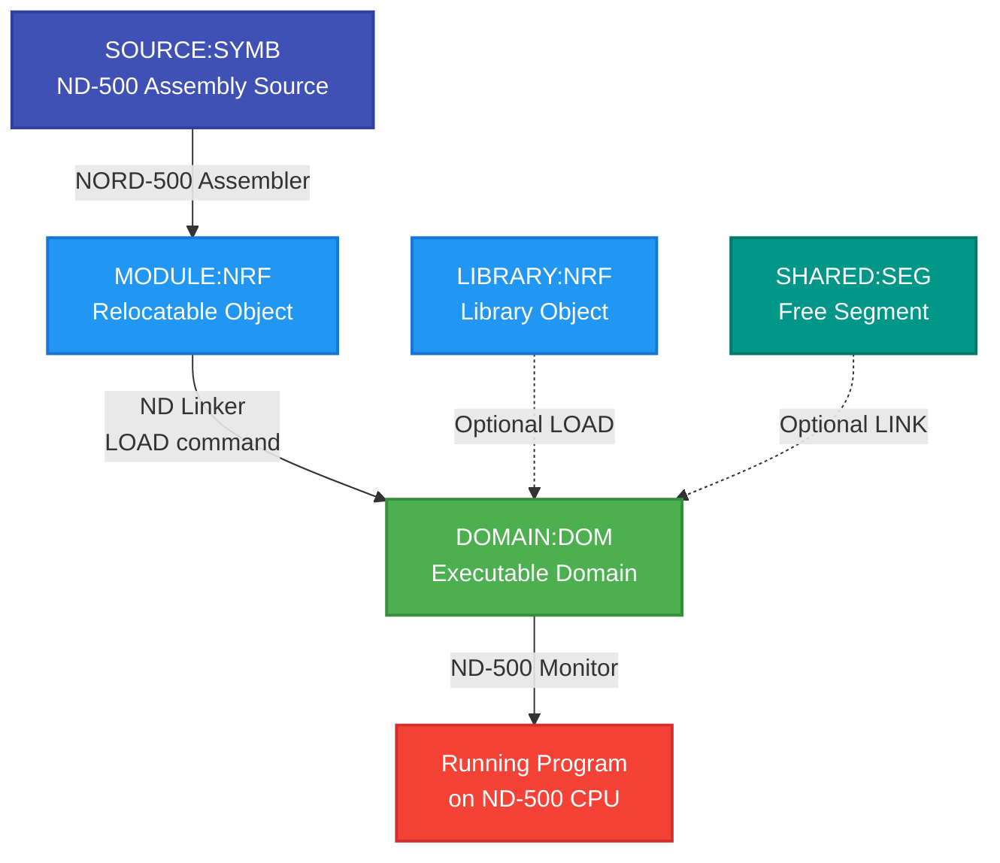
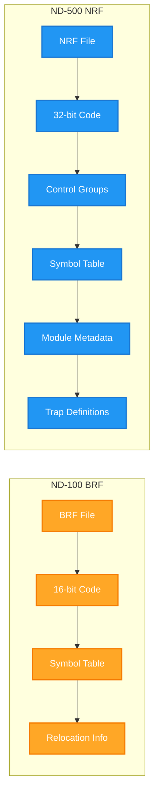
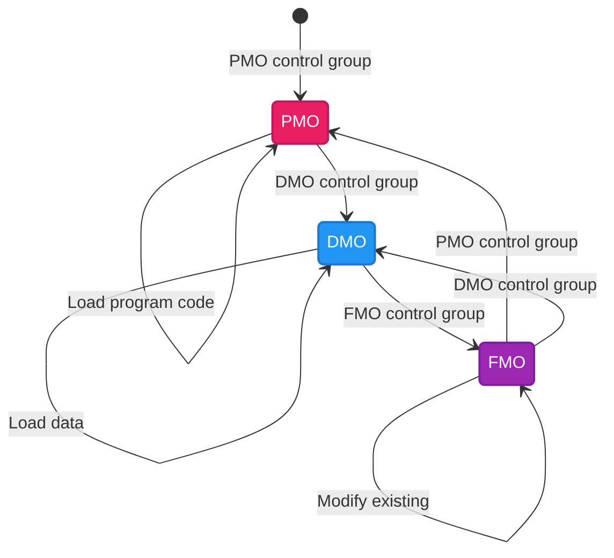
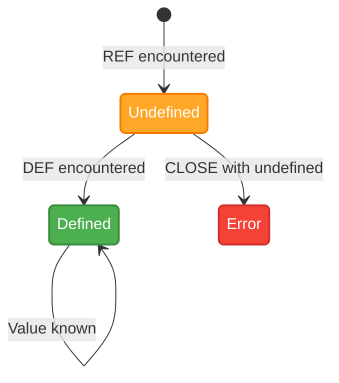
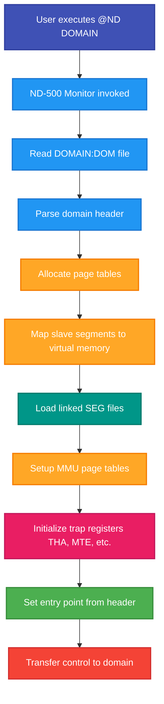

# ND-500 Linking and File Formats - Deep Dive

**Comprehensive guide to ND-500 program linking, NRF format, and domain creation**

**Version:** 1.0
**Date:** October 20, 2025
**Status:** Complete

---

## Table of Contents

1. [Introduction](#1-introduction)
2. [ND-500 Linking Workflow](#2-nd-500-linking-workflow)
3. [File Formats Deep Dive](#3-file-formats-deep-dive)
4. [ND Linker User Interface](#4-nd-linker-user-interface)
5. [Practical Linking Examples](#5-practical-linking-examples)
6. [Symbol Resolution and Libraries](#6-symbol-resolution-and-libraries)
7. [Advanced Topics](#7-advanced-topics)
8. [File Format Binary Specifications](#8-file-format-binary-specifications)
9. [Conversion and Migration](#9-conversion-and-migration)
10. [Reference Tables](#10-reference-tables)
11. [Troubleshooting](#11-troubleshooting)
12. [See Also](#12-see-also)

---

## 1. Introduction

### 1.1 Purpose and Scope

This guide provides a comprehensive deep-dive into **ND-500 program linking** and **file format specifications**. While the companion guide [LINKING-GUIDE.md](LINKING-GUIDE.md) covers general linking concepts for both ND-100 and ND-500, this document focuses exclusively on:

- **ND-500 specific linking** using the ND Linker
- **NRF (NORD Relocatable Format)** binary specification
- **DOM (Domain files)** structure and management
- **SEG (Free segment files)** creation and linking
- **Binary-level format details** for emulator developers

**Target audience:**
- ND-500 assembly language programmers
- Emulator developers implementing ND-500 support
- System programmers needing format-level understanding
- Developers troubleshooting complex linking issues

### 1.2 ND-500 vs ND-100 Linking

**Key differences:**

| Aspect | ND-100 | ND-500 |
|--------|--------|--------|
| **Object Format** | BRF (Binary Relocatable Format) | NRF (NORD Relocatable Format) |
| **Linker Tool** | NRL (NORD Relocating Loader) | ND Linker |
| **Executable Format** | PROG, BPUN | DOM (Domain), SEG (Segment) |
| **Architecture** | 16-bit, 64KB address space | 32-bit, 4GB address space |
| **Segments** | RT segments, max 128KB | ND-500 segments, max 128MB each |
| **CPU** | ND-100 | ND-500 coprocessor |
| **Execution** | `@PROGRAM` | `@ND DOMAIN` or `@ND-500-MONITOR` |

**Why separate linking systems?**

The ND-500 is a **32-bit coprocessor** with fundamentally different architecture from the 16-bit ND-100. The NRF format supports:
- 32-bit addressing and larger address spaces
- Separate program and data segments per segment number
- Advanced memory management (paging, virtual memory)
- Sophisticated trap handling
- Multiple segments per domain (up to 32)

### 1.3 Prerequisites

**Before using this guide, you should understand:**

1. **NORD-500 Assembly Language** - See [NORD-500-ASSEMBLER-DEVELOPER-GUIDE.md](../Languages/System/NORD-500-ASSEMBLER-DEVELOPER-GUIDE.md)
2. **SINTRAN III basics** - File management, user areas, MODE files
3. **General linking concepts** - See [LINKING-GUIDE.md](LINKING-GUIDE.md)
4. **ND-500 architecture** - Processor features, memory model

**Optional for full understanding:**
- SINTRAN III kernel internals (see `../../SINTRAN/OS/` documentation)
- ND-500 emulator implementation (see `../../SINTRAN/Emulator/` documentation)

### 1.4 Quick Reference: What File Format Do I Need?

**"I want to create..."**

| Goal | File Format | Tool | Output |
|------|-------------|------|--------|
| **Executable ND-500 program** | DOM | ND Linker | `PROGRAM:DOM` |
| **Shared library segment** | SEG | ND Linker (advanced mode) | `LIBRARY:SEG` |
| **Object code for linking** | NRF | NORD-500 Assembler | `MODULE:NRF` |
| **Legacy domain (old format)** | PSEG/DSEG/LINK + DESC | Old Linkage-Loader | Multiple files |
| **Convert old to new** | DOM | CONVERT-DOMAIN | `PROGRAM:DOM` |

**"I have a file and don't know what it is..."**

| Extension | Type | Use |
|-----------|------|-----|
| `:NRF` | Object code | Load with ND Linker LOAD command |
| `:DOM` | Domain (executable) | Run with `@ND DOMAIN-NAME` |
| `:SEG` | Free segment | Link to domain with LINK command |
| `:PSEG` | Old format program | Legacy, use CONVERT-DOMAIN |
| `:DSEG` | Old format data | Legacy, use CONVERT-DOMAIN |
| `:LINK` | Old format link info | Legacy, use CONVERT-DOMAIN |

### 1.5 Document Organization

This guide is organized for **progressive learning**:

- **Sections 1-2:** Overview and workflow (read first)
- **Section 3:** File format concepts (essential)
- **Section 4-5:** Practical usage (hands-on)
- **Section 6-7:** Advanced features (when needed)
- **Section 8:** Binary specifications (reference, for emulator developers)
- **Section 9-12:** Reference material (as needed)

**Tip:** Read sections 1-5 sequentially, then use 6-12 as reference.

---

## 2. ND-500 Linking Workflow

### 2.1 Complete Build Pipeline



### 2.2 Detailed Workflow Steps

#### Step 1: Write Source Code

**File:** `PROGRAM:SYMB`

```asm
MODULE HELLO, 50

% Main entry point
ROUTINE MAIN
    MAIN START

    % Print message
    W DATA 'Hello from ND-500!'
    % ... (simplified)

ENDROUTINE

ENDMODULE
```

**Tool:** Text editor (QED, PED, LED, NOTIS-WP)

#### Step 2: Assemble to NRF

**Command:**
```bash
@NORD-500-ASSEMBLER PROGRAM:SYMB
```

**Output:** `PROGRAM:NRF` (NORD Relocatable Format)

**What happens:**
- Source parsed and validated
- Machine code generated (relocatable)
- Symbol table created (exports/imports)
- NRF control groups emitted
- Listing file created (optional)

#### Step 3: Link to Domain

**Command:**
```bash
@LINKER
NDL: OPEN-DOMAIN "PROGRAM"
NDL: LOAD PROGRAM:NRF
NDL: EXIT
```

**Output:** `PROGRAM:DOM` (executable domain)

**What happens:**
- Domain file created
- NRF modules loaded into segments
- Symbol table resolved (external references)
- Relocation performed (addresses assigned)
- Auto-jobs executed (trap setup, library linking)
- Domain closed and ready to run

#### Step 4: Execute

**Command:**
```bash
@ND PROGRAM
```
or
```bash
@ND-500-MONITOR
N5000: PROGRAM
```

**What happens:**
- ND-500 Monitor loads domain
- Segments mapped to virtual memory
- Entry point determined
- Program executes on ND-500 CPU
- I/O handled via monitor calls

### 2.3 ND Linker vs NRL Comparison

| Feature | NRL (ND-100) | ND Linker (ND-500) |
|---------|--------------|---------------------|
| **Target CPU** | ND-100 | ND-500 |
| **Input Format** | BRF | NRF |
| **Output Format** | PROG, BPUN | DOM, SEG |
| **Command Syntax** | `*COMMAND` | `NDL: COMMAND` |
| **User Interface** | Simple line editor | ND-SHELL (advanced editing) |
| **Segment Support** | Single program | Multiple segments (0-31) |
| **Free Segments** | No | Yes (SEG files) |
| **Advanced Mode** | No | Yes (SET-ADVANCED-MODE) |
| **JOB Files** | Limited | Full JOB control language |
| **Libraries** | Simple | NRF Library Handler (NLH) |
| **Trap Handling** | No | Extensive trap definition |
| **Help System** | Minimal | Context-sensitive HELP |

### 2.4 File Format Comparison: BRF vs NRF



**Key NRF advantages:**
1. **Control groups** provide structured metadata
2. **32-bit addressing** for larger programs
3. **Module system** for better organization
4. **Library support** with fast load vectors
5. **Trap handling** integration
6. **Debug information** embedded

### 2.5 Execution Models

#### ND-100 Execution

```
Source → NPL → MAC → BRF → NRL → PROG → @PROG
                                          (runs on ND-100)
```

**Simple, direct execution:**
- Program loaded into ND-100 memory
- Single address space
- Direct SINTRAN monitor calls

#### ND-500 Execution

```
Source → NORD-500-ASM → NRF → ND Linker → DOM → @ND DOM
                                                  (runs on ND-500)
```

**Complex, coprocessor execution:**
- Domain loaded into ND-500 virtual memory
- Multiple segments (0-31)
- Separate program/data spaces
- Virtual memory paging
- ND-500 Monitor mediates execution

---

## 3. File Formats Deep Dive

### 3.1 NRF - NORD Relocatable Format

#### 3.1.1 Overview

**Purpose:** Intermediate relocatable object format output by ND-500 language processors (assemblers, compilers)

**Characteristics:**
- **Binary format** with structured control groups
- **Relocatable code** (no fixed addresses)
- **Symbol table** for imports/exports
- **Module-based** (multiple modules per file)
- **Linkable** with other NRF files and libraries

**File extension:** `:NRF` (default for NORD-500 tools)

#### 3.1.2 NRF Structure

```
┌─────────────────────────────────┐
│ NRF FILE                        │
├─────────────────────────────────┤
│ Module 1                        │
│  ├─ BEG (Start module)          │
│  ├─ MSA (Main start address)    │
│  ├─ DEF/DDF (Symbol definitions)│
│  ├─ REF/LRF/DRF (References)    │
│  ├─ PMO/DMO (Code/data)         │
│  ├─ ... (more control groups)   │
│  └─ END (End module, checksum)  │
├─────────────────────────────────┤
│ Module 2                        │
│  ├─ BEG                         │
│  ├─ ...                         │
│  └─ END                         │
├─────────────────────────────────┤
│ ... (more modules)              │
└─────────────────────────────────┘
```

**Each module is independent** and can be loaded separately by the linker.

#### 3.1.3 Control Groups

**Control groups** are the fundamental building blocks of NRF files. Each control group is a **binary data structure** that directs the linker during loading.

**Control group structure:**

```
┌─────────────┬──────────────┬──────────────────┐
│ Control Byte│ Control Field│ Trailing Fields  │
│  (1 byte)   │  (1-3 bytes) │  (variable)      │
└─────────────┴──────────────┴──────────────────┘
```

**Control byte format:**

```
Bits:  7 6 5 4 3 2 1 0
       └─┬─┘ └────┬────┘
         │        └─ Control Group Type (0-127)
         └─ Numeric Length (NL) indicator
```

**Example control groups:**

| Code | Mnemonic | Purpose |
|------|----------|---------|
| 0 | BEG | Start of module |
| 1 | END | End of module (with checksum) |
| 3 | MSA | Main start address |
| 5 | DEF | Program symbol definition |
| 6 | DDF | Data symbol definition |
| 7 | LIB | Library symbol |
| 8 | REF | Symbol reference (program) |
| 9 | LRF | Symbol reference (literal pool) |
| 10 | DRF | Symbol reference (data) |
| 11 | PMO | Enter program mode |
| 12 | DMO | Enter data mode |
| 13 | FMO | Enter free mode |

(Full control group reference in Section 8.1)

#### 3.1.4 Load Pointers

The linker maintains **three load pointers** during NRF processing:

**PP - Program Byte Pointer:**
- Points to current load address in **program memory**
- Active when linker is in **Program Mode (PMO)**
- Symbol: `#PCLC` (Program Current Location Counter)

**DP - Data Byte Pointer:**
- Points to current load address in **data memory**
- Active when linker is in **Data Mode (DMO)**
- Symbol: `#DCLC` (Data Current Location Counter)
- Special: `#CCLC` (Common Current Location Counter) for FORTRAN COMMON blocks

**XP - Free Pointer:**
- Points to address in **Free Mode (FMO)**
- Used to modify previously loaded data
- Active when linker is in **Free Mode (FMO)**

**BP - Current Base Pointer:**
- Always points to PP, DP, or XP depending on current mode

**Mode transitions:**



#### 3.1.5 Symbol Table Mechanics

**Symbol table entries:**

```
┌────────────┬──────────────┬──────────┐
│ Symbol Name│ Symbol Value │ Status   │
├────────────┼──────────────┼──────────┤
│ "MAIN"     │ 0x00001234   │ Defined  │
│ "SQRT"     │ (unknown)    │ Undefined│
│ "BUFFER"   │ 0x00AB5678   │ Defined  │
└────────────┴──────────────┴──────────┘
```

**How symbols are resolved:**

1. **DEF/DDF control group** encountered:
   - Symbol name read from trailing field
   - Symbol value = current PP or DP
   - Entry added to symbol table (or updated if undefined)

2. **REF/LRF/DRF control group** encountered:
   - Symbol name read from trailing field
   - If defined: Value inserted at BP
   - If undefined: Entry created, reference recorded for later

3. **Module END** reached:
   - If undefined symbols remain: Error or library search

4. **CLOSE command** executed:
   - All symbols must be defined
   - Auto-jobs run if needed (library loading)
   - Domain closed

**Example:**

```asm
% Module 1: MAIN.SYMB
MODULE MAIN
    IMPORT-P SQRT        % Will generate REF control group

    ROUTINE MAIN
        MAIN START       % Will generate DEF control group
        % Call SQRT
    ENDROUTINE
ENDMODULE
```

```asm
% Module 2: MATH.SYMB
MODULE MATH
    EXPORT SQRT          % Will generate DEF control group

    ROUTINE SQRT
        % Square root implementation
    ENDROUTINE
ENDMODULE
```

**Linking:**
```bash
NDL: LOAD MAIN        % REF to SQRT creates undefined entry
NDL: LOAD MATH        % DEF for SQRT resolves the reference
```

#### 3.1.6 Library Symbols (LIB Control Group)

**Library symbols** are special: they are only loaded if referenced.

**Standard symbol (DEF):**
- Always loaded when module is loaded
- Used for main program symbols

**Library symbol (LIB):**
- Only loaded if symbol is in undefined entry list
- Used for library routines

**Example library NRF:**

```
Module: MATHLIB
  BEG
  LIB SQRT      % Only load if SQRT is undefined
  % ... SQRT implementation ...
  LIB SIN       % Only load if SIN is undefined
  % ... SIN implementation ...
  END
```

**When loading:**
```bash
NDL: LIBRARY MATHLIB
```

The linker scans the library and only loads modules containing symbols that are currently undefined.

#### 3.1.7 Fast vs Slow Library Format

**Slow library (sequential search):**
```
┌──────────────────────────────┐
│ Module 1 (BEG...END)         │
├──────────────────────────────┤
│ Module 2 (BEG...END)         │
├──────────────────────────────┤
│ Module 3 (BEG...END)         │
└──────────────────────────────┘
```
Must scan from beginning to find symbol.

**Fast library (indexed):**
```
┌──────────────────────────────┐
│ Fast Load Vector (LBB groups)│
│  SQRT → offset 0x1234        │
│  SIN  → offset 0x5678        │
│  COS  → offset 0xABCD        │
├──────────────────────────────┤
│ Module 1 at 0x1234           │
├──────────────────────────────┤
│ Module 2 at 0x5678           │
├──────────────────────────────┤
│ Module 3 at 0xABCD           │
└──────────────────────────────┘
```
Direct access via symbol name lookup.

**Creating fast libraries:**

Use the **NRF Library Handler (NLH)** (covered in Section 6.2).

---

### 3.2 DOM - Domain Files (New Format)

#### 3.2.1 Overview

**Purpose:** Executable program format for ND-500, self-contained with all segments

**Key features:**
- **File type:** `:DOM`
- **Maximum size:** 128 MB per file
- **Contains:** Domain header + debug info + link info + slave segments
- **Segments:** Up to 32 program/data segment pairs (0-31)
- **Execution:** `@ND DOMAIN-NAME`

**Advantages over old format (PSEG/DSEG/LINK + DESC):**
- Self-contained (single file)
- Portable (no DESC dependency)
- Easier to copy and manage
- Future-proof

#### 3.2.2 File Structure

```
╔═══════════════════════════════════════╗
║ DOMAIN:DOM (128 MB max)               ║
╠═══════════════════════════════════════╣
║ Pages 0-3: Domain Header (4 pages)    ║
║   - Pages 0-1: Actual header          ║
║   - Pages 2-3: Reserved (not allocated║
╠═══════════════════════════════════════╣
║ Debug Info Area (default 2 MB)        ║
║   - Symbolic debug information        ║
║   - Only allocated pages used         ║
╠═══════════════════════════════════════╣
║ Link Info Area (default 2 MB)         ║
║   - Symbol table (defined entries)    ║
║   - Only allocated pages used         ║
╠═══════════════════════════════════════╣
║ Slave Segment 1 (default 34 MB)       ║
║   ├─ Program segment 1 (2 MB default) ║
║   └─ Data segment 1 (32 MB default)   ║
╠═══════════════════════════════════════╣
║ Slave Segment 2 (default 34 MB)       ║
║   ├─ Program segment 2                ║
║   └─ Data segment 2                   ║
╠═══════════════════════════════════════╣
║ Slave Segment 3 (default 34 MB)       ║
║   ├─ Program segment 3                ║
║   └─ Data segment 3                   ║
╠═══════════════════════════════════════╣
║ ... (more segments as configured)     ║
╠═══════════════════════════════════════╣
║ References to Free Segments (if any)  ║
║   - Segment numbers to link           ║
║   - File names of SEG files           ║
╚═══════════════════════════════════════╝

Total space: 4 pages + 2MB + 2MB + (3 × 34MB) = ~106 MB (3 default segments)
```

#### 3.2.3 Domain Header

**Location:** First 2 pages of domain file (pages 2-3 reserved)

**Contents:**
- Domain metadata (name, version, creation date)
- Entry point address
- Segment descriptor table (which segments are used)
- Segment sizes and locations in file
- Debug and link info sizes and offsets
- Trap block definitions
- Working set size
- Memory allocation attributes
- Free segment references

**Important:** Binary format details in Section 8.2

#### 3.2.4 Segment Numbering

**ND-500 supports 32 segments** numbered 0-31, with both program and data space:

```
Program Segments:        Data Segments:
  P00 P01 P02 ... P31      D00 D01 D02 ... D31

Segment pair notation: S01 means P01 + D01
```

**Conventions:**

| Segment Range | Use |
|---------------|-----|
| **0-19** | User programs and data |
| **20-30** | System libraries (reserved by convention) |
| **31** | Monitor calls (reserved, always) |

**Default loading:**

When you don't specify a segment number, the linker uses the first unused segment, starting from 1:

```bash
NDL: OPEN-DOMAIN "TEST"
NDL: LOAD PROG1         % Loads to segment 1
NDL: LOAD PROG2         % Still segment 1 (same load)
NDL: SET-SEGMENT-NUMBER 2
NDL: LOAD PROG3         % Loads to segment 2
```

#### 3.2.5 Segment Size Allocation

**Default sizes:**
- **Program segment:** 2 MB
- **Data segment:** 32 MB
- **Total per segment pair:** 34 MB

**Domain capacity with defaults:**
- 4 pages header + 2 MB debug + 2 MB link = ~4 MB overhead
- 128 MB - 4 MB = 124 MB available
- 124 MB ÷ 34 MB = **3 segments maximum** (with defaults)

**Customizing segment sizes:**

Use `SET-SEGMENT-SIZE` in LINKER-SERVICE-PROGRAM:

```bash
NDL: SET-ADVANCED-MODE
NDL(ADV): LINKER-SERVICE-PROGRAM
LSP: SET-SEGMENT-SIZE 1, PD, 8, 16    % Segment 1: 8MB program, 16MB data
LSP: EXIT
NDL(ADV): OPEN-DOMAIN "CUSTOM"
NDL(ADV): LOAD MYPROGRAM
```

**Fitting more segments:**

To fit more than 3 segments, reduce sizes:

```
Example: 6 segments of 20 MB each
  Program: 1 MB, Data: 19 MB per segment
  Total: 6 × 20 MB = 120 MB < 124 MB ✓
```

**Maximum segment sizes:**

The sum of all segment sizes cannot exceed **124 MB** (128 MB - overhead).

#### 3.2.6 Linking to Free Segments

Domains can **link** to free segments (SEG files) without embedding them.

**Advantages:**
- Share code/data across multiple domains
- Save disk space
- Update library without recompiling all programs
- Reduce memory usage (shared segments in RAM)

**Example:**

```bash
% Create shared library as free segment
@LINKER
NDL: SET-ADVANCED-MODE
NDL(ADV): OPEN-SEGMENT "MATHLIB", 20, PD
NDL(ADV): LOAD SQRT:NRF, SIN:NRF, COS:NRF
NDL(ADV): CLOSE
NDL(ADV): EXIT

% Link domain to free segment
@LINKER
NDL: OPEN-DOMAIN "MYAPP"
NDL: LOAD MYAPP:NRF
NDL: SET-ADVANCED-MODE
NDL(ADV): LINK MATHLIB:SEG
NDL(ADV): EXIT

% Now MYAPP:DOM references MATHLIB:SEG at segment 20
```

**How it works:**

```
┌─────────────────┐       references       ┌─────────────────┐
│ MYAPP:DOM       │─────────────────────────>│ MATHLIB:SEG     │
│  - Segment 1    │                         │  - Segment 20   │
│  - Segment 2    │                         │    (shared)     │
│  - Link to 20   │                         └─────────────────┘
└─────────────────┘

At execution time, ND-500 Monitor loads both files and maps segment 20.
```

**Important considerations:**

1. **Segment number must be unused** in domain
2. **SEG file must exist** at execution time (same directory)
3. **Symbol resolution** happens during LINK command
4. **Included segments** (SEG linking to SEG) are also loaded

---

### 3.3 SEG - Free Segment Files

#### 3.3.1 Overview

**Purpose:** Single segment that can be shared across multiple domains

**Key features:**
- **File type:** `:SEG`
- **Maximum size:** 128 MB
- **Contains:** Segment header + debug info + link info + one segment
- **Segment number:** 0-31 (assigned at creation)
- **Linking:** Multiple domains can link to same SEG

**Use cases:**
- Shared system libraries
- Common utility routines
- Large data tables
- Debugged code modules

#### 3.3.2 File Structure

```
╔═══════════════════════════════════════╗
║ SEGMENT:SEG (128 MB max)              ║
╠═══════════════════════════════════════╣
║ Pages 0-3: Segment Header (4 pages)   ║
║   - Pages 0-1: Actual header          ║
║   - Pages 2-3: Reserved (not allocated║
╠═══════════════════════════════════════╣
║ Debug Info Area (default 4 MB)        ║
║   - Symbolic debug information        ║
╠═══════════════════════════════════════╣
║ Link Info Area (default 4 MB)         ║
║   - Symbol table (defined entries)    ║
╠═══════════════════════════════════════╣
║ Program Segment (default 4 MB)        ║
║   - Executable code                   ║
╠═══════════════════════════════════════╣
║ Data Segment (remaining space)        ║
║   - ~116 MB with defaults             ║
║   - Data storage                      ║
╠═══════════════════════════════════════╣
║ Included Segment References (if any)  ║
║   - Other SEG files this links to     ║
╚═══════════════════════════════════════╝
```

**Note:** SEG files have **larger default sizes** for debug/link areas than DOM files (4 MB vs 2 MB).

#### 3.3.3 Segment Header

**Location:** First 2 pages of segment file

**Contents:**
- Segment metadata (name, number, attributes)
- Entry point (if segment is executable)
- Segment size information
- Debug and link info sizes
- Included segment references
- Symbol export table
- Trap definitions (if any)

#### 3.3.4 Creating Free Segments

**Must be in advanced mode:**

```bash
@LINKER
NDL: SET-ADVANCED-MODE
NDL(ADV): OPEN-SEGMENT "<Segment-name>", <Segment-number>, <Segment-type>, <Attributes>
```

**Parameters:**

| Parameter | Description | Example |
|-----------|-------------|---------|
| **Segment-name** | File name (quotes if new) | `"MYLIB"` or `MYLIB` |
| **Segment-number** | 0-31 (segment number) | `20` |
| **Segment-type** | P, D, or PD | `PD` (both) |
| **Attributes** | Optional attributes | (usually omit) |

**Example:**

```bash
NDL: SET-ADVANCED-MODE
NDL(ADV): OPEN-SEGMENT "MATHLIB", 20, PD
NDL(ADV): LOAD SQRT:NRF
NDL(ADV): LOAD SIN:NRF
NDL(ADV): LOAD COS:NRF
NDL(ADV): CLOSE
NDL(ADV): EXIT
```

**Result:** `MATHLIB:SEG` containing SQRT, SIN, COS at segment 20

#### 3.3.5 Included Segments (SEG → SEG Linking)

Free segments can link to other free segments:

```bash
% Create base library
NDL(ADV): OPEN-SEGMENT "BASE", 20, PD
NDL(ADV): LOAD BASE-ROUTINES:NRF
NDL(ADV): CLOSE

% Create extended library that links to base
NDL(ADV): OPEN-SEGMENT "EXTENDED", 21, PD
NDL(ADV): LOAD EXTENDED-ROUTINES:NRF
NDL(ADV): LINK BASE:SEG          % Link to other SEG
NDL(ADV): CLOSE

% Create domain that links to extended
NDL: OPEN-DOMAIN "APP"
NDL: LOAD APP:NRF
NDL(ADV): LINK EXTENDED:SEG       % Indirectly links to BASE too
NDL: EXIT
```

**Chain:**
```
APP:DOM → EXTENDED:SEG → BASE:SEG
```

**At execution:** ND-500 Monitor loads all three files and maps segments 20 and 21.

#### 3.3.6 Modifying Existing Segments

**APPEND-SEGMENT** opens existing segment without erasing:

```bash
NDL(ADV): APPEND-SEGMENT MATHLIB, 20
NDL(ADV): LOAD NEWFUNCTION:NRF    % Add new function
NDL(ADV): CLOSE
```

**Use cases:**
- Adding functions to library
- Updating implementations
- Incremental development

**Note:** Cannot change segment number or type with APPEND.

---

### 3.4 PSEG/DSEG/LINK - Old Format (Legacy)

#### 3.4.1 Overview

**Purpose:** Legacy domain format from Linkage-Loader (before ND Linker)

**Structure:** Three separate files + DESC entry

```
User Directory:
├── PROGRAM:PSEG      % Program segment
├── PROGRAM:DSEG      % Data segment
├── PROGRAM:LINK      % Link information
└── DESCRIPTION-FILE:DESC   % Shared domain metadata
    └── Entry for PROGRAM
```

**Disadvantages:**
- Not self-contained (DESC dependency)
- Multiple files to manage
- Difficult to copy/move
- Not future-proof

#### 3.4.2 File Contents

**PSEG (Program Segment):**
- Executable ND-500 machine code
- One or more program segments

**DSEG (Data Segment):**
- Initialized data
- One or more data segments

**LINK (Link Information):**
- Symbol table
- Segment mapping
- Entry points

**DESC (Description File):**
- Shared by all domains in directory
- Contains metadata for each PSEG/DSEG/LINK set
- Managed by ND-500 Monitor

#### 3.4.3 When to Use Old Format

**Use old format only if:**
- Working with legacy RT programs that don't recognize DOM files
- Compatibility with old SIBAS or NOTIS versions required
- Existing build system uses old Linkage-Loader

**For all new development:** Use DOM format.

#### 3.4.4 Migration to DOM Format

**CONVERT-DOMAIN program** converts old to new:

```bash
@ND CONVERT-DOMAIN <new-domain> <old-domain>
```

**Example:**

```bash
% Convert OLD-PROG (PSEG/DSEG/LINK + DESC) to NEW-PROG:DOM
@ND CONVERT-DOMAIN NEW-PROG OLD-PROG
```

**What happens:**
1. Reads OLD-PROG:PSEG, :DSEG, :LINK
2. Reads DESC entry for OLD-PROG
3. Creates NEW-PROG:DOM with all content
4. Copies debug and link information
5. Preserves all segments and symbols

**After conversion:**
- NEW-PROG:DOM is fully functional
- Can delete old PSEG/DSEG/LINK files
- No DESC dependency

**Note:** Conversion is one-way (cannot convert DOM back to old format).

---

## 4. ND Linker User Interface

### 4.1 Starting the Linker

**Command:**
```bash
@LINKER
```
or
```bash
@ND LINKER
```

**Output:**
```
- ND LINKER, version B0C
- NDL entered: Date: 20. October 2025 Time: 14:30 -
NDL:
```

**Prompt** `NDL:` indicates standard mode
**Prompt** `NDL(ADV):` indicates advanced mode
**Prompt** `NDL(NLH):` indicates NRF Library Handler mode
**Prompt** `LSP:` indicates Linker Service Program mode

### 4.2 ND-SHELL User Interface

The ND Linker uses **ND-SHELL**, providing advanced editing features:

**Key Features:**
- **NOTIS-WP line editing** (full editing on command line)
- **Command history** (scroll up/down through previous commands)
- **Context-sensitive HELP** (HELP key shows detailed information)
- **Command completion** (SHIFT+HELP lists matching commands)
- **File browsing** (F3 lists matching files)
- **Parameter prompts** (DOWN ARROW prompts for next parameter)
- **JOB file support** (batch command execution)
- **Variables and control flow** (FOR, WHILE, IF statements in JOBs)

**Essential keys:**

| Key | Function |
|-----|----------|
| **RETURN** | Execute command / choose default parameter |
| **DOWN ARROW** | Prompt for optional parameters |
| **HELP** | Show detailed help for current command |
| **SHIFT+HELP** | List matching commands / show default value |
| **F3** | List matching file names |
| **F4** | Show status information |
| **FAT LEFT ARROW** | Copy previous command for editing |
| **EXIT** | Leave current mode / exit linker |
| **SHIFT+EXIT** | Exit linker, return to SINTRAN |
| **HOME** | Abort current command |

### 4.3 Command Modes

**Standard Mode** (default):
- Basic linking commands
- OPEN-DOMAIN, LOAD, CLOSE, EXIT
- No segment manipulation
- Suitable for simple programs

**Advanced Mode** (SET-ADVANCED-MODE):
- All standard commands plus:
- OPEN-SEGMENT, APPEND-SEGMENT, LINK
- SET-SEGMENT-NUMBER, SET-SEGMENT-SIZE
- Advanced control over loading
- Required for free segments

**NRF Library Handler Mode** (NRF-LIBRARY-HANDLER):
- Library file manipulation
- GET-MODULES, SAVE-LIBRARY
- LIST-MODULES, LIST-NRF
- Module transfer between libraries

**Linker Service Program Mode** (LINKER-SERVICE-PROGRAM):
- Advanced configuration
- SET-AREA-SIZE, SET-SEGMENT-SIZE
- COMPRESS, CHANGE-FILE-REFERENCES
- SET-FORMAT (number system)

### 4.4 Essential Commands

#### OPEN-DOMAIN

**Purpose:** Create or open a domain file

**Syntax:**
```bash
NDL: OPEN-DOMAIN "<Domain-name>"     % Create new (quotes required)
NDL: OPEN-DOMAIN <Domain-name>       % Open existing (no quotes)
```

**Parameters:**
- **Domain-name**: File name (default type :DOM)
- Optional: User area, directory

**Example:**
```bash
NDL: OPEN-DOMAIN "MYAPP"             % Creates MYAPP:DOM
NDL: OPEN-DOMAIN MYAPP               % Opens existing MYAPP:DOM
```

**What happens:**
- Closes any previously open domain
- Creates new domain file (with quotes) or opens existing
- Sets current segment to 1 (default)
- Ready to LOAD modules

#### LOAD

**Purpose:** Load NRF files into current domain/segment

**Syntax:**
```bash
NDL: LOAD <file1>, <file2>, <file3>, ...
```

**Parameters:**
- **File names**: One or more NRF files (default type :NRF)

**Example:**
```bash
NDL: LOAD MAIN                       % Load MAIN:NRF
NDL: LOAD MODULE1, MODULE2, MODULE3  % Load three files
NDL: LOAD UTILS:NRF, MATHLIB         % Explicit + default type
```

**What happens:**
- NRF modules processed sequentially
- Symbol definitions added to symbol table
- Symbol references recorded (resolved if possible)
- Code and data loaded to current segment
- PP and DP pointers advanced

**After LOAD:**
```
Program:.......150B P01    Data:...........224B D01
```
Shows current program/data sizes in segment 1.

#### LIBRARY

**Purpose:** Load library file (only needed modules)

**Syntax:**
```bash
NDL: LIBRARY <library-file>
```

**Example:**
```bash
NDL: LIBRARY FORTRAN-LIB             % Load FORTRAN runtime library
NDL: LIBRARY MATHLIB                 % Load math library
```

**Difference from LOAD:**
- Only modules with undefined symbols are loaded
- Faster for large libraries
- Uses fast load vector if available

#### LINK

**Purpose:** Link domain to free segment (advanced mode)

**Syntax:**
```bash
NDL(ADV): LINK <segment-name>
```

**Example:**
```bash
NDL: SET-ADVANCED-MODE
NDL(ADV): LINK MATHLIB:SEG           % Link to MATHLIB at its segment number
```

**What happens:**
- Segment file opened and symbol table read
- Undefined symbols resolved from segment
- Segment number registered in domain
- Reference to SEG file stored (not embedded)

**At execution:** ND-500 Monitor loads both DOM and SEG files.

#### CLOSE

**Purpose:** Close current domain/segment

**Syntax:**
```bash
NDL: CLOSE
NDL: CLOSE N, N                      % No auto-actions, no prompt
```

**Parameters:**
- **Automatic actions** (Yes/No): Execute auto-jobs? (default Yes)
- **Final-message** (Yes/No): Show completion message? (default Yes)

**What happens:**
1. Check for undefined symbols
2. If undefined or no trap handler: Execute auto-jobs (e.g., LINKER-AUTO-FORT:JOB)
3. All symbols must be defined
4. Trap block must be set
5. Domain/segment written to disk
6. Symbol table committed to link info area
7. File closed

**Auto-jobs:**
- `LINKER-AUTO-FORT:JOB` for FORTRAN
- `LINKER-AUTO-PLNC:JOB` for PLANC
- `LINKER-AUTO:JOB` generic fallback

#### EXIT

**Purpose:** Exit linker (auto-closes if needed)

**Syntax:**
```bash
NDL: EXIT
```

**What happens:**
- If domain/segment open: CLOSE command executed
- Returns to SINTRAN

**Note:** EXIT = CLOSE + exit. If CLOSE fails (undefined symbols), EXIT aborted. Press EXIT twice to force.

#### SET-SEGMENT-NUMBER

**Purpose:** Change current segment (advanced mode)

**Syntax:**
```bash
NDL(ADV): SET-SEGMENT-NUMBER <segment-number>
NDL(ADV): SET-SEGMENT-NUMBER <segment-number>, <segment-type>
```

**Parameters:**
- **segment-number**: 0-31
- **segment-type**: PD (both), P (program only), D (data only)

**Example:**
```bash
NDL(ADV): SET-SEGMENT-NUMBER 5       % Switch to segment 5 (PD)
NDL(ADV): SET-SEGMENT-NUMBER 10, P   % Switch to segment 10 (program only)
```

**Output:**
```
Program:.........4B P05    Data:............4B D05
```

**Use case:** Load different modules to different segments.

#### LIST-ENTRIES

**Purpose:** View symbol table

**Syntax:**
```bash
NDL: LIST-ENTRIES <selection>
```

**Parameters:**
- **UNDEFINED**: Show undefined symbols only
- **DEFINED**: Show defined symbols only
- **ALL**: Show all symbols

**Example:**
```bash
NDL: LIST-ENTRIES UNDEFINED
Undefined entries:
  SQRT............../FTN........12B P01

NDL: LIST-ENTRIES DEFINED
Defined entries:
  MAIN.............../FTN........4B P01
  BUFFER............./FTN.......100B D01
```

**Use case:** Debug linking issues, verify symbol resolution.

#### LIST-STATUS

**Purpose:** Show detailed domain/segment information

**Syntax:**
```bash
NDL: LIST-STATUS <domain-or-segment>
```

**Example:**
```bash
NDL: LIST-STATUS MYAPP

Domain name: MYAPP:DOM
  Program segment: 1    Address in file: 20020000B    Size: 7140B
  Data segment: 1       Address in file: 30020000B    Size: 7354B

  Linked to: MATHLIB:SEG    Segment: 20    Link key: 34244
```

**Shows:**
- Segment numbers used
- Segment sizes
- File offsets
- Linked segments
- Trap definitions
- Entry point

#### DEFINE-ENTRY

**Purpose:** Manually define symbol (advanced mode)

**Syntax:**
```bash
NDL(ADV): DEFINE-ENTRY <symbol-name>, <value>, <type>, <segment>
```

**Parameters:**
- **symbol-name**: Symbol to define
- **value**: Numeric value
- **type**: P (program) or D (data)
- **segment**: Segment number

**Example:**
```bash
NDL(ADV): DEFINE-ENTRY STACK_SIZE, 400000, D, D
NDL(ADV): DEFINE-ENTRY ENTRY_POINT, 1000H, P, 1
```

**Use case:** Define constants, override addresses, set sizes.

### 4.5 JOB Files and Automation

**JOB files** contain batch commands for the linker.

**Creating a JOB:**
```bash
% LINKTEST:JOB - Automated linking example
OPEN-DOMAIN "TESTPROG"
LOAD MAIN
LOAD UTILS
LOAD MATHLIB
EXIT
```

**Executing:**
```bash
NDL: LINKTEST                        % Runs LINKTEST:JOB
```

**JOB Control Language:**

```bash
% Variables
"PROGNAME:VAR" = 'MYAPP'
"DEBUG:VAR" = TRUE

% Conditional
IF DEBUG:VAR
  MESSAGE 'Debug mode enabled'
ENDIF

% Loop
FOR "I:VAR" 1 5
  MESSAGE 'Loading module ', I:VAR
  LOAD MODULE I:VAR
ENDFOR

% Error handling
IF ERROR-CODE:VAR > 0
  ERROR 'Link failed', ERROR-CODE:VAR
ENDIF
```

**Auto-execution JOBs:**

- **LINKER:INIT** - Executed when linker starts (if exists)
- **LINKER:EXIT** - Executed when linker exits (if exists)
- **LINKER-AUTO-FORT:JOB** - Auto-executed for FORTRAN programs on CLOSE

**Example LINKER-AUTO-FORT:JOB:**
```bash
% Trap setup for FORTRAN
SET-ADVANCED-MODE
SET-TRAP-CONDITION OWN, ENAB, #FLOFLW    % Floating overflow
SET-TRAP-CONDITION OWN, ENAB, #INVALDI   % Divide by zero
...

% Link runtime library
SPECIAL-LOAD (SYSTEM)FORTRAN-LIB LIBRARY
```

---

## 5. Practical Linking Examples

### 5.1 Simple Single-Module Domain

**Scenario:** Create executable from one NORD-500 assembly source.

**Source:** `HELLO:SYMB`
```asm
MODULE HELLO, 50

ROUTINE MAIN
    MAIN START

    % Print "Hello, ND-500!"
    % (simplified, actual I/O via monitor calls)

ENDROUTINE

ENDMODULE
```

**Build steps:**

```bash
% 1. Assemble
@NORD-500-ASSEMBLER HELLO:SYMB

% Output: HELLO:NRF created

% 2. Link
@LINKER
NDL: OPEN-DOMAIN "HELLO"
NDL: LOAD HELLO
NDL: EXIT

% Auto-job may run here (trap setup)

% 3. Execute
@ND HELLO
Hello, ND-500!
```

**Files created:**
- `HELLO:NRF` - Object code (32 KB typ.)
- `HELLO:DOM` - Executable domain (can be MB+)

**Simple!** For basic programs, this is all you need.

### 5.2 Multi-Module Domain with Libraries

**Scenario:** Main program calls utilities and math library.

**Files:**
- `MAIN:SYMB` - Main program
- `UTILS:SYMB` - Utility routines
- `MATHLIB:NRF` - Pre-built math library

**MAIN:SYMB:**
```asm
MODULE MAIN
    IMPORT-P INIT_UTILS, SQRT

    ROUTINE MAIN
        MAIN START
        % Call utility initialization
        % Call SQRT
    ENDROUTINE
ENDMODULE
```

**UTILS:SYMB:**
```asm
MODULE UTILS
    EXPORT INIT_UTILS

    ROUTINE INIT_UTILS
        % Initialization code
    ENDROUTINE
ENDMODULE
```

**Build:**

```bash
% Assemble modules
@NORD-500-ASSEMBLER MAIN:SYMB
@NORD-500-ASSEMBLER UTILS:SYMB

% Link all together
@LINKER
NDL: OPEN-DOMAIN "MYAPP"
NDL: LOAD MAIN, UTILS           % Load main modules
NDL: LIBRARY MATHLIB            % Load math library (only SQRT needed)
NDL: LIST-ENTRIES DEFINED       % Verify symbols
NDL: EXIT

% Execute
@ND MYAPP
```

**Symbol resolution:**
1. MAIN loaded → INIT_UTILS, SQRT undefined
2. UTILS loaded → INIT_UTILS defined
3. MATHLIB loaded → Only module containing SQRT is loaded

**Result:** MYAPP:DOM with all code integrated.

### 5.3 Domain with Free Segment

**Scenario:** Share common library across multiple programs.

**Step 1: Create shared library as SEG**

```bash
@LINKER
NDL: SET-ADVANCED-MODE
NDL(ADV): OPEN-SEGMENT "MATHLIB", 20, PD
NDL(ADV): LOAD SQRT:NRF, SIN:NRF, COS:NRF, TAN:NRF
NDL(ADV): CLOSE
NDL(ADV): EXIT
```

**Result:** `MATHLIB:SEG` at segment 20

**Step 2: Create multiple domains that link to it**

**Program A:**
```bash
@LINKER
NDL: OPEN-DOMAIN "PROGA"
NDL: LOAD PROGA:NRF              % Uses SQRT
NDL: SET-ADVANCED-MODE
NDL(ADV): LINK MATHLIB:SEG       % Link to shared library
NDL: EXIT
```

**Program B:**
```bash
@LINKER
NDL: OPEN-DOMAIN "PROGB"
NDL: LOAD PROGB:NRF              % Uses SIN, COS
NDL: SET-ADVANCED-MODE
NDL(ADV): LINK MATHLIB:SEG       % Link to same library
NDL: EXIT
```

**Execution:**
```bash
@ND PROGA                        % Loads PROGA:DOM + MATHLIB:SEG
@ND PROGB                        % Loads PROGB:DOM + MATHLIB:SEG (shared)
```

**Benefits:**
- MATHLIB code only stored once on disk
- If both run simultaneously, MATHLIB shared in RAM
- Update MATHLIB once, affects all programs

**Segment layout:**

```
PROGA:DOM                   PROGB:DOM
  Segment 1 (PROGA code)      Segment 1 (PROGB code)
  Link to segment 20          Link to segment 20
           ↓                           ↓
         MATHLIB:SEG (segment 20)
```

### 5.4 Multiple Segments in One Domain

**Scenario:** Large application with modules in different segments.

**Why multiple segments?**
- Organize code logically (core, utilities, I/O)
- Exceed single segment size limits
- Separate frequently/infrequently used code

**Example:**

```bash
@LINKER
NDL: SET-ADVANCED-MODE
NDL(ADV): OPEN-DOMAIN "BIGAPP"

% Load core functionality to segment 1
NDL(ADV): SET-SEGMENT-NUMBER 1
NDL(ADV): LOAD CORE:NRF

% Load utilities to segment 5
NDL(ADV): SET-SEGMENT-NUMBER 5
NDL(ADV): LOAD UTILS:NRF

% Load I/O handlers to segment 7
NDL(ADV): SET-SEGMENT-NUMBER 7
NDL(ADV): LOAD IO_HANDLERS:NRF

% Link to shared graphics library at segment 20
NDL(ADV): LINK GRAPHICS:SEG

NDL(ADV): EXIT
```

**Result:** `BIGAPP:DOM` with segments 1, 5, 7 + link to 20

**Cross-segment calls:** Linker resolves references automatically via symbol table.

**Memory layout:**

```
BIGAPP:DOM virtual address space:

Segment 0:  (unused)
Segment 1:  CORE code/data
Segments 2-4: (unused)
Segment 5:  UTILS code/data
Segment 6:  (unused)
Segment 7:  IO_HANDLERS code/data
Segments 8-19: (unused)
Segment 20: GRAPHICS:SEG (linked)
Segments 21-30: (unused)
Segment 31: Monitor calls (system reserved)
```

### 5.5 Segment Size Customization

**Scenario:** Need large data segment, small program segment.

**Problem:** Defaults are 2 MB program, 32 MB data per segment. Need 1 MB program, 100 MB data.

**Solution:**

```bash
@LINKER
NDL: SET-ADVANCED-MODE
NDL(ADV): LINKER-SERVICE-PROGRAM

% Customize segment 1 size
LSP: SET-SEGMENT-SIZE 1, PD, 1, 100
%                      |  |   |  └─ 100 MB data
%                      |  |   └─ 1 MB program
%                      |  └─ PD = program + data
%                      └─ Segment number 1

LSP: EXIT

% Now open domain with custom segment
NDL(ADV): OPEN-DOMAIN "DATAAPP"
NDL(ADV): LOAD DATAAPP:NRF
NDL(ADV): EXIT
```

**Verification:**
```bash
NDL(ADV): LIST-STATUS DATAAPP

Domain: DATAAPP:DOM
  Program segment 1: 1 MB allocated
  Data segment 1: 100 MB allocated
```

**Limitations:**
- Total all segments ≤ 124 MB
- 1 MB program + 100 MB data = 101 MB → OK
- Could add one more ~20 MB segment

---

## 6. Symbol Resolution and Libraries

### 6.1 Symbol Table Mechanics

**Symbol table** is the linker's database for tracking all symbols (names) in the program.

**Entry types:**

| Type | Description | Source |
|------|-------------|--------|
| **Defined** | Symbol with known value | DEF, DDF control groups |
| **Undefined** | Symbol referenced but not defined yet | REF, LRF, DRF control groups |

**Symbol table lifecycle:**



**Resolution process:**

**Step 1: LOAD MAIN**
```
Symbol Table:
  MAIN        →  0x00001000  (Defined - entry point)
  SQRT        →  (Undefined - called but not provided)
  BUFFER      →  0x00AB2000  (Defined - data area)
```

**Step 2: LOAD MATHLIB**
```
Linker scans MATHLIB:NRF for SQRT definition...
  Found: Module containing SQRT

Symbol Table:
  MAIN        →  0x00001000  (Defined)
  SQRT        →  0x00005678  (Defined - now resolved!)
  BUFFER      →  0x00AB2000  (Defined)
```

**Step 3: CLOSE**
```
Check symbol table:
  All symbols defined? YES
  Trap handler set? (check by auto-job)
  → SUCCESS: Domain closed
```

**If undefined at CLOSE:**
```
Error: Undefined symbols:
  UNKNOWN_FUNC

Auto-job LINKER-AUTO-FORT:JOB executed...
  Tries to load FORTRAN-LIB
  Still undefined?
    → CLOSE fails
```

### 6.2 Creating NRF Libraries

**NRF Library** = Collection of modules where each module is loaded only if needed.

**Requirements:**
1. Modules compiled in **LIBRARY-MODE**
2. LIB control groups (not DEF) for exported symbols
3. Fast load vector (optional, for performance)

**Step 1: Compile in library mode**

**FORTRAN example:**
```bash
@ND FORTRAN-500
FTN: LIBRARY-MODE
FTN: COMPILE SQRT,TERMINAL,SQRT
  SUBROUTINE SQRT(X, RESULT)
    REAL X, RESULT
    % ... implementation ...
  END

FTN: LIBRARY-MODE
FTN: COMPILE SIN,TERMINAL,SIN
  SUBROUTINE SIN(X, RESULT)
    % ... implementation ...
  END

FTN: EXIT
```

**Result:** `SQRT:NRF` and `SIN:NRF` with LIB control groups.

**Step 2: Combine into library file using NRF Library Handler**

```bash
@LINKER
NDL: SET-ADVANCED-MODE
NDL(ADV): NRF-LIBRARY-HANDLER "MATHLIB"

% Add modules
NLH: GET-MODULES SQRT               % Copy SQRT:NRF → MATHLIB:NRF
NLH: GET-MODULES SIN                % Copy SIN:NRF → MATHLIB:NRF
NLH: GET-MODULES COS
NLH: GET-MODULES TAN

% Verify contents
NLH: LIST-MODULES

Module           Nrf-entry  Language  Program_size  Data_size
1. SQRT          P.         Fortran   150B          50B
2. SIN           P.         Fortran   180B          50B
3. COS           P.         Fortran   170B          50B
4. TAN           P.         Fortran   160B          50B

% Create fast load vector
NLH: FAST-VECTOR YES, LIB

% Save library
NLH: SAVE-LIBRARY
NLH: EXIT
```

**Result:** `MATHLIB:NRF` with fast load vector.

**Step 3: Use library**

```bash
NDL: OPEN-DOMAIN "MYAPP"
NDL: LOAD MYAPP:NRF               % Calls SQRT and COS
NDL: LIBRARY MATHLIB              % Loads only SQRT and COS modules
NDL: EXIT
```

**Efficiency:**
- **Without library:** Load all 4 modules (660B program, 200B data)
- **With library:** Load only 2 modules (320B program, 100B data)

### 6.3 NRF Library Handler (NLH) Commands

**Entering NLH:**
```bash
NDL(ADV): NRF-LIBRARY-HANDLER <library-file>
```

**Essential commands:**

| Command | Purpose |
|---------|---------|
| **GET-MODULES** | Copy modules from NRF file to library |
| **LIST-MODULES** | Show all modules in library |
| **LIST-NRF** | Show NRF control groups (hex dump) |
| **SAVE-LIBRARY** | Write library to disk (required!) |
| **FAST-VECTOR** | Create fast load vector |
| **DELETE-MODULES** | Remove modules from library |
| **SET-LIBRARY** | Change current library file |
| **EXIT** | Exit NLH (does not auto-save!) |

**Important:** NLH does not auto-save. Always use SAVE-LIBRARY before EXIT.

### 6.4 System Libraries

**Reserved segment numbers:**

| Segment | Use |
|---------|-----|
| **20-30** | System libraries (convention) |
| **31** | Monitor calls (reserved, always) |

**Common system libraries:**

| Library | Segment | Purpose |
|---------|---------|---------|
| **FORTRAN-LIB** | 30 | FORTRAN runtime |
| **COBOL-LIB** | 25 | COBOL runtime |
| **PLANC-LIB** | 26 | PLANC runtime |
| **EXCEPT-LIB** | 27 | Exception handling |

**Auto-linking:**

Auto-job files (LINKER-AUTO-FORT:JOB) typically link system libraries:

```bash
SPECIAL-LINK (SYSTEM)FORTRAN-LIB LIBRARY
```

This links the entire FORTRAN-LIB:SEG at segment 30.

---

## 7. Advanced Topics

### 7.1 Domain Loading and MMU Setup

**Critical question:** How does loading a DOM file set up the ND-500 MMU and domain?

**Answer:** The ND-500 Monitor handles all setup during domain placement.

**Domain placement process:**



**Detailed steps:**

**1. Domain header parsing:**

The monitor reads the domain header (first 2 pages of DOM file) containing:
- Segment descriptor table (which segments 0-31 are used)
- Segment sizes and file offsets
- Entry point address (where execution starts)
- Trap handler addresses (THA, MTE, OTE, CTE, TEMM)
- Working set size
- Memory attributes (fixed/paged, etc.)
- Free segment references (which SEG files to load)

**2. Page table allocation:**

For each segment in the domain:
- Allocate page table (maps virtual → physical pages)
- ND-500 uses **paging** with page size (typically 2KB or 4KB)
- Each segment gets separate program and data page tables

**3. Segment mapping:**

**Slave segments** (embedded in DOM):
- Read segment content from DOM file
- Allocate physical pages
- Load content into physical memory
- Update page tables to map virtual addresses

**Free segments** (linked SEG files):
- Open SEG file referenced in domain header
- Repeat mapping process for SEG content
- Verify link key matches (version check)
- If SEG has included segments, recursively load those too

**4. MMU setup:**

The monitor configures ND-500 MMU registers:

| Register | Purpose | Set From |
|----------|---------|----------|
| **Page table base registers** | Point to page tables for each segment | Allocated page tables |
| **Segment bounds** | Segment sizes (program/data) | Domain header segment descriptors |
| **Segment attributes** | Read/write/execute permissions | Domain header attributes |

**5. Trap handler initialization:**

From domain header trap block:

| Register | Purpose | Value |
|----------|---------|-------|
| **THA** | Trap Handler Address | Points to trap vector |
| **MTE** | Memory Trapping Enable | Which traps enabled |
| **OTE** | Overflow Trapping Enable | Overflow trap configuration |
| **CTE** | Condition Trapping Enable | Condition trap settings |
| **TEMM** | Trap Enable Mask Mode | Trap mode controls |

**6. Entry point and execution:**

- Program counter (PC) set to entry point from domain header
- Stack pointer initialized
- Control transferred to domain code
- **Domain is now running on ND-500 CPU**

**Virtual memory model:**

```
ND-500 Virtual Address Space (32-bit):

Segment 0:  0x00000000 - 0x07FFFFFF  (128 MB)
Segment 1:  0x08000000 - 0x0FFFFFFF  (128 MB)
...
Segment 31: 0xF8000000 - 0xFFFFFFFF  (128 MB)

Each segment has:
  Program space (instructions)
  Data space (variables, heap, stack)

MMU translates:
  Virtual address → Physical page → Physical address
  via page tables loaded by monitor
```

**Key insight:** The DOM file is a **complete specification** for the monitor to set up the ND-500 MMU and execute the program. The domain header contains all metadata needed.

**For emulator developers:**

To load a DOM file in an emulator:
1. Read domain header (see Section 8.2 for binary format)
2. Parse segment descriptor table
3. Allocate emulated page tables
4. Load slave segment content from file offsets
5. Load linked SEG files (if any)
6. Initialize trap registers from header
7. Set PC to entry point
8. Begin execution

**Cross-reference:** See `../../SINTRAN/OS/04-MMU-CONTEXT-SWITCHING.md` for MMU details and `../../SINTRAN/OS/09-ND500-CODE-LOADING.md` for domain loading internals.

### 7.2 Trap Handling

**Traps** are hardware exceptions that interrupt program execution.

**ND-500 trap types:**

| Trap | Trigger |
|------|---------|
| **INVALID-OPERATION** | Invalid instruction |
| **DIVIDE-BY-ZERO** | Division by zero |
| **FLOATING-OVERFLOW** | Float result too large |
| **ILLEGAL-OPERAND-VALUE** | Operand out of range |
| **ILLEGAL-INDEX** | Array index violation |
| **STACK-OVERFLOW** | Stack exceeded bounds |
| **STACK-UNDERFLOW** | Stack underflow |
| **PROGRAMMED-TRAP** | Explicit trap instruction |
| **PROTECT-VIOLATION** | Memory protection fault |
| **PAGE-FAULT** | Virtual memory page not present |

**Trap vector:** Table of trap handler addresses.

**Defining traps in linker:**

```bash
NDL(ADV): SET-TRAP-CONDITION OWN, ENAB, #FLOFLW
%                            |    |     └─ Trap type
%                            |    └─ ENAB (enable) or DISA (disable)
%                            └─ OWN (use own handler) or MONITOR (use monitor's)
```

**Example (from LINKER-AUTO-FORT:JOB):**

```bash
SET-TRAP-CONDITION OWN, ENAB, #INVALOP    % Invalid operation
SET-TRAP-CONDITION OWN, ENAB, #INVALDI    % Divide by zero
SET-TRAP-CONDITION OWN, ENAB, #FLOFLW     % Floating overflow
SET-TRAP-CONDITION OWN, ENAB, #ILLOPER    % Illegal operand
SET-TRAP-CONDITION OWN, ENAB, #ILLINDX    % Illegal index
SET-TRAP-CONDITION OWN, ENAB, #STKOFLW    % Stack overflow
SET-TRAP-CONDITION OWN, ENAB, #STKUFLW    % Stack underflow
SET-TRAP-CONDITION OWN, ENAB, #PROGTRA    % Programmed trap
SET-TRAP-CONDITION OWN, ENAB, #PVIOLAT    % Protect violation
```

**Trap handler address:**

```bash
REFER-ENTRY #MAINGRA, #THA, D, D
%           |         └─ THA register (Trap Handler Address)
%           └─ Symbol containing trap vector address
```

**Trap priority:**

1. **SET-TRAP-CONDITION in linker** (highest priority)
2. **Trap block from linked SEG file** (if domain has no trap block)
3. **Auto-job trap setup** (LINKER-AUTO-FORT:JOB)
4. **Monitor default traps** (if none above)

**User-defined trap handlers:**

Write trap handler in NORD-500 assembly:

```asm
MODULE TRAPS

% Trap vector (addresses of handlers)
TRAP_VECTOR:
    W DATA INVALID_OP_HANDLER
    W DATA DIV_ZERO_HANDLER
    W DATA FLOAT_OVERFLOW_HANDLER
    % ... more handlers ...

% Handler for divide by zero
DIV_ZERO_HANDLER:
    % Save registers
    % Display error message
    % Terminate program or recover
    % Return from trap

ENDROUTINE

ENDMODULE
```

Link trap handler:
```bash
NDL(ADV): LOAD TRAPS:NRF
NDL(ADV): SET-TRAP-CONDITION OWN, ENAB, #INVALDI
NDL(ADV): REFER-ENTRY TRAP_VECTOR, #THA, D, D
```

### 7.3 FORTRAN COMMON Blocks

**COMMON blocks** are shared data areas in FORTRAN.

**Problem:** FORTRAN COMMON blocks can be defined in multiple modules with different sizes.

**Solution:** Linker uses special **#CCLC** pointer (Common Current Location Counter) separate from **#DCLC** (Data Current Location Counter).

**FORTRAN-COMMON-SEGMENT attribute:**

```bash
NDL(ADV): OPEN-SEGMENT "COMMON1", 8, D, FORTRAN-COMMON-SEGMENT
NDL(ADV): LOAD FORTRAN_MODULE1
NDL(ADV): LOAD FORTRAN_MODULE2
NDL(ADV): CLOSE
```

**What happens:**

1. FORTRAN compiler generates special NRF control groups for COMMON
2. Linker loads COMMON data using #CCLC pointer to segment 8
3. COMMON segment can be shared across modules
4. Largest COMMON size wins (if multiple definitions)

**Separate segments for COMMON:**

**Advantage:** Keep COMMON data isolated from regular data.

**Example:**

```bash
% Main program segment
NDL(ADV): OPEN-DOMAIN "FORTPROG"
NDL(ADV): LOAD MAIN:NRF                      % Segment 1 (data)

% Separate COMMON segment
NDL(ADV): OPEN-SEGMENT "COMMON1", 8, D, FORTRAN-COMMON-SEGMENT
NDL(ADV): DEFINE-ENTRY CSEG1, 0, D, 8       % Define COMMON block name
NDL(ADV): CLOSE

% Back to main domain, link COMMON
NDL(ADV): APPEND-DOMAIN FORTPROG
NDL(ADV): LINK COMMON1:SEG
NDL(ADV): CLOSE
```

**Result:** FORTPROG:DOM with data at segment 1, COMMON at segment 8.

### 7.4 Memory Allocation Control

**Working set size:** Number of pages kept resident in physical memory.

**Default:** System determines based on available memory.

**Override:**

```bash
NDL(ADV): SET-WORKING-SET-SIZE <number-of-pages>
```

**Example:**
```bash
NDL(ADV): SET-WORKING-SET-SIZE 100          % Keep 100 pages resident
```

**Fixed segments:** Prevent paging for critical code.

```bash
NDL(ADV): SET-SEGMENT-ATTRIBUTE <segment-number>, FIXED
```

**Example:**
```bash
NDL(ADV): SET-SEGMENT-ATTRIBUTE 1, FIXED    % Segment 1 never paged out
```

**Use case:** Real-time systems where page faults unacceptable.

### 7.5 ND-100 to ND-500 Communication

**Shared memory (5MPM):** Multiport memory accessible by both CPUs.

**Message passing:** ND-100 and ND-500 communicate via shared buffers.

**In domains:**

NORD-500 programs can:
- Access 5MPM shared memory areas
- Send/receive messages to ND-100
- Use XMSG protocol

**Linker role:** None directly, but domains can use shared segments.

**Cross-reference:** See `../../SINTRAN/OS/08-MESSAGE-PASSING-DETAILED.md` for message passing protocol and `../../SINTRAN/OS/06-MULTIPORT-MEMORY-AND-ND500-COMMUNICATION.md` for 5MPM architecture.

### 7.6 Debugging Information

**Debug area** in DOM/SEG files stores symbolic debugging information.

**Contents:**
- Symbol names and addresses
- Source line numbers
- Variable types
- Module names

**Size:**
- DOM files: Default 2 MB
- SEG files: Default 4 MB

**Customizing:**

```bash
NDL(ADV): LINKER-SERVICE-PROGRAM
LSP: SET-AREA-SIZE <domain>, DEBUG, <size-in-MB>
LSP: EXIT
```

**Example:**
```bash
LSP: SET-AREA-SIZE BIGAPP, DEBUG, 10        % 10 MB debug info
```

**Using debug info:**

With ND-500 Symbolic Debugger:
- Set breakpoints by symbol name
- Display variable values
- Step through source code
- Examine stack traces

**Compiling with DEBUG-MODE:**

```bash
@ND FORTRAN-500
FTN: DEBUG-MODE ON
FTN: COMPILE PROGRAM
FTN: EXIT
```

Generates extended debug information in NRF file, copied to domain.

---

## 8. File Format Binary Specifications

### 8.1 NRF Control Groups - Complete Reference

**NRF files consist of binary control groups.** Each control group directs the linker.

**Control group format:**

```
Byte 0: Control Byte
  Bits 7-6: Numeric Length (NL) encoding
    00 = No numeric field
    01 = 1-byte numeric field
    10 = 2-byte numeric field
    11 = 3-byte numeric field
  Bits 5-0: Control Group Type (0-63)

Bytes 1-3: Control Field (NL bytes)
  Numeric value (if NL > 0)

Bytes 4+: Trailing Fields
  Symbol names, additional parameters (variable length)
```

**Complete control group table:**

| Code | Mnemonic | NL | Parameters | Description |
|------|----------|----|------------|-------------|
| **0** | **BEG** | 0 | Module name (SL) | **Begin module.** Marks start of NRF module. Module name in trailing field. |
| **1** | **END** | 1 | Checksum (1-byte) | **End module.** Marks end of module. Checksum is sum of all bytes BEG to END (mod 256). |
| **2** | **ERR** | 0 | Error message (SL) | **Error.** Error message from compiler. Linker may display warning. |
| **3** | **MSA** | 2 | Address (2-byte), Language code | **Main Start Address.** Defines entry point and language (0=Asm, 1=Fortran, 2=Planc, etc.). |
| **4** | **ESA** | 2 | Address (2-byte) | **Extra Start Address.** Additional entry point. |
| **5** | **DEF** | 0 or 2 | Symbol (SL), optional offset | **Program symbol definition.** Symbol value = PP (+ offset if NL=2). Symbol name in trailing field. |
| **6** | **DDF** | 0 or 2 | Symbol (SL), optional offset | **Data symbol definition.** Symbol value = DP (+ offset if NL=2). Symbol name in trailing field. |
| **7** | **LIB** | 0 or 2 | Symbol (SL), optional offset | **Library symbol.** Like DEF but only loaded if symbol undefined. |
| **8** | **REF** | 0-2 | Symbol (SL), optional offset | **Program symbol reference.** Insert symbol value (+ offset) at BP. |
| **9** | **LRF** | 0-2 | Symbol (SL), optional offset | **Literal reference.** Like REF, for literal pool. |
| **10** | **DRF** | 0-2 | Symbol (SL), optional offset | **Data symbol reference.** Insert symbol value (+ offset) at BP. |
| **11** | **PMO** | 0 | - | **Program mode.** Set mode to Program, BP := PP. |
| **12** | **DMO** | 0 | - | **Data mode.** Set mode to Data, BP := DP. |
| **13** | **FMO** | 0-2 | Address | **Free mode.** Set mode to Free, BP := XP = address. |
| **14** | **ORG** | 1-2 | Address | **Origin.** Set BP to absolute address (rarely used). |
| **15** | **BSS** | 1-2 | Size | **Block Started by Symbol.** Reserve uninitialized space, advance BP by size. |
| **16** | **BYT** | 1 | Value (1-byte) | **Byte.** Store 1-byte value at BP, BP += 1. |
| **17** | **HWD** | 1-2 | Value (2-byte) | **Halfword.** Store 2-byte value at BP, BP += 2. |
| **18** | **WRD** | 1-3 | Value (4-byte) | **Word.** Store 4-byte value at BP, BP += 4. |
| **19** | **TXT** | 1-2 | Length, Text (bytes) | **Text.** Store byte string at BP, BP += length. |
| **20** | **REP** | 1-2 | Repeat count | **Repeat.** Repeat next control group N times. |
| **21** | **CGR0** | 0 | - | **Compound group start.** Start group of control groups (for REP). |
| **22** | **CGR1** | 0 | - | **Compound group end.** End group of control groups. |
| **23** | **ADD** | 0 | - | **Add.** Add next symbol value to word at BP (relocation). |
| **24** | **SUB** | 0 | - | **Subtract.** Subtract next symbol value from word at BP. |
| **25** | **MUL** | 0 | - | **Multiply.** Multiply word at BP by next numeric value. |
| **26** | **DIV** | 0 | - | **Divide.** Divide word at BP by next numeric value. |
| **27** | **AND** | 0 | - | **Bitwise AND.** AND word at BP with next numeric value. |
| **28** | **IOR** | 0 | - | **Bitwise OR.** OR word at BP with next numeric value. |
| **29** | **EOR** | 0 | - | **Bitwise XOR.** XOR word at BP with next numeric value. |
| **30** | **PSH** | 0 | - | **Push.** Push BP onto internal stack. |
| **31** | **POP** | 0 | - | **Pop.** Pop BP from internal stack. |
| **32** | **LBB** | 2-3 | Module offset, Symbol (SL) | **Library Block Begin.** Fast load vector entry: symbol → file offset. |
| **33** | **TRP** | 1-2 | Trap definition | **Trap.** Define trap vector entry. |
| **34** | **COM** | 0-2 | Symbol (SL), size | **Common.** Define FORTRAN COMMON block. |
| **35** | **EXT** | 0 | Symbol (SL) | **External.** Declare external symbol (deprecated, use REF). |
| **36-63** | (Reserved) | - | - | Reserved for future use or vendor-specific extensions. |

**Symbol Length (SL) encoding:**

```
First byte of symbol name:
  Bits 7-0: Symbol length (0-255)

Following bytes: Symbol characters (ASCII)
```

**Example NRF hex dump:**

```
Offset  Hex                                   ASCII       Control Group
------  ------------------------------------  ----------  ---------------
0000    00 05 48 45 4C 4C 4F                  ..HELLO     BEG "HELLO"
0007    03 00 10 00                           ....        MSA 0x0010, Lang=0
000B    0B                                    .           PMO
000C    12 01 02                              ...         HWD 0x0102
000F    05 04 4D 41 49 4E                     ..MAIN      DEF "MAIN"
0015    0C                                    .           DMO
0016    11 00 64                              ..d         WRD 0x00000064
001A    06 06 42 55 46 46 45 52               ..BUFFER    DDF "BUFFER"
0022    01 3A                                 .:          END (checksum=0x3A)
```

**Interpretation:**
- BEG: Module "HELLO"
- MSA: Main start at 0x0010, language 0 (assembly)
- PMO: Enter program mode
- HWD: Store halfword 0x0102 at PP (program code)
- DEF: Symbol "MAIN" = PP
- DMO: Enter data mode
- WRD: Store word 0x64 at DP (data)
- DDF: Symbol "BUFFER" = DP
- END: Module end, checksum 0x3A

**Reading NRF files:** Use NRF-LIBRARY-HANDLER command LIST-NRF for formatted dump.

### 8.2 DOM File Binary Layout

**DOM file structure (byte level):**

```
╔══════════════════════════════════════════════╗
║ DOMAIN:DOM File                              ║
╠══════════════════════════════════════════════╣
║ Pages 0-1: Domain Header                     ║
║   Word 0: Magic number (0x4E44 = "ND")       ║
║   Word 1: Format version                     ║
║   Word 2: Domain flags                       ║
║   Word 3: Entry point address                ║
║   Word 4: Number of segments used            ║
║   Word 5-36: Segment descriptor table        ║
║     Each entry (2 words):                    ║
║       - Segment number + type (P/D)          ║
║       - File offset + size                   ║
║   Word 37: Debug area offset                 ║
║   Word 38: Debug area size                   ║
║   Word 39: Link area offset                  ║
║   Word 40: Link area size                    ║
║   Word 41-50: Trap block                     ║
║     - THA (Trap Handler Address)             ║
║     - MTE (Memory Trapping Enable)           ║
║     - OTE (Overflow Trapping Enable)         ║
║     - CTE (Condition Trapping Enable)        ║
║     - TEMM (Trap Enable Mask Mode)           ║
║   Word 51: Working set size                  ║
║   Word 52-60: Free segment references        ║
║     Each entry (3 words):                    ║
║       - Segment number                       ║
║       - File name (packed string)            ║
║       - Link key (version check)             ║
║   Word 61-255: Reserved                      ║
╠══════════════════════════════════════════════╣
║ Pages 2-3: Reserved (not allocated)          ║
╠══════════════════════════════════════════════╣
║ Debug Info Area (variable size)              ║
║   Symbol table with names, types, addresses  ║
║   Source line number table                   ║
║   Module name table                          ║
╠══════════════════════════════════════════════╣
║ Link Info Area (variable size)               ║
║   Defined symbol table                       ║
║   Entry: Symbol name, value, segment, type   ║
╠══════════════════════════════════════════════╣
║ Slave Segment 1                              ║
║   Program Segment 1 (variable size)          ║
║     Machine code bytes                       ║
║   Data Segment 1 (variable size)             ║
║     Initialized data bytes                   ║
╠══════════════════════════════════════════════╣
║ Slave Segment 2 (if used)                    ║
║   ...                                        ║
╠══════════════════════════════════════════════╣
║ ... (more slave segments)                    ║
╚══════════════════════════════════════════════╝
```

**Important fields:**

**Entry point (Word 3):**
- 32-bit address where execution begins
- Format: `0xSSSSAAAA` where SSSS = segment number, AAAA = offset

**Segment descriptor (Words 5-36):**
```
Descriptor entry (2 words, 8 bytes):
  Word 0:
    Bits 31-24: Segment number (0-31)
    Bits 23-16: Segment type (0=unused, 1=P only, 2=D only, 3=PD)
    Bits 15-0:  Attributes (fixed, paged, etc.)
  Word 1:
    Bits 31-16: File offset (pages)
    Bits 15-0:  Segment size (pages)
```

**Trap block (Words 41-50):**
```
Word 41: THA (Trap Handler Address)
Word 42: MTE (Memory Trapping Enable mask)
Word 43: OTE (Overflow Trapping Enable mask)
Word 44: CTE (Condition Trapping Enable mask)
Word 45: TEMM (Trap Enable Mask Mode)
Words 46-50: Reserved for additional trap configuration
```

**Free segment reference (Words 52-60, 3 words per entry):**
```
Entry (3 words, 12 bytes):
  Word 0: Segment number that will be occupied
  Word 1-2: File name (8 chars packed, e.g., "MATHLIB:SEG")
  Word 3: Link key (32-bit checksum for version verification)
```

**For emulator developers:**

Parsing a DOM file:

```c
// Read header (first 2 pages)
read_file(dom_file, header, 2 * PAGE_SIZE);

// Extract key fields
uint32_t magic = header[0];              // Should be 0x4E44
uint32_t entry_point = header[3];
uint32_t num_segments = header[4];

// Parse segment descriptors
for (int i = 0; i < num_segments; i++) {
    uint32_t desc0 = header[5 + i*2];
    uint32_t desc1 = header[5 + i*2 + 1];

    uint8_t seg_num = (desc0 >> 24) & 0xFF;
    uint8_t seg_type = (desc0 >> 16) & 0xFF;
    uint16_t file_offset = (desc1 >> 16) & 0xFFFF;  // pages
    uint16_t seg_size = desc1 & 0xFFFF;              // pages

    // Load segment from file
    uint32_t byte_offset = file_offset * PAGE_SIZE;
    uint32_t byte_size = seg_size * PAGE_SIZE;

    read_file(dom_file, segment_buffer, byte_size, byte_offset);
    // Map to virtual memory at segment seg_num
}

// Parse trap block
uint32_t THA = header[41];
uint32_t MTE = header[42];
// Initialize trap registers...

// Parse free segment references
for (int i = 0; i < 3; i++) {  // Up to 3 free segments
    uint32_t seg_ref_seg = header[52 + i*3];
    char* seg_file_name = (char*)&header[52 + i*3 + 1];
    uint32_t link_key = header[52 + i*3 + 3];

    if (seg_ref_seg != 0) {
        // Load SEG file
        load_seg_file(seg_file_name, link_key);
    }
}

// Set PC to entry point
PC = entry_point;

// Begin execution
execute();
```

### 8.3 SEG File Binary Layout

**SEG file structure (similar to DOM, but single segment):**

```
╔══════════════════════════════════════════════╗
║ SEGMENT:SEG File                             ║
╠══════════════════════════════════════════════╣
║ Pages 0-1: Segment Header                    ║
║   Word 0: Magic number (0x5345 = "SE")       ║
║   Word 1: Format version                     ║
║   Word 2: Segment number (0-31)              ║
║   Word 3: Segment type (P, D, or PD)         ║
║   Word 4: Entry point (if executable)        ║
║   Word 5: Debug area offset                  ║
║   Word 6: Debug area size                    ║
║   Word 7: Link area offset                   ║
║   Word 8: Link area size                     ║
║   Word 9: Program segment size               ║
║   Word 10: Data segment size                 ║
║   Word 11-20: Trap block (if any)            ║
║   Word 21-25: Included segment references    ║
║     (Other SEG files this links to)          ║
║   Word 26: Link lock (checksum)              ║
║   Word 27-255: Reserved                      ║
╠══════════════════════════════════════════════╣
║ Pages 2-3: Reserved                          ║
╠══════════════════════════════════════════════╣
║ Debug Info Area (default 4 MB)               ║
╠══════════════════════════════════════════════╣
║ Link Info Area (default 4 MB)                ║
╠══════════════════════════════════════════════╣
║ Program Segment (default 4 MB)               ║
║   Machine code                               ║
╠══════════════════════════════════════════════╣
║ Data Segment (remaining ~116 MB)             ║
║   Initialized data                           ║
╚══════════════════════════════════════════════╝
```

**Link lock (Word 26):**
- 32-bit checksum of segment content
- Used by domains to verify correct version
- If domain's link key ≠ segment's link lock → Error

**Included segment references:**
```
Entry (2 words):
  Word 0: Segment number
  Word 1-2: File name (packed string)
```

---

## 9. Conversion and Migration

### 9.1 CONVERT-DOMAIN: Old to New Format

**Purpose:** Convert legacy PSEG/DSEG/LINK + DESC to modern DOM format.

**Syntax:**
```bash
@ND CONVERT-DOMAIN <new-domain-name> <old-domain-name>
```

**Example:**
```bash
@ND CONVERT-DOMAIN NEWPROG OLDPROG
```

**What happens:**

**Input files (old format):**
```
User directory:
  OLDPROG:PSEG       % Program segment(s)
  OLDPROG:DSEG       % Data segment(s)
  OLDPROG:LINK       % Link information
  DESCRIPTION-FILE:DESC  % Contains OLDPROG entry
```

**Conversion process:**

1. **Read PSEG file:** Extract all program segments
2. **Read DSEG file:** Extract all data segments
3. **Read LINK file:** Extract symbol table, entry points
4. **Read DESC entry:** Extract domain metadata (trap block, entry point, segment info)
5. **Create DOM header:** Populate with all metadata
6. **Write slave segments:** Copy program/data to DOM file
7. **Write debug/link info:** Copy from LINK file
8. **Close DOM file:** `NEWPROG:DOM` created

**Output:**
```
User directory:
  NEWPROG:DOM        % Self-contained domain
  (Old files still exist)
```

**Verification:**
```bash
@LINKER
NDL: LIST-STATUS NEWPROG

Domain: NEWPROG:DOM
  Program segment 1: ...
  Data segment 1: ...
  Entry point: ...
  Trap block: ...
```

**After verification:**
```bash
% Delete old files
@DELETE-FILE OLDPROG:PSEG
@DELETE-FILE OLDPROG:DSEG
@DELETE-FILE OLDPROG:LINK
% (DESC entry can be removed manually or left)
```

**Important notes:**

- **One-way conversion:** Cannot convert DOM back to PSEG/DSEG/LINK
- **Preserves all functionality:** Execution identical
- **No recompilation needed:** NRF files not involved
- **Safe:** Old files untouched (can delete after verification)

**When to convert:**

- **Recommended:** All new development uses DOM format
- **Required:** If old files need to be portable
- **Optional:** Legacy systems still support old format

**When NOT to convert:**

- Legacy RT programs that don't recognize DOM files
- Build scripts hardcoded for old format
- Compatibility with very old SIBAS/NOTIS versions

### 9.2 BRF vs NRF: Cross-Platform Considerations

**Problem:** Can I link ND-100 BRF files with ND-500 NRF files?

**Answer:** **NO.** BRF and NRF are incompatible.

| Aspect | BRF (ND-100) | NRF (ND-500) |
|--------|--------------|--------------|
| **CPU** | ND-100 (16-bit) | ND-500 (32-bit) |
| **Instruction set** | ND-100 opcodes | ND-500 opcodes |
| **Address size** | 16-bit | 32-bit |
| **Linker** | NRL | ND Linker |
| **Executable** | PROG, BPUN | DOM, SEG |
| **File format** | BRF control codes | NRF control groups |

**Workarounds:**

1. **Recompile for target CPU:**
   - Source → ND-100 compiler → BRF → NRL → PROG (ND-100)
   - Source → ND-500 compiler → NRF → ND Linker → DOM (ND-500)

2. **Emulation:**
   - ND-100 code cannot natively run on ND-500
   - Would require ND-100 emulator on ND-500 (rare)

3. **Communication:**
   - ND-100 program (PROG) runs on ND-100
   - ND-500 program (DOM) runs on ND-500
   - Communicate via shared memory (5MPM) and message passing

**Recommendation:** Develop for target CPU from start. If porting ND-100 → ND-500, recompile source code.

---

## 10. Reference Tables

### 10.1 ND Linker Commands - Quick Reference

**Standard Mode Commands:**

| Command | Purpose |
|---------|---------|
| **OPEN-DOMAIN** | Create/open domain file |
| **LOAD** | Load NRF file(s) |
| **LIBRARY** | Load NRF library (selective) |
| **CLOSE** | Close current domain/segment |
| **EXIT** | Exit linker |
| **LIST-ENTRIES** | Show symbol table |
| **LIST-DOMAINS** | List domain files |
| **LIST-STATUS** | Detailed domain/segment info |
| **SET-ADVANCED-MODE** | Enter advanced mode |
| **HELP** | Context-sensitive help |

**Advanced Mode Commands (NDL(ADV):):**

| Command | Purpose |
|---------|---------|
| **OPEN-SEGMENT** | Create/open free segment |
| **APPEND-SEGMENT** | Open segment without erasing |
| **APPEND-DOMAIN** | Open domain without erasing |
| **LINK** | Link to free segment |
| **SET-SEGMENT-NUMBER** | Change current segment |
| **DEFINE-ENTRY** | Manually define symbol |
| **LIST-SEGMENTS** | List segment files |
| **SPECIAL-LOAD** | Load with options (LIBRARY, etc.) |
| **SPECIAL-LINK** | Link with options (LIBRARY, etc.) |
| **NRF-LIBRARY-HANDLER** | Enter library handler mode |
| **LINKER-SERVICE-PROGRAM** | Enter service program mode |
| **SET-TRAP-CONDITION** | Define trap handling |
| **REFER-ENTRY** | Reference symbol for trap/entry |

**NRF Library Handler Mode (NDL(NLH):):**

| Command | Purpose |
|---------|---------|
| **GET-MODULES** | Copy modules to library |
| **LIST-MODULES** | Show library modules |
| **LIST-NRF** | Show NRF hex dump |
| **SAVE-LIBRARY** | Write library to disk |
| **DELETE-MODULES** | Remove modules |
| **SET-LIBRARY** | Change current library |
| **FAST-VECTOR** | Create fast load vector |
| **INSERT-MESSAGE** | Add load message |
| **EXIT** | Exit NLH |

**Linker Service Program Mode (LSP:):**

| Command | Purpose |
|---------|---------|
| **SET-SEGMENT-SIZE** | Customize segment allocation |
| **SET-AREA-SIZE** | Change debug/link area size |
| **SET-FORMAT** | Number system (octal/decimal/hex) |
| **COMPRESS** | Remove holes from file |
| **CHANGE-FILE-REFERENCES** | Update file paths in domain |
| **COPY-CAPABILITY-ALLOWED** | Set copy protection |
| **EXIT** | Exit service program |

### 10.2 File Type Summary

| Extension | Type | Created By | Used By | Description |
|-----------|------|------------|---------|-------------|
| `:SYMB` | Source | Editor | NORD-500-ASSEMBLER | Assembly source code |
| `:NRF` | Object | NORD-500-ASSEMBLER, Compilers | ND Linker | Relocatable object code |
| `:DOM` | Executable | ND Linker | ND-500 Monitor | Executable domain (new format) |
| `:SEG` | Executable | ND Linker | ND-500 Monitor | Free segment (shared library) |
| `:PSEG` | Executable | Old Linkage-Loader | ND-500 Monitor | Program segment (old format) |
| `:DSEG` | Executable | Old Linkage-Loader | ND-500 Monitor | Data segment (old format) |
| `:LINK` | Metadata | Old Linkage-Loader | ND-500 Monitor | Link information (old format) |
| `:DESC` | Metadata | ND-500 Monitor | ND-500 Monitor | Domain descriptions (old format) |
| `:LST` | Listing | Assembler/Compiler | Human | Assembly listing with machine code |
| `:JOB` | Script | Editor | ND Linker | Batch commands for linker |

### 10.3 Segment Number Conventions

| Segment Range | Use | Notes |
|---------------|-----|-------|
| **0** | Unused by convention | Available for user |
| **1-19** | User programs and data | General application use |
| **20** | Math libraries (typical) | Convention, not enforced |
| **21-25** | Other system libraries | E.g., COBOL-LIB, PLANC-LIB |
| **26-29** | Utility libraries | E.g., exception handling |
| **30** | FORTRAN runtime library | Standard convention |
| **31** | Monitor calls | **Reserved, always** |

### 10.4 NRF Control Group Summary (Essentials)

| Code | Mnemonic | Purpose | Example |
|------|----------|---------|---------|
| 0 | BEG | Begin module | Start of module "MYMOD" |
| 1 | END | End module | Checksum and end |
| 3 | MSA | Main start address | Entry point = 0x1000 |
| 5 | DEF | Define program symbol | "MAIN" = PP |
| 6 | DDF | Define data symbol | "BUFFER" = DP |
| 7 | LIB | Library symbol | "SQRT" loaded if undefined |
| 8 | REF | Reference program symbol | Insert "FUNC" address at BP |
| 10 | DRF | Reference data symbol | Insert "DATA" address at BP |
| 11 | PMO | Program mode | BP := PP |
| 12 | DMO | Data mode | BP := DP |
| 15 | BSS | Block storage | Reserve 100 bytes |
| 16 | BYT | Byte | Store 0x42 |
| 18 | WRD | Word | Store 0x12345678 |
| 19 | TXT | Text | Store "HELLO" |
| 20 | REP | Repeat | Repeat next group 10 times |
| 32 | LBB | Fast library entry | SQRT → offset 0x1234 |

(See Section 8.1 for complete table with all 36 control groups)

### 10.5 Common Error Messages

| Error | Cause | Solution |
|-------|-------|----------|
| **Undefined symbols** | Symbol referenced but not loaded | LOAD missing module or LIBRARY |
| **File is not closed** | Undefined symbols at CLOSE | Fix undefined symbols, CLOSE again |
| **Segment size exceeded** | Code/data too large for segment | Use SET-SEGMENT-SIZE to increase |
| **Segment number already used** | Trying to load to occupied segment | Use SET-SEGMENT-NUMBER to choose different |
| **Link key mismatch** | SEG file version doesn't match domain | Relink or rebuild SEG file |
| **Domain file too large** | Sum of segments > 124 MB | Reduce segment sizes or use free segments |
| **Cannot open file** | File doesn't exist or locked | Check file name, ensure not in use |
| **Invalid NRF format** | Corrupt NRF file | Recompile source |

---

## 11. Troubleshooting

### 11.1 Undefined Symbols

**Problem:** CLOSE fails with "Undefined symbols" error.

**Diagnosis:**
```bash
NDL: LIST-ENTRIES UNDEFINED

Undefined entries:
  SQRT............../FTN........12B P01
  INIT_IO............/ASM........50B P01
```

**Solutions:**

**1. Missing module:**
```bash
NDL: LOAD MATHLIB                % If SQRT is in MATHLIB:NRF
```

**2. Missing library:**
```bash
NDL: LIBRARY STDLIB              % If SQRT is in STDLIB library
```

**3. Typo in symbol name:**
- Check source code for correct spelling
- Symbol names case-sensitive in some contexts

**4. Symbol in different segment:**
- Verify symbol exported with EXPORT directive
- Check MODULE declarations

**5. Auto-job not running:**
```bash
% Manually execute auto-job
NDL: LINKER-AUTO-FORT:JOB        % For FORTRAN
```

**Prevention:**
- Use LIST-ENTRIES UNDEFINED frequently during linking
- Load all required modules before CLOSE
- Ensure EXPORT/IMPORT directives correct in source

### 11.2 Segment Size Exceeded

**Problem:** "Segment size exceeded" error during LOAD.

**Diagnosis:**
```bash
Program:......5000000B P01    Data:...........32MB D01
Error: Data segment size exceeded
```

**Solution 1: Increase segment size (before OPEN-DOMAIN)**

```bash
NDL(ADV): LINKER-SERVICE-PROGRAM
LSP: SET-SEGMENT-SIZE 1, D, 50          % 50 MB data segment
LSP: EXIT
NDL(ADV): OPEN-DOMAIN "BIGDATA"
NDL(ADV): LOAD BIGDATA:NRF
```

**Solution 2: Use multiple segments**

```bash
% Split data across segments
NDL(ADV): SET-SEGMENT-NUMBER 1
NDL(ADV): LOAD PART1:NRF                % 30 MB data

NDL(ADV): SET-SEGMENT-NUMBER 2
NDL(ADV): LOAD PART2:NRF                % 30 MB data

% Total: 60 MB across two segments
```

**Solution 3: Use free segment**

```bash
% Move large data to SEG file
NDL(ADV): OPEN-SEGMENT "BIGDATA", 10, D
NDL(ADV): LOAD DATAMODULES:NRF
NDL(ADV): CLOSE

% Link to main domain
NDL(ADV): OPEN-DOMAIN "MAIN"
NDL(ADV): LOAD MAIN:NRF
NDL(ADV): LINK BIGDATA:SEG
NDL(ADV): CLOSE
```

### 11.3 Domain File Corruption

**Problem:** "Invalid domain format" when opening DOM file.

**Causes:**
- File transfer corruption
- Disk error
- Incomplete write (crash during CLOSE)

**Recovery:**

**1. Relink from NRF files:**
```bash
% Best solution: rebuild from source
@LINKER
NDL: OPEN-DOMAIN "NEWCOPY"
NDL: LOAD MODULE1, MODULE2, MODULE3
NDL: EXIT
```

**2. Restore from backup:**
```bash
@COPY-FILE DOMAIN:DOM BACKUP:DOM
```

**3. Check file integrity:**
```bash
@LINKER
NDL: LIST-STATUS DOMAIN

% If header reads OK, may be salvageable
```

**Prevention:**
- Always use CLOSE (not SHIFT+EXIT) to ensure proper write
- Keep NRF files as backups
- Use @COPY-FILE for important domains before modification

### 11.4 Link Information Conflicts

**Problem:** "Link key mismatch" when linking to SEG file.

**Diagnosis:**
```bash
NDL(ADV): LINK MATHLIB:SEG
Error: Link key mismatch
  Domain expects: 34244
  Segment has:    35190
```

**Cause:** SEG file rebuilt with different content, domain still references old version.

**Solution 1: Relink domain to new SEG**

```bash
% Rebuild domain from scratch
NDL(ADV): OPEN-DOMAIN "MYAPP"
NDL(ADV): LOAD MYAPP:NRF
NDL(ADV): LINK MATHLIB:SEG          % New link key recorded
NDL(ADV): CLOSE
```

**Solution 2: Restore old SEG file**

If domain is correct:
```bash
@COPY-FILE MATHLIB:SEG MATHLIB-BACKUP:SEG
```

**Prevention:**
- Keep DOM and SEG files synchronized
- Use version control for libraries
- Document dependencies

### 11.5 Fast Library Rebuild

**Problem:** Fast library load vector corrupt or missing.

**Symptoms:**
- Slow library loading
- "Invalid library format" error

**Solution: Rebuild fast vector**

```bash
@LINKER
NDL: SET-ADVANCED-MODE
NDL(ADV): NRF-LIBRARY-HANDLER MYLIB

% Rebuild fast vector
NLH: FAST-VECTOR YES, LIB
% Options: YES/NO, LIB/DEF/DDF/ALL
% LIB = only library symbols (typical)

% Save library
NLH: SAVE-LIBRARY
NLH: EXIT
```

**Verification:**
```bash
NLH: LIST-MODULES

% Should show all modules with fast vector enabled
```

---

## 12. See Also

### 12.1 Related Documentation

**General Linking:**
- [LINKING-GUIDE.md](LINKING-GUIDE.md) - General ND-100 and ND-500 linking overview
- Full path: `E:\Dev\Ronny\NDInsight\Developer\Workflow\LINKING-GUIDE.md`

**NORD-500 Assembly:**
- [NORD-500-ASSEMBLER-DEVELOPER-GUIDE.md](../Languages/System/NORD-500-ASSEMBLER-DEVELOPER-GUIDE.md) - Assembly language introduction
- [NORD-500-ASSEMBLER-EXPERT-GUIDE.md](../Languages/System/NORD-500-ASSEMBLER-EXPERT-GUIDE.md) - Expert-level assembly (when created)
- Full path: `E:\Dev\Ronny\NDInsight\Developer\Languages\System\`

**SINTRAN III Kernel:**
- [04-MMU-CONTEXT-SWITCHING.md](../../SINTRAN/OS/04-MMU-CONTEXT-SWITCHING.md) - MMU and paging details
- [09-ND500-CODE-LOADING.md](../../SINTRAN/OS/09-ND500-CODE-LOADING.md) - Domain loading internals
- [08-MESSAGE-PASSING-DETAILED.md](../../SINTRAN/OS/08-MESSAGE-PASSING-DETAILED.md) - ND-100 ↔ ND-500 communication
- [06-MULTIPORT-MEMORY-AND-ND500-COMMUNICATION.md](../../SINTRAN/OS/06-MULTIPORT-MEMORY-AND-ND500-COMMUNICATION.md) - 5MPM shared memory
- Full path: `E:\Dev\Ronny\NDInsight\SINTRAN\OS\`

**Emulator Implementation:**
- [ND500-EMULATION-COMPLETE.cs](../../SINTRAN/Emulator/ND500-EMULATION-COMPLETE.cs) - C# emulator code
- [ND500-INTEGRATION-GUIDE.md](../../SINTRAN/Emulator/ND500-INTEGRATION-GUIDE.md) - Emulator integration
- [KERNEL-ACCESS-EMULATOR.md](../../SINTRAN/Emulator/KERNEL-ACCESS-EMULATOR.md) - Reading kernel structures
- Full path: `E:\Dev\Ronny\NDInsight\SINTRAN\Emulator\`

**Reference Manuals:**
- [ND-860289-2-EN ND Linker User Guide and Reference Manual.md](../../Reference-Manuals/ND-860289-2-EN ND Linker User Guide and Reference Manual.md) - Complete linker manual
- [ND-05.009.4 EN ND-500 Reference Manual.md](../../Reference-Manuals/ND-05.009.4 EN ND-500 Reference Manual.md) - ND-500 CPU architecture
- [ND-60.113.02 EN Assembler Reference Manual.md](../../Reference-Manuals/ND-60.113.02 EN Assembler Reference Manual.md) - Assembler reference
- Full path: `E:\Dev\Ronny\NDInsight\Reference-Manuals\`

### 12.2 External Resources

**Norsk Data Documentation:**
- Original manuals available at bitsavers.org
- SINTRAN III documentation archive

**ND-500 Architecture:**
- ND-500 Reference Manual (ND-05.009.4)
- ND-500 Loader/Monitor Manual (ND-860136)

**Development Tools:**
- NORD-500 Assembler documentation
- FORTRAN-500, PLANC, COBOL compilers

### 12.3 Document Information

**File:** `E:\Dev\Ronny\NDInsight\Developer\Workflow\LINKING-GUIDE-500-DEEP-DIVE.md`

**Version:** 1.0
**Date:** October 20, 2025
**Status:** Complete
**Author:** NDInsight Documentation Project
**License:** CC BY 4.0 (Documentation), MIT (Code examples)

**Changelog:**
- 2025-10-20: Initial comprehensive version
  - Complete NRF format specification
  - DOM/SEG binary layout details
  - Domain loading and MMU setup explanation
  - Trap handling guide
  - FORTRAN COMMON blocks
  - Extensive practical examples
  - Complete command reference
  - Troubleshooting guide

---

**End of ND-500 Linking and File Formats - Deep Dive**

For questions, corrections, or contributions, please refer to the main NDInsight repository documentation.