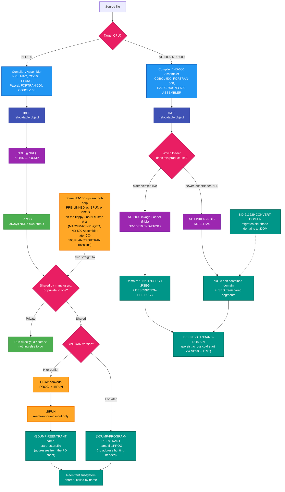

# SINTRAN III Linking and Binary Management Guide

**Complete reference for NRL, BRF, BPUN, PROG, and NRF files**

**Version:** 1.1  
**Date:** October 18, 2025  
**Status:** Complete

---

## Table of Contents

1. [Overview](#1-overview)
2. [File Formats](#2-file-formats)
3. [NRL - NORD Relocating Loader](#3-nrl---nord-relocating-loader)
4. [Creating Executables](#4-creating-executables)
5. [Reentrant Programs](#5-reentrant-programs)
6. [Binary Management Commands](#6-binary-management-commands)
7. [Practical Examples](#7-practical-examples)
8. [What Each Language Actually Produces](#8-what-each-language-actually-produces-evidence-from-real-install-sheets)

---

## Installing the linkers themselves

The tools this guide describes are separate installable products, now documented in
`Installation/Software/`:

- **ND-100, BRF-Linker** — [ND-210721](../../Installation/Software/ND-210721/README.md), version
  [ND-210721C](../../Installation/Software/ND-210721/ND-210721C/README.md) — verified from a real
  PD sheet.
- **ND-500/5000, ND-500 Linkage-Loader (NLL, older)** — article `ND-10319`/`ND-210319`, installed
  live and documented in
  [../../Installation/INSTALL-ND-LINKAGE-LOADER-AND-BACKUP-SYSTEM.md](../../Installation/INSTALL-ND-LINKAGE-LOADER-AND-BACKUP-SYSTEM.md).
- **ND-500/5000, ND LINKER (NDL, newer, supersedes NLL)** —
  [ND-211224](../../Installation/Software/ND-211224/README.md), version
  [ND-211224B01](../../Installation/Software/ND-211224/ND-211224B01/README.md) — installer
  identified by analogy to the verified NLL installer, not yet run live. `ND-211229`
  CONVERT-DOMAIN converts NLL-format domains to the newer ND LINKER format; both can run
  side by side.

---

## 1. Overview

### 1.1 The Linking Process

```
Source → Compiler → Assembler → Linker → Executable
  .NPL      →      .MAC       →   .BRF    →   .PROG/.BPUN
  .C                            NRL
```

**Key concepts:**
- **BRF:** Binary Relocatable Format - object code from MAC assembler (ND-100)
- **NRF:** NORD Relocatable Format - object code from NORD-500 assembler (ND-500)
- **NRL:** NORD Relocating Loader - links BRF files for ND-100
- **NORD-500 Loader:** Links NRF files for ND-500
- **PROG:** Executable program file - ready to run on ND-100
- **BPUN:** Binary Punched format - alternative executable for ND-100
- **PSEG/DSEG:** Program/Data segments for ND-500
- **Reentrant:** Shared code in memory

---

## 2. File Formats

### 2.1 BRF - Binary Relocatable Format

**Purpose:** Object code output from MAC assembler

**Contents:**
- Machine code (relocatable)
- Symbol table (exported/imported symbols)
- Relocation information
- Entry points

**Creation:**
```
@MAC SOURCE:MAC    →    SOURCE:BRF
```

### 2.2 PROG - Program File

**Purpose:** Executable program ready to load and run

**Contents:**
- Absolute machine code
- Entry point address
- Memory requirements
- Load address

**Characteristics:**
- Self-contained executable
- Can be run directly with `@PROGRAM`
- Non-reentrant (one instance)

### 2.3 BPUN - Binary Punched File

**Purpose:** Alternative executable format

**Contents:**
- Similar to PROG
- Additional metadata
- Can be dumped to reentrant

**Characteristics:**
- More flexible than PROG
- Can be converted to reentrant
- Used for system programs

**Why use BPUN?**
- System programs that need reentrant capability
- Programs that may be shared
- Programs loaded via DUMP-REENTRANT

### 2.4 NRF - NORD Relocatable Format (NORD-500)

**Purpose:** Object code output from NORD-500 Assembler

**Contents:**
- Relocatable machine code for NORD-500 CPU
- Symbol table (exported/imported symbols)
- Relocation information
- Module and routine metadata
- Stack and record definitions

**Creation:**
```
@NORD-500-ASSEMBLER SOURCE:SYMB    →    SOURCE:NRF
```

**Target CPU:** ND-500 (cross-compiled on ND-100)

**Characteristics:**
- Different format from BRF (not compatible)
- Supports NORD-500 instruction set
- Linked by NORD-500 Loader (not NRL)
- Output is PSEG/DSEG files (not PROG)

**Why NRF instead of BRF?**
- NORD-500 has different CPU architecture than ND-100
- Supports NORD-500-specific features (descriptors, alternative areas, extended addressing)
- Optimized for NORD-500 memory model

### 2.5 PSEG/DSEG - NORD-500 Segments

**PSEG:** Program Segment for NORD-500
- Contains executable code
- Loaded into NORD-500 program memory

**DSEG:** Data Segment for NORD-500
- Contains initialized data
- Loaded into NORD-500 data memory

**Creation:**
```
@NORD-500-LOADER
LOAD PROGRAM:NRF
PSEG PROGRAM:PSEG
DSEG PROGRAM:DSEG
EXIT
```

### 2.6 DOM and SEG - New Domain Format

**`:DOM` files are the "new domain format" that replaces the old DESC-based system.**

**Old Domain Format (Being Phased Out):**
```
User Directory:
├── DESCRIPTION-FILE:DESC    ← All domain metadata
├── PROGRAM1:PSEG            ← Program segment
├── PROGRAM1:DSEG            ← Data segment
├── PROGRAM1:LINK            ← Link info
├── PROGRAM2:PSEG
├── PROGRAM2:DSEG
└── PROGRAM2:LINK
```

**New Domain Format (:DOM):**
```
User Directory:
├── PROGRAM1:DOM             ← Self-contained domain
│   ├── Header (domain metadata)
│   ├── Slave segment 1 (embedded)
│   └── Reference to free segments
├── PROGRAM2:DOM
└── SHARED-LIB:SEG           ← Free (shared) segment
    ├── Header (segment metadata)
    └── Segment contents
```

**Key Differences:**

| Aspect | Old Format | New Format (:DOM) |
|--------|-----------|-------------------|
| **Metadata** | Shared DESC file | Header in each :DOM |
| **Private segments** | Separate :PSEG/:DSEG/:LINK | Embedded in :DOM |
| **Shared segments** | Separate :PSEG/:DSEG/:LINK | :SEG files |
| **Copy domain** | Multiple files + DESC entry | Single file (`@COPY-FILE`) |
| **Portability** | Low | High |
| **Future** | Being phased out | Recommended |

**Converting Between Formats:**
```
@ND CONVERT-DOMAIN destination source
```

**Example:**
```
@ND CONVERT-DOMAIN NEW-PROG OLD-PROG
```

This converts `OLD-PROG` (old format with DESC entry) to `NEW-PROG:DOM` (new self-contained format).

**See also:** [CONVERT-DOMAIN-PSEG-DSEG-TO-DOM.md](CONVERT-DOMAIN-PSEG-DSEG-TO-DOM.md) - detailed step-by-step conversion procedure.

**When to Use Each:**
- **New :DOM format:** All new development, portable applications
- **Old DESC format:** Legacy RT programs that don't recognize :DOM (e.g., old SIBAS, NOTIS versions)

### 2.7 Format Comparison

| Feature | BRF (ND-100) | NRF (ND-500) | PROG | BPUN | PSEG/DSEG/LINK<br/>(Old) | DOM/SEG<br/>(New) |
|---------|--------------|--------------|------|------|--------------------------|-------------------|
| **Type** | Object | Object | Executable | Executable | Executable | Executable |
| **Target CPU** | ND-100 | ND-500 | ND-100 | ND-100 | ND-500 | ND-500 |
| **Relocatable** | Yes | Yes | No | No | No | No |
| **Can Link** | Yes (NRL) | Yes (ND-500 Loader) | No | No | No | No |
| **Can Run** | No | No | Yes | Yes | Yes (via DESC) | Yes (self-contained) |
| **Can Dump** | No | No | No | Yes | No | No |
| **Reentrant** | N/A | N/A | No | Can be | N/A | N/A |
| **Linker** | NRL | NORD-500 Loader | - | - | - | - |
| **Format** | - | - | - | - | Separate files + DESC | Single :DOM or :SEG |
| **Portability** | - | - | - | - | Low (needs DESC) | High (self-contained) |

---

## 3. NRL - NORD Relocating Loader

### 3.1 Starting NRL

```
@NRL
*                    % NRL command prompt
```

### 3.2 NRL Commands

| Command | Purpose | Example |
|---------|---------|---------|
| **IMAGE** | Set target CPU | `*IMAGE 100` or `*IMAGE 500` |
| **PROG-FILE** | Set output PROG file | `*PROG-FILE "MYPROG"` |
| **BPUN-FILE** | Set output BPUN file | `*BPUN-FILE "MYPROG"` |
| **LOAD** | Load BRF file | `*LOAD MODULE1` |
| **LIBRARY** | Load from library | `*LIBRARY SYSLIB` |
| **MAP** | Show memory map | `*MAP` |
| **XREF** | Cross-reference | `*XREF` |
| **EXIT** | Exit NRL | `*EXIT` |

### 3.3 Basic Linking Session

```
@NRL
*IMAGE 100                   % Target ND-100
*PROG-FILE "HELLO"           % Output file
*LOAD HELLO                  % Load HELLO:BRF
*EXIT                        % Exit NRL

% Creates HELLO:PROG
```

### 3.4 Multi-Module Linking

```
@NRL
*IMAGE 100
*PROG-FILE "MYAPP"
*LOAD MODULE1                % Main module
*LOAD MODULE2                % Support module
*LOAD MODULE3                % Utility module
*LIBRARY STDLIB              % Standard library
*MAP                         % Show memory layout
*EXIT
```

### 3.5 Symbol Resolution

**NRL resolves:**
- External references (`)EXTR` declarations)
- Entry points (`)ENTR` declarations)
- Common blocks
- Library references

**Example:**

**Module1.MAC:**
```mac
        )EXTR FUNC2          % Reference to Module2
        
START,  LDA =100
        JSR FUNC2            % Call external function
        EXIT
        
        )ENTR START
```

**Module2.MAC:**
```mac
FUNC2,  LDA =200
        EXIT
        
        )ENTR FUNC2          % Export FUNC2
```

**Linking:**
```
*LOAD MODULE1                % Needs FUNC2
*LOAD MODULE2                % Provides FUNC2
```

NRL resolves `FUNC2` reference automatically.

---

## 4. Creating Executables

### 4.1 Simple Program (PROG)

**For:** Single-use programs, utilities

```
@NPL PROG:NPL               % Compile
@MAC PROG:MAC               % Assemble
@NRL                        % Link
*IMAGE 100
*PROG-FILE "PROG"
*LOAD PROG
*EXIT

@PROG                       % Run
```

### 4.2 C Program with Runtime

**For:** C programs requiring runtime library

```
@CC-100 PROG:C              % Compile
@NRL
*IMAGE 100
*PROG-FILE "PROG"
*LOAD CC-2HEADER            % C runtime header
*LOAD PROG                  % Your program
*LOAD CC-2BANK              % C runtime library
*LOAD CC-2TRAILER           % C runtime trailer
*EXIT

@PROG                       % Run
```

### 4.3 System Program (BPUN)

**For:** System programs, reentrant candidates

```
@NPL SYSPROG:NPL
@MAC SYSPROG:MAC
@NRL
*IMAGE 100
*BPUN-FILE "SYSPROG"
*LOAD SYSPROG
*EXIT

% Creates SYSPROG:BPUN
```

---

## 5. Reentrant Programs

### 5.1 What is Reentrant?

**Reentrant program:**
- Loaded once into memory
- Shared by multiple users/tasks
- Single code copy, multiple instances
- Memory efficient

**Benefits:**
- Saves memory
- Faster loading (already in memory)
- System programs (editors, compilers)

### 5.2 Creating Reentrant from BPUN

**Step 1: Create BPUN file**
```
@NRL
*BPUN-FILE "EDITOR"
*LOAD EDITOR
*EXIT
```

**Step 2: Dump to reentrant**
```
@DUMP-REENTRANT EDITOR:BPUN
```

**Now `EDITOR` is reentrant and can be shared**

### 5.3 Reentrant Management Commands

| Command | Purpose | Example |
|---------|---------|---------|
| **DUMP-REENTRANT** | Load BPUN as reentrant | `@DUMP-REENTRANT PROG:BPUN` |
| **LIST-REENTRANT** | List reentrant programs | `@LIST-REENTRANT` |
| **DELETE-REENTRANT** | Remove reentrant | `@DELETE-REENTRANT PROG` |
| **DEFINE-REENTRANT-PROGRAM** | Define reentrant | (System use) |
| **LOAD-REENTRANT-SEGMENT** | Load segment | (System use) |
| **CLEAR-REENTRANT-SEGMENT** | Clear segment | (System use) |

### 5.4 LIST-REENTRANT Output

```
@LIST-REENTRANT

START RESTART SEGMENT NAME
0B    1B      130B     NRL
0B    0B      131B     BACKUP-SYSTEM-B
70B   70B     132B     DITAP
177777B 177775B 133B   FMAC
177777B 177775B 134B   MAC
0B    1B      135B     QED
0B    1B      136B     NPL
```

**Fields:**
- **START:** Start address (octal)
- **RESTART:** Restart address (octal)
- **SEGMENT:** Segment number (octal)
- **NAME:** Program name

---

## 6. Binary Management Commands

### 6.1 LOAD-BINARY

**Purpose:** Load binary file into memory

```
@LOAD-BINARY ADDRESS, FILE:BIN
```

**Example:**
```
@LOAD-BINARY 10000, BOOTLOADER:BIN
```

### 6.2 PLACE-BINARY

**Purpose:** Place binary at specific address

```
@PLACE-BINARY ADDRESS, SIZE, FILE:BIN
```

**Used for:**
- Boot loaders
- Device firmware
- Memory-mapped code

### 6.3 What DITAP actually is

`DITAP` is a real, small SINTRAN utility program — program number `SUT-1880D` (an earlier
revision was `SUT-1879D`), one of the ten tools in the **`ND-10022` SINTRAN Utility Programs**
package and also bundled into **Subsystem Package II** (`ND-210400`, see
[ND-210400B](../../Installation/Software/ND-210400/ND-210400B/README.md)). Its own PD sheet
states its job in one line: it converts a `:PROG` file "to a `:BPUN`-file with BOOTSTRAP and
checksum," so that file can then be used as a reentrant subsystem — nothing more exotic than
that. (The name is not expanded anywhere in the sources read for this repo — treat "DITAP" as a
program name, not an acronym with a known expansion.)

Two calling forms are attested, both real:
- **Interactive** (from the `ND-10022` utility's own PD sheet): run `@DITAP`, and it prompts
  `Destination file:` (default type `BPUN`) then `SOURCE FILE:` (default type `PROG`).
- **Positional/one-line** (from the actual *ND-30.003.7 EN SINTRAN III System Supervisor* manual's
  Pascal-J and PLANC-F installation sections): `@DITAP "<bpun-name>" <prog-name>`, e.g.
  `@DITAP "PASCAL" PASCAL` or `@DITAP "PLANC-100-F<rev>" PLANC-100-F<rev>`.

You only need it on **pre-SINTRAN-I systems** — that's the whole reason it exists in this
pipeline. SINTRAN I added `@DUMP-PROGRAM-REENTRANT`, which accepts a `:PROG` directly, making the
`DITAP` detour unnecessary from then on (see §6.3 below for both paths side by side). DITAP itself
is installed the exact same way it's used on everything else: Subsystem Package II ships it
pre-built as `DITAP-1880D:BPUN` and dumps it reentrant with `@DUMP-REENTRANT DITAP,70,70,DITAP` —
addresses `70,70` confirmed identical in two independent sources (the `ND-10022` PD sheet and the
Subsystem Package II PD sheet).

### 6.4 PROG vs BPUN — the decision, grounded in real install sheets

This isn't a stylistic choice made at compile time — it's decided by **what you want to happen
to the program after it's built**, and the two formats sit on different sides of one conversion
step (`DITAP`, or its SINTRAN-I+ replacement). Every product install doc in
[`Installation/Software/`](../../Installation/Software/README.md) that this repo has actually
transcribed from a real PD sheet follows one of exactly two shapes:

**Shape A — NRL builds `:PROG` first, then optionally becomes shared.** NRL's `*DUMP` always
writes a `:PROG` (see [ND-10076 Pascal](../../Installation/Software/ND-10076/ND-10076J/README.md)'s
verbatim sequence: `*DUMP "PASCAL:PROG",xxxxxx,yyyyyy`). What happens next depends on the SINTRAN
version:
- **SINTRAN I or later:** skip BPUN entirely — `@DUMP-PROGRAM-REENTRANT <name>,<name>:PROG` takes
  the `:PROG` directly and makes it a shared reentrant subsystem.
- **Pre-SINTRAN-I:** `@DITAP "<name>:BPUN",<name>:PROG` converts the `:PROG` into a `:BPUN`
  first, because the *old* `@DUMP-REENTRANT` command only accepts `:BPUN` input (and needs
  explicit octal start/restart addresses, which `DITAP` does not supply — you read those off the
  PD sheet, e.g. Pascal's `xxxxxx`/`yyyyyy` from NRL's own `*VALUE` output).

**Shape B — Norsk Data ships the product pre-built as `:BPUN`, no NRL step at all.** Several
system tools arrive on their distribution floppy already linked as `:BPUN` — you never run NRL
yourself. Confirmed on real floppies: Subsystem Package II's `MAC`/`FMAC`/`NPL`/`QED`/`DITAP` (see
[ND-210400B](../../Installation/Software/ND-210400/ND-210400B/README.md)'s address table) and the
ND-500 Assembler (see [ND-10311A](../../Installation/Software/ND-10311/ND-10311A/README.md)'s
`@DUMP-REENTRANT ASSEMBLER,,(BPUN-FILES)ASSEMBLER-500:BPUN`, quoted from the actual SINTRAN III
System Supervisor manual). For these, the only decision left is: dump it **reentrant**
(`@DUMP-REENTRANT <name>,<start>,<restart>,<bpun-file>`, shared, called by name like any SINTRAN
command) or dump it as a **private `:PROG`** for one user only
(`@PLACE-BINARY,<bpun-file>` then `@DUMP` — see the Subsystem Package II doc's §3.2 for the exact
two-command form).

**So "when do I want BPUN, when do I want PROG" really answers a different question — private vs.
shared:**

| You want... | Use | Why |
|---|---|---|
| A program only you (or one job) runs, no one else needs it | **`:PROG`**, run directly with `@<name>` | Simplest — no reentrant-dump step, no segment-file space used, nothing to persist across a cold start |
| A program many users/terminals call by name, sharing one copy in memory | **reentrant subsystem** (built from a `:BPUN`, or directly from a `:PROG` on SINTRAN I+ via `DUMP-PROGRAM-REENTRANT`) | Saves memory, faster start (already resident), the standard shape for compilers/editors/system tools |
| A later-generation ND-100 product you're installing today | Check its own install doc first — **later revisions increasingly ship pre-linked `:PROG` instead of raw `:BPUN`** (e.g. [ND-10760A CC-100](../../Installation/Software/ND-10760/ND-10760A/README.md), [ND-210191F02 FORTRAN](../../Installation/Software/ND-210191/ND-210191F02/README.md), [ND-10309F PLANC](../../Installation/Software/ND-10309/ND-10309F/README.md) — all confirmed by mounting the real floppy and listing its files with `ndtool`), so `DUMP-PROGRAM-REENTRANT` is the command you'll actually reach for, not the older BPUN detour |

`:BPUN` on its own is not something you "run" — every real install sheet transcribed so far
treats it purely as an *input* to a reentrant-dump command (`DUMP-REENTRANT`) or, on the floppy
side, as raw pre-linked binary storage. If you find yourself with a `:BPUN` you actually want to
just run once, the correct move is still `@PLACE-BINARY`+`@DUMP` to get a `:PROG`, not running the
`:BPUN` directly.

### 6.4 Converting BPUN to PROG

**Cannot directly convert**, but can:

1. Relink from BRF files:
```
@NRL
*PROG-FILE "NEWPROG"
*LOAD SOURCE            % Load original BRF
*EXIT
```

2. Or make a private `:PROG` from an existing `:BPUN` (verified command shape, see
   [ND-210400B §3.2](../../Installation/Software/ND-210400/ND-210400B/README.md)):
```
@PLACE-BINARY,(BPUN-FILES)SOURCE:BPUN
@DUMP
FILE NAME: "NEWPROG"
START ADDRESS: <start>
RESTART ADDRESS: <restart>
```

---

## 7. Practical Examples

### 7.1 Complete NPL Build

**Source: MYAPP:NPL**

```bash
# Compile
@NPL MYAPP:NPL
NPL COMPILER VERSION 3.5
...
COMPILATION COMPLETE

# Assemble
@MAC MYAPP:MAC
MAC ASSEMBLER VERSION 4.2
...
ASSEMBLY COMPLETE

# Link
@NRL
*IMAGE 100
*PROG-FILE "MYAPP"
*LOAD MYAPP
*MAP
ENTRY POINT: START
CODE: 100-500
DATA: 600-1000
*EXIT

# Run
@MYAPP
```

### 7.2 Multi-Module Project

**Files: MAIN:NPL, UTILS:NPL, IO:NPL**

```bash
# Compile all
@NPL MAIN:NPL
@NPL UTILS:NPL
@NPL IO:NPL

# Assemble all
@MAC MAIN:MAC
@MAC UTILS:MAC
@MAC IO:MAC

# Link
@NRL
*IMAGE 100
*PROG-FILE "PROJECT"
*LOAD MAIN              % Main module
*LOAD UTILS             % Utilities
*LOAD IO                % I/O routines
*LIBRARY SYSLIB         % System library
*MAP
*XREF                   % Cross-reference
*EXIT

# Run
@PROJECT
```

### 7.3 Creating System Command

**Goal:** Create reentrant system command

```bash
# Step 1: Compile and assemble
@NPL MYCMD:NPL
@MAC MYCMD:MAC

# Step 2: Create BPUN
@NRL
*BPUN-FILE "MYCMD"
*LOAD MYCMD
*EXIT

# Step 3: Make reentrant
@DUMP-REENTRANT MYCMD:BPUN

# Step 4: Verify
@LIST-REENTRANT
...
0B    1B      150B     MYCMD

# Step 5: Use command
@MYCMD
```

### 7.4 Library Creation

**Create reusable library:**

```bash
# Compile library modules
@NPL LIB-MATH:NPL
@NPL LIB-STRING:NPL
@NPL LIB-IO:NPL

# Assemble
@MAC LIB-MATH:MAC
@MAC LIB-STRING:MAC
@MAC LIB-IO:MAC

# Create library file (using BRF-EDITOR)
@BRF-EDITOR
MAKE-LIBRARY-UNITS LIB-MATH:BRF
MAKE-LIBRARY-UNITS LIB-STRING:BRF
MAKE-LIBRARY-UNITS LIB-IO:BRF
CHANGE-FILE MYLIB:LIB
EXIT

# Use library
@NRL
*LIBRARY MYLIB          % Load library
*LOAD MYAPP             % Load app
*EXIT
```

### 7.5 NORD-500 Program Development

**Goal:** Create and link NORD-500 assembly program

**Files: N500PROG:SYMB, N500UTIL:SYMB**

```bash
# Step 1: Assemble NORD-500 modules
@NORD-500-ASSEMBLER N500PROG:SYMB
@NORD-500-ASSEMBLER N500UTIL:SYMB

# Step 2: Link for NORD-500
@NORD-500-LOADER
LOAD N500PROG:NRF       % Main program
LOAD N500UTIL:NRF       % Utility routines
LIBRARY N500LIB:NRF     % NORD-500 system library
PSEG N500PROG:PSEG      % Program segment output
DSEG N500PROG:DSEG      % Data segment output
LINK N500PROG:LINK      % Link information
MAP                     % Display memory map
EXIT

# Step 3: Load and run on NORD-500
# (Requires NORD-500 CPU or communication with ND-500 via XMSG)
```

**With MODE automation:**

```mode
% BUILD-N500:MODE - Automated NORD-500 build

% Assemble
@NORD-500-ASSEMBLER N500PROG:SYMB
@IF-ERROR @GOTO ERROR
@NORD-500-ASSEMBLER N500UTIL:SYMB
@IF-ERROR @GOTO ERROR

% Link
@NORD-500-LOADER
LOAD N500PROG:NRF
LOAD N500UTIL:NRF
LIBRARY N500LIB:NRF
PSEG N500PROG:PSEG
DSEG N500PROG:DSEG
LINK N500PROG:LINK
MAP
EXIT

@IF-ERROR @GOTO ERROR

@CC Build successful!
@GOTO END

@ERROR:
@CC Build failed!

@END:
```

---

## 8. What Each Language Actually Produces (Evidence From Real Install Sheets)

The tables and examples above describe the mechanism in general. This section is the concrete
answer, per language, drawn only from real PD sheets and real mounted floppies documented in
[`Installation/Software/`](../../Installation/Software/README.md) — not inferred defaults.

### 8.1 The decision, as a flow



**Read it as two separate worlds.** ND-100's `:PROG`/`:BPUN` split does not exist on the ND-500 —
there, the equivalent axis is old-shape domain (`:LINK`/`:DSEG`/`:PSEG` + `DESCRIPTION-FILE:DESC`,
built by NLL) vs. new-shape `:DOM` (built by the newer ND LINKER) — see §2.6 above. Don't look for
an ND-500 "BPUN".

### 8.2 Per-language table (only what's been confirmed by mounting a real floppy or reading a real PD sheet)

| Language | CPU | What it compiles to | What ships on the floppy | How it becomes runnable | Install doc |
|---|---|---|---|---|---|
| MAC / FMAC (48-bit & 32-bit) | ND-100 | assembles `:MAC`→object | pre-linked **`:BPUN`** (no NRL step) | `@DUMP-REENTRANT <name>,-1,-3,<file>` | [ND-210400B](../../Installation/Software/ND-210400/ND-210400B/README.md) |
| NPL | ND-100 | compiles to `:MAC` (feeds MAC) | pre-linked **`:BPUN`** | `@DUMP-REENTRANT NPL,0,1,<file>` | [ND-210400B](../../Installation/Software/ND-210400/ND-210400B/README.md) |
| QED (editor, not a language, included for completeness) | ND-100 | n/a | pre-linked **`:BPUN`** | `@DUMP-REENTRANT QED,0,1,<file>` | [ND-210400B](../../Installation/Software/ND-210400/ND-210400B/README.md) |
| BRF-Linker | ND-100 | n/a (it IS the linker) | pre-linked **`:PROG`** | `DUMP-PROGRAM-REENTRANT` (I+) or `DITAP`+`DUMP-REENTRANT 27226,27226` (older) | [ND-210721C](../../Installation/Software/ND-210721/ND-210721C/README.md) |
| PLANC, older (A/B) | ND-100 | ships already object-linked | raw **`:BPUN`** | `@DUMP-REENTRANT PLANC-100,0,1,<file>` | [ND-10309A](../../Installation/Software/ND-10309/ND-10309A/README.md) |
| PLANC, newer (F) | ND-100 | ships already linked | pre-linked **`:PROG`** | `DUMP-PROGRAM-REENTRANT` (inferred, not run live) | [ND-10309F](../../Installation/Software/ND-10309/ND-10309F/README.md) |
| Pascal (J) | ND-100 | `PASCAL-COD`+`PASCAL-2LIB` `:BRF` → NRL builds `:PROG` | `:BRF` object files (you run NRL yourself) | `DITAP`+`DUMP-REENTRANT` (H) or `DUMP-PROGRAM-REENTRANT` (I+) | [ND-10076J](../../Installation/Software/ND-10076/ND-10076J/README.md) |
| C (CC-100), older (A) | ND-100 | `:BRF` banks, built via disk-1 build tools | compiler ships pre-linked **`:PROG`**; user C programs go through NRL to their own `:PROG` (see the real `CSESSION:MODE` example) | compiler: unconfirmed; user programs: NRL `*PROG-FILE` | [ND-10760A](../../Installation/Software/ND-10760/ND-10760A/README.md) |
| FORTRAN-100 (10191A), older | ND-100 | — | compiler ships in **both `:PROG` and `:BPUN`** forms, your choice | either path | [ND-10191A](../../Installation/Software/ND-10191/ND-10191A/README.md) |
| FORTRAN-100 (210191F02), newer | ND-100 | — | pre-linked **`:PROG`** only | `DUMP-PROGRAM-REENTRANT` (inferred) | [ND-210191F02](../../Installation/Software/ND-210191/ND-210191F02/README.md) |
| ND-500 Assembler | ND-500-hosted tool, ND-100 SINTRAN commands | — | pre-linked **`:BPUN`** | `@DUMP-REENTRANT ASSEMBLER,,<file>` (empty = default addresses) — manual-sourced, the one command in this table quoted from the actual System Supervisor manual, not inferred | [ND-10311A](../../Installation/Software/ND-10311/ND-10311A/README.md) |
| ND-500 Symbolic Debugger | ND-500 | — | **`:NRF`** (linkable module — a different world entirely, see below) | loaded fresh into each debugged program's domain via the Linkage-Loader's `TOTAL-SEGMENT-LOAD` — never dumped reentrant | [ND-10335B](../../Installation/Software/ND-10335/ND-10335B/README.md) |
| COBOL-500, FORTRAN-500, BASIC-500 | ND-500 | — | **domain** (`:LINK`/`:DSEG`/`:PSEG`) | `COPY-DOMAIN` + `DEFINE-STANDARD-DOMAIN` — no `:PROG`/`:BPUN` concept applies at all | [ND-210177J02](../../Installation/Software/ND-210177/ND-210177J02/README.md), [ND-210190K02](../../Installation/Software/ND-210190/ND-210190K02/README.md), [ND-210755A](../../Installation/Software/ND-210755/ND-210755A/README.md) |

**Not yet documented in this repo** (so not in the table above, don't assume the pattern):
BASIC/COBOL/PASCAL for ND-100 have multiple older article numbers not yet individually verified
(e.g. `ND-10024`/`ND-10034` BASIC, `ND-10176` COBOL, `ND-10133` Pascal 32-bit); SIBAS has no
install doc in this catalog yet. Check
[`Installation/Software/README.md`](../../Installation/Software/README.md) for the current state
before assuming any of these follow the same shape.

---

## Quick Reference

### NRL Essential Commands

| Command | Purpose |
|---------|---------|
| `*IMAGE 100` | Target ND-100 |
| `*IMAGE 500` | Target ND-500 |
| `*PROG-FILE "NAME"` | Create PROG file |
| `*BPUN-FILE "NAME"` | Create BPUN file |
| `*LOAD MODULE` | Load BRF file |
| `*LIBRARY LIB` | Load library |
| `*MAP` | Memory map |
| `*XREF` | Cross-reference |
| `*EXIT` | Exit NRL |

### File Extension Summary

| Extension | Type | Created By | Used By |
|-----------|------|------------|---------|
| `.NPL` | Source | Editor | NPL compiler |
| `.MAC` | Assembly | NPL compiler | MAC assembler |
| `.BRF` | Object | MAC assembler | NRL linker |
| `.PROG` | Executable | NRL | SINTRAN |
| `.BPUN` | Executable | NRL | SINTRAN/DUMP-REENTRANT |
| `.LST` | Listing | Compiler/Assembler | Human |

### Build Process Summary

```
1. Edit:    @ED                    → PROG:NPL
2. Compile: @NPL PROG:NPL          → PROG:MAC
3. Assemble: @MAC PROG:MAC         → PROG:BRF
4. Link:    @NRL + LOAD + EXIT     → PROG:PROG or PROG:BPUN
5. Run:     @PROG                  → Execute
```

---

## See Also

- **[TWO-BANK-PROGRAMS.md](TWO-BANK-PROGRAMS.md)** - splitting code/data into separate ND-100
  banks: which languages support it, the compile-time switch per language, and the runtime
  background-segment-size requirement
- **[NPL-DEVELOPER-GUIDE.md](../Languages/System/NPL-DEVELOPER-GUIDE.md)** - NPL language
- **[MAC-DEVELOPER-GUIDE.md](../Languages/System/MAC-DEVELOPER-GUIDE.md)** - MAC assembler
- **[SCRIPT-GUIDE.md](SCRIPT-GUIDE.md)** - Automation with MODE files
- **Kernel Documentation:** `SINTRAN\OS\`

---

**Last Updated:** October 17, 2025  
**Version:** 1.0  
**Status:** Complete

