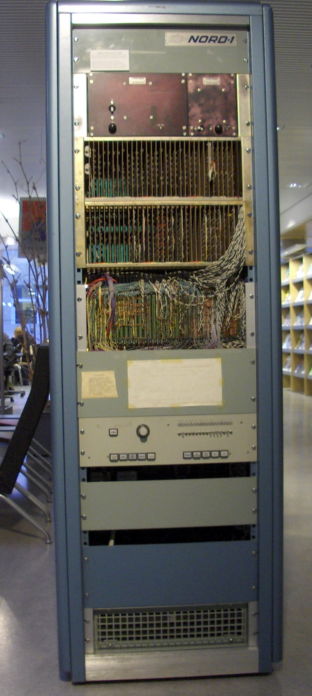

# The NORD-1

Norsk Data's first machine, and the first computer built commercially in Norway.

*A NORD-1 on display, photographed 10 November 2006. The badge carries the early
swept ND logo, used before the 1973 change to the version with the dots. Two card
cages sit above the operator panel with the wiring loom hanging clear; the panel
below shows the register selector knob, the 16 indicator lamps, the 16-switch OPR
register and the two rows of push buttons described later in these notes.
Photo: Thomas Skogestad, [CC BY-SA 2.5](https://creativecommons.org/licenses/by-sa/2.5),
via [Wikimedia Commons](https://commons.wikimedia.org/wiki/File:ND_NORD-1.TS.jpg).
See [images/CREDITS.md](images/CREDITS.md).*

**Sourcing of these notes.** The technical sections have been checked against
**all** the primary ND documents held in `Reference-Manuals/1/` - the
*NORD-1 Reference Manual, Complete Instruction Repertoire* (February 1970),
*ND-01.004.01 Hardware Manual NORD 1* volumes I and II, and *ND-01.005.01
NORD-1 Connectors* (September 1972). Where a line names one of those below, it
was read there, not taken from a wiki. Company history and the surviving-machine
list rest on secondary sources and say so.

The fifth file in that folder, "Binder NORD-1 ITT-1600", turned out **not to be
NORD-1 documentation at all** - see the note at the end of these notes.

## Where it came from

Four men founded the company: Per Bjoerge, Lars Monrad Krohn, Rolf Skaar and
Terje Mikalsen. The personal company NORDATA - Norsk Data-Elektronikk was set up
on 7 July 1967 and became a limited company (aksjeselskap) on 19 September the
same year, with Lars Monrad Krohn as first managing director. Share capital was
194,000 kroner, and the company rented a few square metres from Norsk
Viftefabrikk at Bryn in Oslo. The first year closed 26,000 kroner in the red -
the company's only loss-making year. Nine machines were sold in 1968; turnover
reached 6.25 million kroner in 1969 against 780,000 kroner in permanent-staff
costs.
*Secondary: [norsk-data.com timeline](sources/norsk-data-com-timeline.md), 1967-1969.*

The addresses printed on the manuals track the company moving. The February 1970
Reference Manual and the cover of the September 1972 Connectors manual both give
**A/S NORSK DATA-ELEKTRONIKK, Oekernveien 145, Oslo 5** - the Oekern building the
timeline says ND took 850 square metres in during 1971. But the Connectors
manual's revision record, on the very next page, gives **Erich Mogensens vei 38,
Oslo 5, telephone 21 73 71**. So by September 1972 the imprint had changed while
the cover artwork had not.
*Primary: Reference Manual cover; ND-01.005.01 cover and revision record.*

The machine was designed around the then brand-new 7400-series TTL logic from
Texas Instruments, and was one of the first computers built from integrated
circuits rather than discrete transistors.
*Secondary: [ndwiki NORD-1](sources/ndwiki-nord-1.md). Background on the logic
family: <https://en.wikipedia.org/wiki/7400-series_integrated_circuits> - general
reference, not copied into this repo.*

ND's own pitch called it "a third-generation computer system ... a totally
integrated combination of high performance hardware and efficient software"
offering "advantages normally found only in large computer systems".
*Primary: Reference Manual, 1.1.*

## What it was

### Memory

- Coincident-current ferrite core. **16 memory sizes**, from 4,096 to 65,536
  words. Word length **16 bits**.
- The CPU runs asynchronously to the memory timing, so memories of different
  speed can be mixed. The fastest cycle time the CPU can use efficiently is
  **1 microsecond**.

*Primary: Reference Manual, 1.2 and 2.1.*

Each memory block has its own memory control, which as standard allows direct
access from **two** devices; more channels were an option. Priority between
devices is fixed in the wiring, and the CPU is usually lowest. A data-channel
transfer steals one memory cycle per 16-bit word. **Two CPUs may be connected to
one memory block.** *Primary: Reference Manual, 2.2.*

> **Contradiction inside the primary manual.** Section 2.2 puts the maximum total
> data-channel rate at **16,000,000 bits per second** at a 1 microsecond cycle.
> Section 1.2, eight pages earlier, advertises "approximately **20 million bits
> per second** for memory data channel". Both are in the February 1970 Reference
> Manual. The 16 Mbit/s figure follows arithmetically from a 1 microsecond cycle
> and a 16-bit word; the 20 Mbit/s figure does not, and reads like a sales
> number, possibly for a faster memory. UNRESOLVED - do not quote either without
> saying which section it came from.

### Registers

Eight general registers, four bus-memory registers, two priority-interrupt
control registers. All are 16-bit high-speed integrated-circuit registers.

| Register | What it is |
|----------|------------|
| R | Address register. Not accessible by program. |
| A | Main register for arithmetic and logic straight to memory; also used for I/O. |
| D | Extension of A for double precision and floating point; joins A for double-length shifts. |
| T | Temporary. Holds the exponent part in floating-point instructions. |
| L | Link. Holds the return address after a subroutine jump. |
| X | Index. With indirect addressing it gives post-indexing. |
| B | Base, or second index. With indirect addressing it gives pre-indexing. |
| P | Program counter. Automatic in normal sequencing or branching, but also fully program-controlled. |

Everything except R and P is fully program-controlled and may be used for other
purposes. Two instructions, ROP and SKP, may name a register whose content is
always zero. *Primary: Reference Manual, 2.3.1.*

Two more registers appear on the panel and in the CPU block diagram: **H**, the
bus memory register, and **IR**, the instruction register.
*Primary: Reference Manual, 4.1.4 and the CPU register-structure figure.*

Six program-visible control flip-flops. The Reference Manual is more precise than
the secondary sources here - it names which instructions touch each one:

| Flag | Meaning | Set by |
|------|---------|--------|
| C | Carry | ADD, SUB, RADD, RSUB, COPY, AAA, AAT, AAX, AAB, FAD, FSB, FMU, FDV |
| Q | Dynamic overflow | ADD, SUB, RADD, RSUB, COPY, AAA, AAT, AAX, AAB, MPY |
| O | Static overflow - stays set until cleared by program | same list as Q |
| Z | Floating-point overflow - static; can be wired to an interrupt level so an error routine is triggered | FDV, on division by zero |
| K | One-bit accumulator, used by BOP to hold one-bit data | - |
| M | Multi-shift link - holds the bit discarded by a shift, to ease multiple-precision shifting. With more than one shift pulse in an instruction, M is set to the discarded bit each pulse. | shift instructions |

They move to and from the A-register with BOP, or the TRA / TRR sub-instructions.
*Primary: Reference Manual, 2.3.2.*

### Instruction and data formats

One instruction always occupies one 16-bit word. The operation code is the five
most significant bits (11-15), giving **32 instructions**. Bits 10, 9 and 8 are
the address-mode bits `,X`, `,I` and `,B`. Bits 0-7 are an 8-bit signed
displacement, two's complement with sign extension, **-128 to +127**.

Addressing is relative - to the program counter, or to B or X. That gives direct
reach to 1,024 addresses: 256 relative to the current location, 256 relative to
B, 256 relative to X, and 256 relative to B+X. Indexing and indirect addressing
can be used separately or together, and pre- and post-indexing simultaneously.

Three data types:

- **Single length**: 16 bits, one location, two's complement, -32,768 to 32,767.
- **Double length**: 32 bits, two consecutive locations, addressed by the most
  significant part, normally A (high) and D (low). Range -2,147,483,648 to
  2,147,483,647.
- **Floating point**: 48 bits - 32-bit mantissa magnitude, 1 sign bit, 15-bit
  signed exponent - occupying **three** 16-bit locations addressed by the
  exponent part (n = exponent and sign, n+1 = high mantissa, n+2 = low mantissa).
  The mantissa is always normalised, 0.5 <= mantissa < 1. Exponent base 2, biased
  by 2^14, so a standardised floating zero is zero in all 48 bits. In the CPU the
  floating accumulator is **T:A:D**. Accuracy about 10 decimal digits; every
  integer up to 2^32 has an exact representation. Range roughly 10^-4931 to
  10^4931.

*Primary: Reference Manual, 1.2, 2.4 and 3.1.*

### Interrupts and context switching

A priority interrupt system with **16 levels, numbered 0 to 15, where 15 is the
highest**. Levels can be triggered by external signals, by program, or by the CPU
itself - for instance on a protection violation or a page not in core. Being able
to trigger any level from a single instruction let programmers test
interrupt-driven code before the special equipment existed.

Two 16-bit registers run it, one bit per level: **PID** (priority interrupt
detect) holds a request, **PIE** (priority interrupt enable) allows a level to
run. The running level is the highest with a 1 in both. `WAIT` - "give up
priority" - clears the current level's PID bit. Some PID bits are wired to
predetermined levels in hardware, the rest are customer options.

On a level change the **seven central registers and the status flip-flops are
saved automatically** into core locations belonging to the level being left, and
loaded from the locations belonging to the level being entered - so programs on
different levels can be completely independent of each other. Maximum time with
all registers is **38 memory cycles (45 microseconds)**.

*Primary: Reference Manual, 1.3, 2.5.*

> **The interrupt count is inconsistent in the primary manual too.** Section 1.1
> says "up to 15 external interrupt levels"; section 1.2 says "2 to 16 internal
> program levels and up to 256 external interrupt levels"; section 2.5 describes
> 16 priority levels flatly. The 16-level PID/PIE description in 2.5 is the
> detailed engineering text and is the one to trust; the others are sales
> summaries and probably count configurations or grouped external requests. Also
> from 1.1: external requests can be grouped onto one level, each device can be
> disarmed individually and each level disabled individually, and each group of
> 16 levels can have its group priority assigned differently.

### Memory protection (optional)

Protection covers I/O instructions, interrupt-control instructions, jumps and
memory writes. Privileged instructions - **IOT, TRR, MCL, MST, INTEN, INTDS, ION,
IOF** - execute only when fetched from protected memory. Code in unprotected
memory may write only to unprotected memory, and may not jump into protected
memory. A violation interrupts on **level 14**; on a machine with no priority
interrupt system the illegal instruction acts as a `WAIT` instead.

Memory is split into equal parts, one flag bit each, held in the 16-bit **MPR**
register (loaded with `TRR MPR`, read with `TRA MPR`). Minimum block is 1,024
consecutive locations, valid up to a 16,384-word core; for larger memories the
block is the lowest power of two at or above 1/16 of the core size.

*Primary: Reference Manual, 2.6.*

### Virtual memory - "dynamic core allocation"

This is the feature usually quoted as the NORD-1's first, and the primary manual
describes it in full in **February 1970**:

> "an automatic address interpretation system which allows programs to be written
> for 64K virtual core, with only parts of the program in physical core at a
> given time, the resting part being kept in a mass storage (disc or drum)."

Page size is **256 words**, so a 64K page table is 256 words and is kept in core.
Every memory reference is translated in hardware through the page table. If the
page is absent, or the write is not permitted, an interrupt fires **on the
highest priority level**, forcing an immediate level change into the monitor. In
paging mode, the privileged instructions listed above also trigger an interrupt
if they reach the instruction register - and are not executed.

Panel bit 13 of the F-register reads "paging on (dynamic core allocation)".

*Primary: Reference Manual, 2.7 and 4.1.4.*

This settles the substance of the claim: the NORD-1 really did have hardware
demand paging, documented by ND in early 1970 and dated to 1969 by two secondary
sources. Whether it was the **first minicomputer** to have it is a separate
question this repo has not answered - see Open questions.

### I/O

Two distinct systems. **Programmed I/O** moves a full 16-bit word or an 8-bit
byte to or from the A-register in a single instruction; the same instruction
carries a 16-bit control field outward and accepts status back, so an external
condition can be sensed quickly. It is meant for short bursts and for data that
must be examined the moment it arrives. **Direct-to-memory I/O** (optional) adds
memory buses independent of the program, for very high speed transfer to devices
or other processors. Direct full-word input/output without a programmed channel
gives up to 65,536 output control and input test signals. The system is both
word- and byte-oriented.
*Primary: Reference Manual, 1.2 and 1.3.*

A real-time clock was optional, driven from mains at 60 or 50 Hz, from 1, 2, 4 or
8 kHz oscillators, or from an external input. A power-fail-safe option gave
automatic safe shutdown. *Primary: Reference Manual, 1.3.*

### Front panel

Power button; push buttons STOP, CONT., SINGLE INSTR., SET ADDRESS, DEPOSIT,
LOAD, PROTECT, INTERRUPT, MASTER CLEAR; one 16-switch register **OPR**; 16
indicator lamps; a selector switch. The Teletype and the paper-tape reader count
as part of the panel.

The primary manual is sharper than the wiki on two of these:

- **SET ADDRESS** transfers OPR into *both* the program counter P and the address
  register R, then loads the addressed memory word into the bus memory register
  H. That is what makes it a memory-examine button.
- **STOP** stops after the current instruction, in a special cycle - and it is
  only in that cycle that SINGLE INSTR., SET ADDRESS, DEPOSIT and LOAD work. In
  stop mode the data channel can still reach memory, but no interrupt requests
  are accepted.

MASTER CLEAR's pulse also goes out on the control-word cable for attached
peripherals. Lit, it means memory inoperative (the memory-retention option). OPR
can be read by program with `TRA OPR`. The selector switch picks which of IR, L,
T, D, A, P, R, H, X, B or F the lamps show.

The **F-register** is the machine-state word:

| Bit | Meaning | Bit | Meaning |
|-----|---------|-----|---------|
| 0 | not used | 8-11 | PIL, interrupt level operating |
| 1 | not used | 12 | not used |
| 2 | K, one-bit accumulator | 13 | Paging on (dynamic core allocation) |
| 3 | Z, floating-point overflow | 14 | Reject interrupt (save/unsave program) |
| 4 | Q, dynamic overflow | 15 | not used |
| 5 | O, static overflow | | |
| 6 | C, carry | | |
| 7 | M, multi-shift link | | |

*Primary: Reference Manual, 4.1.*

### Loading a program by hand

With the machine stopped, the Teletype drives a built-in hardware assembler.
Legal characters are the octal digits 0-7, `/`, `!`, carriage return, `$` and
`@`; everything else is illegal. Each octal digit shifts H left three places and
drops the digit into bits 0-2. `/` copies H into the address register and fetches
that location back into H - the same as SET ADDRESS. Carriage return stores H at
the address register and increments it. `!` copies H into the program counter and
starts - the same as SET ADDRESS then CONT. `$` switches to assembling from the
paper-tape reader (the same as the LOAD button); `@` on the tape hands control
back to the Teletype. *Primary: Reference Manual, 4.1.6.*

## How ND designed it

Volume II of the Hardware Manual opens with ND's own account of the design
method, which is the clearest statement of process anywhere in these documents:

1. Decide the number of programmer-oriented registers, and the instruction format
   and repertoire.
2. Draw flow diagrams of every instruction - and with them design the CPU
   arithmetic and the timing control (the Time Counter and Cycle Counter).
3. Translate the flow diagrams into logical equations. ND calls this "straight
   forward mechanical work ... a rewriting of the flow diagrams".
4. Draw the logic diagrams. At this stage the problem is distributing circuits
   across the circuit boards, and naming the sub-signals.

That is why the documentation is shaped the way it is, and it explains the card
list: the boards are the *last* step, a packaging of equations, which is exactly
why two machines could carry different card sets for the same architecture.

The basic data path it sketches is: information bus (IB) into H, H into the
arithmetic unit, out as the sum (S) to bus memory (BM), with A enabled from core
memory. *Primary: ND-01.004.01 Volume II, "Introduction to NORD-1 Documentation".*

## Cabinet, power and channels

The Connectors manual describes the physical machine. One cabinet holds, from the
layout drawing: a power supply, memory, the CPU unit, I/O, a power panel and a
fanbox, with bottom fans and a relay panel. Panel heights are given as power
supply 7 inches, **CPU unit 5 3/4 inches for both CPUs**, memory 13 inches, and
I/O 7 inches each - the "both CPUs" phrasing being another reminder that a
two-processor machine was a normal configuration.

Power is **three 5V supplies plus one 18V supply**. The 18V feeds the memory
circuits; the note on the drawing says to use the third grid for 18V and the
fourth for 5V in the supplies from the power panel. There is a separate TTY power
supply, a noise filter, and an instruction that backplane panels and the front
and rear instrument panels must be properly grounded.

> **A trap worth naming.** The number 18 appears here as a **supply voltage**, and
> it has nothing to do with the "16K x 18 bit" core in the serial-47 price list.
> Do not let the coincidence close that open question.

The **data channel** connects the external interface to the memory interface
through cable drivers and receivers - the 185 or 504 cards - over two connectors,
one for address and control, the other for data in and out. Its signals are
`LWRK` (write, read or write by polarity), `LRQK` (request to the memory
interface), `LRYK` (ready from the memory interface), `LDAK` (address lines) and
`LDDK` (data, direction set by the write signal). Channel priorities are named
O, N, M and L.

The **I/O channel** section covers control and data signals, balanced versus
standard TTL lines, and timing.

*Primary: ND-01.005.01, sections 1 to 4.*

### The peripherals, from the primary side

The Connectors manual documents cabling for a **Digitronics tape reader**, a
**Facit Punch 4070**, the **NORD-1 Teletype**, a **DP-300 card reader**, a
**CDC-9220 card reader**, a **CDC-9342 line printer** and a **Centronics line
printer**.

That is a useful cross-check: three of those - the Digitronics reader, the Facit
4070 punch and the Centronics printer - are exactly what the secondary
serial-47 write-up lists as fitted to that machine. A primary ND document
independently confirms they were standard NORD-1 options.

Compare with the Reference Manual's own peripheral catalogue, which lists
rapid-access data files (262,000 to 2,096,000 bytes per unit, 200,000 bytes/second,
10 ms average access, fixed head per track), a medium-speed data file (8 million
bytes per unit, 108,000 bytes/second, 70 ms average access), 7- and 9-track
IBM-compatible magnetic tape, paper-tape readers at 300 characters/second and
punches at 60 and 120, card readers taking binary and EBCDIC, line printers with
132 print positions, a graph plotter, oscilloscope displays and vector
generators, data communications equipment, digital I/O, and D/A and A/D
converters with multiplexers.
*Primary: Reference Manual, 1.2.*

## The boards

The board list is **primary**, not wiki material: the contents pages of
*ND-01.004.01 Hardware Manual NORD 1* map card number to ND drawing number to
name - 101 "Bus memory" / 2A01, 102 "Register I" / 2A02, 103 "Arithmetic" / 2A03,
and so on up to 194 "Memory buffer driver" / 2A94.

The Hardware Manual also carries **card-position tables for two specific CPUs,
No. 29 (drawing 2B11) and No. 35 (drawing 2B01)** - which is what makes the
serial-47 comparison below possible.

A fuller list, including the 200/300/500-series cards and the 90N/90X "NORD 90"
glue-logic cards that are not in the Hardware Manual contents, is in
[ndwiki NORD-1 boards](sources/ndwiki-nord-1-boards.md). The wiki calls its own
list incomplete, and two entries - 119 and 512 - are "Unknown". Card 145 is in
the primary position table for CPU 29 (position D28, alternating with 179) but is
not named in the manual's contents.

*Minor OCR note: our scan of the Hardware Manual contents renders the I/O control
card as `120/1T` and drawing `2A20/1T`. The wiki has `120/II` and `2A20/II`. The
Roman "II" reading is almost certainly right - the same manual writes `158/II`
and `2A58/II` elsewhere.*

## The machines themselves

*Everything in this section is secondary - it comes from
[ndwiki NORD-1](sources/ndwiki-nord-1.md) unless marked otherwise.*

**Serial 2** was the first sold: an anti-collision system in the NORCONTROL
process-control installation aboard M/S Taimyr, where the wiki says it proved
extremely reliable for its time. It is now with Norsk Maritimt Museum.

At least **142** NORD-1s were built - the wiki's figure, cited to the monthly
computer survey in *Computers and Automation*, August 1974. At least 11 survive,
remarkable for a machine this old. Known survivors: serials 2, 6 (NTNU
Gloshaugen), 19, 39, 50 and 60 (Troeim collection, Telemuseum storage at Fetsund,
2016 inventory), 20 (privately held), 28 (Tokke power station, kept with its old
control room for a planned museum), probably 31 (NTNU, assembled from parts), 37
(Teknisk Museum exhibition) and 47 (Umeaa).

The first complete NORD installation - three NORD-1s and a NORD-5 - went to Det
Norske Meteorologiske Institutt in 1971.
*Secondary: [norsk-data.com timeline](sources/norsk-data-com-timeline.md).*

### One machine in detail: serial 47

Serial 47 is the best-documented survivor, because its owner wrote up the
restoration card by card. It came from Fagskolen Innlandet in Gjoevik in summer
2016 and seems to have spent its whole life at that school; the card lists inside
the front door date the build to **summer 1972**.

As configured: 32KW of core, nine TTY interfaces, a cartridge-disc interface, an
I/O channel, an asynchronous modem, a Centronics printer interface, a Facit 4070
punch interface and a Digitronics tape-reader interface. The core memory is a
**Cambridge Memories Inc EXPANDACORE 18** - one rack holding four controllers and
eight 4KW planes, with two or four channels into it. That matches the Reference
Manual's "two central processing units may be connected to one memory block".

The write-up makes a point worth carrying into any emulation work: **card cage
layouts are per-machine.** Its owner compares serial 47 against the two CPUs
documented in ND-01.004.01 - numbers 29 and 35 - and finds it closest to 29 but
not identical, because the fit depended on which options were ordered. Our copy
of that manual has both tables, so the comparison can be redone here.

A trade-fair price list, year unknown but probably early: CPU 205,000 NOK, 16K x
18-bit core at 1.5 ms 180,000 NOK, Teletype ASR33 14,000 NOK, tape reader 15,000
NOK, tape punch 15,000 NOK, card reader 30,000 NOK - putting that system at about
879,000 NOK.

Full shelf-by-shelf card list, missing cards, restoration log and panel lamp
types: [ndwiki NORD-1 Serial 47](sources/ndwiki-nord-1-serial-47.md).

## The NORD-5 - a compute module bolted to a NORD-1

The NORD-5 is gathered here with the NORD-1 because it is not a standalone
computer. It is a **compute module attached to a NORD-1 host**, and
**the operating system lives in the NORD-1**. Work started in 1970; the first
machine went to the Norwegian Meteorological Institute in March 1972 - the same
installation the timeline describes as three NORD-1s and a NORD-5.

How the pair works: heavy compute-bound jobs are handed out from the main system
while it gets on with other work. The NORD-5 has its own core and runs **one
program at a time**. Assembly and compilation happen on the host, which produces
object code for the NORD-5. An installation with a lot of compute-bound work
could have several NORD-5s sharing a common core pool, with every processor able
to address all of it.

It was 32-bit, and one of the earliest 32-bit minicomputers - the wiki notes it
beat the VAX by six years. A standard machine had a shift matrix and a
floating-point unit: 950 ns for floating add and subtract, and 950 ns for any
shift or bit manipulation regardless of shift count. Floating multiply and divide
took 4 microseconds on 64-bit numbers, or 950 ns with the optional high-speed
multiply unit. The arithmetic units connect asynchronously to the NORD-5 CPU, so
a range of performance levels was possible. The floating/shift module and the
high-speed multiply module are built as logic arrays, and the multiply and divide
modules use Schottky TTL.

At least one NORD-5 is preserved, in the store of the Norwegian
Telecommunication Museum.

*Secondary: [ndwiki NORD-5](sources/ndwiki-nord-5.md), citing ND-NYTT No 5,
September 1972. The architectural point - compute module, OS in the NORD-1 - was
also stated independently by Ronny.*

> **A number that does not match its own cited source.** The wiki says the NORD-5
> does a 64-bit floating-point multiply in **900 nanoseconds**, citing *Software
> Nord-10 Design Goals (TSS-02)*. We hold that document as
> `Reference-Manuals/10/NORD-10-Design-Goals.md`, and our scan of it says
> **300 nanoseconds** - in an otherwise word-for-word identical sentence. One of
> the two is wrong. Our copy is an OCR of a scan, so a misread digit on our side
> is entirely possible; so is a slip on the wiki's. Note also that both figures
> sit awkwardly beside the wiki's own "4 microseconds, or 950 ns with the optional
> high-speed multiply unit" in the very next paragraph. UNRESOLVED - the original
> page needs eyes on it.

### NORD-5 is not NORD-50

Worth stating plainly, because the two names invite confusion and one secondary
source already conflates them.

- **NORD-5** - 1972, a general-purpose 32-bit compute module for a NORD host.
- **NORD-50** - introduced **1973**, and per the primary Design Goals document it
  is *"a special purpose compute unit which performs convolution vector element
  sum operations, scaling, multiplexing, and de-multiplexing operations"*, aimed
  at seismic surveying, doing over a million floating multiplications plus over a
  million floating additions per second. ND calls it an **array processor**.

The [norsk-data.com timeline](sources/norsk-data-com-timeline.md) lists NORD-50
under 1975 as "den andre generasjons 32-bits supermini datamaskin" - a
second-generation 32-bit supermini. That does not match ND's own 1973 description
of a special-purpose array processor. **The primary document wins**; the timeline
entry is either about a later revision or is simply wrong.

We hold primary material on how host and slave talk to each other:
`Reference-Manuals/10/ND-06.005.01 NORD-10 - NORD-50 Communication System.md` and
`Reference-Manuals/10/ND-60.116.01 NORD-10 - NORD-50 Operator's Guide.md`. Also
`Reference-Manuals/Assembler_for_NORD-5_April_1972.md`. None have been read yet.

## What came next

The NORD-1 was succeeded by the NORD-10, introduced in 1973. No NORD-10 notes
exist yet.

There is also at least one machine missing from every timeline used here. The
primary Design Goals document lists a **NORD-2U minicomputer, introduced 1971**,
"very fast interrupt handling ... well suited for data communications,
multi-computer applications and process control". The norsk-data.com timeline
does not mention it at all. Other ND products
named in the same document: **NORDCOM**, a four-colour graphic and character
display system driving standard colour television sets, and the **NORD IDT**
remote job entry terminals, which simulated terminals for Honeywell 6030/6060,
Univac 1108/1110, IBM 360/370 and CDC 3300/6600.

## Open questions - do not fill these in from memory

- **An ND document dates the NORD-1 to 1966.** `NORD-10-Design-Goals.md`, page 3,
  says flatly: *"The company introduced its first computer, the NORD-1, in 1966."*
  The company was not founded until 7 July 1967. Every other source here says the
  machine was designed in 1967 and first sold in 1968. This is a **primary ND
  document contradicting the rest**, so it cannot just be waved away - but neither
  can it be right as written. UNVERIFIED: it may be counting design work that
  predates the company, or it may be a marketing error. Do not repeat "1966" as
  fact, and do not silently delete it either.
- **How many NORD-1s were installed.** The same Design Goals page says *"More
  than 120 installations are in operation today"* (the document is undated in our
  scan but describes the NORD-10 as current, so around 1973). That sits sensibly
  under the "at least 142 built" survey figure of 1974, but the two count
  different things - installations in operation versus machines produced.
- **The data-channel rate contradicts itself inside the primary manual**:
  16 Mbit/s in section 2.2 against "approximately 20 million bits per second" in
  section 1.2. See the box above.
- **The interrupt-level count contradicts itself too**: 15, then 256, then a flat
  16. See the box above.
- **The 18-bit core - now a supported hypothesis, still not proved for the
  NORD-1.** The serial-47 price list quotes "16K x 18 bit" core and the memory is
  a Cambridge Memories EXPANDACORE 18, yet the Reference Manual is unambiguous
  that the NORD-1 word is 16 bits. ND-01.005.01 has been read end to end and does
  not answer it - its only "18" is the **18V memory supply**, a voltage, not a
  width. The ITT-1600 binder does not answer it either; it is about a different
  machine (see the correction below).

  **What has turned up since, now from a PRIMARY ND manual.**
  `Reference-Manuals/10/ND-06.008.01 NORD-10-S Reference Manual.md` states the
  convention outright: *"Memory modules with **18 bits word length provide one
  parity bit per byte**, while 21 bit modules are used for memory error
  correction."* Its memory module list is given as "8K by 18 bits" and "32K by 18
  bits". The same scheme appears in the NORD-12 Reference Manual as quoted on
  [ndwiki NORD-12](sources/ndwiki-nord-12.md): *"Memory parity is an option in
  which case the word-length is 18 bits with one parity bit for each 8-bit byte."*

  So **16 data bits plus one parity bit per byte = 18** is a documented, ordinary
  ND memory convention, in an ND manual rather than a wiki, and ND also built
  21-bit modules for full error correction.

  That makes "the two extra bits are byte parity" a **documented ND convention**
  rather than a guess. It is still **not proof about the NORD-1**: both machines
  cited are later than the NORD-1 and neither uses its Cambridge Memories core,
  and no document we hold says the NORD-1 had parity at all. To close it properly,
  find memory parity in a NORD-1 document, or Cambridge Memories' own EXPANDACORE
  18 documentation. Neither is in this repo. **But the explanation is now the
  ordinary one rather than a speculation.**
- **"First minicomputer with virtual memory."** The feature is now *proved* from
  the primary manual (see above). The word still unproved is **first** - that
  needs a survey of contemporaries, not an ND document.
- **"First minicomputer with floating point as standard"** is still only ND's
  claim repeated by a wiki that tags it `[citation needed]`. The Reference Manual
  proves the hardware floating point; it cannot prove the "first".
- **142 machines built** rests on one 1974 trade-magazine survey - a snapshot, not
  a production total. Serial 47 was built in 1972, so production continued past
  the serials we know best, and may have continued past the survey.
- Boards **119** and **512** are unidentified; **145** is in the primary card
  table but unnamed in the manual's contents.
- **End of production** has no source in hand. Designed 1967, first sales 1968,
  serial 47 built summer 1972.

## Sources used

**Primary** - ND documents held in this repo:

- `Reference-Manuals/1/NORD-1 REFERENCE MANUAL-1970 February.md` - February 1970,
  Complete Instruction Repertoire. **Read for these notes.**
- `Reference-Manuals/1/ND-01.004.01 HARDWARE MANUAL NORD 1.md` - card list,
  drawing numbers, card positions for CPU 29 and CPU 35. **Read for these notes.**
- `Reference-Manuals/1/ND-01.004.01 vol2 flow diagrams.md` - Volume II, flow
  diagrams, and ND's account of its own design method. **Read for these notes.**
- `Reference-Manuals/1/ND-01.005.01_NORD-1_Connectors...September_1972.md` -
  September 1972, written by T. Fledsberg. Connectors, I/O channel, data channel,
  device connections, cabinet layout and power system. **Read for these notes.**
  It does *not* answer the 18-bit core question.

The scans are credited "Scanned by Jonny Oddene for Sintran Data (c) 2012".

### Correction: "Binder NORD-1 ITT-1600" is not a NORD-1 document

`Reference-Manuals/1/README.md` lists this 6,901-line file under **Peripherals**
as "NORD-1 peripheral binder - ITT-1600 documentation". Reading it shows that is
wrong, and the mistake matters, because the file looks like primary NORD-1
material and is not.

What it actually is: Norwegian teaching or study notes titled *"Assemblerspraak
paa ITT-1600"* - the assembly language of the **ITT-1600**, a different computer,
used with an ITT telex exchange. The notes describe that machine's own
architecture: **16 bits plus one parity bit**, an A accumulator, a B extension,
an X index register, a C overflow bit, a Q stack pointer at octal address 40,
memory protection in 512-word sectors, and a 15-bit program counter. Bound in
with it are Texas Instruments datasheets - the SN54S181 / SN74S181 ALU among
them.

Its connection to the NORD-1 is that the author keeps **comparing** the two
machines in the margins: the M register "tilsvarer NORD-1?" (corresponds to
NORD-1?), the 7-bit F register "tilsvarer IR-registeret i NORD-1", the phase
register indicating the cycle "som NORD-1 manualen kaller det" (as the NORD-1
manual calls it). So it is a genuine period document about how a NORD-1 person
read a competing machine - which is interesting history - but it is **not** a
source for any statement about the NORD-1 itself.

**The specific danger.** The ITT-1600 has a parity flip-flop, with skip
instructions `SSC` and `SPS` to test it. Grep this folder for "parity" and those
are the only hits, so it is easy to grab them as evidence that the NORD-1's core
carried parity bits and thereby "explain" the 18-bit core. That would be wrong
twice over: the parity belongs to a different computer, and that computer is
16+1 bits, not 18.

The repo's index entry has been corrected. The file is worth keeping where it is
- it came in the same binder - but it is now labelled for what it is.

**Secondary** - copied verbatim into `History/sources/`:

- [norsk-data.com year-by-year timeline](sources/norsk-data-com-timeline.md)
- [ndwiki: NORD-1](sources/ndwiki-nord-1.md)
- [ndwiki: Detailed description of the NORD-1 CPU](sources/ndwiki-nord-1-cpu-detail.md)
- [ndwiki: NORD-1 boards](sources/ndwiki-nord-1-boards.md)
- [ndwiki: NORD-1 Serial 47](sources/ndwiki-nord-1-serial-47.md)

Reading the primary manual alongside the wiki showed the wiki's NORD-1 and
CPU-detail articles are in large part a transcription of the Reference Manual's
sections 2.1 to 2.3 and 4.1 - close to word for word. That is good news for their
accuracy and it means they add nothing the manual does not already say. Where
they *do* add something - the mapping of registers onto specific cards - it is
their own reverse engineering from schematics and remains unverified here.
