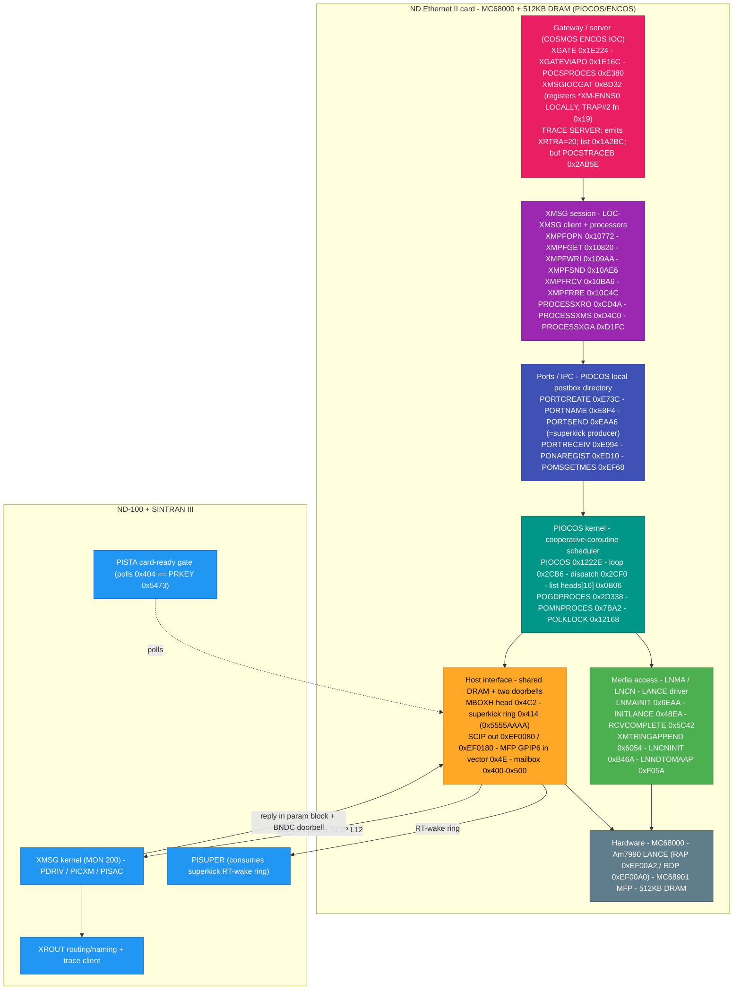

# PIOCOS / ENCOS - RTOS architecture map

Reverse-engineered structure of the real-time OS on the Norsk Data Ethernet II controller
(ND-110063 / PCB 3094): a MC68000 comms front-end that the ND-100 host loads into card DRAM and
releases from reset. A cooperative-coroutine kernel (PIOCOS) carrying the COSMOS gateway server
(ENCOS) and its LOC-XMSG client.

All addresses are HEX, byte-verified in Ghidra against `../../x/stripped/encos-ser-all-banks-68k.bin`
(MC68000 big-endian, base 0x0) or read from the firmware's embedded symbol table. Tag **[V]** =
verified, **[I]** = inferred. A hosted, interactive version of this map exists as a Claude artifact
(see the RE hub for the link).

Hardware: MC68000 BE + 512 KB DRAM (no EPROM, host-loaded) + Am7990 LANCE + MC68901 MFP.
OS name confirmed **PIOCOS** by ND's own AIP error text `AIPpiocError : PIOCOS error`
(see [PIOCOS README](README.md) section 1). 241 vendor symbols recovered.

---

## 1. Software stack (application at top, silicon at bottom)

Every call between coroutines is a `TRAP #2` supervisor call. The card cannot issue MON 200 itself; it
posts each XMSG call on the MBOXH queue for the ND-100 kernel to run.

Notes:
- The gateway registers its endpoint name `*XM-ENNS0` **locally** (XMSGIOCGAT); the global XROUT name is
  created **host-side** by SINTRAN XMSG in response. [V] (see [LOC-XMSG-CLIENT.md](LOC-XMSG-CLIENT.md) sec 7)
- There is one `XMPF*` wrapper per XMSG function; **no** `XMPFDBK`/`XMPFWDF` exist - XFDBK/XFWDF are
  kernel-issued on the virgin element. [V]
- The card is the XROUT **trace server** (it produces XRTRA), not a trace client - so the "trace already
  active" fix is client-side, not a firmware branch to mirror. [V] (sec 8)

---

## 2. Coroutine task model [V]

No preemption. Tasks yield and are resumed by continuation pointers - which maps 1:1 onto C# async/await.

| Step | Mechanism |
|------|-----------|
| loop | Scheduler `0x2CB6` scans 16 priority list-heads `0x0B06` |
| run? | Node runs when status-byte bit1 (slot+23) is **CLEAR**; set = blocked. No `bset` exists in the image. |
| go   | Dispatch `0x2CF0`: load SP from (108,A1), `movem` restore, resume |
| yield| `jmp (A5)`; A6 = coroutine activation frame |
| wake | Unblock `bclr #1,(23,An)` only at `0x2292` (timer) and `0x259A` (message dispatch) |
| idle | Nothing runnable -> `STOP #2000`, wait for interrupt |
| dir  | Process directory `POGDPROCES 0x2D338`: tag `POMN` -> `0x7BA2`, `POCS` -> `0xE380` |

---

## 3. MBOXH XMSG handshake (card <-> ND-100) [V]

| Step | Action |
|------|--------|
| 1 | Card writes the 6-word param block (func/A/D/X/uaddr) + element on the `0x4C2` queue, sets NXFNC bit3 |
| 2 | Card rings SCIP `0xEF0080` -> ND-100 interrupt level 12 |
| 3 | Kernel `PDRIV/PICXM` runs MON 200; a virgin element (NXXTB=0) triggers XFDBK+XFWDF first |
| 4 | `PISAC` writes the reply back **in place**: ISTAT+A -> param P0, D+X -> param P2 |
| 5 | Kernel sets NXFNC bit1 (done) + rings `PWCR.BNDC` -> card MFP GPIP6 (vector `0x4E`) |
| 6 | Card reaps the element, reads ISTAT/A/D/X, decides the next call |
| RT | Deliver to an ND-100 RT program (ENNS0): superkick ring `0x414` + SCIP `0xEF0180` -> `PISUPER` |

Bring-up gate: host loads the image, releases the 68000, which writes PRKEY `0x5473` to `0x404`; the
ND-100 `PISTA` gate polls `0x404` and only then treats the card as live. [V]

---

## 4. DRAM memory map (0x0 .. 0x80000, 512 KB, host-loaded)

| Range | Region | Key contents |
|-------|--------|--------------|
| `0x00000-0x003FF` | Low core [data] | reset vectors; PIOC/ND100 config `0x64C/0x64E`; control-block table `0x0A8A`; sched list-heads `0x0B06`; nd_channel_flags `0x0B56` |
| `0x00400-0x004FF` | Mailbox [data] | PRKEY `0x404=0x5473`; REQ/SUBFN `0x406/0x408`; postbox `0x40A-0x40E`; superkick hdr `0x414`; STARTED `0x4C0`; MBOXH `0x4C2`; queue-2 `0x4C6`; ctrl-ptrs `0x4CA` |
| `0x04660-0x13748` | Code | PIOCOS kernel, LOC-XMSG, ports, gateway, LANCE driver, monitor. `END_PIOCOS` marker `0x4660` |
| `0x18000-0x18942` | LANCE / NMA [data] | RX ring `0x18000`; TX ring `0x18408`; init block `0x18810`; station MAC `0x1885E`; stats `0x1888C`; mode words `0x18886/8/A`; group list `0x18942` |
| `0x1A200-0x1E232` | Gateway queues [data] | connection + retransmit list heads (QFREECONN, QWORKCONN, RETRYQCMD ...); active-trace list head `0x1A2BC` |
| `0x2AB5E-0x2D354` | Server data [data] | trace buffer `POCSTRACEB 0x2AB5E`; name blob `*XM-ENNS0` `0x2D282`; process directory `POGDPROCES 0x2D338`; port directory `0x2D354` |
| `0x663E0-0x689FF` | Symbol table [data] | the firmware's own linker symbols - 241 names, 32-byte records (source of every vendor name here) |

Note: the mode words we rely on for TCP/IP feasibility (`g_mode8023LengthField 0x1888A`,
`g_addressFilterEnable 0x18888`, `g_txMinLengthPadMode 0x18886`) have **no** vendor symbol entry, so
those reverse-engineered names stand on their own analysis. [V]

---

## Related

- [README.md](README.md) - PIOCOS/ENCOS overview + verified-anchor table
- [LOC-XMSG-CLIENT.md](LOC-XMSG-CLIENT.md) - the on-card XMSG client, reply contract, and the two
  (now resolved) bring-up questions
- [../../x/stripped/docs/ENCOS-FIRMWARE-SYMBOL-TABLE-2026-07-26.md](../../x/stripped/docs/ENCOS-FIRMWARE-SYMBOL-TABLE-2026-07-26.md) - the 241-symbol table
- [../../../../../SINTRAN/XMSG/DOC/COSMOS-RE/ETHERNET-II-FEASIBILITY-AND-MODE-WORD-RE-2026-07-25.md](../../../../../SINTRAN/XMSG/DOC/COSMOS-RE/ETHERNET-II-FEASIBILITY-AND-MODE-WORD-RE-2026-07-25.md) - RX/TX framing + mode word
