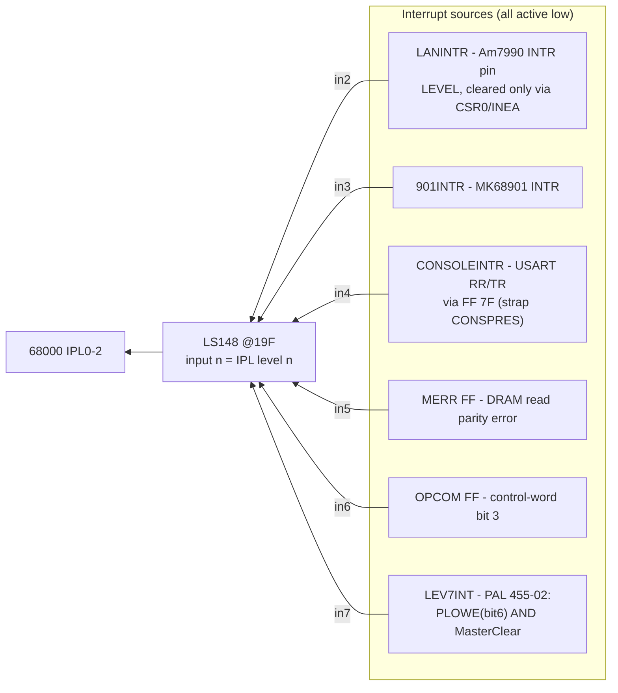
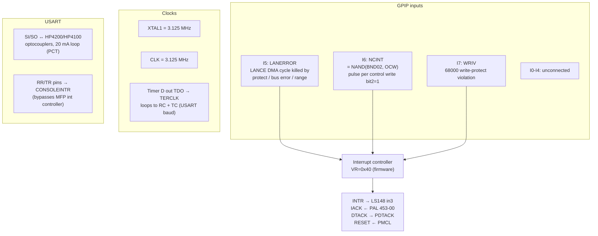
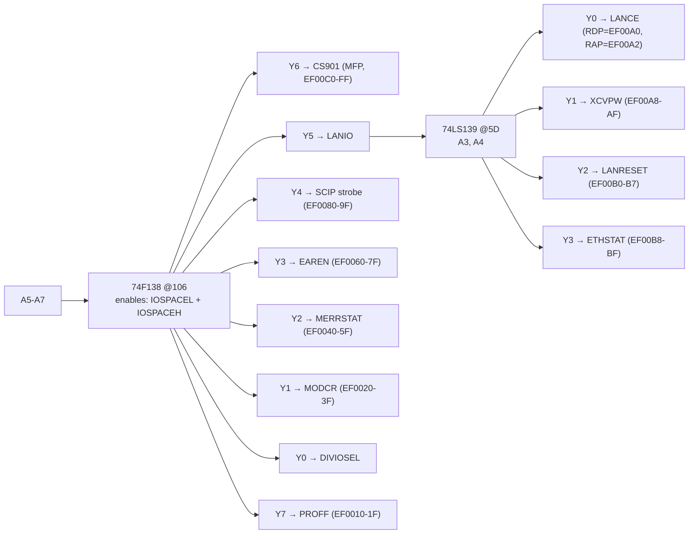
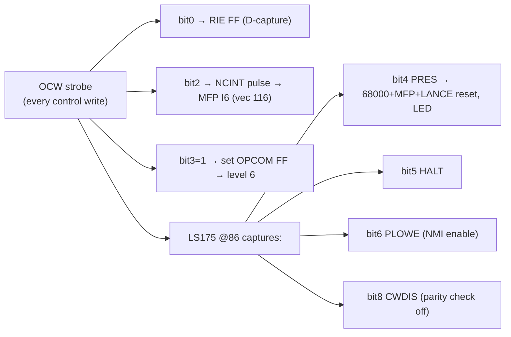
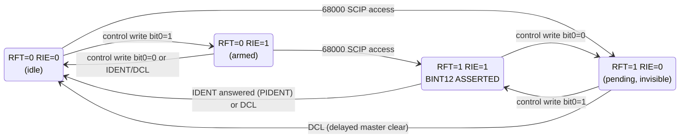
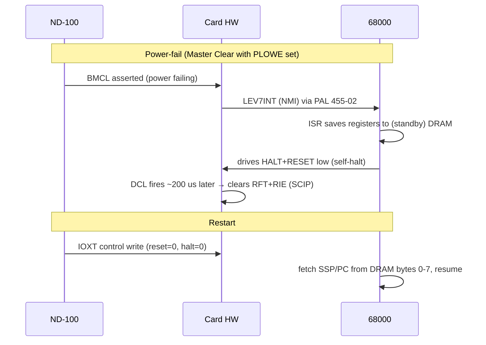

# Ethernet II Controller (ND-110063) — Hardware Description, Detail Level

**Gate-level description of card 324534 print G. Every statement is traced to a
schematic sheet (`[S1..S5]` in `../EthIIImages/`) or the manual (`[M:page]`,
original PDF of ND-12.055.1 EN). PAL behavior is inferred from pin names (no dumps) —
marked `[INF]`. High-level companion: [EthII-hardware-highlevel.md](EthII-hardware-highlevel.md);
net-by-net data: [EthII-interrupt-clock-netlist.md](EthII-interrupt-clock-netlist.md) /
[EthII-netlist.json](EthII-netlist.json).**

Sheet map: S1 CPU+memory control · S2 bus buffers · S3 DMA and I/O control (MFP,
N100 bus) · S4 DRAM + parity · S5 LANCE/SIA/transceiver.

---

## 1. 68000 core [S1]

- **MC68HC000-12 @18D**, CLK = 12.5 MHz (T12CLK via 56 Ω). Print-G runs 12.5 MHz;
  the manual (earlier print) says 10 MHz [M:11].
- **DTACK** = AND @13A of three sources: `MDTACK` (DRAM control), `IDTACK` (I/O
  decode), `PDTACK` (the MK68901's own DTACK output pin).
- **BERR**: LS165 @12B shifts a '1' at ≈6.25 MHz while a cycle hangs
  (AS asserted, `NOREQ·LANGR`); Q7 after 8 stages → BERR ⇒ ≈1.3 µs bus timeout.
- **VPA** ← `AUTOVECTOR` from PAL 453-00 (autovectored interrupt levels).
- Bus arbitration (BR/BG/BGACK) between 68000, LANCE (`LANGR`), and the ND-100
  port; DRAM priority ND-100 > LANCE > 68000 [M:16].

### 1.1 Interrupt priority encoder

### 1.2 IACK decode — PAL 453-00 (PAL16L8B @21C) `[INF pin roles, M-confirmed effects]`

Inputs `A1-A3, FC0-FC2, BGACK, R/W, BAS, RESET`. During IACK (FC=111, A1-A3=level):

| Output | Effect |
|---|---|
| `IAK901` | routes the IACK to the MFP → MFP supplies vector (level 3) |
| `AUTOVECTOR` | drives 68000 VPA (levels 2,4,5,6,7) |
| `CLROPCOM` | **level-6 IACK resets the OPCOM FF** |
| `CLRMERR` | **level-5 IACK resets the MERR FF** |
| `CLRREDY` | clears the console-ready FF |
| `CPUWR`, `PRI`, `IAKE` | write strobe / DRAM priority / ack enable `[INF]` |

### 1.3 Interrupt-source detail

| Level | Source logic | Set by | Cleared by |
|---|---|---|---|
| 2 | Am7990 INTR pin (o.d., pull-up) [S5] | any unmasked CSR0 cause while INEA=1 | firmware CSR0 write, INEA=0, LANRESET — **NOT by IACK** |
| 3 | MK68901 INTR | MFP channel logic | MFP ISR protocol |
| 4 | FF 7F + gate 26G from `RREDY`/`TREDY` (MFP USART ready **pins**) [S3] | console rx/tx ready | `CLRREDY` (IACK) |
| 5 | F74 @18F [S4] | read parity error `RPERR` clocked on AS·T6 | `CLRMERR` (IACK-5) |
| 6 | LS74 @7F [S1] | **clocked by every control write with bit3=1** (NAND BND03·OCW) | `CLROPCOM` (IACK-6) |
| 7 | PAL 455-02 registered [S1] | `PLOW` = PLOWE(bit6) **AND** MCL (Master Clear) | PLOW deassertion `[INF]` |

## 2. MK68901 MFP @29G [S3]

**Vector map (VR=0x40, octal)** [M:28, matches GPIP wiring]:
117 GPIP7=WRIV · 116 GPIP6=NCINT (ND-100 doorbell) · 114/113/112/111 USART
rx-full/rx-err/tx-empty/tx-err · 107 GPIP5=LANERROR · 105 Timer C = RTC.
Timer C: TCDCR=0x50 (÷100), TCDR=244 ⇒ 3.125 MHz/100/244 ≈ **128.07 Hz**.
Timers A/B unused [M:27]. MFP registers at odd addresses only (DS←LDS) [M:22].

## 3. 68000 address decode [S1 16D, S3]

PROM 452-00 @16D decodes A(09-23) → `PROTS ROMS IOSPACEH IOSPACEL DRAMS`.
**Both** IOSPACEL (EF00xx) and IOSPACEH (EF01xx) enable the F138 @106 ⇒
**EF01xx ≡ EF00xx** ("decoded twice" [M:22]) — there is no device unique to EF01xx.

Full memory map [M:21]: `000000-07FFFF` DRAM (RAM mode) · `800000-81FFFF` EPROM ·
`EF0000-EF01FF` I/O · `F00000-F7FFFF` protect table · `F80000-FFFFFF` RAM image
(ND-100 view). EPROMMODE (EF0020) swaps DRAM/EPROM at the bottom for vector fetch.

Register details:
- **ETHSTAT** (R): S244 @9E [S5]: bit0 = LANINTR pin (live), bit2 = PWEN. Active-LOW.
- **XCVPW** (W): D0 → PWEN FF @11E [S5]; R̄ = PWOFF from the LM339 +12 V sense —
  hardware force-off on supply sag.
- **LANRESET** (W): pulses the Am7990 RESET (OR-ed with system reset).
- **MERRSTAT** (R) [M:24]: b10 write-to-parity, b9/b8 = A18/A17 of error, b7/b6 =
  NGACK/BGACK (which master saw the error: 00 ND-100, 10 LANCE, 11 68000),
  b3/b2 parity error hi/lo byte, b1/b0 parity bits read.
- **EAREN** (R): error address A1-16 from latches @25E/23D [S4].
- **MODCR** [M:25]: EF0020 EPROMMODE, EF0022 PARITYDIS, EF0024 BREAKMODE, EF0026
  spare. Single-bit registers, cleared by RESET. PARITYDIS+BREAKMODE = forced-parity
  breakpoints [M:18].
- **SCIP** (W): any access clocks the RFT FF (§4). "Status Change In PIOC" [M:23].
- **PROFF** (W): supervisor override of the protect table.

Write protection: 1 Kbit SRAM, one bit per 512-byte DRAM segment; user-mode write to
a protected segment ⇒ BERR + WRIV (MFP I7, vector 117) [M:19]. Table itself mapped at
F00000+; PROFF bypasses.

## 4. ND-100 bus interface [S2, S3]

### 4.1 Selection and registers

- Bus signal buffers @3B: BMCL→MCL, BAPR, BIOXE→IOXE, BINPUT, BINACK, BDAP→BDAR,
  BMEM; INGRANT passes straight through (card is not in the DMA-grant chain).
- Thumbwheels @7J/9J + two F521 comparators (@10B/@7B) match the IOX address →
  `DEQL`. LS139 @5D (2nd half) decodes address bit 0 with the strobes into:
  `OCW` (control write, +1/+3) and `OSR` (status read, +0/+2). Address bit 1 is
  ignored ⇒ +0≡+2, +1≡+3 [M:29-30].
- IDENT: thumbwheel @11J addresses PROMs 089-00/089-01 which drive the ident code
  (2240-2243₈) onto BD00-15 during `PIDENT`.

### 4.2 Control word → card actions

Note the asymmetry: bits 0/4/5/6/8 are **levels** (re-captured every write); bit 2 is
a **pulse** per write; bit 3 **sets a latch** per write.

### 4.3 INT12 machinery (to the ND-100)

- `BINT12` (open collector, Ca16) = RFT **AND** RIE. Status bit 2 shows the same
  AND — a pending-but-disabled doorbell is invisible.
- `CLINT` = `DCL` (delayed clear, ~200 µs after power-low/master-clear [M:18]) OR
  `PIDENT` (this card answered IDENT). **CLINT resets BOTH flip-flops** — after an
  IDENT the driver must re-write control bit 0.
- IDENT daisy chain: `INIDENT` in → if `LINT12` (INT12 latched at BAPR time in F174
  @9A) claim with `PIDENT` (PROM code onto BD, BDRY), else propagate `OUTIDENT`.

### 4.4 DMA-master error reporting [S2]

When the card masters the ND-100 bus (NGACK) and a read parity error occurs
(`NPERR` = RPERR·PARITYDIS̄): assert `BERROR` (Cb21) + `PARERR` (Cb18 o.c.) and gate
an error code onto BD16/17/21 (S240 @3A).

## 5. Memory and parity [S4]

- 16× HM51256P-10 + 2 parity chips = 512 KB with byte parity; standby-powered
  (contents survive power fail) [M:18]. Refresh + arbitration on S1.
- Parity: two F280 trees (15H low, 15G high byte). On CPU/LANCE **reads** with
  LDS/UDS: `PERRL/PERRH` → `PERR` → `RPERR` → (a) MERR FF → level 5, (b) DMA-master
  BERROR/PARERR path, (c) red LED latch (cleared by CLRLED = reset).
- Error capture: `SYREN` latches status @22E, `EAREN` latches address A1-16
  @25E/23D — read via MERRSTAT/EAREN.
- EPROM sockets 2× 27512 @13C/13D: **shipped empty** [M:20].

## 6. LANCE / SIA / transceiver [S5]

- Am7990 DAL0-15 multiplexed bus, A16-23 latched; DAS/READY/HOLD handshake
  sequenced by PAL 455-01 @9F `[INF]`; LANCE DMA window = full DRAM; internal
  25.6 µs memory timeout [M:15].
- Am7992B SIA: 20 MHz from 40 MHz osc @17A (÷2, or EXTLANCK test input);
  PE64102 isolation transformer; TSEL strap network.
- Transceiver power: PWEN FF → +12 V switch (TRL-2N4920 pass transistors), VSENSE
  comparators LM339: `PWOFF` force-clears PWEN; `EXTPOWER` sense; yellow "EXT 12V"
  LED. The current switch also trips autonomously on overcurrent [M:25].

## 7. Reset / power-fail sequences [M:18, S1]

Master Clear (or power-on) always sets RESET+HALT and clears local I/O activity
[M:29]. `PMCL` also hardware-resets the **MFP** and pulses the LANCE reset — an
ND-100-commanded reset re-initializes all peripherals.

## 8. Known documentation errata

- Manual p.27 "PCT interrupts on level 5 via the MFP" contradicts p.12 and the
  schematic (console = level 4 via RR/TR pins; level 5 = parity error).
- The OCR'd Markdown of the manual in NDInsight contains hallucinated passages —
  always verify against `mirror/library/libhw/ND-12055-1-EN.pdf`.
