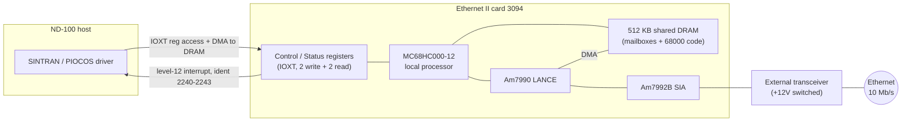
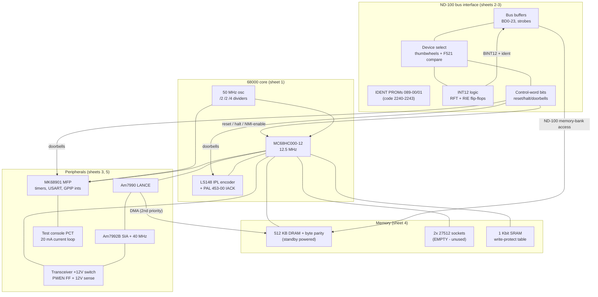
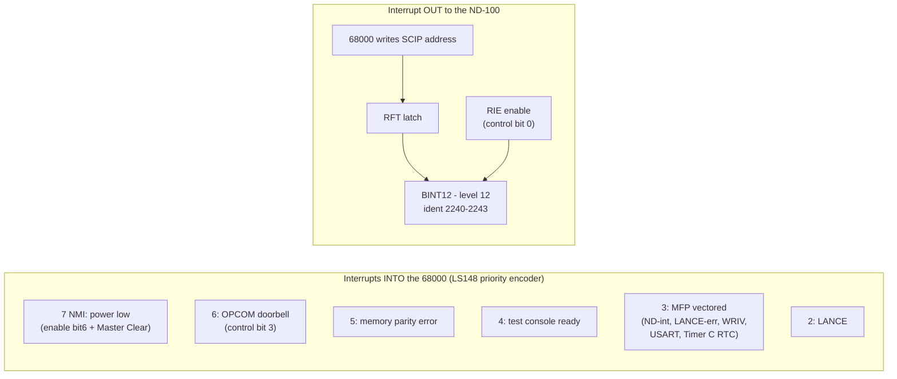
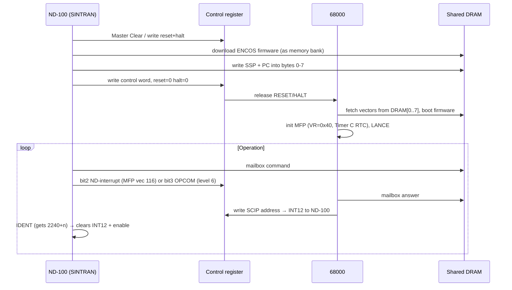

# Ethernet II Controller (ND-110063) — Hardware Description, High Level

**Card 324534 (print G), PCB 3094. Sources: schematics `../EthIIImages/` (byte-verified
at 300 dpi) and the technical manual ND-12.055.1 EN (original PDF). Detail-level
companion: [EthII-hardware-detail.md](EthII-hardware-detail.md).**

The Ethernet II is the ND-100-bus Ethernet controller: a complete single-board
68000 computer that SINTRAN/PIOCOS talks to through two IOXT registers, shared DRAM,
and a level-12 interrupt. The card boots nothing by itself — the ND-100 downloads all
68000 code (ENCOS) into the card's DRAM and releases it from reset.

## 1. System context

- **Bus attachment:** ND-100 I/O bus. Device addresses 140360/140364/140370/140374₈
  (thumbwheel-selected), ident codes 2240–2243₈, interrupt level 12.
- **Memory attachment:** the card's DRAM appears as an ND-100 memory bank
  (bank number set by thumbwheels, read back in the status register).

## 2. Board block diagram

**DRAM access priority:** ND-100 (highest) → LANCE → 68000 (lowest). [M:16]

## 3. The two host-visible registers (IOXT)

| Access | Address | Register |
|---|---|---|
| read | device +0 or +2 | **Status**: bits 15-8 bank number, 5 halt, 4 reset, 2 INT12 pending, 0 interrupt enabled |
| write | device +1 or +3 | **Control**: bit 0 enable SCIP int, 2 ND interrupt (→MFP), 3 start OPCOM, 4 reset, 5 halt, 6 power-low enable, 8 disable parity check |

## 4. Interrupt architecture at a glance

- Levels 2,4,5,6,7 are **autovectored** (PAL drives VPA); level 3 is **vectored by
  the MFP** (vector base 0x40 → octal vectors 105–117).
- Levels 5 and 6 are cleared **by the IACK cycle itself** (PAL outputs CLRMERR /
  CLROPCOM) — a hardware detail the firmware relies on.
- The IDENT answer on the ND-100 side clears **both** the INT12 latch and the enable.

## 5. Clocks and timers (complete list)

| Clock | Value | Purpose |
|---|---|---|
| 50 MHz osc → ÷2 ÷2 | 12.5 MHz | 68000 CPU clock, control PALs |
| → ÷4 | 3.125 MHz | MFP clock (XTAL1 + CLK) |
| 40 MHz osc → ÷2 | 20 MHz | SIA (Ethernet 10 Mb/s Manchester) |
| MFP Timer C | ≈128.07 Hz | the ONLY periodic system timer (RTC, vector 105₈) |
| MFP Timer D | firmware-set | USART baud (loops back to RC/TC) |
| BERR shifter | ~1.3 µs | 68000 bus-cycle timeout |
| DCL RC | ~200 µs | delayed clear after power-low |

There is **no other timer hardware** — no RTC chip, no interrupt/timer controller.

## 6. Life cycle

## 7. What differs from the Ethernet III

See [EthIII-hardware-highlevel.md](EthIII-hardware-highlevel.md). In one line:
Ethernet II = ND-100-bus card, 68000, all code downloaded; Ethernet III (110513) =
ND-5000-era MF-bus + octobus card, 68020, self-booting from EPROM.
