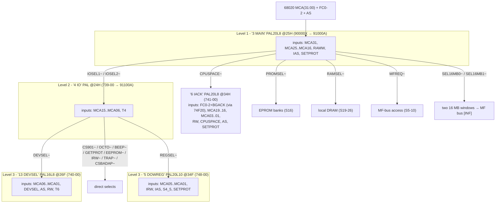
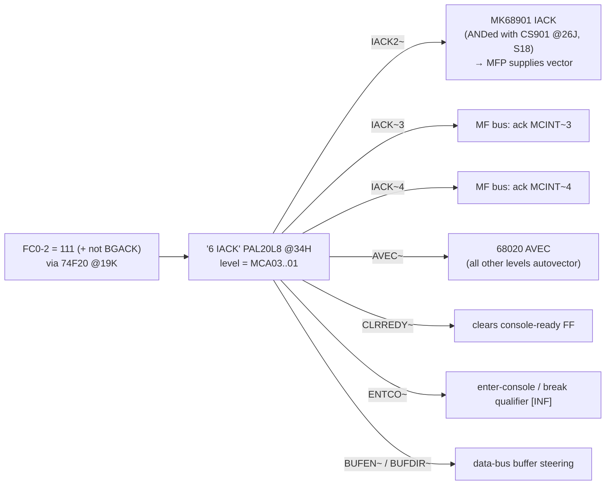
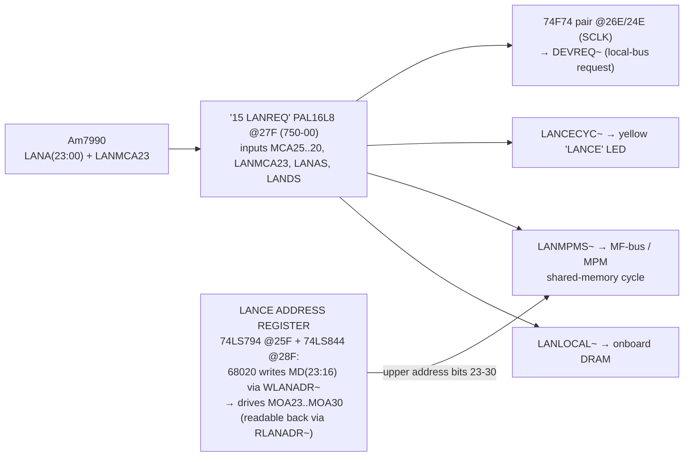

# Ethernet III — 68020 Address Decode (traced from sheets 13 + 30, with sheet 12/18 context)

**Result of tracing S13 (CONTROL/ADDR_DECOD, print H) and S30 (DEVICE/DECOD, print H)
of `../EthIIIImages/`. Bottom line: the full decode HIERARCHY, every chip-select and
register strobe, and the IACK map are now extracted — but the schematics contain NO
absolute addresses. All base addresses are programmed inside PAL equations (no dumps
exist; print H even replaced three of the PALs — handwritten "nytt nr": 91000A,
91100A, 91300A). Absolute values are only recoverable from an EPROM/firmware dump or
PAL dumps. Everything below is schematic-verified structure; function names beyond
the printed net names are marked `[INF]`.**

## 1. Decode hierarchy

Granularity implied by the input sets (not the actual values):
- **Level 1** sees MCA31 and MCA25-16 ⇒ regions resolved down to 64 KB within the
  low 64 MB, plus an upper/lower-2GB split on MCA31. MCA30-26 are NOT decoded —
  large spaces repeat/mirror across them.
- **Level 2 (I/O page)** sees MCA15-06 ⇒ selects with 64-byte granularity inside
  the IOSEL region.
- **Level 3** strobes see MCA05/06-01 ⇒ individual word registers.

## 2. Complete select / strobe inventory

### 2.1 "3 MAIN" @25H — top-level regions
| Output | Meaning |
|---|---|
| `PROMSEL~` | boot EPROMs (split DEVICE/OPCOM by MCA17 on S16) |
| `RAMSEL~` | local DRAM (4 banks) |
| `IOSEL1~`, `IOSEL2~` | I/O page enable(s) for the "4 IO" PAL |
| `MFREQ~` | forward the cycle to the **MF bus** |
| `SEL16MB0~`, `SEL16MB1~` | two 16 MB windows (MF-bus/MPM apertures `[INF]`) |
| `CPUSPACE~` | FC=111 space → IACK PAL |

### 2.2 "4 IO" @24H — I/O page selects
| Output | Meaning |
|---|---|
| `CS901~` | MK68901 MFP (odd addresses, A1-A5) |
| `OCTO~` | octobus gate array; gated with `MCA06` + read/write into `CSOCTO~` (write side) and `ROCTO~` (read side) via 74F32 @33E, plus `GRSEL` (74F20 @33F) `[INF names]` |
| `BEEP~` | beeper strobe |
| `REGSEL~` | register block → "5 DOWREG" strobes |
| `DEVSEL~` | device section → "13 DEVSEL" strobes (S30) |
| `GETPROT` | read protection RAM (S27) |
| `EEPROM~` | EEPROM select (S16) |
| `IRW~` | internal register read/write qualifier |
| `TRAP~` | software-trap/test strobe `[INF]` |
| `CSBADAP~` | **MFA bus-adapter chip select** (S7-8) `[INF]` |

### 2.3 "5 DOWREG" @34F — register strobes (within REGSEL)
| Strobe | Direction | Meaning |
|---|---|---|
| `RMSR~` | R | read machine status register `[INF]` |
| `WMCR~` / `RMCR~` | W / R | write / read machine control register `[INF]` |
| `RINT7~` | R | **read the INT7 pending set** (PAL20RA10 @37G drives MD23:16) |
| `CINT7~` | W | **clear INT7 sources** |
| `RCOUNT~` | R | read octobus/event counter (COUNT4D, S11) |
| `EEPWR~` | W | EEPROM write enable |
| `WDOGRES~` | W | **watchdog reset (pet)** — LS292 @29D |
| `RESOCINT~` | W | reset octobus interrupt |
| `XCLK~` | — | external clock strobe (test connector) `[INF]` |

### 2.4 "13 DEVSEL" @26F — device strobes (within DEVSEL, S30)
| Strobe | Meaning |
|---|---|
| `CS590~` | **Am7990 LANCE chip select** (RDP/RAP by MCA01) |
| `XCVPW~` | transceiver +12 V power register |
| `ETHSTAT~` | status read: LS244 @17C gates LANINTR/PWEN/ETHSTAT onto MD(19:16) |
| `WLANADR~` / `RLANADR~` | write / read the **LANCE ADDRESS REGISTER** (see §4) |

### 2.5 "14 DEVACK" @23G (749-00 → 91300A) — acknowledge/size
Generates `DEVACK0~/DEVACK1~` (→ DSACK PAL @27H on S15) and `SIZ0/SIZ1` responses
for device-section accesses (8/16-bit ports on the 32-bit bus), from DEVSEL, AS,
MCA06, LANDTACK, UDS/LDS, BGACK, T4/T6.

## 3. Interrupt-acknowledge map — "6 IACK" @34H

Confirmed structure: **level 2 = MFP, vectored** (the only vectored level);
**levels 3 and 4 = MF-bus command interrupts** (ack forwarded onto the bus);
**everything else autovectored** via AVEC. Note the contrast with Ethernet II
(MFP on level 3 there, LANCE on level 2 — on Ethernet III the LANCE interrupt goes
through the MFP's GPIP4 instead of its own IPL level). Exact LS148 input order for
the remaining sources (OCINT, console, INT7) is still `[PARTIAL]` — see S18 note in
the detail doc.

## 4. LANCE DMA address path (S30) — the LANCE reaches the MF bus

This is an architectural difference from Ethernet II (whose LANCE could only reach
the card's own DRAM): on Ethernet III the LANCE's 24-bit DMA address is classified
by the "15 LANREQ" PAL into **local DRAM** vs **MF-bus (MPM shared memory)** cycles,
with the software-loaded LANCE ADDRESS REGISTER supplying address bits 23-30 for the
system-memory aperture — packet data can DMA straight into ND-5000 shared memory
`[INF on the exact aperture semantics]`.

## 5. What is still NOT recoverable from the schematics

1. **Absolute base addresses** of every select above — they are PAL-internal.
   Sources that would resolve them: dumping the two EPROMs from a physical card
   (disassembly reveals the register addresses immediately), PAL dumps, or an ND
   internal memory-map document. The TCP/IP install docs contain no addresses.
2. PAL equations for 91000A/91100A/91300A (H-print replacements) vs the D-print
   739-00/749-00/90000X — the H print may have MOVED regions, so even a D-era
   document would need verification against H.
3. The MF-bus protocol side of `MFREQ`/`SEL16MB0/1`/`CSBADAP` (sheets 5-10, untraced).

## 6. Cross-references

- Interrupt structure detail: [EthIII-hardware-detail.md](EthIII-hardware-detail.md) §2
- Octobus command/register side: same doc §4 (RCOUNT/WDOGRES/RESOCINT strobes above
  are the CPU-side handles of that machinery)
- Sheet images: `../EthIIIImages/ND-324232-H1-sheet-13.png`, `-30.png`, `-12.png`
