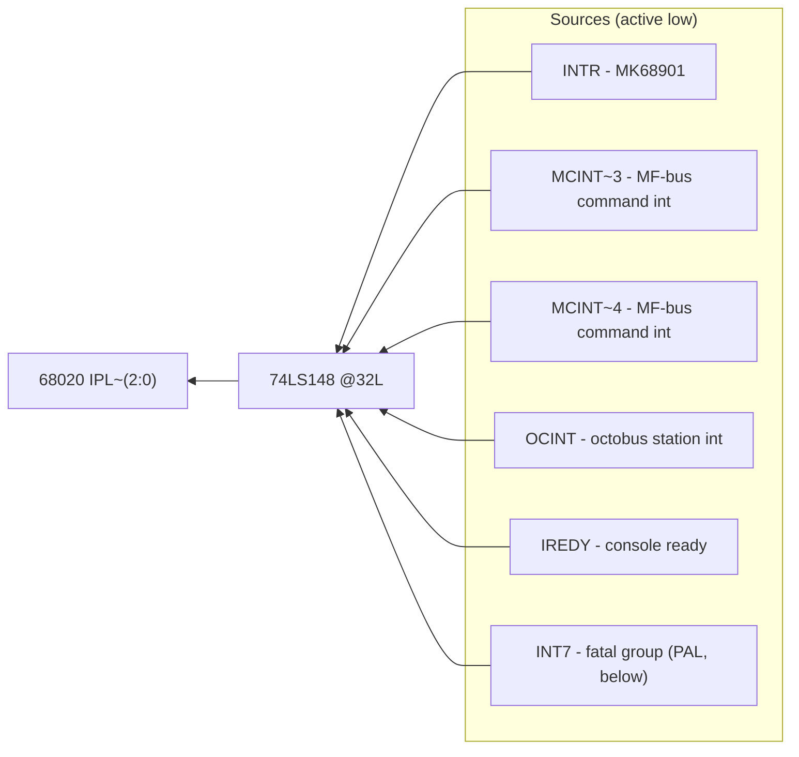
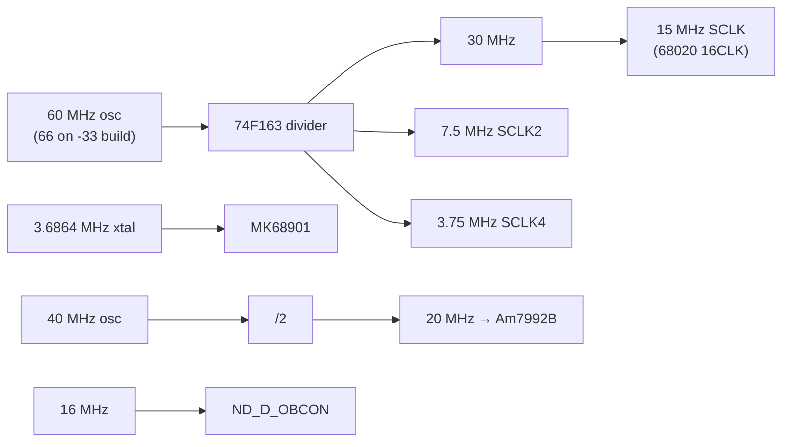
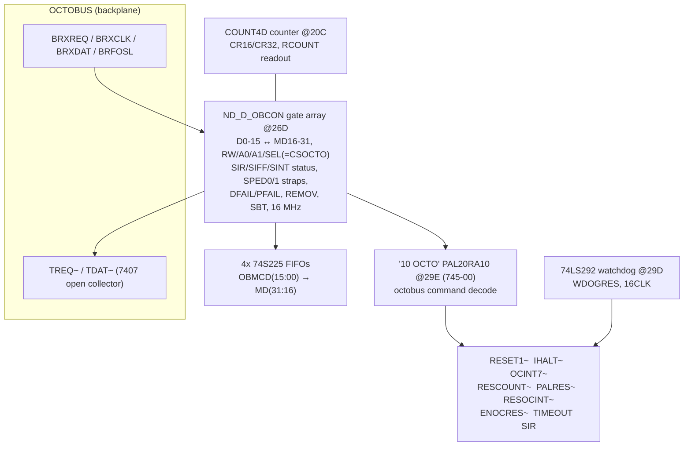
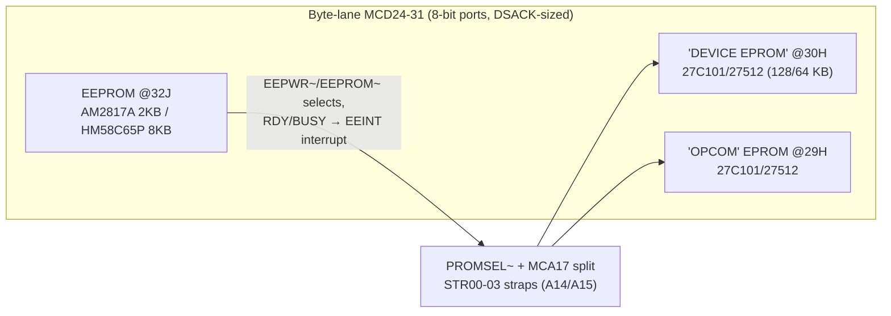

# Ethernet III Controller (ND-110513) — Hardware Description, Detail Level

**Card 324232 print H, detail level as far as surveyed (2026-07-23). Deep-read
sheets: 4, 11, 15, 16, 17, 18, 31 (+ all title blocks). Sheets 5-10, 12-14, 19-29,
30, 32 have NOT been traced — statements about them are limited to their titles and
signals seen at block level; such items are marked `[NOT TRACED]`. No technical
manual exists to cross-check, so unlike the Ethernet II detail doc this one is
schematic-only. High-level companion:
[EthIII-hardware-highlevel.md](EthIII-hardware-highlevel.md).**

Sheet references `[S<n>]` point into `../EthIIIImages/ND-324232-H1-sheet-NN.png`.

---

## 1. 68020 core [S15, revised in H]

- **MC68020-16, PGA** @26K ("MC68020_16", handwritten "-33" — a 33 MHz build
  exists; clock annotations on S17 support 60→66 MHz oscillator swap).
- Full 32-bit local buses: **MCD(31:00)** data, **MCA(31:00)** address (F244-buffered
  as MCA from the CPU pins).
- **AVEC** wired (autovector input), **IPEND** brought out; **DSACK0/DSACK1**
  dynamic bus sizing — 8-bit ports (EPROM/EEPROM) and 16-bit ports (LANCE) coexist
  with the 32-bit DRAM.
- **"7 DSACK" PAL16L8 @27H** merges the acknowledge sources into DSACK0/1:
  `MDTACK` (DRAM), `MPMDTACK`, `DT901` (MK68901 DTACK), `RCOUNT`, `DEVACK0/1`
  (device section), sequenced by T4/T6/T8/T9 timing taps (74F164 chain @26H).
- 74F244s drive `AS/DS/WRW → MC_CTRL` and receive `RESET/ISCLK`; "RUNNING" yellow
  LED (LD3) driven from the control group.
- T(9:2) timing chain: 74F164 @26H clocked at S2CLK, tapped for bus sequencing.

## 2. Interrupt structure [S18]

### 2.1 MK68901 MFP @35G

| Pin group | Wiring |
|---|---|
| XTAL | **3.6864 MHz** crystal @38G (dedicated; CLK pin = 3CLK system clock) |
| GPIO0 / GPIO1 | `CCINT` / `DMATRAP` (also brought out as GPIO(7:0) bus) |
| GPIO4 | **`LANINTR` — the LANCE interrupt** [S31] |
| GPIO2,3,5,6,7 | on GPIO(7:0) bus — consumers `[NOT TRACED]` |
| USART SI/SO | **MAX233 @10K → RSRXD/RSTXD** (RS-232 service console) |
| RR / TR | `RREDY`/`TREDY` → console-ready interrupt via 74F04/74F74 @34J/34K + `CLRREDY` clear — same pattern as Ethernet II |
| Timers | TAO/TBO/TCO brought out (TBO/TCO to CONTROL block [S4]); TDO `[NOT TRACED]` |
| A1-A5 | MCA01-05 (odd-address register file, as on Ethernet II) |
| CS/IACK | `CS901` and `IACK2` combined via 74F08 @26J |
| DTACK | `DT901` → DSACK PAL |
| RESET | card reset chain |

### 2.2 Priority encoding

Exact input→level mapping on the LS148 was **not fully resolved** from the scan
(several inputs read but pin-number assignment uncertain) — needs a re-read of S18
around @32L before an emulator uses it. `[PARTIAL]`

### 2.3 The "INT7" fatal-source collector — PAL20RA10 @37G (ND id 744-00)

Latches the fatal/NMI-class sources and exposes them as a **readable status
register on MD(23:16)**:

Inputs: `ITRAP` (from the "11 TRAP" PAL @38J), `ITBERR` (local bus-error/timeout),
`ERR`, `PFAIL` (power fail), `MPERR` (memory parity), `OCINT7` (octobus level-7
command), `XINT7`, `RINT7` (external/remote INT7s), `ENTCO`, `CINT7`.
Output: `INT7` (+ per-source read-back bits MD16-23). PAL equations unknown `[INF]`.

### 2.4 Trap PAL — "11 TRAP" PAL16L8 @38J (ND id 746-00)

Inputs `ICAS, CPUTRAP, TBERR, AS, RAMSEL, T4, RCOUNT` → trap/qualifier outputs
(IO1..IO5) feeding the INT7 collector and BERR generation `[INF]`.

## 3. Break system, timeouts, clocks, reset [S17, revised in H]

- **BREAK SYSTEM**: `UBRK`/`LBRK` address comparators (74S22 open-collector wired-AND
  @34L) + `BRKM`/`NT5` qualifiers → `BREAK32` → forces **BERR** on a matched
  address — hardware breakpoints for the debugger/monitor.
- **LOCAL TIMEOUT**: 74LS292 programmable counter @33G: `LONGBERR` select → `TBERR`
  (local bus timeout). A second LS292 @29D on S11 is the **octobus watchdog**
  (`WDOGRES`), clocked 16CLK.
- **CLOCK GENERATION**: oscillator @20K — print marks 56.6 MHz (50-55 crossed out),
  handwritten "782605 60 MHZ" and "(33)" notes: production 60 MHz, 66 MHz for the
  33 MHz CPU build. 74F163 @23K divides S4CLK → `SCLK, SCLK2, SCLK4`
  (handwritten: 30/15/7.5/3.75 MHz; 16.5/8.25/4.12 on the -33). `MCLK`/`ISCLK`
  derived for CPU and octobus.
- **RESET LOGIC**: TL7702-class supervisor @22L (SENSE/RESIN/CT) + `PFAIL`/`NAVAL`
  gating → `RESET`/`RES`; `IHALT` (octobus halt command) → `HALT` via 74S30.
  SW1 pushbutton + `RESET1` (octobus reset command) also feed RESIN.

## 4. OCTOBUS station [S11, ECO 380-136 rev B]

Semantics (from net names + the known ND-5000 octobus station model): the octobus
master can **reset** the card (RESET1), **halt** it (IHALT), raise a **level-7
interrupt** (OCINT7) and a normal interrupt (OCINT), reset/read **counters**
(RESCOUNT/RCOUNT, COUNT4D), and is supervised by the **watchdog** (WDOGRES →
TIMEOUT → INT7 group). Octobus message data arrives serialized through ND_D_OBCON
and is queued in the S225 FIFOs onto the local MD bus. Exact command encodings live
in the gate array + PAL — **not recoverable from the schematic** `[INF]`.

## 5. EPROM / EEPROM [S16]

- Socket notes: 27512 accepted offset by one pin; **HM62256 SRAM substitutable via
  straps** (development). Default strapping = EPROM.
- Two named banks: **DEVICE EPROM** (device/boot code) and **OPCOM** (resident
  monitor — fits the RS-232 console + RUNNING LED + octobus remote control).
- EEPROM with write control and ready/busy interrupt `EEINT` — parameter store
  (Ethernet address/config is the obvious but unverified use).
- Contrast: Ethernet II shipped EPROM sockets empty; ND-100 downloaded everything.

## 6. Device section: LANCE / SIA [S31, revised in H; S29-30/32 `[NOT TRACED]`]

- **Am7990 LANCE @10B** (DAL0-15 + A16-23 → LANAD/LANA buses) + **Am7992B SIA**,
  40 MHz osc, `SIA20CLK` (handwritten "BADCLK to Badap" note on the H print —
  an ECO breadcrumb), DISLANOS/EXTLANCL test overrides — same chipset and clocking
  as Ethernet II.
- **"16 ARBIT" PAL16L8 @13C (ND id 751-00)**: LANCE bus mastering onto the 32-bit
  bus — `BR/BGACK0/BGACK1/DBIR/UBUFEN/LBUFEN/LANDS` steer four F245s + three F373s
  so the 16-bit LANCE reads/writes either half of MCD(31:00) with latched
  LANA(23:00) addresses `[INF]`.
- `LANDTACK`/`RAMDRY` → MDTACK path; `MPMDTACK`+`CERR` qualify errors.
- **Status read-back**: 74LS244 @17C gates `LANINTR, PWEN, ETHSTAT` onto
  **MD(19:16)** — the Ethernet III's ETHSTAT equivalent (address decode on S30
  `[NOT TRACED]`).
- `LANINTR` also drives **MFP GPIO4** — the LANCE interrupt is MFP-vectored here,
  NOT a dedicated IPL level as on Ethernet II.
- Transceiver power control on S32 (`EXTPOWER`, `ID/ID~`, 12V) `[NOT TRACED]`.

## 7. MF-bus interface [S5-S10 — `[NOT TRACED]`, titles + block-level only]

Sheets: BUS_INTERF (5), /LATCH (6), /MFA (7), /MFA/CONTROL (8, H-revised),
/MFA/DRIVER (9), /MFA/IDENT (10). Block-level signals [S4]: `MFAMBUS`, `MC_CTRL`,
`MCA/MCD(31:00)` to the CONTROL block; `RESOCINT, MPERS, TRAP, EMOCRES, WDOGRES,
RCOUNT, MFREQ, ROCTO, CSOCTO, CSBADAP, RESET1, IHALT, OCINT7, SINT, ROR, MPMDTACK,
NAVAL, PFAIL, ERR, DTR`. The MFA section has its own ident sheet (10) — the MF-bus
identification protocol. All protocol detail pending a dedicated pass.

## 8. Memory [S19-26 — `[NOT TRACED]` beyond titles]

4 DRAM banks (sheets 21-24) + parity (25), controller on 19/26 (26 H-revised),
protection logic sheet 27, register block sheet 28. Bank size / chip types not yet
read.

## 9. Open items before emulation

1. **68020 address map** — S13 + S30 now traced: full decode hierarchy, all selects/
   register strobes, IACK map and the LANCE→MF-bus DMA path are in
   [EthIII-68020-address-map.md](EthIII-68020-address-map.md). **Absolute addresses
   remain unknown** (locked in PAL equations; need EPROM/PAL dumps).
2. LS148 input→IPL assignment on S18 (re-read at higher magnification).
3. MF-bus protocol sheets 5-10.
4. DRAM geometry (S20-26) and protection model (S27), register block (S28).
5. PAL equations 744-00 / 745-00 / 746-00 / 751-00 and the ND_D_OBCON command set —
   only recoverable from firmware RE (the EPROMs, if ever dumped) or ND internal docs.
