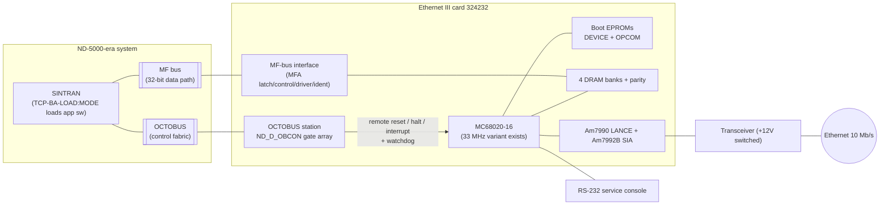
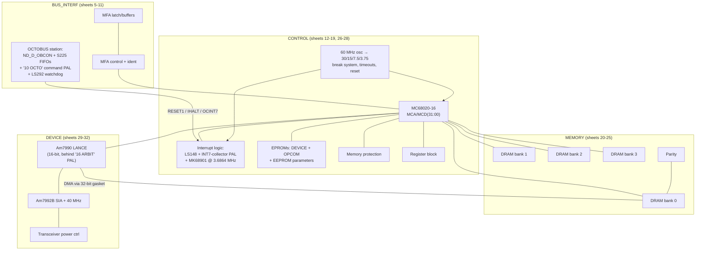
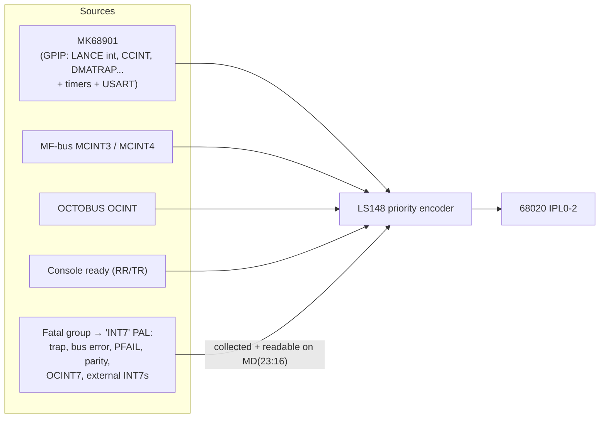

# Ethernet III Controller (ND-110513) — Hardware Description, High Level

**Card 324232 (print H = latest, Nov 1990), 32 schematic sheets in
`../EthIIIImages/`. Sources: the print-H schematics (surveyed, not fully traced) and
the ND-895xxx installation descriptions in NDInsight. There is NO technical manual
available (ND-814006 was never scanned). Detail companion:
[EthIII-hardware-detail.md](EthIII-hardware-detail.md).**

The Ethernet III is the **ND-5000-generation** Ethernet controller — a 68020-based
single-board computer attached to the **MF bus** for data and to the **OCTOBUS** as a
controllable station. Unlike the Ethernet II it **boots from its own EPROM** (with a
resident OPCOM monitor); SINTRAN then downloads application modules (e.g. TCP/IP
Basic Module/III) into its DRAM at system load.

## 1. System context

Product facts (installation descriptions, NDInsight):
- Ethernet III controller = **ND 110513** (Ethernet II was 110063).
- Runs the **TCP/IP Basic Module for ND-5000** in-card; loaded via
  `@MODE (TCP-IP)TCP-BA-LOAD:MODE`, sequenced with XMSG and ND-5000 start.
- Several Ethernet III controllers can run TCP/IP simultaneously
  (`AIP-CONFIG:SYMB` lists them and their TCP-device numbers).

## 2. Board block diagram (from sheet 4 "BLOCK LEVEL")

## 3. What is shared with Ethernet II, what is new

| Aspect | Ethernet II (110063) | Ethernet III (110513) |
|---|---|---|
| Host bus | ND-100 I/O bus (IOXT + level 12 + ident) | **MF bus** + **OCTOBUS station** |
| CPU | MC68HC000-12 @ 12.5 MHz | **MC68020-16** (33 MHz variant annotated) |
| Local bus | 16-bit | **32-bit** MCA/MCD |
| Boot | all code downloaded by ND-100 into DRAM | **self-boots from EPROM** ("DEVICE" + "OPCOM"), SINTRAN downloads app modules |
| Non-volatile | none | **EEPROM** 2-8 KB (parameters) |
| MFP | MK68901 @ 3.125 MHz, GPIP5/6/7 used | MK68901 @ **3.6864 MHz**, LANCE int on **GPIP4**, CCINT/DMATRAP on GPIP0/1 |
| Console | 20 mA current loop (PCT) | **RS-232 via MAX233** |
| Ethernet chipset | Am7990 + Am7992B | **same** Am7990 + Am7992B (16-bit, bus-gasketed) |
| DRAM | 512 KB, 1 bank | **4 banks** + parity |
| Watchdog | none | **LS292 watchdog** (octobus supervised) |
| Remote control | ND-100 control-word bits | **octobus commands**: reset / halt / interrupt / counters |
| Breakpoints | forced-parity (PARITYDIS+BREAKMODE) | **address comparators** (BREAK32/UBRK/LBRK force BERR) |
| Timer hardware | MFP timers only | MFP timers only (**no timer chip on either card**) |

## 4. Interrupt architecture at a glance

The fatal/NMI-class sources are latched in a PAL20RA10 whose pending set is
**memory-mapped readable** (MD 23:16) — a proper interrupt-source status register,
where Ethernet II only had discrete flip-flops.

## 5. Clocks

| Clock | Value | Purpose |
|---|---|---|
| 60 MHz osc (66 for -33 variant) | ÷2 chain → 30 / 15 / 7.5 / 3.75 MHz | CPU (16CLK ≈ 15/16 MHz), system clocks |
| 3.6864 MHz xtal | — | MK68901 (timers + baud rates) |
| 40 MHz osc | ÷2 → 20 MHz | SIA (10 Mb/s Manchester) |
| 16 MHz | — | ND_D_OBCON octobus gate array |
| 2× LS292 counters | programmable | local bus timeout (TBERR), octobus watchdog (WDOGRES) |

No RTC chip, no interrupt/timer controller chip — periodic timing is MFP timers,
exactly like Ethernet II.

## 6. Print D → print H changes

Revised sheets (title blocks `324232HH` / `5452H`, 90.11.21; sheet 8: 88.11.01):
**8** MFA control, **11** OCTOBUS (ECO 380-136 rev B), **13** address decode,
**15** CPU, **17** clocks/break/reset, **26** DRAM control, **30** device decode,
**31** LANCE. The octobus attachment itself existed already in print D (1988) —
H reworked it.

## 7. Emulation notes

See `EthIII-architecture-survey.md` §6. Essentials: reuse of the RetroCore MK68901
(at 3.6864 MHz) and Am7990/7992 cores is straightforward; new work is the 68020
(DSACK sizing), the MF-bus slave, and an octobus station following the
`OctobusND5000Station` pattern (ND_D_OBCON speaks the station protocol: presence,
remote reset/halt/interrupt, watchdog). The 68020 address map is not yet extracted
(sheets 30 + 13 pending) — that is the prerequisite for emulation.
