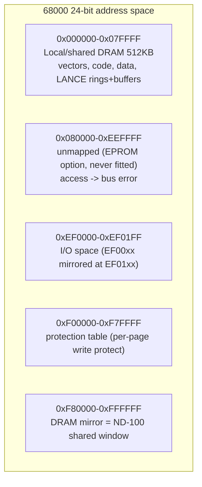
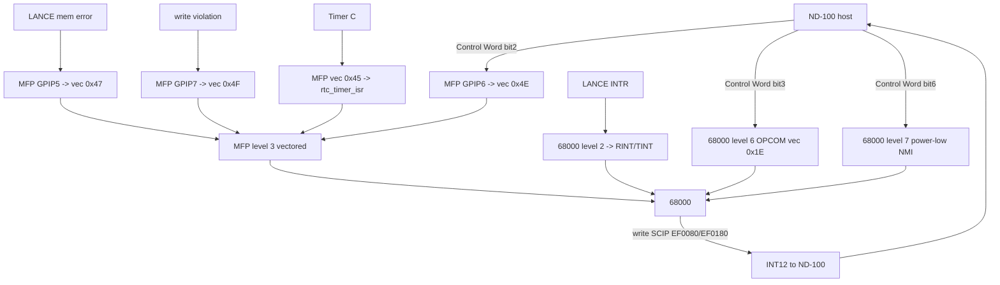
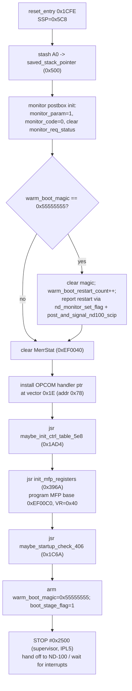
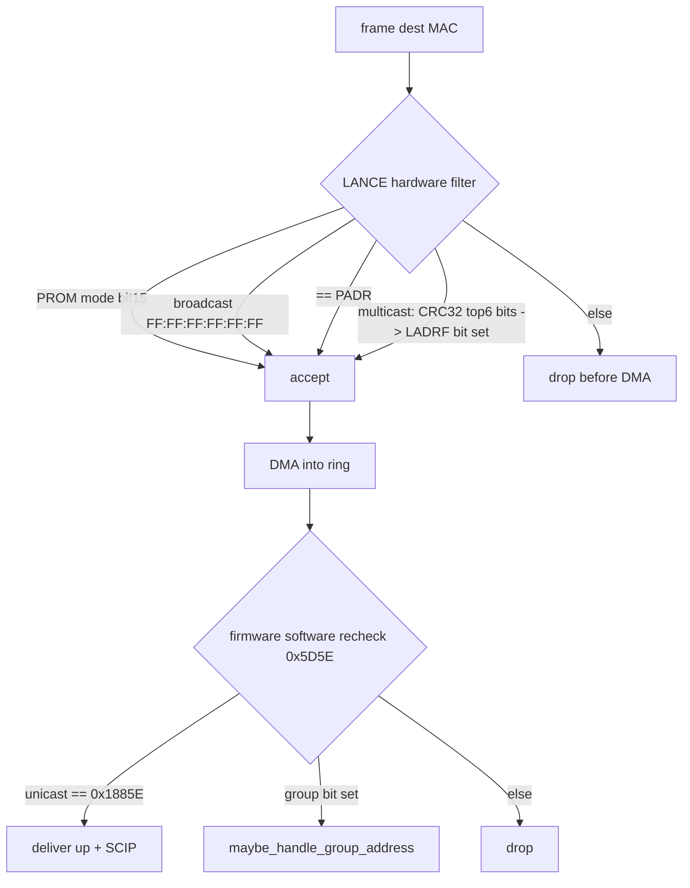
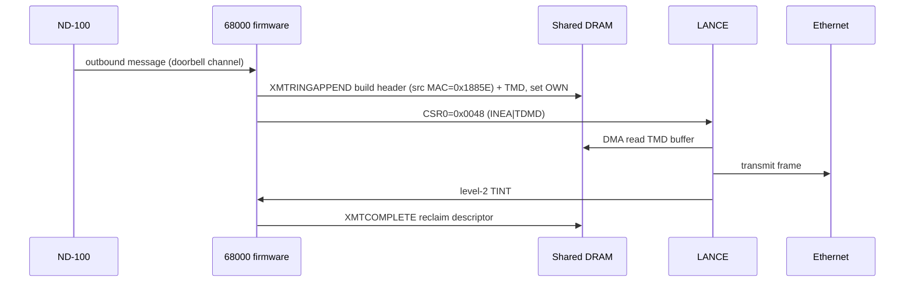
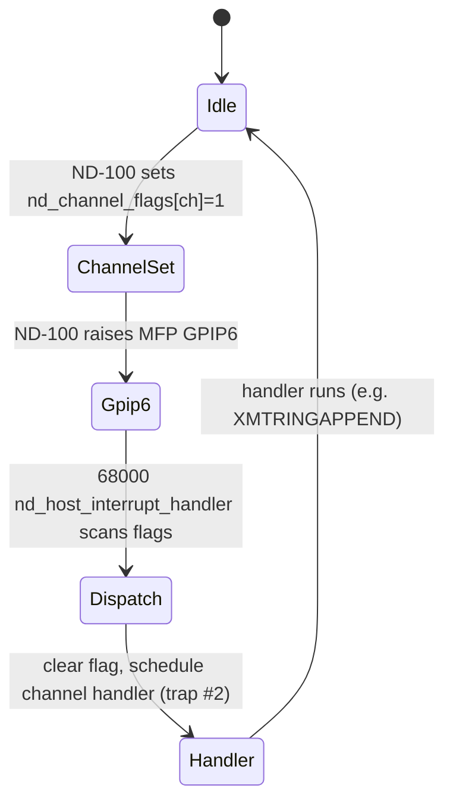

# ND Ethernet II Controller (PCB 3094) - Complete 68000 Firmware Reference

**Image:** `encos-ser-all-banks-68k.bin` (raw, MC68000 big-endian, base 0x000000, 512 KB)
**Board:** Norsk Data Ethernet II Controller, PCB 3094 (ndwiki 3094)
**Firmware:** ENCOS production Ethernet/XMSG server (PLANC-compiled, 1986)
**Cross-reference:** RetroCore C# host emulator `NDBusEthernetII.cs`; behavioral model `../protocode/`

This document is intended to be complete enough that a developer could re-implement the
controller firmware from it. Every claim is tagged:

- **[C]** CONFIRMED - proven in this image's disassembly (address cited) or in the
  authoritative RetroCore host emulator.
- **[H]** HYPOTHESIS - strongly indicated by the code but not fully traced.
- **[U]** UNCONFIRMED - from the task brief / external docs, or runtime-only (zero in
  the static image).

Nothing here is guessed; where a value is only known at runtime it is marked [U] and
the reason stated.

---

## 1. Executive summary

The ND Ethernet II controller is an intelligent DMA Ethernet card built around an
MC68000 with an AMD Am7990 LANCE and an MC68901 MFP. It has **no EPROM**: the ND-100
host loads all 512 KB of 68000 code and data into the card's DRAM, then releases the
68000 from reset. The card and the ND-100 share that DRAM (the ND-100 sees it through
a bank window), and communicate through it using two doorbells:

- **68000 -> ND-100:** write the SCIP register (`0xEF0080`, mirror `0xEF0180`) -> the
  ND-100 takes interrupt level 12. [C]
- **ND-100 -> 68000:** set a channel flag in `nd_channel_flags` (0x0B56) and raise MFP
  GPIP6 -> the 68000 takes MFP vector 0x4E and dispatches the channel. [C]

Ethernet traffic flows through Am7990 descriptor rings in that shared DRAM. This
document covers the boot flow, the MFP/RTC/LANCE hardware, the full receive and
transmit paths (descriptor formats, DMA, two-stage MAC filtering), the XMSG message
built for received frames, the ND-100 doorbell channels, the monitor/OPCOM debug
channel, and a complete function and data index.

---

## 2. Image and load facts [C]

| Item | Value |
|------|-------|
| Ghidra language | `68000:BE:32:default` |
| Base / range | 0x000000 - 0x07FFFF (512 KB) |
| Reset SSP (vector 0) | **0x000005C8** |
| Reset PC (vector 1) | **0x00001CFE** (`reset_entry`) |
| Named functions | 116 |
| PLANC module headers | `* NCOM *`, `HDLC-DR`, `,ASYN-DR`, `LOC-XMSG`, `* MAIN *`, `M-MANAG`, `PHLS-GEN`, `RT-CLOCK`, `SHORTLIB` (dated Apr-Aug 1986) |

The card has no EPROM; the ND-100 loads the image and releases reset (host emulator
`NDBusEthernetII.cs`, and confirmed by the all-zero runtime structures in the static
image). The brief's bank-0 diagnostic anchors (0x25F0/0x2598/0x3338/0x4610/0x57F2 and
the 0x400/0x440/0x880 command mailbox) are from a **different** firmware and do not
apply here.

---

## 3. 68000 memory map [C, host emulator]



| Range | Region | Notes |
|-------|--------|-------|
| 0x000000-0x07FFFF | Local/shared DRAM | Vectors, code, data, LANCE rings and buffers |
| 0x080000-0xEEFFFF | Unmapped | EPROM option never fitted; access -> bus error |
| 0xEF0000-0xEF01FF | I/O space | EF00xx decoded again at EF01xx (PIOC compatibility) |
| 0xF00000-0xF7FFFF | Protection table | Per-page RAM write protection |
| 0xF80000-0xFFFFFF | DRAM mirror | Mirror of 0x000000-0x07FFFF; the ND-100 window |

---

## 4. I/O register map [C]

Named per the C# model constants (`IoAddresses`, `FirmwareConstants.cs`). Confirmed by
observed absolute-long accesses (addresses cited) and the host emulator.

| Address | Name | Dir | Purpose | Evidence |
|---------|------|-----|---------|----------|
| 0xEF0010 | `Proff` | W | Protection-table bypass | host emu |
| 0xEF0020 | `Modcr` | R/W | Mode control (EPROMMODE/PARITYDIS/BREAKMODE) | 0x1B0A writes 0 |
| 0xEF0040 | `MerrStat` | R | Parity/memory error status | 0x1D84 clears it at boot |
| 0xEF0060 | `Earen` | R | Memory-error address latch | host emu |
| 0xEF0080 | `Scip` | W | **Write -> INT12 to ND-100** | 0x1A5C, 0x224C, 0x249A |
| 0xEF0180 | `ScipMirror` | W | Alternate SCIP doorbell | 0xECF2 (XMSG send) |
| 0xEF00A0 | `LanceRdp` | R/W | LANCE register data port | 0x4AC8, 0x616E |
| 0xEF00A2 | `LanceRap` | R/W | LANCE register address port | 0x4ABE, 0x4ADC |
| 0xEF00A8 | `Xcvpw` | W | Transceiver 12V power | 0x47BA (#3 on / #0 off) |
| 0xEF00B0 | `LanReset` | W | LANCE hardware reset | region present |
| 0xEF00B8 | `EthStat` | R | HW status (bit2=power, bit0=LAN int) | host emu |
| 0xEF00C0 | `MfpBase` | R/W | MC68901 MFP (odd displacements) | 0x396A programs it |

**MFP register writes at boot (init_mfp_registers, 0x396A)** [C] - base 0xEF00C0, odd
displacements:

| MFP offset | Value | Meaning (MC68901) |
|-----------|-------|-------------------|
| 0x03 | 0x00 | GPIP data direction / AER area |
| 0x05 | 0x00 | interrupt enable A (cleared then set later) |
| 0x07 | 0xC0 | interrupt enable/mask |
| 0x09 | 0xA0 | interrupt mask |
| 0x13 | 0xC0 | timer control |
| 0x15 | 0x80 | timer data |
| **0x17** | **0x40** | **Vector Register (VR) = 0x40** -> MFP vectors 0x40-0x4F |
| 0x1D | 0x50 | USART / timer |
| 0x23 | 0xF4 | USART control |

So **VR = 0x40 is CONFIRMED** (resolves the brief's assumption). MFP interrupt sources
therefore vector to 0x40-0x4F (addresses 0x100-0x13F).

---

## 5. Named data globals [C unless noted]

Shared-DRAM globals renamed in Ghidra (hex kept for reference):

| Address | Name | Meaning | Conf |
|---------|------|---------|------|
| 0x0406 | `monitor_req_status` | monitor request status word | C |
| 0x040A | `monitor_counter` | monitor postbox event counter | C |
| 0x040C | `monitor_code` | monitor sub-code | C |
| 0x040E | `monitor_param` | monitor parameter | C |
| 0x0410 | `monitor_counter2` | monitor postbox second counter | C |
| 0x0412 | `monitor_request_flag` | monitor request flag (set by nd_monitor_set_flag) | C |
| 0x0454 | `cpu_register_dump_frame` | D0-D7/A0-A6/PC/USP/SR trap frame | C |
| 0x04BA | `warm_boot_magic` | 0x55555555 sentinel after a caught trap | C |
| 0x04BE | `warm_boot_restart_count` | restart counter | C |
| 0x0500 | `saved_stack_pointer` | scratch SP save | C |
| 0x0504 | `monitor_delay_counter` | monitor wait/delay counter | C |
| 0x0534 | `mfp_init_table_src` | 8-byte source table copied to 0x5E8 | C |
| 0x05E8 | `mfp_shadow_regs` | MFP register shadow / timer area | C |
| 0x0660/0x0662 | `trap_hook_lock` / `_b` | TAS locks for the trap-frame hook | C |
| 0x0B56 | `nd_channel_flags` | 8 ND-100 doorbell channel flags | C |
| 0x0B66 | `nd_channel_struct_table` | per-channel struct ptrs (runtime) | C |
| 0x0BE8 | `nd_channel_context_table` | per-channel context ptrs (runtime) | C |
| 0x0FBE | `rtc_isr_lock` | TAS lock in the RTC ISR | C |
| 0x0FC2 | `rtc_tick_counter` | RTC tick counter | C |
| 0x0FCA | `rtc_tick_counter_b` | second RTC tick counter | C |
| 0x0FD6 | `timer_queue_head` | timer queue head pointer | C |
| 0x1292 | `mfp_init_values` | 14-word table for MFP/vector init | C |
| 0x18000 | `rcv_ring_free_count` | RX ring free-buffer count | C |
| 0x18002 | `rcv_ring_producer_index` | RX ring producer index (append) | C |
| 0x18004 | `rcv_ring_consumer_index` | RX ring consumer index (complete) | C |
| 0x18008 | (RX descriptors) | 128 x 8-byte RMD (ends at 0x18408) | C |
| 0x18408 | `xmt_ring_free_count` | TX ring free count | C |
| 0x1840A | `xmt_ring_producer_index` | TX ring producer index | C |
| 0x18410 | (TX descriptors) | 128 x 8-byte TMD | C |
| 0x18810 | `lance_init_block` | Am7990 init block (see 8) | C |
| 0x1885E | `lance_mac_address` | 6-byte MAC (PADR source) | C |
| 0x18886 | `lan_function_code` | LAN function selector (==4 gates padding) | C |
| 0x18888 | `lan_mode_flag` | LAN mode flag (gates INITLANCE MODE bit) | C |
| 0x1888A | `lan_header_present_flag` | header-present flag (TX/RX framing) | C |
| 0x1888C | `lan_stats_block` | LAN statistics/counters block | C |
| 0x188C6 | `conn_state_block` | connection state block | H |
| 0x188DA | `rx_buffer_pool` | pool the RX buffers are cut from | C |
| 0x1A2D2 | `conn_list_head` | active connection list head | C |
| 0x1A2D8 | `conn_id_counter` | connection id allocator counter | C |
| 0x1AA9E | `active_conn_list` | active connection list | C |
| 0x1D0EA | `conn_node_freelist` | connection-node free list | C |
| 0x1D16E | `XROUT_dispatch_maxindex` | 0x07 (8 XROUT handlers) | C |
| 0x1D170 | `XROUT_dispatch_table` | 8 x 32-bit XROUT handler pointers | C |
| 0x1D1D6 | `conn_dispatch_maxindex` | 0x09 (second dispatch table) | C |
| 0x1D1D8 | `conn_dispatch_table` | connection dispatch pointer table | C |
| 0x1E21A | `xmsg_node_id` | XMSG node id / magic (into messages) | C |
| 0x1E232 | `conn_lookup_list` | connection lookup list | C |
| 0x2AB5E | `route_log_table` | routing log / statistics table | H |
| 0x36368 | `rx_buffer_count` | number of RX buffers to allocate | C |

---

## 6. Vector table and interrupt architecture [C]

Vectors 0-7 (the standard 68000 exceptions plus the card's autovector assignment) and
the MFP vector block at 0x100-0x13F (VR=0x40).

| 68000 addr | Vector | Handler | Meaning |
|-----------|--------|---------|---------|
| 0x000 | 0 SSP | 0x000005C8 | initial supervisor stack |
| 0x004 | 1 PC | 0x00001CFE | `reset_entry` |
| 0x008 | 2 | 0x0000211C | LANCE level-2 (PLANC trampoline -> 0x1E9A) |
| 0x00C | 3 | 0x00002136 | MFP level-3 (vectored via VR=0x40) |
| 0x078 | 30 (0x1E) | via `opcom_handler_ptr` (0x52A -> 0x1B00) | ND-100 OPCOM level 6 |
| 0x138 | 0x4E | **0x0000250E** `nd_host_interrupt_handler` | ND-100 request (MFP GPIP6) |
| 0x13C | 0x4F | 0x00002142 | write violation (MFP GPIP7) |

68000 IPL autovector assignment (host emulator + ND-12.055.1):

| Level | Source | Vector type |
|-------|--------|-------------|
| 7 (NMI) | ND-100 power low | autovector |
| 6 | ND-100 OPCOM | autovector (0x1E) |
| 5 | Memory parity error | autovector |
| 4 | PTC test console | autovector |
| 3 | MFP (MC68901) | **vectored** (VR=0x40) |
| 2 | LANCE | autovector |

MFP vectored sources (level 3), VR=0x40 -> vector VR|source:

| MFP source | Vector | GPIP/function | Meaning |
|-----------|--------|---------------|---------|
| 15 | 0x4F | GPIP7 | write violation by 68000 |
| 14 | 0x4E | GPIP6 | **ND-100 requesting interrupt** |
| 12 | 0x4C | USART RX | receive buffer full |
| 11 | 0x4B | USART RX | receive error |
| 10 | 0x4A | USART TX | transmit buffer empty |
| 9 | 0x49 | USART TX | transmit error |
| 7 | 0x47 | GPIP5 | LANCE memory access error |
| 5 | 0x45 | Timer C | real-time clock |



---

## 7. Boot / initialization flow [C]

`reset_entry` (0x1CFE) step by step:



After boot the firmware is event/interrupt-driven (the PLANC POSI postbox scheduler:
`POSIINITIALIZE` 0x11732, `POSISTART` 0x1179C, `POSIAPPEND` 0x11DC4). Hardware bring-up
(transceiver power, LANCE ring setup, LAN init) runs through `LNMAINIT_main` (0x6ECE),
which chains its steps through the error-check trampoline `check_status_or_hwerror`
(0x6EBA) and ends by calling `STARTMA` (0x5850).

---

## 8. LANCE (Am7990) - initialization [C]

### 8.1 Init block (`lance_init_block`, 0x18810)

Built at runtime by `INITLANCE` (0x48EA); zero in the static image. Standard Am7990
layout:

| Offset | Field | Built by | Meaning |
|--------|-------|----------|---------|
| +0 | MODE | INITLANCE bit-by-bit | bit15 from `lan_mode_flag`; sets bit2; clears bits 6/5/4/3/1/0 |
| +2 | PADR (6 bytes) | copied from `lance_mac_address` (0x1885E) via PLANC_IMUL | station MAC address |
| +8 | LADRF (8 bytes) | (runtime) | logical (multicast) address filter |
| +0x12 | RDRA | (runtime) | RX ring pointer + RLEN |
| +0x16 | TDRA | (runtime) | TX ring pointer + TLEN |

### 8.2 CSR programming sequence [C] (block at 0x4ABE inside/around INITLANCE)

```
Xcvpw (0xEF00A8) = 0x03                 ; transceiver 12V power on (0x47BA)
RAP(0xEF00A2)=3 ; RDP(0xEF00A0)=0x0004  ; CSR3 = BSWP (byte swap for 68000 big-endian)
init block ptr = 0x18810
RAP=1 ; RDP = iadr low                  ; CSR1 = init block addr low
RAP=2 ; RDP = iadr high                 ; CSR2 = init block addr high
RAP=0 ; RDP = 0x0001                    ; CSR0 = INIT (start initialization)
jsr LANCE_WAIT (0x4E42)                 ; wait for IDON
```

CSR0 bit reference (Am7990): ERR(15) BABL(14) CERR(13) MISS(12) MERR(11) RINT(10)
TINT(9) IDON(8) INTR(7) INEA(6) RXON(5) TXON(4) TDMD(3) STOP(2) STRT(1) INIT(0).
TX kick observed: `CSR0 = 0x0048` = INEA|TDMD at 0x616E.

---

## 9. Receive path [C]

### 9.1 RX descriptor ring (RMD)

Ring header `rcv_ring_free_count`/`_producer_index`/`_consumer_index` at 0x18000; 128
descriptors of 8 bytes at 0x18008 (128*8 = 0x400, ending exactly at the TX ring
0x18408). Indices wrap mod 128. RMD layout (standard Am7990):

| Offset | Field | Meaning |
|--------|-------|---------|
| +0 | RMD0 (word) | buffer address low 16 bits (LADR) |
| +2 | RMD1 (word) | high byte = flags (OWN15/ERR14/FRAM13/OFLO12/CRC11/BUFF10/STP9/ENP8), low byte = HADR |
| +3 | (byte) | HADR = buffer address bits 16-23 |
| +4 | RMD2 (word) | buffer length as two's complement (-BCNT) |
| +6 | RMD3 (word) | receive: MCNT (message length, 12 bits) + errors |

RX buffer size = **0x5F0 = 1520 bytes** (max Ethernet frame), confirmed at
`append_rx_buffers_to_ring` (0x5BCA), cut from `rx_buffer_pool` (0x188DA/0x3636C),
count from `rx_buffer_count` (0x36368).

### 9.2 RCVRINGAPPEND (0x5B60) [C] - hand a buffer to the chip

```
idx = rcv_ring_producer_index                 ; (0x18002)
desc = 0x18008 + idx*8
RMD0 = buffer_low ; RMD1.HADR(+3) = buffer_high
RMD2 = -length
producer_index = (idx+1) mod 128 ; free_count--
RMD1.flags |= OWN(0x8000)                      ; hand buffer to LANCE
```

### 9.3 Frame arrival and RCVCOMPLETE (0x5C42) [C]

The chip DMAs a received frame into the current descriptor's buffer, sets MCNT in RMD3,
clears OWN, sets STP/ENP (or error bits). Then RCVCOMPLETE runs (via the level-2 RINT
event):

```
idx = rcv_ring_consumer_index                  ; (0x18004)
desc = 0x18008 + idx*8
if RMD1.OWN still set -> nothing to do
length = (RMD3 & 0xFFF) - 4                     ; strip 4-byte FCS
buffer = HADR:RMD0
dest_mac = first 6 bytes of buffer
if dest group bit == 0 (unicast):
    compare 6 bytes vs lance_mac_address (0x1885E)   ; SOFTWARE address check (0x5D5E)
    match -> "for us" flag (0x38) = 1
else:
    maybe_handle_group_address (0x542C)         ; multicast/broadcast
if for-us: deliver frame up to XMSG (XMRECEIVER)
advance consumer_index ; re-arm buffer (RCVRINGAPPEND)
```

```mermaid
sequenceDiagram
    participant NET as Ethernet
    participant LAN as LANCE Am7990
    participant MEM as Shared DRAM
    participant FW as 68000 firmware
    participant ND as ND-100
    NET->>LAN: frame
    LAN->>LAN: hardware address filter (PADR / broadcast / LADRF)
    LAN->>MEM: DMA frame into RMD buffer, set MCNT, clear OWN
    LAN->>FW: level-2 RINT
    FW->>MEM: RCVCOMPLETE read RMD (consumer idx)
    FW->>FW: length=(MCNT&0xFFF)-4; read dest MAC
    FW->>FW: software MAC recheck vs 0x1885E (0x5D5E)
    FW->>FW: XMRECEIVER build XMSG msg
    FW->>MEM: re-arm buffer (RCVRINGAPPEND)
    FW->>ND: SCIP write -> INT12
```

**Two-stage MAC filtering** [C]:



Multicast LADRF hash: CRC-32 (poly 0xEDB88320) of the 6 destination bytes, top 6 bits
(`crc >> 26`) index the 64-bit LADRF in the init block; accept if that bit is set.
(Standard Am7990; the firmware's multicast-add routine is not wired to a caller in the
static image, so hash orientation is standard-chip [H].)

---

## 10. Transmit path [C]

TX ring header `xmt_ring_free_count`/`_producer_index` at 0x18408; 8-byte TMDs at
0x18410. Same descriptor format as RX.

### 10.1 XMTRINGAPPEND (0x6054) [C]

```
compute TX buffer address + length from the outbound message
buffer[0..5]  = dest MAC (from the message, msg+0x22)
buffer[6..11] = SOURCE MAC = copy of lance_mac_address (0x1885E)   ; our address
buffer[12..]  = ethertype + payload (already staged)
if lan_function_code==4 and length<0x3C: pad to 60 bytes
idx = xmt_ring_producer_index
desc = 0x18410 + idx*8
TMD0 = buffer_low ; TMD1.HADR = buffer_high ; TMD2 = -length
TMD1.flags |= STP(0x200)|ENP(0x100)
producer_index=(idx+1) mod 128 ; free_count--
TMD1.flags |= OWN(0x8000)
CSR0 (0xEF00A0) = 0x0048                        ; INEA|TDMD -> chip transmits
```

### 10.2 XMTCOMPLETE (0x61D2) [C]

On TINT, walk the TX consumer index (0x1840C), for each descriptor the chip released
(OWN=0), reclaim the buffer and advance the index.



---

## 11. XMSG message for a received frame [C]

`XMRECEIVER` (0xBED8) packages a received frame into an XMSG message:

| Message offset | Value | Meaning |
|---------------|-------|---------|
| +0x14 | 0x00004000 (bit 14 set) | flags |
| +0x18 | `*xmsg_node_id` (0x1E21A) | node id / magic |
| +0x1C | frame descriptor (12 bytes) | payload reference |
| +0x20 | 0 | reserved |
| +0x24 | 4 | subtype / count |

Then `jsr XMPFRRE (0x10C4C)`, which posts the message through the postbox ring to the
ND-100 and rings SCIP. The on-wire XMSG framing the ND-100 decodes is the repo's
existing XMSG protocol (see `xmsg-decode` material); the header fields above are what
the firmware assembles.

---

## 12. ND-100 <-> 68000 doorbells [C]

### 12.1 68000 -> ND-100 (SCIP)

`post_and_signal_nd100_scip` (0x1A48): bump `monitor_counter` (0x40A) and
`monitor_counter2` (0x410), then `move.b #1,(0xEF0080)` (SCIP) -> the card latches
"interrupt set for ND-100 on level 12". The XMSG postbox producer
`maybe_xmsg_postbox_send_ring` (0xEACC, inside PORTSEND) uses the mirror `0xEF0180`.
Delivery honors the ND-100's interrupt-enable bit (latched if disabled; the ENNS0
startup-race latch documented in the host emulator).

### 12.2 ND-100 -> 68000 (channel doorbell)

`nd_host_interrupt_handler` (0x250E), wired to MFP GPIP6 (vector 0x4E):

```
after maybe_mfp_interrupt_ack (0x225C)
for ch in 7..0:
    if nd_channel_flags[ch] (0x0B56 + ch*2) != 0:
        clear it
        schedule the channel's handler via PLANC scheduler (trap #2, D0=9),
        using nd_channel_context_table (0xBE8) and nd_channel_struct_table (0xB66)
```

Eight channels; the ND-100 sets a channel flag then raises GPIP6. Handler tables are
populated at runtime (zero in the static image). One channel carries "transmit this
frame" and ends at XMTRINGAPPEND.



---

## 13. Monitor / OPCOM / warm boot [C]

- **Monitor postbox** at 0x40A (`monitor_*`): the reset/trap monitor path. On every
  trap, `save_cpu_context_to_0x454` writes a full register frame to
  `cpu_register_dump_frame` (0x454); `nd_monitor_set_flag` (0x1A30) sets
  `monitor_request_flag` (0x412); `post_and_signal_nd100_scip` rings the ND-100. The
  counterpart `restore_cpu_context_and_rte` (0x1A12) restores the frame and RTEs.
- **OPCOM** level-6 autovector (vector 0x1E / addr 0x78), handler pointer
  `opcom_handler_ptr` (0x52A -> 0x1B00) installed by reset entry.
- **Warm boot**: `warm_boot_magic` (0x4BA) = 0x55555555 marks a restart after a caught
  trap; reset entry detects it, bumps `warm_boot_restart_count` (0x4BE), and reports it
  rather than looping.
- **PLANC runtime panics**: strings `- STACK OVERFLOW AT`, `- ASSERT VIOLATION AT`,
  `- INDEX RANGE ERROR AT` (0x44DE-0x451C). `FATALERROR` (0x4C26) and
  `maybe_plancruntime_panic` (0x44B4) are the fatal paths.

---

## 14. RTC / timer [C]

`rtc_timer_isr` (0x3A68), wired to MFP Timer C (vector 0x45). Sets `mfp_shadow_regs`
(0x5E8)=1, increments `rtc_tick_counter` (0xFC2) and `rtc_tick_counter_b` (0xFCA),
walks `timer_queue_head` (0xFD6) firing entries whose expiry matches the tick, uses
`rtc_isr_lock` (0xFBE) as a TAS lock, then trap #2 + `maybe_monitor_wait_ack` and RTE.

---

## 15. XROUT / connection routing (message layer above Ethernet) [C name / H detail]

- `maybe_xrout_msg_dispatch` (0x9924): extracts a 4-bit type from the message byte at
  offset 0x2C, validates against `XROUT_dispatch_maxindex` (0x1D16E=7), jumps through
  `XROUT_dispatch_table` (0x1D170), 8 handlers 0x99E2..0x9D8E.
  - handler 0 (0x99E2): set type 0x3000, allocate connection id (`maybe_alloc_connection_id`).
  - handler 1 (0x9A56): find/remove connection by type.
  - handlers 2-7: message-type transforms routing to `maybe_build_tx_descriptor`
    (0x8C78), `maybe_register_conn_range` (0x96A6), `maybe_free_conn_sublists` (0x917C).
- Second dispatch table `conn_dispatch_table` (0x1D1D8, max 9).
- Connection management: id allocator (`conn_id_counter` 0x1A2D8), list heads
  (`conn_list_head` 0x1A2D2, `active_conn_list` 0x1AA9E, `conn_lookup_list` 0x1E232),
  free list (`conn_node_freelist` 0x1D0EA). Routines: `maybe_alloc_conn_node` (0x8ED8),
  `maybe_find_remove_conn` (0x8F86), `maybe_register_conn_range` (0x96A6),
  `maybe_sorted_list_insert` (0xC5BC), `maybe_free_conn_node_1d0ea` (0x83BA).

---

## 16. Complete function index

Confidence: [C]=confirmed name (symbol table or direct evidence), [H]=hypothesis
(behavioral name from analysis).

| Addr | Name | Role | Conf |
|------|------|------|------|
| 0x1A12 | restore_cpu_context_and_rte | restore trap frame + RTE | C |
| 0x1A30 | nd_monitor_set_flag | set monitor_request_flag | C |
| 0x1A48 | post_and_signal_nd100_scip | bump counters + SCIP (INT12) | C |
| 0x1A66 | save_cpu_context_to_0x454 | save trap register frame | C |
| 0x1ACA | maybe_monitor_wait_ack | monitor wait/ack loop | H |
| 0x1AD4 | maybe_init_ctrl_table_5e8 | early ctrl table init | H |
| 0x1C6A | maybe_startup_check_406 | startup check on monitor_req_status | H |
| 0x1CFE | reset_entry | reset entry / boot | C |
| 0x2192 | maybe_tas_lock_patch_return | TAS lock + trap-frame hook | H |
| 0x225C | maybe_mfp_interrupt_ack | MFP interrupt acknowledge | H |
| 0x250E | nd_host_interrupt_handler | ND-100 channel doorbell dispatch | C |
| 0x396A | init_mfp_registers | MFP init (VR=0x40) | C |
| 0x3A58 | maybe_set_timer_reload_fca | timer reload setter | H |
| 0x3A68 | rtc_timer_isr | RTC/timer ISR | C |
| 0x44B4 | maybe_plancruntime_panic | PLANC panic path | H |
| 0x4660 | calc_crc32 | CRC-32 (0x6DB88320) | C |
| 0x4754 | calc_crc32_setup | CRC-32 wrapper | C |
| 0x48B2 | maybe_lance_rdp_clear | LANCE RDP clear helper | H |
| 0x48EA | INITLANCE | LANCE init | C |
| 0x4BA0 | maybe_set_lance_active | set LANCE active flag | H |
| 0x4BD6 | report_via_pomnreport | generic event/error report | C |
| 0x4C26 | FATALERROR | fatal error handler | C |
| 0x4CC6 | maybe_report_event_IA | report event "IA" | H |
| 0x4D66 | ASRCONNECT | connect async-serial handler | C |
| 0x4E42 | LANCE_WAIT | wait for LANCE IDON | C |
| 0x4F52 | maybe_connect_evhandler_18828 | connect LAN event handler | H |
| 0x4FAA | posi_init_18834 | postbox init wrapper | C |
| 0x503A | posi_start_18834 | postbox start wrapper | C |
| 0x514A | posi_getall_wrapper | POSIGETALL wrapper | C |
| 0x518E | posi_return_wrapper | POSIRETURN wrapper | C |
| 0x5322 | maybe_init_buffer_pool_188da | init buffer pool/freelist | H |
| 0x542C | maybe_handle_group_address | multicast/group RX handling | H |
| 0x548E | clear_struct_1888c | clear stats block | C |
| 0x5512 | clear_struct_188c6 | clear conn state block | C |
| 0x553C | maybe_format_lance_descriptor | format an RMD/TMD | H |
| 0x561E | init_rcvring_descriptors | build RX ring descriptors | C |
| 0x5700 | init_rcvring_wrapper | RX ring init wrapper | C |
| 0x5850 | STARTMA | start LANCE/MAC | C |
| 0x5880 | STOPMA | stop LANCE/MAC | C |
| 0x58E0 | HARDWAREERROR | hardware error report | C |
| 0x5B60 | RCVRINGAPPEND | append RX buffer to ring | C |
| 0x5BCA | append_rx_buffers_to_ring | append N 1520-byte RX buffers | C |
| 0x5C42 | RCVCOMPLETE | receive-complete consumer | C |
| 0x6054 | XMTRINGAPPEND | build TX frame + descriptor + kick | C |
| 0x61D2 | XMTCOMPLETE | transmit-complete reclaim | C |
| 0x6DA8 | LNMAEVENTS | LAN management events | C |
| 0x6EBA | check_status_or_hwerror | error-check trampoline | C |
| 0x6ECE | LNMAINIT_main | master LAN init sequence | C |
| 0x704A | POMNERRHANDLER | postbox error handler | C |
| 0x803E | maybe_report_event_IE | report event "IE" | H |
| 0x80AA | maybe_report_event_ID | report event "ID" | H |
| 0x8314 | maybe_queue_append_1b22a | queue append | H |
| 0x83BA | maybe_free_conn_node_1d0ea | free conn node to freelist | H |
| 0x8AC8 | maybe_enqueue_by_channel | enqueue to postbox by channel | H |
| 0x8C78 | maybe_build_tx_descriptor_1a2b4 | build TX descriptor entry | H |
| 0x8CCA | maybe_finalize_tx_chain_1a2b8 | finalize TX chain | H |
| 0x8D90 | maybe_alloc_connection_id | allocate connection id | H |
| 0x8ED8 | maybe_alloc_conn_node | alloc + init conn node | H |
| 0x8F86 | maybe_find_remove_conn | find/remove conn by addr | H |
| 0x917C | maybe_free_conn_sublists | free conn sublists | H |
| 0x91A8 | maybe_free_descriptor_chain | free descriptor chain | H |
| 0x91D6 | maybe_remove_conn_wrapper | remove conn wrapper | H |
| 0x9282 | maybe_conn_range_contains | address-range membership test | H |
| 0x9526 | maybe_find_remove_conn_by_type | find/remove conn by type | H |
| 0x95D6 | maybe_lookup_conn_check_range | lookup conn + range check | H |
| 0x96A6 | maybe_register_conn_range | register conn address range | H |
| 0x9924 | maybe_xrout_msg_dispatch | XROUT message-type dispatcher | C |
| 0xB692 | maybe_report_event_ID_b692 | report event "ID" (2) | H |
| 0xBA56 | maybe_log_route_entry_2ab5e | log route/stats entry | H |
| 0xBCDE | COPY | block copy | C |
| 0xBED8 | XMRECEIVER | build XMSG msg for RX frame | C |
| 0xBFF8 | maybe_build_xrout_message | build XROUT message | H |
| 0xC47E | maybe_queue_append_28f32 | queue append | H |
| 0xC5BC | maybe_sorted_list_insert | sorted linked-list insert | H |
| 0xC822 | maybe_find_node_by_id_1e232 | linked-list lookup by id | H |
| 0xE6B0 | POWAITFORLAN | wait for LAN | C |
| 0xE73C | PORTCREATE | create XMSG port | C |
| 0xEAA6 | PORTSEND | send message to port (-> ND-100) | C |
| 0xEAB6 | maybe_status_trampoline_eab6 | status trampoline | H |
| 0xEACC | maybe_xmsg_postbox_send_ring | XMSG postbox producer + SCIP mirror | H |
| 0xED10 | PONAREGISTER | postbox name register | C |
| 0xF05A | LNNDTOMAAPPEND | ND-to-MA append | C |
| 0xF3E8 | maybe_print_statistics | format/print statistics | H |
| 0x106F0 | XMPSEND | XMSG send | C |
| 0x107CA | XMPFCLS | XMSG postbox file close | C |
| 0x10880 | XMPFREL | XMSG postbox file release | C |
| 0x10936 | XMPFREA | XMSG postbox file free | C |
| 0x10C4C | XMPFRRE | XMSG postbox file receive | C |
| 0x11502 | XMPBAST | XMSG buffer allocate/stack | C |
| 0x1164E | XMPXETS | XMSG X-ETS | C |
| 0x11732 | POSIINITIALIZE | postbox scheduler init | C |
| 0x1179C | POSISTART | postbox scheduler start | C |
| 0x1192A | POSPGETALL | postbox get-all (P) | C |
| 0x1199E | POSIGETALL | postbox get-all (I) | C |
| 0x11C66 | POSIRETURN | postbox return | C |
| 0x11DC4 | POSIAPPEND | postbox append | C |
| 0x11F78 | POMNREPORT | postbox management report | C |
| 0x12168 | POLKLOCK | postbox lock | C |
| 0x12212 | POLKUNLOCK | postbox unlock | C |
| 0x1222E | PIOCOS | connect handler / event OS | C |
| 0x12258 | PO32TOSTRING | 32-bit to string | C |
| 0x12644 | PLANC_UTBY | PLANC unpack byte | C |
| 0x12ED8 | SPASI_stackalloc | stack alloc | C |
| 0x12FA6 | PLANC_ERROR | PLANC error | C |
| 0x1302A | PLANC_GETNO | PLANC get number | C |
| 0x1309E | PLANC_OUTBYTE | PLANC output byte | C |
| 0x1310C | PLANC_IMOD | PLANC integer modulo | C |
| 0x13286 | PLANC_MOVE | PLANC block move | C |
| 0x133E6 | PLANC_IMUL | PLANC integer multiply | C |
| 0x1342C | PLANC_IDIV | PLANC integer divide | C |
| 0x134E6 | PLANC_APPD | PLANC list append | C |
| 0x13500 | PLANC_REMV | PLANC list remove | C |
| 0x135A8 | PLANC_XRET | PLANC routine return | C |
| 0x13748 | MON2_syscall | monitor syscall 2 | C |
| 0x1A268 | LNCNSPCOMMAND | LAN connection SP command | C |
| 0x2D350 | POCONFIGURE | postbox configure | C |

---

## 17. Data structure index

| Structure | Address / type | Producer | Consumer | Ownership |
|-----------|----------------|----------|----------|-----------|
| Monitor postbox | 0x40A | 68000 | ND-100 | request flag + counters |
| CPU register dump | 0x454 (60+ bytes) | 68000 trap | ND-100 (OPCOM) | - |
| ND channel flags | 0x0B56 (8 words) | ND-100 | 68000 | per-channel flag |
| RX ring | header 0x18000, 128x8B RMD at 0x18008 | firmware appends / LANCE fills | LANCE / firmware | RMD OWN bit |
| TX ring | header 0x18408, 128x8B TMD at 0x18410 | firmware | LANCE | TMD OWN bit |
| LANCE init block | 0x18810 (24 bytes) | INITLANCE (runtime) | LANCE | - |
| RX buffers | 1520 bytes, pool at 0x188DA/0x3636C | firmware | LANCE DMA | RMD OWN |
| XMSG postbox slot | 8 bytes (owner + 3 payload words) | 68000 | ND-100 | owner word |
| XMSG message | built by XMRECEIVER | 68000 | ND-100 | via postbox |
| XROUT dispatch table | 0x1D170 (8 ptrs) | static | maybe_xrout_msg_dispatch | - |
| Connection lists | 0x1A2D2 / 0x1AA9E / 0x1E232 / freelist 0x1D0EA | firmware | firmware | linked list |

---

## 18. Mapping to the C# behavioral model (`../protocode/`)

Every subsystem above is implemented and verified in the C# model:

| Firmware element | C# location |
|------------------|-------------|
| reset flow, MFP init, RTC | `NDEthernetIIFirmware.cs` (ResetEntry, InitializeMfp, OnRtcTick) |
| CRC-32 | `NDEthernetIIFirmware.Crc32` |
| LANCE CSR/init, RX DMA, MAC filter, LADRF, TX | `LanceControllerModel.cs` |
| RX descriptor consume, software MAC recheck | `NDEthernetIIFirmware.ProcessRxComplete` |
| TX reclaim | `NDEthernetIIFirmware.ProcessTxComplete` |
| XMSG message | `NDEthernetIIFirmware.PostReceivedFrameToHost`, `XmsgMessage` |
| ND-100 doorbell channels | `NDEthernetIIFirmware.OnNdHostInterrupt`, `NDEthernetIIController.SignalNdChannel` |
| SCIP doorbell | `InterruptController.WriteScip` |
| descriptor/ring geometry, addresses | `FirmwareConstants.cs` (`LanceRing`, `FirmwareDataAddresses`, `IoAddresses`) |

The model compiles clean (net8.0, no LINQ, no external packages) and each path is
exercised end-to-end.

---

## 19. Open questions / remaining [U]/[H]

1. Who writes `lance_mac_address` (0x1885E) - the ND-100/SINTRAN host during bring-up
   (block is zero statically). [H]
2. Exact runtime MODE value and ring lengths (RLEN/TLEN) in the init block. [U]
3. The multicast-add routine that sets LADRF bits (not wired to a caller statically). [H]
4. Full XMSG on-wire framing the ND-100 decodes (documented in the repo's XMSG notes). 
5. XROUT handlers 2-7 exact message-type semantics (routing state machine). [H]
6. Which ND-100 doorbell channel index carries which function (tables runtime-populated). [H]
7. The startup memory-probe loop (behaviour confirmed host-side; loop not traced). [U]

---

## 20. Explicit assumptions

- The PLANC symbol-table record layout is `[code-addr:32][zero:32][name]`, verified by
  multiple exact matches to auto-analyzed functions (0x4C26, 0x5B60, 0x11732, 0x1179C,
  0x11DC4, 0x704A, 0xBCDE, 0x133E6, 0x13748).
- I/O semantics (SCIP=INT12, MFP GPIP6=ND request, LANCE RAP/RDP, VR=0x40) are
  confirmed from the disassembly and/or the authoritative RetroCore host emulator.
- Multicast LADRF uses the standard Am7990 hash (documented chip behaviour), since the
  firmware's own multicast-add path is not statically wired.
