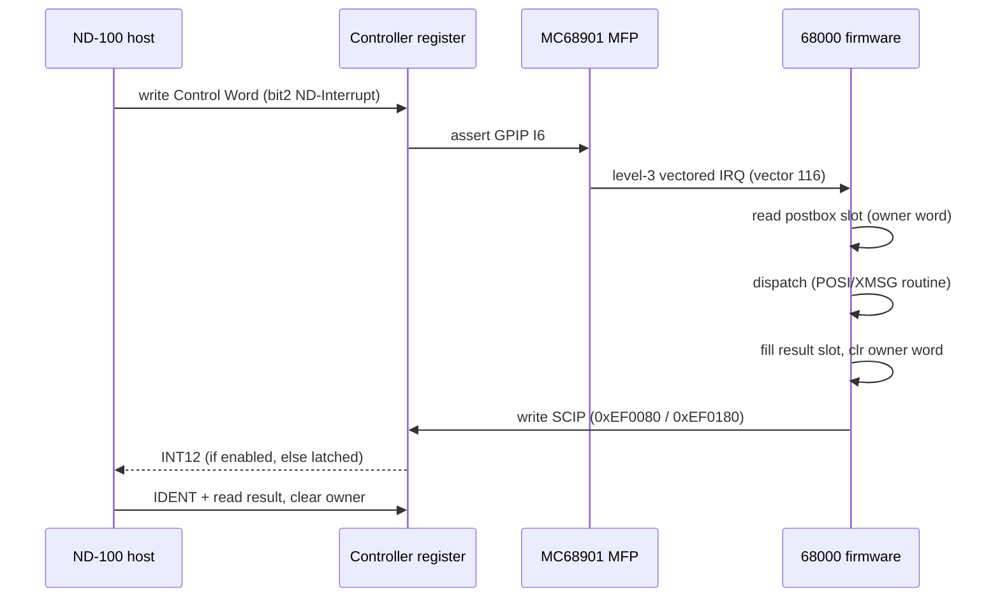
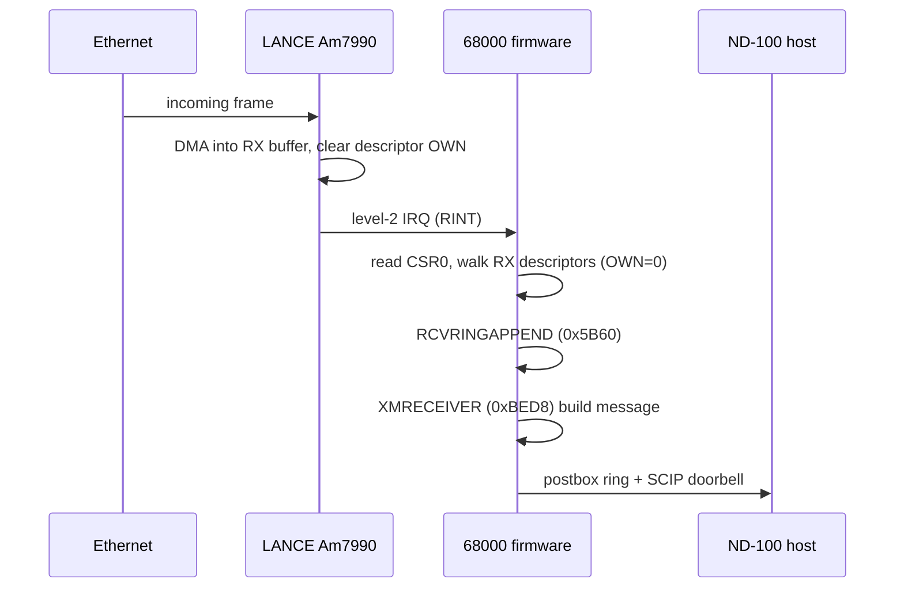
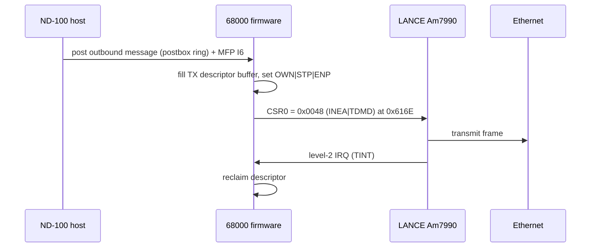
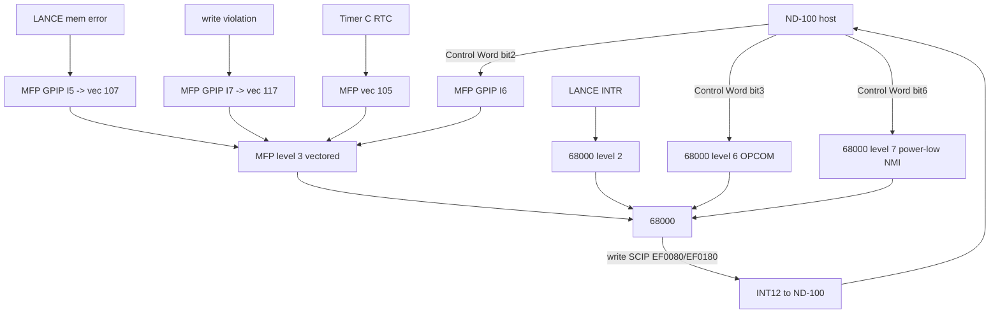
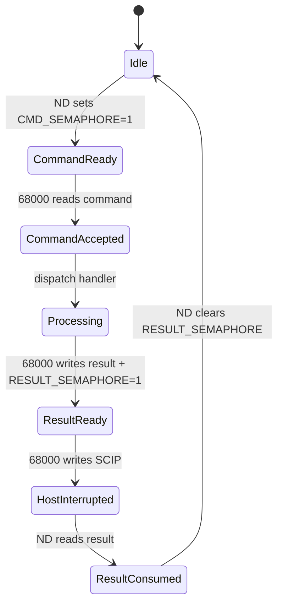

# ND Ethernet II Controller (PCB 3094) - 68000 Firmware Reverse Engineering

> **SUPERSEDED IN PLACES - see the complete reference:**
> [`ND_EthernetII_68000_Firmware_COMPLETE.md`](ND_EthernetII_68000_Firmware_COMPLETE.md)
> is the authoritative, comprehensive document. This file was the first pass; several
> "not located / not traced" notes below have since been RESOLVED, in particular:
> the MFP register block IS located (`init_mfp_registers` at 0x396A, **VR=0x40 confirmed**);
> the full receive AND transmit paths are reversed (descriptor formats, DMA, two-stage
> MAC filtering, RCVCOMPLETE/XMTRINGAPPEND/XMTCOMPLETE); the LANCE init block fields and
> 1520-byte RX buffers are known; the RTC ISR (0x3A68), CRC-32 (0x4660), the XROUT
> dispatch table (0x1D170), the XMSG message (XMRECEIVER 0xBED8), and the ND-100 -> 68000
> 8-channel doorbell (nd_host_interrupt_handler 0x250E) are all documented in the
> COMPLETE reference. All 116 functions and the meaningful data globals are named.

Target image: `encos-ser-all-banks-68k.bin`
Board: Norsk Data Ethernet II Controller, PCB 3094 (ndwiki 3094)
CPU: Motorola MC68000, big-endian
Analysis tools: Ghidra (MCP), plus the RetroCore C# emulator source
`Emulated.HW/ND/CPU/NDBUS/NDBusEthernetII.cs` as the host-side reference.

> Confidence markers used throughout: **CONFIRMED** (proven in this image's
> disassembly or in the C# host emulator), **HYPOTHESIS** (strongly suggested by
> code but not fully traced), **UNCONFIRMED** / **ASSUMPTION** (taken from the task
> brief or external docs, not yet verified against this image).

---

## Executive summary

`encos-ser-all-banks-68k.bin` is the **production ENCOS Ethernet-II server
firmware**, not the diagnostic/self-test firmware. This is proven by the embedded
PLANC module headers (`* NCOM *`, `HDLC-DR`, `,ASYN-DR`, `LOC-XMSG`, `* MAIN *`,
`M-MANAG`, `PHLS-GEN`, `RT-CLOCK`, `SHORTLIB`, all dated April-August 1986) and by
an embedded PLANC routine/symbol table (near file offset 0x66E00) whose records map
routine names to code entry addresses (e.g. `INITLANCE`, `FATALERROR`, `RCVRINGAPP`,
`XMRECEIVER`, `XMPSEND`, `PORTCREATE`, `POSIINITIA`, `POSISTART`).

Key protocol findings that are **CONFIRMED** in this image:

- Reset entry is **0x00001CFE** (from vector 1). Initial SSP = 0x000005C8 (vector 0).
- The 68000 signals the ND-100 by writing **SCIP** (I/O `0x00EF0080`, or its mirror
  `0x00EF0180`), which raises **interrupt level 12** on the ND-100 bus. Two distinct
  code sites do this: `post_and_signal_nd100_scip` (0x1A48, monitor/console channel,
  writes 0xEF0080) and `maybe_xmsg_postbox_send_ring` (0xEACC, XMSG channel, writes
  0xEF0180).
- LANCE (Am7990) is initialized by writing RAP (`0xEF00A2`) then RDP (`0xEF00A0`) in
  the canonical CSR sequence, with an **initialization block at RAM 0x18810** and
  **CSR3 = 0x0004 (BSWP)** set for big-endian byte order.
- The ND-100 -> 68000 direction is an interrupt via the **MFP GPIP I6** line
  (vector 116 / OPCOM level 6), per the C# host emulator and the ND-12.055.1 manual.
- The controller has **no EPROM**; the ND-100 loads all 512 KB of 68000 code/data
  into shared DRAM before releasing the 68000 from reset.

Important correction to the task brief: the anchor addresses in the prompt
(0x25F0 = MFP setup, 0x2598 = timer init, 0x30CA, 0x3338, 0x45E0/0x4610 = hw init,
0x57F2, and the command mailbox map at 0x400/0x440/0x880) were derived from the
**bank-0 diagnostic firmware** (`encos-ser-b0-68k`). In this production all-banks
image those addresses land on unrelated code or on data. They are documented below
as **not applicable to this image** rather than silently reused.

---

## Confirmed firmware load assumptions

| Item | Value | Confidence |
|------|-------|------------|
| Ghidra program | `encos-ser-all-banks-68k.bin` | CONFIRMED (active program) |
| Format | Raw Binary | CONFIRMED |
| Language | 68000 : BE : 32 : default | CONFIRMED |
| Image base | 0x00000000 | CONFIRMED |
| Address range | 0x00000000 - 0x0007FFFF (512 KB) | CONFIRMED |
| Full banks loaded? | Yes - this is the combined all-banks image | CONFIRMED |
| Auto-analysed functions at start | 90 | CONFIRMED |

The brief's concern about needing to load `encos-ser-all-banks-68k.bin` because the
bank-0-only image has unresolved cross-bank references is **already satisfied**: the
active program IS the all-banks image. No re-import is required.

Note on mirroring: several data blobs appear twice, 0x60000 apart (e.g. the ENMA
statistics text at 0x15998 and 0x75998; `PO100ports/PO100messages` at 0x1671A and
0x7671A). This is consistent with the all-banks image carrying more than one bank
copy. **HYPOTHESIS**: bank replication in the packed image; not load-critical.

---

## Ghidra import settings (as loaded)

- Processor: `68000:BE:32:default`
- Base address: `ram:00000000`
- One flat memory block `ram` 0x00000000-0x0007FFFF, RWX.
- I/O space (0xEF0000+), protection table (0xF00000+) and the DRAM mirror
  (0xF80000+) are **not** mapped as separate Ghidra blocks. Firmware I/O accesses
  therefore appear as absolute-long references to `0x00EFxxxx` etc. and are
  annotated with comments rather than block labels. This is a tooling limitation,
  not a firmware fact.

---

## 68000 memory map

CONFIRMED from the C# host emulator (`NDBusEthernetII.cs`) plus observed I/O
accesses in this image.

| 68000 address range | Region | Notes |
|---------------------|--------|-------|
| 0x000000 - 0x07FFFF | Local/shared DRAM (512 KB) | Vectors, code, data, LANCE buffers. Loaded by ND-100. CONFIRMED. |
| 0x080000 - 0xEEFFFF | Unmapped / EPROM option | Access -> bus error. EPROM never fitted. C# ref. |
| 0xEF0000 - 0xEF01FF | I/O space (EF00xx mirrored at EF01xx) | See I/O map. CONFIRMED. |
| 0xF00000 - 0xF7FFFF | Protection table | Per-page write-protect for RAM. C# ref. |
| 0xF80000 - 0xFFFFFF | DRAM mirror | Mirror of 0x000000-0x07FFFF; the ND-100 shared window. C# ref. |

---

## I/O register map

CONFIRMED from `NDBusEthernetII.cs` (the emulator decodes exactly these) and
corroborated by observed absolute-long accesses in this image.

| Address | Name | Dir | Purpose | Observed in image |
|---------|------|-----|---------|-------------------|
| 0xEF0010-1F | PROFF | W | Protection-table bypass | - |
| 0xEF0020-3F | MODCR | R/W | Mode control (EPROMMODE/PARITYDIS/BREAKMODE) | - |
| 0xEF0040-5F | MERRSTAT | R | Parity/memory error status | Yes (0x1D84 `move.b #0,0xEF0040`) |
| 0xEF0060-7F | EAREN | R | Memory-error address latch | - |
| 0xEF0080-9F | SCIP | W | **Write -> INT12 to ND-100** | Yes (0x1A5C, 0x224C, 0x249A) |
| 0xEF00A0 | LANCE RDP | R/W | Register Data Port | Yes (0x4AC8, 0x616E, ...) |
| 0xEF00A2 | LANCE RAP | R/W | Register Address Port | Yes (0x4ABE, 0x4ADC, ...) |
| 0xEF00A8-AF | XCVPW | W | Transceiver 12 V power switch | Yes (0x47BA `move.b #3,0xEF00A8`) |
| 0xEF00B0-B7 | LANRESET | W | LANCE hardware reset trigger | HYPOTHESIS (region present) |
| 0xEF00B8-BF | ETHSTAT | R | HW status (bit2=power, bit0=LAN int) | - |
| 0xEF00C0-FF | MFP (MC68901) | R/W | USART, timers, GPIO, interrupts; odd addresses | HYPOTHESIS (see MFP) |
| 0xEF0180 | SCIP mirror | W | Alternate SCIP doorbell -> INT12 | Yes (0xECF2 in XMSG send) |

**UNCONFIRMED in this image**: I did not yet locate the MFP register programming
block (0xEF00C1..0xEF00FF, odd bytes). No `00 ef 00 c1` pattern was found, so the
MFP is likely accessed through an address register with a computed displacement
rather than an absolute long. VR=0x40 (task brief) is therefore **UNCONFIRMED here**.

---

## Interrupt architecture

CONFIRMED from `NDBusEthernetII.cs` and ND-12.055.1 (host side). The 68000 IPL
autovector assignment:

| 68000 level | Source | Vector type | Handler role |
|-------------|--------|-------------|--------------|
| 7 (NMI) | ND-100 power low | Autovector | Power failure |
| 6 | ND-100 OPCOM | Autovector (vector 0x1E / addr 0x78) | OPCOM request from ND-100 |
| 5 | MERR | Autovector | Memory parity error |
| 4 | PTC console | Autovector | Test-console serial |
| 3 | MFP (MC68901) | **Vectored** | MFP sources (see below) |
| 2 | LANCE | Autovector | Ethernet TX/RX |
| 1 | (unused) | - | - |

MFP vectored sources (level 3), host-side confirmed:

| MFP vector | Source | GPIP / function |
|-----------|--------|-----------------|
| 117 | Write violation by 68000 | GPIP I7 |
| 116 | **ND-100 requesting interrupt** | GPIP I6 |
| 114 | USART RX buffer full | USART RX |
| 113 | USART RX error | USART RX err |
| 112 | USART TX buffer empty | USART TX |
| 111 | USART TX error | USART TX err |
| 107 | LANCE memory access error | GPIP I5 |
| 105 | Real-time clock | Timer C |

**CONFIRMED in this image**: the reset entry installs an OPCOM/level-6 handler
address at vector 30 (writes `(0x52A)` into `0x0 + 0x78`, i.e. vector 0x1E). The
long BRA table starting at 0x1E38 is the exception/trap stub dispatch used by the
PLANC runtime (STACK OVERFLOW / ASSERT VIOLATION / INDEX RANGE ERROR strings at
0x44DE-0x451C are its panic messages).

**UNCONFIRMED**: exact per-source MFP handler bodies (RX/TX/error/RTC) are not yet
traced to named functions in this image.

---

## Boot / init flow

CONFIRMED (disassembled from reset entry 0x1CFE):

1. `move.l A0,(0x500)` - stash A0.
2. Initialise the monitor postbox at 0x40A: set `(0x40E)=1`, `(0x40C)=0`, clear
   `(0x406)`.
3. Warm-boot check: `cmpi.l #0x55555555,(0x4BA)`. If the magic is set, this is a
   restart after a caught trap: clear it, bump restart counter `(0x4BE)`, and report
   via `nd_monitor_set_flag`(0x1A30) + `post_and_signal_nd100_scip`(0x1A48).
4. Clear MERRSTAT: `move.b #0,(0x00EF0040)` (parity error status).
5. Install OPCOM level-6 handler pointer at vector 0x1E (addr 0x78).
6. `jsr 0x1AD4`, `jsr 0x396A`, `jsr 0x1C6A` - runtime / hardware bring-up
   (HYPOTHESIS: data/BSS init + peripheral init; not individually traced).
7. Arm the magic `(0x4BA)=0x55555555`, `(0x4C0)=1`, then `STOP #0x2500`
   (supervisor, IPL5) to hand off to the ND-100 / wait for interrupts.

The actual hardware bring-up (transceiver power, LANCE) lives around 0x47B0-0x4B24
(see LANCE section). `INITLANCE`'s symbol-table entry is 0x48EA, inside this cluster.

**Not applicable to this image**: prompt anchors 0x25F0/0x2598/0x3338/0x4610/0x57F2.
0x25F0 disassembles to an `RTE` fragment; 0x4610 is a TRAP #2 / divide fragment,
not "hardware init and dispatch". These are diagnostic-firmware addresses.

---

## Main loop

**UNCONFIRMED (this image).** The production firmware is event/interrupt driven
(PLANC "POSI" postbox scheduler: `POSIINITIALIZE` 0x11732, `POSISTART` 0x1179C,
`POSIAPPEND` 0x11DC4, `POSPGETALL` 0x1192A). The reset path ends in `STOP #0x2500`,
so after boot the 68000 is woken by interrupts and dispatches queued postbox work
rather than spinning a classic poll loop. The `0x8A2 MAIN_LOOP_ADDR` field from the
brief was **not** confirmed as a live pointer in this image.

---

## Shared-memory mailbox protocol

Two distinct shared-memory channels are visible in this image. Both live in the low
DRAM that the ND-100 also sees through its bank window.

### 1. Monitor / console postbox at 0x40A (CONFIRMED)

Used by the reset/trap/monitor path. Fields observed in `nd_monitor_set_flag`,
`post_and_signal_nd100_scip`, and reset entry:

| Offset | Addr | Meaning | Producer |
|--------|------|---------|----------|
| +0 | 0x40A | event counter (bumped on post) | 68000 |
| +2 | 0x40C | code / sub-code | 68000 |
| +4 | 0x40E | parameter | 68000 |
| +6 | 0x410 | second counter (bumped on post) | 68000 |
| +8 | 0x412 | request flag (set to 1) | 68000 |

A CPU register dump frame is written to **0x454** (movem.l of D0-D7/A0-A6 = 15
longs, + PC/USP/SR) by `save_cpu_context_to_0x454` on every trap - this is the
monitor's register snapshot passed to the ND-100 for OPCOM display.

Signalling: after filling the block the firmware writes `0x01` to SCIP 0xEF0080,
raising INT12 on the ND-100.

### 2. XMSG postbox ring (HYPOTHESIS, strong)

Used by the production message path (`maybe_xmsg_postbox_send_ring`, 0xEACC). Per
slot layout (Ghidra struct `XmsgPostboxSlot`):

| Offset | Field | Meaning |
|--------|-------|---------|
| +0 | owner | 0 = free/handed to consumer, non-zero = in use (`tst.w` guard, `clr.w` release) |
| +2 | payload0 | message word 0 |
| +4 | payload1 | message word 1 |
| +6 | payload2 | message word 2 |

The producer advances an **8-entry ring index** (`addq #1` then `andi #7`) and rings
the doorbell via `clr.w 0xEF0180` (SCIP mirror -> INT12). The `PO100ports` and
`PO100messages` strings indicate **two** such channels (a control/port channel and a
data/message channel) between the 68000 (PO... = postbox) and the ND-100 (100).

### The diagnostic command mailbox (0x400/0x440/0x880) - NOT in this image

The brief's command mailbox (`CMD_SEMAPHORE`=0x400, `RESULT_SEMAPHORE`=0x440,
`STAT_SEMAPHORE`=0x880, test dispatch table at 0x948) belongs to the **bank-0
diagnostic firmware**. In this production image, 0x400-0x412 is the monitor postbox
above and 0x440+ is used as the register-dump / result staging area, not a
semaphore-per-field test protocol. The C# emulator's `DumpCommunicationBlock` reads
0x440/0x442/0x444/0x446 as status/cmd/err/addr, consistent with a result-staging
block rather than the full diagnostic map. Marked **UNCONFIRMED for this image.**

---

## Command / result / status field tables

Because this is the server firmware (not the diagnostic firmware), there is **no
confirmed numeric test-command dispatch table** in this image. The command surface
is instead the XMSG/postbox routine set. What is CONFIRMED:

| Field | Addr | Role | Confidence |
|-------|------|------|------------|
| monitor counter | 0x40A | event counter | CONFIRMED |
| monitor code | 0x40C | sub-code | CONFIRMED |
| monitor param | 0x40E | parameter | CONFIRMED |
| monitor req flag | 0x412 | request | CONFIRMED |
| register dump frame | 0x454 | D0-D7/A0-A6/PC/USP/SR | CONFIRMED |
| warm-boot magic | 0x4BA | 0x55555555 sentinel | CONFIRMED |
| restart counter | 0x4BE | incremented per warm boot | CONFIRMED |
| LANCE init block | 0x18810 | Am7990 init block | CONFIRMED (pointer) |

The diagnostic RESULT_* / STAT_* fields from the brief are reproduced in the C#
`protocode` model for completeness but are flagged `Unconfirmed` there.

---

## Command dispatch table

**UNCONFIRMED in this image.** No numeric-command jump table was confirmed at 0x948
or elsewhere. The dispatch is by PLANC postbox routine, not an index-into-table of
test numbers. The `protocode/FirmwareCommandDispatcher.cs` therefore lists the
confirmed *named* routines (with their code addresses and confidence) rather than a
fabricated numeric table.

Confirmed named routines (from the PLANC symbol table, addresses verified against
existing auto-analysis where a function already existed):

| Name | Entry | Verified vs auto-analysis | Role (HYPOTHESIS from name) |
|------|-------|---------------------------|------------------------------|
| INITLANCE | 0x48EA | new fn created | LANCE init |
| FATALERROR | 0x4C26 | == FUN_00004c26 | fatal error handler |
| RCVRINGAPPEND | 0x5B60 | == FUN_00005b60 | append to RX ring |
| LNMAEVENTS | 0x6DA8 | new fn | LAN management events |
| XMRECEIVER | 0xBED8 | new fn | XMSG receiver |
| PORTCREATE | 0xE73C | new fn | create XMSG port |
| XMPSEND | 0x106F0 | new fn | XMSG send |
| XMPFREL | 0x10880 | new fn | XMSG free (release) |
| XMPFREA | 0x10936 | new fn | XMSG free (alloc side) |
| POSIINITIALIZE | 0x11732 | == FUN_00011732 | postbox scheduler init |
| POSISTART | 0x1179C | == FUN_0001179c | postbox scheduler start |
| POSIAPPEND | 0x11DC4 | == FUN_00011dc4 | postbox append |
| POSPGETALL | 0x1192A | new fn | postbox get-all |
| LNCNSPCOMMAND | 0x1A268 | new fn | LAN connection SP command |
| XGATEVIAPOSTBOX | 0x1E16C | data-typed, not created | gateway via postbox |
| POCONFIGURE | 0x2D350 | new fn | postbox configure |

Symbol-table entries whose "address" lands in **data** (init block / config tables,
NOT code): `LNMAAUTORE` 0x18868, `POSKPATTER` 0x18A34, `POSKCONFIG` 0x18A40,
`ENMANUMBUF` 0x36368, `POMNEVHAND` 0x66326. Left as data.

---

## Postbox / semaphore / lock analysis

CONFIRMED mechanisms:

- **SCIP doorbell** (edge signal, not a lock): byte/word write to 0xEF0080 or
  0xEF0180 raises INT12 to the ND-100. One-directional 68000 -> ND-100.
- **Owner word** (`XmsgPostboxSlot.owner`, +0): a single 16-bit ownership flag per
  ring slot. Non-zero = owned/in-use; `clr.w` hands the slot to the other side.
  Guarded by `tst.w`. This is the buffer-exchange primitive.
- **8-entry ring index**: `addq #1; andi #7` on a per-channel index word. Classic
  producer index into an 8-slot ring.
- **Warm-boot sentinel** (0x4BA = 0x55555555): not a lock, a crash-restart marker.

No test-and-set / spin-on-semaphore loops of the diagnostic style (wait-until-zero
on 0x400/0x440) were confirmed in this image.

---

## Buffer exchange model

CONFIRMED / HYPOTHESIS mix:

- ND-100 <-> 68000 message exchange uses **postbox rings with an owner word per
  slot** (above), plus the SCIP interrupt as the "slot ready" doorbell. This is a
  **polling-plus-interrupt hybrid**: the owner word is polled/tested, the interrupt
  wakes the peer.
- LANCE <-> 68000 packet exchange uses the **Am7990 descriptor rings** (RX and TX)
  pointed to by the init block at 0x18810, with the LANCE `OWN` bit as the ownership
  primitive (standard Am7990). Ring append is `RCVRINGAPPEND` (0x5B60). Exact ring
  base addresses and lengths are **TODO_REVERSED_DETAIL** (init block not yet dumped).

---

## LANCE initialization and packet flow

CONFIRMED init sequence (code at 0x4ABE-0x4B1C, big-endian 68000):

```
RAP(0xEF00A2) = 3 ; RDP(0xEF00A0) = 4     ; CSR3 = 0x0004 (BSWP) byte-swap for 68000
init_block_ptr = 0x18810
RAP = 1 ; RDP = (init_block low word)      ; CSR1 = IADR low
RAP = 2 ; RDP = (init_block high byte)     ; CSR2 = IADR high
RAP = 0 ; RDP = 1                          ; CSR0 = INIT (start initialization)
jsr 0x4E42                                 ; HYPOTHESIS: wait for IDON
```

Transceiver 12 V power is switched on earlier with `move.b #3,(0xEF00A8)` (XCVPW) and
off with `#0x00`.

CONFIRMED TX kick: `move.w #0x0048,(0xEF00A0)` at 0x616E writes CSR0 = INEA|TDMD
(interrupt-enable + transmit-demand) - the "start transmit" poke.

TODO_REVERSED_DETAIL (init block at 0x18810, not yet dumped):
- MODE word, PADR (MAC address) source, LADRF multicast filter.
- RDRA/TDRA ring base pointers, RLEN/TLEN ring lengths.
- RX/TX descriptor buffer pointers and byte counts.

MAC address source: **UNCONFIRMED** in this image.

### RX path sequence (HYPOTHESIS)

1. LANCE DMA writes a received frame into the current RX descriptor buffer and
   clears the descriptor `OWN` bit (hands to 68000), then raises LANCE interrupt
   (68000 level 2).
2. Level-2 handler reads CSR0, sees RINT, walks RX descriptors whose `OWN`=0.
3. `RCVRINGAPPEND` (0x5B60) queues the buffer; `XMRECEIVER` (0xBED8) processes the
   frame into an XMSG message.
4. Message posted to the ND-100 via the XMSG postbox ring + SCIP doorbell.

### TX path sequence (HYPOTHESIS)

1. ND-100 posts an outbound message (postbox ring, owner word); SCIP-equivalent /
   MFP I6 wakes the 68000.
2. Firmware fills a TX descriptor buffer, sets the descriptor `OWN` bit (hands to
   LANCE) with STP/ENP.
3. `move.w #0x0048,(0xEF00A0)` (CSR0 = INEA|TDMD) kicks transmission.
4. LANCE raises level-2 TINT on completion; handler reclaims the descriptor.

Both RX and TX bodies past the descriptor mechanics are UNCONFIRMED in this image.

---

## ND-100 -> 68000 interrupt sequence (host side CONFIRMED)

From `NDBusEthernetII.cs Write(ControlWord)`:

1. ND-100 writes the controller Control Word with bit 2 (ND Interrupt) set.
2. On the rising edge the card asserts **MFP GPIP I6**, producing MFP vector 116.
3. 68000 takes a level-3 vectored interrupt, dispatches the ND-100-request handler.
4. (OPCOM path: Control Word bit 3 instead raises 68000 level-6 autovector, vector
   0x1E / addr 0x78 - handler installed by reset entry.)

## 68000 -> ND-100 interrupt sequence (CONFIRMED)

1. 68000 fills the postbox/monitor block and clears the slot owner word.
2. 68000 writes SCIP (0xEF0080 or mirror 0xEF0180).
3. The card latches "interrupt set for ND-100 on level 12". If the ND-100 has
   interrupts enabled (Control Word bit 0) it is delivered immediately; otherwise it
   stays pending until enabled (the ENNS0 startup-race latch documented in the C#
   emulator).
4. ND-100 takes level-12, IDENTs the controller, reads the result, clears its side.

---

## Error handling and bus-error behaviour

- PLANC runtime panics: `STACK OVERFLOW AT`, `ASSERT VIOLATION AT`,
  `INDEX RANGE ERROR AT` (strings at 0x44DE-0x451C, duplicated at 0x637C-0x63C2).
  `FATALERROR` (0x4C26) is the fatal path.
- Warm-boot recovery: reset entry uses the 0x55555555 sentinel at 0x4BA to detect a
  restart after a caught trap and report it to the ND-100 rather than looping.
- Memory/parity: reset entry clears MERRSTAT (0xEF0040) at boot; parity errors raise
  68000 level 5 (autovector). EAREN (0xEF0060) latches the faulting address.
- Bus error / memory probe: the C# host emulator explicitly models a **startup
  memory probe** whose first bus error sets `_firstBusErrorOccurred` (used to gate
  logging). So the firmware intentionally probes beyond mapped DRAM and relies on the
  68000 bus-error vector to recover. The exact probe loop is **UNCONFIRMED** in this
  image (not yet traced), but the behaviour is CONFIRMED from the host side.

---

## Function index (named in this session)

| Address | Name | Confidence | Evidence |
|---------|------|-----------|----------|
| 0x1CFE | reset_entry | CONFIRMED | reset vector 1 |
| 0x1A30 | nd_monitor_set_flag | CONFIRMED | writes 0x412 flag |
| 0x1A48 | post_and_signal_nd100_scip | CONFIRMED | writes SCIP 0xEF0080 |
| 0x1A66 | save_cpu_context_to_0x454 | CONFIRMED | movem.l frame to 0x454 |
| 0x48EA | INITLANCE | CONFIRMED (name) / HYPOTHESIS (body) | symbol table + LANCE CSR cluster |
| 0x4C26 | FATALERROR | CONFIRMED (name) | symbol table |
| 0x5B60 | RCVRINGAPPEND | CONFIRMED (name) | symbol table |
| 0x6DA8 | LNMAEVENTS | HYPOTHESIS | symbol table |
| 0xBED8 | XMRECEIVER | HYPOTHESIS | symbol table |
| 0xEACC | maybe_xmsg_postbox_send_ring | HYPOTHESIS (strong) | ring + SCIP 0xEF0180 |
| 0xE73C | PORTCREATE | HYPOTHESIS | symbol table |
| 0x106F0 | XMPSEND | HYPOTHESIS | symbol table |
| 0x10880 | XMPFREL | HYPOTHESIS | symbol table |
| 0x10936 | XMPFREA | HYPOTHESIS | symbol table |
| 0x11732 | POSIINITIALIZE | CONFIRMED (name) | symbol table |
| 0x1179C | POSISTART | CONFIRMED (name) | symbol table |
| 0x11DC4 | POSIAPPEND | CONFIRMED (name) | symbol table |
| 0x1192A | POSPGETALL | HYPOTHESIS | symbol table |
| 0x1A268 | LNCNSPCOMMAND | HYPOTHESIS | symbol table |
| 0x2D350 | POCONFIGURE | HYPOTHESIS | symbol table |

## Data structure index

| Address / type | Name | Confidence |
|----------------|------|-----------|
| 0x40A | monitor/console postbox block | CONFIRMED |
| 0x454 | CPU register dump frame | CONFIRMED |
| 0x4BA | warm-boot magic 0x55555555 | CONFIRMED |
| 0x18810 | LANCE Am7990 init block | CONFIRMED (pointer), fields TODO |
| type `XmsgPostboxSlot` | 8-byte postbox ring slot | HYPOTHESIS (strong) |

---

## Sequence diagrams

### 1. ND-100 command to 68000 result flow



### 2. Ethernet packet receive flow



### 3. Ethernet packet transmit flow



### 4. Interrupt routing



### 5. Mailbox / postbox semaphore state machine



> The state machine above uses the brief's canonical semaphore names. In THIS
> production image the equivalent primitive is the per-slot `owner` word
> (non-zero = owned, `clr.w` = release) plus the SCIP doorbell, not the
> per-field diagnostic semaphores.

---

## Generated C# protocol model

The high-level C# behavioral translation is generated in `protocode/`.

This code is intended to preserve the firmware logic discovered from the 68000
disassembly:
- mailbox state transitions
- command dispatch
- interrupt signaling
- LANCE buffer ownership
- host/firmware shared-memory protocol

It is not a replacement for the actual firmware binary and is not cycle accurate.

---

## Open questions / unresolved areas

1. MFP register programming block (0xEF00C1+ odd bytes) not located; VR=0x40
   unverified in this image.
2. LANCE init block fields at 0x18810 not dumped (MODE/PADR/LADRF/RDRA/TDRA/lengths).
3. MAC address source unknown.
4. RX/TX interrupt handler bodies not fully traced.
5. Memory-probe loop location not traced (behaviour confirmed only host-side).
6. Whether `PO100ports` vs `PO100messages` are two rings or two views of one.
7. Numeric command dispatch table: none confirmed in the server firmware.

## Explicit list of assumptions

- The PLANC symbol-table record layout is `[code-addr:32][zero:32][name:NUL-padded]`;
  verified by three exact matches to existing functions (0x4C26, 0x5B60, 0x11732,
  0x1179C, 0x11DC4). ASSUMPTION that all other records follow the same layout.
- I/O semantics (SCIP=INT12, MFP I6=ND request, LANCE RAP/RDP) are taken as CONFIRMED
  from the RetroCore C# emulator, which is authoritative for emulated behaviour; they
  are corroborated but not exhaustively re-derived from silicon.
- The XMSG postbox interpretation of 0xEACC is a strong HYPOTHESIS from the code
  shape (ring index &7, owner word, SCIP mirror) plus the PO100 strings.
