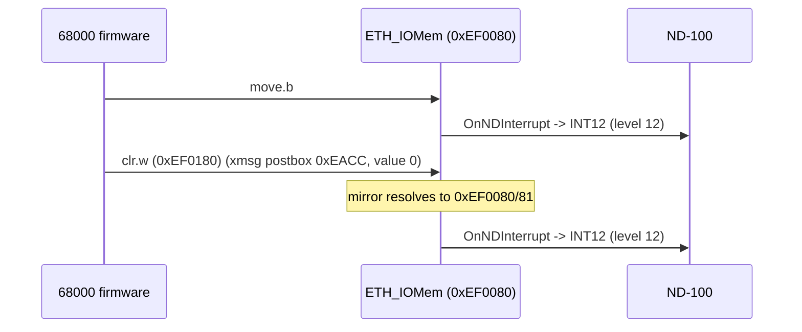

# ND Ethernet II - Emulator Correctness Analysis (NDBusEthernetII.cs)

**Date:** 2026-07-08
**Reviewer target:** `E:\Dev\Repos\Ronny\RetroCore\Emulated.HW\ND\CPU\NDBUS\NDBusEthernetII.cs`
and the MFP model `E:\Dev\Repos\Ronny\RetroCore\Emulated.HW\Motorola\MFP\MC68901\MC68901MFP.cs`

**Cross-referenced against:**
- Ghidra RE of the production ENCOS firmware `encos-ser-all-banks-68k.bin`
  (see `ND_EthernetII_68000_Firmware_COMPLETE.md`).
- Authoritative manual `Reference-Manuals\Devices\ND-12.055.1 EN Ethernet II Controller.md`.

**Scope:** the connection/glue between the ND-100 interface, the 68000, the MC68901 MFP,
and the Am7990 LANCE - i.e. how interrupts and doorbells are routed in both directions.

**Confidence tags:** [C]=confirmed from disassembly/manual, [H]=hypothesis needing a
dynamic trace, [FIXED]=change applied 2026-07-08.

---

## 0. Executive summary

The persistent symptom (the ENCOS server ENNS0 never completing; the memory note's
"firmware-init divergence") is explained by **BUG A**: the production firmware's
68000 -> ND-100 SCIP doorbell did not raise INT12 in the emulator. The emulator's SCIP
trigger condition was tuned to the shape of the TPE ETHERNET-TWO **diagnostic** firmware's
writes and silently dropped **both** doorbells the **production** firmware uses. Fixed.

Two lower-severity issues (timer interrupt level; a latent octal-as-decimal vector table)
and two documentation defects are also described.

---

## 1. What is CORRECT (ruled out as bugs) [C]

| Area | Finding |
|------|---------|
| MFP register decode | `Read/Write` do `address |= 1; map2register = (addr-base)>>1`. Offset 0x17 -> reg 11 = VR. Firmware `move.b #0x40,(0xEF00D7)` -> VR=0x40. Correct. |
| MFP vector formula | `UseSystemVectorMapping=false` -> `(VR&0xF0)|channel`. Firmware vector table CONFIRMS the targets: 0x114 (ch5=Timer C) -> `rtc_timer_isr` 0x3A68; 0x138 (ch14=GPIP6) -> `nd_host_interrupt_handler` 0x250E; 0x78 (OPCOM) -> 0x1B00. |
| Interrupt levels | LANCE=2, MFP=3, console=4, parity=5, OPCOM=6, power=7. Matches manual table (section "68000 Interrupt Levels"). |
| MFP -> CPU wiring | `Mfp_OnIRQ` -> `InterruptControllerSetInterrupt(3,...)`. `Lance_OnIRQ` -> level 2. Correct. |
| LANCE glue | `SwapByteLanes=true` (68K big-endian register port) + `DmaIn`/`DmaOut` big-endian. Needed and correct. |
| ND interrupt / OPCOM | Control Word bit2 -> `SetMFPInterrupt` -> GPIP6 -> level 3 vector 0x4E. Bit3 -> level 6 OPCOM. Correct. |

---

## 2. BUG A [C] [FIXED] - production SCIP doorbell never raised INT12 (ROOT CAUSE)

### Evidence
Manual, I/O map: `EF0080 - EF009F | SCIP | W`. SCIP section: *"Using this address range
results in an interrupt on level 12 to the ND-100."* The trigger is the **act of writing**
(Status Change In PIOC) - independent of value, byte lane, or the EF01xx mirror.

The production firmware has exactly two 68000 -> ND-100 doorbells, both landing at
0xEF0080 (or the EF0180 mirror that resolves to it):

| Firmware routine | 68K addr | Instruction | Emulator address seen |
|------------------|----------|-------------|------------------------|
| `post_and_signal_nd100_scip` | 0x1A48 | `move.b #1,(0xEF0080)` | 0xEF0080, direct, value 1 |
| xmsg postbox producer | 0xEACC | `clr.w (0xEF0180)` | mirror -> 0xEF0080/81, value 0 |
| (two more SCIP writers) | 0x224C, 0x249A | `...(0xEF0080)` | 0xEF0080, direct |

### The defect (original code, ~line 3279)
```
if (address in 0xEF0080..0xEF009F):
    mirrored = WasMirroredAccess()
    if mirrored:
        if isWrite and (address&1) and value != 0:   // <-- diagnostic-shaped guard
            OnNDInterrupt()                           //     INT12
        return
    if address <= 0xEF0081:                           // <-- direct -> MFP GPDR
        MfpChip.Write(address+0x40, value)            //     NO INT12
        return
    return HandleSCIPChannelAccess(...)
```

Consequence:
- `move.b #1,(0xEF0080)` (direct) -> the `address <= 0xEF0081` branch -> **MFP GPDR**, no
  INT12.
- `clr.w (0xEF0180)` (mirror, value 0) -> mirror branch, but `value != 0` is false -> no
  INT12.

So **both** production doorbells were dropped. The ND-100 never learned a result/message
was ready, so ENNS0 hung. Root cause: 0xEF0080 is **SCIP** in the production firmware but
was treated as an **MFP-GPDR alias** to satisfy the TPE diagnostic (test5/6). The emulator
cannot tell the two firmwares apart from the address alone and had chosen the diagnostic
interpretation.

### Fix applied
Any **write** to 0xEF0080/0xEF0081 now raises INT12 (both doorbells), still forwards to the
MFP GPDR, and still mirrors GPDR on **reads** (SCIP is write-only, so the diagnostic's
GPIP-poll read loop is preserved). The `value != 0` and mirrored-only guards are removed.

```
if (address in 0xEF0080..0xEF009F):
    if (address <= 0xEF0081):
        if isWrite:
            OnNDInterrupt()                 // SCIP -> ND-100 level 12 (per manual)
            MfpChip.Write(address+0x40, val) // keep diagnostic GPDR drive
            return
        return MfpChip.Read(address+0x40)   // reads = GPDR poll (not a SCIP trigger)
    return HandleSCIPChannelAccess(...)      // 0x82-0x9F channel regs (diagnostic)
```

### Doorbell flow (fixed)


### Regression note
The SCIP range is exactly where production and diagnostic disagree. **Re-run the TPE
ETHERNET-TWO diagnostic** (regression oracle). If it regresses because it relies on
0xEF0080 **writes** not raising INT12, add an explicit "diagnostic mode" flag rather than
guessing - the manual is unambiguous that a SCIP write raises INT12.

---

## 3. BUG B [C evidence / H impact] - RTC/timer interrupt level

`ethIoMem.OnTimerInterrupt -> InterruptControllerSetInterrupt(5, true)` delivers timer
interrupts on **level 5**. That path is the **diagnostic** firmware's STC timer
(0xEF0140/0xEF0160), reverse-engineered from TPE test 12.

The **production** RTC is the **MFP Timer C** -> level 3 vectored -> vector 0x45 ->
`rtc_timer_isr` (0x3A68). CONFIRMED from the firmware vector table (0x114 -> 0x3A68) and
`init_mfp_registers` (0x396A) which programs TCDCR=0x50 (Timer C /100), TCDR=0xF4, and
enables Timer C in IERB (0xA0). The production **level-5 autovector** (address 0x74) points
to a stub (0x1F56), not a timer ISR.

Assessment: the production RTC path (MFP Timer C -> `Mfp_OnIRQ` -> level 3 -> vector 0x45)
IS already wired correctly, so the RTC can work. The **risk** is the level-5 STC timer
firing for the production firmware and hitting the 0x74 stub. This only happens if the
production firmware programs the STC (0xEF0140). **Not changed** - needs a dynamic trace to
confirm; leave the MFP-Timer-C RTC path as-is.

---

## 4. TRAP C [C] [FIXED-comment] - latent octal-as-decimal vector table

`MapMFPVectorToSystem` (MC68901MFP.cs) returns `116, 117, 114, ...` - the manual's vectors
in **octal** - as **decimal** bytes. It is dead code today (`UseSystemVectorMapping=false`,
correctly), but if ever enabled it would deliver vector 116 decimal = **0x74** for GPIP6,
sending the CPU to the wrong handler (the firmware installs GPIP6 at vector **0x4E**).
`LogMFPVectorType` / `GetSystemVectorName` share the same octal-as-decimal confusion
(cosmetic - logging only). A warning comment was added; behaviour unchanged.

Reference: 116 octal = 0x4E, 105 octal = 0x45, 107 octal = 0x47, 117 octal = 0x4F - all
equal `VR(0x40) | channel`, i.e. the standard MC68901 formula the firmware relies on.

---

## 5. NOTE D [C] [FIXED-comment] - stale firmware addresses in comments

`InitializeMFPFromFirmware` (now a disabled no-op) and its call site referenced
`0x25F0` (MFP init), `0x30CA`, `0x2598` (timer init) as "the firmware's own init". Those
are **diagnostic** firmware addresses. The real production MFP init is
`init_mfp_registers` at **0x396A**, called from `reset_entry` at 0x1DA0 - it runs on cold
boot and programs VR=0x40, IERA/IERB, IMRA/IMRB and starts Timer C. Comment corrected.

---

## 6. NOTE E [C] - boot wake handshake (not a bug; constraint to remember)

`reset_entry` ends in `stop #0x2500` (SR = supervisor, IPL 5). At IPL 5 only level 6
(OPCOM) or level 7 (power) can wake the 68000 - a level-3 ND-interrupt (GPIP6) cannot. So
the ND-100 **must** wake the 68000 out of the boot STOP with **OPCOM** (Control Word bit 3),
not the ND-interrupt bit (bit 2). The emulator handles both; this is a protocol constraint
that pairs with the fixed MC68K STOP-wait bug (memory note).

---

## 7. MFP programming reference (from init_mfp_registers, 0x396A) [C]

Base 0xEF00C0, odd-address registers (offset = 2*regnum+1):

| Reg | Offset | Value | MC68901 register | Effect |
|-----|--------|-------|------------------|--------|
| 1 | 0x03 | 0x00 | AER | active edge = low |
| 2 | 0x05 | 0x00 | DDR | all GPIP inputs |
| 3 | 0x07 | 0xC0 | IERA | enable GPIP7 + GPIP6 |
| 4 | 0x09 | 0xA0 | IERB | enable GPIP5 + Timer C |
| 9 | 0x13 | 0xC0 | IMRA | unmask GPIP7 + GPIP6 |
| 10 | 0x15 | 0x80 | IMRB | unmask GPIP5 (Timer C masked until firmware unmasks) |
| 11 | 0x17 | 0x40 | VR | vector base 0x40, auto-EOI |
| 14 | 0x1D | 0x50 | TCDCR | Timer C prescale /100 (RTC) |
| 17 | 0x23 | 0xF4 | TCDR | Timer C reload = 244 |

MFP vector map (VR=0x40): GPIP6/ND-100 = 0x4E; GPIP7/write-viol = 0x4F; GPIP5/LANCE-err =
0x47; Timer C/RTC = 0x45; USART RxFull/RxErr/TxEmpty/TxErr = 0x4C/0x4B/0x4A/0x49.

---

## 8. Files changed (2026-07-08)

| File | Change |
|------|--------|
| `E:\Dev\Repos\Ronny\RetroCore\Emulated.HW\ND\CPU\NDBUS\NDBusEthernetII.cs` | BUG A fix (SCIP INT12 on any 0x80/0x81 write); NOTE D comment fix |
| `E:\Dev\Repos\Ronny\RetroCore\Emulated.HW\Motorola\MFP\MC68901\MC68901MFP.cs` | TRAP C warning comment on MapMFPVectorToSystem |

Build: `Emulated.HW.csproj` compiles, 0 errors (pre-existing unused-field warnings only).

---

## 9. Verification checklist (requires the ND-100 test harness - not run here)

- [ ] Unit: a `move.b #1,(0xEF0080)` raises `OnNDInterrupt`; a `clr.w (0xEF0180)` raises it too.
- [ ] ENNS0 START-NETWORK-SERVER: ND-100 receives INT12 after the 68K posts a result (was hanging).
- [ ] TPE ETHERNET-TWO diagnostic (regression oracle): still passes.
- [ ] (Optional, BUG B) trace whether production writes 0xEF0140 (STC); if not, confirm the
      level-5 STC timer stays inert for production.
