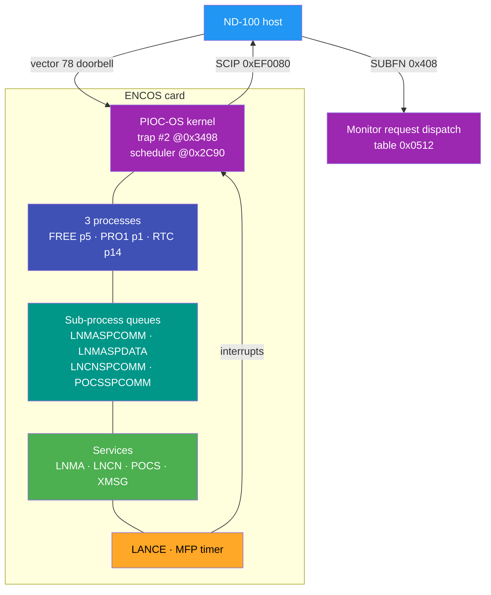
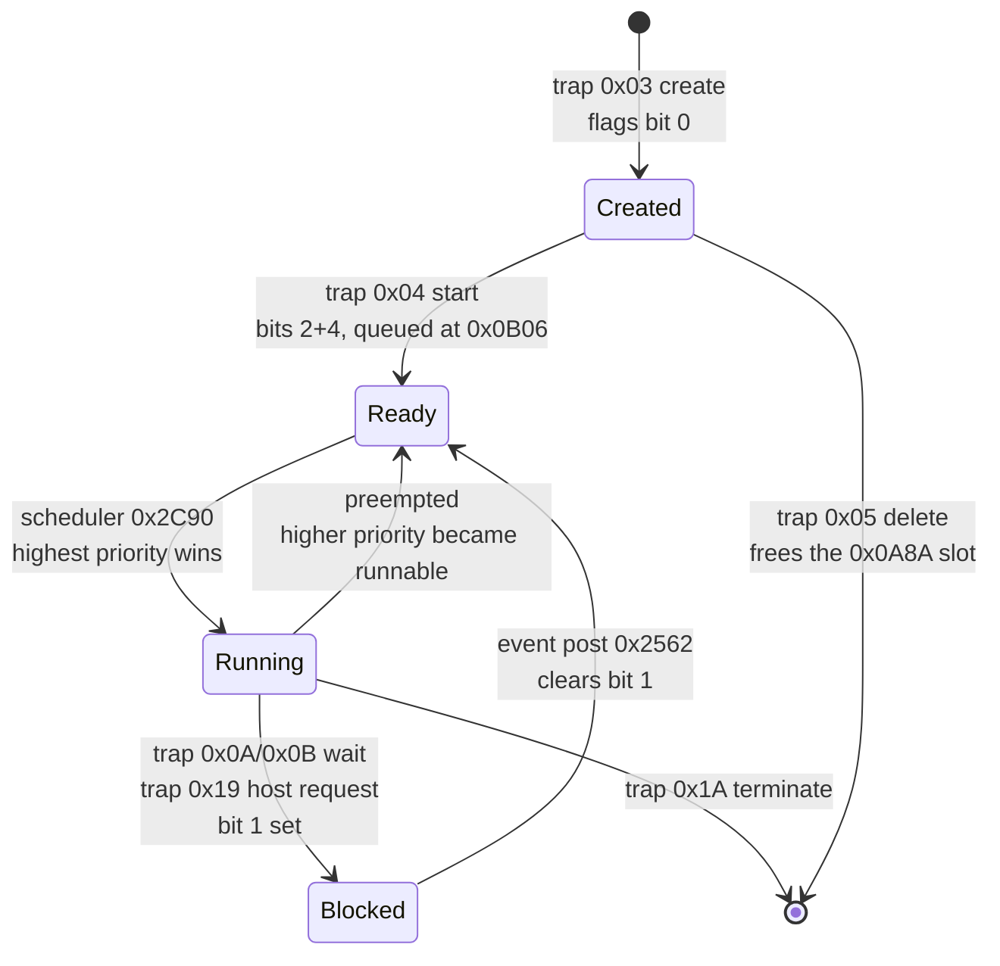

# PIOC-OS - the ENCOS Ethernet controller RTOS

**Image**: `encos-ser-all-banks-68k.bin` (MC68000, PLANC-MC compiled, ND 1986)
**Date**: 2026-07-26

PIOC-OS is the small multitasking kernel running on ND's ENCOS Ethernet II controller card. It is
**priority-preemptive**, built from nine linked modules, and talks to the ND-100 host through a
shared DRAM comm block and two doorbells.

---

## The documents

| # | Document | Covers |
|---|---|---|
| 01 | [Module inventory](01-MODULE-INVENTORY.md) | the nine modules, build dates, symbol-to-module map |
| 02 | [Boot and init](02-BOOT-AND-INIT.md) | reset entry, warm-restart path, board config, PRKEY gate |
| 03 | [Process model](03-PROCESS-MODEL.md) | object table, descriptor map, flags, the three processes |
| 04 | [Scheduler](04-SCHEDULER.md) | preemption mechanism, ready queues, context switching |
| 05 | [Kernel API](05-KERNEL-API.md) | all 27 trap #2 services |
| 06 | [IPC and messaging](06-IPC-AND-MESSAGING.md) | events, ports, sub-process queues, XMSG gateway |
| 07 | [Time and timers](07-TIME-AND-TIMERS.md) | MFP tick, timer elements, arm and cancel |
| 08 | [Memory](08-MEMORY.md) | heap, PLANC frame arena, fixed pools |
| 09 | [Interrupts and errors](09-INTERRUPTS-AND-ERRORS.md) | vector table, doorbells, error subsystem, dispatch defects |

Related, outside this folder:

- `..\ENCOS-FIRMWARE-SYMBOL-TABLE-2026-07-26.md` - ND's own 241 linker symbols
- `E:\Dev\Repos\Ronny\RetroCore\DOCS\ND_EthernetII_MASTER_REFERENCE_2026-07-23.md` - the host-side
  view: comm block, registers, boot/download flow
- `E:\Dev\Repos\Ronny\RetroCore\DOCS\ND_EthernetII_HLE_SEAM_CONTRACT_2026-07-26.md` - what an HLE
  must reproduce
- The `ghidra-planc` skill - PLANC-MC conventions, without which this firmware is easy to mis-read

---

## The layers

## Process states

---

## The one mechanism to understand first

**Deferred preemption by return-address hijack.** When an event post makes a higher-priority
process runnable, `0x2192` does not switch. It saves the interrupted PC and SR into the current
descriptor, then **overwrites the exception frame's return PC with the scheduler address** so the
`rte` lands in `0x2C90` instead of resuming. A double latch (`0x0660` **and** `0x0662`) stops a
second event post rewriting the frame again and destroying the saved PC.

Everything else - the priority scan, the descriptor context area, the wait/post pair - hangs off
that.

---

## Address cross-reference

| Address | Meaning | Doc |
|---|---|---|
| 0x0000-0x03FF | 68000 vector table | 09 |
| 0x0406 / 0x0408 / 0x040C | host REQUEST / SUBFN / reply | 02, 04, 09 |
| 0x0454-0x049D | whole-machine context save frame | 02 |
| 0x04BA / 0x04BE | warm-restart signature / restart counter | 02 |
| 0x04C2 / 0x04C6 | host-request queues (trap 0x19) | 05 |
| 0x04CA | board configuration record | 02 |
| 0x0500 | saved A0 from reset entry | 02 |
| 0x0512 | monitor SUBFN dispatch (**misnamed** "scheduler action") | 04 |
| 0x05C8 | initial SSP **and** module directory head | 01, 02 |
| 0x0650 | current process descriptor | 04 |
| 0x0658 | interrupted exception frame pointer | 04 |
| 0x0660 / 0x0662 | reschedule pending / rewrite latch | 04 |
| 0x0A8A | object table, 30 slots | 03 |
| 0x0B06 | ready-queue heads, 16 priorities | 04 |
| 0x0B66 / 0x0B96 / 0x0BE8 | slot ownership tables | 05 |
| 0x0C6A | trap #2 dispatch, 27 entries | 05 |
| 0x0D00-0x0D0A | heap control words | 08 |
| 0x0FC0 / 0x0FC2 / 0x0FCA / 0x0FD6 | timer count / ticks / list head | 07 |
| 0x0FCE / 0x0FD2 | the two timer lists | 07 |
| 0x1300-0x1A00 | heap | 08 |
| 0x2192 / 0x2C90 | preemption trigger / scheduler | 04 |
| 0x2562 | event poster | 03, 06 |
| 0x3498 | trap #2 kernel entry | 05 |
| 0x18882-0x188C4 | mode words and statistics block | seam contract |
| 0x18982 | host command jump table | seam contract |
| 0x2D354 / 0x2D472 / 0x2D4F4 | name registry / port pools | 06 |
| 0x00EF0080 | SCIP doorbell to the host | 09 |
| 0x00EF00D5 | MFP timer enable | 07 |

---

## STATICALLY UNRESOLVABLE - needs a live card or an emulator run

The ROM contains the code that builds these, not the structures themselves. **Do not infer their
contents from the image.**

| What | Why |
|---|---|
| Descriptor size (`DAT_00000664`) | zero in the image, computed at boot. Fields reach +0x98, so >= 0x9C |
| Object table contents (0x0A8A) | all zeros; populated at run time |
| Ready-queue heads (0x0B06) | all zeros |
| Heap free list | built at boot from the board config DRAM size |
| Port pools and name registry | the 0xAAAA signature is written at init, not in the image |
| Actual restart count (0x04BE) | runtime state |

---

## OPEN QUESTIONS, ranked

1. ~~**Which routine writes PRKEY?**~~ **ANSWERED 2026-07-27.** `PublishDatafieldTableAndPrkey`
   @0x1C6A, instruction at 0x1CF4, called from 0x1DA6 on the cold path - and a full emulator trace
   confirms it runs and writes PRKEY, STARTED and reply 3 correctly. Finding F10 does not hold for
   this image under emulation. See 02 section 6.
2. **The init call order** from `reset_entry` onward (02 section 7).
3. **Message buffer format and `PORTSEND`/`PORTRECEIV` bodies** (06 section 5).
4. **`0x3E00`**, the trap 0x18 timer arm path; and what timer modes 1 and 3 select (07 section 6).
5. **The scheduler dispatch tail** past the priority scan, and the queue link offset (04 section 7).
6. What distinguishes **flags bit 3 from bit 5** - the event poster ignores both (03 section 4).
7. The **TRAP #1 fault reporter** body (09 section 6).
8. The **`DATASERVIC` dispatch** at 0x6AC6, still unrecovered.

---

## Corrections this documentation makes to earlier analysis

| Was | Is |
|---|---|
| trap 0x19 "unimplemented, raises #PRERR 0x16" | **suspend/block on a host request** - 0x16 was an inline frame descriptor |
| `tbl_piocOsSchedulerActionDispatch` @0x0512 | the **monitor SUBFN dispatch**, nothing to do with scheduling |
| `trap_hook_ctx_ptr` / `trap_hook_lock` | **current process descriptor** / **reschedule-pending flag** |
| frame +0x04 "unused" (ND-820026.1) or "frameLimit" | the **outgoing-argument frame pointer** |
| first parameter at +0x14 | **+0x12**; ERRCODE is 16-bit |
| trap 0x0D "wait / await event" | timer work - **unresolved**, do not treat either label as settled |
| bank 3 "never disassembled" | fully carved, **Ethernet diagnostics, and unreachable in this build** |
| F10 "the firmware never posts PRKEY" | **does not hold** - the writer at 0x1CF4 runs correctly under emulation; the ENNS0 symptom was command ordering |

---

## Provenance

Every document states what was read from the image versus what is carried forward or inferred.
Where the ND manuals disagree with the image - and they do, in at least two places - **the image
wins**, because it is what runs.
