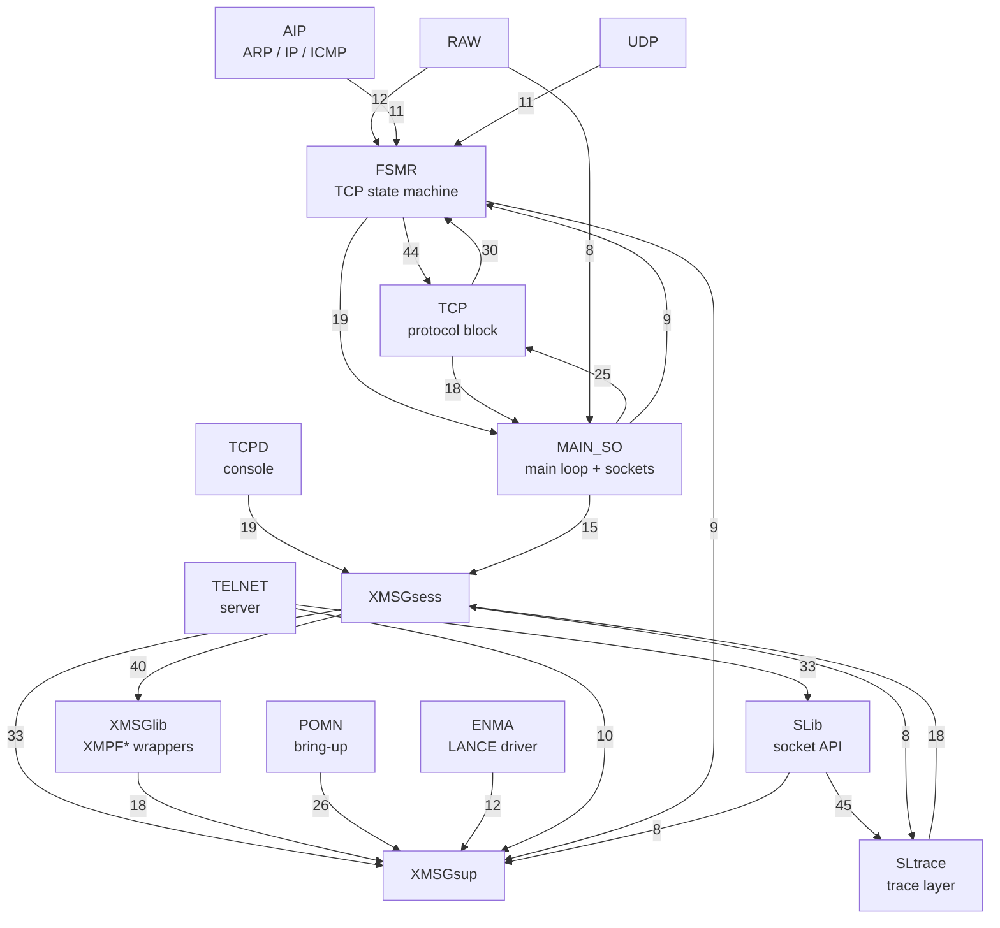
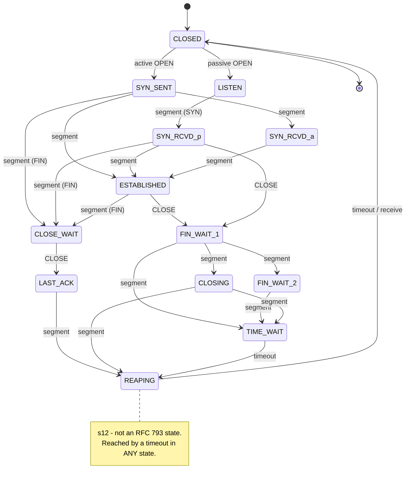
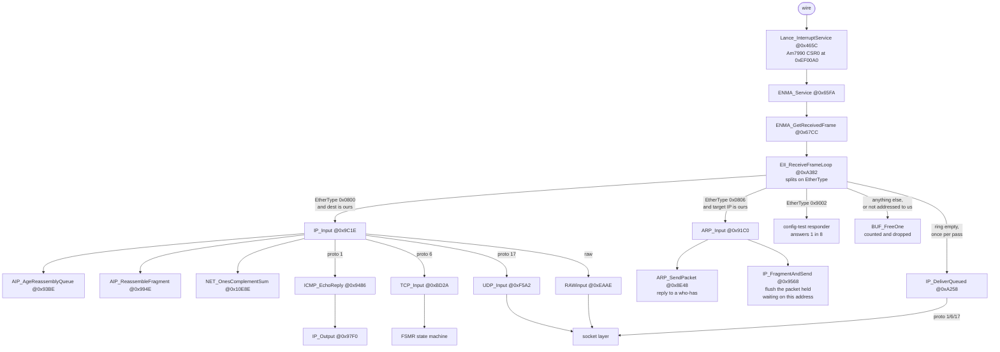
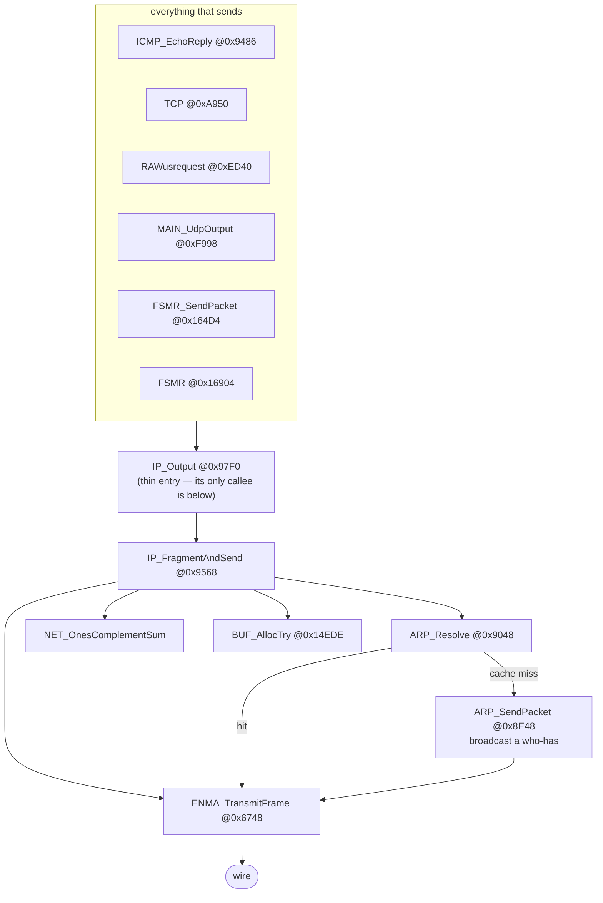
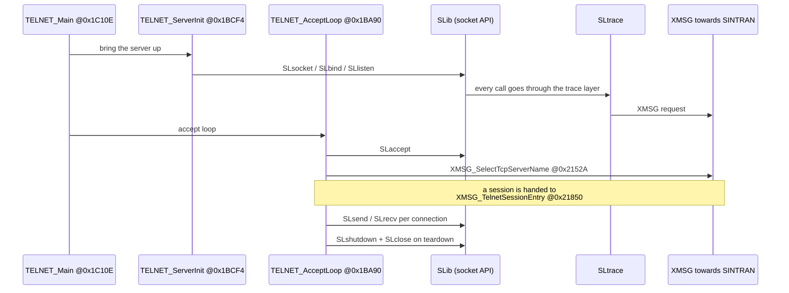

# TCP-SER-B0-D02 — how the whole thing is wired together

**Image:** `TCP-SER-B0-D02.BIN`
(524288 bytes, md5 `f7a7ec0d365f27833c8494413681d5d2`, merged from the four
`TCP-SER-B*-D02.BPUN` bank files, which were not modified)

**Ghidra program:** `TCP-SER-B0-D02.BIN`
**Written:** 2026-08-19
**Companion file (full depth-4 trees, 1227 lines):**
`TCP-SER-D02-CALL-TREE-FULL.txt`

---

## 0. How to read this document

Everything in here was measured off the bytes of the image, not taken from the
ENCOS firmware and not taken from a manual. Where something is an inference
rather than a measurement it says so in the line itself. There are three tags:

| Tag | Means |
|---|---|
| (measured) | read directly out of the image or the Ghidra database |
| (inferred) | a reading that fits the evidence but has not been pinned down |
| (unknown) | listed so it does not get quietly forgotten |

**Method.** The call graph was not built by looking at functions one at a time.
It was built by sweeping the whole image for call instructions and then grouping
the routines by who calls them. That is what made it possible to name 545
routines in a few passes instead of a few per pass.

1. Find every routine entry by scanning for the PLANC-MC prologue
   `2F 0E 2C 56` (`move.l A6,-(SP)` / `movea.l (A6),A6`). **545 routines.**
2. Sweep every call instruction in the image: `4E B9` / `4E F9` (jsr/jmp absolute
   long), `4E BA` / `4E FA` (jsr/jmp PC-relative) and `61 xx` (bsr, both the
   8-bit and 16-bit displacement forms). Keep an edge only when the target lands
   exactly on a prologue. **1215 call edges.**
3. Group the unnamed routines by exclusive ownership — a routine called only from
   inside one subsystem belongs to that subsystem.

The PC-relative forms matter. They were missing from the first sweep. Adding
them only found 2 extra edges, so the conclusions did not move — but that was
checked, not assumed.

---

## 1. Module map

The image is **not** laid out as tidy contiguous modules; the ranges below are
where each subsystem's routines actually sit, and a few routines from one module
fall inside another module's span. Counts are of PLANC routines only.

| Module | Address span | Routines | What it is |
|---|---|---:|---|
| `PIOCOS` | 0x001A12–0x0044C4 | — | the PIOC-OS kernel + PLANC runtime. Byte-identical to ENCOS |
| `ENMA` | 0x004600–0x006A00 | 48 | Ethernet MAC driver, Am7990 LANCE, the interrupt handler |
| `POMN` | 0x006A00–0x008000 | 17 | process/port bring-up, `INITSUPERK`, fatal-error reporting |
| `TCPD` | 0x008000–0x0089C0 | 5 | the TCP console/daemon side, string+number printing |
| `AIP` | 0x0089C0–0x00A700 | 24 | ARP, IP in and out, ICMP, fragment reassembly |
| `TCP` | 0x00A700–0x00E900 | 35 | TCP protocol block, ioctl dispatch, PRU entry |
| `RAW` | 0x00E900–0x00F500 | 3 | raw sockets, buffer alloc/free |
| `UDP` | 0x00F500–0x010300 | 3 | UDP in/out and its PRU entry |
| `MAIN_SO` | 0x010300–0x014000 | 44 | the main loop and the socket layer |
| `FSMR` | 0x014000–0x019E00 | 74 | the TCP state machine, output, ack, reassembly |
| `TELNET` | 0x019E00–0x01C300 | 35 | the telnet server |
| `SLib` | 0x01C300–0x01E000 | 32 | the BSD-shaped socket API (`SLsocket`, `SLbind`, …) |
| `SLtrace` | 0x01E000–0x021400 | 62 | the socket-library trace/debug layer |
| `XMSGsess` | 0x021400–0x028100 | 93 | XMSG session handling towards SINTRAN |
| `XMSGlib` | 0x028100–0x028900 | 19 | the `XMPF*` wrappers — one per XF\* function code |
| `XMSGsup` | 0x028900–0x02B900 | 45 | XMSG support, status mapping, error reporting |
| `PLANCrt` | 0x02B900–end | 6 | `ND_IMU`, `ND_IDV`, `ND_REMV`, `PLANC_MoveBlock`, MON traps |

**545 routines, 1215 call edges, 96 with no incoming call edge at all.**

Every one of the 906 functions in the Ghidra database now carries a name — there
are zero `FUN_` left. The 906 is larger than the 545 above because it also counts
the 200-odd two-byte fault stubs, the 21 one-instruction interrupt-ignore stubs,
and the hand-written kernel routines that do not use a PLANC prologue.

---

## 2. Who depends on whom

Edge labels are the number of distinct caller→callee routine pairs crossing that
module boundary (measured). Only edges of 8 or more are drawn; the long tail is
in section 3.



Three things this picture makes obvious that a per-function walk never would:

- **`TCP` and `FSMR` call each other heavily in both directions** (30 and 44).
  They are one protocol implementation split across two address ranges, not two
  layers stacked on each other.
- **Everything eventually lands in `XMSGsup`.** Eleven different modules call
  into it. It is the bottom of the stack — the way this card talks to SINTRAN.
- **`SLib` barely talks to the protocol code at all** (6 edges to `FSMR`). It
  talks to `SLtrace` (45). The socket API is a thin shell over the trace layer,
  which is the thing that actually carries the request across to the host.

---

## 3. The dispatch tables — a correction

Six jump tables were found in the image. **Only one of them is a table of
routines.** The other five point at labels *inside a single routine* — they are
computed branches into the arms of one big function, so they add no call-graph
edges at all. An earlier note of mine treated them as call tables; that was
wrong, and the sweep returning zero targets for them is the correct answer, not
a bug in the sweep.

| Table | Address | Slots | Targets are… |
|---|---|---:|---|
| `tcp_action_matrix` | 0x06A2D8 | 26 | **real routines** — all 26 land on a PLANC prologue, but only **25 distinct**: slots 0 and 24 are both `FSMR_NoTransition` (measured) |
| `tcp_pru_dispatch` | 0x075490 | 25 | arms inside `TCP_UsrReq` (0x0D510); targets 0x0D5EC–0x0E2BA (measured) |
| `ip_protocol_demux` | 0x03701C | 18 | arms inside `IP_Input` (0x09C1E); targets 0x0A106–0x0A23C (measured) |
| `icmp_type_table` | 0x036FDA | 16 | arms inside `IP_Input`; targets 0x0A168–0x0A22A (measured) |
| `socket_request_table` | 0x075ED4 | 25 | arms inside the routine at 0x013478 (measured) |
| `ip_demux_2` | 0x037066 | 40 | arms inside `IP_DeliverQueued` (0x0A258); targets 0x0A2BE-0x0A364 (measured) |

So **`TCP_UsrReq` does dispatch on the request code** — through this table, into
its own arms. The absence of a `cmpi.w` chain proved nothing.

And the IP protocol demux is real: 18 slots indexed by IP protocol number, of
which exactly three differ from the default "unknown protocol" arm at 0x0A23C:

| Slot | Protocol | Arm |
|---:|---|---|
| 1 | ICMP | 0x0A132 |
| 6 | TCP | 0x0A106 |
| 17 | UDP | 0x0A11C |
| all others | — | 0x0A23C (drop) |

---

## 3a. The protocol switch — how the "uncalled" routines are reached

96 routines have no incoming call edge. **31 of them are explained by a table
entry** (measured — every root address was searched for as a 32-bit constant
anywhere in the image):

- 26 are the TCP action routines, reached only through `tcp_action_matrix`.
- `RAWusrequest`, `UDP_UsrReq` and `TCP_UsrReq` are reached only through a
  `struct protosw` array — three entries of 44 (0x2C) bytes at 0x07536A.

Field offsets measured by lining the three entries up against each other:

| base | family +0x00 | protocol +0x04 | pr_input +0x08 | pr_output +0x0C | pr_usrreq +0x18 |
|---|---|---|---|---|---|
| 0x07536A raw | 2 | 0x0040 | `RAWinput` | — | `RAWusrequest` |
| 0x075396 UDP | 2 | 17 | `UDP_Input` | `MAIN_UdpOutput` | `UDP_UsrReq` |
| 0x0753C2 TCP | 2 | 6 | `TCP_Input` | — | `TCP_UsrReq` |

Family 2 is AF_INET in all three. **TCP having no `pr_output` is correct, not a
gap** — 4.2/4.3BSD leaves it zero too, because TCP transmission is driven by the
state machine (`FSMR_TcpOutput`) and never called through the switch.

The protocol numbers 6 and 17 here match the live slots in *both* IP demux
tables. Two independent structures agreeing on which protocols exist is a real
cross-check, not a restatement.

The remaining **65 have no reference of any kind** — not a call, not a table, not
a vector. Some are genuine process entry points planted at runtime in a PIOC-OS
object descriptor (`TELNET_Main` @0x1C10E is one). The rest look like library
code linked in whole and never used (inferred — not each one checked).

**The lesson worth keeping: a routine with no xrefs is not dead code. Look for
its address in a table first.**

---

## 3b. The self-naming strings, and a name table nothing uses

This image has no vendor symbol table, so routines were named partly from
`"MODULE.Routine"` strings the code loads into its own frame. Four were
re-confirmed this pass (measured — in each case the `lea` site sits inside the
routine the string names):

| String | at | loaded from | routine |
|---|---|---|---|
| `MAIN.MainLoop` | 0x0753F2 | 0x01049A | `MAIN_MainLoop` 0x103E6 |
| `MAIN.UdpOutput` | 0x0753FF | 0x00F9B4 | `MAIN_UdpOutput` 0x0F998 |
| `FSMR.TcpExtractOob` | 0x075F84 | 0x018814 | `FSMR_TcpExtractOob` 0x1874A |
| `FSMR.SendPacket` | 0x075F96 | 0x01655C | `FSMR_SendPacket` 0x164D4 |
| `FSMR.TcpTemplate` | 0x075F74 | **nothing** | **cannot be mapped** |

`FSMR.TcpTemplate` sits between two strings that *are* used, but no code
anywhere loads it. Not resolvable from this image — the routine was presumably
inlined or dropped. Closed, not pending.

### A 27-name table for a layer that is not here

At 0x075FE4 there are 27 PLANC array descriptors (12 bytes each,
`{origo, lower, upper}`, lower always 0 so length = upper+1) pointing at strings
from 0x076128:

```
 0 SLinit        7 SLsocket       14 MtRqCnct        21 FindFreeMailbox
 1 SLbind        8 SLfork         15 MtRqDcnct       22 "NetFlush negative"
 2 SLaccept      9 SLioctl        16 MtRead          23 "MtRead plus"
 3 MtResMb      10 SLsense        17 MtWrite         24 mtRespCnct
 4 MainTask     11 SLrecv         18 MtSensI         25 ConnectToSintran
 5 Initialize   12 SLsend         19 MtSensO         26 ConMTAD
 6 SLlisten     13 MtrelMb        20 TNexit
```

**No code in this image references any of it** (measured). That zero was
calibrated before being believed: the same scan, on the same run, correctly
found the four self-name loads above and the three protosw bases. A PC-relative
`lea` cannot reach either — the nearest code is 0x49FE4 bytes away, far outside
±32 KB.

There is also no `SLinit`, no `SLfork` and no `Mt*` routine anywhere in the
image, and this list does not match the socket API that *is* here.

So (inferred, two readings, neither proven): either it is the trace-name table
of a companion module linked into the product but absent from this bank set, or
it is a build artefact.

**Why it is worth keeping.** The names describe the intended SINTRAN path —
`ConnectToSintran`, `ConMTAD`, `MtRqCnct`/`MtRqDcnct` (request connect and
disconnect), `MtRead`, `MtWrite`, `MtSensI`/`MtSensO`, `MtResMb`/`MtrelMb`
(reserve and release mailbox), `FindFreeMailbox`, `TNexit`. That is a
mailbox-based terminal interface, and `MTAD` reads as MT + TAD.

This **supports but does not prove** that the telnet payload towards SINTRAN is
TAD. It is a list of names in unreferenced data, not a decoded wire frame. It
does not close the open question in section 11.

---

## 3c. The TCP transition matrix, fully decoded

14 states x 10 events, one **longword** per cell, at 0x06A0A8. The layout is not
inferred — it is read straight out of `FSMR_StateMachineStep` @0x0B216:

```
0xB24C  move.w (0xBC,A2),D1     ; state, from TCB+0xBC
0xB256  asl.l  #1,D1            ; state*2
0xB25A  asl.l  #2,D2  (D2=D1)   ; state*8
0xB25C  add.l  D2,D1            ; state*10        <-- 10 events per row
0xB25E  add.l  (0x14,A6),D1     ; + event
0xB262  asl.l  #2,D1            ; *4, longwords
0xB264  lea    (0x6A0A8).l,A3
0xB26A  move.l (0,A3,D1*1),D3   ; action = matrix[state*10 + event]
```

**A zero cell is an illegal transition, not a no-op.** The fall-through packs
`state<<16 | event` and reports it via `NET_PostStatus` with code 0x4EE1.

|      | e0 | e1 | e2 | e3 | e4 | e5 | e6 | e7 | e8 | e9 |
|---|---|---|---|---|---|---|---|---|---|---|
| **s0**  CLOSED?      | 0 | 1 | 0 | 4 | 6 | 24 | 0 | 0 | 21 | 24 |
| **s1**  LISTEN       | 0 | 1 | 2 | 0 | 6 | 9 | 24 | 24 | 21 | 23 |
| **s2**  SYN_SENT     | 0 | 0 | 5 | 0 | 6 | 9 | 24 | 24 | 21 | 23 |
| **s3**  SYN_RECEIVED | 0 | 0 | 3 | 0 | 14 | 9 | 24 | 24 | 21 | 23 |
| **s4**  SYN_RECEIVED | 0 | 0 | 3 | 0 | 14 | 9 | 24 | 24 | 21 | 23 |
| **s5**  ESTABLISHED  | 0 | 0 | 7 | 0 | 14 | 9 | 20 | 19 | 22 | 23 |
| **s6**  FIN_WAIT_1   | 0 | 0 | 15 | 0 | 24 | 9 | 20 | 25 | 22 | 23 |
| **s7**  FIN_WAIT_2   | 0 | 0 | 16 | 0 | 24 | 9 | 20 | 24 | 22 | 23 |
| **s8**  TIME_WAIT   | 0 | 0 | 18 | 0 | 24 | 9 | 20 | 25 | 22 | 23 |
| **s9**  CLOSE_WAIT   | 0 | 0 | 17 | 0 | **8** | 9 | 20 | 19 | 22 | 23 |
| **s10** CLOSING      | 0 | 0 | 10 | 0 | 25 | 9 | 20 | 25 | 22 | 23 |
| **s11** LAST_ACK     | 0 | 0 | 11 | 0 | 25 | 9 | 20 | 25 | 22 | 23 |
| **s12** terminal*   | 0 | 0 | 13 | 0 | 25 | 9 | **12** | 25 | 22 | 23 |
| **s13** CLOSED?      | 0 | 1 | 0 | 4 | 6 | 24 | 0 | 25 | 21 | 24 |

**The anchor.** Action 8 (`CloseWaitToLastAck`) appears in exactly one cell of
the whole matrix — s9/e4. CLOSE_WAIT + close → LAST_ACK is the one transition
RFC 793 pins unambiguously, so that single occurrence fixes the row and column
origin. Every other label above hangs off an alignment that anchor proves.

### Events — each confirmed by finding a caller that passes it

The event is the leading argument, staged as `move.l #N,(d16,A6)` immediately
before the call. All 14 call sites were swept (measured):

| Event | Meaning | Passed by |
|---|---|---|
| e1 | passive OPEN (listen) | `TCP_UsrReq` @0x0DD18 |
| e2 | SEGMENT ARRIVES | `FSMR_ReceiveData` @0x180BA |
| e3 | active OPEN (connect) | `TCP_UsrReq` @0x0DEC0 |
| e4 | CLOSE | `TCP_UsrReqClose` @0x0C55A |
| e5 | TIMEOUT | `TIMER_SlowTick` @0x16C4A |
| e6 | RECEIVE | `TCP_UsrReq` @0x0D608 |
| e7 | SEND | `TCP_UsrReq` @0x0D7F4 and 0x0E7FC, plus SO and SL |
| e8 | ABORT | `TCP_UsrReq` @0x0DB40, 0x0DBB2, 0x0DC10, 0x0E292 |
| e0 | never used | nothing — column is all zero |
| **e9** | **nothing raises it** | **no caller anywhere in the image** |

This settles two long-standing open items:

- **Nothing raises event 9.** Its column is fully populated (action 23,
  `Event9ToClosed`, in every open state), so the table supports it — but no code
  in this image passes it. The sweep recovered 8 of the 9 live events correctly,
  so that zero is calibrated. Same shape as the unreferenced name table in §3b:
  a capability whose driver is not in this bank set.

### Correction — the state identities, settled by entry edges

An earlier version of this section claimed **s12 = TIME_WAIT**, on the grounds
that it is the only row whose RECEIVE cell uses action 12,
`FSMR_Act12_TimeWaitReceive`. **That was circular**: I had assigned that action
its name myself, then used the name as evidence for the state it serves. The
name was the guess, not the evidence.

The real evidence is which transitions *enter* each state. Every action writes
the new state as a word into its own frame at `(0x18,A6)`; the caller copies it
to TCB+0xBC. Sweeping every `move.w #imm,(0x18,A6)` in the action region gives
action → new state, and combining that with the matrix gives the whole graph:

| State | Entered from | Identity |
|---|---|---|
| s1 | s0, s13 / OPEN-listen | LISTEN |
| s2 | s0, s13 / OPEN-connect | SYN_SENT |
| s3 | s2 / SEGMENT | SYN_RECEIVED (simultaneous open) |
| s4 | direct `move.w #4,(0xBC,A0)` in Act02 @0x190C2 | SYN_RECEIVED (from LISTEN) |
| s5 | s2, s3, s4 / SEGMENT | ESTABLISHED |
| s6 | s3, s4, s5 / CLOSE | FIN_WAIT_1 |
| s7 | s6 / SEGMENT | FIN_WAIT_2 |
| **s8** | **s6, s7, s10 / SEGMENT** | **TIME_WAIT** |
| s9 | s2, s3, s4, s5 / SEGMENT | CLOSE_WAIT |
| s10 | s6 / SEGMENT | CLOSING |
| s11 | s9 / CLOSE | LAST_ACK |
| s12 | TIMEOUT from *every* state, plus s10, s11 / SEGMENT | terminal, not an RFC state |
| s13 | ABORT / CLOSE / ev9 from everywhere | CLOSED |

**`s8` is TIME_WAIT.** RFC 793 has exactly one state reachable from all three of
FIN_WAIT_1, FIN_WAIT_2 and CLOSING, and that is TIME_WAIT. Three incoming edges
from those three states fit nothing else.

**`s12` is not an RFC state.** It is entered by a TIMEOUT in every single state
and by the completing segment in CLOSING and LAST_ACK; inside it only RECEIVE
and TIMEOUT do anything, and both either stay put or fall to s13. That reads as
"finished, waiting for the socket layer to reap it" — one of the three states
this implementation has beyond RFC 793's eleven. *Not proven*; the entry and
exit edges are what is measured.

**s3 and s4 are both SYN_RECEIVED and the split is real:** s4 is entered by a
direct `move.w #4,(0xBC,A0)` inside Act02 (LISTEN + segment — the passive open),
while s3 arrives through the out-slot from Act05 (SYN_SENT + segment — the
simultaneous open). Two slots because two arrival paths.



*`s12` in the matrix above is the `REAPING` node in this diagram — the name is
descriptive, not recovered from the firmware.

Note also that **e4 = CLOSE and e7 = SEND**, which matches the correction made
earlier from the PRU dispatch evidence — two independent routes to the same
answer.

---

## 3d. The two ioctl bitmaps — a trace-control interface

`SO_IoctlDispatch` @0x0C580 dispatches on `(0x8,A0)`. **Case 0 is trace control**,
and that is what the two bitmaps are (measured).

It reads a 32-bit value from the argument buffer (as two words at buffer+0x2C
and +0x2E), records its sign, then takes the absolute value:

| Value range | Bitmap |
|---|---|
| `value & 0xFFC0 == 0x4980` | `g_enmaTraceEnableBits_64` @0x02C954 |
| `value & 0xFFC0 == 0x4E80` | `g_aipTraceEnableBits_64` @0x036F7E |

```
bit index  = value & 0x3F                 64 categories per map
byte       = base[(value & 0x3F) >> 3]
bit number = 7 - (value & 7)              <-- from `not.b` before bclr/bset
bclr always, then bset if the value was positive
```

So the **sign is the verb and the magnitude is the noun**: a positive value
enables a trace category, a negative one disables it. Both maps are all zero in
the image — everything is off until the host turns it on.

**The MSB-first bit numbering matters.** `not.b D0` followed by `bclr.b D0,(A3)`
selects bit `7-(n mod 8)`, because the 68000 takes the bit number mod 8. An
implementation using LSB-first addresses the wrong category and looks almost
right.

What proves these are trace gates rather than configuration is who *reads* them:

| Bitmap | Read by |
|---|---|
| `g_enmaTraceEnableBits_64` | `ENMA_TraceIfEnabled` @0x064B8 (`btst` at 0x06538), `ENMA_Service` @0x066D2 |
| `g_aipTraceEnableBits_64` | `AIP_TraceIfEnabled` @0x08958 (`btst` at 0x0897A), `AIP_Initialise` @0x08A6A |

`AIP_TraceIfEnabled` is the shape to recognise: mask the category with 0x3F,
`asr.l #3` for the byte, `not.b` for the bit, `btst`; if clear, return and emit
nothing; if set, copy a 20-byte record and call the XMSUP emitter at 0x028D54.
The AIP trace strings sit immediately after that bitmap from 0x036F86 —
`"$AIP: PIOC ERROR"`, `"$AIP: no more fragments for ARP"`.

That last string is worth noting: it is the one that originally produced the
wrong name `AIP_ArpOutOfFragments` for 0x08E48. It is the out-of-buffer failure
message inside what is really `ARP_SendPacket` — a string tells you what a
routine prints on a bad day, not what it is for.

Status words in this routine: 0x4EC3 (ok/ignored), 0x4ED1 (bad argument).

---

## 3e. The server name is built by patching the literal

`XMSG_SelectTcpServerName` @0x02152A answers the "`*TCP0` vs `*TCPGATE.` vs
`*TCP`" question, and the answer is that they are **not three separate names**.

There is one 18-byte literal at 0x07BDD8:

```
0x7BDD8  *  T  C  P  0  *  T  C  P  G  A  T  E  .  *  T  C  P
         ^-- 0x7BDD8       ^-- 0x7BDDD
                     ^-- 0x7BDDC is overwritten at run time
```

**The code writes into it** (measured). Byte 0x07BDDC — the `0` of `*TCP0` — is
patched with the interface number as an ASCII character:

```
0x21536  tst.l (0x14,A6)                    ; interface number, parameter 1
0x2153C  moveq #15,D0 ; cmp ; bge -> error  ; range is 0..15
0x21544  move.l #0x4F0A,D0 ; return         ; out-of-range status
0x21552  moveq #9,D0  ; cmp ; blt           ; 0..9 or 10..15 ?
0x2155E  add.l #0x30,D1                     ; '0'+n
0x21564  move.b D1,(0x7BDDC).l              <<< self-modifying
0x21570  sub.l #0x0A,D1 ; add.l #0x41,D1    ; 'A'+(n-10)
0x2157C  move.b D1,(0x7BDDC).l              <<< same byte
0x2158A  move.l #3,(0x2E,A6)                ; upper 3 -> length 4
0x21594  move.l #4,(0x2E,A6)                ; upper 4 -> length 5
```

The length becomes the upper bound of a PLANC descriptor built over base
0x07BDD8, so:

| Interface | Name | How |
|---|---|---|
| 0 | `*TCP` | length 4 — stops before the patched byte |
| 1–9 | `*TCP1` … `*TCP9` | patched byte, length 5 |
| 10–15 | `*TCPA` … `*TCPF` | patched byte, length 5 |

Same convention as `ENNS0`/`ENNS<thumbwheel>` for the network server — the digit
in the name *is* the binding to the card. The name space allows 16 even though
the ND-100 drives at most four Ethernet II controllers.

**The third form is not `*TCPGATE.`** At 0x0217E0 the descriptor uses base
0x07BDDD with upper = 0x0C, i.e. **length 13 = `*TCPGATE.*TCP`**, and it is taken
only when the interface number is zero. Reading the literal by eye and stopping
at the `.` gives the wrong name — take the length from the descriptor, never from
where a name looks like it ends.

**This matters for an emulator or HLE: 0x07BDD8 is not read-only constant data.**
Treating that page as immutable, or caching the string, breaks every interface
except number 0 — and breaks it *silently*, because interface 0 is the one case
where the patched byte is never read.

`*TCPDSERVER` at 0x02D771 is a separate name used by `TCPD_ClientSession`
@0x08092, unrelated to this scheme.

## 4. The receive path



Measured detail worth keeping:

- `EII_ReceiveFrameLoop` has **exactly three EtherType arms** — 0x0800 (IP),
  0x0806 (ARP) and 0x9002 (Ethernet configuration test), compared at 0xA3B6,
  0xA442 and 0xA4AC. Anything else is freed. *(An earlier draft of this document
  said it had "exactly two callees, ARP_Input and IP_Input". That was wrong —
  it was read off the tree printout rather than off the dispatch.)*
- **There is no forwarding path.** The IP arm accepts a packet only if the
  destination at IP header+0x10 equals `g_myIpAddress`, or its low byte is 0x00
  or 0xFF (broadcast). Anything else is counted into `g_rxStatsBlock` and freed.
  This card is a host, not a router.
- The ARP arm calls `ARP_Input` only when the ARP target protocol address at
  ARP+0x18 is ours. Reaching `ARP_Input` **only** from the 0x0806 arm is the
  second, independent proof of that name.
- The 0x9002 arm answers roughly **one in eight**: `moveq #7,D2 / move.w
  (g_configTestReplyCounter),D3 / and.w D2w,D3w / bne skip`. The reply carries
  our MAC, the broadcast MAC, our IP, and a 19-byte banner `"ND/EII-TCP-"`.
- `IP_DeliverQueued` is called from **one** place — the branch taken when
  `ENMA_GetReceivedFrame` returns no frame, i.e. once per pass after the ring
  drains. It pops one datagram off `g_ipInputQueueHead`, stashes the source
  address from IP header+12 into a global, and demuxes on header+9.
- `AIP_AgeReassemblyQueue` is called **from `IP_Input`**, not from a timer
  interrupt. Fragment reassembly ages off the receive path — no packets arriving
  means no ageing (measured).
- The ICMP echo reply goes back out through the ordinary `IP_Output`, not
  through a shortcut (measured).

---

## 5. The transmit path



`IP_Output` at 0x97F0 has six callers and exactly one callee. The real work is
`IP_FragmentAndSend` at 0x9568, and its identity is not in doubt (measured):

```
0x95C0  move.w  (g_interfaceMtu).l,D1     ; the MTU
0x95C6  sub.w   #0x14,D1                  ; minus the 20-byte IP header
0x95D0  andi.l  #0xFFF8,(0x1E,A6)         ; round DOWN to a multiple of 8
                                          ;   -> RFC 791 fragment-offset granularity
0x95F0  move.w  #0x4500,(A0)              ; IP version 4, IHL 5, TOS 0
0x95F8  add.l   #0x14,D1                  ; header back on for the total length
```

`ARP_Resolve` at 0x9048 is the classic `arpresolve` (measured):

1. if `dest & 0xFF` is 0 or 0xFF → broadcast; copy the 6 bytes at
   `g_broadcastMacAddress` and return "resolved".
2. else, if a gateway is set, compare `myIp & mask` against `destIp & mask`;
   different subnet → send it to `g_defaultGatewayIp` instead.
3. walk the cache list at `g_arpCacheListHead`, matching entry+4 against the
   target, with a **move-to-front on a hit**.

---

## 6. Networking globals recovered this pass

All read out of `ARP_Input`, `ARP_Resolve` and `IP_FragmentAndSend` (measured).

| Address | Name | Size | Evidence |
|---|---|---|---|
| 0x02C82C | `g_myMacAddress` | 6 | `ARP_Input` compares it against the ARP sender HA at packet+8 |
| 0x036B7A | `g_myIpAddress` | 4 | compared against the ARP target IP at packet+0x18 |
| 0x036B7E | `g_defaultGatewayIp` | 4 | substituted when the destination is off-subnet |
| 0x036B84 | `g_interfaceMtu` | 2 | minus 20, rounded to /8, is the max fragment payload |
| 0x036B90 | `g_ipPacketsSentCount` | 2 | `addq.w #1` at the head of `IP_FragmentAndSend` |
| 0x036B96 | `g_subnetMask` | 4 | ANDed with both addresses in the off-subnet test |
| 0x036BB0 | `g_broadcastMacAddress` | 6 | copied out on a broadcast destination |
| 0x036F7A | `g_arpCacheListHead` | 4 | head of the ARP list, walked by both ARP routines |
| 0x02C852 | `g_lanceIsrDisabled` | 2 | tested first in the LANCE ISR; non-zero bails out |
| 0x02C85A | `g_lanceStatsBlock` | — | +0x18 counts MISS (long), +0x34 counts CERR (word) |
| 0x02C946 | `g_lanceLatchedErrorBits` | 2 | BABL/MERR are OR-ed in before the chip is stopped |
| 0x00EF00A0 | `LANCE_RDP` | 2 | the Am7990 register data port |
| 0x036B92 | `g_configTestReplyCounter` | 2 | low 3 bits gate the 0x9002 reply — 1 in 8 |
| 0x036B9A | `g_ipInputSourceAddress` | 4 | source IP stashed for the protocol handler |
| 0x036BA2 | `g_ipInputQueueHead` | 4 | head of the pending IP input queue |
| 0x037064 | `g_ipProtocolDemuxMax` | 1 | bound checked before indexing the 40-slot table |
| 0x03716A | `g_tagRecvIp` / `g_tagRecvArp` / `g_tagRecvConfigTest` | 3 each | the trace tags `"RI "`, `"RA "`, `"RN "` |
| 0x037173 | `g_stationBannerString` | 19 | `"ND/EII-TCP-"`, sent in the 0x9002 reply |
| 0x0752CC | `g_rxStatsBlock` | — | +0 and +0x0C count not-for-us drops, +0x84 counts ARP and config-test |

`g_myIpAddress`, `g_subnetMask` and `g_broadcastMacAddress` already carried those
names from an earlier pass. Arriving at the same three addresses from a
completely different routine is independent confirmation, not a coincidence.

---

## 7. The telnet session



The socket API is the full BSD set, all named and all measured:

`SLsocket` 0x1D170 · `SLbind` 0x1D328 · `SLlisten` 0x1D3DC · `SLaccept` 0x1D4CE ·
`SLsend` 0x1D718 · `SLrecv` 0x1D8C6 · `SLsense` 0x1DA54 · `SLshutdown` 0x1DB90 ·
`SLclose` 0x1DCB8 · `SLioctl` 0x1DE08 · `SLsleep` 0x1D062

**A warning that already cost time once:** reachability in this call graph is
**not** a runtime path. A breadth-first search from the telnet data path to XMSG
appears to arrive via `SLsend`, but it only gets there through four `SLtrace`
hops. `SLsend`'s only non-trace callee is 0x014370, in the TCP module. Do not
read a path off the graph and call it the data path.

---

## 8. Call trees

Abridged. `NAME` is a routine that has been identified; `MODULE:ADDR` is one that
has only been placed in a module. `...` means the subtree was already printed
above. Routines with 12 or more callers are collapsed out so the shape stays
readable — they are listed at the top of the companion file.

### 8.1 From the main loop

```
MAIN_MainLoop @0x103E6
+- ENMA_Service
|  +- ENMA:04E0E
|  +- ENMA:055F6
|  |  `- ENMA:04BD0
|  +- ENMA:05666
|  |  +- ENMA_ReportError
|  |  +- ENMA:04C98
|  |  `- ENMA:0561E
|  +- ENMA:057FA
|  +- ENMA:06824
|  `- XMSGsup:28D54
+- EII_ReceiveFrameLoop
|  +- ENMA_TransmitFrame
|  +- ENMA_GetReceivedFrame
|  +- ARP_Input
|  `- IP_Input
`- TIMER_SlowTick
```

### 8.2 The receive path in full

```
EII_ReceiveFrameLoop @0xA382
+- ENMA_TransmitFrame
+- ENMA_GetReceivedFrame
+- ARP_Input
|  +- TCPD:08958
|  +- AIP:08A34
|  +- ARP_SendPacket
|  |  +- ENMA_TransmitFrame
|  |  `- BUF_AllocTry
|  +- AIP:08FA6
|  `- IP_FragmentAndSend
|     +- ENMA_TransmitFrame
|     +- ARP_Resolve
|     +- NET_OnesComplementSum
|     `- BUF_AllocTry
+- IP_Input
|  +- AIP_AgeReassemblyQueue
|  +- ICMP_EchoReply
|  |  +- IP_Output
|  |  `- NET_OnesComplementSum
|  +- AIP_ReassembleFragment
|  +- TCP_Input
|  |  +- NET_ChecksumBuffer
|  |  +- TCP:0B42A
|  |  |  +- SO:12000 -> SO_NotifyHost -> SO_SendToHost
|  |  |  +- SO_Detach -> SO_FreePcb / SO_DetachCleanup
|  |  |  `- FSMR:184E6 -> FSMR_SendPacket
|  |  +- TCP:0BB90 -> TCP:0A950 -> IP_Output
|  |  `- FSMR:16CBA
|  +- RAWinput -> BUF_AllocWait
|  `- UDP_Input
`- IP_DeliverQueued   (once, after the ring drains)
```

### 8.3 TCP output

```
FSMR_TcpOutput @0x16FEA
+- SO_NotifyHost
|  `- SO_SendToHost
|     +- SO:10F2C -> XMSGsess:26BF0
|     +- SO:1245A
|     +- XMSGsess:2625C -> XMSGsess:26F78 / 26FFC / 270A4
|     `- XMSGsess:26A22
`- FSMR_SendPacket
   +- IP_Output -> IP_FragmentAndSend -> ENMA_TransmitFrame
   +- BUF_AllocWait
   +- NET_OnesComplementSum
   `- BUF_AllocTry
```

The two branches are the whole design in miniature: **`SO_NotifyHost` goes up to
SINTRAN over XMSG, `FSMR_SendPacket` goes down to the wire.**

### 8.4 The user-request entry

```
TCP_UsrReq @0xD510          (dispatches via tcp_pru_dispatch @0x75490
+- FSMR_StateMachineStep     into its own arms at 0xD5EC-0xE2BA)
|  `- SO:12000 -> SO_NotifyHost -> SO_SendToHost
+- SO_Attach
|  +- SO_AllocPcb
|  +- SO_Reserve
|  `- FSMR:15C98
`- TIMER_SlowTick
```

---

## 9. The naming scheme

Where a routine could be identified, it got a real name. Where it could only be
placed, it got `<MODULE>_<role>_<ADDRESS>` — which says exactly how much is known
and no more. The address is in the name so a name can always be checked against
the listing.

| Role | Means |
|---|---|
| `leaf` | calls nothing |
| `util` | small, several callers, inside one module |
| `sub` | ordinary subroutine of that module |
| `tiny` | a handful of instructions |
| `get` | field accessor: `movea.l (0x14,A6),A0` then `move.w (d,A0),D0` |
| `buf` | works on buffers |
| `msg` | works on XMSG messages |
| `copy` | block move |
| `rep` | reporting/formatting |
| `math` | arithmetic helper |
| `stub` | prologue and epilogue only, no body |
| `hub` | many callers and many callees |
| `uncalled` | no incoming edge found anywhere in the image |
| `sock` | socket-structure handling |

Special cases:

- `FaultStub_vecNN` — the ~200 two-byte `trap #1` stubs the vector table points at.
- `IgnoreIrq_XXXXX` — 21 one-instruction `4E 73` (`rte`) stubs at 0x4074–0x409C.
  These do nothing but return from the interrupt. They are **not** trap stubs;
  the byte pattern was checked (measured).
- `PIOCOS_*`, `Plance*`, `ND_*` — the kernel and PLANC runtime, byte-identical to
  the ENCOS image, so the ENCOS names transfer with proof.

---

## 10. Corrections made in this pass

Recording these because each one was a plausible name that turned out to be
wrong, and the way they were wrong repeats.

| Was | Is | How it was caught |
|---|---|---|
| `AIP_ReportError` @0x91C0 | **`ARP_Input`** | compares 6 bytes at packet+8 against our MAC, the long at packet+0x18 against our IP, then walks the ARP cache — those are the ARP field offsets |
| `AIP_ReportIcmpMessage` @0x9568 | **`IP_FragmentAndSend`** | writes `#0x4500`, and rounds `MTU-20` down with `andi.l #0xFFF8` |
| `AIP_buf_09048` @0x9048 | **`ARP_Resolve`** | broadcast test, off-subnet gateway substitution, cache walk with move-to-front |
| `AIP_ArpOutOfFragments` @0x8E48 | **`ARP_SendPacket`** | called by both ARP routines, and calls `ENMA_TransmitFrame` |
| 5 tables read as call tables | branch tables **inside one routine** | their targets are not prologues; they sit inside `IP_Input` / `TCP_UsrReq` |
| 4 duplicate function names | fixed | two functions shared a name, so the address suffix lied for one of them |
| `IP_InputAlt` @0xA258 | **`IP_DeliverQueued`** | called only on the "ring is empty" branch; pops `g_ipInputQueueHead` |
| "receive loop has two callees" | **three EtherType arms** | read off the tree printout instead of the dispatch code |
| "14-entry table = one arm per state" | **indexed by TIMER NUMBER** | `TIMER_SlowTick` loops 0..0xD over the timer array at TCB+0xC0 and passes the index as parameter 2. I inferred "14 = 14 states" from the count alone |
| `FSMR_Act09_TimeoutToClosed` | **`FSMR_Act09_TimerExpiry`** | it switches on which timer fired, not on the state |
| `s12 = TIME_WAIT` | **`s8 = TIME_WAIT`** | circular: I used a name I had assigned to action 12 as evidence for the state it serves. Entry edges (s6/s7/s10 → s8) settle it |
| action table: "25 of 26 land on a prologue" | **all 26 do; 25 are distinct** | the sweep collected targets into a *set*, so slots 0 and 24 sharing `FSMR_NoTransition` collapsed and the total came out one short. Caught by the RetroCore regression test, not by re-reading |
| `FSMR_Act12_TimeWaitReceive` | **`FSMR_Act12_State12Receive`** | s12 is not TIME_WAIT, so the old name asserted the thing it was used to prove |

**The repeating failure: naming a routine after a string it references.** The
first three above all came from that. A string tells you what a routine *prints*,
not what it *is*. `IP_Output`'s only callee being called "report ICMP message" is
what gave it away — a reporting routine does not transmit frames.

The check that catches it every time is the one in this document's method: look
at **who calls it and what it calls** before believing a name.

---

## 11. Still open

| Item | State |
|---|---|
| The telnet payload towards SINTRAN — is it TAD? | (unknown) still not proven. The unreferenced name table in section 3b (`ConMTAD`, `MtRead`, `ConnectToSintran`) points that way but is not evidence of wire format — it needs a capture |
| TCP state `s12` | (inferred) a terminal "finished, waiting to be reaped" state, entered by a TIMEOUT in every state — not one of RFC 793's eleven. **`s8` is settled: TIME_WAIT.** See the correction in §3c |
| What raises state-machine event 9 | **answered: nothing in this image does.** All 14 call sites swept, calibrated — see §3c |
| What writes `g_tcpDispatchIndex` | **answered: `TCP_Input` does, at 0x0C26A.** The old note said "three references, all reads" — but that instruction has the absolute long as the DESTINATION. Renamed `g_tcpSelectedActionNumber`; it holds the action number between the matrix lookup and the call. `TCP_Input` carries its own inlined copy of the lookup with event 2 hardcoded (`addq.l #2`) |
| The two bitmaps in `SO_IoctlDispatch` | **answered: 64-bit trace-category enable maps, one for ENMA and one for AIP — see §3d** |
| `*TCP0` vs `*TCPGATE.` vs `*TCP` | **answered: one literal, patched at 0x07BDDC with the interface number. `*TCP` = interface 0, `*TCPn` = interface n, `*TCPGATE.*TCP` (length 13) = the gateway form. See §3e** |
| 65 routines with no reference of any kind | (inferred) some are runtime-planted process entry points, the rest look like unused library code. 31 of the original 96 are now explained — see section 3a |

---

## 12. Where the rest of it is written down

| File | Contents |
|---|---|
| `TCP-SER-D02-CALL-TREE-FULL.txt` | the full depth-4 trees for 15 entry points, 1227 lines |
| `TELNET-XMSG-SIN.md` | how the telnet server talks to SINTRAN over XMSG, with the corrections section |
| `TCP-SER-D02-FUNCTION-CATALOG.md` / `.csv` | every entry point, one row each |
| `the `ghidra-planc` skill` | the PLANC-MC conventions and the recurring mistakes |
| `the `nd-ethernet-ii` skill` | the card, the LANCE, the BPUN merge |
