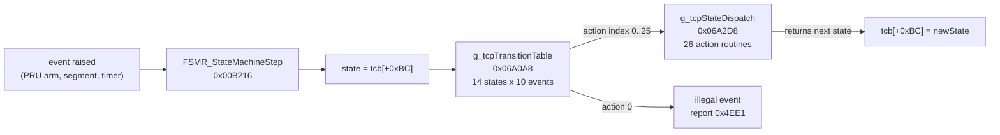
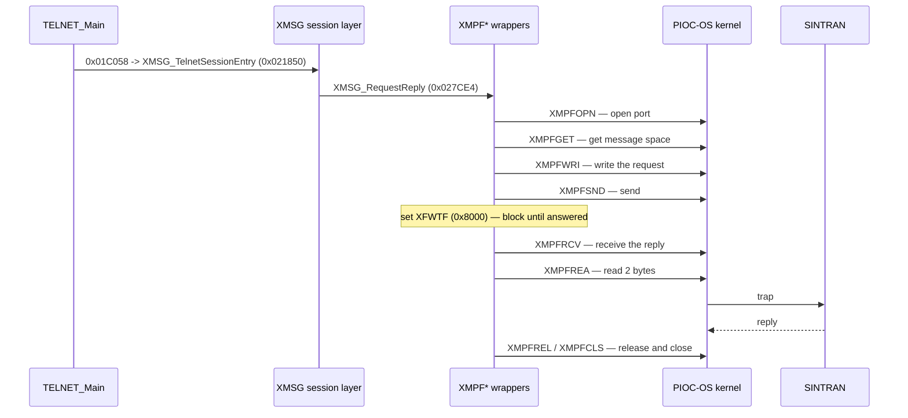

# TELNET → XMSG → SINTRAN

**How the ND TCP/IP controller firmware carries a telnet session onto an ND-100**

| | |
|---|---|
| Subject | `TCP-SER-B0-D02.BIN` — ND TCP/IP server firmware for the ND Ethernet II controller (ND-110063) |
| Built from | `TCP-SER-B0-D02.BPUN` … `TCP-SER-B3-D02.BPUN`, merged to one flat 512 KB image |
| Image | 524288 bytes, MC68000 big-endian, maps flat from address 0, md5 `f7a7ec0d365f27833c8494413681d5d2` |
| Build date in the image | January 20, 1992 · Product string ND211185 |
| Ghidra database | not in this repo — it lives on the workstation the analysis was done on. Every claim below was measured from the image and can be re-derived from it |
| Written | 2026-08-19 · **revised** after the TCP state machine was decoded |

Every claim is tagged. **[VERIFIED]** = read out of this image's bytes or an ND source file.
**[INFERRED]** = a reasonable reading, not proved. **[UNKNOWN]** = open.

> **Revision note.** The first version of this document said the per-keystroke path ran
> `TELNET_SendToSocket` → `SLsend` → … → the XMSG layer. **That was wrong** — see §7. It came
> from a shortest-path search over the call graph that routed through the SLib *trace* layer.
> Several other claims were corrected the same way as work continued; each correction is kept
> visible rather than silently edited out, because the mistakes are instructive.

---

## 1. Intro — what this card is

A single-board MC68000 with an Am7990 LANCE and **no EPROM**: the ND-100 downloads the whole
firmware into the card's 512 KB DRAM at bring-up. Two firmwares exist for the same board — the
COSMOS one (`ENCOS`, server `*XM-ENNS0`) and this one (`*TCP`).

Three findings frame everything:

**The networking code is BSD.** [VERIFIED] A PLANC-MC re-implementation of the 4.2/4.3BSD
stack — `struct protosw`, `pr_usrreq`, the `PRU_*` request set, `raw_input`/`raw_usrreq`,
`m_get`/`m_freem`, and a `tcp_output` that clamps to a congestion window.

**The kernel underneath is shared with the COSMOS firmware.** [VERIFIED] PIOC-OS at
`0x000500`–`0x004600` is byte-for-byte identical to ENCOS. A 1992 product on a 1986 kernel.

**Telnet's sockets never leave the card.** [VERIFIED, and a correction — see §7] The socket API
is served locally by the card's own TCP; the SINTRAN traffic is a separate concern.

---

## 2. The two worlds

```mermaid
graph LR
    subgraph ETH["Ethernet side"]
        C["Telnet client"]
        L["Am7990 LANCE<br/>DIX framing"]
    end

    subgraph CARD["ND Ethernet II controller — MC68000, 512 KB"]
        direction TB
        ENMA["ENMA — LANCE driver"]
        IP["AIP — ARP / IP / ICMP"]
        TCP["TCP + FSMR state machine"]
        SLIB["SLib — BSD socket API"]
        TEL["TELNET server ND211185"]
        XSESS["XMSG session layer"]
        XLIB["XMSG library — 19 XF* wrappers"]
        KERN["PIOC-OS kernel — trap #2"]
    end

    subgraph HOST["SINTRAN side"]
        SCIP["SCIP doorbell 0x00EF0080"]
        SIN["SINTRAN XMSG kernel<br/>*TCP0 / *TCPGATE. / *TCP"]
    end

    C --> L --> ENMA --> IP --> TCP --> SLIB --> TEL
    TEL -->|session setup only| XSESS --> XLIB --> KERN --> SCIP --> SIN
```

**The single door to SINTRAN is `trap #2` with `D0 = 0x19`** [VERIFIED] — 19 of the 21 such
sites in the image are the XMSG wrappers. The kernel queues the request on two lists, writes 1
to the SCIP doorbell (ND-100 interrupt level 12), and blocks.

---

## 3. Layer map

| Range | Module | Contents |
|---|---|---|
| `0x000000-0x0003FF` | **68000 vectors** | SSP `0x05C8`, reset `0x1CFE`, TRAP#0/#2 → `0x3498` |
| `0x000500-0x004600` | **PIOC-OS** | byte-identical to ENCOS |
| `0x004600-0x006A00`~ | **ENMA** | LANCE driver; event mask `0x1F` of the main loop |
| `0x006A00-0x008000`~ | **POMN** | monitor + error reporting |
| `0x008000-0x0089C0` | **TCPD client** | host-facing leg, `*TCPDSERVER` |
| `0x0089C0-0x00A700` | **AIP** | ARP / IP / ICMP; `IP_Input` @ `0x009C1E` |
| `0x00A700-0x00E900` | **TCP** | `TCP_Input`, `TCP_UsrReq`, `SO_IoctlDispatch` |
| `0x00E900-0x00F500` | **RAW** | `RAWinput`, `RAWusrequest` |
| `0x00F500-0x010300` | **UDP** | `UDP_Input`, `MAIN_UdpOutput`, `UDP_UsrReq` |
| `0x010300-0x014000` | **MAIN + socket layer** | `MAIN_MainLoop`, `SO_NotifyHost` |
| `0x014000-0x019E00` | **FSMR** | the TCP state machine |
| `0x019E00-0x01C300` | **TELNET** | ND211185 |
| `0x01C300-0x01E000` | **SLib** | the eleven `SL*` socket calls |
| `0x01E000-0x021400` | **SLib trace** | diagnostic only — *not* a runtime path |
| `0x021400-0x028100` | **XMSG session** | conversations, server names |
| `0x028100-0x028900` | **XMSG library** | the 19 `XMPF*` wrappers |
| `0x02B900-` | **PLANC runtime** | `ND_IMU`, `ND_REMV`, `ND_XRET`, `MON*` |

---

## 4. The BSD anatomy

### Protocol switch — `0x07536A` [VERIFIED]

Three `struct protosw` entries, 44 bytes each, **2-byte aligned**:

| entry | protocol | `pr_input` | `pr_output` | `pr_usrreq` |
|---|---|---|---|---|
| raw | – | `RAWinput` | – | `RAWusrequest` |
| udp | 17 | `UDP_Input` | `MAIN_UdpOutput` | `UDP_UsrReq` |
| tcp | 6 | `TCP_Input` | – | `TCP_UsrReq` |

`MAIN_MainLoop` calls `(**(code **)(*(int *)(so + 0x58) + 0x18))()` = `so->so_proto->pr_usrreq`.
TCP has no `pr_output` — transmit lives in FSMR.

> **Input demux IS table-driven** — corrected. `IP_Input` uses its own table
> `g_ipProtocolDemux_18` (`0x03701C`), live entries 1 (ICMP), 6 (TCP), 17 (UDP); the direct
> calls sit inside the arms it selects. A wider copy `g_ipProtocolDemux_40` (`0x037066`) serves
> the second input path. ICMP types then dispatch through `g_icmpTypeDispatch` (`0x036FDA`) —
> live types 0, 3, 4, 5, 8, 11, 12, 13, 15, the RFC 792 set. The protosw `pr_input` pointers are
> genuinely unused for input; that part of the original claim stands.

### The buffer (mbuf) layer [VERIFIED]

| | | |
|---|---|---|
| `BUF_AllocWait` | `0x00E908` | `m_get` with wait; rate-limited `0x4ECA` starvation report |
| `BUF_AllocTry` | `0x014EDE` | raw allocator, NIL when empty |
| `BUF_FreeChain` | `0x014EAA` | **21 callers** — `while (p) p = BUF_FreeOne(p)` = `m_freem` |
| `BUF_FreeOne` | `0x014D44` | frees one, returns next |

Buffer layout: `+0x04` data offset, `+0x20` data origin, payload at `buf + 0x20 + offset`.
**The slow timer runs from inside the buffer-wait loop**, so timers keep ticking while starved.

### Checksum, sockets, attach [VERIFIED]

- `NET_ChecksumBuffer` `0x00A908` = `~NET_OnesComplementSum(...)`. The inner sum is also called
  directly by callers folding in a pseudo-header. **Not interchangeable** — swapping them gives
  an inverted checksum that still looks plausible in a dump.
- `SL_LookupSocketId` `0x0203CC` = `getsock()`. Table `g_slSocketTable` @ `0x07BD80`: slots at
  `+0x0C`, count at `+0x18`, **1-based ids**, flags at `+0x0A` bit 0 = unusable. **Fails
  silently** — each caller invents its own error.
- `SO_Attach` `0x00C46E` / `SO_Detach` `0x016FB0`, with `SO_FreePcb` having exactly those two
  callers. `soreserve(so, 0x1000, 0x1000)` — 4 KB each way.

### Status codes — the `0x4Exx` family [VERIFIED]

`0x4EC1` bad parameter · `0x4EC3` unsupported request · `0x4ECA` waiting for buffers ·
`0x4ED0` host notify failed · `0x4ED1` buffer too small · `0x4ED9` not found ·
`0x4EDF` attach failed · `0x4EE1` illegal event for state · `0x4EE3` release failed

---

## 5. The TCP state machine — fully recovered

Three tables and one driver. [VERIFIED]

### States [VERIFIED by following each action's returned state]

| | | | |
|---|---|---|---|
| s0 CLOSED (initial) | s4 SYN_RECEIVED (2nd) | s8 TIME_WAIT | s12 closing/dead **[UNKNOWN]** |
| s1 LISTEN | s5 ESTABLISHED | s9 CLOSE_WAIT | s13 CLOSED (returned) |
| s2 SYN_SENT | s6 FIN_WAIT_1 | s10 CLOSING | |
| s3 SYN_RECEIVED | s7 FIN_WAIT_2 | s11 LAST_ACK | |

The chain: `PRU_LISTEN` → event 1 → action 1 → state 1, so **s1 = LISTEN** is proved from the
socket API inward; `PRU_CONNECT` proves s2. The decisive link is **s9 + CLOSE → s11** — user
close moving to a state awaiting one final segment is CLOSE_WAIT → LAST_ACK, a pair unique in
TCP. 11 RFC 793 states + CLOSED twice + SYN_RECEIVED twice + one dead state = 14 rows.

### Events [VERIFIED from the PRU dispatch table at `0x075490`]

| ev | raised by | ev | raised by |
|---|---|---|---|
| 1 PASSIVE OPEN | `TCP_Pru03_Listen` | 5 TIMEOUT | `TIMER_SlowTick` |
| 2 SEGMENT ARRIVES | `FSMR_ReceiveData` | 6 RECEIVE | `TCP_Pru08_Rcvd` |
| 3 ACTIVE OPEN | `TCP_Pru04_Connect` | 7 SEND | `TCP_Pru09_Send`, `SendOob` |
| 4 CLOSE | Detach + Disconnect arms | 8 ABORT | Abort, Detach, Bind arms |

Event 9 has no static raiser. **[UNKNOWN]**

### TCP transmit — `FSMR_TcpOutput` `0x016FEA` [VERIFIED]

BSD's `tcp_output`: usable window, clamp to congestion window and `3 × ssthresh`, silly-window
avoidance, incremental flag assembly, timer arming. The TCB map (~30 fields) is on that function
in the database. Flags: `0x01 FIN · 0x02 SYN · 0x08 PSH · 0x10 ACK · 0x20 URG`.

> **Return-value trap:** 0 means *both* "nothing to send" and "send failed".

---

## 6. How telnet reaches SINTRAN

Every failure path closes the port and releases the message. **The card leaks neither on error.**

**Two independent XMSG users** [VERIFIED]: the telnet session layer (via `XMSG_RequestReply`)
and the TCPD client (via `XMSG_ReceiveRequestAndReply`, an 80-byte-in / 79-byte-out pump).

---

## 7. What was got wrong, and why

Kept deliberately — the failure modes recur.

| Claim | Reality | How it was caught |
|---|---|---|
| `EII_ReportVersionBanner` | It's `SO_IoctlDispatch`, a 4 KB 13-case ioctl handler | A string names what a routine *prints*, not what it *is*. The size and two protocol-layer callers both contradicted it |
| TCB `+0xB0` = MSS | It's `SND.WND` | Guessed from one writer; the routine that *owns* the field writes it from the header's window |
| TCB `+0xC8` = state | It's timer slot 4; state is `+0xBC` | Same shape of error, found the same way |
| Matrix is 13 rows, "confirmed by bounds constants" | 14 rows; those constants **are row 13** | Read the table's own data as its terminator, then called it corroboration. `TCP_UsrReq` comparing state against `0x0D` exposed it |
| event 7 = CLOSE, event 4 = SEND | Exactly reversed | Inferred from matrix *shape*; the PRU dispatch table is direct evidence |
| `TCP_UsrReq` doesn't dispatch on the request code | It does, via a jump table | Inferred from the *absence* of comparisons |
| telnet data path reaches XMSG via `SLsend` | It never does | A BFS routed through four `SLib-TRACE` hops. **Reachability is not a runtime path** |
| "input demux is not table-driven" | It is — `g_ipProtocolDemux_18` | Two `jsr`s seen at one site, generalised to "no table". Found by scanning the *data* region for longword runs |

The recurring pattern: a plausible label applied from one observation, then treated as settled.
The fix that works is finding the routine that *owns* a field or table and reading what it does.

---

## 8. Open questions

| # | Question | Status |
|---|---|---|
| 1 | Does either XMSG user carry per-keystroke terminal data? | **[UNKNOWN]** The 80/79-byte fixed sizes look like command/status, not a character stream |
| 2 | Is any payload TAD (`[opcode][count][data]`)? | **[UNKNOWN]** Nothing decoded touches TAD opcodes |
| 3 | What is state s12? | **[CORRECTED 2026-08-19] NOT TIME_WAIT — that answer was circular.** TIME_WAIT is **s8** (entered from FIN_WAIT_1, FIN_WAIT_2 and CLOSING, which in RFC 793 fits nothing else). `s12` is entered by a TIMEOUT in *every* state and by the completing segment in CLOSING/LAST_ACK — a terminal "waiting to be reaped" state outside RFC 793. See `TCP-SER-D02-CALL-TREE.md` §3c |
| 4 | What raises event 9? | **[ANSWERED 2026-08-19] Nothing in this image does.** All 14 call sites to `FSMR_StateMachineStep` were swept and the constant each passes read; the sweep recovered 8 of the 9 live events, so the zero is calibrated. The column IS populated (action 23 everywhere), so the table supports the event but no code raises it |
| 5 | What writes `g_tcpDispatchIndex` (`0x06A0A4`)? | **[ANSWERED 2026-08-19] `TCP_Input` writes it, at 0xC26A.** The earlier claim "all reads" was wrong: `move.l (0x0,A2,D2*0x1),(0x0006a0a4).l` has the absolute long as the DESTINATION. Renamed `g_tcpSelectedActionNumber` — it holds the action number between the matrix lookup and the call |
| 6 | What do the two ioctl bitmaps (`0x02C954`, `0x036F7E`) gate? | **[ANSWERED 2026-08-19] 64-bit trace-category enable maps** — ENMA and AIP. `SO_IoctlDispatch` case 0: sign of the value enables/disables, magnitude picks the bit, MSB-first within each byte. See `TCP-SER-D02-CALL-TREE.md` §3d |
| 7 | Roles of `*TCP0` vs `*TCPGATE.` vs `*TCP` | **[ANSWERED 2026-08-19] One literal, patched in place.** Byte 0x07BDDC is overwritten with the interface number; length 4 = `*TCP` (interface 0), length 5 = `*TCPn`. The third form is `*TCPGATE.*TCP` (length 13), not `*TCPGATE.`. See §3e |

---

## 9. Where this is written down

**Ghidra** (`ND_ETH_II` → `TCP-SER-B0-D02.BIN`) — plate and function comments carrying the
evidence, so it travels with the disassembly. Start at the plate on address `0x00000000`.

Key comments: `g_tcpTransitionTable` (matrix + state identification), `FSMR_StateMachineStep`
(driver + events), `FSMR_TcpOutput` (TCB map), `TCP_UsrReq` (PRU table), `g_protosw_raw`,
`XMPFOPN` (XMSG library), `PiocOsTrap2Dispatch`, `BUF_AllocWait`, `SL_LookupSocketId`,
`SO_NotifyHost`, `XMSG_RequestReply`, `XMSG_ReceiveRequestAndReply`, `SO_IoctlDispatch`.

**Companion files**
- `TCP-SER-D02-FUNCTION-CATALOG.md` — catalog and renaming plan
- `TCP-SER-D02-FUNCTION-CATALOG.csv` — all 1003 entry points

**Skills**
- `the `ghidra-planc` skill` §8a self-naming strings, §8b porting
  kernel names with byte-identity proof
- `the `nd-ethernet-ii` skill` §8h BPUN merge, §8i D02 identity
