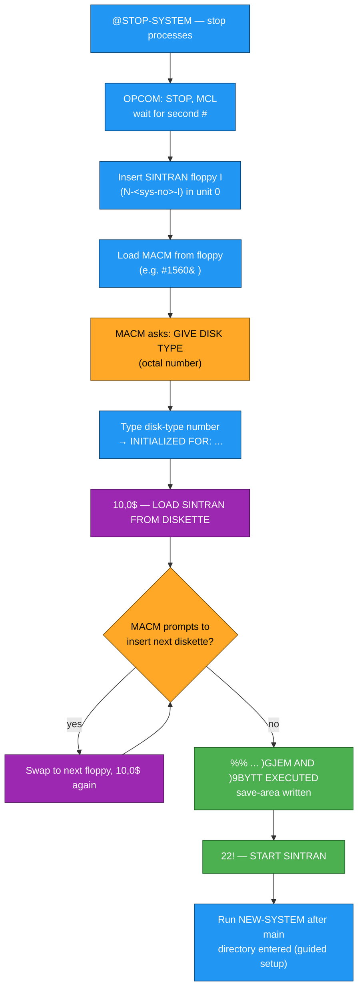

# 02 — Bootstrap: Load SINTRAN from Floppy to Disk (MACM)

> **Validation policy:** every statement below is validated against one of:
> - **[DOC]** `Operations/SINTRAN/ND-30.003.007 EN SINTRAN III System Supervisor.md` §3.4
>   "Loading SINTRAN from floppy diskettes" (and §3.2.1 save-area, §3.3 cold start).
> - **[LOG]** captured session from the SINTRAN-H archive (`Admin/install-log.txt`; emulator
>   run, with SINTRAN output distinguished from emulator artifacts).
> - **[TOOL]** `ndtool` (the NDFS disk-image tool) for inspecting images.
>
> Nothing here is assumed. Open items are listed under [TODO](#todo).

---

## 1. What this phase does

MACM is the standalone Mass-storage Assembler / loader that runs **before** SINTRAN. It loads
a fresh copy of SINTRAN from the distribution floppies onto the system disk's save-area, then
SINTRAN is cold-started from there. [DOC §3.4, §3.2.1]

This phase is required when a new SINTRAN version or a new patch file is delivered. [DOC §3.4]

---

## 2. Preconditions

| Requirement | How to obtain | Source |
|-------------|---------------|--------|
| Target disk already formatted & correctly sized | Out of scope here — see [01-DISK-DEVICES.md](01-DISK-DEVICES.md) | scope decision |
| Device name of the main directory (holds SINTRAN) | `@DIRECTORY-STATISTICS` → e.g. `DISC-70MB-1 UNIT 0 : PACK-ONE` | [DOC §3.4] |
| **CPU number (system number)** of the machine | `@LIST-TITLE`, or the confirmed ND order | [DOC §3.4] |
| Distribution floppies `N-<system-no>-I`, `-II`, … | Delivered by ND | [DOC §3.4] |

> **CPU / system number** — every ND computer has a unique CPU number assigned by ND, also
> called the *system number*. `@LIST-TITLE` prints it. [DOC §3.4]
> In the H session the started system reported `CPU (SYSTEM NUMBER): 9102`. [LOG]

---

## 3. Procedure flow



*(Colors per `MERMAID_COLOR_STANDARDS.md`: blue=step, purple=load action, amber=decision, green=success.)*

---

## 4. MACM commands (verified)

Banner reminder text, identical in [DOC §3.4] and [LOG]:

| Command | Meaning | Source |
|---------|---------|--------|
| `)REDEF` | Redefine disc type | DOC, LOG |
| `)HENT`  | Get SINTRAN from the save-area (used for later cold starts) | DOC, LOG |
| `22!`    | Start SINTRAN | DOC, LOG |
| `10,0$`  | Load SINTRAN from diskette | DOC, LOG |

> MACM build strings observed: `MACM-1718-K` [LOG, H], `MACM-1718-0` [DOC, K example].
> The K distribution floppy VSXK1 carries `MACM-1718L:BPUN` [SINTRAN-K archive, `FILE-INFO/VSXK1.txt`].

---

## 5. Disk type selection (verified)

After MACM loads it asks **GIVE DISK TYPE AS ONE OF THE FOLLOWING OCTAL NUMBERS**. Full table
transcribed from [DOC §3.4]:

| Octal | Type | Alternative |
|-------|------|-------------|
| 0 | DISC-14MB | |
| 1 | DISC-21MB | |
| 2 | DISC-23MB | |
| 3 | DISC-28MB | |
| 4 | DISC-30MB | (DISC-60MB / DISC-90MB) |
| 5 | DISC-33MB | |
| 6 | DISC-38MB | |
| 7 | DISC-45MB | |
| 10 | DISC-66MB | |
| 11 | DISC-70MB | |
| 12 | DISC-74MB | |
| 13 | DISC-75MB | |
| 14 | DISC-140MB | (DISC-2-70MB) |
| 15 | DISC-2-75MB | |
| 16 | DISC-288MB-R | (DISC-225MB-R / DISC-3-75MB / DISC-4-70MB-R) |
| 17 | DISC-288MB-F | (DISC-4-70MB-F) |
| 20 | DISC-450MB | (DISC-2-225MB / DISC-6-70MB-F) |

A wrong choice can sometimes be redefined with `)REDEF` (e.g. type 11 → 6 or 13). [DOC §3.4]

> The H system was `INITIALIZED FOR: DISC-75MB AND DISC-38MB`. [LOG]

---

## 6. What each floppy loads (verified, SINTRAN-H)

From [LOG], the H distribution used **2 SINTRAN floppies** (single-side/single-density sets
may use more — II, III, IV — repeating the same step [DOC §3.4]):

| Floppy | `10,0$` reports loading | Source |
|--------|-------------------------|--------|
| DISKETTE-I (`N-10-102-I.img`) | File-system part-1; then part-2 + spooling | LOG |
| DISKETTE-II (`N-10-102-II.img`) | RT-loader; SINTRAN-Service-Program, MAIL & NORD-NET; "PAGING-OFF" area; SINTRAN; then `)GJEM` + `)9BYTT` | LOG |
| DISKETTE-III | Symbol-lists + the `NEW-SYSTEM` program | LOG |

> [DOC §3.4, K example] places the symbol-lists on DISKETTE-II and `NEW-SYSTEM` on the same
> diskette — i.e. **floppy contents/numbering vary by version**. Always follow the on-screen
> MACM prompts, not a fixed floppy count.

---

## 7. Starting the system (verified)

- `22!` starts SINTRAN. The system then prints generation parameters, e.g. (H) [LOG]:
  - `OCTAL NO. OF PAGES THE SYSTEM WILL USE ON THE SEGMENT FILE(S): 2526`
  - `FIRST SYSTEM SEGMENT STARTS ON PAGE (OCT.): 513`
  - `NUMBER OF BACKGROUND PROCESSES (DEC.): 15`, `EACH ... NEEDS (OCT. PAGES): 105`
  - `CPU (SYSTEM NUMBER): 9102`, `SINTRAN III - VS H`, `GENERATED: ... 6 NOVEMBER 1984`
- On a brand-new disk with no directory yet, login (`ENTER sys`) reports `NO MAIN DIRECTORY`
  until file-system init is done — see [03-FILESYSTEM-INIT.md](03-FILESYSTEM-INIT.md). [LOG]

## 8. Later cold starts (verified)

> Load MACM from SINTRAN DISKETTE-I, type `)HENT` (CR), wait for line feed, type `22!`;
> **or** issue the SINTRAN command `@COLD-START`. [DOC §3.4, §3.3.1; LOG]

## 9. After loading
- Run `NEW-SYSTEM` once the main directory is entered — it guides the post-load setup. [LOG, DOC §3.4]
- For VSX standard configurations, run the **S3-Configuration** program — see
  [04-S3-CONFIGURATION.md](04-S3-CONFIGURATION.md). [DOC §3.4, §3.5]
- Run the **patch file** on the fresh copy — see [05-PATCHES.md](05-PATCHES.md). [DOC §3.4, §12.1]

---

## Inspecting images with ndtool [TOOL]

To verify a floppy/disk image's identity and contents without booting:

```
ndtool -i  <image>              # filesystem info (directory name, sizes)
ndtool -t  <image>              # list files
ndtool -t -u SYSTEM <image>     # files owned by SYSTEM
ndtool --fsck <image>           # full filesystem check
```

(Do not use `--shell` — it is interactive.)

---

## TODO (validate via DOC / NPL source / ndtool / ask)
- VSE branch of §3.4 (the manual splits VSX vs VSE; only VSX transcribed above).
- Exact `)9SBLO` / `)9BYTT` / `)GJEM` loader-directive semantics — check `ND-60.009.02 MACM`
  manual and/or NPL source (`0.SIN-GEN.NPL`).
- Confirm DISKETTE-III existence/numbering per version via `ndtool -t` on each image.
- Map disk-type octal → ndtool template (`smd75`, `winchester74`) and total block counts in
  [01-DISK-DEVICES.md](01-DISK-DEVICES.md).
