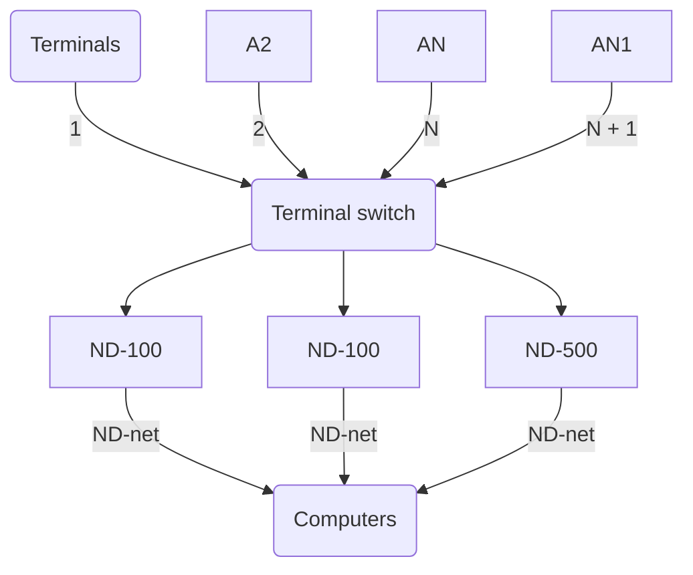

## Page 1

# ND COMPUTER SYSTEMS



# TERMINAL SWITCH - MICOM 610

## INTRODUCTION

The MICOM 610 is a device which allows many terminals to be independently switched between a large number of terminal ports (interfaces). A large number of terminals (for example, larger than the total number of input ports on the computer(s)) may thus be connected to a computer system consisting of one or more computers.

## PRODUCT DESCRIPTION

- Each terminal connected to the MICOM 610 may have direct access to one of the individual computers in the system at any one time.

This also provides a means of obtaining an even distribution of load on the different machines.

Rapid switching of terminals from a main system to existing back-up machines is an additional task for which the MICOM 610 is suitable.

- The MICOM 610 can be used to restrict access to certain computer ports by simple keyboard commands.

- The MICOM 610 maintains usage statistics, thus allowing the computer manager to monitor the usage of each port class, and reallocate ports between classes to ensure an optimum level of service to all terminal users.

610-A1-6000-0182

---

## Page 2

# Connection

Terminals are connected to the «line» interfaces, RS-232-C, of the MICOM 610. They may be directly cabled or connected by line drivers or modems, dial-up or leased lines.

The terminal operator requests a connection by depressing any key on the keyboard. The MICOM 610 responds with the prompt message «CLASS=». The terminal operator must then key the desired class number (1 through 64). If the MICOM 610 can make a connection to any port of the desired class, it will do so, transmitting «GO» to the terminal. If unsuccessful, it will transmit «BUSY», «UNAVAILABLE», «UNASSIGNED», or «UNAUTHORIZED» as appropriate.

Each CLASS may correspond to one computer in the system. In this case, the CLASS number will simply be the number of the required computer. It is also possible to assign more than one CLASS to the same computer, for example if one general CLASS was required, and in addition one or more restricted classes. It is the supervisor's task to assign such CLASSes.

# Disconnection

Terminals are disconnected either when the «port» interface sees that the computer has dropped Data Terminal Ready (i.e. when the computer considers that the terminal no longer requires its services), or on detection of a «break» character from the terminal or after a period of inactivity of supervisor determined length.

# Technical Specifications

## Port Selection

Up to 64 port classes; any terminal may select any class of port for which it is authorized.

## Access Control

Any terminal may be prevented from gaining access to certain defined port class(es).

## System Response Messages

System response messages are in 8-level ASCII code for all asynchronous terminals. Other codes subject to special quotation.

## Operator's Console

Interface provided for teletype or teletype-compatible terminal, 110 to 9600 bps, 8-level ASCII code.

## Line/Port Capacity

| Model | Capacity |
|-------|----------|
| Model 1 | Up to 60 lines/ports. |
| Model 2 | Up to 992 lines/ports. (Maximum of 248 simultaneous connections.) |

## Line/Port Speeds

The maximum line or port speed is dependent on the type of Line/Port module.

- **Type I**: Line/Port Module: Any speed to 2400 bps.
- **Type II**: Line/Port Module: 9600, 4800, or any speed to 2400 bps.

## Autobaud

Carriage Return is the sign-on character in the speed range 110 to 4800 bps. Other sign-on characters may be supported, subject to special quotation.

## Connect Sequences

Data Activity, Break, Ring Indicator.

## Disconnect Sequences

Data Terminal Ready dropped, Break, Timeout.

## Channel Interfaces

EIA RS-232-C (CCITT V.24/V.28) serial, asynchronous. Integral line driver compatible with MICOM 410 Asynchronous Line Driver in 4-wire mode.

## Physical Dimensions

Two models, one with desk-top enclosure, one floor-standing:

- **610/1**: 15 slots for Quad Line/Port Modules
  - 20 1/2" (52.1 cm) wide
  - 10 1/4" (26.0 cm) high
  - 12 1/4" (31.1 cm) deep

- **610/2**: 30 slots for Quad Line/Port Modules with expansion chassis available for maximum configuration
  - 22 1/4" (56.6 cm) wide
  - 78" (198.1 cm) high
  - 24 1/2" (62.2 cm) deep

## Operating Environment

32-100°F, 0-95% relative humidity (0-38°C).

## Power

115 vac ± 10%, 230 vac ± 10%. 50/60 Hz, 5 amps maximum.

This product is delivered and supported by the vendor.

# Vendor

**Scicon Computer Services**  
Brick Close  
Kiln Farm  
Milton Keynes  
MK11 3 EJ  
England  
Tel.: (0908) 56 56 56

```plaintext
 ┌────────────────────────────────────────────────────┐
 │                  N o r s k   D a t a               │
 │                                                    │
 │          Bergen, tel. 05-22970                     │
 │          Sandnes, tel. 053-5544                    │
 │          Trondheim, tel. 075-16520, tlx. 55580     │
 │          Tromsø, tel. 083-7756                     │
 │          Stockholm/Uplands Väsby, tel. 08-590.84100│
 │          Copenhagen, tel. 02-85.0255               │
 │          Düsseldorf, tel. 0211-606386              │
 └────────────────────────────────────────────────────┘
```

```plaintext
 ┌────────────────────────────────────────────────────┐
 │                    C O M T E C                      │
 │                                                    │
 │      Jørkveiien 20     Box 0 Lindeberg gård        │
 │      Oslo 10             Oslo 10                   │
 │      Tel.: 02-390030     Tel.: 02-390030           │
 │      Tlx.: 18661 nd n    Tlx.: 18661 nd n          │
 │                                                    │
 └────────────────────────────────────────────────────┘
```

Note: NORCE reserves the right to change specifications without notice!

---

