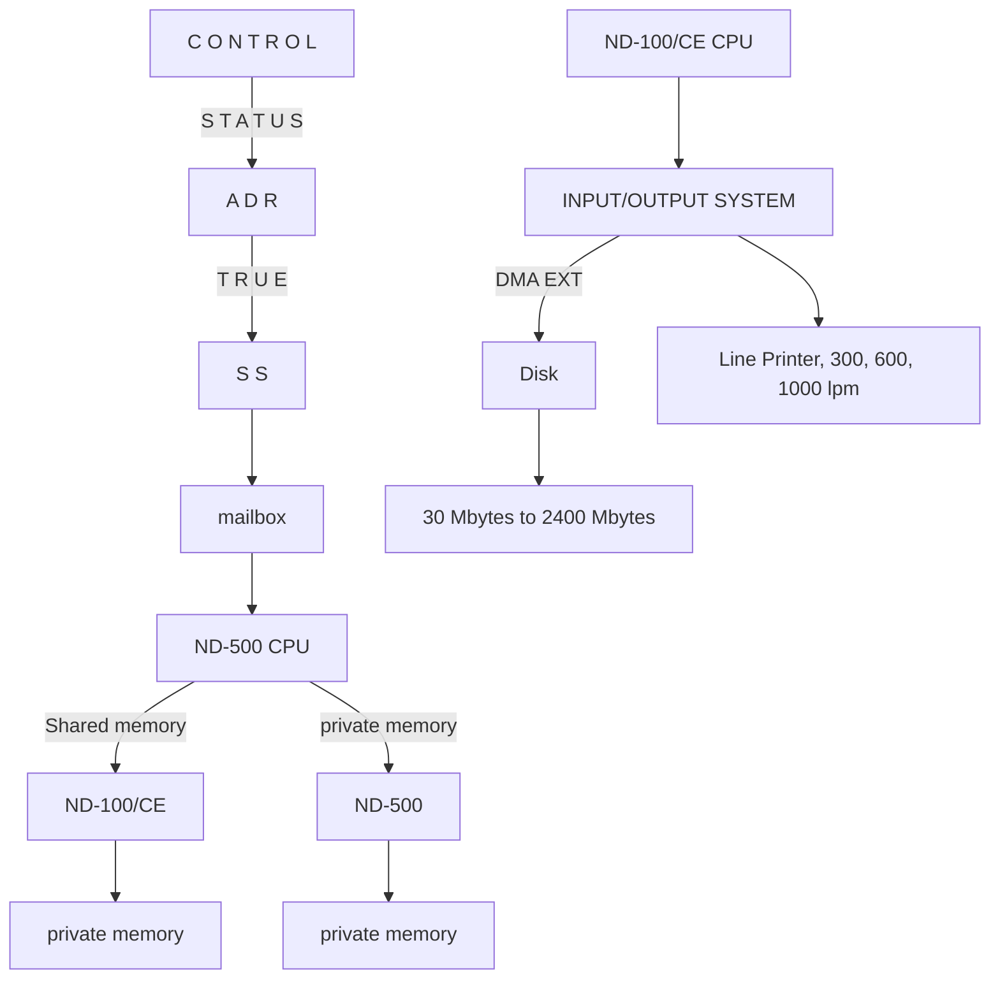

## Page 1

# ND-500 COMPUTER SYSTEMS



## ND 060 ND-500 Central Processing Unit

### INTRODUCTION

The ND-500 is the new top-of-the-line computer system offered by NORSK DATA.

The 32 bit architecture accommodates very large program sizes. The ND-500 has an advanced high-capacity CACHE memory, efficient instruction repertoire, pre-fetching of data and instructions and high-speed floating point hardware, resulting in a powerful, compact computer module that uses the latest technology available.

The dual computer system consists of an ND-500 CPU, executing large timeconsuming user programs, integrated with an ND-100/CE minicomputer which runs the multi-mode, multi-user SINTRAN III/VSE-500 Operating System, and performs all input/output handling, job scheduling and resource-allocations, leaving the ND-500 CPU free to run the user programs with a minimum of system overhead.

Up to 30 users can access the system in Real-Time, Time-Sharing and Batch mode, and share up to 32 Mbytes of fast MOS memory and 2300 Mbytes of disk storage, and a variety of other peripherals.

### FEATURES

- **High Execution Speed.**  
  The basic time of 200 ns executes the majority of the ND-500's machine instructions, providing a formidable processing power. Several ND-500 processors, with 32/64 bit floating point multiply/divide hardware, can act as a multiprocessor system supervised by an ND-100/CE.

060-C1-6000-0481

---

## Page 2

# Product Description

## Configurations

The Basic ND-500 Computer System is an integration of the ND-100/CE CPU and its associated I/O devices and interfaces, a ND-500 CPU, and a Multiport Memory System.

All memory is shared between the ND-500, the ND-100/CE and I/O devices to allow for easy access and control by all components in the system. The SINTRAN III/VSE Operating System including the ND-500 MONITOR resides in the ND-100/CE’s private memory for increased protection and simultaneous access.

The CACHE memory of the ND-500 can contain 32 Kbytes, 64 Kbytes or 128 Kbytes, evenly divided for instructions and data.

## The Multiport Memory System

The Multiport Memory System can be established with two or four-bank memory racks, using 1, 2 or 4 racks together providing space for maximum 32 Mbytes. Depending on the number of memory banks used, a 2 to 8 ways interleaved memory access increases the throughput of the memory system.

The Multiport Memory System provides several independent dataways to the memory, where the ND-500 uses two ports, the ND-100/CE uses one port and the remaining port(s) is (are) used for direct transfer of data (DMA) for disks and magnetic tapes.

The physical memory can range from 512 Kbytes of high-speed MOS memory with Error Checking and Correction (ECC), up to 32 Mbytes with the necessary memory racks installed.

### Disk Storage

Disk Storage ranges from 30 Mbytes to 288 Mbytes removable disk packs to a total of 2300 Mbytes, and a variety of peripherals, magnetic tapes and floppy diskettes can be attached.

This basic system can then be further expanded by additional ND-500 CPU's for increased computational capacity.

# The ND-500 CPU

## Registers

The ND-500 CPU has a set of special purpose and general purpose registers accessible by the programmer as well as a «scratch-pad» register file accessible by the microprogramm only.

The user accessible registers are as follows:

| Register | Description |
|----------|-------------|
| P-register (program counter) 32 bits | holds the logical address |
| L-register (link register) 32 bits | used for subroutine returns and linking |
| B-register (base register) 32 bits | used for local addressing |
| R-register (record-base register) 32 bits | also used for addressing of records (refer to section on addressing modes) |

### General Purpose Registers

The R1, R2, R3 and R4 General Purpose Registers are 32 bit registers used for index registers while addressing or as general purpose registers for data manipulations.

### Accumulators

The D1, D2, D3 and D4 Accumulators are 64 bit registers used for floating point arithmetic.

The registers are addressed by the microprogram as eight 32 bit registers A1, A2, A3, A4, E1, E2, E3, E4.

| Register | Description |
|----------|-------------|
| ST       | Status register (64 bits) |
| OTE      | Own Trap Enable register (64 bits) |
| CTE      | Child Trap Enable |
| MTE      | Mother Trap Enable |
| TEMM     | Trap Enable Modification Mask |
| TOS      | «Top-Of-Stack» register (32 bits) |
| LL       | Low Limit trap (32 bits) |
| HL       | High Limit trap (32 bits) |
| THA      | Trap Handler Address register (32 bits) |

---

## Page 3

# Control Store

This memory unit contains the microcode for execution of the machine level instructions. The control-store word is exceptionally wide and wraps the majority of instructions into one microcycle only.

The standard instruction set, as well as special routines for memory management context switching and communication with the ND-100/CE supervisor, are implemented in approximately 72 Kbytes.

# Prefetch Processor

This processor handles the pre-decoding and assembling of machine level instructions in the pipeline, as well as initiations of data fetch cycles for memory reference instructions.

The prefetch processor will always keep the instruction and data pipelines full to ensure minimum idle time for the microprocessor hence maximum execution speed.

# Arithmetic Logic Unit (ALU)

The Arithmetic Logic Unit is the heart of the microprocessor and will do specified operations on the data of specified registers.

# Floating Point Hardware

This is a set of specialized hardware controlled by the microprocessor in the ND-500. This unit will perform all floating point arithmetic as well as Integer Multiply, Shift and Divide, at hardware speeds.

This hardware contains accumulators for temporary storage of results and can be used effectively for combined operations, such as multiplication of many elements etc.

# Trap System

There is a set of conditions that can be specified in the Trap Register where the program in the ND-500 can be forced to branch to certain places in memory. These traps are conditions such as: overflow on arithmetic, underflow, page fault in memory management, trap on branch (trace), always trap (to single step and trace a program) and others. There are a total of 33 traps that can be specified for program control at run-time.

```plaintext
         To Multiport Memory
            Instructions
                  |
    +------------+   +--------+   +--------+   +--------+
    |   CACHE 1  |<--|  MMS 1 |<--|  MMS 2 |--> CACHE 2 |
    +------------+   +--------+   +--------+   +--------+
           |                |          |            |
           +----------------+----------+------------+
                                    |
                           +--------------------+
                           |  PREFETCH PROCESSOR|
                           +--------------------+
                                    |
                           +----------------------+
                           | ND-500 PROCESSOR     |
                           | CONTROL STORE        |
                           | WCS                  |
                           +----------------------+
                                    |
                +------------------+------------------+
                |                  |                  |
           +---------+        +-----------+    +-----------+
           |   TRAP  |        |  REGISTER  |    |   ALU     |
           +---------+        +-----------+    +--------+--+
                                                      |
                               +------------+   +-----------+
                               |  SHIFT MPY |   | FLOATING  |
                               +------------+   | POINT     |
                                                +-----------+
                                                +------------+
                                                |   BCD ARITH |
                                                +------------+
                                                        
                             ND-500 CPU BLOCK
```

---

## Page 4

# ND-100/CE — ND-500 Communication

All or part of the memory can be shared between the ND-500 CPU, the ND-100/CE CPU and the associated I/O devices. This allows for easy access and control by all components of the system.

The communication between the ND-100/CE and the ND-500 is set up as a mailbox and DMA transfer system. The mailbox contains 3 registers:
- **Control register**:  
  For ND-100/CE to give ND-500 a command.
- **Status register**:  
  For ND-500 to give ND-100/CE a command.
- **Address register**:  
  A pointer to where in the ND-100/CE memory chains of instruction or data will be found, or where the ND-500 can store extended status information.

The status information returned to ND-100/CE reports that a job is finished, the reason for ND-500 termination and type of possible ND-500 malfunctions.

The ND-500 microprogram initiates and controls the DMA access channel to ND-100/CE memory. The communication channel is also used extensively for diagnostic and test program information. The ND-100/CE is used as a diagnostic vehicle for the ND-500.

# Memory Management System (MMS)

There are two separate but identical Memory Management Systems in the ND-500, one for instructions and one for data.

The MMS maps the 32 bit logical byte address into a 25 bit physical byte address used when addressing main memory. The system acts as a protect mechanism for sections of memory that can be read-only, system data etc.

The 4 gigabyte address space is divided into 32 segments, with a paging substructure for dynamic allocation of physical memory. Memory protection is performed on the segment level. The Memory Management System also extends the logical address range to 2⁴⁰ bytes, by allowing each process (or user) to access a maximum of 256 domains, each of 4 gigabytes.

To convert the logical address to physical address, a multi-level table look-up procedure is used. In order to speed up this procedure, a copy of the most recently used address conversions are kept in a separate buffer memory.

The access to CACHE memory for data or instructions and the access to the address translation buffer are done simultaneously. If the CACHE does not contain the desired address conversion, the multiple table look-up procedure is performed by the ND-500 microprogram.

# CACHE

The CACHE memory consists of two identical systems, one for instructions, and one for data.

The CACHE word can be 32, 64 or 128 data bits wide and is 4 Kwords deep. In addition to the bits of the data word, certain control bits in each word are used by the CACHE system to identify the information stored.

The width of the CACHE word is equal to the width of the channel to main memory.

The CACHE is addressed by the logical address from the CPU and is byte addressable.

The maximum CACHE size is 64 Kbytes for instructions and 64 Kbytes for data, giving a total of 128 Kbytes.

# DATA FORMATS

The basic unit for addressing is one byte of 8 bits. The data formats are bit, byte, half word, word, single precision floating point and double precision floating point.

## Bit

```
7      0
```

The least significant bit in a byte may be accessed by bit instructions. Bit arrays may be accessed using post indexing or descriptor addressing.

## Byte

```
7      0
```

A byte is 8 bits and can be used as an unsigned number with the range 0 to 2⁸-1 or as a two’s complement number with the range -2⁷ to 2⁷-1.

## Half Word

```
15     0
```

A half word is 2 bytes or 16 bits and can be used as an unsigned number with the range 0 to 2¹⁶-1 or as a two’s complement number with the range -2¹⁵ to 2¹⁵-1.

## Word

```
31      0
```

A word is 32 bits or 4 bytes and can be used as an unsigned number with the range 0 to 2³²-1 or as a two’s complement number with the range -2³¹ to 2³¹-1.

## Single Precision Floating Point

A floating point number is represented by a mantissa of 22 ± 1* bits, an exponent of 9 bits with the bias 400, and a sign bit.

```
31                  22 21                0
± | Exponent | Mantissa
```

The range is 10⁻⁷⁶ to 10⁷⁶. Zero is represented as all bits zero. The accuracy is approximately 7 digits.

---

## Page 5

# Double Precision Floating Point

A double precision floating point number is represented by a mantissa of 54 + 1* bits, an exponent of 9 bits with the bias 400, and a sign bit.

```
 63 62                  54  53                           0
+---------------------------------------------------------+
|  |                Exponent               |   Mantissa   |
+---------------------------------------------------------+
```

The range is 10^-76 to 10^76. Zero is represented as all bits zero. The accuracy is approximately 16 digits.

- The extra bit in the mantissa is the most significant bit and is set to one unless all bits in the exponent are zero. The bit is used in the arithmetic and is removed in the result.

# Packed Decimal

Two BCD-digits per byte, sign in lowest half of rightmost byte, from 1 to 16 bytes (31 digit plus sign) in length.

```
    7   4  3       0
+-------------------+
|       |    |      |
+-------------------+

    7   4  3       0
+-------------------+
|       |  + |      |
+-------------------+
```

# ND-500 REGISTER BLOCK

```
          31                                         0
+----------------------------------------------+
|                                              |
| P                                            |
|                                              |
+----------------------------------------------+

Program counter

          31                                         0
+----------------------------------------------+
|                                              |
| L                                            |
|                                              |
+----------------------------------------------+

Link (subroutine return address)

          31                                         0
+----------------------------------------------+
|                                              |
| B                                            |
|                                              |
+----------------------------------------------+

Local variable Base

          31                                         0
+----------------------------------------------+
|                                              |
| R                                            |
|                                              |
+----------------------------------------------+

Record base
```

```
          31                                         0
+----------------------------------------------+
|                                              |
| I1                                           |
|                                              |
| I2                                           |
|                                              |
| I3                                           |
|                                              |
| I4                                           |
|                                              |
+----------------------------------------------+

Integer
or Index registers
```

The In accumulators are named BIn, BYn, Hn, and Wn when used for BIt, BYte, Halfword, or Word operations. (n = 1, 2, 3, 4).

```
          63                                         0
+----------------------------------------------+
|                                              |
| A1          E1                               |
|                                              |
| A2          E2                               |
|                                              |
| A3          E3                               |
|                                              |
| A4          E4                               |
|                                              |
+----------------------------------------------+

Floating point
and Extension registers
A = E = 32 bits
D = A + E = 64 bits
```

The An accumulators are named Fn when used as single precision floating point registers. The (An, En) double registers are named Dn when used as double precision floating point registers.

```
63                                                 0
+-------------------------------------------------+
|                                                 |
| ST                                              |
|                                                 |
| OTE                                             |
|                                                 |
| MTE                                             |
|                                                 |
| CTE                                             |
|                                                 |
| TEMM                                            |
|                                                 |
+-------------------------------------------------+

TOS          Top Of Stack register

LL           Low Limit trap register

HL           High Limit trap register

THA          Trap Handler Address register
```

# INSTRUCTIONS

The ND-500 instruction repertoire is highly symmetric in the sense that all addressing modes may be used with all instructions and that all instruction exists for all the data types it is useful for operating on. The instruction repertoire is designed for easy construction of high level language compilers which produce reliable and compact code. Even though the ND-500 is a 32 bit computer, it will use more compact code than most 16 bit computers.

The instruction repertoire includes all types of arithmetic on 8, 16 and 32 bit binary data, single- and double-precision floating point, packed decimal (BCD) as well as conditional and unconditional branching, shift and bit handling, and a variety of powerful string manipulation on byte arrays and other data types.

The ND-500 has a full set of register operations together with a large number of memory-to-memory instructions. The register instructions are useful for calculating very complex expressions and for the calculation of values which will be used for addressing. Memory-to-memory instructions give the possibility of direct execution in one instruction of frequently occurring high-level statements as:

```
A = A + B              (ADD2)
C = D*F                (MUL3)
```

Special instructions are implemented for high level constructions such as DO-loops, subroutine call and array index checking (LOOP, CALL and LIND), and for library use the square root, integer exponentiation and polynomial evaluation.

# Instruction Formats

An instruction consists of one instruction code and a variable number of address codes.

| Inst. Code |
|------------|

| Inst. Code | Addr. Code | Addr. Code | Addr. Code |
|------------|------------|------------|------------|

An instruction code can be one or two bytes, and can have a two bit register specification.

---

## Page 6

# Instruction Codes

```
 7           0
──────────────
|  Inst.     |
──────────────
```
Short instruction code

```
 7     2 1 0
──────────────
|  Inst. Reg |
──────────────
```
Short register-instruction code

```
15 10 9   0
────────────────
| Inst.          |
────────────────
```
Long instruction code

```
15 10 9 2 1 0
────────────────
|  Inst. Reg    |
────────────────
```
Long register-instruction code

Short instruction codes are used for the operations most frequently generated by the computers.

The type of operands handled by the instruction (bit, byte, half word, word, floating or doubling precision floating) is specified in the instruction code.

# Address Codes

The branch instructions have P-relative addressing with a displacement one, two or four bytes. All other instructions may have several general operands that are specified by using one of the 29 different address codes.

Address codes may be preceded by a one byte address code prefix specifying descriptor addressing or alternative domain addressing. The size of the address codes most frequently generated by the compilers are one byte only.

Descriptor addressing is a powerful way of accessing strings or arrays of data.

```
──────────
| length  |
| address |
──────────
ND-500 descriptor
      format
```

The index in the string or array in descriptor addressing is in the register specified in the descriptor address code prefix.

Alternative addressing is used in the memory management system for example for accessing the user addressing domain from the Operating System.

In post indexing and descriptor addressing, the type of data operated upon is used in the hardware address arithmetic multiplying the index by the size of the data elements. The logical index of a structure may therefore be used directly in the register and no calculations are necessary in the program for taking the data type into account.

# Physical Specifications

High performance Schottky TTL logic technology is used throughout the ND-500 CPU. Low power STTL is used where possible to reduce power consumption.

**Power dissipation:**
- ND-500 CPU: Approximately 1.3 kW

**Cooling system:**
- Forced air

**Power requirements:**

| Model   | Voltage      | Frequency           |
|---------|--------------|---------------------|
| ND 3500 | 220 VAC ± 10% | 50 Hz ± 2 Hz        |
| ND 2500 | 110 VAC ± 10% | 60 Hz ± 2 Hz        |

**Operating temperature:**
- +10°C to +35°C

---

## Page 7

It seems the page you uploaded is blank. If you have another page or document you'd like to convert to Markdown, please upload it.

---

## Page 8

# Norsk Data

Jerikoveien 20  
Boks 4 Lindeberg gård  
Oslo 10  
Tel.: 02-390030  
Tlx.: 18661 nd n  

| Location                   | Telephone      | Telex                        |
|----------------------------|----------------|------------------------------|
| Bergen                     | 05-220290      |                              |
| Sandnes                    | 04-665544      |                              |
| Tromsø                     | 083-71766      |                              |
| Stockholm                  | 0760-86050     | 13528 nordata s              |
| Gothenburg                 | 031-299350     |                              |
| Malmö                      | 040-75015      |                              |
| Copenhagen                 | 01-42.25055    | 37725 nd dk                  |
| Wiesbaden                  | 06121-7641     | 4186370 noda d               |
| Ferney-Voltaire            | 050-405876     | 382563 nordata fernv        |
| Paris                      | 01-6203365     | 201108 nd paris              |
| Newbury (Berkshire)        | 0635-31465     | 849819 norskd g              |
| Boston                     | 0617-237.7945  | 921750 norsk well            |

# ND COMTEC

Jerikoveien 20  
Boks 4 Lindeberg gård  
Oslo 10  
Tel.: 02-390030  
Tlx.: 18661 nd n  

| Location                   | Telephone       | Telex                        |
|----------------------------|-----------------|------------------------------|
| Trondheim                  | 075-16520       | 55580 comtc n               |
| Stockholm (Upplands Väsby) | 0760-86050      | 13528 nordata s             |
| Stockholm (Solna)          | 08-272585       | 13706 swecom s              |
| Odense                     | 098-157440      | 259608 comtec dk            |
| Ballerup/Copenhagen        | 02-651818       |                              |
| Düsseldorf                 | 0211-666838     | 8587277 comtd d             |

---

NOTE: NORSK DATA reserves the right to change specifications without given notice!

---

