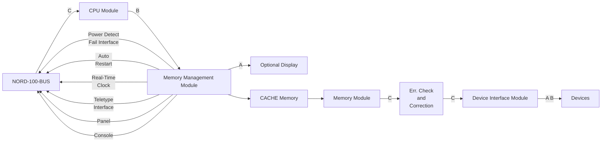

## Page 1

# ND 100 NORD-100 COMPUTER SYSTEM

## Features

The NORD-100 is a complete computer system including hardware and software. The software includes:

- SINTRAN III/VS Operating System supporting simultaneous multilingual time-sharing, real-time, local and remote batch
- FORTRAN, BASIC, COBOL, RPG II, SIMULA, PASCAL, CORAL 66, NORD PL and MAC language processors
- NORD File System
- NORD-NET
- SIBAS Data Base System
- QED Text Editor
- RJE emulators and terminal concentrators for most mainframes

The NORD-100 CPU uses the state-of-the-art bit slice hardware technology. The CPU module contains—in addition to the CPU—a Real-Time Clock, a Current Loop Terminal Interface with switch selectable speeds 110–9600 bauds and Power Fail Detect and Automatic Restart.

100-D1-6000-1080

---

## Page 2

# Product Features

- 16 bit parallel microprogrammed processor
- Bit, byte, single word, double word, triple word and register file instructions
- 8 memory addressing modes
- Optional extended instruction set with character handling instructions (used for COBOL)
- Fixed and Floating Point Arithmetic is standard
- 180 ns internal CPU cycle time (150 ns Fast Option)
- Instruction prefetch for increased performance
- Optional Writable Control Store for maximum flexibility
- Optional Hardware Paging and Memory Protect system
- 128 Kbytes virtual address space — 32 Mbyte physical
- Standard Error Checking and Correcting Memory System
- Choice of memory modules: 22 bits — 16 plus 6 error checking bits, 64 or 128 Kbyte modules
- Fast option with 150 ns CPU cycle and CACHE
- 16 level priority interrupt system — each level with a set of the 8 central registers
- Fast context switching — 5 µs
- 2048 vectored interrupts
- Bootstrap loading in firmware
- Built-in diagnostics in firmware

The Memory Management System offers an efficient paging system including extensive memory protection through a Page Protect System and a Ring Protect System. A fast version including CACHE memory is also available.

# Instruction Set

The NORD-100 has a comprehensive instruction set which includes bit, byte, word, double word and triple word instructions. Integer arithmetical operations include single precision memory-to-register operations and double precision register-to-register multiply and divide.

The Floating Point Instructions add, subtract, multiply and divide use a 32 bit mantissa and a 16 bit exponent (2 bits for sign of exponent and mantissa). Also available with 32 bit floating arithmetic.

For efficient system control, specially tailored privileged instructions are included such as loading and storing of complete central register block and inter-program level read/write operations.

The NORD-100 is microprogrammed, and all instruction execution is in firmware using a 2k by 64 bit Read Only Memory — ROM (BCD arithmetic not included). To allow dynamic microprogramming, a 256 word by 64 bit writable control store is available as option.

# Addressing Modes

A variety of addressing modes may be used:

- Program counter relative addressing
- Indirect addressing

# Product Description

## Introduction

NORD-100 is a 16 bit general purpose single board computer. The NORD-100 makes full use of the latest advances in hardware technology. The maximum address space is 128 Kbytes without the Memory Management System (MMS), and 32 Mbyte with MMS.



---

## Page 3

- Pre-indexed addressing
- Post-indexed addressing
- Combinations of the above mentioned modes

## REGISTER BLOCK

The CPU has 16 program levels, each level has the following 8 registers:

| #   | Register Description |
|-----|----------------------|
| 0   | Status (STS). This register holds different Status indicators. |
| 1 D | This register is an extension of the A-register in double precision or floating point operations. It may also be connected to the A-register during double length shifts. |
| 2 P | Program Counter, address of current instruction. This register is controlled automatically in the normal sequencing or branching mode. It is also fully program controlled and its contents may be transferred to or from other registers. |
| 3 B | Base register or second index register. In connection with indirect addressing, it causes preindexing. |
| 4 L | Link register. The return address after a subroutine jump is contained in this register. |
| 5 A | This is the main register for arithmetical and logical operations together with operands in memory. The register is also used for CPU controlled I/O communication. |
| 6 T | Temporary register. In floating point instructions it is used to hold the exponent part. |
| 7 X | Index register. In connection with indirect addressing, it causes post-indexing. |

## The Interrupt System

The NORD-10 has a 16 level priority interrupt system. To each level is assigned a complete set of all the central registers: STS, D, P, B, L, A, T, X. With this architecture, context switching is reduced to selecting the working set of central registers. The time required for this operation is 5 μs.

All program levels may be activated by software. In addition, each of the levels 10, 11, 12 and 13 may be activated by 512 vectored I/O interrupts. An IDENT instruction is used to identify the interrupting device. Program level 14 is used by the Internal Interrupt System, which monitors error conditions or traps in the CPU. Program level 15 have no vectored interrupt facility.

(Program level 15 is not used by standard NORD equipment or software, but is available for users who need an immediate access to the CPU).

The Internal Interrupt System will report 10 different internal conditions:

- MC   Monitor Call
- MPV  Memory Protect Violation
- PF   Page Fault
- II   Illegal Instruction
- Z    Error indicator
- PI   Privileged Instruction
- IOX  I/O timeout
- PTY  Parity error
- MOR  Memory Out of Range (memory timeout)
- POW  Power fail

## The Memory System

The Memory System is a flexible hierarchical memory system.

The Memory System includes:

- 2 Kbytes CACHE memory
- Main memory up to 1 Mbyte (NORD-10 compatible address mode), 32 Mbyte (extended address mode)

## CACHE Memory

The optional high speed CACHE memory will reduce the average memory access time significantly. The contents of the CACHE holds the most recent data and instructions to be processed.

### CACHE MEMORY ARCHITECTURE

The CACHE Memory is organized as a 1K by 31 bit look-up table. A word in CACHE is identified with the main memory word of which it is a copy and by its main memory physical address — the physical page number.

The CACHE Memory is homogeneous, i.e. the CACHE Memory does not discriminate between data words, instructions or indirect addresses stored in main memory.

Each word in the CACHE Memory has the following format:

```
31                                    17 16 15                                  0
| Cache Page No. - CPN (Phys. Page No. - PPN) | Word | Memory Word |
```

### CACHE INHIBIT AREA

The CACHE Memory System contains two limit registers which define a continuous area in memory which will not be copied into CACHE when accessed. The inhibit area includes all pages with

```
Lower limit < PPN ≤ Upper limit
```

The inhibit area features are intended for use on memory areas that are operated upon by high-frequency DMA transfers and/or parallel processors.

---

## Page 4

# Main Memory

Maximum memory size is 32 Mbyte. 64 Kb and 128 Kb memory modules may be used.

- A single bit error occurring on a 22-bit memory module will be corrected and the error recorded if desired.
- All double bit errors occurring on a 22-bit memory module will be reported to the Internal Interrupt System which interrupts the CPU.
- Multiple bit errors occurring on a 22-bit memory module will normally be reported to the Internal Interrupt System which interrupts the CPU.

```mermaid
flowchart TB
    CPU -->|16 DATA| NORD-100-BUS
    CPU -->|16 ADDR.| MemoryManagementSystem
    MemoryManagementSystem -->|DIP| Cache
    MemoryManagementSystem -->|DIP| Compare
    Compare -->|Hit| Cache
    Cache -->|16 DATA| NORD-100-BUS
    NORD-100-BUS -->|16 PHYS. ADDR.| Memory[Memory]
    NORD-100-BUS -->|16 DATA| Memory

    subgraph MemoryManagementSystem
        1 -->|DIP| MemoryManagementSystem[Memory Management System]
        11 -->|VPN| MemoryManagementSystem
        12 -->|PPN| MemoryManagementSystem
    end
    
    subgraph Cache
        14 -->|CPN| Cache[Cache]
        14 --> Compare
    end

    subgraph "14 bit Directory"
        CPN --> "1K x 16 bit of Data"
        "1K x 16 bit of Data" --> CPUword[CPU-word]
        CPUword -->|Word valid| Wordvalid
    end
```

| Term | Description |
|------|-------------|
| DIP  | Displacement within a page = Address bits 0-9 = Physical addr. 0-9 |
| VPN  | Virtual Page Number = Addr. 10-15 |
| PPN  | Physical Page Number = Phys. Addr. 10-23 |

# Memory Management System

The Memory Management System includes two major subsystems:

- The Paging System
- The Memory Protection System

The Paging System maps a 16-bit virtual address into a 24-bit physical address, extending the physical address space from 128 Kbytes to 32 Mbyte. Four page index tables of 64 entries each, located in high-speed registers, reduce paging overhead to virtually zero. Data and instruction pages may be allocated anywhere in memory without restriction. The page size is 1024 words.

The Memory Protection System may be divided into two subsystems:

- The Page Protection System
- The Ring Protection System

The Page Protection System protects each page from read, write or instruction fetch accesses or any combination of these.

The Ring Protection System places each page on one of four priority rings. A page of memory that is placed on one specific ring may not be accessed by a program that...

---

## Page 5

# The Input/Output System

## GENERAL

The NORD-100 uses the advanced high speed NORD-100-bus which provides communication between programmed input/output devices, DMA controllers, memory modules and the CPU. DMA memory address range is 32 Mbytes. PIO device address capability is 32 Kwords.

The NORD-100-bus is controlled by the **Bus Controller** which is an integrated part of the CPU.

## PROGRAMMED INPUT/OUTPUT — PIO

Program controlled input/output operates via the A-register which implies that each word of input/output has to be programmed via this register. The PIO interfaces are always controlled by the CPU.

## DIRECT MEMORY ACCESS — DMA

A Direct Memory Access — DMA — channel is used to obtain high transfer rates to and from main memory. CPU and DMA transfers may thus be performed simultaneously. The DMA controllers transfer to main memory via the NORD-100-bus on a cycle steal basis. More than one DMA device may be active at the same time, sharing the total bandwidth of the NORD-100-bus.

## BOOTSTRAP LOADING

Bootstrap loading is under microprogram control and makes available the following facilities:

- Binary load, from character oriented devices, i.e., from Floppy Disk or a communication line

- System loading from block oriented devices, i.e., disk

```
     Pos. No.   1                     2                     3 ....

    | | | | | | | | | | | | | | | | | | | | | | | | | | | | | | | | | | | | | | | | | | | | | | 
    |-----------|   <-                    NORD-100-BUS                     ->   |-------------|  ---
    |-----------|                                                          |-------------|    ----  
    |-----------|                                                          |-------------|    ----  
    C    |      |           ^                                         ^       |      |    ----   
    P    |      |           |                                         |       |      |      ----         
    U    |      |           |               Memory expansion up to 11 Mbyte  |      |        ---     
         |      |                                                             |                           
         |      |               <--  I/O Device Connection   -->               

Memory Manage-
ment System
and CACHE
```

---

## Page 6

# MEMORY REFERENCE INSTRUCTIONS

## Store Instructions

- STZ  Store zero;
- STA  Store A;
- STT  Store T;
- STX  Store X;
- MIN  Memory increment, skip if 0 False True;

## Load Instructions

- LDA  Load A;
- LDT  Load T;
- LDX  Load X;

## Arithmetical and Logical Instructions

- ADD  Add to A;
- SUB  Subtract from A;
- AND  Logical AND to A;
- ORA  Logical inclusive OR to A;
- MPY  Multiply integer;

## Double Word Instructions

- STD  Store double word;
- LDD  Load double word;

## Floating Instructions

- STF  Store floating accumulator;
- LDF  Load floating accumulator;
- FAD  Add to floating accumulator;
- FSB  Subtract from floating accumulator;
- FMU  Multiply floating accumulator;
- FDV  Divide floating accumulator;

## Byte Instructions

- SBYT  Store Right byte or Left byte;
- LBYT  Load Right byte or Left byte;

# REGISTER OPERATIONS

## Arithmetical Operations

- RADD  Add source to destination;
- RSUB  Subtract source from destination;
- COPY  Register transfer;

## Logical Operations

- SWAP  Register exchange;
- RAND  Logical AND to destination;
- REXO  Logical exclusive OR;
- RORA  Logical inclusive OR;

## Combined Instruction

- EXIT  COPY SL DP;

## Extended Arithmetical Operations

- RMPY  Multiply source with destination.  
  Result in double accumulator;
- RDIV  Divide double accumulator with source  
  register. Quotient in A, remainder in D;

# ARGUMENT INSTRUCTIONS

- SAA  Set argument to A;
- AAA  Add argument to A;
- SAX  Set argument to X;
- AAX  Add argument to X;
- SAT  Set argument to T;
- AAT  Add argument to T;
- SAB  Set argument to B;
- AAB  Add argument to B;

# EXECUTE INSTRUCTION

- EXR  Execute instruction found in specified register;

# BIT INSTRUCTIONS

- BSET  Set specified bit equal to specified condition;
- BSTA  Store and clear K;
- BSTC  Store complement and set K;
- BLDA  Load K;
- BLDC  Load bit complement to K;
- BANC  Logical AND with complement;
- BORC  Logical OR with bit complement;
- BAND  Logical AND to K;
- BORA  Logical OR to K;

---

## Page 7

# Shift Instructions

| Instruction | Description |
|-------------|-------------|
| SHT         | Shift T-register; |
| SHD         | Shift D-register; |
| SHA         | Shift A-register; |
| SAD         | Shift A- and D-register connected; |

**ARI**: Arithmetic shift. During right shift, bit 15 is extended. During left shift, zeros are shifted in from right.

**ROT**: Rotational shift. Most and least significant bits are connected.

**ZIN**: Zero end input.

**LIN**: Link end input. The last vacated bit is fed to M after every shift instruction.

**SHR**: Shift right; gives negative shift counter.

# Floating Conversion

NLZ: Convert the number in A to a floating number in FA (TAD);

DNZ: Convert the floating number in FA to a fixed point number in A;

# Sequencing Instructions

## Unconditional Jump

- JMP: Jump;
- JPL: Jump to subroutine;

## Conditional Jump

- JAP: Jump of A is positive;
- JAN: Jump if A is negative;
- JAZ: Jump if A is zero;
- JAF: Jump if A is nonzero;
- JXN: Jump if X is negative;
- JPC: Increment X and jump if positive;
- JNC: Increment X and jump if negative;

## Skip Instruction

SKP: Skip next location if specified condition is true;

# Specified Condition

| Condition | Description |
|-----------|-------------|
| EQL       | Equal to |
| UEQ       | Unequal to |
| GRE       | Signed greater or equal to |
| LST       | Signed less than |
| MLST      | Magnitude less than |
| MGRE      | Magnitude greater or equal to |

# Privileged Instructions

The following instructions are available only to Ring 2 or Ring 3 programs:

## Transfer Instructions

### Internal Register Transfer Instructions

- TRA: Transfer specified internal register to A;
- TRR: Transfer A to specified internal register;
- MCL: Masked clear of register;
- MST: Masked set of register;

### Inter-Level Instructions

- IRR: Inter-register Read  
  A: = Specified register on specified level
- IRW: Inter-register Write  
  Specified register on specified level: = A 

## Memory Examine/Deposit Instructions

- EXAM: Memory examine;
- DEPO: Memory deposit;

## System Control Instructions

- ION: Turn on interrupt system;
- PON: Turn on paging system;
- IOF: Turn off interrupt system;
- POF: Turn off paging system;
- PION: Paging and interrupt system on;
- PIOF: Paging and interrupt system off;
- WAIT: Halt the program/Give up priority;
- MON: Monitor call instruction;
- SEX: Set extended address mode;
- REX: Reset extended address mode;
- LWCS: Load writable control store;

---

## Page 8

# The NORD-100 CPU Module

Including Real-Time Clock and Current Loop Interface

[Photo: The NORD-100 CPU Module]

## Contact Information

| Country       | Company Name                      | Address                                    | Telephone                     |
|---------------|-----------------------------------|--------------------------------------------|--------------------------------|
| **Norway**    | NORSK DATA A.S                    | Jerikovien 20, Box 4 Lindeberg gård<br>OSLO 10 | Tel. 02-391601, Tlx. 18661 nd n |
| **Denmark**   | NORSK DATA ApS                    | Øverødvej 5<br>2840 HØLTE                  | Tel. 02-425055, Tlx. 37725 nd dk |
| **West Germany** | NORSK DATA DEUTSCHLAND       | Abraham-Lincoln-Str. 30<br>6200 WIESBADEN   | Tel. 06121-76420, Tlx. 4186370 noda dtk |
| **Sweden**    | ND NORSK DATA AB                  | Kanalvägen 3, Box 2031<br>194 02 UPPLANDS VÄSBY | Tel. 0760-86500, Tlx. 13528 nordata s |
| **Sweden**    | ND NORSK DATA AB                  | Klangfärgsgatan 11, Box 9052<br>421 09 VÄSTRA FRÖLUNDA | Tel. 031-299350               |
| **France**    | NORSK DATA FRANCE                 | "Le Brevent", Avenue du Jura<br>01210 FERNEY-VOLTAIRE | Tel. 050-405876, Tlx. 385863 nordata fernv |
| **France**    | NORSK DATA FRANCE                 | 120, Bureaux de la Colline<br>92213 SAINT-CLOUD-CEDEX | Tel. 01-6023366, Tlx. 20180 nd paris |
| **U.S.A.**    | NORSK DATA N.A., Inc.             | 65, WILLIAM STREET<br>Wellesley, MASS. 02181 | Tel. 0617-237-7945, Tlx. 921740 norsk well |
| **England**   | NORSK DATA Ltd.                   | Trident House, Pelican Lane<br>Newbury, BERKS | Tel. 0635-31465, Tlx. 849819 norsk g |

Note: NORSK DATA reserves the right to change specifications at any time without given notice.

---

