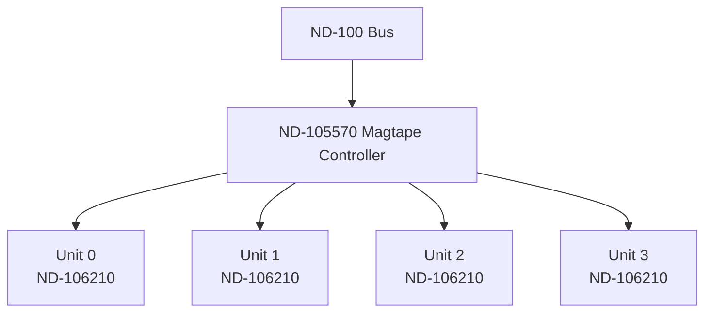

## Page 1

# MAGTAPE DRIVE 1600-3200 BPI

**ND 106210**

[Photo: Magnetic Tape Drive]

```
 ____  __
|____||__|

Norsk Data
```

Scanned by Jonny Oddene for Sintran Data © 2010

---

## Page 2

# MAGTAPE DRIVE 1600-3200 BPI

## INTRODUCTION

The ND 106210 is a 19 inch form factor, rack mounted 1/2 inch magtape drive which records at both 1600 and 3200 BPI densities.



*Note: Total cable length to last unit may not exceed 6 m (20 feet).*

---

## Page 3

# MAGTAPE DRIVE 1600-3200 BPI

## FEATURES
- Simple streamer mechanics with 64 KB cache buffer for start-stop emulation
- Superior performance to conventional vacuum column drives
- Convenient mail-box autoload of media
- Extensive power-on diagnostics and service aids for easy troubleshooting
- Error correction and detection internal to the drive
- Records at both 1600 BPI and 3200 BPI densities
- 1600 BPI data format is IBM/ANSI compatible
- 5, 7, 8, and 10.5" reels of either 1.0 or 1.5 milli-inch standard 1/2" media may be used
- UL, CSA, and IEC certification
- Embedded formatter for 1600 and 3200 bpi

## TECHNICAL SPECIFICATIONS

| Specification                        | Details                               |
|--------------------------------------|---------------------------------------|
| Unformatted Capacity                 | 50 MB @ 1600 bpi                      |
| Unformatted Capacity                 | 100 MB @ 3200 bpi                     |
| Recording method                     | Phase Encoded (PE)                    |
| Data tracks                          | 8                                     |
| Parity tracks                        | 1                                     |
| Density                              | 1600 bpi/3200 bpi                     |
| Operational speeds                   | 100 ips/50 ips                        |
| Character rate                       | 320 KB/sec.                           |
| Max. Block/record size               | 32 KB                                 |
| Tape speeds                          | 100 ips (at 1600 bpi)                 |
|                                      | 50 ips (at 3200 bpi)                  |
| Rewind speed                         | 180 ips                               |
| LSV                                  | 1% of nominal                         |
| ISV                                  | 2% of long term                       |
| Media                                | ANSI X3.40-1976 2400' and 3600'       |
| Weight                               | 37.65 kg (82 lbs.)                    |
| Data reliability: Write errors       | 1 in 10⁸ bytes                        |
| Read recoverable errors              | 1 in 10⁹ bytes                        |
| Read permanent errors                | 1 in 10¹⁰ bytes                       |
| Formatter interface                  | Industry compatible (PERTEC)          |
| Cable length                         | 7.62 meters (25 feet) max.            |
| Power requirements: Normal input voltage | 100, 120, 220, or 240                    |
| Range of nominal                     | + 10%, – 15%                          |
| Ave. backup time (75 MB disk)        | Appx. 9 minutes without compare       |

## DOCUMENTATION
Cipher Product Manual

Scanned by Jonny Oddene for Sintran Data © 2010

---

## Page 4

# Norsk Data

## Corporate Headquarters

**Address:**
Olaf Helsets vei 5  
P.O. Box 25, Bogerud  
0617 Oslo 6  

**Norway Contact:**
- Tel.: +47-2-620000
- Telex: 17444 nd no

## Norway Offices

**Bergen:**
- Tel.: +47-5-207050

**Trondheim:**
- Tel.: +47-7-921222

## ND Comtec

**Address:**
Olaf Helsets vei 5  
P.O. Box 25, Bogerud  
0617 Oslo 6  

**Norway Contact:**
- Tel.: +47-2-620000
- Telex: 17444 nd no

## Sweden

**ND Norsk Data AB**
- Address: Kanalvagen 3  
  P.O. Box 79  
  S-191 22 Upplands Vasby, Sweden
- Tel.: +46-8-760-8400

## ND-SILVIDATA

**Address:**
S-851 88 Sundsvall, Sweden  
- Tel.: +46-60-154150

## Denmark

**Norsk Data A.S**
- Address: Lautruphoj 1-3  
  P.O. Box 228  
  DK-2750 Ballerup, Denmark
- Tel.:  +45-2-668256

## Finland

**ND Norsk Data A/B**
- Address: P.O. Box 2  
  01151 Vantaa (A), Finland
- Tel.:  +358-0-945-022

## Switzerland

**Norsk Data (Switzerland) S.A.**
- Address: 10b Prime-Lusanne  
  Switzerland
- Tel.: +41-21-55694 (A)

## West Germany

**Norsk Data GmbH**
- Address: Thomasstrasse 10-12  
  6380 Bad Homburg v.d.H., West Germany
- Tel.: +49-6172-20060

## The Netherlands

**Norsk Data Nederland B.V.**
- Address: P.O. Box 560  
  3400 AN Nieuwegein, The Netherlands
- Tel.: +31-340-72411

## France

**Norsk Data**
- Address: 4 Le Brevent  
  F-78230 Le Pecq, France
- Telex: 333-530-8275

## United Kingdom

**Norsk Data Ltd.**
- Address: Newbury RG 14 6LN  
  Berkshire, England
- Tel.:  +44-635-34821

## USA

**Norsk Data N.A., Inc.**
- Address: Newborough Office Park  
  1800 West Park Drive, Suite 150  
  Westborough, MA 01581, USA
- Tel.:  +1-617-366-4662

## Hong Kong

**Norsk Data International**
- Address: 1932 Wing On Central  
  111 Connaught Road, Hong Kong
- Tel.: +852-5-191914/12/6523

## Represented by Agent In

### India

**Norsk Data (P) Ltd.**
- Tel.: 91-44-4477

### Thailand

**Norsk Data Thai Ltd.**
- Tel.: 006-662-583-345643

### France and Italy

**Matra-Datavision S.A. Paris**
- Address: 8, rue Sarrette  
  F-75684 Paris Cedex 14, France
- Tel.: 33-509-327420

[Scanned by Jonny Oddene for Sintran Data © 2010]

---

