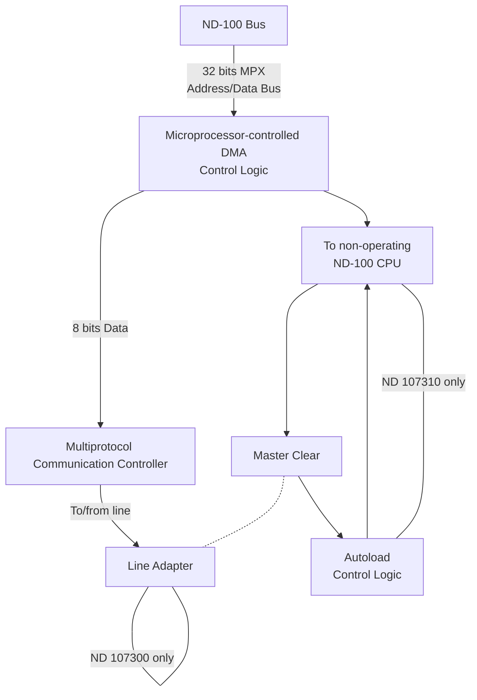

## Page 1

# HDLC INTERFACE

**ND 107300 HDLC Interface (DMA)  
ND 107310 HDLC Auto Load (Upgrade Kit)  
ND 107330 HDLC Interface (DMA) with Auto Load for ND-100**



**ND 107330**

```
      ND 107310 only
```

```
      ND 107300 only
```

**ND**

Norsk Data

[Footer: Scanned by Jonny Oddene for Sintran Data © 2021]

---

## Page 2

# HDLC INTERFACE

## INTRODUCTION

The ND 107300/107310/107310 HDLC Interface (DMA) offers the necessary hardware for connecting the ND-100 Computer System to a computer network. The interface line adapter is designed in accordance with the internationally accepted electromechanical standards V.24(RS-232C), X.21 Bis, or X.21 (X.27). In addition, the line adapter offers special connections directly between two ND 107300/107310s using private lines.

The ND 107300/107310/107330 contains hardware which packs data into the HDLC (High Level Data Link Control) frame format defined in the ISO IS 3309 standard.

At frame level, the HDLC format is fully compatible with Synchronous Data Link Control (SDLC) and the Advanced Data Communication Control Procedure (ADCCP). HDLC frame format will be used in the X.25 communication procedure for connection to the public data network.

In addition to the above features, common to ND 107300 and ND 107310, the ND 107310 module contains autoload facilities. The addition of ND 107310 upgrades ND 107300 to ND 107330.

The autoload is intended to be used between a master ND-100 CPU and a slave ND-100 CPU. The ND 107310 in the slave makes it possible for the master, via a link, to stop and load the slave (remote load).

The HDLC DMA hardware offers up to 307.2 kbits/s. high performance, low processing overhead in communication systems. Recommended speed 76.8 kbits.

The HDLC hardware may be operated in half or full duplex on point-to-point lines.

## FEATURES

- Designed according to ISO IS 3309 standard
- Frame level fully compatible with SDLC and ADCCP
- Modem connections may be CCITT V.24, X-21 Bis or X-21 (X-27 RS-422)
- Half or full duplex operation
- Data range up to 307.2 kbits full duplex using Direct Memory Access (DMA)
- Automatic buffer chaining for maximum flexibility and minimum overhead
- Requires only crate position
- Speed may be set

## PRODUCT DESCRIPTION

The HDLC DMA module is controlled by means of commands to the microprocessor-controlled DMA logic.

When a command is given, data is exchanged between the ND-100 CPU and the HDLC processor through a common buffer area.

The buffers are monitored by a mailbox area where relevant status and control information resides.

---

## Page 3

# HDLC INTERFACE

## HDLC Frame Format

The HDLC frame format is as follows:

```
Information Bytes
FRAME
 ┌──────┬───┬───┬───┬────┬──────┐
 │      │ A │ C │ I │ FCS│      │
 └──────┴───┴───┴───┴────┴──────┘
```

- **Frame**
  - The FLAG marks the beginning and the end of a frame. The FLAG sequence consists of one zero-bit followed by six one-bits and one zero-bit.
  - The A-field (8 bits) is meant as a station address, but its contents are not described in the frame standard.
  - The C-field (8 bits) is a control byte intended for link control.
  - The I-field is the information field and may be any length. The I field may also be absent.
  - The FCS is a 16-bit frame check sequence and contains the 16-bit CRC number computed over the bits between the last bit of the opening flag and the first bit of FCS.
  - The information part of the FRAME may consist of a number of data blocks (buffers).

## HDLC Hardware

The HDLC hardware is designed around a 16-bit microprocessor and an LSI chip which takes care of the parallel-to-serial and serial-to-parallel conversion and the control of the frame format.

The microprocessor and its associated PROM give great flexibility for both HDLC formats and BSC compatible communication on DMA just by using another PROM. (NOTE that each procedure is registered as a separate ND product).

## HDLC DMA Data Structure

The HDLC DMA Data Structure allows data transfer from a predefined list without program intervention.

This list structure gives a non-critical system response time in case of heavy I/O load on the system.

## SPECIFICATIONS

| Specification                   | Description                                            |
|---------------------------------|--------------------------------------------------------|
| Number of lines                 | 1 line full duplex/half duplex synchronous             |
| Line connection                 | CCITT V.24/V.28 (EIA RS-232C)                         |
|                                 | CCITT X.21 Bis                                        |
|                                 | CCITT X.21/X.27                                       |
| Intercomputer link              | Differential lines in accordance with X.27 (RS-422) specifications |
| Crystal-controlled transmission speed | 1200, 2400, 4800, 9600, 19200, 38400, 76800, 153600, 307200 bps |

---

