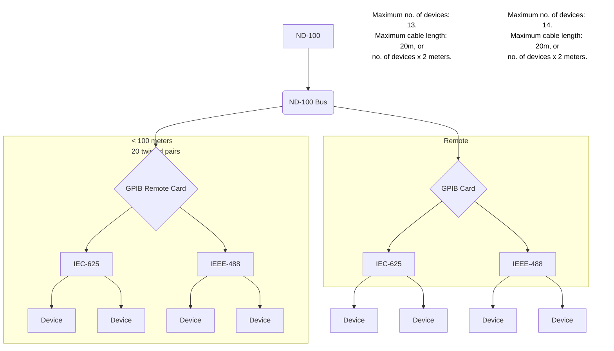

## Page 1

# ND GPIB-SYSTEM

ND 108550 General Purpose Interface Bus Controller (GPIB)  
ND 108560 GPIB Remote Option



    ND-100 with GPIB-system.

    [Logo: ND Norsk Data]

---

## Page 2

# ND GPIB-SYSTEM

## Introduction

The GPIB system is an IEEE 488 and IEC 625 standard multiuser interface system for programmable instrumentation. It is intended for applications like laboratory instrumentation in hospitals and research institutions, and for automatic test systems. However, it can also be used to interface peripherals like plotters or printers, if these are IEEE or IEC compatible.

The interface system can be used for:

- Measurements requiring high reproducibility and accuracy
- Measurements requiring simultaneous testing of input and output characteristics
- Measurements requiring immediate further processing of the measured data to allow decision-making
- Measurement procedures which are extremely diversified or constantly recurring
- Procedures measuring many parameters
- Measurements with only a few interesting results

The GPIB system is delivered with a GPIB software packet based on FORTRAN callable routines for the different functions of the module.

There are routines to:

- Read data from device
- Write data to device(s)
- Transfer data between devices
- Trig and clear device(s)
- Set device(s) in local mode
- Parallel configuration of device(s)
- Pass control to device
- Configure the parallel or serial poll status for GPIB module
- Reserve device(s) for a user
- Release device(s) for a user
- List system device(s)
- List device(s) reserved for a user

---

## Page 3

# ND GPIB-SYSTEM

## Product Description

The GPIB system on ND-100 is a multiuser system with a maximum of 16 users. The microprocessor on the GPIB module takes care of creating new users, deleting old users, reserving devices for a user, enabling for a new device that has been connected to the bus, deleting old devices, etc.

The standard version (ND 108550) allows for:
- Maximum 15 devices on one bus
- Maximum 20 meters total cable length
- Maximum 500,000 bytes/s data rate

The remote option (ND 108560) avoids these limitations in the IEEE-488 or IEC-625 standards. On the ND-100 GPIB card, the 16 signals in the GPIB are translated into 20 pairs of signals in a differential bus. In a memory box containing one card, these 20 pairs of signals are translated back to the 16 GPIB signals.

This differential bus can be a maximum of 100 meters long. In this way, 13 devices may be connected to the ND-100 and another 14 connected to the remote box. This makes 28 devices connected to each other, using only one interface card.

## Software

The GPIB module is an input/output unit – with or without direct memory access (DMA).

The contact between the programmer and the GPIB module connected to the devices is through:

- Sending device dependent data with or without DMA
- Receiving device dependent data with or without DMA
- Receiving interface status like parallel poll, serial poll and error status through the microprocessor
- Sending special messages to the module, like word counter, memory address and control word
- Sending commands to the microprocessor on the module
- Receiving status from the module, like interrupt status, state status, memory address

---

Scanned by Jonny Oddene for Sintran Data © 2010

---

## Page 4

# Corporate Headquarters

Ole Deviks vei 5  
P.O Box 25, Bogerud  
0611 Oslo 6  
Norway  
Tel: +47-2-625000  
Telex: 79666 nd n  
Telefax: 47-2-29364 (A)  
New York  
Telefax: 47-2-293676 (A)

## Norway

Oslo, tel: +47-2-39000  
Bergen, tel: +47-5-396000  
Forus/Stav., tel: +47-4-556300  
Sandnes, tel: +47-6-756700  
Trondheim, tel: +47-7-91222

## ND Comtec Head Office

Ole Deviks vei 5  
P.O Box 25, Bogerud  
0611 Oslo 6  
Norway  
Tel: +47-2-626000  
Telex: 79666 nd n

Denmark, tel: 45-9-195170  
United Kingdom, tel: 44-223-354344  
Switzerland, tel: 41-26-4535  
Austria, tel: 43222-5432  
Finland, tel: 3580-538811

## Sweden

ND Norsk Data AB  
Kåbovägen 1  
PO Box 71  
191 22 Upplands Väsby  
Sweden  
Telefax: +46-8-760-84840 n  
Gothenburg, tel: 46-31-496050  
Malmö, tel: 46-45-765110

# ND-Silvadata

Sweden  
581 83 Sundsvall  
Sweden  
Tel: +46-60-154150  
Växjö, tel: +46-470-18500  
Stockholm, tel: +46-760-98400

# Denmark

Norsk Data A.S  
Lautrupbjerg 3-13  
P.O Box 232  
2750 Ballerup  
Denmark  
Tel: 45-2-698565  
Telefax: 45-2-698614 (A)

Copenhagen, tel: 45-2-69865/698120  
Odense, tel: 45-65-15174  
Århus, tel: 45-86-137646  
Aalborg, tel: 45-8-373216

# Finland

Oy Norsk Data AB  
Sinikalliontie 7  
02770 Espoo 5, Finland  
Tel: 3580-538811  
Telex: 12482 net fin  
Telefax: 3580-538662

# West Germany

Norsk Data GmbH  
Thomasstraße 10-12  
6036 Bad Homburg v.d.H.  
West Germany  
Tel: 49-6172-4080  
Telefax: 49-6172-2909 (A)

West Berlin, tel: 49-30-213-8096  
Hannover, tel: 49-511-662802  
Stuttgart, tel: 49-7221-14102-4  
München, tel: 49-89-237990  
Münster, tel: 49-251-7702  
Kiel, tel: 49-431-53493

# Switzerland

Norsk Data (Switzerland) S.A  
Chemin du Vaux-Luz  
CH-1009 Pully-Lausanne  
Switzerland  
Tel: 41-21-215012  
Telex: 82581 nd ch  
Telefax: 41-21-256684 (A)  
Geneva, tel: 41-22-989100  
Glattbrugg (Zürich), tel: 41-1-810033

# The Netherlands

Norsk Data Nederland B.V  
Brugwal 5  
P.O Box 503, 3430 AM Nieuwegein  
The Netherlands  
Tel: 31-3402-7211  
Telex: 49435 nd nl

# France

Norsk Data S.A  
Avenue Durup de 2110  
Ferry-Voltaire France  
Tel: 33-556-08956  
Telex: 330556463 dxferry  
Telefax: 33-856-229546 (A)

# United Kingdom

Norsk Data Ltd  
Newbury, Berks RG16 8LU  
United Kingdom  
Tel: 44-635-93054  
Telefax: 44-635-30065/33671 (A)  
London, tel: 44-1-588-9595  
Manchester, tel: 44-61-928-582880  
Edinburgh, tel: 44-31-558-1661

# Ireland

Norsk Data Ireland Ltd. AS  
Unit A6 Industrial Estate, Santry Avenue  
Dublin 9, Ireland  
Tel: 353-1-477244  
Telefax: 353-1-427182

# USA

Norsk Data N.A., Inc  
Westborough Office Park  
1800 West Park Drive  
Suite 1800  
Westborough, MA 01581 USA  
Tel: 1-617-366-6622  
Telefax: 1-617-366-0306 (A)  
Los Angeles, tel: 1-714-752-5081

## Hong Kong

Norsk Data International  
1912 Wing On Central Bldg.  
11 Connaught Road Central  
Hong Kong  
Tel: 852-5-111219/412053  
Telex: 802-63187  
Telefax: 852-5-811965 (A)

## Represented by Agent in:

### India

Norsk Data (India) Pvt. Ltd.  
Tel: +91-4912749171/4291595  
Tel: 081-467172 dacnet

### Thailand

Telex: 268-253 THAID  
Tel: 086K 20851 nadcon th

# France and Italy:

Matra Datasyteme S.A. Paris  
Tel: 33-93080300 d Systeme  
Telefax: 33134-0621

Matra Datasyteme S.A. Lyon  
Tel: 33-43274600  
Telefax: 331613540621

Matra Datasyteme S.A. Toulouse  
Tel: 33-38435270  
Telefax: 331340621

```
          ____
        /  __ \
       |  /  \ |
       | |    | |
       | \__/  | 
        \_____/

          ND
     Norsk Data
```

---

