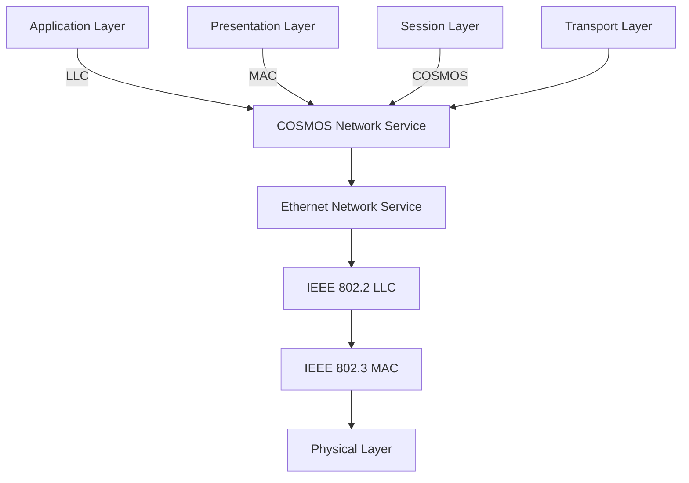

## Page 1

# ETHERNET II CONTROLLER

ND 110063

```ascii
            Compact                Compact    
      +-------------+        +-------------+
      |             |        |             |
+-----+---------+   |        |   +---------+-----+
|               |   |        |   |               |
|               |   |        |   |               |
+-------------------+--------+---+-------------------+
|                   |                |               |
|  Coaxial cable    |                |               |
|                   |    Disk        |               |
+-------------------+----------------+---------------+
|                   |                |               |
|  Compact          |                |   Satellite   |
|                   |                |               |
+-------------------+----------------+---------------+
        Transceiver cable      

                   Ethernet Configuration
```

---

ND  
Norsk Data

---

Scanned by Jonny Oddene for Sintran Data © 2010

---

## Page 2

# ETHERNET II CONTROLLER

## Introduction

Ethernet is a high-speed local area network (LAN) for computers, workstations and other intelligent devices, e.g. terminal concentrators. ND’s implementation of Ethernet follows the IEEE 802.3 ISO 8802/3 and ECMA-80/81/82 standards.

Ethernet is a protocol designed for baseband LANs. The network has a bus topology using an algorithm for bus access known as CSMA/CD (Carrier Sense Multiple Access with Collision Detection).

Ethernet is advantageous when the traffic consists of bursts of data, especially in applications such as distributed data processing, office automation, terminal access, etc. There is no routing function in Ethernet (all nodes are point-to-point connected) and therefore no need for intermediate storage of data frames. Only source and destination nodes will need processing, memory, and bus bandwidth resources. By eliminating routing nodes, Ethernet provides more flexibility and reliability. An Ethernet may have up to 1024 units connected.

```
  Coaxial cable segment
     Maximum 500 m
  ---------------------  
     |       |        |          
     |       |        |          
  ND System  |     ND System
          Transceiver
          |     
          |       
          |       
       ----------     
     Coaxial cable 
     ----------------    
          |       |        |    
  ND System ND System ND System

A small Ethernet configuration
```

## Benefits

- **Connectivity:** Each computer on the network has a direct path to all other computers via the same shared cable.
- **Ease of growth:** A small network can be easily expanded to a large network with several hundred nodes.
- **Equipment location flexibility:** A computer can be removed from the network and reconnected anywhere on the cable.
- **Reliable data communications:** High reliability and availability are inherent qualities in the design of the network hardware and software.
- **Flexible network management:** The network can be managed and monitored from any connected ND computer.
- **State-of-the-art communications:** Ethernet is the most commonly used LAN worldwide.

---

## Page 3

# ETHERNET II CONTROLLER

## Description

The Ethernet II Controller is designed and built around an MC 68000 10 MHz processor, with 1/2 megabyte local memory. The controller is mounted on a single card for ND-100 based systems using modern technology (AMD LANCE).

The controller conforms to the IEEE 802.3 and ISO/DIS 8802/3 standards. The Ethernet Controller implements the three lowest layers of the OSI seven-layer model for system communication. The software for the network layer (level 3) runs on the controller’s hardware. External transceivers implement the data-link and physical layers (levels 2 and 1).



Ethernet II Implementation

## Features of the ETHERNET II Controller

- Occupies only one slot in the ND-100 card crate
- 1/2 Megabyte local memory
- Local MC 68000 processor
- Conforms to ISO DIS 8802/3 and IEEE 802.3 specifications
- Hardware runs full Media Access algorithm

## Prerequisites

- Any ND computer except OWS.
- SINTRAN III version J or later.
- COSMOS Ethernet Option

## Documentation

Ethernet II Controller ND-12.055.1 EN

---

## Page 4

# Contact Information

## Corporate Headquarters

**Olaf Helsets vei 5**  
P.O. Box 5, Bogerud  
0621 Oslo 6  
Norway  
Tel.: +47-2-620000  
Telex: 77547 ND N  
Telefax: 47-2-628924 (A)  
New: +47-2-972849 (A)  
Telex: 47-2-927859 (A)  

---

## Head Office

**Olaf Helsets vei 5**  
P.O. Box 5, Bogerud  
0621 Oslo 6  
Norway  
Tel.: +47-2-620000  
Telex: 77547 ND N  
Telefax: 47-2-628601 (A)  

**Gothenburg, tel.: +46-31-496760**  
Malmoe, tel.: +46-40-70150  

---

## Norway

- Oslo, tel.: +47-2-826000  
  Telex: 78-761 nd n  
  Telefax: 47-2-826001 (A)  
- Bergen, tel.: +47-5-228500  
  Sogndal, tel.: +47-5-670000  
  Sandnes, tel.: +47-4-630000  
  Trondheim, tel.: +47-9-791222  

## ND Comptec

- Stavanger, tel.: +47-4-555000  
- Oslo, tel.: +47-2-720000  
- Kristiansand, tel.: +47-4-390095  

---

## ND-Silvidata

### Sweden

- Box 88 Sundsvall  
  Sweden  
  Tel.: +46-60-151150  

- Vaexoe, tel.: +46-470-18500  
- Stockholm, tel.: +46-760-98400  

---

## Denmark

- Nordisk Data A/S  
  Lautrupbjerg 1-3  
  P.O. Box 212  
  2750 Ballerup  
  Denmark  
  Tel.: +45-2-685095  
  Offices: +45-2 20684 (H)  
  Telefax: +45-2-688145 (A)  
  Aalborg, tel.: +45-9-66055/661200  
  Copenhagen, tel.: +45-5-517540  
  Arhus, tel.: +45-6-167162  
  Alborg, tel.: +45-8-373016  

---

## Finland

- ND Nordisk Data AB  
  Pukinmaenaukio 2 C  
  SF-00891 Helsinki 71  
  Finland  
  Tel.: +358-0-360260  
  Telex: 123-456 ND FI  

---

## West Germany

- Nordisk Data GmbH  
  Thomassee 10-12  
  6330 Bad Homburg v.d.H.  
  West Germany  
  Tel.: +49-6172-6958 0  
  Telefax: +49-6172-2203 (A)  

- Hamburg, tel.: +49-40-882 7317  
- Hannover, tel.: +49-511-656006 0  
- Stuttgart, tel.: +49-711-242140 2  
- Munich, tel.: +49-89-9570970 0  
- Munster, tel.: +49-251-70878  

---

## The Netherlands

- Norsk Data Nederland B.V.  
  Brouwerskamp 3  
  P.O. Box 530, 3400 AM Nieuwegein  
  The Netherlands  
  Tel.: +31-3402-7211  
  Telefax: +31-3402 72040  

---

## France

- Norsk Data s.a.r.l  
  av le Brevent  
  Avenue du Jura 0, 210 Ferney-Voltaire  
  France  
  Tel.: +33-50-405076  
  Th: +30-392385 mortata ferny  

---

## Switzerland

- Norsk Data (Switzerland) S.A.  
  Chemin du Viaduc 12  
  CH-1008 Prilly-Lausanne  
  Switzerland  
  Tel.: +41-21-272818  
  Telefax: +41-21-26695 (A)  

- Geneva, tel.: +41-22-980290  
- Glattburg (Zurich), tel.: +11-8101053  

---

## USA

- Norsk Data N.A., Inc.  
  Westborough Office Park  
  1800 West Park Drive  
  Suite 155  
  Westborough, MA 01581  
  USA  
  Tel.: +1-617-366-4662  
  Th: 62029-921797 work well  
  Telefax: +1-617-366-0036 (A)  

---

## ND International Operations

**Olaf Helsets vei 5**  
P.O. Box 5, Bogerud  
0621 Oslo 6  
Norway  
Tel.: +47-2-620000  
Telex: 77547 ND N  
Telefax: +47-2-628001 (A)  

---

## Hong Kong

- Norsk Data International  
  Tel.: 2591-21213/214203  
  Telex: 680E-26160  

---

## Iceland

- Norsk Data Iceland  
  Tel.: +95-54-163711  
  Thx: 0951-964220 osvags GY  

---

## India

- Norsk Data (India) Pty. Ltd.  
  Thx: 91-44-19121/219182  
  Fax: 081-417902 earlir in  

---

## Pakistan

- Norsk Data Pakistan (P) Ltd.  
  Tel.: 92-5-416048  

---

## Thailand

- Norsk Data Thai Ltd.  
  Tel.: 66-2 288-5123  
  Thx: 066-28851 nd chem  
  Telefax: +66-253-9884  

---

```ascii
      __   __      _            _        
 /\  / /  \ \    / (_)   ___   | |_      
/  \/ /    \ \  / /| |  / _ \  | __|     
/ /\  /      \ \/ / | | |  __/  | |_      
/_/  \_\      \__/  |_|  \___|  \__|
                                    
              Norsk Data
```

---

