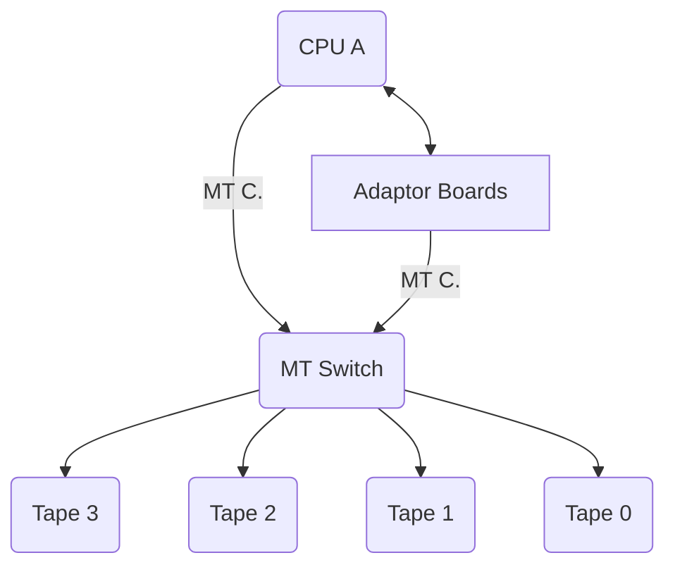

## Page 1

# Electronic Magtape Switch

**For ND 110017 and ND 105431 Drives**

[Photo: Front view of the Dual Channel Mag Tape Switch with visible controls and labels]

```
  ___________________________________________________
 /     |      |      |                       |       \
| HOME | UNIT1| UNIT2| ADDRESS TO COMPUTER 1 | ND     |
|      |      |      | ADDRESS TO COMPUTER 2 | DUAL   |
|      |      |      | REMOTE CONTROL        | CHANNEL|
|      |      |      | MANUAL SELECTOR TO NEXT MACHINE| 
|______|______|______|_______________________________|___|
```

**Norsk Data** 

Scanned by Jonny Oddene for Sintran Data © 2010

---

## Page 2

# ELECTRONIC MAGTAPE SWITCH

## Introduction

The magtape switch allows for switching of one or several (up to 4) magtapes between two CPUs.

This switch is available in two types: Cabinet-mounted (ND 110193) and free-standing (ND 110194). ND 110193 is mounted in a Filestore cabinet and is delivered with ND 110107 magtape drive. ND 110194 is delivered in its own box and is used with the ND 105431 magtape drive.

The two magtape switches are functionally the same and provide the possibility to switch up to four magtapes from one CPU to another without stopping the system. The switching is not done automatically, and should be initiated manually.



MT C. = Magtape Controller

---

## Page 3

# ELECTRONIC MAGTAPE SWITCH

## Features

- Direct connection to two separate CPUs
- Switching of up to four magtapes
- Easy operation
- Manual reservation of one CPU that prevents access of the other CPU
- Manual reset function to the connected magtape drives
- Possibility to increase the distance from CPU to magtape switch

## Product Specification

The magtape switch is mounted in a 19-inch rack which could either be mounted in a Filestore cabinet, or be delivered in its own cabinet.

The magtape switch contains an operators panel which has two positions for CPU A and CPU B. Push-buttons are provided to reset the magtape drives if necessary. In addition, indicators are provided for busy state indication and magtape selected.

ND 1100193/1100194 Magtape switch contains:

- Magtape switch with power supply
- TTL to differential converter
- Cables (4 or 10 meters). Cable length must be specified.
- Necessary mechanics.

## Requirements

- One or more magtape drives.
- One magtape controller per system.

## Technical Specifications

|                              | Cabinet-mounted | Free-standing unit |
|------------------------------|-----------------|--------------------|
| Depth                        | 420 mm          | 500 mm             |
| Height                       | 135 mm          | 220 mm             |
| Width                        | 481 mm          | 524 mm             |
| Weight                       | 7.5 Kg          |                    |
| Power consumption            | 50 W            |                    |

## Documentation

- Magtape Switch Installation Description ND-99.065 EN
- Magtape Switch Hardware Description ND-11.024 EN

*Scanned by Jonny Oddene for Sintran Data © 2010*

---

## Page 4

# Contact Information

## Corporate Headquarters

**Olaf Helsets vei 6**  
P.O. Box 25, Bogerud  
0610 Oslo 6  
Norway
- Tel.: 47 2 622600
- Telex: 79636 nd n
- Telefax: 47.2.723984 (A)
- New York: Telex: 47 2 696548

## Norway

- Oslo: Tel.: 47 2 628000
- Bergen: Tel.: 47 5 295800
- Porsgrunn: Tel.: 47 3 757600
- Stavanger: Tel.: 47 4 892950
- Tromso: Tel.: 47 4 687196
- Trondheim: Tel.: 47 3 792122

## ND Comtec Head Office

**Olaf Helsets vei 6**  
P.O. Box 9, Bogerud  
0611 Oslo 6  
Norway
- Tel.: 47 2 628000

## Sweden

- Gothenburg: Tel.: 46 31 496760
- Malmo: Tel.: 46 40 705160

## ND-Silvlata Sweden

**83 83 Sundsvall**  
Sweden
- Tfi.: 46 6015150

---

## Denmark

**Norsk Data A.S**  
Lautruphoej 1-3  
P.O. Box 232  
2750 Ballerup  
Denmark
- Tel.: 45 2 685065
- Telex: 85526 ndk dk
- Telefax: 45.2.684691 (A)

## Finland

**Oy Norsk Data AB**  
Pukinmenlaukoio 2  
00270 Helsinki, Finland
- Tel.: 358 0 5411
- Telefax: 358 0 544666

---

## West Germany

**Norsk Data GmbH**  
Boschstrasse 10-12 H.  
6330 Remshelc
- Tel.: 49 617187240

## Sweden

**ND Norska Data AB**
Anders Vapsvag 25  
412 73 Goteborg
- Tel.: 46 31 166303

---

## Netherlands

**Norsk Data Nederland B.V.**  
Burgwal 5  
P.O. Box 350, 2300 AM Nieuwwegen

- Tel.: 31 33272711

## France

**Norsk Data S.a.r.l.**
Aêre D lblevrue  
Avenue du Jurs or. 0120 Ferney Voltaire  
France
- Tel.: 33 5040625
- Telefax: 39 5042845 (A)

---

## Switzerland

**Norsk Data (Switzerland) S.A**  
Chemin du Vidtese 12  
CH-1008 Fruilty - Lausanne  
Switzerland
- Tel.: 41 21 226922
- Telex: 450218 ndk ch
- Telefax: 41.215266504 (A)

## United Kingdom

**Norsk Data Ltd.**  
Benham Valeric  
Newbury, Berks RG16 8LU  
United Kingdom
- Tel.: 44 6353565

## Ireland

**Norsk Data Ireland Ltd.**  
IDA Industrial Estate Sandy Avenue  
Dublin 11 Ireland
- Tel.: 353 1834360

---

## USA

**Norsk Data N.A., Inc.**  
1550 Woodluce Park  
Newcastle Drive  
Suite 750  
Houston, Texas 77063
- Tel.: 713 3664862
- Telefax: 1617030506 (A)

## France and Italy

**Matra Datasysteme S.A.**  
Paris
- Tel.: 331 6936680

**Lyon**
- Tel.: 334 3524445

---

## Represented by Agents and Distributions In:

- **Hong Kong**  
  Norsk Data International  
  852 5119217035
- Telefax: 852 7289

- **Saudi Arabia**  
  Advanced Systems Ltd.
  - Tel.: 966 9630621

- **Thailand**  
  Norsk Data Thailand Ltd.
  - Tel.: 662 2636840

---

```plaintext
        .
      .
    ____  ___   ____ _
   /    \/   \ /    (_|
  /      \    (____  _|
 (  ( )  )  )  _|   ( |
 (______/__/ (___,  [_)
```

---

