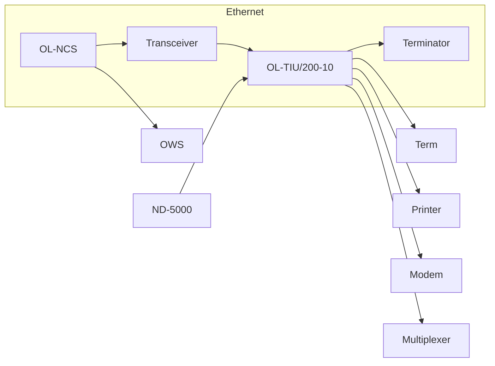

## Page 1

# OpenLAN Terminal Interface Unit (OL-TIU/200-10)

**ND110577**

[Photo: Terminal Interface Unit]

```
+---------------------------+
|                           |
|        ND OpenLAN         |
|                           |
|      [illegible text]     |
|                           |
|   ND Norsk Data           |
+---------------------------+
```

ND Norsk Data

*Scanned by Jonny Oddene for Sintran Data © 2010*

---

## Page 2

# OpenLAN

## Introduction

The ND 110577 OpenLAN TIU/200-10 (OL-TIU) is a high-performance Terminal Interface Unit that connects up to ten terminals, personal computers, printers, modems and host ports to a Norsk Data OpenLAN local area network. It allows the interconnection of all standard asynchronous devices in a multi-vendor network and provides full RS-232 support.



## Product description

The OL-TIU is compatible with the OpenLAN line of communications, gateway and network-control servers. It offers a unique set of connection services including named command sequences (macros), speed and flow control matching, multiple sessions per port and a context-sensitive help facility. Network usage is enhanced with symbolic resource naming, call queuing, and port access security in a distributed data-switching configuration.

The OL-TIU software is loaded from a central ND 110578 Network Control Server (OL-NCS) that also collects session audit-trail information, logs errors and monitors network usage. The audit trail gives time-stamped information on each connection to show source, destination, duration and traffic.

A high-speed 68000 processor enables ten asynchronous devices to operate concurrently at 19.2 Kbits per second. Each OL-TIU port can be individually configured to support asynchronous devices.

---

## Page 3

# OpenLAN

## Features

### Distributed data switching
Physical distribution of ten-port OL-TIUs on the OpenLAN minimizes expensive cabling and, with no single point of failure, is more reliable than a centralized data switch.

### Asynchronous support
Each port can be individually selected for support of asynchronous devices, providing flexibility for network additions and changes.

### High-performance architecture
The OL-TIU, with a high-speed 68000 processor and 512KB memory, easily supports data entry and file transfer applications for devices running at up to 19.2 Kbps.

### Flexible configuration
Selectable port, system, and network parameters include flow control, rotaries, autobaud, command privilege level, and network access control. These parameters are stored on a central OpenLAN Network Control Server (OL-NCS) for maximum security and control.

### Simultaneous sessions
- Support for up to eight simultaneous sessions.
- Support for 10 concurrent users running at 19.2 Kbps.

### UNIX® support
Customers running UNIX systems can define any kind of terminals similar to ND's VTM tables. Norsk Data has done this for the TDV2200/9 and the TDV1200 (BSC and SVID).

### Installation and relocation
The OL-TIU is compact, smaller than a standard briefcase, and lightweight. As a result, it can be easily installed in offices, computer rooms, or wiring cupboards.

### TCP/IP
Industry-standard high-level protocols are used to provide multi-vendor connectivity. The OL-TIU supports TCP/IP.

## Technical Specifications

### System architecture
#### High-performance Ethernet communications server:
- 19.2 Kbps system throughput with 100% duty cycle.
- Operating software bootloaded from an OL-NCS.
- Maximum of 40 sessions per server and 8 sessions per physical port.
- Baseband 10M bps IEEE 802.3-compatible Ethernet interface.

## Protocol
Transmission Control Protocol/Internet Protocol (TCP/IP).

## Communications Interface

| Feature                                    | Details                                   |
|--------------------------------------------|-------------------------------------------|
| RS-232 serial ports                        | 10                                        |
| Data rates selectable                      | Up to 38.4 Kbps                           |
| Software flow control                      | XON/XOFF (character-selectable)           |
| Port-selectable asynchronous support       |                                           |
| DB-25, DCE pinout female connectors        |                                           |

## Terminal, host, modem support
RTS, CTS, DTR, DSR, DCD, TXC, RXC.

## Physical Dimensions

| Dimension | Measurement |
|-----------|-------------|
| Length    | 32.3 cm     |
| Width     | 41.1 cm     |
| Height    | 9.6 cm      |
| Weight    | 5.5 kg      |

## Power Requirements
- 115 VAC ± 20%, 47 to 63 Hz, 0.8 Amps
- 230 VAC ± 20%, 47 to 63 Hz, 0.4 Amps

## Environment Operating Range
- Temperature: 41° to 104° F (5° to 40° C)
- Humidity: 10% to 90% (non-condensing)

## Registration
UL 114, 478 CSA 22.2 FCC Part 15/Subpart J/Class A

## Documentation

| Document                                    | Reference    |
|---------------------------------------------|--------------|
| OpenLAN Product Family                      | ND-813037    |
| OpenLAN Network Management & Operation Guide | ND-830124    |
| OpenLAN Network Control Server Installation & Operation  | ND-830123    |
| OpenLAN TIU Terminal User Guide             | ND-860351    |
| OpenLAN Network Supervisor Guide            | ND-830107    |
| OpenLAN TIU Quick Reference Guide           | ND-860359    |
| OpenLAN TIU Getting Started Guide           | ND-860353    |

---

## Page 4

# Contact Information

| Region                | Contact Details                 |
|-----------------------|---------------------------------|
| **Corporate Headquarters** | Tel. 47-2-626000                   |
| Norway                | Tel. 47-2-628000                     |
| Sweden                | Tel. 46-720-98400                  |
| Denmark               | Tel. 45-2-685055                   |
| Finland               | Tel. 358-0-356811                  |
| United Kingdom        | Tel. 44-635-35544                   |
| West Germany          | Tel. 49-6172-4080                     |
| Belgium               | Tel. 32-2-7251560                  |
| France                | Tel. 33-1-45371200                 |
| Ireland               | tlf. 353-1-427244                  |
| Luxembourg            | Tel. 352-496176/8/9                |
| The Netherlands       | Tel. 31-3402-72411                  |
| Spain                 | Tel. 34-3-2152287                  |
| Switzerland           | Tel. 41-21-250122                  |
| Hong Kong             | Tel. 852-5-411912/412053           |
| USA                   | Tel. 1-617-366-4662                |
| Iceland               | Tel. 354-1-673711                  |
| India                 | Tel. 9144-119217/119126            |
| Pakistan              | Tel. 92-51-851446                  |
| Thailand              | Tel. 66-2-253-9882/4               |

| **ND Comtec Headquarters** | Contact Details                 |
|---------------------------|----------------------------------|
| ND Comtec Norway          | Tel. 47-2-628000                    |
| ND Comtec Austria         | Tel. 43-2266-5355                   |
| ND Comtec USA             | Tel. 1-316-636-5000                 |

*Information in this document is subject to change without notice and does not represent a commitment on the part of Norsk Data.*

---

