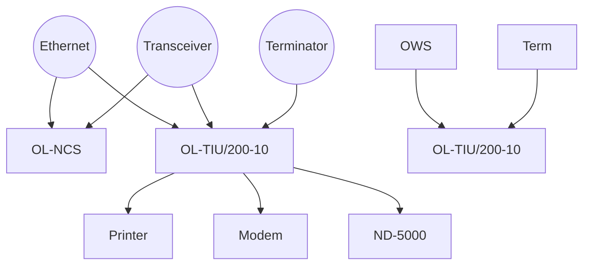

## Page 1

# OpenLAN Network Control Server (OL-NCS)

**ND 110578**

[Photo: Person using a computer]

---

```
     ND
Norsk Data
```

---

*Scanned by Jonny Oddene for Sintran Data © 2010*

---

## Page 2

# OpenLAN

## Introduction

The OpenLAN Network Control Server (OL-NCS) offers a comprehensive set of network management capabilities for Norsk Data distributed data-switching networks. These capabilities expand on the network management and reporting features available on all Norsk Data OpenLAN products. 

The OL-NCS provides software configuration management, a bootload service, alarm condition notification and a time service. It also provides security features to control access to network management functions. Network errors, performance information and usage data are captured in audit trail records that are monitored, analysed and presented as plots or reports by the OL-NCS. These displays and printed reports of statistics and connection information make it easy to diagnose problems and determine performance and usage trends.

## Product Description

The OL-NCS system combines a powerful 80286 personal computer, a XENIX® multi-user operating system and a high-performance interface board for connecting to Ethernet (IEEE 802.3). All network management tasks can be performed simultaneously while the network is operational.

Cost-effective for both large and small networks, the OL-NCS incorporates sophisticated management functions in an affordable personal computer. It allows the network manager to save time diagnosing problems while improving network uptime. Regularly scheduled reports and updates can be produced automatically through user-written command scripts. User-written programs can also analyse audit trail records for specialised applications such as resource access reports and automated billing for network usage.

A single OL-NCS can support up to 256 OpenLAN Terminal Interface Units (OL-TIU), with thousands of users. These servers can either be connected to a single network or interconnected by multiple inter-network bridges. Network management functions can easily be divided among multiple OL-NCS systems to meet backup and performance requirements.

OpenLAN networks utilise industry-standard high-level protocols to ensure multi-vendor connectivity as well as compatibility with future networking developments. The OL-NCS is designed to support a network of Norsk Data servers running TCP/IP protocols.

## Features

### Network Management

The OL-NCS offers network management functions critical to the efficient operation of a distributed communications network: software bootload, configuration management, internet name and macro storage, monitoring and analysis.

### Security and Control

Port, session, system and network parameters are dynamically specified and retained in a central location for maximum security and control of network resources. Network management functions are password-controlled.

### Terminal Interface Unit Software

Norsk Data Terminal Interface Unit software is distributed on a separate 1.2 megabyte diskette. The software is stored and maintained on the OL-NCS, simplifying the installation of TIUs and software upgrades. The OL-NCS downloads software to the OL-TIU when the OL-TIU is booted.

### Audit Trail

A complete audit trail of all network activity reports information on connections attempted, completed and disconnected. The information is stored on disk for printing, plotting, or further analysis.

### Command Scripts

OL-NCS command scripts automate complex sequences of network management tasks. These scripts can include a wide variety of powerful XENIX commands and utilities.



(Scanned by Jonny Oddene for Sintran Data © 2010)

---

## Page 3

# OpenLAN

## Graphic Plots

The network manager can display tables and plots of network statistics, connection information and bootload statistics to diagnose network problems quickly or to analyze trends over time.

## Network Monitor

A simple command displays the network utilization during peak time periods. Peak traffic for any TIU can be shown in packets per second or bytes per second for the past day or for any selected hour.

## User Interface

The OL-NCS's network management interface permits simultaneous performance of multiple tasks. By simply toggling between screens, the manager can execute commands or review network statistics in the command/utility screen, or view audit trail records and alarms in the diagnostic screen.

## Network Interface

A built-in Ethernet (IEEE 802.3) network interface, with an integral 16-bit microprocessor, handles all protocol processing for the system. It offloads the workstation, which shortens OL-NCS response times and permits timely analysis of network management information.

## Software Bootload

The software bootload function loads OpenLAN Terminal Interface Units over a local area network. The network manager selects the servers that will receive the software. At power-up or reset of a network server, the software is automatically sent from the OL-NCS to the server. Statistics records enable the network manager to determine which servers have requested bootload service and whether or not it was successful.

## Configuration

The OL-NCS stores the configuration information for each of the network servers on the local area network. This includes specific server configurations as well as individual port configurations. Any changes to these configurations are automatically recorded. Shared port configuration files have default configurations for connecting a wide variety of standard devices to the OL-NCS. These can be reused whenever new ports or servers must be configured on the network.

## Internet Name Storage

Internet names provide a directory function that allows the network manager to specify a logical name for any given physical address. The OL-NCS can store up to 2,048 internet names (IEN-116 compatible), which are available to all network servers.

## Macro Storage

Macros are files made up of individual user-interface commands that perform a specific task. The macro service centrally stores the command macros used by communications and gateway servers. The OL-NCS can store up to 512 command macros. A powerful editing capability permits easy modification of macro files.

## Network Monitoring

The OL-NCS monitors critical network parameters and notifies the network manager if errors exceed specified levels. The alarms generated by the monitoring function are both displayed on the diagnostic window and logged to disk for review at a later time. Alarm conditions include network collisions, CRC errors, alignment errors, short packets and long packets, asynchronous port errors, synchronous line errors on connected gateways, and the disappearance of any node due to a malfunction or power failure. Alarm logs can be stored on a 1.2 megabyte diskette or output to a serial printer for network monitoring archives. The OL-NCS generates graphic displays of alarm condition trends for network manager review. The OL-NCS has a built-in monitor that can give an up-to-the-minute report of the network. A network manager can display all OpenLAN servers on the network along with their network address and software level.

## Network Analysis

Session statistics record information on all network connections attempted, completed and disconnected. These records are stored on the local fixed disk for analysis by the network manager. All network events are time-stamped for accuracy. The network analysis service establishes a comprehensive audit trail containing the following statistics for each session:

- Connection source and destination address
- Connection status (normal or busy)
- Connection duration
- Disconnection status (normal, no response)
- Connection traffic (packets and bytes)

This information can be used to diagnose network problems and performance bottlenecks, manage security, or provide data for connection accounting. The audit trail can be output to a 1.2 megabyte diskette or a serial printer. In addition to tracking individual events, the analysis service generates graphic displays of network activities and trends.

## System Architecture

- OWS-55 Basic CPU Unit (80286)
- PC/AT enhanced keyboard
- OWS EGA Colour Monitor
- OWS 40 MB disk
- 2 MB RAM
- Ethernet Adaptor Card
- Modem Kit for remote TELEFIX of OpenLAN
- NCS Management software
- XENIX System V Operating system

## Prerequisites

- OpenLAN Cabling system
- ND 325706 Transceiver Cable type 2

## Documentation

| Document                                           | Number   |
|----------------------------------------------------|----------|
| OpenLAN TIU Terminal User Guide                     | ND-860351|
| OpenLAN TIU Getting Started Guide                   | ND-860353|
| OpenLAN TIU Quick Reference Guide                   | ND-860359|
| OpenLAN Product Family                              | ND-810307|
| OpenLAN Network Management & Oper.                  | ND-830124|
| OpenLAN NCS Installation & Oper.                    | ND-830123|

*XENIX is a trademark of Microsoft Corporation*

[Scanned by Jonny Oddene for Sintran Data © 2010]

---

## Page 4

# Contact Information

| Location               | Telephone          |
|------------------------|--------------------|
| **Corporate Headquarters**   | Tel: 47-62-62000  |
| **Norway**             | Tel: 47-2-628000   |
| **Sweden**             | Tel: 46-760-98400  |
| **Denmark**            | Tel: 45-2-688055   |
| **Finland**            | Tel: 358-0-358811  |
| **United Kingdom**     | Tel: 44-635-35544  |
| **West Germany**       | Tel: 49-6172-4080  |
| **Belgium**            | Tel: 32-2-7215560  |
| **France**             | Tel: 33-1-45371200 |
| **Ireland**            | Itt: 353-1-42724   |
| **Luxembourg**         | Tel: 352-4961767/8/9 |
| **The Netherlands**    | Tel: 31-3402-72411 |
| **Spain**              | Tel: 34-3-215287   |
| **Switzerland**        | Tel: 41-21-250122  |
| **Hong Kong**          | Tel: 852-5-411912/412053 |
| **Pakistan**           | Tel: 92-51-81446   |
| **USA**                | Tel: 1-617-366-4662 |
| **Iceland**            | Tel: 354-1-673711  |
| **India**              | Tel: 9144-419271/419126  |
| **Thailand**           | Tel: 66-2-253-9882/4  |
| **ND Comtec Headquarters** | Tel: 47-2-628000  |
| **ND Comtec Austria**  | Tel: 43-2266-5335  |
| **ND Comtec USA**      | Tel: 1-316-636-5000  |

---

Information in this document is subject to change without notice and does not represent a commitment on the part of Norsk Data. 

Scanned by Jonny Oddene for Sintran Data © 2010

---

