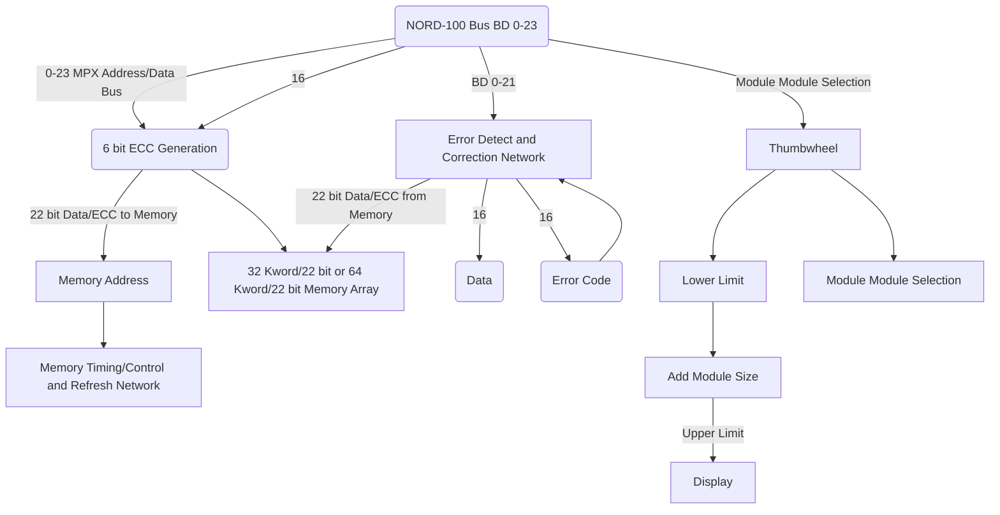

## Page 1

# ND 113 MOS MEMORY, 32 Kw/22 BITS  
# ND 115 MOS MEMORY, 64 Kw/22 BITS  

## INTRODUCTION

The ND 113/115 MOS Memory Modules are used as primary storage in the NORD-100 Computer System. ND 113 and ND 115 may be mixed in the same system to provide flexible expansion in steps of 32 Kw/22 bits or 64 Kw/22 bits. ND 113/115 require one slot in the NORD-100 rack.

## FEATURES

- 6 bit Error Correction Code increases data reliability  
  - all single bit errors are corrected  
  - all double bit errors are reported  
- Modular and flexible design  
- Requires one crate position  
- Lower power requirements  
- Small physical dimensions  
- Internal cycle control/timing  
- Asynchronous operation  
- Internal refresh address register  
- Maintenance test features  

## Diagram

---

## Page 2

# Product Description

The ND 113 and ND 115 memory modules are designed according to user requirements, data reliability, high density, and flexibility.

For each 16-bit word, 6 Error Correction Control (ECC) bits are generated. The 6 ECC bits guarantee that single bit errors are corrected and double bit errors are detected. All single bit errors are assigned an error code, making it possible to log all memory failures.

The ND 113 and ND 115 memory modules may be freely used in all address ranges up to 1 Mword. The address range for a particular module is defined either by module crate position if switches are set to 88 or by appropriate setting of thumbwheels.

For minimum interaction with other system parts, the modules contain refresh and memory cycle control logic.

# Specifications

| Specification            | Detail                                   |
|--------------------------|------------------------------------------|
| Data format              | 16 bit data                              |
|                          | 6 Error Correction Control bits          |
| Memory cycle times:      |                                          |
| - Read Access time       | 320 ns                                   |
| - Write Access time      | 180 ns                                   |
| - Bus Hold time          | 550 ns                                   |
| Power requirements       | +5V, 12V                                 |
| Stand-by power           | 15 minutes                               |

Please add 40 ns if Error Correction must be performed.

# Contact Information

**Norway:**
NORSK DATA A.S  
Jerikovien 20, Box 4 Lindeberg gård  
OSLO 10  
Tel. 02-391601, Tlx. 18661 nd n  

**Denmark:**
NORSK DATA ApS  
Overvej 5  
2840 HOLTE  
Tel. 02-420525, Tlx. 37725 nd dk  

**West Germany:**
NORSK DATA DEUTSCHLAND  
Abraham-Lincoln-Str. 30  
6200 WIESBADEN  
Tel. 06121-764220, Tlx. 4186370 noda d  

**Sweden:**
ND NORSK DATA AB  
Kanalvägen 3, Box 2031  
19402 UPPLANDS VASBY  
Tel. 0760-86050, Tlx. 13528 nordata s  

**France:**
NORSK DATA FRANCE  
"Le Brevent", Avenue du Jura  
01210 FERNEY-VOLTAIRE  
Tel. 050-408576, Tlx. 385653 nordata ferny  

**U.S.A.:**
NORSK DATA N.A., Inc.  
65, William Street  
Wellesley, MASS. 02181  
Tel. 0617-237.7945, Tlx. 921740 norsik well  

**Sweden:**
ND NORSK DATA AB  
Klangfärgsgatan 11, Box 9052  
42109 VÄSTRA FRÖLUNDA  
Tel. 031-299350  

**France:**
NORSK DATA FRANCE  
120, Bureaux de la Colline  
92213 SAINT-CLOUD-CEDEX  
Tel. 01-6023366, Tlx. 201108 nd paris  

**England:**
RICHARD NORTON (NORD) Ltd.  
NORD House, 17 Balfe Street, King's Cross  
LONDON N1 9EB  
Tel. 01-2785501, Tlx. 299537 norton g  

**Note:** NORSK DATA reserves the right to change specifications at any time without given notice.

---

