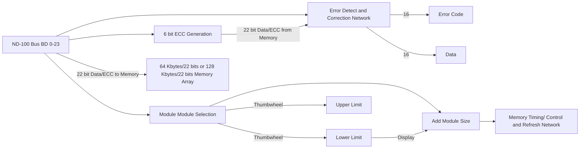

## Page 1

# ND Computer Systems



## ND MOS Memory Models

| Model | Memory Size |
|-------|-------------|
| ND 113 | 64 Kbytes/22 bits |
| ND 115 | 128 Kbytes/22 bits |
| ND 118 | 256 Kbytes/22 bits |
| ND 119 | 768 Kbytes/22 bits |

## Introduction

The ND 113/115/118/119 MOS Memory Modules are used as primary storage in the ND-100 Computer System. ND 113 and ND 115 may be mixed in the same system to provide flexible expansion in steps of 64 Kbytes/22 bits or 128 Kbytes/22 bits. ND 113/115 require one slot in the ND-100 rack.

- ND 118 equals 2 x ND 115, upgrading one CPU.
- ND 119 equals 6 x ND 115, upgrading one CPU.

## Features

- 6 bit Error Correction Code increases data reliability
  - all single bit errors are corrected
  - all double bit errors are reported
- Modular and flexible design
- Requires one crate position
- Lower power requirements
- Small physical dimensions
- Internal cycle control/timing
- Asynchronous operation
- Internal refresh address register
- Maintenance test features

113/115/118/119–B1–3000–0881

Scanned by Jonny Oddene for Sintran Data © 2010

---

## Page 2

# Product Description

The memory modules are designed according to user requirements, data reliability, high density and flexibility.

For each 16 bit word, 6 Error Correction Control (ECC) bits are generated. The 6 ECC bits guarantee that single bit errors are corrected and double bits errors are detected. All single bit errors are assigned an error code, making it possible to log all memory failures.

The ND 113 and ND 115 memory modules may be freely used in all address ranges up to 1 Mword. The address range for a particular module is defined either by module crate position if switches are set to 88 or by appropriate setting thumbwheels.

For minimum interaction with other system parts, the modules contain refresh and memory cycle control logic.

# Specification

| Feature                  | Specification         |
|--------------------------|-----------------------|
| Data format              | 16 bit data <br> 6 Error Correction<br> Control bits |
| Memory cycle times:      |                       |
| Read Access time         | 320 ns                |
| Write Access time        | 180 ns                |
| Bus Hold time            | 550 ns                |
| Power requirements       | +5V, 12V              |
| Stand-by power           | 15 minutes            |

Please add 40 ns if Error Correction must be performed.

---

```
[Logo: Norsk Data]

Norsk Data
Jernkroken 21
Boks 4 Ulvenberg gård
Oslo 10
Tel.: 02-29030
Tlx.: 18604 nd n

Bergen, tel. 05-292920
Sandnes, tel. 04-25654
Trondheim, tel. 07-47170
Stockholm, tel. 08-270408, tlx. 15255 nordata s
Göteborg, tel. 031-293950
Malmö, tel. 040-159150
Copenhagen, tel. 02-262954, tlx. 37725 nd dk
Wiesbaden, tel. 0611-714514, tlx. 41875 nda d
Ferryvill..., tel. 01-888563 tlx. 38563 nordata ferry
Paris, tel. 114-5930, tlx. 21730 nd parts
Lyon, tel. 07-837747
Newbury (Berkshire), tel. 0635-31435, tlx. 849419 norskd g
Boston, tel. 1617-237-7945, tlx. 921750 norsk well

ND COMTEC
Jernkroken 21
Boks 4 Ulvenberg gård
Oslo 10
Tel.: 02-29030
Tlx.: 18604 nd n

[Logo: ND Comtec]

Trondheim, tel. 075-16520, tlx. 55801 comtc n
Stockholm (Upplands Väsby), tel. 08-270408, tlx. 15255 nordata s
Stockholm (Sollentuna), tel. 08-298515, tlx. 13798 swecoma s
Odense, t.e. 09-514834, tlx. 52293 comtc dk
Ballerup (Copenhagen), tel. 02-407680
Düsseldorf, tel. 0211-404308, tlx. 8587277 comt d
```

**Note:** Norsk Data reserves the right to change specifications without given notice!

---

