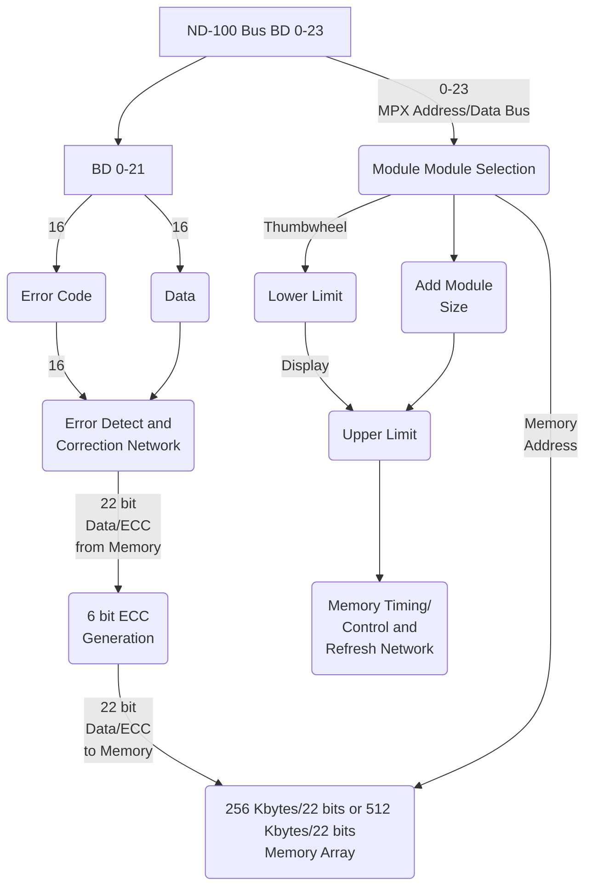

## Page 1

# ND COMPUTER SYSTEMS

## ND 116 MOS MEMORY, 256 Kbytes/22 bits
## ND 117 MOS MEMORY, 512 Kbytes/22 bits

### INTRODUCTION

The ND 116/117 MOS Memory Modules are used as primary storage in the ND-100 Computer System. Any combination of ND 116, ND 117 and the MOS memories ND 113 and ND 115 is allowed. ND 116/117 require one slot in the ND-100 rack.

### FEATURES

- 6 bit Error Correction Code increases data reliability
  - all single bit errors are corrected
  - all double bit errors are reported
- Modular and flexible design
- Requires one crate position
- Small physical dimensions
- Internal cycle control/timing
- Asynchronous operation
- Internal refresh address register
- Maintenance test features

### PRODUCT DESCRIPTION

The memory modules are designed according to user requirements, data reliability, high density and flexibility.

For each 16 bit word, 6 Error Correction Control (ECC) bits are generated. The 6 ECC bits guarantee that single bit errors are corrected and double bit errors are detected. All single bit errors are assigned an error code, making it possible to log all memory failures.

116/117-A1–6000-0182

---

## Page 2

# ND 116 and ND 117 Memory Modules

The ND 116 and ND 117 memory modules may be freely used in all address ranges up to 16 Mword. The address range for a particular module is defined either by module crate position or by thumbwheel selection. The address range may be set in 64 Kword increments.

For minimum interaction with other system parts, the modules contain refresh and memory cycle control logic.

# SPECIFICATION

| Specification         | Details                           |
|-----------------------|-----------------------------------|
| Data format           | 16 bit data                       |
|                       | 6 Error Correction                |
|                       | Control bits                      |
| Memory cycle times:   |                                   |
| Read Access time      | 270 ns                            |
| Write Access time     | 170 ns                            |
| Bus Hold time         | 500 ns                            |
| Power requirements    | +5V                               |
| Stand-by power        | 15 minutes                        |

Please add 30 ns if Error Correction must be performed.

---

[Logos and Contact Information]

- ND Norsk Data
- ND Comtec

[Photo: Company logos and contact information, including phone numbers and addresses for various locations.]

Note: NORSK DATA reserves the right to change specifications without notice.

---

