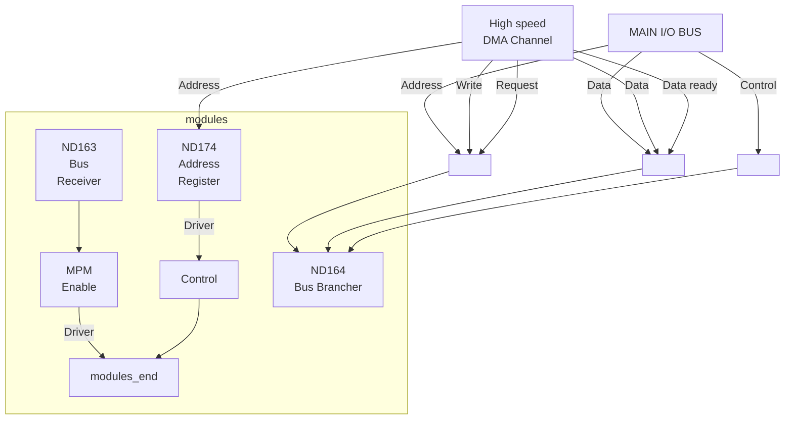

## Page 1

# ND164 BUS BRANCHER

## INTRODUCTION

The ND164 — BUS BRANCHER — is designed to be a high performance data channel which is connected to an independent memory port on the ND140 — MULTIPORT MEMORY SYSTEM. The BUS BRANCHER provides high speed data transfers to take place to memory — independently of the CPU.

## FEATURES

- Separate high speed, 18 bit data channel with 256K words address space
- No cycle steal from CPU
- The BUS BRANCHER may be installed in any BUS RECEIVER (ND163) to provide a separate high speed data channel
- Parity checked transfers

## PRODUCT DESCRIPTION

Prerequisites for the BUS BRANCHER (ND164) are the ND163 — Bus Receiver, the ND174 — 16 Memory Address Registers, and a separate memory port — ND141 — in the Multiport Memory System.

When the BUS BRANCHER is installed in the available slot in the BUS RECEIVER, 18 bit data lines, 18 bit address lines and 3 control lines are available on separate connectors constituting the high speed data channel. The only cabling required are the two channel cables going to the separate memory port in the Multiport Memory System.

All transfers on the high speed data channel are parity checked. In event of parity error, the processor will be notified and two parity error indicators on the BUS BRANCHER (for least and most significant byte) will be activated.

## Diagram

```plaintext
    +----------------+
    |      Bank X    |
    | +----+----+    |
    | |ND141|ND141|  |
    +----------------+
         |     |
         |     | ND140
         |     |
    +------------+
    |   NORD-10/S |
    +------------+
         |     |
     +---+     +---+
     |             |  
  +--v--+       +--v--+
  | BR  |       | BR  |
  | ND174|      | ND174|
  | ND164|      | ND164|
  +------|      +------|
  | Local|      | Local|
  | I/O  |      | I/O  |
  | Bus  |      | Bus  |
  +------+      +------+
```

---

164–B1–1800–0179

Scanned by Jonny Oddene for Sintran Data © 2010

---

## Page 2

# Diagram



# Specifications

| Specification         | Details                     |
|-----------------------|-----------------------------|
| Channel transfer rate | 1.6 Mbytes /second          |
| Parity                | Parity per byte — odd parity|
| Channel address space | 256 Kwords (16 bit words)   |

# Contact Information

| Company                          | Address                                           | Telephone      |
|----------------------------------|---------------------------------------------------|----------------|
| NORSK DATA A.S                   | Lindebergvn, road 20, Box 4 - Lindeberg gård<br>Oslo 10, NORWAY         | Tel. 02-391601, Tlx. 18661 nd n  |
| NORSK DATA ApS                   | Øverødvej 5<br>2840 Holte, DENMARK              | Tel. 02425055                 |
| NORSK DATA DEUTSCHLAND           | Abraham-Lincoln-Str. 30<br>6200 Wiesbaden, WEST GERMANY | Tel. 06121-764220, Tlx. 4186370 noda  |
| ND NORSK DATA AB                 | Kanalvägen 3, Box 2031<br>194 02 Upplands Väsby, SWEDEN  | Tel. 076-86500, Tlx. 13528 nordata s  |
| NORSK DATA FRANCE                | "Le Brevent", Avenue du Jura<br>01210 Ferney-Voltaire, FRANCE | Tel. 050-408576, Tlx. 385653 nordata fernv |
| NORSK DATA N.A., Inc.            | 65, William Street<br>Wellesley, Mass. 02181, USA     | Tel. 0617-237.7945            |
| ND NORSK DATA AB                 | Klangfärgsgatan 11, Box 9052<br>421 09 Västra Frölunda, SWEDEN | Tel. 031-299350 |
| NORSK DATA FRANCE                | 120 Bureau de la Colline<br>92213 Saint Cloud, FRANCE | Tel. 01-6023367, Tlx. 201108 nd paris  |
| RICHARD NORTON (NORD) Ltd.       | NORD House, 17 Balfe Street, King's Cross<br>London N1 9EB, ENGLAND | Tel. 01-2785501, Tlx. 299537 |

> NOTE: Norsk Data reserves the right to change specifications at any time without given notice!

---

