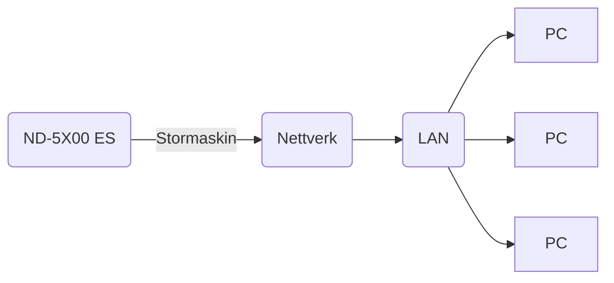

## Page 1

# ND-5000 ES Serien

**Styrken bak løsningen**

[Photo: Person using a computer workstation with a server beside them and a rack of electronic equipment in the background]

```
  ____
 /___/|  ND
 |___|/  Norsk Data
```

Scanned by Jonny Oddene for Sintran Data © 2011

---

## Page 2

# Serien ND-5000 Extended Server (ES)

Serien ND-5000 Extended Server (ES) er konstruert for en rekke databehandlingsbehov: Fra små, rimelige systemer for kontorstøtte til systemer for tunge beregningsoppgaver, store online transaksjonsbehandlingssystemer og systemer for elektronisk post. Systemserien kan fungere som nettverksadministrator og passer derfor godt inn i en moderne nettverksløsning.

I utviklingen av ND-5000 ES Serien er viktige elementer tatt i betraktning:
- Gunstig forhold mellom pris og ytelse
- Enkel bruk og drift
- Åpenhet for standarder
- Integrasjon med PCer og stormaskiner
- Større brukerkontroll over applikasjoner og data

# ND-5000 ES Serien – en oversikt

ND-5000 ES Serien består av tre modellserier. Den nye modell S-serien dekker den lavere ende, men er likevel et kraftig system. Det midterste systemet, C-serien, har fått større kapasitet og ytelse samt bedre sikkerhetskopiering. Det største systemet, ND-5000 ES modell L, er det beste alternativet når databehandlingskapasitet og vekstpotensiale er viktige kriterier.

Det er definert en rekke standardkonfigurasjoner i ND-5000 ES Serien, der alle er tilpasset særlige databehandlingsbehov. Samtlige konfigurasjoner er enkle å oppgradere når behovet er der.

ND-systemene er konstruert for bruk i integrerte datanettverk med fra en til flere hundre aktive brukere.

Oppgradering av et system er gjerne et bedre alternativ enn å erstatte det. Norsk Datas systemfilosofi – ND SAFE (System-Arkitektur for Ekspansjon) – innebærer at teknisk utvikling av produkter skal foregå med kundens interesse for øyet. Programmer som benyttes på nåværende systemer skal også kunne benyttes på fremtidige systemer.

```plaintext
          ND-5200 ES    ND-5400 ES    ND-5500 ES    ND-5700 ES    ND-5800 ES    ND-5900 ES
          ┌────────┐    ┌────────┐    ┌────────┐    ┌────────┐    ┌────────┐    ┌────────┐
          │        │    │        │    │        │    │        │    │        │    │        │
Modell L  │        │    │        │    │        │    │        │    │        │    │        │
          └────────┘    └────────┘    └────────┘    └────────┘    └────────┘    └────────┘
          ┌──┐         ┌──┐         ┌──┐         ┌──┐         ┌──┐         ┌──┐
          │  │         │  │         │  │         │  │         │  │         │  │
Modell C  │  │         │  │         │  │         │  │         │  │         │  │
          └──┘         └──┘         └──┘         └──┘         └──┘         └──┘
          ┌┐           ┌┐           ┌┐           ┌┐           ┌┐           ┌┐
          ││           ││           ││           ││           ││           ││
Modell S  ││           ││           ││           ││           ││           ││
          └┘           └┘           └┘           └┘           └┘           └┘
   
          Kapasitet →                                          Ytelse →  
```

_Hvert system kan oppgraderes innen samme modellserie._

---

## Page 3

# Utvidet systemarkitektur

For å tilby sine kunder større muligheter enn noen gang før, har Norsk Data utvidet sin systemarkitektur til også å omfatte industri-standard PCer/arbeidsstasjoner, lokalnett og servere. Samtidig som kunden får mest mulig ut av sine eksisterende systemer, legger Norsk Data til nye muligheter fra UNIX®, MS-DOS®- og OS/2™-verdenene.

ND-5000 ES Serien er et viktig element i denne strategien. Den har den nødvendige kapasiteten for store applikasjoner og database/transaksjonsbehandlings-systemer, og for å fungere som en felles ressurs for arbeidsstasjoner i et raskt nettverk. For å imøtekomme det voksende kravet til bedre integrasjon av PCer med bedriftens øvrige dataressurser, er ND-5000 ES Serien utviklet for å knytte sammen arbeidsstasjoner ved hjelp av nettverk og flere servere.

Norsk Datas utvidede systemarkitektur består av et tett integrert konsept bestående av PC-arbeidsstasjon/minimaskin, der brukeren får det beste fra to verdener: Tilgjengelighet på programvare, forutsigbare responstider, deling av ressurser, administrativ databehandlingsintegrasjon, og kommunikasjon med systemer fra andre leverandører.

Med ND-5000 ES Serien kan arbeidsstasjoner kobles til via Ethernet.



[Photo: A man and woman near a computer terminal]

---

## Page 4

# Modell S-serien

ND-5000 ES modell S gir kunden et nytt alternativ når det gjelder mindre systemer. Utviklet primært som et avdelingssystem, kan det håndtere inntil 32 aktive brukere og har intern disklagring på inntil 620 MB. Streamer på 155 MB for sikkerhetskopiering er standardutstyr. Brukt som kommunikasjons-server, under­støtter den Ethernet og andre lokalnett- standarder, i tillegg til offentlige datanett. Modell S er fullt ut kompatibel med resten av ND-5000 ES Serien både når det gjelder maskin- og programvare.

## ND-5000 ES modell S – konfigurasjonsoversikt

| Systemtype        | ND-5200 ES Modell S | ND-5400 ES Modell S |
|-------------------|---------------------|---------------------|
| Relativ CPU-ytelse| 1                   | 2.2                 |
| Antall brukere    | 1-32                | 1-32                |
| Hukommelse (MB)   | 6-64                | 8-64                |
| Diskstørrelse (MB)| Mod.S1: 310         | Mod.S1: 310         |
|                   | Mod.S2: 2x310       | Mod.S2: 2x310       |
| Sikkerhetskopiering | Streamer          | Streamer            |

[Photo: ND-5000 ES system unit with multiple screens in the background]

---

## Page 5

# Modell C-serien

Som Modell S-serien, tar ND-5000 ES modell C liten plass. Systemet er ideelt for større avdelinger, og kan håndtere inntil 200 nettverks- eller lokale brukere. Maksimum intern diskklagring er 1.5 GB. Streamer på 155 MB for sikkerhetskopiering er standard, og to sikkerhetskopierings-opsjoner inkluderer ND Gigatape System for inntil 2.2 GB backup-kassetter og en 1600/6250 bpi, 125 ips frittstående magtape. Det nye kabinettet gjør det mulig med større og mer fleksible konfigurasjoner når det gjelder kortfordeling. Modell C er fullt ut kompatibel med resten av ND-5000 ES Serien både når det gjelder maskin- og programvare, og understøtter også Ethernet og andre lokal- og offentlige datanett.

## ND-5000 ES modell C – konfigurasjonsoversikt

| Systemtype      | ND-5200 ES Modell C | ND-5400 ES Modell C | ND-5500 ES Modell C | ND-5700 ES Modell C | ND-5800 ES Modell C |
|-----------------|---------------------|---------------------|---------------------|---------------------|---------------------|
| Relativ CPU-ytelse | 1                   | 2.2                 | 4.3                 | 6.3                 | 11.3                |
| Hukommelse (MB) | 6-96                | 8-96                | 12-96               | 12-96               | 22-96               |
| Diskstørrelse (MB) | Mod.C1: 310 Mod.C2: 2x310 Mod.C3: 3x310 Mod.C4: 4x310 Mod.C5: 5x310 | Mod.C1: 310 Mod.C2: 2x310 Mod.C3: 3x210 Mod.C4: 4x310 Mod.C5: 5x310 | Mod.C1: 310 Mod.C2: 2x310 Mod.C3: 3x210 Mod.C4: 4x310 Mod.C5: 5x310 | Mod.C1: 310 Mod.C2: 2x310 Mod.C3: 3x210 Mod.C4: 4x310 Mod.C5: 5x310 | Mod.C1: 310 Mod.C2: 2x310 Mod.C3: 3x210 Mod.C4: 4x310 Mod.C5: 5x310 |
| Sikkerhetskopiering | Streamer: inkl. * ND GTS: etter ønske ** Magtape: etter ønske | Streamer: inkl. ND GTS: etter ønske Magtape: etter ønske | Streamer: inkl. ND GTS: etter ønske Magtape: etter ønske | Streamer: inkl. ND GTS: etter ønske Magtape: etter ønske | Streamer: inkl. ND GTS: etter ønske Magtape: etter ønske |

* ND GTS: ND Gigatape System  
** Frittstående 1600/6250 bpi, 125 ips magtape

```
+-------------------------------+
| [Photo: Computer equipment]   |
+-------------------------------+
```

---

## Page 6

# Modell L-serien

Modell L er av de beste supermini-maskinene på markedet, men er lite krevende når det gjelder driftsmiljø. Både når det gjelder strømforbruk og krav til kjøling, er L-serien mye mindre krevende enn sammenlignbare systemer fra de største internasjonale konkurrentene.

Den kan håndtere flere hundre samtidige brukere, og gir tilgang til 35 GB ekstern disk-kapasitet. Sentralhukommelsen kan økes til 512 MB. ND-5900 ES er et flerprosessor-system med inntilfire prosessorer. Med et slikt vekstpotensiale er det lite trolig at for lite datakraft vil være en begrensning.

## ND-5000 ES modell L – konfigurasjonsoversikt

| Systemtype          | ND-5200 ES Modell L | ND-5400 ES Modell L | ND-5500 ES Modell L | ND-5700 ES Modell L | ND-5800 ES Modell L | ND-5900 ES Modell L2 | ND-5900 ES Modell L3 | ND-5900 ES Modell L4 |
|---------------------|---------------------|---------------------|---------------------|---------------------|---------------------|-----------------------|-----------------------|-----------------------|
| Relativ CPU-ytelse  | 1                   | 2.2                 | 4.3                 | 6.3                 | 11.3                | 22.6                  | 33.9                  | 45.2                  |
| Hukommelse (MB)     | 6-544               | 8-544               | 12-544              | 12-544              | 26-544              | 30-544                | 30-544                | 30-544                |
| Diskstørrelse (GB)  | 35.2                | 35.2                | 35.2                | 35.2                | 35.2                | 35.2                  | 35.2                  | 35.2                  |

```
   __________________________
  | ND Norsk Data          |
  |  ND-5000 ES Model L    |
  |________________________|
  |                        |
  | [Illegible]            |
  | [Illegible]            |
  |________________________|
```

[Photo: ND-5000 ES computer system]

---

## Page 7

# Applikasjoner og løsninger

ND-5000 ES Serien kan benytte de hundrevis av eksisterende applikasjoner som allerede går på Norsk Data-systemer. I tillegg til vårt eget programvarehus, ND Application, samarbeider over 550 andre programvarehus med Norsk Data for å utvikle applikasjoner for ND-systemer. Vi leverer flere totalløsninger – komplette pakker der Norsk Data tar hele ansvaret for systemet. Dette omfatter systemer for statlig og kommunal forvaltning, aviser og trykkerier, konstruksjon og produksjon innen mekanisk industri, sykehussystemer og systemer for olje- og energirelatert industri. 

Vår mål i Norsk Data er å gjøre våre kunder mer effektive og konkurransedyktige. Dette er årsaken til at ca. 60 prosent av de ansatte arbeider i direkte kontakt med kunder. I tillegg til å levere selve produktene, står Norsk Data for behovsanalyser, konsulentjenester, opplæring og kundestøtte.

```
     +------------------------+
     |                        |
     |                        |
     |        [Photo]         |
     |                        |
     |                        |
     +------------------------+
```

## Tjenester

| Tjeneste                         | Prosent |
|----------------------------------|---------|
| Kundeservice                     | 34%     |
| Salg/marketing                   | 23%     |
| Forskning/utvikling              | 18%     |
| Administrasjon og generelle tjenester | 13%     |
| Produksjon                       | 12%     |

*UNIX er registrert varemerke fra AT&T i USA og andre land.  
**MS-DOS og OS/2 er registrerte varemerker fra Microsoft Corporation.

---

## Page 8

# Adresser ND-kontorer i Norge

## Salgskontorer

| Avdeling      | Adresse                          | Postadresse         | Telefon               | Telex          |
|---------------|----------------------------------|---------------------|-----------------------|---------------|
| Avd. Oslo     | Olaf Helsets vei 6               | Postboks 70, Bogerud| 0621 Oslo 6           | Tlf.: (02) 62 80 00 | Tlx.: 78661 nd n |
| Avd. Bergen   | Conrad Mohrsvei 1                | 5032 Minde          | Tlf.: (05) 28 80 00   |               |
| Avd. Sandnes  | Welhavensvei 15                  | Postboks 555, Krossen | 4301 Sandnes        | Tlf.: (04) 62 52 00 |              |
| Avd. Tromsø   | Sjølundveien 7                   | Postboks 2113       | 9014 Håpet            | Tlf.: (083) 80 900 | Telefax.: 083-80874 |
| Avd. Trondheim| Haakon Magnussongt. 12           | 7004 Trondheim      | Tlf.: (07) 92 12 22   | Tlx.: 55580 ndtrd |
| Avd. Porsgrunn| Olavs gt. 26                     | Postboks 1044       | 3901 Porsgrunn        | Tlf.: (03) 55 93 00 |              |

## Servicekontorer

| Lokasjon      | Telefon    |
|---------------|------------|
| Asker         | (02) 79 52 50 |
| Bodø          | (081) 27 590 |
| Bø            | (03) 95 12 11 |
| Fredrikstad   | (09) 34 70 00 |
| Førde         | (057) 23 955  |
| IFE-Halden    | (09) 18 31 00 |
| Harstad       | (082) 67 499  |
| Haugesund     | (04) 72 84 55 |
| Kristiansand  | (042) 99 333  |
| Moelv         | (065) 67 500  |
| Steinkjer     | (077) 65 411  |
| Tønsberg      | (033) 12 434  |
| Ålesund       | (071) 43 451  |

```
  _______ _____     ______              ______  _______             
 |  _____|  __ \   |  __  \     /\     |  ____||__   __|     /\     
 | |     | |__) |  | |__)  |   /  \    | |__      | |       /  \    
 | |     |  _   /  |  _    /  / /\ \   |  __|     | |      / /\ \   
 | |____ | | \ \   | | \ \   / ____ \  | |____    | |     / ____ \  
 |______||_|  \_\  |_|  \_\ /_/    \_\ |______|   |_|    /_/    \_\
   
                Norsk Data
```

---

