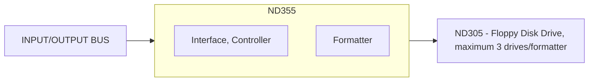

## Page 1

# ND 305 FLOPPY DISK DRIVE, 308 Kb  
# ND 355 Controller/Formatter for ND 305

## INTRODUCTION

The ND 305 — Floppy Disk Drive (Shugart SA800), and the ND 355 — Controller/Formatter, is a low-cost storage system for the NORD computer family.

## FEATURES

- Soft sectoring — sectors may be in any sequence around the track
- Programmable formats
- Internal 1 Kword buffer for increased performance
- IBM compatible formats

The Floppy Disk System may be used in three different ways:

- Under NORD File System as a disk for file storage (available with SINTRAN III/VS only)
- As a Load Device for initial system load
- As a sequential read/write device without file system

```
[Photo: Floppy Disk Drive Unit]
```

---

305/355—B1—1500—1179

Scanned by Jonny Oddene for Sintran Data © 2010

---

## Page 2

# PRODUCT DESCRIPTION

## Formatter

The Formatter will control up to three Floppy Disk Drives. It contains all CPU interface logic, housing, and power supplies for operating the disk drives. A 1 Kword buffer is built into the control logic for increased performance.

## Compatibility

The Formatter supports three different programmable formats:

- ND format, identical to IBM S/32-II
- IBM 3740 — key-to-disk system
- IBM 3600 — bank terminal

# CONFIGURATION



# SPECIFICATIONS

## Floppy Disk System

- **Model**: Shugart SA800

### Media

- **Storage Temperature**: 10 to 50°C

### Unit

- **Operating Temperature**: 15 to 32°C
- **Relative Humidity**: 20 to 80%
- **Vibration**: 5 to 300 Hz, 0.04 mm to 0.3 g

### Recording

- **Density**: 3200 bpi (6400 flux changes)
- **Wear**: Approximately 200,000 passes/tracks with head in contact

### Access Time

- **Track to Track**: 10 m/step plus 10 ms settling time

### Other

- **Rotational Speed**: 360 rpm

### Performance

- **Average Rotational Latency**: 83 ms
- **Head Load Time**: 35 ms
- **Average Access Time for n Steps**: (10•n + 10 + 83 + 35) ms = (10•n + 128) ms
- **Transfer Rate to/from Buffer**: 31.25 Kbytes/second

## Data Capacity

| Format           | Sectors/track | Bytes/sector | Bytes/diskette |
|------------------|---------------|--------------|----------------|
| IBM 3740 format  | 26            | 128          | 256256         |
| IBM 3600 format  | 15            | 256          | 295680         |
| ND format and IBM S/32-II | 8  | 512          | 315392 (156 pages total) |

All diskettes have 77 tracks.

---

## Contact Information

### Norway
- NORSK DATA A.S
- Jerikoveien 20, Box 4 Lindeberg gård
- OSLO 10
- Tel. 02-9161, Tlx. 18661 nd no

### Denmark
- NORSK DATA ApS
- Øverødvej 5
- 2840 HOLTE
- Tel. 02-425055, Tlx. 37725 nd dk

### West Germany
- NORSK DATA DEUTSCHLAND
- Abraham-Lincoln-Str. 30
- 6200 WIESBADEN
- Tel. 06121-764202, Tlx. 4186370 noda d

### Sweden
- ND NORSK DATA AB
- Kanalvägen 3, Box 203
- 194 02 UPPLANDS VÄSBY
- Tel. 0760-86500, Tlx. 13528 nordata s

### France
- NORSK DATA FRANCE
- "Le Brévent", Avenue du Jura
- 01210 FERNEY-VOLTAIRE
- Tel. 050-405786, Tlx. 38563 nordata fernv

### U.S.A.
- NORSK DATA N.A., Inc.
- 65, William Street
- Wellesley, MASS. 02181
- Tel. 0617-237.7945, Tlx. 921740 norsk well

### Sweden
- ND NORSK DATA AB
- Klammerågsgatan 11, Box 9052
- 421 09 VÄSTRA FRÖLUNDA
- Tel. 031-299350

### France
- NORSK DATA FRANCE
- 120, Bureaux de la Colline
- 92213 SAINT-CLOUD-CEDEX
- Tel. 01-6023656, Tlx. 201108 nd paris

### England
- RICHARD NORTON (NORDN) Ltd.
- NORD House, 17 Balfie Street, King's Cross
- LONDON N1 9BF
- Tel. 01-2785051, Tlx. 299537 norton g

---

Note: NORSK DATA reserves the right to change specifications at any time without given notice.

---

