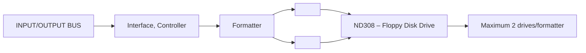

## Page 1

# ND308 Floppy Disk Drive, 308 Kb

## ND358 Controller/Formatter for ND308

### Introduction

The ND 308 — Floppy Disk Drive (Shugart SA800R), and the ND 358 — Controller/Formatter, is a low-cost storage system for the NORD computer family.

### Features

- Soft sectoring — sectors may be in any sequence around the track
- Programmable formats
- Internal 1 Kword buffer for increased performance
- IBM compatible formats

The Floppy Disk System may be used in three different ways:

- Under NORD File System as a disk for file storage (available only with SINTRAN III/VS)
- As a Load Device for initial system load
- As a sequential read/write device without file system

### Product Description

#### Formatter

The Formatter will control up to two Floppy Disk Drives. It contains all CPU interface logic, housing and power supplies for operating the disk drives. A 1 Kword buffer is built into the control logic for increased performance.

#### Compatibility

The Formatter supports three different programmable formats:

- ND format, identical to IBM S/32-II
- IBM 3740 — key-to-disk system
- IBM 3600 — bank terminal

### Specifications

| Specification       | Description          |
|---------------------|----------------------|
| Floppy Disk System  | Shugart SA800R       |
| Media storage temperature | 10 to 50°C   |

---

## Page 2

# Technical Specifications

## Environmental Specifications

- **Unit operating temperature**: 15 to 32°C
- **Relative humidity**: 20 to 80%
- **Vibration**:
  - 5 to 300 Hz
  - 0.04 mm to 0.3 g

## Performance Specifications

- **Recording density**: 3200 bpi (6400 flux changes)
- **Wear**: Approximately 3.5 x 106 passes/track with head in contact
- **Access time**:
  - Track to track: 8 ms/step plus 8 ms settling time
- **Rotational speed**: 360 rpm
- **Average rotational latency**: 83 ms
- **Head load time**: 35 ms

## Average Access Time

- **Formula**: Average access time for n steps = (8 • n + 8 + 83 + 35) ms = (8 • n + 126) ms

## Data Transfer Rate

- **Transfer rate to/from buffer**: 31.25 Kbytes/second

## Data Capacity

| Format              | Sectors/track | Bytes/sector | Bytes/diskette    |
|---------------------|---------------|--------------|-------------------|
| IBM 3740 format     | 26            | 128          | 256256            |
| IBM 3600 format ND  | 15            | 256          | 295680            |
| IBM S/32-II         | 8             | 512          | 315392 (156 pages total) |

All diskettes have 77 tracks.

## Contact Information

### Norway
- **NORSK DATA A.S**
  - Jerikoveien 20, Box 4 Lindeberg gård
  - OSLO 10
  - Tel. 02-391601, Tlx. 18661 nd n

### Denmark
- **NORSK DATA ApS**
  - Øverødvej 5
  - 2840 HOLTE
  - Tel. 02-425055, Tlx. 37725 nd dk

### West Germany
- **NORSK DATA DEUTSCHLAND**
  - Abraham-Lincoln-Str. 30
  - 6200 WIESBADEN
  - Tel. 06121-76420, Tlx. 4186370 noda d

### Sweden
- **ND NORSK DATA AB**
  - Kanalvägen 3, Box 2031
  - 194 02 UPPLANDS VÄSBY
  - Tel. 0760-66500, Tlx. 13528 nordata s

### France
- **NORSK DATA FRANCE**
  - "Le Brevent", Avenue du Jura
  - 01210 FERNEY-VOLTAIRE
  - Tel. 050-405876, Tlx. 385353 nordata fernv

### U.S.A.
- **NORSK DATA N.A., Inc.**
  - 65, William Street
  - Wellesley, MASS. 02181
  - Tel. 061-237-7945, Tlx. 921740 norsk well

### Sweden
- **ND NORSK DATA AB**
  - Klangfärgsgatan 11, Box 9052
  - 421 09 VÄSTRA FRÖLUNDA
  - Tel. 031-299350

### France
- **NORSK DATA FRANCE**
  - 120, Bureau de la Colline
  - 92213 SAINT-CLOUD-CEDEX
  - Tel. 01-6023366, Tlx. 20108 nd paris

### England
- **RICHARD NORTON (NORD) Ltd.**
  - NORD House, 172 Balfe Street, King's Cross
  - LONDON N19BE
  - Tel. 01-2785501, Tlx. 299537 norton g

Note: NORSK DATA reserves the right to change specifications at any time without given notice.

---

