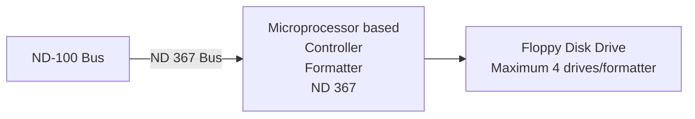

## Page 1

# ND 367 Floppy Disk Controller and Formatter

## INTRODUCTION

The ND 367 is a microprocessor based controller/formatter which performs control functions and data transfer between the CPU and a floppy disk drive.

## FEATURES

- Single board intelligent controller/formatter
- Single/double density
- Single/double sided
- Soft sectoring - 8, 15 or 26 sectors
- Programmable formats
- IBM compatible formats
- Single command copy and formatting
- 3 Kbyte buffer
- Self test
- Up to 1.2 Mbyte storage per diskette
- Extensive retrieval procedure after error
- Programmable fast data verification
- Up to 4 drivers on one controller
- DMA data transfer
- Programmable precompensation

## COMPATIBILITY

The formatter supports 12 different programmable formats. The following 8 IBM formats are included:

| IBM Diskette | Bytes/Sector | Format         |
|--------------|--------------|----------------|
| 1            | 128          | (IBM-3740)     |
|              | 256          | (IBM-3600)     |
|              | 512          | (S/32-11) ND-format |
| 2            | 128          |                |
|              | 256          |                |
| 2D           | 256          | (IBM SYS 34)   |
|              | 512          |                |
|              | 1024         | (IBM SYS 34) ND-format |



```
  ___   ___   ___   ___
 |   | |   | |   | |   |
 |   | |   | |   | |   |
 |___| |___| |___| |___|
```

---

## Page 2

# Product Description

ND 367 Floppy Disk Controller consists of an interface towards a ND-100 bus and a complete floppy disk controller, both based on an 8 bit microprocessor.

The ND-100 interface has programmed I/O and DMA control logic. Initialization of transmission takes place through programmed I/O, while all data transmission is done by DMA.

The controller itself is built up around a floppy controller chip. It has a data separator with analog phase-locked loop and programmable precompensation for writing in double density. The controller is also equipped with a "data compare" circuit for quick verification of data.

Formatting of diskettes as well as copying from one diskette to another takes place within the controller itself, in order to reduce the load on the ND-100 bus.

The floppy disk controller may be used with both single-sided or double-sided floppy drives.

```
  ____  __  __     __ 
 / ___||  \/  |   /_/ 
| |    | |\/| |  / _ \ 
| |___ | |  | | |  __/ 
 \____||_|  |_|  \___| 

Norsk Data
Jerikovveien 20
Boks 4 Lindernberg gàrd
Oslo 10
Tel.: 02-393030
Tlx: 18664 nd n

Locations:
  Bergen, tel. 05-229050
  Jønsberg, tel. 064-054004
  Tromsø, tel. 083-77864
  Stockholm, tel. 187-29660, tlx. 15255 nordata s
  Goteborg, tel. 031-229050
  Malmö, tel. 040-151885
  Copenhagen, tel. 021-75455, tlx. 37275 nd d
  Wiesbaden, tel. 06124-661, tlx. 418370 oom a
  France-Vélizy, tel. 508-455887, tlx. 894563 nerdatas simplifertv
  Paris, tel. 01-423010, tlx. 2511 nd park
  Levey, tel. 017-873477
  Newbury, tel. 04873-31445, tlx. 848919 norsk g
  Boston, tel. 617-2317945, tlx. 921975 norsex well

   ____--_ 
  /  __))   
 |  |      comtec
 |__|  
 
Norsk Data
Jerikovveien 20
Boks 4 Lindberg gàrd
Oslo 10
Tel.: 02-393030
Tlx.: 18664 nd n

Trondheim, tel. 075-16230, tlx. 56880 comtec n
Stockholm (Upplands Väsby), tel. 187-29660, tlx. 15255 nordata s
Stockholm (Solna), tel. 187-88255, tlx. 13736 wecom s
Odense, tel. 099-57440, tlx. 95921 comtec de
Ballerup (Copenhagen), tel. 02-6557extn
Düsseldorf, tel. 0211-496btc, tlx. 858727 comt d

```

**NOTE:** NORSK DATA reserves the right to change specifications without given notice!

---

