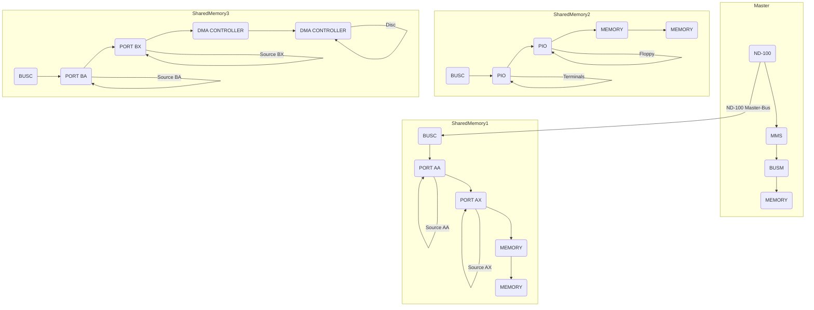

## Page 1

# MULTIPORT MEMORY SYSTEM IV

## ND 390 Bus Controller
## ND 391 Memory Port
## ND 395 ND-100 Bus Master

### INTRODUCTION

The Multiport Memory System IV (MPM IV) expands memory capacity, and parts of the hardware components may also serve as an expansion of the ND-100 bus accommodating I/O and DMA controllers. Three new ND-100 modules are included in the system:

- ND-395 Bus Master (BUSM)
- ND-390 Bus Controller (BUSC)
- ND-391 Memory Port (PORT)

In connection with the MPM IV development, several new backwirings are designed to enable different memory and I/O-configurations. They are:

| Model       | Configuration             |
|-------------|---------------------------|
| ND 393      | MPM IV - 4 BANK 4 x 6 positions |
| ND 392      | MPM IV - 2 BANK 2 x 10         |
|             | MPM IV - ND-100 15 + 6         |
|             | MPM IV - 1 BANK 5              |

### FEATURES

- May use the new 1/2 MByte EEC memory modules with 64K x 1 bit memory chips.
- Made for all present and future ND-100 CPU, memory, I/O and DMA controller modules.
- Port access compatible with previous Multiport Memory System on signal level.
- A port occupies one slot in a bank.
- The PORT module may be installed in the CPU bus of the existing ND-100. This opens for common memory in smaller configurations.
- The port can be set to check the parity of the data during a write operation. It always checks on read.
- Provides for the extension of the ND-100 bus to open for more I/O controllers.

- A special LOCK signal has been introduced as a port control signal to enable memory semaphore cycles, i.e., two consecutive memory cycles.
- The MPM IV modules may be installed in any standard ND-100 bus, e.g., a standard 22 position.

ND-bus providing 19 ports to access 1/2 MByte of memory or 1 port with access to 8 MBytes of memory or any combinations in between.

### PRODUCT DESCRIPTION

Any multiple of 16 bits (up to 128 bits) sources may access the MPM IV. Each bank supplies 16 bits of data. To achieve wider memory channels special wiring considerations are necessary.

The bank access will be controlled on the BUSC or the PORT modules providing 2, 4 or 8 way interleave. In a 2-way interleave system subsequent addresses will be directed to 2 banks, in a 4-way to 4 banks, etc.

#### Bank access controlled by switches

Shifting of the address bits for achieving the desired interleave effect is done in hardware.

No special print or cables are required.

#### Improved throughput

The ND-100 throughput may be improved, through the application of own memory channels for mass storage controllers.

The DMA will access the memory without interfering (cycle stealing) with the CPU.

390/391/395–A1–6000–0582

---

## Page 2

# ND 395 THE BUS MASTER (BUSM)

- The ND-100 BUS Master module is located in the master ND-100 CPU rack and contains line receivers/drivers for extending the ND-100 bus.
- The BUSM module will always communicate with a BUS Controller module (BUSC).
- Up to 9 BUSC modules can be connected to one BUSM module.
- Multiple BUSM modules can be installed in the main ND-100 bus.
- The maximum number of BUSC modules in a system is 32.
- The BUSM module synchronizes the memory banks via the BUSC module in each bank.

# ND 390 THE BUS CONTROLLER (BUSC)

When only I/O modules are installed in the bus the BUSC module will serve as an ND-100 bus extension.

When memory is installed in the local bus, the BUSC module will:

- Serve as a multiport memory controller including:
  - Bus allocation, administration.
  - There will be two request sources to the BUSC for accessing the local memory, the BUSM (with a GLOBAL request) and DMA or PORT requests originating in the local bus (with a LOCAL request). The priority between them is rotating or toggling. The DMA controller or PORT located closest to the BUSC will be serviced first.
  - Local memory refresh when there is no master ND-100 refresh. This can occur when the master ND-100 loses its power.
  - The BUSC will continue to function in the event of a collapse of the master ND-100.
- Serve as the master ND-100 port, including the following switch settings:
  - Interleave. Used with various ND-500 cache configurations.
  - Vital. Power failure interrupt to level 13 or 14.
  - Lower address.
  - Upper address.
  - Base address.
  
The setting of the Lower, Upper, and Base address is also displayed. Correct setting of the Lower, Upper and Base limit switches enables the master ND-100 to see all or part of the local memory.

# ND 391 THE MEMORY PORT (PORT)

The memory port module serves as the communication link between the source requesting the memory and the local memory. The PORT module contains:

- Address range switch setting (lower and upper).
- Base address switch.
- Interleave switch setting.
- Address range compare logic.
- Write parity check. (Switch settable).
- Read parity check for generating parity error to the source in the event of multiple errors.
  
The LOCK signal will prevent the bus arbiter from reallocation during two subsequent cycles. With this signal active the port will have two memory cycles without any other source being able to change the memory content in between. This feature may be used for inter-processor signalling.

Correct setting of the lower, upper and base limit switches enables the PORT to see all or part of the local memory.

# EXPLANATION OF THE FIGURE

The figure shows the flexibility of the MPM IV. A Bus Master module is installed in the bus of the master ND-100. This BUSM module converts the ND-100 bus signals into differential signals on the ND-100 master bus. The master bus is connected to the BUS Controller modules present in all the banks.

The first bank serves as a typical multiport memory system with ports and memory. The BUSC module here serves as an ND-100 port and a control module for the bank.

In the next bank containing only Programmed Input/Output (PIO) control modules the BUSC converts the master bus into a local ND-100 bus. All communication with this bank will be routed through the A-register of the ND-100 master.

The last BUSC connected to the master bus is located in a bank containing memory, ports, and DMA controllers. The BUSC serves as the ND-100 port, the bus expander and the bus controller. Note that the DMA requests are only accepted by the local memory in the bank.

# DOCUMENTATION

Technical Introduction  
Multiport IV .................... ND-10.003

---

## Page 3



### Diagram Elements

- **Master ND-100 CPU and Local Memory**: Contains ND-100, MMS, BUSM, and MEMORY.
- **Shared Memory 1**: Includes BUSC, PORT AA, PORT AX, and MEMORY.
- **Shared Memory 2**: Includes BUSC, PIO, two MEMORY modules, and connects to terminals, modem, and floppy.
- **Shared Memory 3**: Contains BUSC, PORT BA, PORT BX, DMA CONTROLLER, and is associated with disc and mag-tape.

### Connections

- ND-100 connects to BUSC of Shared Memory 1.
- PORT AA and PORT AX have Source AA and Source AX respectively.
- Terminates include terminals and modem; PIO connects to them.
- PORT BA and PORT BX have Source BA and Source BX respectively.
- DMA CONTROLLER connects to disc.

---

## Page 4

# Contact Information

| Location        | Telephone       | Telex             |
|-----------------|-----------------|-------------------|
| Oslo, tel.      | 02-909230       | 18661 nd n        |
| Bergen, tel.    | 05-20290        |                   |
| Sandnes, tel.   | 04-665544       |                   |
| Tromsø, tel.    | 083-77160       |                   |
| Stockholm, tel. | 076-690600      | 15255 nordata s   |
| Gothenburg, tel.| 031-496760      |                   |
| Malmö, tel.     | 040-157060      |                   |
| Copenhagen, tel.| 02-495656       | 37725 nd dk       |
| Wiesbaden, tel. | 0611-421541     | 4187250 noda      |
| Ferney-Voltaire, tel.| 50-405678| tk. 385553 nordata fernv |
| Paris, tel.         | 1-3023626   | tk. 270110 nd paris|
| Lyon, tel.          | 72-437475   | 7875594            |
| Newbury, tel.       | 0635-34657  | 848819 norskd g    |
| Boston, tel.        | (617) 237-7945 | 921740 norsk well|

## Oslo Office
- Olav Helses vei 5
- Boks 25 Bogerud
- Oslo 6
- Tel.: 02-295400
- Tlx.: 12884 nd n
- Telefax: 02-295617

## Jørgkoveien 20
- Boks 4 Lindeberg gård
- Oslo 10
- Tel.: 02-909030
- Tlx.: 18661 nd n
- Telefax: 02-309247

## Comtec Division of Norsk Data
- Trondheim, tel.: 075-16520, tlx. 55580 comtc n
- Stockholm, tel.: 0769-840100, tlx. 15255 nordata s
- Odense, tel.: 09-575744, tk. 19688 comtc dk
- Düsseldorf, tel.: 0211-6683688, tk. 858727 comt d

```
      ._______.                  ._______.              
     |         |                |         |             
     |  ND     |                |  ND     |             
     |  Norsk  |                |  Comtec |             
     |  Data   |                |         |             
     `._______.'                `._______.'             
``` 

> NOTE: NORSK DATA reserves the right to change specifications without notice.

---

