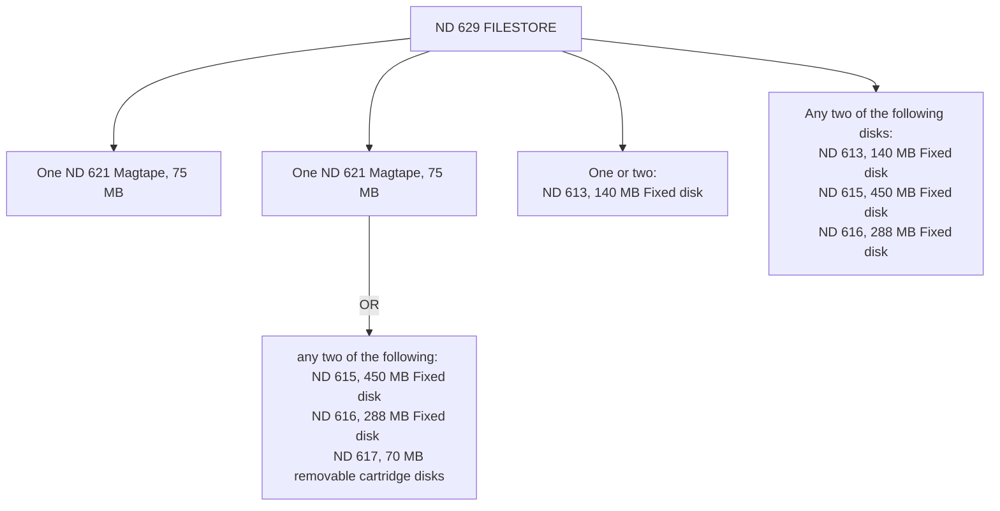

## Page 1

# Hardware Storage Systems

## ND 629 FILESTORE Disk and Magtape Cabinet for ND-100/CX and ND-500/CX SYSTEMS

### INTRODUCTION

The ND FILESTORE cabinet system is a flexible information storage system. Each FILESTORE Cabinet may contain various combinations of disks and/or magtape according to the customer’s needs. This therefore allows systems with large disk sizes to be configured in such a way as to provide greater flexibility. Through the use of the FILESTORE system, an optimal combination of fixed and removable disks can be used as backup media. No matter which combinations of storage media are chosen, a convenient backup system is available.

### FEATURES

- Increased reliability due to the state-of-the-art technology
- Excellent price per megabyte for large disk configurations
- Compact and economical packaging
- Incorporates Winchester technology for large disk units
- System flexibility in terms of combining different storage media types (removable, fixed or magtape)
- System flexibility in terms of combining different disk sizes

### PRODUCT DESCRIPTION

With The FILESTORE system you can combine various mass-storage devices in order to suit your particular needs. Combinations of magtapes, fixed and removable disks, can be placed in the FILESTORE cabinet; up to 6 disk drives (total of 2080 MB) and 1 magtape may be placed in the FILESTORE cabinet.

### FILESTORE configurations

The FILESTORE system is designed to accept combinations of the following disk and tape storage devices:

- ND 621 1/2 inch magtape drive
- ND 613 140 MB Fixed Disk
- ND 616 288 MB Fixed Disk
- ND 615 450 MB Fixed Disk
- ND 617 70 MB Removable Cartridge Disk

```
 ______________________________________
|                                      |
|              Norsk Data              |
|______________________________________|
|                                      |
|                                      |
|____________ Hardware _____________   |
|            Storage Systems           |
|______________________________________|
|                                      |
|                                      |
|                                      |
|                                      |
|__________ [Photo: Filestore] ________|
|                                      |
|                                      |
|                                      |
|______________________________________|

```

---

## Page 2

# ND 629 FILESTORE



## Technical Specifications

**Power:**

| Disk Type                        | Power (Watt) |
|----------------------------------|--------------|
| ND 613, 140 Fixed Disk           | 408          |
| ND 615, 450 MB Fixed Disk        | 250          |
| ND 616, 288 MB Fixed Disk        | 250          |
| ND 617, 70 Removable Cartridge Disk | 200          |
| ND 621, 1/2 inch Mag-Tape drive  | 360          |

NB! Power requirements for the FILESTORE system will vary according to the storage media chosen.

**Physical characteristics:**

- Height: 169 cm
- Depth: 91 cm
- Width: 60 cm
- Weight: approx. 100 to 215 kg (depending on the chosen storage devices)

## Requirements

- ND-100/CX or ND-500 computer systems
- ND 632 15 MHz Disk Controller
- ND 557 Magtape Controller (required only if the ND 621 Magtape is included in the configuration)

FILESTORE EQUIPMENT SHOULD BE INSTALLED IN A COMPUTER ROOM ENVIRONMENT FOR OPTIMUM PERFORMANCE. (For description of this environment see: ND site installation manual).

FOR FILESTORE STORAGE SYSTEMS NOT INSTALLED IN A COMPUTER ROOM:
- Temperature: 15°C to 25°C (Max 13°C to 32°C)
  Max. Gradient 3°C per Hour.
- Rel. humidity: 40% to 80%
- Electric supply: approx. 220V 50 Hz

---

![Norsk Data Logo]

Olav Helsseti vs 5  
Boks 25 Bogerud  
Oslo 6  
Tel.: 02-295400  
Tlx.: 12824 nd n  
Telefax: 02-295617

ND-Dietz GmbH:  
Mühlheim, tel. 2084143-1 tlx. 856770 dietz d

NOTE: NORSK DATA reserves the right to change specifications without notice.

---

[Photo: Additional contact information and company logos]

---

