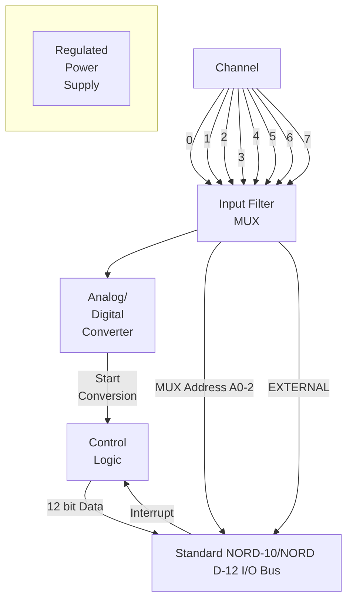

## Page 1

# ND820 ANALOG TO DIGITAL CONVERTER

## INTRODUCTION

The ND820 – Analog to Digital Converter – is a low cost medium performance data acquisition system intended for laboratory, instrumentation and process applications. The Converter requires one standard I/O slot.

## PRODUCT DESCRIPTION

The Analog to Digital Converter is physically located on one standard size NORD-10/NORD-12 module. The Converter is self-contained with power such that it may be plugged directly into a standard I/O slot.

The Converter may be operated in three different programmable modes:

- Sampling is program controlled.
- Sampling may be started by the EXTERNAL signal. An interrupt is at End of Conversion sent to the CPU. Sampling accuracy is in this case determined by the EXTERNAL signal.
- The EXTERNAL signal may be used to generate an interrupt to the CPU and the sampling is then program controlled.

## FEATURES

- 12 bits resolution
- 8 bipolar inputs
- input filter
- overvoltage protection
- external "Start Conversion" facility for high sampling accuracy

## Diagram



### Image Scanning Details

Scanned by Jonny Oddene for Sintran Data © 2010

---

Note: This is a simplified transcription of the scanned page content, maintaining the structure and appearance as close as possible. Non-text elements have been recreated in text formats appropriate for their original design.

---

## Page 2

# SPECIFICATIONS

## Hardware

| Feature                     | Specification                  |
|-----------------------------|--------------------------------|
| Resolution                  | 12 bits                        |
| Number of channels          | 8                              |
| Input voltage               | ± 10V differential             |
| Converted data              | 2’s complement notation        |
| Input filter                | 100 ms time constant           |
| Conversion time for A/D     | 25 µs                          |
| Total data acquisition time | 35 µs                          |
| Input overvoltage protection| 100V (continuously)            |

## Software

SINTRAN supports up to 8 ND820 (64 channels).

The FORTRAN calling sequence is according to ISO (Perdue) standard:

```
CALL AIRD (INUM, ILDAR, IRSAR, IVAL).
```

- **INUM**: Number of channels
- **ILDAR**: Integer array containing the channel number (0–63)
- **IRSAR**: Integer array where converted data will be stored
- **IVAL**: Error indicator

The ND820 may be operated in the desired mode by initializing the A/D Converter using the monitor call IOSET.

## IOX Instructions

### Channel selection

```
IOX <set MUX channel>
A-register bits 0-2 select channel 0-7
```

### Control word

```
IOX <load control word>
A-register:
Bit 0   Enable interrupt
Bit 1   Not used
Bit 2   Start conversion
Bit 3   Not used
Bit 4   Master Clear
Bit 5   Enable EXTERNAL Interrupt
Bit 6   Enable EXTERNAL start of conversion
Bit 7-15 Not used
```

### Status word

```
IOX <read status>
A-register:
Bit 0   Interrupt enabled
Bit 1   Not used
Bit 2   Busy
Bit 3-4 Not used
Bit 5   EXTERNAL Interrupt enabled
Bit 6   EXTERNAL start of conversion enabled
Bit 7-15 Not used
```

### Converted data

```
IOX <read data>
A-register:
Bit 0             LSB
Bit 1-10        | 2’s complement
Bit 11           MSB
```

---

| Country     | Contact Information                               |
|-------------|----------------------------------------------------|
| Norway      | NORSK DATA A/S, Jerikoveien 20, Box 4 Lindeberg gård, OSLO 10, Tel. 02-391601, Tlx. 18661 nd no |
| Denmark     | NORSK DATA ApS, Overdrevsvej 5, 2840 HOLTE, Tel. 02-425055, Tlx. 37725 ndk dk |
| West Germany| NORSK DATA DEUTSCHLAND, Abraham-Lincoln-Str. 30, 6200 WIESBADEN, Tel. 0611-264720, Tlx. 4186370 noda d |
| Sweden      | ND NORSK DATA AB, Kanalvägen 3, Box 2031, 194 02 UPPLANDS VÄSBY, Tel. 0706-86050, Tlx. 13528 nordata s |
| France      | NORSK DATA FRANCE, "Le Brévent", Avenue du Jura, 01210 FERNEY-VOLTAIRE, Tel. 050-408576, Tlx. 38563 nordata fernv |
| U.S.A.      | NORSK DATA A. N. A., Inc., 65, William Street, Wellesley, MASS. 02181, Tel. 0617-237.7945, Tlx. 921740 norsk well |
| Sweden      | ND NORSK DATA AB, Klangfärgsgatan 11, Box 9052, 421 09 VÄSTRA FRÖLUNDA, Tel. 031-299350 |
| France      | NORSK DATA FRANCE, 120, Bureaux de la Colline, 92213 SAINT-CLOUD-CEDEX, Tel. 01-6023366, Tlx. 201108 nd paris |
| England     | RICHARD NORTON (NORD) Ltd., NORD House, 17 Balfe Street, King's Cross, LONDON N1 9EB, Tel. 01-2785501, Tlx. 299537 norton g |

Note: NORSK DATA reserves the right to change specifications at any time without given notice.

Scanned by Jonny Oddene for Sintran Data © 2010

---

