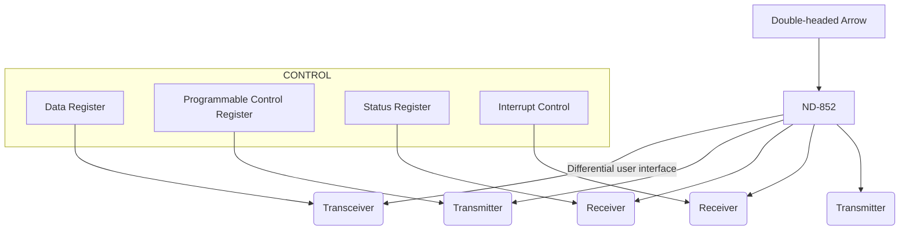

## Page 1

# ND 852 16 bit Universal DMA Interface with Differential Transceiver

## Introduction

The ND 852 16 bit Universal DMA Interface is designed to allow easy DMA interfacing to ND-100 I/O System. The interface offers bidirectional transfer capability and user defined Control and Status signals.

The ND 852 has differential line drivers and receivers, allowing user designed equipment to be located external to the ND Computer System.

The ND 852 may be used to link two ND-100 computer systems giving a high speed transmission capability with low CPU overhead.

## Features

- High speed bidirectional 16 bit parallel DMA transfers with low CPU overhead.
- 8 user programmable control lines.
- 8 user definable status lines.
- Simple «hand-shake» mechanism for transfer control.
- Both block and single word transfers.
- Fully ND 850/851 compatible.

## Diagram



```
ND-100 BUS <-> W | Transceiver | 16
-----------------|-------------|----
ND-852           | Transmitter | 8 
                 | Receiver    | 8 
                 | Receiver    |   
                 | Transmitter |
```

## Footer

Scanned by Jonny Oddene for Sintran Data © 2010

---

## Page 2

# PRODUCT DESCRIPTION

The ND 852 contains all required logic to communicate with the standard ND-100 Bus. In addition, WORD COUNTER and Memory Address Register is also taken care of. The user sees a 16-bit bidirectional half duplex data interface and 8 Function and 8 Status Lines which may be user defined.

All data transfers to/from user are controlled by a two signal «hand-shake». The interface transfers 16-bit words to/from memory. A block transfer may consist of anywhere from one word to 64 Kword. In addition, the ND 852 interface has built in a 16-bit DATA Register which may be used for single word CPU controlled transfers using the IOX I/O instruction.

The interface may be put in Test Mode where the external «hand-shake» signals are disabled. The interface will request a DMA input or output transfer whenever the DATA Register is loaded or read by the CPU.

# SPECIFICATIONS

ND 852 requires one standard I/O slot.

## BIDIRECTIONAL SIGNALS:

| **DATA 0—15** | Data transmitted or received dependent upon the direction signal OUTPUT. |

## OUTPUT SIGNALS:

| **DMA ACTIVE** | 1 = DMA active. 0 = End of Block. |
| **OUTPUT**     | Direction control.                |
| **CONT 0—7**   | User defined control bits.        |

## INPUT SIGNALS:

| **REQUEST**    | Indicates that another DATA cycle is requested. Means «Data Accepted» in output mode and «Data Valid» in input mode. |
| **ABORT**      | Premature termination of data block. Clears DMA ACTIVE and causes interrupt.                                         |
| **STAT 0—7**   | User defined status bits. STAT 7 may be used as an attention function, i.e. when interrupt enabled this bit will cause interrupt independent of whether transfer is going on or not. |

| **STATLATCH 1** | Latches STAT 0—3 when high. Register transparent when low. |
| **STATLATCH 2** | Latches STAT 4—7 when high. Register transparent when low. |
| **BUSY**        | Signal that may disable RFT interrupt.                      |

## ND 852 Electrical Specifications

Drivers are 26LS31 or equivalent.  
Receivers are 26LS32 or equivalent.

## SIGNALS

| **RESET**       | 0.2-1 µs pulse generated by programmed clear or master clear.              |
| **CONSTROBE**   | 0.2-1 µs pulse when CONT 0-7 are loaded. CONT 0-7 are valid when CONSTROBE is high. |
| **COMPLETE**    | Indicates that one DATA cycle is complete. Means «Data Valid» in output mode and «Data Accepted» in input mode. |

```
[Logos: Norsk Data, ND Comtec]
```

```
[Contact Information for Various Locations]
Oslo, Bergen, Sandnes, etc.
[Addresses, Telephone and Teletype Information]
```

```
[Photo: Jonny Oddene for Sintran Data © 2010]
```

_NOTE: NORSK DATA reserves the right to change specifications without notice_

---

