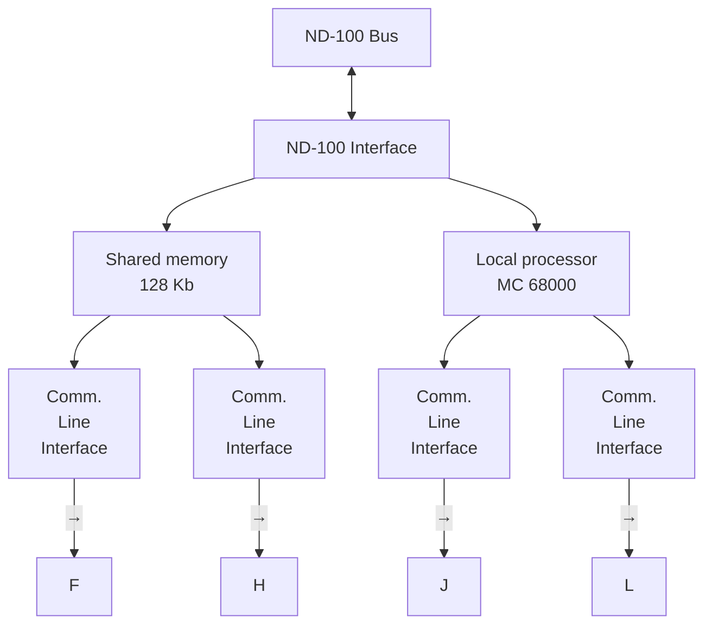

## Page 1

# ND 857 PIOC, Basic System, 4 Lines, ND-100

_Only available by special agreement_

Includes monitor, PLANC and X-message for the PIOC

## Introduction

The ND 857 Programmable I/O Controller is an interface card for the ND-100 machine. It is capable of handling 4 full duplex communications lines, and will relieve the ND-100 of much of the communication protocol overhead. It is equipped with a local processor, MC 68000, and a 128 Kbyte Random Access Memory (RAM) with debugging facilities. The RAM is also accessible directly from the ND-100, and each communication channel has DMA access to the local RAM.

## Features

- 4 full duplex channels with DMA in both directions
- RS 232 C (V24/V 28) and RS 422 (V 11 = X 27) interface on all channels
- Synchronous HDLC, SDLC or BISYNC and Asynchronous modes
- Speed up to 800 Kbits/s on one line or 38 Kbits/s on all lines simultaneously, depending on protocol overhead
- 128 Kbyte shared memory with single error correction
- Powerful local processor MC 68000

## Software

Users are free to develop their own PIOC programs in MC 68000 assembler or in a high level language, PLANC.

PIOCOS is a real time monitor to run in PIOC. PIOCOS supports multiprogramming. PIOCOS provides the following functions:

- Process initiation and scheduling
- Interprocess communication and synchronization
- Timing
- Exception handling
- Dynamic process control
- ND-100 communication

## Diagram



---

857–A1–6000–0781

---

## Page 2

# Technical Document

A subset of the XMSG-TASK-TASK-MESSAGE SYSTEM of SINTRAN III is implemented in PIOCOS. Processes in PIOCOS communicate with each other, and synchronize their activities by means of messages which are transmitted and received over ports. For a general description of XMSG, consult the manual: SINTRAN III SPECIAL I/O GUIDE, ND-60.134.01

The PIOC and ND-100 will operate on common memory. This memory must be allocated as a continuous 64K word segment in SINTRAN III. The RT-loader must be used for defining continuous segments. The PIOC MONITOR must be used for loading the segments.

Programs to be loaded in PIOC must be compiled by the PLANC-PIOC compiler, which will produce a relocatable module in ND Relocatable Format (NRF). Various NRF modules must be linked together by the ND Linkage-Loader (NLL) to a module (domain) ready for loading and execution by PIOC MONITOR.

The PIOC MONITOR is a program running in the ND-100 for loading, supervising and controlling PIOC. A specific monitor call in SINTRAN III is used by the MONITOR for communication with PIOC.

## The basic software available for PIOC further consists of:

- Cross assembler on ND-100
- Plane compiler on ND-100 that generates MC 68000 code
- Micro Monitor, small executive in MC 68000 to ease application programming and enable multiprogramming of the MC 68000
- PIOC debugger on ND-100 allows breakpoints, inspection and modification of PIOC memory from a ND-100 terminal
- Basic PIOC serial link drivers for HDLC mode/synchronous and asynchronous character mode
- Loader which builds PIOC memory image on a ND-100 file (segment) for loading into the PIOC

# Hardware

The 64 Kwords in PIOC are directly accessible from the ND-100, as in every other memory. ND-100 and MC 68000 communicate via addresses in the common memory. One mailbox is used for each direction, and each mailbox has its own status word, which only takes up one bit.

The RAM memory is equipped with a protection mechanism to protect against writing from input DMA and 68000 user.

The I/O circuits on the card are only accessible from MC 68000.

The line interface consists of four equivalent parts, and can handle 4 full duplex channels. The serial controllers may be programmed for either asynchronous or synchronous transmission, and can be used for both bit-oriented (HDLC) and byte-oriented procedures.

Maintenance mode may be set directly from the program.

```plaintext
  ____
 /0  0\
|      |  Norsk Data
|______
```

```plaintext
 _______
| COMTEC |
|________|
``` 

Note: Contact information and various addresses are available below the main text body, belonging to Norsk Data and Comtec with different location-specific telephone numbers and postal addresses.

---

