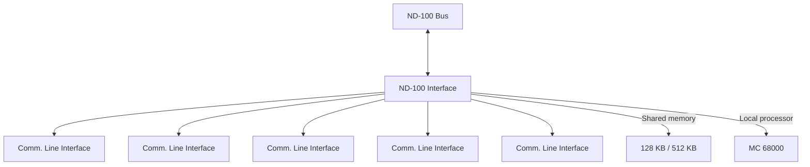

## Page 1

# Hardware Input/Output Controller

## ND 865/ND 867 PIOC
### Programmable Input/Output Controller



**Programmable I/O Controller (PIOC)**

## Introduction

The ND 865/ND 867 Programmable Input/Output Controller is a processor board for the ND-100 Computer Systems. It is capable of handling four full duplex communication lines, thereby relieving the ND-100 computer of much of the communication protocol overhead. It is equipped with a local processor, MC 68000, and a total of 128 Kbyte or 512 Kbyte Random Access Memory (RAM) with memory protection mechanism. The RAM is also accessible directly from the ND-100 computer. Each communication channel has bidirectional direct memory access (DMA) to the local memory.

## Features

- Four full duplex channels with bidirectional DMA
- RS 232 C (V.24/V.28) and RS 422 (V.11/X.27) interface on all channels
- Synchronous HDLC, SDLC or BISYNC and Asynchronous modes
- Speed up to 820 Kbits/s on one line or 38 Kbits/s on all lines simultaneously
- 128/512 Kbyte shared memory with single error correction and DMA access
- Power failure recognition and recovery
- Real-time clock
- Powerful local processor MC 68000 with 8 MHz clock frequency

---

## Page 2

# Product Description

The 128 K/512 Kbytes in PIOC are directly accessible from the ND-100 computer. The ND-100 computer and MC 68000 processor communicate via addresses in the common memory.

The RAM memory is equipped with a protection mechanism to protect against writing from input DMA and MC 68000 user. The memory is divided into segments of 512 bytes. Write access to each segment is controlled by a bit in a protection table. The protection table is set up by the PIOC operating system.

The input/output circuits on the board are only accessible from MC 68000.

Baud rates are individually programmable on all four channels. Baud rate is set by changing a counter register in the AM 9513 system timing controller. Possible baud rates are calculated by the following algorithm:

```
Synchronous baud rate = 4915200/(2 * N)
Where N varies from 3 to 65535

Asynchronous baud rate = 4915200/(2 * N * 16)
Where N varies from 1 to 65535
```

The line interface consists of four equivalent parts, and can handle four full duplex channels. The serial controller (Z80-SIO) may be programmed for either synchronous or asynchronous transmission and can be used for both bit-oriented (HDLC/SDLC) and byte-oriented procedures.

The ND 865 PIOC has 128 Kb of shared memory while the ND 867 PIOC has 512 Kb of shared memory.

# Requirements

ND-100 Computer System.

# Documentation

PIOC Hardware Reference Manual  
ND-865 and ND-867.................................ND-02.004

```
+-------------------------------------------+
|               [Photo: ND Logos]           |
+-------------------------------------------+
```

# Contact Information

| Location      | Details                                                 |
|---------------|---------------------------------------------------------|
| Oslo          | tel. 02-309030, ttx. 18661 nd n                         |
| Bergen        | tel. 05-20360                                           |
| Sandnes       | tel. 04-665769                                          |
| Tromsø        | tel. 083-771662                                         |
| Trondheim     | tel. 07-921222, ttx. 55580 nd trd                       |
| Stockholm     | tel. 790-9300, ttx. 15255 nordata s                     |
| Gothenburg    | tel. 031-49670                                          |
| Malmö         | tel. 040-25160                                          |
| Copenhagen    | tel. 01-252565, ttx. 37275 nd dk                        |
| Århus         | tel. 06-12055                                           |
| Farum, Holte  | tel. 080-3816, ttx. 38563 nordata ferv                  |
| Paris         | tel. 1-42303266, ttx. 20016 nd paris                    |
| Leuven        | tel. 016-31030, ttx. 37907 norvin                       |
| Lausanne      | tel. 041-29122, ttx. 26218 nd ld                        |
| Newbury       | tel. 0635-35544, ttx. 849819 norsk g                    |
| London        | tel. 1-586 9936                                         |
| Manchester    | tel. 061-881 6764                                       |
| Bussum        | tel. 0329-38763, ttx. 40940 nd nl                       |
| Los Angeles   | tel. 213-737-7945, ttx. 921740 nordat well              |
| Cerritos      | tel. 213-926-5051, ttx. 678401 tab irvin                |
| Bern          | tel. 03-810150                                          |
| Milan         | tel. 51-6072111                                         |
| Hanover       | tel. 51-89829441, ttx. 856770 nd d                      |
| Stuttgart     | tel. 89-352065                                          |
| Abraham Lincoln Str. 30 | tel: 06-1 48764, fax: 12106                   |
```

---

