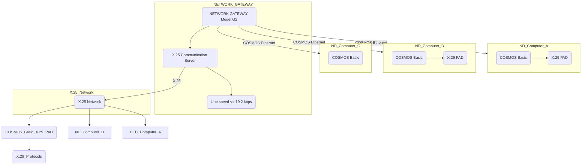
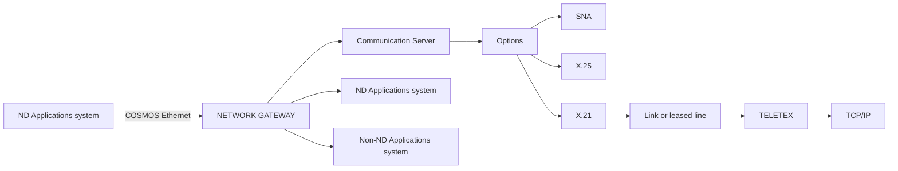

## Page 1

# ND Network Gateway

## A New Network Gateway Server

- ND 9801 Network Gateway G1
- ND 9802 Network Gateway G2
- ND 9803 Network Gateway G3
- ND 9804 Network Gateway G4

[Photo: Network Gateway setup with servers and connections]

ND  
Norsk Data  

Scanned by Jonny Oddene for Sintran Data © 2010

---

## Page 2

# ND Network Gateway

## Introduction

In the field of solutions for integrated information processing, data communication grows in importance. It has become essential to integrate not only those systems residing in the local environment, but also remote systems.

Implementation of the solution often entails integration of separate systems. For reasons of efficiency, as well as structural demands, gatewaying of the communication activities is desirable. It is an advantage to off-load the actual communications handling from the application-oriented systems.

Therefore, we are introducing a dedicated communications system called Network Gateway. The cabinet is of the Satellite type, while the processor is the new ND-120/CX. The ND-120/CX has approximately 80% better performance than the ND-110/CX in the communication area.

There are four fixed configurations available: Network Gateway models G1 to G4. They are intended to cover the most frequent demands. It is possible to expand the Network Gateway with more communication software, cards and controllers (see figures 5 and 6).

## Features and Benefits

- Simplified configuration of LAN networks comprising several systems.
- Off-loads communications from backend servers.
- Easier Network Management. Communication software and lines only dedicated on Network Gateways.
- Higher availability of communication resources. No backup required unless new communication hardware/software versions are installed or the system configuration is modified.
- Pre-defined combination of functions that work together.
- All ND systems in a COSMOS network can share the communication resources.
- Reduced "engineering" during installation.
- The Network Gateway can easily be expanded to serve different types of communication solutions.

## Network Gateway Series

All Network Gateway systems are equipped with:

- ND Satellite cabinet
- ND-120/CX CPU including 4 MB on-board memory
- Disk/streamer/floppy controller
- 125 MB disk
- 125 MB streamer-tape drive for backup
- 1.2 MB floppy-disk drive
- SINTRAN
- All standard utility programs, including User Environment

- COSMOS Basic Module
- COSMOS Ethernet Option
- Ethernet II Controller
- Ethernet transceiver cable, 15 m

The four different models of the Network Gateway are realised by adding communications software, cards and controllers.

## Network Gateway Model G1 (ND 9801)

Model G1 provides communication to IBM’s SNA world from all computers in the COSMOS network (LAN or WAN).

The only communication software the local ND computers need (those using the server) is a COSMOS connection and the SNA user programs:

- ND 210742 SNA 3270 Terminal Emulator
- ND 210306 SNA RJE Support
- ND 211048 NOTIS-DISOSS Bridge for ND-100/110
- ND 211127 NOTIS-DISOSS Bridge for ND-500/5000

Model G1 includes ND 210741 SNA Gateway - single line and a PIOC (Programmable Input Output Controller). The PIOC is a dedicated communication controller with a Motorola 68000 processor and 1/2 MB memory for the SNA protocols.

### Figure 1

```plaintext
     ND Computer A                     ND Computer B                    ND Computer C

  +---------------+                 +---------------+                +---------------+
  | SNA Term. em. |                 | SNA Term. em. |                | SNA Term. em. |
  | SNA RJE Supp. |                 | NOTIS - DISOSS|                | COSMOS Basic  |
  | COSMOS Basic  |                 | Bridge        |                +---------------+
  +---------------+                 | COSMOS Basic  | 
                                    +---------------+
      COSMOS Ethernet                      |
                                          COSMOS Ethernet
                                              |
                              +---------------+
                              | NETWORK       |
                              | GATEWAY       |
                              | Model G1      |
                              +---------------+
                                      |
                              SNA Communication Server 
                                      |
                Leased line <= 64 kbps
                X.21 with black box <= 9.6 kbps (Max. speed PTT)
                                      |
                                     IBM
                                  (370, 30XX, 43XX, 8XXX, S/3X, 9370)

Configuration example for Network Gateway Model G1

Systems A, B and C can run applications on the IBM. System A can also send jobs to the IBM and get the result back on any ND file or printer in the COSMOS Network. System B has a NOTIS-DISOSS link.
```

---

## Page 3

# ND Network Gateway

## Features and Benefits

- Provides access to IBM SNA networks. SNA is now a de facto worldwide communication standard.
- Communication to IBM 370, 30XX, 43XX, 8XXX, S/3X, 9370.
- All ND terminals and printers can be used as IBM peripherals.
- Possible to log on to ND's COSMOS systems from IBM's SNA terminals.
- Remote job entry, database access and DISOSS integration are supported through the SNA gateway.
- All ND systems can share one or several SNA Gateways.

## IBM Emulation with Model G1

The SNA Gateway supports five different types of IBM SNA LU types (0, 1, 2, 3, 4). An LU (Logical Unit) is equivalent to terminals, printers, and programs talking to the CPU. Up to 65 LUs, independent of their type, can be defined in the Network Gateway Model G1.

With a 9.6 kbps line to IBM, the Gateway can serve about 16 simultaneous ND-SNA 3270 users from the COSMOS network. With a faster 64 kbps line, about 25 simultaneous ND-SNA 3270 users can be served.

An SNA supervisor module is included to define, configure, start/stop and trace the ND-IBM communication line.

## Expansion

Model G1 can be expanded with ND 210616 SNA Gateway - Multiline software. This software provides two physical lines from the Gateway to the same or two different IBM computers.

Further upgrading to four physical SNA lines is possible by adding another PIOC with SNA Multiline software.

If more SNA Gateways are required, there is no limitation in the number of Network Gateways in a COSMOS network.

The upgrading possibilities are illustrated in figures 5 and 6.

## Network Gateway Model G2 (ND 9802)

Provides communication worldwide across the X.25 network.

Model G2 includes ND 210570 COSMOS X.25 Option for PIOC and an ND 108670 PIOC (Programmable Input Output Controller).

Products using X.25 as a transport medium include: COSMOS Basic Module, NOTIS-ID (Electronic Mail), COSMOS X.29 PAD/Server, the ND Coloured Books family of products and ND OSI products.




## Features and Benefits

- X.25 is now a worldwide standard for sending data over WANs.
- Transparent ND-to-ND communication over X.25. Log-in, file transfer, mail, and program-to-program.
- Connection to ND databases with X.29 Server over X.25.
- Connection to other vendors’ databases with X.29 PAD over X.25.
- Mail, remote log-in and file transfer to/from other vendors over the X.25 network with the Coloured Books set of protocols.
- Program-to-program communication over X.25 with OSI transport protocols.
- All ND systems can share one or several X.25 Gateways.

## The X.25 Network and COSMOS X.25 Users

Communication through an X.25-based packet-switched network is similar to the handling of mail. The data is sent from the source computer through the network until the destination computer has received all the packets. Each communication "line" is then called a virtual circuit. COSMOS handles 16 virtual circuits to different DTE numbers at any given time. Several COSMOS users can then share one of the virtual lines to one destination. ND recommends up to 16 simultaneous incoming or outgoing users through the X.25 gateway.

---

## Page 4

# ND Network Gateway

## Network Gateway Model G3 (ND 9803)

Provides communication across links/leased lines or the X.21 network.

Model G3 includes ND 210403 COSMOS X.21 Option and two ND 107030 HDLC Cards.

The X.21 network is available in Norway, Sweden, Denmark, Finland, Germany and certain other countries. The PTTs offer an X.21 network speed from 600 bps to 9.6 kbps.

Products using X.21 as a transport medium include: COSMOS Basic Module, NOTIS-ID (Electronic Mail) and program-to-program communication like SIBAS frontend/backend.

A combination of link/leased line to one destination and an X.21 connection to other destinations is possible with this configuration.

It is possible to use one of the HDLC lines as a TELETEX Gateway with ND's TELETEX modules. The TELETEX modules are different for each country, and are for this reason not included.

### Figure 3

```plaintext
ND Computer A           ND Computer B           ND Computer C

COSMOS Basic            COSMOS Basic            COSMOS Basic
NOTIS-ID                NOTIS-ID                NOTIS-ID

     |                        |                        |
     |                        |                        |
     +------------------------+------------------------+
                  COSMOS Ethernet

              NETWORK
             GATEWAY
            Model G3

     |                        |                        |
X.21 line              Link            Link
<= 9.6 kbps   / Leased line and        <= 76.8 kbps
            X.21 (Communication        / Leased line
             Server TELETEX is         <= 64.0 kbps
              also possible)

            X.21 Network  
```

- When configured with leased lines, Model G3 provides the best communications solution when fast response times are of the essence and data traffic between the different locations is heavy.

### COSMOS over X.21 between Computer A, B or C to D or E in Figure 3:

Circuit-switched networks based on the X.21 standards can also be used as a "carrier" in a COSMOS network. When two computers communicate through an X.21-based network, what happens is quite similar to a conversation over an ordinary telephone line. As soon as a connection is established, the line is reserved for the two communication partners. This provides almost the same speed as a leased line as soon as the connection is established. The Norwegian PTT guarantees a connection time of less than 100 ms in 90% of the calls, and a disconnect time of less than 50 ms for 90% of the calls.

COSMOS X.21 Option has support for SHM/MPS (Short Hold Mode/Multiple Port Sharing). SHM means automatic disconnect/connect if one line is idle for more than 1 to 3 seconds (optional parameter). MPS means one common group number for the two X.21 lines.

The upgrading possibilities for Network Gateway Model G3 are illustrated in figures 5 and 6.

## Network Gateway Model G4 (ND 9804)

Model G4 provides TCP/IP communication to and from other TCP/IP versions from any ND computer in a COSMOS network.

The TCP/IP-Ethernet set of data-communication protocols is a de facto standard for networking in a multi-vendor environment. The TCP/IP class of products will allow ND and non-ND computers to communicate within the same network.

Model G4 includes ND 211185 COSMOS TCP/IP Gateway and ND 110063 Ethernet II Controller for the TCP/IP communication. The only communication products the local ND computers need are COSMOS Ethernet and the TCP/IP user program ND 211154 Telnet/FTP Client.

### Figure 4

```plaintext
ND Computer A       ND Computer B       ND Computer C       Digital

COSMOS Basic        COSMOS Basic        COSMOS Basic
TCP/IP Client       TCP/IP Client       TCP/IP Client

     |                   |                   |               TCP/IP
COSMOS             TCP/IP            COSMOS and              protocol
                                      TCP/IP Ethernet

                 NETWORK
                GATEWAY
               Model G4

                       COSMOS TCP/IP Communication Server
```

COSMOS and TCP/IP communication on the same Ethernet cabling system. With Model G4, any ND computer in the COSMOS network (LAN or WAN) can share the TCP/IP Gateway.

## Features and Benefits

- Transparent ND-to-ND communication over links, leased lines and/or circuit-switched network based on the X.21 standards.
- Log-in, file transfer, remote spooling, mail and program-to-program communication between several customer sites.
- The X.21 network is cost effective, since several local offices can share one or two physical X.21 lines.

Configuration example for Network Gateway Model G3. Six ND computers are interconnected with COSMOS functions and electronic mail.

---

## Page 5

# ND Network Gateway

Most vendors now support the TCP/IP standards, but there are still incompatible implementations. To verify the communication between ND and each new non-ND vendor, ND or the customer should test and verify the TCP/IP communication protocols. ND's head office has a rapidly growing list of TCP/IP vendors who conform to ND's TCP/IP implementation.

## Features
- Log-on to and from other vendors, like DEC, IBM, Unisys, NCR, Honeywell Bull, SUN, Apollo and others who have implemented the TCP/IP protocols.
- File transfer to and from other vendors, like DEC, IBM, Unisys, NCR, Honeywell Bull, SUN, Apollo and others who have implemented the TCP/IP protocols.
- Telnet provides application access to other vendors' computers for approximately eight terminals simultaneously from the COSMOS environment.
- Telnet provides terminal access from other vendors' computers for approximately four terminals simultaneously to ND applications in the COSMOS network.
- FTP allows for file transfers simultaneously over the gateway.
- Multiple files transferred in one operation and with one command.
- Files can be transferred as batch or mode jobs at specified time intervals.
- The security system of ND is retained. When users of other vendors' systems use TCP/IP to log on to an ND system, they must first pass through ND's security system in USER ENVIRONMENT in the Gateway.

## Benefits
- Allows customers to integrate ND equipment with existing or planned equipment from other vendors. This enables the customer to protect his software investment and allows him to expand his computing needs independently of one specific supplier.
- Existing applications, wherever they are located, can be run from any computer as if you were physically connected to it.
- The Network Gateway is cost-effective, since all computers linked to a COSMOS Network can share one TCP/IP Gateway.
- The TCP/IP Gateway can be expanded to handle external communications over X.25 or X.21. Computers from other vendors, located on different ND LANs, can thus share information over the public network.

## Expansion
It is possible to expand the Network Gateway Models G1 to G4 with additional communications software, cards and controllers until all slots in the gateway are filled.

### Figure 5


### Figure 6
| Config. alternatives | SNA PIOC | X.25 PIOC | HDLC, X.21 link / line | TCP/IP ETH. |
|---------------------|-----------|-----------|------------------------|-------------|
| G1 either           | 2         | 1         | 1                      | 1           |
| or                  | 1 1       | 1         |                        |             |
| or                  | 1         | 2         |                        |             |
| or                  | 1         | 1         | 1                      | 1           |
| G2 either           |           | 1         | 1                      | 1           |
| or                  | 1 1       | 1         |                        |             |
| or                  | 1         | 2         |                        |             |
| G3 either           |           | 1         | 2                      |             |
| or                  | 1         | 2         |                        |             |
| G4 either           |           | 1         | 1                      | 1           |
| or                  | 1 1       | 1         |                        |             |

*The maximum configuration alternatives for the Network Gateway Models G1 to G4.*

## Documentation

- Network Gateway - Operator Guide ............... ND-30.104
- All available documentation on COSMOS, ND-SNA and TCP/IP.

---

## Page 6

# Corporate Headquarters

### NORWAY
- P.O. Box 70, Bogerud
- N-0621 Oslo 6
- Tel.: +47-2 626000

### NOCOMTEC
- P.O. Box 70, Bogerud
- N-0621 Oslo 6
- Tel.: +47-2 626000
- Hotline 24 h: +47-2 982466

### ND INTERNATIONAL OPERATIONS
- Oluf Onsums vei 6
- N-0623 Oslo 6
- Norway
- Tel.: +47-2 620200 (A)

### SWEDEN
- ND Norsk Data AB
- Box 51
- S-191 27 Upplands Väsby
- Tel.: +46-8 590 98000

### ND SILVIDATA SWEDEN
- 851 83 Sundsvall
- Sweden
- Tel.: +46-60 154150

### DENMARK
- ND Dansk Data A/S
- Lautruphej 13
- P.O. Box 220
- DK-2750 Ballerup
- Tel.: +45-2 886165

### FINLAND
- Oy Norsk Data Ab
- Pukinmäenkuja 2
- Box 485
- SF-0071 Helsinki 70
- Tel.: +358-0 3226111

### UNITED KINGDOM
- Norsk Data Ltd.
- Newbury, Berks
- England
- Tel.: +44-635-310223

### WEST GERMANY
- Norsk Data GmbH
- Nonnestasse 10-12
- 630 Bad Homburg v.d H.
- West Germany
- Tel.: 49-6172 48720

### BELGIUM
- Wordplex Belgium S.A.
- Excelsiorlaan 25
- 1930 Brussels
- Belgium
- Tel.: +32-2 7251550

### FRANCE
- Norsk Data Paris
- 32 Rue Grange-Damé-Rose
- 92120 Meudon-La Forêt
- France
- Tel.: +33-1 45152700

### IRELAND
- Norsk Data Ireland Ltd. A/S
- IDA Industrial Estate, Santry
- Dublin 9
- Ireland
- Tel.: +353-1 477244

### LUXEMBOURG
- Wordplex Luxembourg
- Rue de l'Industrie No.5
- 1811 Luxembourg
- Tel.: +352-262912

### THE NETHERLANDS
- Norsk Data Nederland B.V
- Postbus 58
- 3000 AN Nieuwegein
- The Netherlands
- Tel.: 31-392 72400

### SPAIN
- Norsk Data - Wordplex España S.A.
- Passeig de Gracia 50
- 08007 Barcelona
- Spain
- Tel.: +34-3 2510572-7

### SWITZERLAND
- Norsk Data (Switzerland) S.A
- Chemin De Vidollet 12
- CH-1009 Lausanne
- Switzerland
- Tel.: +41 21 20152

### AUSTRALIA
- Wordplex Australia Pty. Ltd.
- U/14, 5 Skyline Place
- Frenchs Forest (Sydney)
- New South Wales 2086
- Australia
- Tel.: +61-2 4515133

### HONG KONG
- Norsk Data International
- 112 Wing On Cent
- 111 Connaught Road
- Hong Kong
- Tel.: +852-5 011912

### USA
- Norsk Data N.A., Inc.
- 16000 West Park Drive, Suite 150
- West Tower
- Southfield, MI 48075
- USA
- Tel.: +1-313-356-4662

### AGENTS AND DISTRIBUTORS IN:

#### FRANCE
- Matra Datavision S.A.
- Tel.: 33-086938

#### ICELAND
- Norsk Data Iceland
- Tel.: 354-1-5671

#### INDIA
- Norsk Data India Pty. Ltd.
- Tel.: +91-44 4961291/416293

#### PAKISTAN
- Norsk Data Pakistan (P) Ltd.
- Tel.: +92-51 241644

#### THAILAND
- Norsk Data Thai Ltd.
- Tel.: +662-253 5988

```
  _   _   _   _   _   _  
 / \ / \ / \ / \ / \ / \ 
( N | o | r | s | k | D )
 \_/ \_/ \_/ \_/ \_/ \_/ 
```

---

