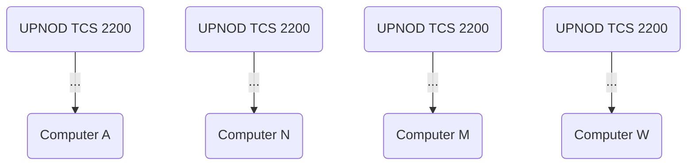

## Page 1

# UPNOD TCS 2000 - Terminal Control System

## INTRODUCTION

**UPNOD TCS 2000 is a flexible family of units for terminal handling.**  
The UPNOD TCS units have a number of basic functions that enable the use of a unit as a stand-alone system as well as a node in a terminal network. A TCS can always be incrementally upgraded to incorporate more of the possible functions.

## SUMMARY OF CAPABILITIES

- **Port Contention Unit**

  The TCS enables the connection of more terminals than the number of available computer ports. Terminals are dynamically connected to computer ports. The port is declared to be free when the session is terminated.

  ```mermaid
  flowchart LR
      T -->|Terminals| A[UPNOD TCS 2000] -->|Computer| B[Computer]
  ```

- **Terminal Switch**

  The TCS enables a terminal to connect to any of several computers connected to a node.

  ```mermaid
  flowchart LR
      T -->|Terminals| A[UPNOD TCS 2000] -->|Computer A| C
      T -->|Terminals| A -->|Computer N| D
  ```

- **Multiplexer/Concentrator**

  The TCS enables several terminals/ports to share a single high-speed link by concentrating several low/medium speed connections.

  ```mermaid
  flowchart LR
      TerminalI --> A[UPNOD TCS Z206]
      TerminalN --> A[UPNOD TCS Z206] -->|Computer| B[UPNOD TCS Z206]
  ```

---

A1-6000-0382

---

## Page 2

# Local Area Networks

Interconnecting several TCS units located in the same or nearby buildings gives a local area network which allows all computing resources to be accessible from anywhere in the local area. Several nodes connected via multiplexed lines behave as one switching system.

# Regional Networks

By connecting single TCS units or units that are members of a local area network with each other, using leased lines from the public carrier network, computing resources from an entire region may be efficiently shared by all terminals connected to nodes in the region.



# Physical Data

The TCS 2000 is available in 4 standard sizes.

|                             | TCS 2000 Basic Sizes |
|-----------------------------|----------------------|
|                             | 24   | 56   | 112  | 224  |
| Maximum number of           |      |      |      |      |
| 8 channel I/O cards         | 3    | 7    | 14   | 28   |
| CPU-2000 cards              | 3    | 7    | 14   | 18   |
| Floppy-disk                 | option | option | option | option |
| Dimensions (mm)             |      |      |      |      |
| Height                      | 266  | 1060 | 1327 | 1861 |
| Width                       | 450  | 567  | 567  | 567  |
| Depth                       | 365  | 849  | 849  | 849  |
| Power consumption (W)       | 250  | 300  | 400  | 800  |
| Temperature                 | 10–35°C             |
| Relative humidity           | 30–90% non condensing |
| Power                       | 220 V AC ± 10%      |
|                             | 47–63 Hz            |
| Sound level                 | < 30 dB             |

---

## Page 3

# Technical Data

## Local Ports/Lines
| Property                  | Value         |
|---------------------------|---------------|
| Number of ports           | 8–224         |
| Number of ports/card      | 8             |
| Asynchronous comm.        | x             |

## Interface
| Type                      | Supported     |
|---------------------------|---------------|
| v. 24/V. 28               | x             |
| Current-loop 20 mA        | x             |
| RS-422                    | option        |
| Optoisolation             | x             |

## Contacts
| Contact Type              | Supported     |
|---------------------------|---------------|
| DSUB                      | x             |
| DIN                       | option        |
| Customer-spec.            | option        |

## Transmission Speeds
| Speed                     | Value         |
|---------------------------|---------------|
| Transmission-speeds       | 8 selectable speeds 50–19,200 Baud |

## Other Specifications
| Specification             | Value         |
|---------------------------|---------------|
| Autobaud                  | x             |
| Number of data-bits       | 5–8           |
| Number of stop-bits       | 1, 1.5, 2     |
| Number of status signals transferred in each direction | 2 |
| Parity                    | none/even/odd |

## Trunks
| Property                  | Value         |
|---------------------------|---------------|
| Interface RS-422          | option        |
| RS-232-C                  | x             |
| Optolink                  | option        |
| Number of trunks          | <= 10         |
| Trunk-protocol            | TDM and SMX   |
| Error-control/correction  | x             |

## Speeds
| Speed                     | Supported     |
|---------------------------|---------------|
| 2400–9600                 | x             |
| 9600–100 k                | x             |

## Auxiliary
| Feature                   | Availability  |
|---------------------------|---------------|
| Floppy-disk               | option        |
| Battery-back-up           | option        |

# Vendor

UPNOD AB, Box 23051, S-750 23 Uppsala, Sweden  
Tel.: +46 18 11 95 40

---

## Page 4

# Contact Information

## Norsk Data

**Address:**
Olav Helssets vei 5  
Boks 25 Bogerud  
Oslo 6  
Tel.: 02-995400  
Tlx.: 18284 nd  
Telefax: 02-295617

**Locations:**

| City        | Phone            | Telex    | Note                |
|-------------|------------------|----------|---------------------|
| Oslo        | 02-390300        | 18661 nd n |                     |
| Bergen      | 05-243590        |          |                     |
| Sandnes     | 04-66554         |          |                     |
| Tromsø     | 83-72516         |          |                     |
| Stockholm   | 0760-92000       | 15255 nordata s |        |
| Gothenburg  | 031-436760       |          |                     |
| Malmö      | 040-12590        | 37725 nd dk |               |
| Copenhagen  | 01-23245         |          |                     |
| Wiesbaden   | 06121-74511      | 418765 nd      |            |
| Ferney      | 050-405136       | 38653 nordata f |         |
| Paris       | 72036263         | 301101 bd paris |          |
| Lyon        | 73-87775         | 8377 5591 |                     |
| Newbury     | 0635-34865       | 849419 norskg |           |
| Boston      | (617) 237-7945   | 921740 norsk well |  |

## COMTEC

**Address:**
Jerikoveien 20  
Boks 4 Linderberg gård  
Oslo 10  
Tel.: 02-909300  
Tlx.: 18661 nd  
Telefax: 02-309247

**Locations:**

| City         | Phone          | Telex     | Note                |
|--------------|----------------|-----------|---------------------|
| Trondheim    | 075-16520      | 55580 comtec n |               |
| Stockholm    | 0760-92000     | 15255 nordata s |              |
| Odense       | 09-157440      | 55960 comtec dk |             |
| Dusseldorf   | 0211-668368    | 858727 comtd |               |

**Note:** NORSK DATA reserves the right to change specifications without notice.

```
+----------+
| Norsk    |
| Data     |
|  Logo    |
+----------+

+----------+
| COMTEC   |
|  Logo    |
+----------+
```

---

