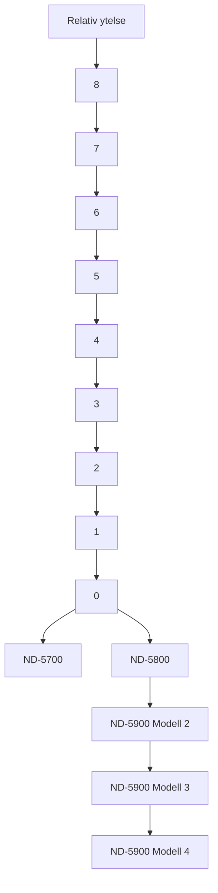
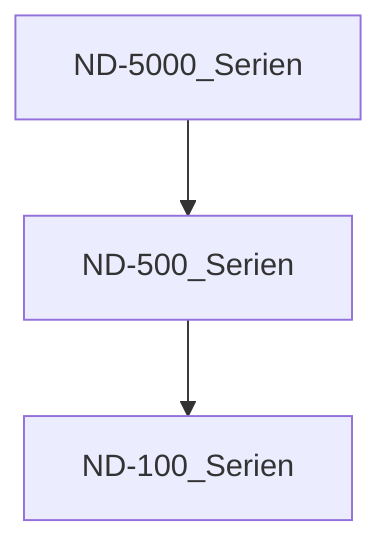
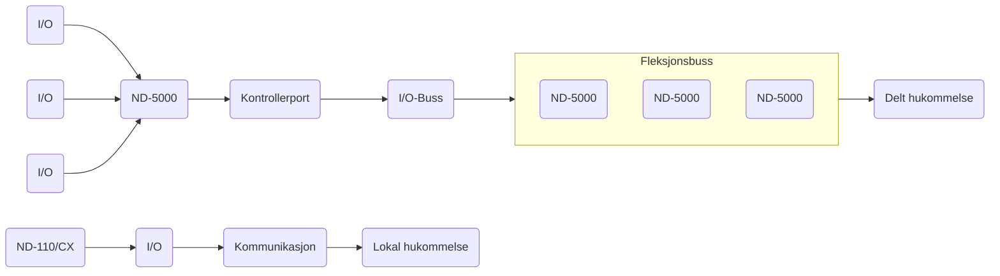

## Page 1

# ND-5000 Serien

La ikke maskinvaren sette grensene

[Photo: ND-5800 computer with circuit boards]

---

**ND Norsk Data**  

---

*Scanned by Jonny Oddene for Sintran Data © 2011*

---

## Page 2

# En ny standard for supermini-maskiner

Det bør ikke være maskinvaren som setter grensene for EDB-utviklingen i en organisasjon. I et informasjonssystem bør datamaskinkraften kunne håndtere nåværende og fremtidige applikasjoner, periferiutstyr og kommunikasjoner, og dermed gi muligheter, ikke begrensninger.

## Fjern ekspansjonsbegrensningene

I tråd med denne filosofien tilbyr nå Norsk Data ND-5000-serien, systemer som vil gjøre det enklere å utvide ditt informasjonssystem, uansett hvilke områder dine behov ligger innenfor.

### Fullstendig kompatibilitet

ND-5000-serien er fullt ut kompatibel med vårt eksisterende tilbud av maskinvare. Det betyr at nåværende brukere av ND-systemer kan ta i bruk ND-5000-serien og likevel få fullt utbytte av sine tidligere investeringer.

### Fremragende forhold pris/ytelse

ND-5000-serien benytter det nyeste innen CMOS "gate-array"-teknologi, noe som gir større hastighet og mer kompakt utforming. Serien har inntil åtte ganger så stor kapasitet som den nåværende ND-570/CX, og forholdet mellom pris og ytelse blir dermed svært gunstig.

### Rom for mer

Etter hvert som nye kommunikasjonsmuligheter fører til stadig større nettverk av datamaskiner og periferiutstyr, finner mange organisasjoner at deres datamaskinressurser blir for små i forhold til arbeidsmengden. Den nye ND-5000-serien er utviklet med denne spesielle situasjonen for øyet. Den vil gi rom for flere brukere, mer periferiutstyr og flere brukerprogrammer.

## Tre modeller

For å imøtekomme ulike kapasitetsbehov kommer den nye ND-5000-serien i tre modeller, kalt ND-5700, ND-5800 og ND-5900. Alle systemene leveres i ett kabinett.

For spesielt CPU-krevende bruksområder tilbys flerprosessor-systemet ND-5900. Dette systemet kan leveres med to, tre eller fire ND-5000-prosessorer (modell 2, 3 eller 4).

En mer detaljert beskrivelse av de ulike modellene finner du i kapitlet om tekniske spesifikasjoner.

Diagrammet under gir en oversikt over den relative ytelsen til de ulike modellene i den nye ND-5000-serien. Pilene viser oppgraderingsmulighetene innen serien.



[Photo: Two people in a workplace setting with computers]

---

## Page 3

# En supermini-maskin for mange formål

ND-5000-serien er beregnet for en rekke bruksområder. Serien vil fullt ut tilfredsstille dine behov for data, kraft dersom du arbeider med ADB og kontorstøtte. Den er også svært godt egnet for teknisk/ vitenskapelige anvendelser.

## Bruksområder

### ADB/kontorstøtte

I flere år har Norsk Data tilbudt omfattende løsninger innen markedene administrativ databehandling og kontorstøtte. På programvaresiden blir dette representert ved de veletablerte programverktøyene ND-DIALOGUE og ND-NOTIS. Vi tilbyr også en omfattende løsning for den grafiske industrien gjennom NORTEXT-systemet.

ND-5000-serien er utviklet for å effektivisere håndtering av programmer som benytter store databaser. Mer lagringskapasitet, direkte fremhenting av data og mulighet for flere terminaler betyr betydelige forbedringer for brukerprogrammer som systemer for materialplanlegging, ordre/fakturering, informasjonsdatabaser og regnskap.

### DAK/DAP

Norsk Data er også i stor grad engasjert i det stadig voksende DAK/DAP-markedet, der vi tilbyr en datapresentasjonsløsning gjennom Norsk Datas eget Technovision-system.

### Teknisk/vitenskapelige applikasjoner

Innen det teknisk/vitenskapelige området er CPU-kraft en enda viktigere faktor. Ytelsen gjør ND-5000-serien til ideelle systemer for slike miljøer. De kan lett håndtere applikasjoner som en kanskje ville tro krevde en spesialisert "tallknuser".

Basis-programvaren for våre nye datamaskiner, som er den samme for hele vårt maskinvareaspekter, passer særlig bra for dette markedet. I tillegg til vårt eget SINTRAN operativsystem, tilbyr vi NDIX, Norsk Datas variant av det velkjente operativsystemet UNIX*. Norsk Data tilbyr også et avansert sett av verktøy for forbedret styring av utvikling, tuning, vedlikehold og konvertering av teknisk/vitenskapelige programmer.

*UNIX er et registrert varemerke fra American Telephone & Telegraph Company, Bell Laboratories, USA.

[Photo: Person working with a computer system]

---

## Page 4

# ND-SAFE -- Grunnlag for vekst

Norsk Data har en systemfilosofi som underbygger alle våre produkter, også ND-5000-serien. 

Den blir kalt ND-SAFE, Norsk Datas System-Arkitektur For Ekspansjon. Gjennom ND-SAFE garanterer Norsk Data at uansett hvor mye din bedrift vokser, vil det alltid være en lønnsom måte å bygge ut systemet på. Alle ND-maskiner, fra vår ND-110 Office Workstation til det største ND-5900-systemet, bruker samme operativsystem (SINTRAN), samme kommunikasjonsutstyr og samme brukerprogramvare. Det betyr at du kan oppgradere dine systemer uten de konverteringskostnader som er nødvendige når andre typer systemer blir utvidet. Enten du trenger å legge til tile eller mye databehandlings- eller lagringskapasitet, vil det alltid finnes en måte å gjøre dette på innen ND-SAFE. På denne måten gir ND-SAFE-konseptet merkbare reduksjoner i totalinvesteringene.

Den nye ND-5000-serien betyr en videre ekspansjon av det omfattende og fullt ut kompatible systemtilbudet innen ND-SAFE-konseptet.

_Figuren under viser plasseringen av 5000-serien i forhold til resten av Norsk Datas maskinvaretilbud. De forskjellige seriene er fullt ut kompatible._



# Kommunikasjon

Hvor funksjonelt et informasjonssystem er kommer i stor grad an på mulighetene for kommunikasjon. Derfor har Norsk Data definert dette som en del av ND-SAFE-konseptet.

ND-COSMOS er Norsk Datas løsning for datakommunikasjon og distribusjon. Det gjør det mulig å knytte den nye ND-5000-serien til andre ND-systemer eller til systemer fra andre leverandører i samsvar med organisasjonens behov. Den kan være hovedmaskin i et middels stort nettverk, eller lokal datamaskin i et distribuert nettverk i en stor organisasjon.

**Internasjonale standarder.** Siden ND-COSMOS også gjør det mulig å kommunisere med datamaskiner fra andre leverandører, finnes det så og si ingen grenser for hva slags datamaskinmiljø ND-5000-serien kan plasseres i. I tråd med vår kommunikasjonsstrategi støtter vi alle anerkjente internasjonale standarder.

[Photo: Scanned by Jonny Oddene for Sintran Data © 2011]

---

## Page 5

# Tekniske spesifikasjoner

ND-5000-serien består av systemene ND-5700, ND-5800 og ND-5900. Basis-konfigurasjonene har fra 10 til 20 MB hukommelse, en 1.2 MB diskettstasjon, kontrollerhet for plottager, konsol, samt SINTRAN operativsystem og hjelpeprogram.

Alle systemene blir levert i ett enkelt kabinett. Innen systemkabinetter kan inntil 320 MB hukommelse bli konfigurert. Ekstra hukommelse kan legges til (inntil 512 MB) ved å bruke et ekspansjonssystem levert i et ekstra kabinett. Dette kabinettet kan også brukes dersom det kreves flere I/O kontrollerenheter.

Standardystemene blir levert med en I/O DMA-kanal. Ekstra kanaler kan legges til dersom det er nødvendig for å øke systemets ytelse.

ND-5700- og ND-5800-systemene er enprosessor-systemer, men ND-5900-modellene er flerprosessor-systemer. ND-5900-modellene 2, 3 og 4 har henholdsvis to, tre og fire prosessorer.

Oppgradering gjennom serien er mulig.

## Konfigurasjonsoversikt

|                | ND-5700 | ND-5800 | ND-5900 Modell 2 | ND-5900 Modell 3 | ND-5900 Modell 4 |
|----------------|---------|---------|------------------|------------------|------------------|
| Relativ ytelse | 2       | 4       | 6                | 8                |
| Hukommelse Delt (MB) | 8-512 | 16-512 | 16-512           | 16-512           | 16-512           |
| Hukommelse Lokal (MB) | 2       | 4       | 4                | 4                | 4                |
| Cache Data (KB) | 64      | 64      | 2 x 64           | 3 x 64           | 4 x 64           |
| Cache Instruksjoner (KB) | 320     | 320     | 2 x 320          | 3 x 320          | 4 x 320          |
| Maks. diskstørrelse (GB) | 29      | 29      | 29               | 29               | 29               |

# Systemarkitektur

ND-5000-serien av datamaskiner er basert på et tett koblet flerprosessor-design, bygget rundt et hurtig flerfunksjons bus-system. Den er basert på en eller flere 32-bits prosessorer (ND-5000), som håndterer beregning og programutførelse og en frontprosessor som tar seg av I/O- og avbruddshåndtering samt vedlikeholdsoppgaver, og dermed avlaster hovedprosessoren. Hovedprosessoren er direkte koblet til bus-systemet, mens frontprosessoren er knyttet til dette bus-systemet via porter.

Hovedprosessoren(e), hukommelsesmodulene og I/O-enhetene kan kobles til bus-systemet, som blir kalt flerfunksjonsbuss. I tillegg kan en eller flere I/O- og/eller DMA-busser kobles til via porter.

Hovedhukommelsen blir delt mellom hovedprosessorene og frontprosessoren. Inntil 512 MB hovedhukommelse kan bli konfigurert. I tillegg har frontprosessoren egen lokal hukommelse (inntil 32 MB).

Se illustrasjon på neste side.

```
 ______________
|              |
|    Photo:    |
| [Images of   |
|   cabinets]  |
|______________|
```

---

## Page 6

# ND-5000 Systemarkitektur



## Prosessorarkitektur

- ND-5000-serien benytter det siste innen teknologi når det gjelder prosessorutforming:
  - CMOS "gate-array"-teknologi brukt i prosessor-design gir større hastighet og kompakt utforming. Skytid for CPUen er 70 nanosekunder. De fleste instruksjoner blir utført i løpet av denne tiden.
  - 32-bits, byte-orientert arkitektur.
  - 32-bits logisk adresseområde delt opp i et 4.3 GB dataram-område og et 4.3 GB instruksjonsområde pr. bruker.
  - Integralt firenivås pipeline-system kan håndtere fire instruksjoner samtidig.

- Avansert hukommelsessystem som finner den fysiske adressen ut fra den logiske adressen. Instruksjoner og data har adskilte hukommelsessystemer, noe som gir raskere programutførelser.
- Stort og modulært hurtigbuffersystem (cache), forent til med logiske adresser. Hurtigbufferen for instruksjoner kan inneholde inntil 8K avkodede instruksjoner med en bredde på inntil 40 byte. En "write once" strategi gir det raskere å skrive til hukommelsen, og forbedrer dermed systemets ytelse.
- 64 KB hurtigbuffer for data. Hurtigbuffer gir at programmer blir raskere utført, siden dataene blir lagret i hurtigbufferen og ikke må hentes fra hukommelsen.

## Prosessorens Instruksjonssett

- Ved utformingen av instruksjonssettet for ND-5000 er det lagt vekt på å gi en rask utføring av høy-nivå-kommandorer, samtidig som en effektiv og kompakt kodestuktur blir beholdt. Dette gir:
  - Mikrokodet instruksjonssett med variabel lengde på instruksjonene, med operandtyper som omfatter bit, byte, halvord, ord og dobbeltord.
  - Fullt ut kompatibelt med instruksjonssettet for ND-500.
  - Instruksjoner for matrise-/tabell-operasjoner
  - 14 adressemodi som gir effektiv instruksjonsdekoding.
  - Støtte til høynivåspråk for iterasjon (FORTRAN DO), prosedyrekall (subrutine-kall), og tabelltilgang (basert på logisk lengde av datatyper)
  - Spesielle instruksjoner for "stack"- og "frame"-håndtering i blokksstrukturerte språk.
  - Full BCD (Binary Coded Decimal) aritmetikk og konverteringsmikrokode gir hurtig COBOL-prosessering.
  - Hurtig flytende-komma-prosessor (floating-point), basert på spesialutviklet VLSI, gir de fleste resultater i løpet av 0.2-0.3 mikrosekunder.

[Photo: ND-5000 series processor boards]

---

## Page 7

# Bedriften Norsk Data

Norsk Data er et europeisk basert selskap innen informasjonsteknologi. Selskapet utvikler, produserer, markedsfører og vedlikeholder en rekke generelle, kompatible minidatamaskiner, fra 16-bits modellene ND-110 Office Workstation, ND-110 Satellite, ND-110 Compact og ND-110/CX, til 32-bits modellene i ND-500/CX- og ND-5000-seriene av super-minidatamaskiner, alle med virtuell hukommelse. Heleide datterselskaper i 12 land med i alt 63 kontorer tar seg av salg og kundestøtte. Markeder andre steder i verden betjenes gjennom samarbeidsavtaler med andre selskaper eller gjennom agenter.

Maskiner fra Norsk Data blir brukt både som enkeltstående systemer og i nettverk bestående av flere prosessorer, med periferutstyr og systemprogramvare.

Norsk Data-maskiner brukes til administrativ databehandling og til teknisk/vitenskapelige formål der det kreves høy ytelse. Administrativ databehandling inkluderer tidsdelings- og transaksjonssystemer så vel som kontorstøttefunksjoner. De fleste av konsernets kunder er organisasjoner som industri- og forretningsorganisasjoner, offentlig forvaltning, forsknings- og undervisningsinstitusjoner, forsvar, aviser, forlag og trykkerier, samt systemhus som kjøper Norsk Data-maskiner på OEM-basis.

Norsk Datas A-aksjer noteres på børsene i Oslo, London, Stockholm, København, Frankfurt og Hamburg. B-aksjer noteres i USA på NASDAQ National Market, i form av amerikanske depotbevis (ADRs), og på børsene i Oslo, London, København, Frankfurt og Hamburg.

Norsk Data er mer enn en produsent av minidatamaskiner. Det er en sluttbrukerorientert leverandør av integrerte informasjonssystemer, der maskinvare, programvare og nettverk sammen med støttetjenester har som mål å gi mennesker anledning til å yte mer i sitt daglige arbeide.

```
                          _____________ 
                         /             \
                        /               \
                       /                 \
                      |                   |
                      |                   |
                      |                   |
                      |                   |
                       \                 /
                        \               /
                         \_____________/

                          ND
                      Norsk Data
```

[Photo: World map]

---

## Page 8

# Adresser ND-kontorer i Norge

## Salgskontorer

### Avd. Oslo
- Jerikoveien 20
- Postboks 4, Lindeberg Gård
- 1007 Oslo 10
- Tlf.: (02) 30 90 30
- Tlx.: 78661 nd n

### Avd. Bergen
- Conrad Mohrsvei 1
- 5032 Minde
- Tlf.: (05) 28 80 00

### Avd. Sandnes
- Hoveveien 30
- Postboks 555, Krossen
- 4301 Sandnes
- Tlf.: (04) 66 75 80

### Avd. Tromsø
- Styrmannsveien 13
- Postboks 2113
- 9014 Håpet
- Tlf.: (083) 71 766

### Avd. Trondheim
- Håkon VII’s gate 7
- Postboks 78
- 7001 Trondheim
- Tlf.: (07) 92 12 22
- Tlx.: 55580 ndtrd

### Avd. Porsgrunn
- Olavs gt. 26
- Postboks 1044
- 3901 Porsgrunn
- Tlf.: (035) 59 300

## Servicekontorer

| Location          | Phone       |
|-------------------|-------------|
| Asker             | (02) 79 52 50|
| Bodø              | (081) 27 590 |
| Bø                | (036) 61 211 |
| Fredrikstad       | (032) 41 208 |
| Førde             | (057) 23 955 |
| IFE-Halden        | (031) 83 100, l. 196|
| Hamar/Lillehammer | (065) 31 113 |
| Harstad           | (082) 67 499 |
| Haugesund         | (047) 28 455 |
| Kristiansand      | (042) 99 333 |
| Porsgrunn         | (035) 59 300 |
| Steinkjer         | (077) 65 411 |
| Tønsberg          | (033) 12 434 |
| Ålesund           | (071) 40 907 |

```
  ___   _  _   _       ___  
 |   \ | || | | |     / __|
 | |) || || | | |__  | (__ 
 |___/ |_||_| |____|  \___|
                         
```

---

