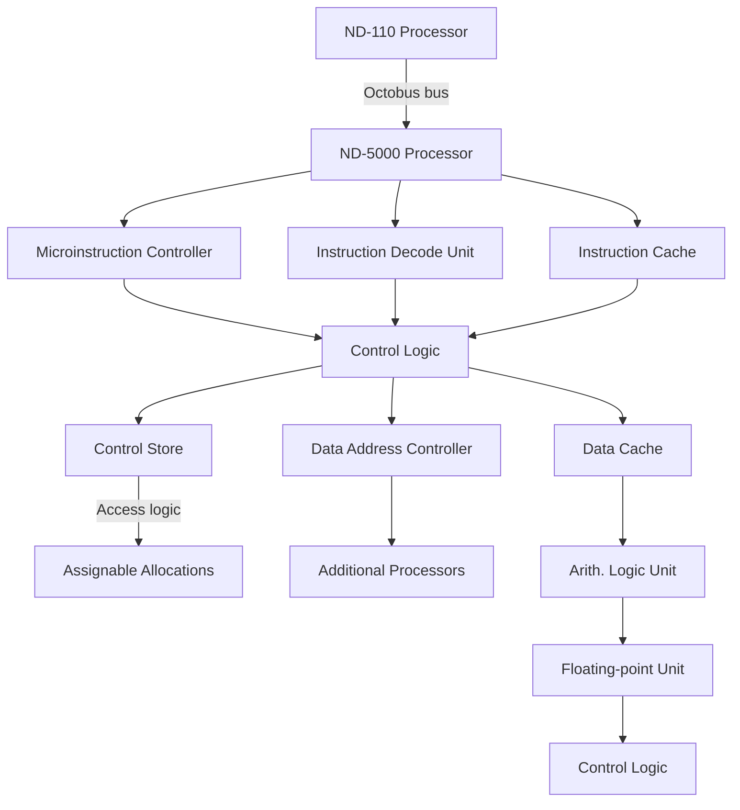
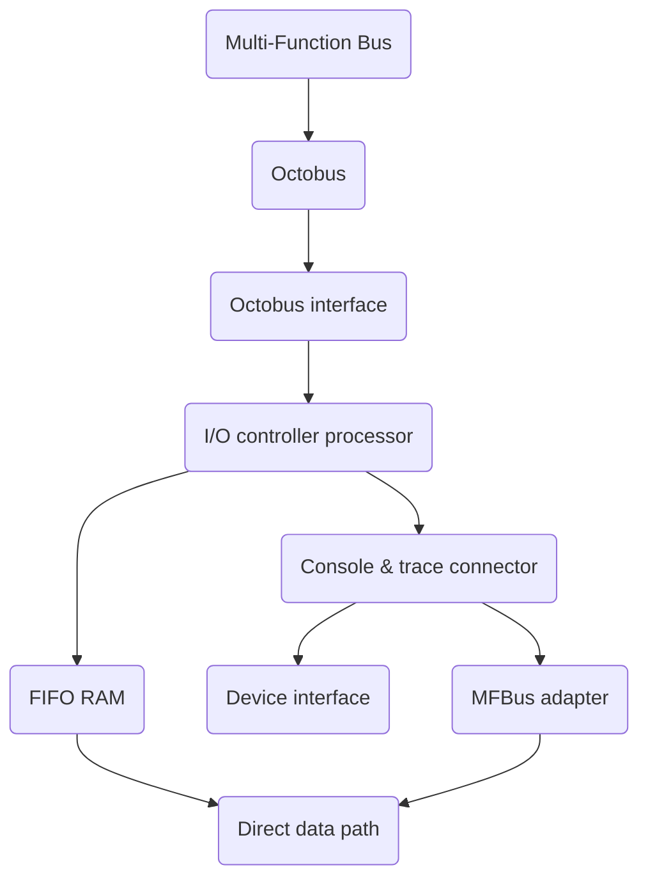
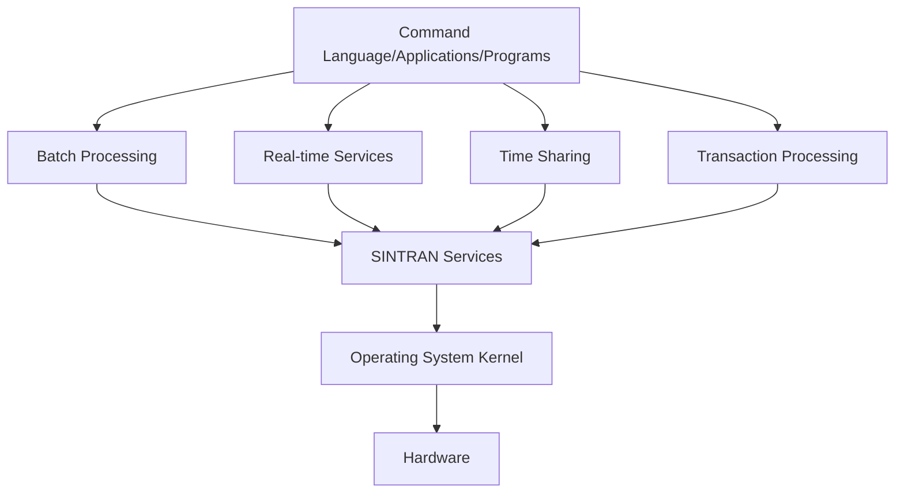

## Page 1

# ND-5000 Family

## Technical Overview

[Photo: Office scene with computers and people]

```
     _________________________
    |     ND            ND     |
    |           Norsk Data     |
    |_________________________|
```

Scanned by Jonny Oddene for Sintran Data © 2011

---

## Page 2

# Abstract

The purpose of this document is to give a technical overview of the architecture of the ND-5000 CPU, the bus, I/O, and the operating system. No prior knowledge of the ND system architecture is necessary. However, the reader should have general knowledge of computers.

---

![Photo: Stacked circuit boards]

_One single board does the work that previously required 21 boards._

---

## Page 3

# Contents

## Introduction
................................................................. 2

## Architecture
................................................................ 3  
Overview  
................................................................ 3  
Adding speed  
................................................................ 3  
Internal communication features  
......................................... 5  
Large memory space  
................................................................. 5  
Saving cache space  
................................................................. 5  
Trap handling  
................................................................ 6  
Cache memory with brand new strategy  
........................... 7  

## I/O System
................................................................. 8  

## Operating System and System Software
...................... 9  
Introduction  
................................................................ 9  
Services Provided by SINTRAN  
......................................... 9  
Organisation of software —  
Distribution Front-end/Back-end  
................................. 11  
SINTRAN III and the ND-5000  
........................................ 11  
NDIX  
................................................................. 12  
Multi-CPU  
................................................................ 12  
Timekeeping  
................................................................ 12  
Input/Output  
.................................................................. 12  
Maintenance, backup/recovery and booting  
................ 12  
Norsk Data - The Company  
.......................................... 13

---

## Page 4

# Introduction

The ND-5000 family of superminis is based on the world's first true single-board 32-bit minicomputer. By combining CMOS gate-array technology with extremely compact construction, Norsk Data has made a system with a dramatically reduced number of components, which consumes very little power, and will meet virtually any performance demands made of it.

The goal of the ND-5000 design was to double the total CPU performance of the ND-500 family, while maintaining the company's policy of giving customers clear upgrade paths. Norsk Data believes the ND-5000 is especially applicable to medium and large organisations where large database applications are key elements, for example materials planning, order/invoicing and information database systems.

The first high-end systems in the family were announced in January 1987, with CPU performance increases of from two to eight times the existing systems', and Whetstone MIPS ratings of 3.5 to 26. The top-end system, ND-5000, is delivered with up to four processors in a single cabinet. The ND-5000 family is an integral part of Norsk Data’s systems architecture for expansion (ND-SAFE). This guarantees that customers can expand their ND systems economically, because they are based upon one operating system, and common communications facilities and applications software.

![Photo: ND-5000 in an office environment]

CMOS (Complementary Metal Oxide Semiconductor) gate array technology was chosen over ECL (Emitter Coupled Logic) favored by other manufacturers, for a number of reasons. Firstly, gate array CMOS uses far less power than ECL, thus reducing heat output. Because it is physically much smaller, GA CMOS allows for a higher packing density. Thus, reducing the distance between chips gives significant increase in speed. These advantages over ECL allowed the implementation of the ND-5000 CPU on a single board which now does the work that previously required 21 boards. Throughput and response times have been improved by a new I/O management technique, which ensures that all I/O functions are individually handled by dedicated, microprocessor-based controllers.

![Photo: Combining CMOS gate array technology with extremely compact construction gives a system with a dramatically reduced number of components.]

---

## Page 5

# Architecture

## Overview

The ND-5000 32-bit super minicomputer can execute 6 to 7 million single-precision Whetstone instructions per second. The system is a twin-processor design: one 16-bit CPU controlling input/output together with other intelligent I/O controllers, the 16-bit CPU also running operating-system and maintenance tasks. The 32-bit ND-5000 CPU is therefore relieved of all system functions and its full power dedicated to the execution of applications.

System performance is enhanced by a physical memory of up to 2 gigabytes, with virtual memory address spaces of 4 gigabytes each for data and instructions. Individual memory-management systems and cache memories handle instructions and data independently. The ND-5000 has local intelligence providing the functions of the memory-management system, the instruction and data-address control, the microinstruction control, the arithmetic logic unit, and the floating-point and binary-coded decimal arithmetic units.

The ND-5000 processor is fully instruction-compatible with ND's earlier system series, i.e., it uses the same instruction set as earlier ND-500 processors.

## Adding Speed

System performance may easily be increased as a field upgrade by adding more ND-5000 processors to an existing system. Up to four processors may be run together, in a single cabinet, resulting in a performance of up to 24-28 Whetstone MIPS. If additional I/O capacity is needed, more intelligent I/O controllers can be accommodated, again as a field upgrade.

The powerful 32-bit ND-5000 processor(s) is used to:

- Compile symbolic programs.
- Link or load relocatable modules, user programs, user libraries or system libraries into ND-5000 executable programs.
- Execute the user programs/applications.
- Execute parts of the operating system concerned with its own operation.

The main functions of the I/O processors are to:

- Perform I/O operations between the processors or memory, and the peripherals.
- Timeshare and supervise all available resources.
- Run maintenance diagnostics for the system.
- Run the SINTRAN operating system for real-time, local and remote batch processing.

The I/O and ND-5000 processors can exchange code and data through the shared memory system to which both processors have access; the I/O processor via a high-speed port running at up to 18 MBytes/sec., the ND-5000 CPU being placed directly in the memory bus. This configuration allows easy access and control by all components of the system. Peripherals like disks and tapes can access the shared memory through the same memory channel and port as the I/O processors, or through their own separate ports directly into the shared memory.

```text
      _________________________
     |                         |
     |        Octobus          |
     |_________________________|
             |     |      |
 ____________|_____|______|_________________
| ____                  ____    ____    ____ |
||    |                |    |  |    |  |    ||
||    |                |    |  |    |  |    ||
||____|                |____|  |____|  |____||
| ND-5000        ND-5000  ND-5000  ND-5000  |
|___________________________________________|
| ____ port | ____ port |         ____ port |
||    |     ||    |     |        |    |     |
||____|     ||____|     |   MFB  |____|     |
| I/O       |I/O        |        | Memory   |
|           | Multi Function Bus           |
|____ ____ ____ ____     ____ ____ ____ ____|
|    |    |    |    |   |    |    |    |    |
| MFB| MFB| MFB| MFB|   |I/O |I/O |I/O |I/O |
| ctl| ctl| ldr| ldr|   |ctl |ctl |ctl |ctl |
|____|____|____|____|   |____|____|____|____|
```

Up to four processors may be run together in a single cabinet. If additional I/O capacity is needed, more intelligent I/O controllers can be accommodated.

---

## Page 6

# Architecture

In addition to using the shared memory, the ND-110 also has a private memory. A part of the SINTRAN address space, this memory is used for interprocessor communication but cannot be reached by user programs in the ND-5000 processor. Message handling between ND-110 and ND-5000 also takes place through the Octobus. This is a dedicated bus for fast signal and message transfer between intelligent I/O controllers, ND-110, and ND-5000.

The principal hardware components within the ND-5000 are shown in Fig. 2. At this level the main subsystems are the shared memory, the cache, the memory-management system, the instruction and data-address controller, the microinstruction controller, the arithmetic logic unit, and the floating-point and BCD arithmetic unit.

All communication between the main memory and the CPU goes through the cache. During a write operation, the data is buffered in a write buffer, and the CPU can keep executing instructions while the cache control copies the data into the cache and into main memory.

The translation from a logical program or data address to a physical one is made by hardware using special memory tables. The result is inserted into a translation speed-up buffer, a 35-nanosecond cache-like memory of 4096 locations. This buffer reduces table look-ups for page translations by keeping the physical addresses of up to 4096 referenced pages in this high-speed memory.

## ND-5000 Technical Overview

- A general purpose high performance 16-bit minicomputer as a front-end I/O processor.
- Only one ND-5000 memory port. The multiplexing of instructions and data is done in the ND-5000 CPU and not on the multi-function bus. This saves arbitration overhead.

32 bits wide memory system  
4 Mbyte memory modules using 256K RAMs. Shared memory expandable to 2 Gbyte. Transfer rate is 17 Mbyte/second.

7 data types with full hardware support.

Memory management hardware translates addresses and checks accesses of the 4 Gbyte address space. A cache-like translation speed-up buffer holds the 4096 latest page addresses translated.

Large and modular cache system, referenced by logical addresses. The data cache is 64 Kbyte and the instruction cache is 320 Kbyte (8K instructions x 40 bytes).

Specialized hardware for increased speed working on dedicated tasks in parallel.

Full 32-bit logical address space = 1 DOMAIN = 4 Gbyte each for data and instructions. Each process can address up to 256 domains.

```plaintext
     ND-110 Processor                               Multi-Function Bus System
   +-------------------+                              +----------------------+
   | ND-110 CPU        |                              | MFB Proc. bus        |
   | and cache         |                              |                      |
   +-------------------+                              +----------------------+
   | Message handling  |                              | Shared / Private     |
   | I/O controllers   |<---------------------------->| Memory (MFB)         |
   | (ND-110 and       |    Octobus bus               +----------------------+
   | ND-5000)          |
   +-------------------+
   | Private memory    |
   | (MFB-address)     |
   +-------------------+
```



[Photo: Computer workstation with multiple monitors and keyboards]

---

## Page 7

# Architecture

## Internal communication features

The ND-5000 CPU contains an Access Module used for communication, debugging, testing, and maintenance purposes. The Access Module has considerable local intelligence, provided by an MC68000 microprocessor and an Octobus controller.

The Octobus is a high-speed, serial, self-arbitrating command bus for efficient, internal system signal/command transfer. It is used to transfer messages between up to 62 devices; there can be a mixture of CPUs and intelligent I/O controllers. This gives a simple and elegant way of connecting several processors in a shared memory system. The Octobus is used to tell other processors what to do with the data in the shared memory.

The MC68000 based access module has a sophisticated service program which constantly monitors the system hardware for errors. The information provided by this log greatly improves the accuracy of maintenance and diagnostics.

The communication between the I/O controllers and the ND-5000 processors goes through the Access Module via the Octobus, and through the shared memory. The ND-5000 is placed directly on the memory bus in order to minimize access times and system complexity.

The processing power of the ND-5000 is shared among users through the ND-110. The ND-5000 microprogram will save or discard the working register set when changing users. The register of each process occupies 256 bytes of physical memory set aside for this purpose.

The machine language of the ND-5000 processor approaches the sophistication of high-level language statements. Because the instruction set was designed together with compiler experts, compiler-generated code becomes simple, compact, and reliable. Among the high-level statements and functions directly implemented in machine language are: DO loop control; computed GO TO; IF; SQUARE ROOT; A = A + B; C = D * F; SIN; COS; EXP; LOG; and ATAN.

The instruction code of the most recurrent instructions occupies 1 byte, while the more unusual instructions use 2 bytes. Because registers are few and specialized, only 2 bits are needed for register selection. The rest of the byte contains information about the operation, data types, and instruction layout in addition to the instruction code. There are bytes for locating the operands. Instructions may have from 0 to 256 operands.

## Large memory space

Each user of the ND-5000 system has a full 32-bit address space (4 gigabytes) for instructions, and a further 4 gigabytes for data. This address space is referred to as a domain. The hardware memory management system extends the logical address range to 2^40 bytes (2048 gigabytes) by allowing each user access to 256 domains. Each domain is divided into 32 logical segments whose size is from one to 64,000 pages of 2 Kbytes each. The splitting of domains into segments increases modularity, shareability, and security of code.

## Saving cache space

The ND-5000 instructions and data are of variable length. They need not be aligned to word boundaries in memory, but may begin at any byte address, odd or even. The advantage of not requiring alignment is that instructions and data structures can be compressed into less physical memory, giving better cache utilization and fewer page faults.

---

## Page 8

# Architecture

The ND-5000 processor is designed as a pipeline of four stages for optimum performance. When the processor receives an instruction sequence, it keeps up to four instructions in the pipeline at a time. While the results of instruction N are saved, instruction N + 1 is executed, the operands for N + 2 are fetched, and N + 3 is fetched from cache or main memory. This results in one instruction being processed per microcycle. One microcycle lasts for 70 ns, when there is no waiting for external events.

The ND-5000 hardware is optimised to the pipeline structure by keeping different functions in separate hardware blocks, each containing local intelligence provided by semi-custom designed VLSI gate-array chips. The Instruction-Address Controller computes the instruction addresses, and the Data-Address Controller computes the data addresses for operands used by the arithmetic logic unit. The Microinstruction Controller takes care of the sequence of the microprogram, and the arithmetic logic unit makes the desired operations with the A and B operands.

The writable control store is 128 bits wide, and can be expanded to 64Kwords. Standard size is 16Kwords. The wide control-store words make it possible to control the performance of several functions in parallel. Most machine instructions are executed in one micro-instruction.

## Trap Handling

Through the Octobus, the ND-5000 can access the other processors' memory to fetch the communication commands and send monitor calls or trap information. The I/O processors use the Octobus to test and examine or deposit information in the logical memory or registers of single or multiple ND-5000 processors.

The computer has a powerful trap system. Traps are exceptional circumstances, including errors, that can be caused by hardware or software. Bits are set in the status register to indicate firstly that a trap has occurred, and secondly what type of trap it is.

The three types of traps, ignorable, nonignorable, and fatal, are summarised in Figure 3. They are taken care of by programs called trap-handler routines. In the ND-5000 system, users may write their own trap-handler routines for the ignorable and nonignorable traps, while the ND-110 processor will act on all the fatal traps.

The value of the corresponding bit in the trap-enable register determines if a trap is ignored. The system microcode examines various enable registers to decide whether the trap is to be handled by a user program or by the operating system. Within a hierarchy of domains, traps may be handled in the domain causing the trap or by the mother domain. If nonignorable traps are not handled in any ND-5000 processor domain, the ND-110 processor is always enabled and ready to handle them.

## ND-5000 System Traps

| Trap Type     | Subtype                 | Examples                                                   |
|---------------|-------------------------|------------------------------------------------------------|
| Ignorable     | (18 bits in status register) | data-status traps tracing traps             | overflow, underflow, divide by zero branch, call from a single-instruction trap, stack under, overflow |
| Nonignorable  | (9 bits)                | instruction and operand reference             | illegal instruction, project violation                       |
| Fatal         | (7 bits)                | system-error traps                                    | page fault, parity error, power failure, MM/S error          |

_There are three types of traps, ignorable, nonignorable and fatal. Users may write their own Trap-Handler routines for the ignorable and nonignorable traps._

---

## Page 9

# Architecture

## Cache Memory with Brand New Strategy

The cache memory system of the ND-5000 is big, fast, and modular. In addition, it works with virtual memory addresses instead of physical addresses. The separate cache memory for instructions and data ensures the continued high level of parallelism of this system's architecture.

The effectiveness of cache memory on system performance depends on the hit ratio – the number of times requested instructions or data are found in the cache and need not be fetched directly from the slower main memory.

The hit ratio depends upon such factors as the size of the cache and what is called the locality of reference, which can be in terms of time or space. Locality in time means that the same information (instructions or data) is used repeatedly within short time intervals, such as in tight loops. Locality in space refers to words of information that reside close to each other, such as strings of instructions that are executed sequentially, searches of sequential data, or processing of data arrays.

Large cache memories coupled with programs with strong locality achieve hit rates approaching 100 percent. However, larger cache memory can, up to a point, make up for weak locality and still achieve hit rates over 90 percent, a characteristic that the ND-5000 exploits. The large ND-5000 cache increases the system performance up to ten times by effectively reducing the main-memory read-access time of approximately 700 nanoseconds to an average data or instruction cycle time of 70 ns.

The size of the data cache is 64 Kbytes, and the instruction cache is 320 Kbytes (8K instructions x 40 bytes). The instruction cache has a very wide code (more than 300 bits). The cache contents are complete and fully decoded with 32-bit constants, addresses and a complete control instruction (microinstruction), which are all fetched from the cache in a 70 nanosecond cycle. This saves several levels of mapping, decoding, and pipelining.

## The 'Write Once' Strategy

The data cache has a 'write once' strategy. The advantages with this strategy are firstly that the write cycle is reduced to one 70 nanosecond cycle, and secondly that there is no need for a bus request. This increases the bus bandwidth because the traffic on the memory bus is radically reduced.

Several other machines have caches that never write to memory before it is necessary. These caches are called 'write back' caches. One problem with these caches is the need for virtual memory mapping when it is decided that some cache data must be written back. If page faults occur at that point, it can be problematic to make proper recoveries.

With the 'write once' strategy, this problem is solved by writing data into both the cache and the main memory on the first write, and mark the cache entry as reserved when the first write has taken place. Later writes with cache `hit` will only be written into the cache; never into the main memory. These writes will mark the cache entry as `dirty`, indicating that the corresponding memory address does not contain valid data. The final updating of the main memory is done when the process is terminated.

When data is read from the main memory, all requests read 4 bytes regardless of how many are needed. These 4 bytes are always written into the data cache. If a `dirty` cache address is overwritten, all 4 bytes are written to the main memory.

If a write is going to an address with `hit`, it will be written into the cache regardless of how many bits should be written. The whole cache word will then contain the correct data.

---

## Page 10

# I/O System

The I/O system has an input/output architecture based on multiple-dedicated intelligent controllers. The I/O architecture has been developed for the ND-5000 family of CPUs to increase the performance and functionality of the I/O operations.

A wide range of I/O controllers will be available, e.g. SCSI and Ethernet Controllers, all of which are directly connected to the high-performance (40 Mbytes/sec) Multifunction Bus. The I/O controllers have the hardware environment of the Multifunction Bus (MFB) system. The MFB is designed to support multiprocessing, a requirement of the I/O architecture. The MFB system has two buses: The MFbus (Multifunction bus) and the Octobus.

The MFbus is the main data carrier between system components, i.e. ND-5000 and intelligent I/O controllers. It is a full 32-bit bus for both address and data. Semaphore cycles ensure safe access to data structures which are common to two or more processors.

The Octobus is a serial bus optimised for fast handling of short messages. It is used for interprocessor synchronisation and for passing configuration parameters during initialization. It can also be used as the communication medium between system components in an advanced development and maintenance system.

An I/O controller consists of two parts: A standard part common to all I/O controllers and a device part. The device part may be designed to handle a few dedicated devices for high-performance I/O, or a selected mixture of devices to achieve a more compact solution for medium-range systems. Increased functionality in the device handling can be built into specialized hardware and/or based on the available processing power of the I/O processor.



The general I/O controller contains a microprocessor, local memory, host interface (i.e., MFB system interface), and a device interface.

``` 
+----------+    +--------+    +---+    +----------------+
| ND-5000  |<-->| ND-110 |<-->| MFB|<->|     OCTOBUS    |
| MFBus    |    | CPU    |    |Sys |   |                |
|controller|    |Memory &|    |Mem |   +----+-------+--+
|          |    |I/O PORTS|   |ory |        |       |
+----------+    +--------+    +---+    +----+       |
      |                                    |       |
      v                                    |       |
+----------+      +-----------+            v       v
| SCSI     |      |Ethernet   |      +-----------+     +---------------+
| controller|      |controller|      |I/O        |     | User          |
|          |      |           |      |controller |     | terminals     |
|To 8 disk |<---->| Interface |<---->|           |<---->|               |
|drives (max)|    |link       |      |           |       +---------------+
+------------+    +-----------+      +-----------+
```

**A simplified view of an ND-5000 application using the new I/O system.**

---

## Page 11

# Operating System and System Software

## Introduction

The proprietary operating system for the ND-5000 family is SINTRAN III. Different parts of the SINTRAN operating system run in different CPUs, but access the same memory. Although this operating system handles multi-CPU machines, it is not a distributed system in the true sense of the term, but a network-orientated system. SINTRAN offers the users transparent access to remote systems. A typical ND-5000 system consists of (at least) two CPUs accessing the same physical memory. One of the two CPUs is the ND-5000 CPU. This is the main working-horse, the real number cruncher and the one that really does the work. Most of the workload goes to this CPU. The second CPU will be an I/O processor.

Another operating system for the ND-5000 is the ND-UNIX system, called NDIX. This is a BSD 4.2/SVID system running on top of, and making extensive use of SINTRAN III and its I/O system already running on the ND-5000 system. Users can therefore have a choice of operating environments.

## Services Provided by SINTRAN

SINTRAN supports several modes of operation: Interactive time-sharing, Local and Remote Batch, Transaction Processing, and Realtime Programming. All modes of operation may perform concurrently, independently of other jobs or users on the system.

```
[Photo: Person using a computer terminal]
```

*For several years Norsk Data has offered comprehensive solutions within the markets of administrative Data Processing and Office Support.*

Interactive time-sharing users have virtually all the resources of the computer available at their terminal, with the time-slicing facility of SINTRAN that provides fast response time and high system throughput. In this mode, the users can request services from the operating system and start applications or system programs, either in a dialogue fashion by giving direct commands, or by selecting from a User-Environment menu.

The users may submit jobs for processing in Local Batch system, to Remote Batch systems on other ND computers (using the COSMOS communication network), or Remote Job Entry to IBM and other mainframe systems. The results of all these jobs can be viewed or printed from one terminal.

```
[Photo: Two people working with computers]
```

*Within the Technical/Scientific market area, the CPU Power of the ND-5000 series makes them ideal systems for such environments.*

Scanned by Jonny Oddene for Sintran Date © 2011

---

## Page 12

# Operating System and System Software

Transaction Processing and Database Management for corporate information systems are fully integrated parts of the SINTRAN environment. Users can run their tasks and applications, while program development and testing are going on in the interactive program development facilities. Since Transaction Processing can be an essential part of an organization's operations, this environment includes facilities to set priorities on tasks, reserve access to critical resource elements like main memory and disk, and take checkpoints to secure fast database recovery.

Realtime programming facilities, a standard part of SINTRAN, allow privileged tasks to operate within a flexible priority scheme, independently of, or in cooperation with other tasks. RT programs may share common code and routine libraries; exchange data through common memory, segments or files; allocate system resources and set priorities for own use or for other tasks. A set of system services, available in programming libraries and as direct commands for privileged users, allows for protection of vital operations and provides tools for program development and testing. RT programming offers a flexible environment for implementing process orientated applications, communication systems and server functions.

User-Environment is an operating-system support module that provides security and ease of operation. This module provides the system administrator with tools to control the access to the computer, and gives the normal user access to a menu including the most frequently used tools. The menu system can be modified or extended to include additional customer-specific applications.

The following diagram roughly illustrates the environment for users of the SINTRAN operating system.



One important property of the SINTRAN operating system is to make all the hardware easily accessible to users and programs and provide the user with the flexibility of accessing various devices without modifying programs. For example, the user can output directly to a terminal, a disk file or to various printers without having to change the program which produces the output, or letting the program know which device is chosen for the output. This means that in many instances the choice of the peripheral is transparent to the user.

This is achieved by appropriate layering of all the system software, including the operating system and all its constituent parts. Some of the most basic services may be regarded as the kernel of SINTRAN. Others may be built as a combination of the basic services to provide a higher-level service, e.g., the time-slicer for all interactive terminal users. Some of the services are provided by system servers.

---

## Page 13

# Operating System and System Software

## Organisation of Software – Distribution Front-end/Back-end

SINTRAN and NDIX are both divided into two main parts. One part runs in the ND-5000 CPU, and the other in the ND-110 processor. In general, the clock, I/O operations and maintenance of the system are performed in the ND-110 processor, while the execution of the applications, servers and the utilities, together with the physical memory scheduling (i.e. Memory Management System) are taken care of by the main processor (ND-5000).


```
   +--------+  +---------------------+
   | ND-5000|  | Applications and    | 
   |        |  | utilities Servers  |
   +--------+  +---------------------+
   | Memory  |    | SINTRAN           |
   | handling|    v                   |
   +--------+------------------------+
                        |                 
                        v
              +----------------------+
              | I/O processor        |
              | I/O processor        |
              +----------------------+
```

*Device drivers are placed in I/O Processors. The supervision of all the ND-5000 Processes is handled by the ND-110 Processor, while the execution of the applications is taken care of by Main Processor (ND-5000).*

## SINTRAN III and the ND-5000

As stated in the previous chapters, the I/O part (i.e. all the device drivers constituting the I/O system) is placed in I/O processors. The supervision of all the ND-5000 processes is handled by the ND-110 processor. A sophisticated scheduling (supervisory) algorithm is executed within the ND-110 processor to give all the processes in the system a fair share of the total CPU time. The scheduler’s main task is to decide which process should be started next, and when.

Another important operating-system task is to allocate memory space to the different processes running on the machine. This task, which in Norsk Data terms is called swapping (some call it paging), is performed by a special process called the swapper. The swapper runs in the ND-5000 CPU as a task with the highest possible priority. Each time a user application tries to access an address not found in the main memory, the swapper is activated. The swapper analyses the situation, finds out which process caused the ‘page-fault’, and where the page with the accessed address is located on the disk. It then reads that page into a free memory area. It updates the memory page-table and restarts the process hampered by the ‘page-fault’. If there is no ‘free-page’ in memory, the swapper first has to write a page back to the disk to make space for the new page. The algorithm for estimation of the page that should be dumped to the disk (i.e. ‘swapped-out’) is a matter of great discussion. Norsk Data has chosen a technique called LRU (Last Recently Used), but which technique to use is continuously analysed and optimised. Different algorithms are used for different access methods to the process using the memory. One access method, which can be treated in a special way, is the sequential one.

---

## Page 14

# Operating System and System Software

## NDIX

The NDIX kernel and all its application processes run as one privileged and independent process in the ND-5000 CPU. It is, however, fully controlled by the SINTRAN kernel. The exceptions to this are the lowest-level interrupting clock, the initial NDIX boot and the lowest-level I/O drivers, which execute in the ND-110 processor. The NDIX interrupt system is based upon the hardware trap system provided by the ND-5000 hardware. Each time an I/O request is finished and reported back from an I/O processor, the currently executing process in the ND-5000 CPU is terminated. The context of that process is saved for later continuation, and the NDIX kernel is started in a special context predefined to handle and execute that specific I/O return from the generic device group.

## Multi-CPU

All ND-5000 systems are actually multi-CPU systems, but in this context, we mean more than one ND-5000 CPU coupled to the same memory as one I/O processor. In such a multi-CPU, multiuser ND-5000 system, the ND-110 processor is used for load balancing between the ND-5000 CPUs. As a default option, the next ‘ready-to-execute’ process in the ready queue will be executed in the least loaded CPU. This will be decided by the scheduling part of the operating system.

## Timekeeping

The system-wide, readable and interruptable clock is maintained by the ND-110 processor. On special timing events, the ND-5000 CPU is interrupted, and the process waiting for the interrupt event is started. In addition, a high-resolution, readable μ-second clock is accessible to the ND-5000 CPU.

## Input/Output

This dual CPU architecture opens up some nice possibilities in the way processes handle their I/O. Processes are executed in true parallel with ongoing I/O operations. This is possible because the I/O is performed by different and independent CPUs. These CPUs have direct access to the same memory as the process doing the input/output. This effect is widely used by both operating systems. While one process executes in the ND-5000 CPU, the I/O processors carry out the I/O for the same or for a different process.

## Maintenance, Backup/Recovery and Booting

The ND-110 processor acts as a maintenance processor for the whole system. It runs test programs to check that the hardware works as it should (memory, I/O channels, instructions etc.) The initial part of the system booting is then performed by the ND-110 processor. Both SINTRAN and NDIX are booted from the same system disk, and it is the same basic mechanism that is used for both operating systems.

The offline backup and recovery operations from and to the mass storage devices are taken care of by the ND-110 processor. Online backup/recovery is mainly handled by the back-end processor.

```plaintext
   +------------------------+
   |        ND-5000         |
   +------------------------+
   |      Kernel            |
   +------------------------+
   | UNIX applications      |
   | and utilities          |
   +------------------------+
   |                        |
   +------+  +-------------+
   | ND-100 |  |  ND-110   |
   +-------+  | processor  |
   | I/O   |  |  I/O       |
   | driver|  | processor  |
   +-------+  +------------+
   |    Communications     |
   +-----------------------+
```

_The NDIX kernel and all its application processes run as one privileged and independent process in the ND-5000 CPU. It is, however, fully controlled by the SINTRAN kernel._

---

## Page 15

# Norsk Data – The Company

Norsk Data is a European-based company in the information technology industry. It emphasizes products and services which can make its customers more productive and more competitive. To achieve this it offers end-user oriented solutions. These typically consist of an integrated networked information system, involving both hardware and software from the Company's range of compatible 16-bit and 32-bit general purpose computer systems.

Norsk Data has Research and Development Laboratories and Manufacturing Plants in several European countries. Its strong end-user oriented organization for sales and customer support operates in 12 countries through 63 offices. Other world markets are served through joint ventures or by agents.

The major part of the Company's customers are end users, such as industrial and commercial organizations, public authorities, research and educational institutions, defence agencies, newspapers, publishers and printers, or system builders who purchase Norsk Data computers on an OEM basis.

```
[Graphic: World map represented through a pattern of circular dots]
```

---

## Page 16

# Corporate Headquarters

Olaf Helsets vei 6  
P.O. Box 25, Bogerud  
Oslo 0690  
Norway  
Tel.: +47 2-62000  
Telex: 79656 nd n  
Telefax: +47 2-688184 (A)

New York  
Tel.: +47 2-29786 (A)

## Norway

Oslo, Tel.: +47 2-62000  
Th. Nilsens vei 8  
Telefax: +47 2-68801 (A)  
Bergen, Tel.: +47 5-85920  
Paradisleitet 3, 489-58300  
Sandnes, Tel.: +47 4-67560  
Proms veg 1, 430-97156  
Trondheim, Tel.: +47 7-92122

## ND Comptec Head Office

Olaf Helsets vei 6  
P.O. Box 90, Bogerud  
Oslo 0690  
Norway  
Tel.: +47 2-62000  
Telex: 79656 nd n  
Telefax: +47 2-68801 (A)

## Sweden

ND Norsk Data AB  
Karolinska V 1  
P.O. Box 721  
194 22 Upplands Väsby  
Sweden  
Tel.: +46-8-196030  
Telex: 12528 nordsda s  
Telefax: +46-8-7675929 (A)

Gothenburg, Tel.: +46-31-49606  
Malmö, tel.: +46-40-70510

## ND-Sveddata Sweden

581 83 Sundsvall  
Sweden  
Tel.: +46-60-151150  
Växjö, tel.: +46-470-18500  
Stockholm, tel.: +46-760-98400

## Denmark

Norsk Data A.S  
Lautruphoj 1-3  
P.O. Box 32  
2750 Ballerup  
Denmark  
Tel.: +45-6 55055  
Telefax: +45-38685 (A)  
Telefax: +45-862841 (A)

Copenhagen, tel.: +45-885065/681200   
Odense, tel.: +45-65165  
Aarhus, tel.: +45-961616  
Aalborg, tel.: +45-816 373216

## Finland

Oy Norsk Data AB  
Puuhkosenkatu 2  
P.O. Box 6  
00270 Helsinki Finland  
Tel.: +358-0-5811  
Telex: 0534749 ndifi  
Telefax: +3580-346582 (A)  
Service, tel.: +3580-352634

Oulu, tel.: +358-38-270702

## West Germany

Norsk Data GmbH  
Thornstrassllege 10-12  
6383 Bad Homburg v.d.H.  
West Germany  
Tel.: 06172-4963  
Telex: 041-1172540  
Service: 06172-2300 (A)

West Berlin, tel.: +49-30-8896  
Hamburg, tel.: +49-410-72220 0  
Hannover, tel.: +49-5112822  
Stuttgart, tel.: +49-711 9390-0  
Munich, tel.: +89-829-3020 0  
Müster, tel.: +49-251-75770  
Kiel, tel.: +49-4317010  
Frankfurt, tel.: +49-69-590003-0

## The Netherlands

Norsk Data Nederland B.V  
Burgwal 53  
P.O. Box 300, 3439 AM Nieuwegin  
The Hague, Netherlands  
Tel.: +31-439 7441  
Telex: 030-3090 nd nl  
Telefax: +31-302 72400

## France

Norsk Data s.a.r.l  
"Le Brevent"  
Avenue du Jura O1 210 Ferney-Voltaire  
France  
Tel.: +33-502 3586  
Telex: 033 33651 nordtan ferney  
Telefax: +33-50-42845 (A)

## Switzerland

Norsk Data (Switzerland) S.A.  
Chemin du Viaduc 12  
CH-1008 Prilly Lausanne  
Switzerland  
Tel.: +21 212502  
Telex: 27501 nd ch  
Telefax: +21-255534 (A)

Geneva, tel.: +41-22-980100  
Glattburg (Zurich), tel.: +41-1-8101033

## United Kingdom

Norsk Data Ltd.  
Benham Valence  
Newbury, Berks RG16 8LU  
United Kingdom  
Tel.: +44-635-3941  
Telex: 935873 norduk  
Telefax.: +44-1-3581

London, tel.: +44-588-4994  
Manchester, tel.: +44-6385-223800  
Edinburgh, tel.: +44-131-556188

## Ireland

Norsk Data Ireland Ltd. AS  
Dublin Industrial Estate, Sentry Avenue  
Dublin 11 Ireland  
Tel.: 353-1-427284  
Telefax: 353-1-377 8162

## USA

Norsk Data A.N.A. Inc.  
Fiske Place 4th Floor  
1900 Fiske Drive  
Norcross  
Georgia 30092  
USA  
Tel.: +1-617-366-3662  
Telex: 92019737 norsk well  
Telefax: +1-617-566-0366 (A)

Los Angeles, tel.: +1-714-752-5081

## France and Italy

Matra Datasysteme S.A. Paris   
Tel.: 331-039580  
Telex: 0569359 matada f

Matra Datasysteme S.A. Lyon  
Tel.: 334-724466  
Telex.: 05600742 nordyon

Matra Datasysteme S.A. Toulouse  
Tel.: 331-568920  
Telex: 03352880 coch  
Telefax: +33-613-6021

## ND International Operations

Olaf Helsets vei 6  
P.O Box 90, Bogerud  
Oslo 0690  
Norway  
Tel.: +47-2-29786 (A)  
Telex: 79656 nd n  
Telefax: +47-2-688201 (A)

## Represented by Agents and Distributors In

- **Hong Kong**  
  Tel.: 852-5137213/4253  
  Telefax: 0082-61681 coshep hk

- **Iceland**  
  Norsk Data Iceland Ltd.  
  Tel.: 1-510-331411/11314  
  Tel.: +051-396420 oveasy G

- **India**  
  Norsk Data (India) Pvt. Ltd.  
  Tel.: 471-0693  
  Parka Rd. New Delhi 49  
  India  
  Tel.: 011-4675 281 n

- **Pakistan**  
  Norsk Data Pakistan (P) Ltd.  
  Tel.: 54-92-5116164  
  Telefax: 92-6506 avik pk

- **Saudi Arabia**  
  Advanced Systems Ltd.  
  Tel.: +966-985-4861621  
  Telefax: 00964-408831 asico jy

- **Thailand**  
  Norsk Data Thai Ltd.  
  Tel.: 662-263849  
  Tel.: 668-26851 ndschm th

```
 __    ___  
|  \  |  |  
|   \ |  |  
| |\ \|  |  
| | \    |  
| |  \   |  
| |   \  |  
|      \ | 
```

**Norsk Data**

---

