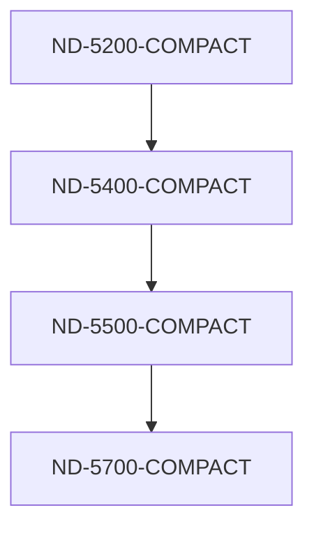

## Page 1

```
[Photo: ND-5000 Compact promotional image featuring multiple monitors, a central unit, and a circuit board]

ND - 5000 COMPACT

NP
Norsk Data

Scanned by Jonny Oddene for Sintran Data © 2011
```

---

## Page 2

# ND-5000-COMPACT

## Ny teknologi — nye muligheter

Vår nye fleksible 32-bits maskinserie, ND-5000-COMPACT, representerer et meget bra alternativ når det gjelder databehandling. Det vil alltid finnes en modell som svarer nøyaktig til de krav som stilles, enten det gjelder ADB eller teknisk/vitenskapelige applikasjoner. ND-5000-COMPACT representerer et langt skritt fremover i utviklingen av minmaskiner med høy ytelse.

- Maskinen kan plasseres i kontormiljø.
- Den krever ikke eget datarom.
- Enkel menystyrt drift.
- Den er liten og har lavt støynivå.
- Lave kostnader pr. transaksjon/pr. arbeidsplass.
- Flere brukere får tilgang til større datakraft.
- Stor datakraft gir lettere bruk.

Hurtig databehandling og stor hukommelseskapasitet gjør ND-5000-COMPACT i stand til å håndtere de mest avanserte applikasjonspakker og sørger for at flere brukere kan utføre forskjellige oppgaver samtidig.

## Applikasjoner

### 32-bits teknologi — flere løsninger

Våre kunder vil nå få et større programvareutvalg, da samtlige brukere nå kan basere seg på 32-bits teknologi.

ND-5000-COMPACT danner basis for NDs tilbud av velprøvd programvare som dekker alt fra økonomi, regnskap og lagerstyring til kontorstøttesystemer som tekstbehandling, regneark, grafikk eller elektronisk post.

For spesielle brukergrupper er det utviklet løsninger som:

- **ND Technovision**, som tilbyr nøyaktig 2D/3D konstruksjon fullt integrert med produksjonsløsninger.
- Databasesystemer for økonomisk analyse og administrasjon innen eksempelvis bank, finans og forsikring.
- Avanserte systemer for å skrive inn og håndtere tekst og grafikk til bruk innen grafisk industri.
- Kraftige systemer for lagring og distribuering av informasjon til bruk for offentlig sektor — både innen stat og kommune.

```
[Photo: Computer system ND-5200 Compact]
```

```
[Photo: Office setup with computers]
```

---

## Page 3

# Distribuert databehandling
## ND-5000-COMPACT — ideell som avdelingsmaskin

ND-5000-COMPACT er spesielt egnet for distribuert databehandling. Mange organisasjoner har en geografisk spredning som gjør sentralisert databehandling utilstrekkelig. Kompakt størrelse, små krav til miljø, høy ytelse og store utvidelsesmuligheter gjør ND-5000-COMPACT ideell for dette formålet. Den store bredden i serien gjør det mulig å utforme systemet slik at det blir helt i samsvar med avdelingens behov.

![Photo: People working with computers]

# Utvidelsesmuligheter
## Oppgradering — nettverk

ND-SAFE — Norsk Datas System-Arkitektur For Ekspansjon — sørger for en sikker investering både når det gjelder maskin- og programvare ved å se til at systemet kan vokse i takt med økende behov langt inn i fremtiden. Enten ved oppgradering til kraftigere modeller, eller ved å koble flere systemer sammen i et nettverk ved hjelp av Ethernet eller ND-COSMOS.

Diagrammet gir en oversikt over den relative ytelsen til de ulike modellene i den nye ND-5000-COMPACT-serien.

Pilene viser oppgraderingsmulighetene innen serien.



# Tekniske data
## Modeller — ytelse

ND-5000-COMPACT-serien består av fire hovedmodeller med ytelse fra 0,5-3,5 Whetstone MIPS og spenner over et større spekter enn de fleste konkurrerende systemer. Alle systemene leveres med inntil 4 x 125 MB interne faste disker (totalt 500 MB) med 125 MB streamertape som backup-medium (A-modellene) — alternativt med diskkontroller for tilknytning av eksterne disker (B-modellene).

|                        | ND-5200-COMPACT | ND-5400-COMPACT | ND-5500-COMPACT | ND-5700-COMPACT |
|------------------------|-----------------|-----------------|-----------------|-----------------|
|                        | Mod. A | Mod. B | Mod. A | Mod. B | Mod. A | Mod. B | Mod. A | Mod. B |
| Diskstørrelse (MB)     | 60-500 Ekstern  | 125-500 Ekstern | 125-500 Ekstern | 125-500 Ekstern |
| Sikkerhetskopi på streamer | Ja  | Nei | Ja | Nei | Ja | Nei | Ja | Nei |
| Whetstone MIPS         | 0.5       | 1.0       | 2.0       | 3.5       |
| Hukommelse (MB) Felles | 2-32      | 2-32      | 2-32      | 4-32      |
| I/O                    | 2-32      | 2-32      | 2-32      | 2-32      |

Scanned by Jonny Oddene for Sintran Data © 2011

---

## Page 4

# Norsk Data

## Adresser ND-kontorer i Norge

### Salgskontorer

| Kontor       | Adresse                             | Telefon       | Telex          |
|--------------|-------------------------------------|---------------|----------------|
| **Avd. Oslo**     | Olaf Helsets vei 6                  | Tlf.: (02) 62 80 00 | Tlx.: 74448 nd n |
|              | Postboks 70, Bogerud                 |               |                |
|              | 0621 Oslo 6                          |               |                |
| **Avd. Bergen**  | Conrad Mohrsvei 1                    | Tlf.: (05) 28 80 00 |                |
|              | 5032 Minde                          |               |                |
| **Avd. Sandnes** | Hoveveien 30                        | Tlf.: (04) 62 52 00 |                |
|              | Postboks 555, Krossen               |               |                |
|              | 4301 Sandnes                        |               |                |

### Avd. Tromsø

| Kontor        | Adresse                               | Telefon       |
|---------------|---------------------------------------|---------------|
| **Avd. Tromsø**   | Styrmannsveien 13                     | Tlf.: (083) 71 766 |
|               | Postboks 2113                         |               |
|               | 9014 Håpet                            |               |

### Avd. Trondheim

| Kontor        | Adresse                               | Telefon       | Telex          |
|---------------|---------------------------------------|---------------|----------------|
| **Avd. Trondheim**| Håkon VII's gate 7                  | Tlf.: (07) 92 12 22 | Tlx.: 55580 ndtrd |
|               | Postboks 78                          |               |                |
|               | 7001 Trondheim                       |               |                |

### Avd. Porsgrunn

| Kontor          | Adresse                             | Telefon       |
|-----------------|-------------------------------------|---------------|
| **Avd. Porsgrunn** | Olavs gt. 20                        | Tlf.: (035) 59 300 |
|                 | Postboks 1044                       |               |
|                 | 3901 Porsgrunn                      |               |

### Servicekontorer

| Kontor        | Telefon       |
|---------------|---------------|
| **Asker**         | (02) 79 52 50  |
| **Bodø**          | (081) 27 590  |
| **Bø**            | (03) 95 12 11 |
| **Fredrikstad**   | (032) 47 000  |
| **Førde**         | (057) 23 955  |
| **IFE-Halden**    | (031) 83 100, l. 196 |
| **Hamar**         | (065) 31 113  |
| **Harstad**       | (082) 67 499  |
| **Haugesund**     | (047) 28 455  |
| **Kristiansand**  | (042) 99 333  |
| **Steinkjer**     | (077) 65 411  |
| **Tønsberg**      | (033) 12 434  |
| **Ålesund**       | (071) 40 907  |

[Photo: Norsk Data logo]

---

