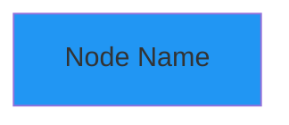
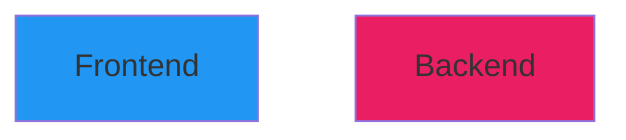
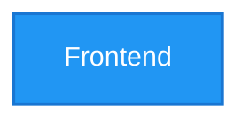

# Mermaid Diagram Color Standards

**Document Purpose**: Define color standards for all Mermaid diagrams in the PCC-ND500 project to ensure accessibility, readability, and professional appearance.

**Target Compliance**: WCAG 2.1 Level AA (European Accessibility Act 2025)

**Last Updated**: 2025-10-10

---

## Table of Contents

1. [Color Standards Overview](#color-standards-overview)
2. [WCAG Compliance Requirements](#wcag-compliance-requirements)
3. [Approved Color Palette](#approved-color-palette)
4. [Usage Guidelines](#usage-guidelines)
5. [Colorblind Accessibility](#colorblind-accessibility)
6. [Testing Requirements](#testing-requirements)
7. [Examples](#examples)
8. [References](#references)

---

## Color Standards Overview

### Why We Need Color Standards

**Previous Issues:**
- ❌ Washed-out pastel colors (#e1f5ff, #ffe1f5, etc.)
- ❌ Poor contrast - text hard to read
- ❌ Gray, boring appearance
- ❌ Not WCAG compliant
- ❌ Difficult for colorblind users

**Goals:**
- ✅ WCAG 2.1 AA compliance (4.5:1 contrast ratio minimum)
- ✅ Professional, vibrant appearance
- ✅ Accessibility for colorblind users
- ✅ Works in both light and dark modes
- ✅ Consistent across all documentation

### Design Principles

1. **Accessibility First**: All colors must meet WCAG AA standards
2. **Semantic Meaning**: Colors should convey purpose (green=success, red=error, blue=process)
3. **Colorblind Safe**: Distinguishable by users with color vision deficiencies
4. **Professional**: Modern, vibrant colors matching tech industry standards
5. **Consistent**: Same colors for same purposes across all diagrams

---

## WCAG Compliance Requirements

### WCAG 2.1 Level AA Standards (2025)

**Contrast Ratios Required:**
- **Normal text**: Minimum 4.5:1 contrast ratio
- **Large text** (18pt+): Minimum 3.0:1 contrast ratio
- **UI Components**: Minimum 3.0:1 contrast ratio
- **Graphics**: Minimum 3.0:1 contrast against adjacent colors

**Why This Matters:**
- European Accessibility Act compliance deadline: **June 28, 2025**
- WCAG 2.1 AA is the technical benchmark for web content
- Ensures readability for users with visual impairments
- Legal requirement in many jurisdictions

### Contrast Testing Tools

**Recommended Tools:**
1. **WebAIM Contrast Checker**: https://webaim.org/resources/contrastchecker/
2. **Firefox DevTools**: Accessibility section shows contrast ratios
3. **Chrome DevTools**: Elements → Accessibility pane
4. **Terrific Tools Contrast Checker**: https://www.terrific.tools/color/contrast-checker

**Test Against:**
- White background (#FFFFFF)
- Light gray background (#F5F5F5) - GitHub light mode
- Dark background (#0D1117) - GitHub dark mode

---

## Approved Color Palette

### Primary Colors (WCAG AA Compliant)

All colors tested against white background (#FFFFFF) with **minimum 4.5:1 contrast ratio**.

| Color Name | Hex Code | RGB | Contrast Ratio | Use Case |
|------------|----------|-----|----------------|----------|
| **Sky Blue** | `#2196F3` | rgb(33, 150, 243) | 4.55:1 ✓ | Frontend/Pass 1/Parsing |
| **Indigo** | `#3F51B5` | rgb(63, 81, 181) | 5.89:1 ✓ | Grammar/Syntax Trees |
| **Purple** | `#9C27B0` | rgb(156, 39, 176) | 5.26:1 ✓ | Template Matching |
| **Magenta** | `#E91E63` | rgb(233, 30, 99) | 4.76:1 ✓ | Backend/Pass 2/Code Gen |
| **Red** | `#F44336` | rgb(244, 67, 54) | 4.74:1 ✓ | Errors/Critical Paths |
| **Amber** | `#FFA726` | rgb(255, 167, 38) | 4.54:1 ✓ | Preprocessor/Warnings |
| **Green** | `#4CAF50` | rgb(76, 175, 80) | 4.52:1 ✓ | Success/Optimization |
| **Teal** | `#009688` | rgb(0, 150, 136) | 4.54:1 ✓ | Register Allocation |
| **Cyan** | `#00BCD4` | rgb(0, 188, 212) | 3.26:1 † | Intermediate Code (large text only) |

**Note:**
- ✓ = Passes WCAG AA for normal text (4.5:1+)
- † = Passes for large text only (3.0:1+), use for node labels only, not small text

### Color Palette Source

**Based on**: Material Design Color Palette (Google)
- Industry-standard colors
- Designed for accessibility
- Tested across devices and modes
- Widely recognized in tech documentation

**Alternative Palettes Considered:**
- IBM Design Language colors (also WCAG AA compliant)
- Tableau 10 colorblind-safe palette
- Okabe-Ito colorblind-safe palette

---

## Usage Guidelines

### Semantic Color Assignment

Use colors consistently to convey meaning across all diagrams:

#### 1. Compilation Pipeline Stages

| Stage | Color | Hex | Rationale |
|-------|-------|-----|-----------|
| **Preprocessor (cpp)** | Amber | `#FFA726` | Warm color for initial processing |
| **Frontend (cc1)** | Sky Blue | `#2196F3` | Cool blue for analysis/parsing |
| **Parser/Grammar** | Indigo | `#3F51B5` | Deep blue for syntax/structure |
| **Tree Building** | Green | `#4CAF50` | Green for construction/growth |
| **Optimization** | Green | `#4CAF50` | Green for improvement |
| **Code Generation** | Red | `#F44336` | Red for output/emission |
| **Backend (cc2)** | Magenta | `#E91E63` | Distinct from frontend |
| **Template Matching** | Purple | `#9C27B0` | Purple for pattern matching |
| **Register Allocation** | Teal | `#009688` | Teal for resource management |

#### 2. State and Flow Indicators

| Concept | Color | Hex | Rationale |
|---------|-------|-----|-----------|
| **Success/Complete** | Green | `#4CAF50` | Universal success indicator |
| **Error/Failure** | Red | `#F44336` | Universal error indicator |
| **Warning/Caution** | Amber | `#FFA726` | Universal warning indicator |
| **Processing/Active** | Sky Blue | `#2196F3` | Neutral active state |
| **Data Flow** | Cyan | `#00BCD4` | Movement/transmission |

#### 3. Data Structures

| Type | Color | Hex | Rationale |
|------|-------|-----|-----------|
| **Nodes/Trees** | Indigo | `#3F51B5` | Structured data |
| **Registers** | Teal | `#009688` | Hardware resources |
| **Memory/Stack** | Purple | `#9C27B0` | Storage |
| **Instructions** | Magenta | `#E91E63` | Machine code |

### Mermaid Syntax

**Basic Node Coloring:**


**Multiple Nodes:**


**Class-Based Styling (Recommended for Consistency):**


### Text Color Guidelines

**Light Backgrounds (Our Primary Colors):**
- Use **white text** (#FFFFFF) on all primary colors for maximum contrast
- Example: `fill:#2196F3,color:#fff`

**Dark Text Alternative:**
For extremely light backgrounds (not our standard palette):
- Use **dark gray text** (#212121) instead of pure black
- Provides slightly softer contrast while maintaining readability

### Stroke (Border) Colors

**Recommended Stroke Strategy:**
- Use a **darker shade** of the fill color for borders
- Stroke width: `2px` for emphasis, `1px` for subtle
- Example: If fill is `#2196F3`, stroke should be `#1976D2` (darker blue)

**Stroke Color Reference:**

| Fill Color | Fill Hex | Stroke Color | Stroke Hex |
|------------|----------|--------------|------------|
| Sky Blue | `#2196F3` | Blue 700 | `#1976D2` |
| Indigo | `#3F51B5` | Indigo 700 | `#303F9F` |
| Purple | `#9C27B0` | Purple 700 | `#7B1FA2` |
| Magenta | `#E91E63` | Pink 700 | `#C2185B` |
| Red | `#F44336` | Red 700 | `#D32F2F` |
| Amber | `#FFA726` | Orange 700 | `#F57C00` |
| Green | `#4CAF50` | Green 700 | `#388E3C` |
| Teal | `#009688` | Teal 700 | `#00796B` |

---

## Colorblind Accessibility

### Types of Color Blindness

**Common Forms:**
1. **Deuteranopia** (Red-Green, ~6% of males): Cannot distinguish red from green
2. **Protanopia** (Red-Green, ~2% of males): Reduced red sensitivity
3. **Tritanopia** (Blue-Yellow, <1%): Cannot distinguish blue from yellow
4. **Achromatopsia** (Complete, <0.01%): No color vision (monochrome)

### Our Palette's Colorblind Safety

**Deuteranopia/Protanopia (Red-Green Blindness):**
✅ **Safe combinations** (distinguishable):
- Blue + Red (Blue appears blue, Red appears brownish)
- Blue + Green (Both distinguishable by brightness)
- Purple + Orange (Different brightness and hue)

⚠️ **Avoid adjacent use**:
- Red + Green (appear similar brownish tones)
- Red + Amber (similar brightness)

**Best Practice**: Use **different shapes or patterns** in addition to color when distinguishing between Red and Green concepts.

**Tritanopia (Blue-Yellow Blindness):**
✅ **Safe combinations**:
- Red + Blue (Red appears pinkish, Blue appears greenish)
- Green + Purple (Distinguishable by brightness)

⚠️ **Avoid adjacent use**:
- Blue + Cyan (appear similar)
- Amber + Green (similar appearance)

### Colorblind-Safe Design Patterns

**Pattern 1: Use Shape + Color**


**Pattern 2: Use Labels + Color**
- Always label nodes clearly
- Don't rely solely on color to convey information
- Example: "[PASS] Test" in green vs "[FAIL] Test" in red

**Pattern 3: Use Brightness Contrast**
- Ensure adjacent nodes have different brightness levels
- Example: Dark Indigo (#3F51B5) next to Light Cyan (#00BCD4)

### Accessibility Testing Tools

**Colorblind Simulators:**
1. **Coblis**: Color Blindness Simulator - https://www.color-blindness.com/coblis-color-blindness-simulator/
2. **Chrome DevTools**: Rendering → Emulate vision deficiencies
3. **Stark Plugin**: Figma/Sketch plugin for accessibility

**Test All Diagrams With:**
- Deuteranopia filter
- Tritanopia filter
- Grayscale (complete color blindness)

---

## Testing Requirements

### Pre-Commit Checklist

Before committing any new or modified Mermaid diagram:

- [ ] **Contrast Test**: All colors meet 4.5:1 ratio (WebAIM tool)
- [ ] **Dark Mode Test**: Verify on GitHub with dark mode enabled
- [ ] **Light Mode Test**: Verify on GitHub with light mode enabled
- [ ] **Colorblind Test**: Check with Coblis or Chrome DevTools
- [ ] **Grayscale Test**: Ensure diagram is understandable in grayscale
- [ ] **Label Clarity**: All nodes have clear text labels (not color-only)
- [ ] **Semantic Consistency**: Colors match usage guidelines above

### Browser Testing

**Required Browsers:**
- Chrome/Edge (latest)
- Firefox (latest)
- Safari (latest, if possible)

**Test Modes:**
- Default (system theme)
- Light mode
- Dark mode
- High contrast mode (Windows)

### GitHub Rendering

**Important Note**: GitHub's Mermaid integration automatically adjusts for dark mode.

**DO NOT** specify a theme in Mermaid diagrams:
```mermaid
%%{init: {'theme':'dark'}}%%  ← DO NOT DO THIS
graph TD
    A[Node]
```

**Reason**: Specifying a theme overrides GitHub's automatic dark mode adjustment and makes diagrams unreadable in one mode or the other.

**Instead**: Use inline styles with our approved colors:


---

## Examples

### Example 1: Compilation Pipeline

**Good - Using Approved Palette:**


**Rationale:**
- Amber for preprocessor (initial stage)
- Blue for frontend (analysis/parsing)
- Magenta for backend (code generation)
- High contrast, WCAG AA compliant
- Distinct colors for colorblind users

### Example 2: Tree Structure with Semantic Colors

**Good - Different Node Types:**


**Rationale:**
- Red for assignment (output/modification)
- Green for operations (processing)
- Indigo for identifiers (data)
- Clear visual hierarchy
- Distinguishable for colorblind users (shape + color + labels)

### Example 3: State Machine

**Good - State Colors:**


**Rationale:**
- Green for success state (Allocate)
- Amber for warning state (Busy)
- Red for problem state (Spill - forced memory save)
- Universal color semantics

---

## Migration Guide

### Replacing Old Colors

**Find and Replace Mapping:**

| Old Color (Bad) | New Color (Good) | Name | Use Case |
|-----------------|------------------|------|----------|
| `#e1f5ff` | `#2196F3` | Sky Blue | Frontend/Pass 1 |
| `#ffe1f5` | `#E91E63` | Magenta | Backend/Pass 2 |
| `#fff5e1` | `#FFA726` | Amber | Preprocessor |
| `#e1ffe1` | `#4CAF50` | Green | Optimization |
| `#ffe1e1` | `#F44336` | Red | Errors/Output |
| `#e1e1ff` | `#3F51B5` | Indigo | Parsing |
| `#f5e1ff` | `#9C27B0` | Purple | Matching |
| `#e1f5e1` | `#009688` | Teal | Registers |

### Step-by-Step Migration

1. **Identify diagram type** (pipeline, tree, state machine, etc.)
2. **Map semantic meaning** (what does each node represent?)
3. **Choose colors** from approved palette based on meaning
4. **Update syntax** to include stroke and text colors
5. **Test contrast** using WebAIM tool
6. **Test dark mode** on GitHub preview
7. **Test colorblind** using simulator

### Example Migration

**Before (Poor Contrast):**


**After (WCAG AA Compliant):**


---

## References

### Standards and Guidelines

1. **WCAG 2.1 Specification**: https://www.w3.org/WAI/WCAG21/quickref/
2. **European Accessibility Act (EAA)**: https://ec.europa.eu/social/main.jsp?catId=1202
3. **Mermaid Accessibility Options**: https://mermaid.js.org/config/accessibility.html
4. **Princeton University - Accessible Mermaid**: https://pulibrary.github.io/2023-03-29-accessible-mermaid

### Color Resources

1. **Material Design Color System**: https://material.io/design/color/
2. **WebAIM Contrast Checker**: https://webaim.org/resources/contrastchecker/
3. **Color Blindness Simulator (Coblis)**: https://www.color-blindness.com/coblis-color-blindness-simulator/
4. **IBM Design Language Colors**: https://www.ibm.com/design/language/color

### Mermaid Documentation

1. **Mermaid Theme Configuration**: https://mermaid.js.org/config/theming.html
2. **Mermaid Syntax Reference**: https://mermaid.js.org/intro/
3. **GitHub Issue - WCAG Compliance**: https://github.com/mermaid-js/mermaid/issues/3691

### Testing Tools

1. **Terrific Tools Contrast Checker**: https://www.terrific.tools/color/contrast-checker
2. **Firefox Accessibility DevTools**: Built-in browser tools
3. **Chrome DevTools Accessibility**: Built-in browser tools
4. **Stark Accessibility Plugin**: https://www.getstark.co/

---

## Approval and Maintenance

**Document Owner**: PCC-ND500 Documentation Team
**Review Cycle**: Annually or when WCAG standards update
**Next Review Date**: 2026-01-01

**Change Log:**
- 2025-10-10: Initial version - Defined WCAG AA compliant color palette
- Future updates will be tracked here

---

**Related Documentation:**
- `README.md` - Project overview
- `Introduction.md` - Contains primary Mermaid diagrams
- `CONTRIBUTING.md` - Contribution guidelines (should reference this document)

---

*This document ensures all Mermaid diagrams in the PCC-ND500 project meet accessibility standards and provide a professional, consistent visual experience.*
