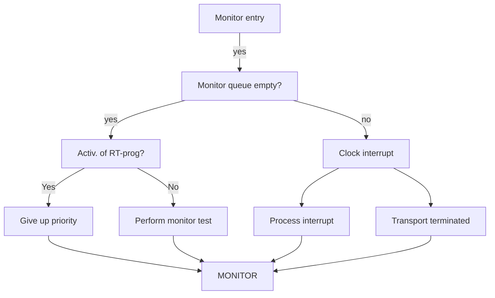

## Page 1

# SINTRAN III

## System Documentation

NORSK DATA A.S

Scanned by Jonny Oddene for Sintran Data © 2021

---

## Page 2

I'm sorry, but the image you provided does not contain any visible text to convert to Markdown. Please provide a clearer image with text.

---

## Page 3

# SINTRAN III

## System Documentation

Scanned by Jonny Oddene for Sintran Data © 2021

---

## Page 4

I'm unable to directly read or convert the content of the image you uploaded. If you have any text content you wish to convert into Markdown format, feel free to provide it here, and I'd be glad to help with that!

---

## Page 5

# REVISION RECORD

| Revision | Notes |
|----------|-------|
| 12/75    | Original Printing |
| 09/77    | Revision A |
| 02/78    | Revision B |
|          | The following pages have been removed: |
|          | 3-60, 3-68, 3-86, 3-87, 3-88 |
|          | The following pages have been revised or added: |
|          | 2-10, 3-9, 3-13, 3-22, 3-37, 3-38, 3-59, 3-61, 3-62, 3-65, 3-65a, 3-66, 3-67, 3-69, 3-70, 3-72, 3-73, 3-73a, 3-73b, 3-73c, 3-76, 3-77, 3-78, 3-79, 3-83, 3-84, 3-85, 3-89, 3-89a, 3-89b, 3-89c, 3-89d, 3-89e, 3-89f, 3-89g, 3-89h, 3-89i, 3-89j, 3-89k, 3-92, 3-92a, 3-95, 3-95a, 3-95b, 3-95c, 3-95d, 3-95e, 3-102, 3-103, 3-103a, 3-104, 3-105, 3-105a, 3-106, 3-108, 3-118, 3-121a, 3-125, 3-126, 3-127a, 4-5, 4-7, 4-8, 4-20, 4-29p |
| 05/79    | Revision C |
|          | Chapter 2 has been changed |
| 06/80    | Revision D |
|          | Pages 3-1 to 3-76 have been replaced by pages 3-1 to 3-65 |
|          | Appendices B to E have been inserted. (Appendix A - Data Fields - can be obtained separately) |

Publ.No. ND-60.062.01  
December 1975  

NORSK DATA A.S.  
Lørenveien 57, Postboks 163 Økern, Oslo 5, Norway

---

## Page 6

I'm sorry, but the image you uploaded does not contain any visible text or content for me to convert to Markdown. Can you provide a different image or describe the content you need?

---

## Page 7

# TABLE OF CONTENTS

....oo0oo....

| Section | Title |
|---------|-------|
| 1       | INTRODUCTION |
| 1.1     | General |
| 1.2     | The Development of SINTRAN III |
| 2       | OPERATING SYSTEM ARCHITECTURE |
| 2.1     | System Parts |
| 2.2     | Use of the Interrupt System |
| 2.3     | Use of the Memory Management System |
| 2.4     | Layout in Memory |
| 2.5     | Disk Layout |
| 3       | REAL TIME MONITOR |
| 3.1     | General Description |
| 3.1.1   | Data Definitions |
| 3.2     | Monitor Kernel |
| 3.2.1   | Data Structure |
| 3.2.1.1 | The Monitor Queue |
| 3.2.1.2 | The Execution Queue |
| 3.2.1.3 | Waiting Queues |
| 3.2.2   | The Monitor Level Entry |
| 3.2.3   | The Monitor Call Decoder |
| 3.2.4   | Kernel Monitor Calls |
| 3.2.4.1 | Entering Programs into Execution Queue |
| 3.2.4.2 | Changing Program's Priority |
| 3.2.4.3 | Aborting a Program |
| 3.2.4.4 | Reserving and Releasing Resources |
| 3.2.4.5 | Entering the Waiting State Voluntarily |
| 3.2.4.6 | Permitting and Inhibiting an RT-Program |
| 3.2.4.7 | Auxiliary Routine for Starting of an RT-Program |
| 3.2.5   | Waiting Queues Operations |
| 3.2.5.1 | Inserting a Program into a Waiting Queue |
| 3.2.5.2 | Removing a Program from a Waiting Queue |

---

## Page 8

# Section 3.3
## Time Handling
- **3.3.1** Data Structure and Basic Operations
- **3.3.2** Clock Interrupt Handling
- **3.3.3** Time Monitor Calls
  - **3.3.3.1** Scheduling an RT-Program for Execution
  - **3.3.3.2** Periodical Execution of an RT-Program
  - **3.3.3.3** Halting an RT-Program Temporarily
  - **3.3.3.4** Updating the Clock
  - **3.3.3.5** Adjusting the Clock
  - **3.3.3.6** Examining the Clock

# Section 3.4
## Segment Handling
- **3.4.1** Data Structure
- **3.4.2** Segment Supervising
  - **3.4.2.1** Segment Administration
  - **3.4.2.2** Segment Checking
  - **3.4.2.3** Clearing the Page Index Tables
  - **3.4.2.4** Initiating the Page Index Tables
  - **3.4.2.5** Handling Page Faults
- **3.4.3** Segment Fetching
  - **3.4.3.1** Getting a Segment into Core
  - **3.4.3.2** Finding the Least Recently Used Segment
  - **3.4.3.3** Mass Storage Segment Transfer
  - **3.4.3.4** Linking Pages over to a New Segment

# Section 3.5
## I/O System
- **3.5.1** I/O Data Structure
- **3.5.2** Interrupt Levels
  - **3.5.2.1** Subroutines Called from Drivers
  - **3.5.2.2** Clock Interrupt Driver
  - **3.5.2.3** Entry for Internal Interrupts
- **3.5.3** Auxiliary Routines
- **3.5.4** Timer
- **3.5.5** Block Oriented I/O Handling
  - **3.5.5.1** User Monitor Calls
  - **3.5.5.2** System Monitor Call
  - **3.5.5.3** Activating the Driver Level
  - **3.5.5.4** Disk/Drum Transfer on Driver Level
  - **3.5.5.5** Direct Device Handling
- **3.5.6** Character Oriented I/O Handling
  - **3.5.6.1** I/O Monitor Calls
  - **3.5.6.2** Auxiliary Routines
  - **3.5.6.3** Internal Devices
  - **3.5.6.4** Terminal Input Handling
  - **3.5.6.5** Terminal Output Handling
- **3.5.7** Process I/O Handling

# Section 3.6
## Error Recording

# Section 3.7
## Routines for System Stop and Start
- **3.7.1** Power Fail Routine
- **3.7.2** Restart Routine
- **3.7.3** Initial Start Routine

---

## Page 9

# BACKGROUND PROCESSOR

## 4.1 Core-Resident Part

- **4.1.1** Data Structure
- **4.1.2** Change of Interrupt Level
  - **4.1.2.1** Auxiliary Routines
- **4.1.3** Time Slicer
- **4.1.4** Miscellaneous Routines
  - **4.1.4.1** Breakpoint for DMAC
  - **4.1.4.2** Address Check Routine
- **4.1.4.3** Change of Segments
- **4.1.4.4** Entering User RT
- **4.1.4.5** Address Translation

## 4.2 System Segment

- **4.2.1** Data Structure
- **4.2.2** Level Shifting
  - **4.2.2.1** Return from Background Monitor Calls
  - **4.2.2.2** File System Monitor Call Handling
  - **4.2.2.3** Start Subsystem
  - **4.2.2.4** "Escape" Action
- **4.2.3** Non-Reentrant Monitor Calls
  - **4.2.3.1** Define Breakpoint
  - **4.2.3.2** Get Breakpoint
  - **4.2.3.3** Set Breakpoint
  - **4.2.3.4** Read User Mode
  - **4.2.3.5** Time Used
- **4.2.4** Non Reentrant Command Routines
  - **4.2.4.1** Activation of Reentrant Subsystems
  - **4.2.4.2** Activation of a User Subsystem
  - **4.2.4.3** Restart of a Subsystem
  - **4.2.4.4** Dump a Subsystem
  - **4.2.4.5** Read Binary File
  - **4.2.4.6** Activation of the RT-Loader
  - **4.2.4.7** Activation of DMAC
  - **4.2.4.8** Breakpoint Handling in DMAC
- **4.2.5** Miscellaneous Routines
  - **4.2.5.1** Access of Single Location
  - **4.2.5.2** Check User's Address Space
  - **4.2.5.3** File Error Message Routine
  - **4.2.5.4** Activation of File System Routines
- **4.2.6** Batch I/O Processor
  - **4.2.6.1** Data Structure
  - **4.2.6.2** Batch and MODE Input/Output

---

## Page 10

# Section

| Section  | Description                                      |
|----------|--------------------------------------------------|
| 4.3      | Command Segment                                  |
| 4.3.1    | Data Structure                                   |
| 4.3.2    | Command Processor                                |
| 4.3.3    | Commands                                         |
| 4.3.3.1  | The LOG IN Routine                               |
| 4.3.3.2  | The RECOVER Command                              |
| 4.3.3.3  | the DUMP and DUMP-RENNTRANT Commands             |
| 4.3.3.4  | the PLACE-BINARY and LOAD-BINARY Commands        |
| 4.3.3.5  | The LOOK-AT Commands                             |
| 4.3.3.6  | Miscellaneous Commands                           |
| 4.3.4    | Auxiliary Routines                               |
| 4.3.5    | Stack Routines                                   |
| 4.3.6    | Accounting and Batch Commands                    |
| 4.4      | Special RT-Programs                              |
| 4.4.1    | Start RT Program                                 |
| 4.4.2    | Error RT Program                                 |

# 5 OVERALL FUNCTIONAL DESCRIPTION

# APPENDIX A

| Code | Description                |
|------|----------------------------|
| A.1  | The Teletype Datafields    |
| A.1.1| The Input Datafield        |
| A.1.2| The Output Datafield       |
| A.2  | The Card Reader Datafield  |
| A.3  | The Disk Datafield         |

ND-60.062.01

---

## Page 11

# 1. INTRODUCTION

This chapter gives an introduction to the development of SINTRAN III. It also describes briefly the hardware and software environment used by SINTRAN III.

## 1.1 General

SINTRAN III is a multiprogramming real-time operating system for the NORD-10 computer. It allows users to run real-time, time sharing, batch and remote batch programs concurrently.

Details about the available features may be found in the manual "SINTRAN III USERS GUIDE".

ND-60.062.01

---

## Page 12

# The Development of SINTRAN III

For better understanding of the architecture of SINTRAN III it may be interesting to take a review of how the design ideas and implementation evolved.

Just after the NORD-10 computer had been introduced in summer 1973, a real-time operating system became necessary. There was already an operating system, SINTRAN II, which had been carried over from the NORD-1 computer with minimal effort. However, SINTRAN II did not utilize the new and powerful memory management system of NORD-10.  
SINTRAN II contained some drawbacks which should be removed in a new operating system. It restricted program scheduling severely and made inter-program protection difficult.

In SINTRAN III programs are handled independently such that programs waiting for some event (e.g. I/O transfer) do not block execution of other programs.

Also, the concept of "segments" is introduced in SINTRAN III. Segments consist of an arbitrary number of 1K pages. They are contiguous areas in the logical address space. Small programs needing quick response are placed on small segments. Since the hardware paging system provides for relocation, several small segments may be contained in the memory at the same time, even if they use the same logical address space. Thus, swapping is reduced considerably and the system gets more flexible seen from the user's point of view.

A further refinement is attained by allowing a program to reside on two segments. The user is enabled to use the two segments in some interesting ways:
- he may put a set of re-entrant subroutines on one segment which may be common to several programs;
- he may have one common data segment which may be accessed by programs on other segments; or
- he may use one segment containing a program accessing data on several other segments.

Two alternative paging strategies are considered in SINTRAN III. In the first alternative, all pages belonging to a requested segment are transferred to core at once. If most of the pages were to be used anyhow this method would reduce transfer overhead. (It is easy to estimate the worst case response time for a program).

Programs executing monitor calls, will not enter the waiting state during parameter fetching since no legal page faults would occur. This alternative is a good solution for the typical real-time program.

---

## Page 13

# Demand Paging and Protection Systems

In the other alternative, pure demand paging is used. In this case a page belonging to a segment is not transferred to core before it is referred to. This solution is very useful for big programs which may be even bigger than the size of the available physical memory. Also, swapping overhead will decrease for programs normally using only a small part, since only the actually needed pages are transferred.

Both paging strategies have proved to be necessary and are associated with segments which may be defined as "non-demand" or "demand" segments.

The problem of protection is solved by hardware which provides for two different protect mechanisms:

i. the ring protection system  
ii. the permit protection system

The ring protection system makes protection between different program categories possible. The system placed on ring 2 is thus protected against user programs on ring 0 or 1.

Special use of the page index tables provides for protection of user programs against each other: Only the segments of one program are present in the page index tables at the same time; unused entries are zero, except those used by the core resident part of the system which is ring protected. Thus, unless programs share segments, they are protected against each other.

The permit protection system makes internal protection of program parts against each other possible: A whole segment may be declared as a read-only part by removing write permission. Protection setting for individual pages in a segment is considered to imply too big overhead.

In the first version of SINTRAN III only one page index table was used, partly in order to simplify debugging, partly because a few details in hardware were not finished at that stage. This restricted the user's available logical address space since the lower part of the page index table was used by the system.

Versions later than March 1975 use all four page index tables making the entire 64K words address space available to the user.

A real-time operating system also needs some on-line operator communication. In SINTRAN II, facilities for typing commands to start and stop programs and some background activities such as editing, compiling and loading of programs were available.

ND-60.062.01

---

## Page 14

# SINTRAN III Overview

In a more general framework, SINTRAN III is to contain the same facilities. The concepts of the pure time sharing system, NORD-1 TSS, was used for the background part of SINTRAN III, but only a subset was implemented. Later, a combination of a real-time and time sharing system turned out to be necessary. The background part has been expanded to provide for full time sharing facilities.

The first version of SINTRAN III used the file handling concept of SINTRAN II which was very simple. Files were fixed areas on mass storage, which could be accessed randomly blockwise. Since autumn 1974 a general file system specially developed is interfaced to SINTRAN III.

The concept of inter-program communication has been carried over from SINTRAN II to SINTRAN III. A common data area where real-time programs can access certain user tables or variables, is implemented. However, if several programs are allowed to access and modify common variables, inconsistency in data may arise. When working on common variables a program must be able to establish a critical region in which it can not be interrupted by programs wishing to do the same.

In SINTRAN II this problem was easy to solve due to the inherent restrictions in the scheduling strategy. Programs with equal priority could not interrupt each other.

Since programs under SINTRAN III are far more independent, some form of protection is needed. The concept of semaphores has been chosen. A semaphore is a common data element on which two operations may be performed: reservation and release. If a program tries to reserve a semaphore already reserved by some other program, it will be put in a waiting queue until the semaphore is released. Thus, a semaphore may be connected to the common data area and must be reserved before data can be accessed and released afterwards.

Normally, I/O-devices are common resources which should be used by only one program at the same time. Therefore a semaphore is attached to each I/O-device as a standard facility. In addition, a number of "free" semaphores are available for general use. These may be considered degenerated devices which can only be reserved and released.

Considering the I/O handling part, device independence is of prime importance. Changing from one device to another shall only imply change of the logical device number in a monitor call. By simplifying the I/O system, the general monitor calls INBT and OUTBT are made efficient enough for use of most of the devices.

ND-60.062.01

Scanned by Jonny Godefence for Sintran Data © 2021

---

## Page 15

# SINTRAN III Design Objectives

Finally, the real-time monitor calls for controlling programs from other programs are carried over to SINTRAN III with small modifications, and just a few were added.

When designing SINTRAN III, the main objectives were:

i. Reliability  
ii. User facilities  
iii. Low overhead  

Reliability is the most critical claim. A system with the facilities of SINTRAN III has to be rather complex by nature, and complexity is the main enemy of reliability. Complexity is kept on a reasonable level by de-coupling and generalizing the structure where possible. Consistency checks are widely used. And, at last, structured programming is obtained as far as possible by use of the specially designed system language, NORD-PL.

Since SINTRAN III shall be used for a wide range of applications, bottlenecks are likely to appear in different areas of the system. During the design estimates have been made to avoid execution times intolerable in certain contexts.

| Code         |
|--------------|
| ND-60. 062. 01 |

---

## Page 16

I'm sorry, the image appears to be blank or unclear. Could you please provide a clearer image or another document?

---

## Page 17

# 2 OPERATING SYSTEM ARCHITECTURE

## 2.1 SYSTEM PARTS

SINTRAN III may be considered to consist of two parts: the real time monitor and the background processor (refer to Figure 2.1).

The task of the monitor is to find out why it was activated and to transfer control to the appropriate monitor function. The monitor determines when a new real time program, an RT program is to be started, considering priority, time and interrupts. It administrates segment handling and controls the I/O system which deals with external equipment.

The background processor is in principle a set of RT programs, run under the control of the real time monitor. The background processor administrates time sharing and batch processing. Thus, time sharing or batch programs must be considered as parts of this special RT program, i.e. the background processor. We may even think of them as data worked on by the background processor.

---

## Page 18

# SINTRAN III System Parts

## Overview

- **SINTRAN III**
  - **Real Time Monitor**
    - **Kernel**
    - **Segment Handling**
    - **Error Recording**
    - **I/O System**
    - **Time Handling**
  - **Background Processor**
    - **System Segment**
    - **Error Handling**
  - **Command Processor**
    - **Start Program**
    - **RT Loader** ★
  - **SINTRAN Common Catalog**
    - **File System** ★
  - **Powerfail - Start Restart**
    - **Resident Part**
  - **Time Slicer**

## Notes
- For practical reasons, the RT Loader and the File System are described in detail in separate manuals.

---

ND - 60.062.01 Rev. C  
Scanned by Jonny Oddene for Sintran Data © 2021

---

## Page 19

# 2.2 USE OF THE INTERRUPT SYSTEM

The structure of SINTRAN III is generally simplified by use of the different hardware interrupt levels in NORD-10. By running independent tasks on different levels, all priority decisions may be determined by hardware. This makes context switching extremely efficient because almost no overhead takes place.

NORD-10 has 16 interrupt levels. Each of these has a complete register set, such that a change of level needs only 0.9 μs.

SINTRAN III uses the interrupt levels in the following way:

|     |                         |
|-----|-------------------------|
| 15  |                         |
| 14  | INTERNAL INTERRUPTS     |
| 13  | REAL TIME CLOCK         |
| 12  | INPUT DEVICES           |
| 11  | MASS STORAGE DEVICES    |
| 10  | OUTPUT DEVICES          |
| 9   |                         |
| 8   |                         |
| 7   |                         |
| 6   |                         |
| 5   |                         |
| 4   | INBY / OUTBT            |
| 3   | MONITOR                 |
| 2   |                         |
| 1   | RT - PROGRAMS           |
| 0   |                         |

*Figure 2.2: The Interrupt System*

ND-60.062.01 Rev. C

Scanned by Jonny Oddene for Sintran Data © 2021

---

## Page 20

# Interrupt Control Registers

There are two 16-bits registers which control the interrupt level to be activated:

PIE — Priority Interrupt Enable  
PID — Priority Interrupt Detect  

Each bit in the two registers is associated with the corresponding interrupt level. The PIE register is controlled by program only, it informs about on which levels interrupts may occur and are served. The PID register is controlled both by hardware and software interrupts. It informs about from which level an interrupt actually comes. At any time, the highest program level for which the corresponding bits are set in both PIE and PID, is running.

If interrupts from a given level are not to be handled, the level must be disabled, i.e., the corresponding bit in PIE is reset.

If an enabled level is to be activated, the corresponding bit in PID must be set.

Level 14 is activated by all internal hardware status interrupts which are individually enabled by the internal interrupt enable register (IIE). The internal interrupts are assigned to the IIE register in the following way:

| 15 | 11 | 10 | 9 | 8  | 7  | 6 | 5 | 4 | 3 | 2 | 1 | 0 |
|----|----|----|---|----|----|---|---|---|---|---|---|---|
| NA |    | POW| MOR| PTY| IOX| PI| Z | II| PF| MPV| MC| NA|

where:

- **NA**: Not assigned
- **MC**: Monitor call
- **MPV**: Memory protect violation
- **PF**: Page fault
- **II**: Illegal instruction
- **Z**: Error indicator
- **PI**: Privileged instruction
- **IOX**: IOX error: No answer from external device
- **PTY**: Memory parity error
- **MOR**: Memory out of range
- **POW**: Power fail interrupt

Figure 2.3: The Internal Interrupt Enable Register

On level 14 only a small routine of the monitor kernel is running. It analyzes interrupts by use of the 4 bits internal interrupt code register (IIC) which contains the corresponding bit number of the interrupting source (1 - 10).

The levels 10, 11, 12 and 13 are used by the driver routines which are started by external interrupts.

Level 3 is the main monitor level. Most of the kernel, time handling, segment handling and parts of the I/O system are executed on this level.

Level 1 is used by all the RT programs, including user RT programs and those belonging to the system. Thus, the background processor runs on this level.

Level 0 contains the idling program only.

---

## Page 21

## 2.3 USE OF THE MEMORY MANAGEMENT SYSTEM

NORD-10 has four page index tables which can be accessed as main memory residing in the top most 256 locations in the 64K logical address space. Each page index table contains one element for each logical page, thus it maps the full 64K logical address space into the physical address space.

SINTRAN III uses the page tables in the following way:

| Page table 0 | Page table 1 | Page table 2/3 |
|--------------|--------------|----------------|
| SINTRAN III resident part | RT-programs swapping area | Background user area/ |
| SINTRAN III swapping area | RTCOMMON | Special applications |
| Window pages | | |

Figure 2.4: Use of Page Index Tables

A background program can address a logical area of 64K words, while the logical address space of RT programs using page table 1 is reduced by the RTCOMMON area. The maximum size of segments using page table 0 is approximately 30₁₀ pages.

The lower part of page table 0 and the RTCOMMON part in page table 1 will be initiated at system start and will not be changed. The rest will contain entries for the segments of the currently running RT program. Unused table entries contain zero, so that trying to use their corresponding logical address space will result in errors.

The memory management system implies two memory protect systems: the ring protect system and the permit protect system.

In the ring protect system the 64K logical address space is divided into four different classes of program, or ring which may be used as shown in Figure 2.5.

ND-60.062.01 Rev. C

Scanned by Jonny Oddene for Sintran Data © 2021

---

## Page 22

# The Ring Protect System


Figure 2.5 The Ring Protect System

The memory protect system works on 1K pages. If a memory access violates any of the protection systems, an internal interrupt to program level 14 will occur with the internal interrupt code equal to 2 (MPV).

The permit protect system is implemented by defining in bits 13 to 15 in each entry of a page index table how the page may be used. Thus, each page may be protected individually.

Figure 2.6 shows the exact format of the contents in any page index table entry.

ND-60.062.01 Rev. C

---

## Page 23

# Page Index Table

| 15 | 14 | 13 | 12 | 11 | 10 | 9 | 8 | 7 | 0 |
|----|----|----|----|----|----|---|---|---|---|
| WPM | RPM | FPM | WIP | PU | RING | NA | physical page number |

## Bit Descriptions

**Bits 0 - 3**: Physical page number.  
8 bits give a maximum of 256 blocks.

**Bit 8**: Not used.

**Bits 9 - 10**: Ring number.  
These bits decide which ring the page belongs to.

**Bit 11**: Page used.  
This bit is automatically set by hardware whenever the page is accessed and then remains set. The bit is cleared by program.

**Bit 12**: Written in page.  
This bit is automatically set equal to one the first time a write into the page occurs and then remains set. It is cleared by program (whenever a new page is brought from mass storage). If this bit is set, the page is written back to mass storage before it is replaced.

**Bit 13**: Fetch permitted.  
FPM = 0: Locations in this page may not be executed as instructions.  
FPM = 1: Locations in this page may be executed as instructions.

**Bit 14**: Read permitted.  
RPM = 0: Locations in this page may not be read (they may be executed).  
RPM = 1: Locations in this page may not be read if the ring bits allow.

**Bit 15**: Write permitted.  
WPM = 0: It is impossible to write into locations in this page.  
WPM = 1: Locations in this page may be written into if the ring bits allow.

*Figure 2.6: Contents in any Page Index Table Entry.*

ND-60.062.01 Rev. C  
Scanned by Jonny Oddene for Sintran Data © 2021

---

## Page 24

# Interrupt Level and Paging Control

All combinations of WPM, RPM, and FPM are permitted. However, the combination where WPM = RPM = FPM = 0, is interpreted as page not in memory and will generate an internal interrupt with IIC = 3 (PF) when it is accessed.

Associated to each interrupt level is a 6-bits Paging Control Register (PCR). The 16 PCR's make it possible to have different interrupt levels accessing different page index tables. In addition, different interrupt levels may be protected individually by the ring protect system. Thus, the PCR determines which page index tables to select, and which ring the currently running program is allowed to an access. The ring bits in PCR are compared to the ring bits in the actual page index table entry. If the ring protect system is violated, i.e. PCR's ring is greater than the program’s ring, a permit violation interrupt results.

Figure 2.7 shows the A register's format for writing into one of the 16 6-bits PCRs. The ring, the normal and alternative page index table numbers (NPIT, APIT) are put into the PCR specified by the level number.

| 10 | 9 | 8 | 7 | 6 | 3 | 2 | 1 | 0 |
|----|----|----|----|----|----|----|----|----|
| NPIT | APIT | LEVEL | 0 | RING |

- **Bits 0 - 1**: Ring number (0-3). These bits decide which rings the program on the specified level is allowed to use.
- **Bit 2**: Should be 0.
- **Bits 3 - 6**: Level (0-15). These bits select one of 16 PCRs.
- **Bits 7 - 8**: Alternative page index table to be used (0-3).
- **Bits 9 - 10**: Normal page index table to use (0-3).

Figure 2.7: The A Register's PCR Format.

ND-60.062.01  Rev. C

Scanned by Jonny Oddene for Sintran Data © 2021

---

## Page 25

# Paging Status Register

Whenever the memory management system reports any error, the operating system is alerted through an interrupt with the internal interrupt code equal to the error source. Next, the paging status register (PGS) is read for further information (see Figure 2.8). The paging status register contains the logical page number where the error occurred and information about the type of the error.

| 15 | 14 | 13 |  | 8 | 7 | 6 | 5 | 0 |
|----|----|----|----|---|---|---|---|---|
| FF | PM |    |    | PT |   |   |   | Logical page number |

## Details

- **Bits 0 - 5**: Logical page number, one of 64 pages.
- **Bits 6 - 7**: Page index table number, one of four tables.
- **Bit 14**: Permit violation
  - **PM = 0**: Ring protect violation interrupt.
  - **PM = 1**: Permit violation interrupt.
  - Permit violation has priority if both conditions occur.
- **Bit 15**: Fetch fault
  - **FF = 0**: Page or protection violation occurred during the data cycles of an instruction.
  - **FF = 1**: Page or protection violation occurred during the fetch of an instruction.

_Figure 2.8: The Paging Status Register_

ND-60.062.01 Rev. C  
Scanned by Jonny Oddene for Sintran Data © 2021

---

## Page 26

## 2.4 LAYOUT IN MEMORY

With respect to layout memory is used in several different ways (Figure 2.9).

The lower area contains the resident part of SINTRAN which is accessed through page index table 0. For this part logical and physical addresses coincide. Its size is limited to 33₈ K words, i.e., address space 0 - 65777₈ (Figure 2.10).

The pages 34₈ and 35₈, i.e. address space 70000₈ - 73777₈, are used for the open file tables for foreground RT programs. These will be accessed through the logical pages 34₈ and 35₈ whenever a foreground RT program is dealing with file transfers.

From page 40₈, address 100000₈, the socalled "paging off" or "POF" area is placed. This area can only be accessed while the paging system is turned off and when using addresses from 100000₈ - 177377₈. (The last 400₈ addresses cannot be used while the paging system is turned off, because in that case the page index tables would be accessed.)

The "POF" area contains:

- buffers for error device, line printers, SINTRAN communication and SIBAS internal devices.
- code
- system tables
- memory map table
- character device buffers
- contiguous area for block device buffers. It is allocated in the first contiguous area being large enough, either between the resident part and page 34₈, or in front of the "POF" area, or at its end, which will be the usual case.

(Figure 2.11)

Finally, at the end of physical memory RTCOMMON is allocated. RTCOMMON uses logically the topmost pages in page index table 1.

ND–60.062.01 Rev C  
Scanned by Jonny Oddene for Sintran Data © 2021

---

## Page 27

# Layout in Memory

| Octal Addresses | Description |
|-----------------|-------------|
| 66000           | SINTRAN resident part |
|                 | SINTRAN III start program (later used for swapping) |
| 70000           | Open file table for foreground RT program |
| 100000          | "Paging Off" area |
| 177377          | |
| 777777          | RT COMMON |

*Figure 2.9: Layout in Memory*

ND-60.062 01 Rev. C 

Scanned by Jonny Oddene for Sintran Data © 2021

---

## Page 28

# Octal Addresses

## 0 - 2000
| Address Range | Description              |
|---------------|--------------------------|
| 0-2000        | Kernel                   |

## 2000 - 4000
| Address Range | Description              |
|---------------|--------------------------|
| 2000-4000     | Time handling            |

## 4000 - 6000
| Address Range | Description              |
|---------------|--------------------------|
| 4000-6000     | Parts of segment handling|

## 6000 - 10000
| Address Range | Description              |
|---------------|--------------------------|
| 6000-10000    | Parts of I/O System      |

## 10000 - 12000
| Address Range | Description              |
|---------------|--------------------------|
| 10000-12000   | Error recording          |

## 12000 - 16000
| Address Range | Description              |
|---------------|--------------------------|
| 12000-16000   | Background Processor     |

## 20000 - 22000
| Address Range | Description              |
|---------------|--------------------------|
| 20000-22000   | Data fields              |

## 22000 - 26000
| Address Range | Description              |
|---------------|--------------------------|
| 22000-26000   | Background table         |
|               | Batch table              |

## 26000 - 30000
| Address Range | Description              |
|---------------|--------------------------|
| 26000-30000   | RT descriptions          |

## 30000 - 32000
| Address Range | Description              |
|---------------|--------------------------|
| 30000-32000   | Segment table            |
|               | RT COM/MION Table        |
|               | IOX Table                |

## 32000 - 36000
| Address Range | Description              |
|---------------|--------------------------|
| 32000-36000   | File system definition   |

## 36000 - 40000
| Address Range | Description              |
|---------------|--------------------------|
| 36000-40000   | SINTRAN                  |
|               | Communication routines   |

## 40000 - 44000
| Address Range | Description              |
|---------------|--------------------------|
| 40000-44000   | Spooling RT program      |

## 44000 - 56000
| Address Range | Description              |
|---------------|--------------------------|
| 44000-56000   | Optional drivers         |

## Figure Description
Figure 2.10: Example of Layout of SINTRAN Resident Part

ND-60.062.01 Rev. C

---

## Page 29

# Example of Layout of "POF" Area

## Octal Addresses

| Address | Description                                       |
|---------|---------------------------------------------------|
| 100 000 | Error device                                      |
|         | Line printers                                     |
|         | SINTRAN Communication                             |
|         | SIBAS internal devices                            |
| 110 000 |                                                   |
|         | Segment handling                                  |
| 112 000 |                                                   |
|         | I/O system                                        |
| 114 000 |                                                   |
|         | Level 13/14 routines                              |
|         | System stop and start                             |
|         |                                                   |
|         | Optional                                          |
|         | Drivers                                           |
| 126 000 |                                                   |
|         | Logical number tables                             |
| 130 000 | Timer table                                       |
|         | Ident tables                                      |
| 132 000 | DMA drivers                                       |
|         |                                                   |
|         | Memory map table                                  |
|         | Character device                                  |
|         | buffers                                           |
| 136 000 |                                                   |
|         | Contiguous area                                   |
|         | for block device                                  |
|         | buffers                                           |
| 150 000 | -                                                 |

*Figure 2.11: Example of Layout of "POF" Area*

ND-60.062.01 Rev. C

*Scanned by Jonny Oddene for Sintran Data © 2021*

---

## Page 30

# Decimal page number relative to disk start

| | |
|---|---|
| 1 | Restart Bootstrap/Master Block |
| | SINTRAN RESIDENT |
| 64 | | SINTRAN:DATA |
| | System Segment |
| | Command Segment |
| 128 | | |
| | MACM |
| | Paging Off Area |
| | Error Program Segment (14) |
| | File System | MACM-AREA:DATA |
| | MEMORY IMAGE AREA |
| | Command Segment |
| | RT Loader Segment |
| | Error Program Segment (5) |
| | File System Segment | SEGFILE0:DATA |
| | MACD Segment |
| | RTTIL Segment |
| | Error Log Segment |
| | NORD-50 Monitor (non-reentrant)/free |
| | Used by RT Loader |
| | Error Program Segment (14) |
| | All Spooling Segments (4 pages/spooling) |

*Figure 2.12: Disk Layout (cont. Figure 2.13)*

ND-60.062.01 Rev. C

Scanned by Jonny Oddene for Sintran Data © 2021

---

## Page 31

# Disk Layout

| Address   | Description                                                                 |
|-----------|-----------------------------------------------------------------------------|
| 203       | System segment 1 (4K)                                                       |
| (313₈)    | Background segment 1 (64K)                                                  |
|           |                                                                             |
|           | System segment and background segment for background programs 2 to 16.      |
|           | 68K for each of them.                                                       |
|           |                                                                             |
|           | SEGFILE:DATA cont.                                                          |
|           |                                                                             |
| 1291      | Used for RJE                                                                |
| (2413₈)   | RT programs                                                                 |
|           | SIBAS                                                                       |
|           | Subsystems                                                                  |
|           |                                                                             |
| 2048      |                                                                             |
| (4000₈)   |                                                                             |
|           | Free for files                                                              |
|           |                                                                             |
|           |                                                                             |
|           |                                                                             |
| 16113     |                                                                             |

*Figure 2.13: Disk Layout*

ND-60.062.01 Rev. C  
Scanned by Jonny Oddene for Sintran Data © 2021

---

## Page 32

## Background Program Requirements

The system and background segment for the first background program (terminal 1) must always be placed on segment file SEGFIL0. All other segments may be placed on any segment file.

---

ND-60.062.01 Rev. C

Scanned by Jonny Oddene for Sintran Data © 2021

---

## Page 33

# REAL TIME MONITOR

The real time monitor is SINTRAN'S main part which supervises both foreground and background operations. It consists of the kernel (Section 3.2), the time handling part (Section 3.3), the segment handling part (Section 3.4), the I/O system (Section 3.5), the error recording routine (Section 3.6) and the start and stop routines (Section 3.7).

## GENERAL DESCRIPTION

The monitor works on a separate interrupt level. This level may be activated from several other interrupt levels for a number of reasons.

It may be activated from higher levels:

| Level | Description |
|-------|-------------|
| Level 14 | A page fault or monitor call interrupt has occurred. |
| Level 13 | A clock interrupt has occurred. |
| Levels 10-12 | An I/O-transfer is finished, and the waiting RT-program is to be resumed. |

The monitor level may be activated from the RT-program level because

- monitor call processing is terminated
- escape/break handling is to be done.

The monitor may have several activations at the same time. A routine activating the monitor may be interrupted by another routine on a higher level also activating the monitor, and new activations may occur while the monitor is working.

A monitor activation is performed by linking a representation of it to those of earlier activations which are waiting for being processed. These linked elements form the socalled Monitor Queue.

The monitor processes the elements in the queue, deleting each element and executing the corresponding monitor function. When the queue is empty, the monitor level may be given up.

Some of the monitor functions imply the possibility of another RT-program to be activated before the monitor level may be left. These functions indicate that the monitor has to perform the monitor test, i.e., search for another RT-program ready to run.

Figure 3.1 may serve as a first approach to a description of the internal structure in the monitor.

ND-60.062.01  
Revision D

---

## Page 34

# Monitor Internal Structure

## Survey of the Monitor's Internal Structure



*Figure 3.1: Survey of the Monitor's Internal Structure.*

ND-60.062.01  
Revision 0  

Scanned by Jonny Oddene for Sintran Data © 2021

---

## Page 35

# 3.1.1 Data Definitions

The monitor operates on two kinds of data elements: The I/O datafield and the RT-description.

Each I/O device is represented by an I/O datafield. The size of the datafield may vary for the different types of devices. However, some standard locations are used by the monitor kernel.

Figure 3.2 shows the I/O datafield. The different locations are described in detail in Appendix A.

The RT-description contains the basic information used by the monitor in the administration of RT-programs. There is one RT-description consisting of 26 locations for each RT-program. These RT-descriptions are contained in the RT-description table (Figure 3.3).

ND-60.062.01  
Revision D

---

## Page 36

# I/O Datafield

The different locations are described in detail in the following sections and in appendix A.

## Figure 3.2: The I/O Datafield

| Number | Description  |
|--------|--------------|
| -200   | Mass Storage |
| -10    | Teletype     |
| 0      | Standard part|
| 177    | Variable part|

---

**ND-60.062.01**  
**Revision D**

---

## Page 37

# RT - Description

| TLNK  |
|-------|
| STATE | PRIORITY |
| DTIM1 |
| DTIM2 |
| DTN1  |
| DTN2  |
| STADR |
| SEGM  | SEGM2    |
| DPREG |
| DXREG |
| DTREG |
| DAREG |
| DDREG |
| DLREG |
| DSREG |
| DBREG |
| WLNK  |
| ACTSEG1 | ACTSEG2 |
| ACTPRI |
| BRESLINK |
| RSEGM  |
| BITMAP |
| BITM1  |
| BITM2  |
| BITM3  |
| WINDOW |

_Figure 3.3: RT-Description._

ND-60.062.01  
Revision D

---

## Page 38

# 3.2 MONITOR KERNEL

The monitor kernel contains the main operations in the system, like scheduling RT-programs, monitor call processing and resource handling.

## 3.2.1 Data Structure

The monitor kernel operates on

- the monitor queue,
- the execution queue,
- and the waiting queues.

The elements of these queues are either I/O datafields or RT-descriptions.

---

## Page 39

# 3.2.1.1 The Monitor Queue

The monitor queue is used to enable the monitor to receive several activations at the same time. It contains I/O datafields (See Figure 3.2), of which only locations 5 and 6 are used to represent activations of the monitor.

Figure 3.4 gives a detailed description of these two locations.

| Word No. | Symbol | Explanation |
|----------|--------|-------------|
| 5        | MLINK  | This location is used to build the monitor queue. It is a pointer to the next datafield in the queue. MLINK = -1 if the datafield is logically the first element in the queue. MLINK = 0 if the datafield is not contained in the queue. |
| 6        | MFUNC  | MFUNC is the address to a routine which is to be started after the datafield has been removed from the queue. |

*Figure 3.4: Locations in the I/O Datafield Used to Represent Monitor Activations.*

ND-60.062.01  
Revision D

---

## Page 40

### Figure 3.5

Figure 3.5 gives a representation of the first-in-first-out monitor queue. The link location of the head element (MQUEUE) points to the last datafield in the queue, i.e., the datafield which is linked to the queue most recently. New elements are inserted at the end of the queue. The first element in the monitor queue has an MLINK equal to -1. It is the datafield which is to be removed first.

#### Head element of the monitor queue (MQUEUE)

```
+---------+
|  mlink  |
+---------+
```

```
  |
  v
```

```
+---------+
|  mlink  |
| last el |
| ement   |
+---------+
```

```
  |
  |
```

```
  v
/-----\       /----------------/
/       \    /                / 
|  -1    |  |                |
| first  |  |                |
| element|  |                |
\-------/   \---------------/
```

*Figure 3.5: The Monitor Queue Consist of I/O Datafields.*

The monitor queue is organized as a first-in-first-out queue with the first element to be removed at the end of the queue. Each time, the first element is to be found, the whole queue must be searched. This is only tolerable since the monitor queue is empty 90 per cent of the time and contains only one element 9 per cent of the time.

ND-60.062.01  
Revision D

---

## Page 41

# 3.2.1.2. The Execution Queue

The execution queue (Figure 3.6) consists of descriptions of RT-programs waiting to be executed as soon as possible, considering their priority. It is ordered with respect to priority. The link location of the head element (BEXQUE) points to the RT-program with highest priority. The WLINK of the last element (RT-description) in the queue points back to the head element.

---

Head element of the execution queue (BEXQU)

| wlink |
|-------|

| wlink |
|-------|

*Figure 3.6: The Execution Queue Consist of RT-Descriptions.*

A new program will be inserted in the execution queue after all programs with greater or equal priority but before those with lower priority.

---

ND-60.062.01  
Revision D

Scanned by Jonny Oddene for Sintran Data © 2021

---

## Page 42

# 3.2.1.3 The Waiting Queues

Programs in the execution queue are waiting for CPU-time. Programs waiting for any other reserved resource are contained in the respective waiting queue. The waiting queues are organized in the same way as the execution queue. Their head elements are resources represented by an I/O datafield (See Figure 3.2), which are reserved by a program in the execution queue. 

In this context, locations 0, 1 and 2 in the I/O datafield are significant and are described in detail in figure 3.7.

| Word No. | Symbol | Explanation |
|----------|--------|-------------|
| 0        | RESLINK | Links all devices reserved by the RT-program reserving this device, thus forming the reservation queue of the reserving RT-program. The last element in a reservation queue points back to the reserving RT-program. RESLINK = 0 if the resource is free. |
| 1        | RTRES   | Points to the description of the reserving RT-program. RTRES = 0 if the resource is free. |
| 2        | BWLINK  | Points to the first RT-program (description) in the waiting queue of the resource. |

*Figure 3.7: Locations in the Datafield Used by Reserved Resources.*

ND-60.062.01  
Revision D

---

## Page 43

# Figure 3.8: Example of a Waiting Queue

Figure 3.8 shows an example of a waiting queue which contains RT-descriptions of programs waiting for a reserved resource.

## Note

There may be one queue of reserved resources (reservation queue) for each RT-program in the execution queue. There may be one waiting queue for each resource in any reservation queue (See also Sections 3.2.4 and 3.2.5).

All these queues discussed above are used by the monitor for administrating RT-programs running on RT level.

| reslink | I/O datafield of a reserved resource contained in any reservation queue |
|---------|-------------------------------------------------------------------------|
| rrres   |                                                                         |
| wlink   |                                                                         |
| Datafield |                                                                       |

| wlink   |                                                                         |
|---------|-------------------------------------------------------------------------|
| RT-Description |                                                                  |

*Figure 3.8: The Waiting Queue Consists of RT-Descriptions.*

---

ND-60.062.01  
Revision D

---

## Page 44

# 3.2.2 Monitor Level Entry

In order to be able to understand the purpose of the monitor entry routine, we must take a look at how control may be handed from one interrupt level to another.

If a routine wants to activate a routine on a higher level, matters are very simple because nothing is going on at the moment on that level (Otherwise, the lower level would not be running!) Therefore, the program counter (P-register) on the higher level is changed to point to the address of the special routine which is to be activated. Then the higher level is activated by setting the bit corresponding to this level in the priority interrupt detect register (PID).

Example:

Suppose that a routine ROUT on level 14 is to be activated by a routine on monitor level. Then the following instructions may be used:

| Instruction | Description                             |
|-------------|-----------------------------------------|
| IOF         | % Turn off interrupt system             |
| LDA (ROUT   | % Change P-register on                  |
| IRW 160 DP  | % Level 14                              |
| SAA 0       | % Activate level 14                     |
| BSET ONE 160 DA |                                     |
| MST PID     |                                         |
| ION         | % Turn on interrupt system.             |

If a routine wants to activate a routine on a lower interrupt level, this procedure cannot be used since the lower level might have been interrupted in the middle of a task which is not finished yet. Also, several activation requests may occur before the lower level has finished a current task.

The general solution is to make use of a queue for the lower level, and this, in fact, is done for the monitor level. For example, when an input driver on the input interrupt level (12) has found a break character and decides that an RT-program should be restarted it links the appropriate datafield (depending on the special device, see also Section 3.5.1 and Appendix A), to the monitor queue and then activates the monitor by setting bit 3 in the priority interrupt detect register (in case it should not have been activated before). On monitor level the necessary operations will be done to restart the program.

The I/O datafield contains the start address of the requested monitor level routine (MFUNC) to which the monitor will give control (See also Section 3.2.1).

After a monitor level routine has been executed, the monitor must again check whether the monitor queue is empty or not, before the monitor may give up priority (See also Section 3.1).

On driver levels, a datafield is put into the monitor queue by using the routine RTCACT (See Section 3.5.3).

ND-60.062.01  
Revision D

---

## Page 45

# Monitor Entry Routine

The monitor entry routine removes the elements from the queue in the same order as they arrive, i.e., taking the oldest (first) one first.

The monitor entry routine consists of three parts:  
The first part searches the monitor queue and starts the appropriate function.  
The second part tests whether the monitor level may be given up.  
And the third part performs the monitor test, i.e., searches the execution queue for an RT-program ready to be executed.

The routine is described in more detail in Appendixes D and E.

There are three cases where the monitor queue is bypassed, i.e., where no datafield is linked to the monitor queue. These cases are when a monitor call is done on RT-level or when a page fault occurs on either INBT/OUTBT level or on RT-level. They cause an internal interrupt on level 14. For all these cases we know that the monitor level was not active at the moment when the interrupt to level 14 is generated, so it may be activated directly from level 14.

Figure 3.9 shows the call hierarchy in case of a monitor call interrupt. The call hierarchies for page fault interrupts from RT-level and INBT/OUTBT level are shown in figure 3.10 and 3.11, respectively. INBT/OUTBT level is originally activated through a monitor call from RT-level.

The routines on level 10-13 use the monitor queue in order to activate the monitor so that it is not disturbed by activations while it is working on an earlier task.

---

## Page 46

# Call Hierarchy for Monitor Calls


## Levels

| Level     | Description     |
|-----------|-----------------|
| ENT14     | Level 14        |
| CALLPROC  | Monitor Level   |
| P1        | RT-Level        |

## Figure

**Figure 3.9**: Call Hierarchy for Monitor Calls.

## Document Information

ND-60.062.01  
Revision D  
Scanned by Jonny Oddene for Sintran Data © 2021

---

## Page 47

# Call Hierarchy for Page Fault

## Figure 3.10: Call Hierarchy for Page Fault from RT-Level

| | Level |
|---|---|
| ENT14 | LEVEL 14 |
| PAGEFAULT | MONITOR LEVEL |
| P1 | RT-LEVEL |

ND-60.062.01  
Revision D

---

Scanned by Jonny Oddene for Sintran Data © 2021

---

## Page 48

# Call Hierarchy for Page Fault

## Levels

| Level            | Description         |
|------------------|---------------------|
| Level 14         | ENT14               |
| INBT/OUTBT Level | INBT/OUTBT          |
| Monitor Level    | PAGE2FAULT          |
| RT Level         | P1                  |

### Call Sequence

- **ENT14**
  - IC=1
  - IC=3
  - INBT/OUTBT

- **PAGE2FAULT**
  - Monitor Level

- **RT Level**
  - P1

**Figure 3.11**: Call Hierarchy for Page Fault from INBT/OUTBT Level.

ND-60.062.01  
Revision D  


Scanned by Jonny Oddene for Sintran Data © 2021

---

## Page 49

# 3.2.3 Monitor Call Decoder

Execution of a monitor call instruction generates an internal interrupt on level 14. Since monitor call processing reasonably should not take place on as high level as 14, the internal interrupt handler will immediately give control to the monitor level also informing it about the monitor call number. 

The quickest manner would then be to process all monitor calls on monitor level. This is actually done in a few cases. But a problem arises when parameters contained in the user's logical address space are to be transferred and a page fault occurs during the parameter fetching. Since page faults are illegal on monitor level, parameter fetching must be done on RT-level. Therefore control is given back to RT-level before parameter fetching starts. After the parameters have been collected, control might be given back to the monitor level. However, the same effect is obtained by disabling the monitor level, executing the monitor call routine on RT-level and reactivating the monitor level after the processing is finished.

## 3.2.3.1 Working Fields

During such a sequence of passing control from one level to the other, a working field is needed for storing the user’s registers and the parameter values. 

If the program is using a demand segment a page fault may occur during parameter fetching. During the transfer of the missing page some other program may run and may also try to execute a monitor call and to use the same working field. To avoid the simultaneous use of the working field by more than one program, a semaphore is associated with the working field (DEMFIELD). At the beginning of the monitor call processing the working field semaphore is reserved. This works satisfactorily, but it can disturb the priority structure somewhat in certain cases. 

For programs consisting of only non-demand segments this problem is not relevant, since no legal page fault may occur. Therefore, such programs use a different working field (NDEMFIELD) without associated semaphore.

The working fields are described in Appendix A. They are only used for monitor call handling for a foreground RT-program.

ND-60.062.01  
Revision D

---

## Page 50

# Control Flow for Monitor Call Decoding


**Figure 3.12:** Control Flow for Monitor Call Decoding.

Background RT-programs use separate working fields (BGFIELD) which are private for each background program. This means that monitor call processing for several background programs can be done in parallel.

Figure 3.12 shows the control flow for monitor call decoding if a foreground program P1 gives the monitor call RT.

| Document ID | Revision |
|-------------|----------|
| ND-60.062.01| D        |

Scanned by Jonny Oddene for Sintran Data © 2021

---

## Page 51

# 3.2.3.2 Monitor Call Tables

For monitor call processing different routines depending on the monitor call are activated on both monitor level and RT-level. The routines on monitor level do some administration before they start the monitor call routine on RT-level. (See Section 3.2.3.1).

Information about which routines to be used is found by use of three tables, MCTAB, TMCTAB and TYPETAB.

MCTAB contains addresses of the routines to be executed on RT-level, i.e. there is one location for each possible monitor call number. The monitor call number is directly used as an index into this table.

TYPETAB contains pairs of addresses of the administration routines to be executed on monitor level, one for foreground and one for background.

Since the number of different routines is smaller than the number of different monitor calls, the table TMCTAB is used to save space. It contains indexes to the table TYPETAB, a one byte index per monitor call number.

The monitor call number will be used as a byte index into TMCTAB to find the correct index to TYPETAB, thus determining the monitor level routine.

Figure 3.13 shows the relation between the monitor call number and these tables.

| Table Name | Description |
|------------|-------------|
| MCTAB      | Addresses of the routines for RT-level |
| TYPETAB    | Addresses for the monitor level routines |
| TMCTAB     | Indexes to the TYPETAB based on monitor call number |

---

## Page 52

# Figure 3.13: Tables Used during Monitor Call Processing

| TMCTAB | MCTAB | TYPETAB |
|--------|-------|---------|
| 1      | US5   | XMCAL   |
|        |       | BMCAL   |

ND-60.062.01  
Revision D  

Scanned by Jonny Oddene for Sintran Data © 2021

---

## Page 53

# 3.2.3.3 Handling Sequence

The typical sequence of handling monitor calls for a foreground program only using non-demand segments is as follows:

| LEVEL   | ACTION                                                                                                                                                                                                                                                                                                                              |
|---------|-------------------------------------------------------------------------------------------------------------------------------------------------------------------------------------------------------------------------------------------------------------------------------------------------------------------------------------|
| RT      | Program P1 : MON xxx                                                                                                                                                                                                                                                                                                               |
| 14      | ENT14 is activated, gives control to monitor level routine                                                                                                                                                                                                                                                                         |
| Monitor | CALLPROC activates the administration routine found in TYPETAB. This routine calls SWAPREG which saves P1's register block on NDEMIFIELD. It changes the P-register on RT-level to the monitor call routine found in MCTAB and saved in CSTART. The PCR on RT-level is changed so that the normal page index table is equal to 0 and the ring number equal to 2. Monitor level is now disabled. |
| RT      | CSTART fetches parameters by use of the GET-routines. The non-reentrant monitor call routine is then executed. By use of the routine XRET monitor level is reactivated in the routine MRET.                                                                                                                                            |
| Monitor | MRET restores P1's register block and the PCR on RT-level. It then gives control to a monitor entry routine (MONEN, STUPR, RWAIT) or RTEXT, depending on the monitor call.                                                                                                                                                           |

ND-60.062.01  
Revision D

---

## Page 54

# Monitor Call Handling

If the foreground RT-program uses at least one demand segment, the sequence for monitor call handling might be as follows:

| LEVEL   | ACTION                                                                                                                                                             |
|---------|--------------------------------------------------------------------------------------------------------------------------------------------------------------------|
| RT      | Program P1 : MON xxx                                                                                                                                               |
| 14      | ENT14 gives control to the monitor level.                                                                                                                          |
| Monitor | CALLPROC starts the administration routine which reserves the working field DEMIFIELD for P1. SWAPREG is called, saves P1’s register block and changes the contents of PCR on RT-level. Control is passed to the monitor entry routine MONEN which gives up priority on monitor level. |
| RT      | CSTART fetches parameters which may cause a page fault interrupt.                                                                                                  |
| 14      | ENT14 is activated and gives control to the monitor level routine.                                                                                                 |
| Monitor | PAGEFAULT initiates a page transfer for P1 and passes control to RWAIT to find a program P2 with lower priority which is ready to run in the meantime.             |
| RT      | P2 (also using at least one demand segment) is executed until another interrupt on level 10 - 13 occurs, or until P2 gives a monitor call, MON yyy.               |
| 14      | ENT14 starts the monitor level.                                                                                                                                   |
| Monitor | CALLPROC initiates the administration routine which tries to reserve DEMIFIELD for P2. Since the working field is already reserved, P2 is put into DEMIFIELD’s waiting queue, and still another program is activated by the routine STUPR. |
| 11      | As soon as the page transfer for P1 is terminated the monitor routine.                                                                                            |
| Monitor | MONEN/STUPR will restart.                                                                                                                                          |
| RT      | P1 to repeat the monitor call. After all parameters are collected, monitor level is disabled, and monitor call processing continues in the same way as for programs only using non-demand segments. |

ND-60.062.01  
Revision D

---

## Page 55

# Monitor Call Routine Termination

After the monitor call routine has terminated control is given back to monitor level to either MONEN, STUPR, RWAIT or RTEXT.

| Code  | Description                                                                                   |
|-------|-----------------------------------------------------------------------------------------------|
| MONEN | Used whenever the monitor queue was changed by the monitor call.                              |
| STUPR | Used if the monitor call has or may have affected the execution queue.                        |
| RWAIT | Used if the monitor calling program has no possibility of continuing at the moment, so that a program with lower priority can run. |
| RTEXT | Used whenever the program is to be terminated.                                                |

ND-60.062.01  
Revision D

---

## Page 56

# 3.2.3.4 Monitor Level Administration Routines

ND-60.062.01  
Revision D

Scanned by Jonny Oddene for Sintran Data © 2021

---

## Page 57

# 3.2.4 Kernel Monitor Calls

Most of the kernel monitor calls are processed on the RT-level. They are directly accessible by user RT-programs. They deal with starting and stopping of programs, changing of a program’s priority and reservation of resources. The following sections describe in detail the effect of the different monitor calls.

## 3.2.4.1 Entering Programs into the Execution Queue

A program may be put into the execution queue immediately (independent of any clock interrupts) by using the monitor call

RT (<program name>).

The program will be inserted into the execution queue behind all programs with higher or equal priority, but in front of those with lower priority.

The routine RT uses the routine RTENTRY (See Section 3.2.4.7) which checks whether the program is already contained in the execution queue. If it is, the repetition bit (5REP) of the RT-description’s second location STATUS (See also Appendix B) is put equal to 1 to indicate that the RT-program is to be started once more after termination. Otherwise, if the RT-program is not contained in the execution queue, it is put into the execution queue and the 5REP bit is put equal to 0. Also, if the program is to be executed periodically, the routine RTENTRY calculates the new scheduling time which is contained in the locations 2 and 3 of the RT-description.

The RT routine returns to STUPR on monitor level.

---

## Page 58

# 3.2.4.2 Changing Program Priority

The monitor call

    PRIOR (<program name>, <priority>)

is used to change a program's priority permanently (See Appendix D).

The routine PRIOR checks first whether the new priority is legal, i.e., less than 256, before it changes the priority in the STATUS location of the program's RT-description. The program is also removed from a possible waiting queue and reinserted at the appropriate place if necessary.

PRIOR returns to STUPR on monitor level.

# 3.2.4.3 Aborting a Program

A program can be aborted by the monitor call

    ABORT (<program name>)

The routine ABORT removes the program from all queues, i.e., any waiting queue (including the execution queue) and the time queue (See Section 3.3). It also resets the bits 5WAIT, 5REP, 5INT and 5ABS in the STATUS location of the program's RT-description. This means that the old state is lost. Reserved resources are released.

ABORT returns to RTEXT on monitor level.

ND-60.062.01  
Revision

---

## Page 59

# 3.2.4.4 Reserving and Releasing Resources

There are two monitor calls for reserving and releasing of different resources (physical and internal devices, semaphores etc.), respectively.

The routines RESRV and PRSRV are both used for reservations. They may be used as functions.

The call

    RESRV  (<logical unit>, <read/write>, <return flag>)

is used by an RT-program to reserve a resource, either the input or the output part. The program also specifies whether it wants to wait until it has got the resource by setting <return flag> equal to 0.

The other call

    PRSRV  (<logical unit>, <read/write>, <program name>)

is used by an RT-program which wants to reserve a resource for another specified RT-program. No program is put in a waiting state in case the resource is occupied, but a function value is returned to the calling program to indicate whether or not the resource is free and has been reserved.

The basic routine BRESERVE is called to link the reserved resource to the program’s reservation queue. If the calling RT-program wants to wait until it has got the resource and if the resource is occupied at the moment, the routine RESRV calls the routine FREXOU for removing the program from the execution queue, and the routine TOWQU for inserting the program into the appropriate waiting queue. These two routines are described in Section 3.2.5 in detail.

Flow charts for the routines RESRV and PRSRV are found in Appendix D. These routines pass control either to MONEN or to STUPR on monitor level after termination.

As mentioned earlier, there may be one waiting queue for each reserved resource contained in the reservation queue of any program in the execution queue. A program which starts waiting for a given resource is removed from the execution queue. Thus, it cannot be contained in the execution queue and in a waiting queue at the same time. It is also impossible for a program to be contained in more than one waiting queue simultaneously since one reservation must be terminated before a new one can be started.

However, SINTRAN contains no mechanism for deadlock prevention. This means that two or more programs may be deadlocked if they, for example, try to reserve the same resources (more than one) in reverse order. This is because the reserved resources of a program which enters a waiting queue, are not released. Thus, every program in a waiting queue may also have a reservation queue.

---

## Page 60

# Connection Between Queues

Figure 3.14 shows the connection between the execution queue, the reservation queues and the waiting queues. Figure 3.15 gives a representation of a deadlock situation.

BEXQU

| Execution queue contains RT-descriptions |
|---|

| wlink | breslink |
|-------|----------|

| reslink | rtres | wlink |
|---------|-------|-------|

| reslink | rtres |
|---------|-------|

Reservation queue contains I/O datafields

| wlink |
|-------|

| wlink |
|-------|

Waiting queue contains RT-description

*Figure 3.14: Connection between Queues.*

ND-60.062.01  
Revision D

*Scanned by Jonny Oddene for Sintran Data © 2021*

---

## Page 61

# Technical Page: Resource Management

## Diagram

### Program and Resource Allocation

| Execution Queue  | Reservation Queue |
|------------------|-------------------|
| Program 1        |                   |
| Resource 1       |                   |
| Program 2        |                   |
| Resource 2       |                   |

## Waiting Queue

### Waiting Queue of Resource 2

- Program 1
- Resource 1
- Program 2
- Resource 2

### Process Explanation

- Part of the execution queue
- Part of the reservation queue for Program 1
- Part of the waiting queue for Resource 1

### Notes

- **Figure 3.5: Program 2 waits for Resource 1 which is reserved by Program 1.**
- **Deadlock situation occurs when Program 1 waits for Resource 2 which is reserved by a waiting Program 2.**

---

ND-60.062.01  
Revision D

Scanned by Jonny Oddene for Sintran Data © 2021

---

## Page 62

# Resource Release Routines

The two routines RELES and PRLS are used to release a reserved resource which then becomes available for other RT-programs.

## RELES Routine

The call

    RELES (<logical unit>, <read/write>)

is used by an RT-program to release one of its reserved resources, either the input or the output part.

## PRLS Routine

The call

    PRLS (<logical unit>, <read/write>)

can be used by an RT-program to release the specified resource from the program having reserved it.

## Routine Operations

The two routines RELES and PRLS use the basic routine BRELEASE to release the resource, i.e., remove the resource from the reservation queue of the reserving program. If there is any RT-program waiting for the resource, RELEASE removes the first one from the waiting queue, reserves the resource for that program by calling BRESERVE and inserts the program into the execution queue by calling TOEXQU (See Section 3.2.5).

Also, PRLS and RELES return to either MONEN or STUPR. Flow charts for the routines PRLS, RELES and BRELEASE are contained in Appendix D.

---

## Page 63

# 3.2.4.5 Entering the Waiting State Voluntarily

A program may wish to suspend its execution and to enter the waiting state.

The call

RTWT

is used for this purpose. It is executed on monitor level. The calling program enters the waiting state voluntarily for an unspecified amount of time. Its resources will not be released. The routine RTWT sets the 5RWAIT bit in the STATUS location of RT-description, removes the program from the execution queue, and if the 5REP bit in the STATUS location is set, calls the routine RTENTRY to reinsert the program into the execution queue. RTWT returns to STUPR directly.

If the 5REP bit was not on, the program is no longer contained in any queue (but is always accessible since its RT-description is known).

The execution of a program P1 which enters the waiting state voluntarily is resumed if the program P1 is, by some means, put into the execution queue. This happens for example if another RT-program P2 calls the RT routine and specifies the waiting program P1 as parameter. Then the execution of P1 continues at the instruction following the call RTWT. If the program P2 demands the execution of P1 while P1 is in the execution queue, only the repetition bit 5REP in the STATUS location of P1's RT-description is affected, i.e., put equal to 1. If later P1 executes the call RTWT, its execution continues immediately. 

ND-60.062.01  
Revision D

---

## Page 64

# 3.2.4.6 Permitting and Inhibiting an RT-Program

The two routines RTON and RTOFF are used to permit or inhibit an RT-program, respectively.

By means of the call

RTON (<program name>)

the specified program is allowed to run as an RT-program.

The call

RTOFF (<program name>)

inhibits the specified program from running as an RT-program.

Both calls change the 5RTOFF bit in the ACTPRI location of the program's RT-description. The routine RTON puts this bit equal to 0, the routine RTOFF puts it equal to 1.

RTON and RTOFF return to MONEN on monitor level.

---

## Page 65

# 3.2.4.7 Termination of an RT-Program

The monitor call

RTEXT

is used to terminate a program's execution. Also, this call is performed on a monitor level. It resets the 5WAIT bit, releases all still reserved resources, removes the program from the execution queue, and finally tests whether the 5REP is equal to 1 to reinsert the program into the execution queue by use of the RTENTRY routine.

RTEXT passes control to STUPR.

# 3.2.4.8 Auxiliary Routine for Starting an RT-Program

The routine RTENTRY is used by several routines (RT, RTEXT, RTWT, ICLK, etc.) to put an RT-program into the execution queue and to initiate it if possible. If the program is not in the execution queue or any waiting queue, it is entered into the execution queue and the repetition bit 5REP is reset. If the program had entered the waiting state voluntarily (5RWAIT = 1), its execution is resumed, and 5RWAIT is reset. Otherwise, the program will be started from the beginning. If the program is not in the time queue and it is not a periodical program either, its scheduling time is put equal to the monitor time. The monitor flag is set.

If the program is in any waiting queue, the repetition bit 5REP is set to indicate that the program is to be restarted as soon as the current execution is terminated, or resumed as soon as the program voluntarily enters the waiting state.

The program is also scheduled for the next execution if it is a periodical program.

The routine RTENTRY is described in Appendix D and E.

ND-60.062.01  
Revision D

---

## Page 66

# 3.2.5 Waiting Queue Operations

There are four routines for manipulating the execution queue and the different waiting queues. The routines TOEXQU and TOWQU are used to put an RT-program into the execution queue or a waiting queue, respectively. The corresponding routines for removing an RT-program from these queues are FREXQU and FRWQU.

## 3.2.5.1 Inserting a Program into a Waiting Queue

The waiting queues (the execution queue is a special waiting queue) are ordered with respect to priority in descending order, i.e., the program with the highest priority is the first one. If a program is inserted into a waiting queue, it is put behind those programs with greater or equal priority, but in front of programs with lower priority (See Figure 3.16).

The routine TOWQU is a general routine to insert an RT-program in any waiting queue for a specified resource.

This routine is used by the routine TOEXQU after the resource has been specified to be the CPU, i.e., the head element of the execution queue.

Algorithms showing the routines TOEXQU (enter program into execution queue) and TOWQU (enter program into waiting queue of resource) are contained in Appendix E.

ND-60.062.01  
Revision D

---

## Page 67

# Inserting a Program into a Waiting Queue


**Figure 3.16**: Inserting a Program into a Waiting Queue

| Priority | Value |
|----------|-------|
| 225      | 60    |
| 170      | 150   |
| 150      | 100   |
| 150      | wlink |

ND-60.062.01  
Revision  

Scanned by Jonny Oddene for Sintran Data © 2021

---

## Page 68

# 3.2.5.2 Removing a Program from a Waiting Queue

The subroutines FREXQU and FRWQU are used to remove an RT-program from the execution queue or any waiting queue, respectively.

If a program is to be removed from a waiting queue matters are simple if the waiting queue is the execution queue since there is a unique execution queue.

Then the execution queue is searched for the program to be removed and the link location WLINK of the program preceding this program is changed to point to program following it (See Figure 3.17).

If, however, the program is to be removed from a waiting queue for a resource, the resource first has to be identified in order to be able to find the program preceding the program to be removed.

So, the routine FRWQU starts searching through a waiting queue until it has found a resource and thus has identified the head of the queue.

The final removal is done in the same way as for the execution queue; in fact, a common program part is used for this purpose (See Figure 3.17 and Appendix E).

---

## Page 69

# Removal of a Program from a Waiting Queue


Figure 3.17: Removal of a Program from a Waiting Queue.

| Details                   | Description                           |
|---------------------------|---------------------------------------|
| Document Number           | ND-60.062.01                          |
| Revision                  | Revision D                            |

Scanned by Jonny Oddene for Sintran Data © 2021

---

## Page 70

I'm sorry, the document appears to be blank. If there's another image or document you'd like help with, please let me know!

---

## Page 71

# Time Information Variables

The following variables contain time information:

ATIME is the actual time counted on level 13. It is a double word counter which is incremented each basic time unit since system start.

MTIME is the corresponding time counted on monitor level until it reaches ATIME. It is also a double word counter which represents time in basic time units after system start.

The date, i.e., the clock and calendar units, are contained in an array ACL7 which may also be accessed by the symbols 9CLOO, 9CLO1, 9CLO2, 9CLO3, 9CLO4, 9CLO5, 9CLO6. Figure 3.19 shows the relation between these symbols.

| 9CLOO | basic time unit  | ACL7(-7) |
|-------|------------------|----------|
| 9CLO1 | second           | ACL7(-6) |
| 9CLO2 | minute           | ACL7(-5) |
| 9CLO3 | hour             | ACL7(-4) |
| 9CLO4 | day              | ACL7(-3) |
| 9CLO5 | month            | ACL7(-2) |
| 9CLO6 | year             | ACL7(-1) |
|       | reference point  | ACL7( 0) |

*Figure 3.19: Table Containing the Actual Date.*

# Time Handling Routines

The time handling routines also use information contained in the RT-descriptions of the programs (See Section 3.1.1), i.e., locations 0 through 5 are affected.

The RT-descriptions of programs to be executed at some future time are inserted into a queue, the time queue, which is ordered with respect to scheduling time (See Figure 3.20). The time queue is built by linking RT-descriptions using the link location TLINK in the RT-description.

The actual scheduling time, i.e., the time before which the program must not be executed, is contained in locations 2 and 3, DTIME. This time is updated by the routine RTENTRY (See Section 3.2.4.7) after the program has been put into the execution queue.

An RT-program may be executed periodically. The time interval between two schedulings is put into locations 4 and 5, DTINT. It is added to the scheduling time each time a periodical RT-program has been transferred to the execution queue.

ND-60.062.01  
Revision D

---

## Page 72

# The Time Queue System

The STATUS location (1) contains some additional information about how the RT-program is scheduled (5ABS, See Section 3.3.3) and whether the program is to be executed periodically (5INT).

There are two subroutines for manipulating the time queue. The routine TTIMQU is used for inserting an RT-program into the time queue, the routine FTIMQU is used for removing an RT-program from the time queue (See Appendix E).

An RT-program is inserted into the time queue behind any program with shorter scheduling time, but in front of those with equal or greater time (See Figure 3.21). If the program is already contained in the time queue it is first removed from the queue before it is reinserted. Thus, it is possible to change the time when the program is to be transferred to the execution queue.

## Time Queue Structure

| Head element of the time queue (BTIMQU) |
|------------------------------------------|

| RT-description address                    |
|------------------------------------------|
| TLINK                                     |
| 0                                         |
| RT-description                            |
| (lowest scheduling time)                  |
|------------------------------------------|
| 0                                         |
| RT-description                            |
|------------------------------------------|
| 0                                         |
| RT-description                            |
|------------------------------------------|
| 0                                         |
| -1                                        |
| RT-description                            |
| (last program, latest scheduling time)    |

*Figure 3.20: The Time Queue Consists of RT-Descriptions*

---

ND-60.062.01  
Revision D  

Scanned by Jonny Oddene for Sintran Data © 2021

---

## Page 73

# Head Element of the Time Queue

**BTIMQU**

- tlink

## Scheduling Time

|        |         |
| ------ | ------- |
| tlink  | 800     |
| -      | 1500    |
| 900    |         |
| 1100   | RT-program |
| 1030   | RT-program |

tlink  
1030  

RT-program to be inserted

*Figure 3.21: Inserting a Program into the Time Queue*

---

ND-60.062.01  
Revision D

Scanned by Jonny Oddene for Sintran Data © 2021

---

## Page 74

# 3.3.2 Clock Interrupt Handling

Each basic time unit the clock driver routine on level 13 calls the calendar routine ICLK (See Appendix D).

This calendar routine runs on monitor level. It updates the counter MTIME representing the internal monitor time. Afterwards it scans the time queue and transfers all RT-program due for execution to the execution queue. The test is performed by comparing the scheduling time (\DITM, locations 2 and 3) in the program’s RT-description with the actual time (\ATIME). Because of the internal ranking in the time queue, the test is terminated as soon as an RT-description with greater scheduling time than ATIME is found.

The routine ICLK uses the routine RTENTRY to enter these scheduled programs into the execution queue, and to reinsert them into the time queue, in case of periodical execution.

# 3.3.3 Time Monitor Calls

The time monitor calls are also processed on the RT-level. They may be used directly by RT-programs.

The time monitor calls deal with specifying an RT-program’s scheduling time, preparing an RT-program for periodical execution, halting an RT-program temporarily, and updating, adjusting and examining the clock.

## 3.3.3.1 Scheduling an RT-Program for Execution

To schedule an RT-program for execution means to specify the time after which the program is to be executed as soon as possible. We can also think of the scheduling time as the time before which the program must not be executed. At the specified time the program is transferred to the execution queue.

There are two ways of specifying an RT program’s scheduling time. It may be given as an absolute point in time or as a time interval, i.e., relative to the current time.

ND-60.062.01  
Revision D

Scanned by Jonny Oddene for Sintran Data © 2021

---

## Page 75

# 3-43

To schedule a program for execution at an absolute point in time, we may use the following monitor calls:

```
ABSET(<program name>,<second>,<minute>,<hour>)
```

and

```
DABST(<program name>,<time>)
```

where `<time>` is given in basic time units relative to system start (See Appendix E).

In the monitor call ABSET, the specified time is checked for legality before it is converted into basic time units and put into locations 2 and 3 (DTIME) of the program's RT-description. If the specified time has already been passed on the current day, the program is scheduled for execution on the following day.

In the monitor call DABST, the specified time is directly put into the DTIME locations.

Both routines set the 5ABS bit in the STATUS location of the RT-description. This bit informs that the program is scheduled at an absolute point of time, and is used by the routine CLADJ which adjusts the clock (See Section 3.3.3.5).

Finally, the RT-program named in the call is put into the time queue.

Scheduling a program relative to the current time may be done by the following monitor calls:

```
SET(<program name>,<time>,<time unit>)
```

and

```
DSET(<program name>,<basic time units>)
```

In the first case, the specified time is converted into basic time units. In a common part, both routines add the basic time units to the actual time (ATIME) and place the calculated scheduling time into the appropriate locations 2 and 3 (DTIM) of the program's RT-description.

Both routines reset the 5ABS bit in the STATUS location and insert the program into the time queue.

All above mentioned monitor calls return control to MONEN on monitor level.

- ND-60.062.01  
  Revision D

Scanned by Jonny Oddene for Sintran Data © 2021

---

## Page 76

# 3.3.3.2 Periodical Execution of an RT-Program

It must be possible to execute a program periodically. The shortest period is one basic time unit. There are again two monitor calls for preparing an RT-program for periodical execution:

```
INTV (<program name>, <time>, <unit>)
```

and

```
DINTV (<program name>, <basic time unit>)
```

The specified time interval is, for INTV, converted into basic time units and then put into locations 4 and 5 (DTINT) of the program's RT-description. Also, the 5INT bit in the STATUS location is put equal to 1 to show that the program is to be executed periodically. This information is used by the routine RTENTRY (See Section 3.2.4.7). These monitor call routines give control to MONEN on monitor level.

Programs that should be executed frequently (i.e., have a short period) and do not have top priority may arrive in the execution queue before the last execution is terminated. In this case, the 5REP bit in the STATUS location is put equal to 1 so that the program is reinserted into the execution queue immediately after termination of the first execution.

If, however, such arrivals to the execution queue accumulate, one or more executions may be lost.

So, if a program absolutely has to be executed frequently with no loss of executions, it should also have high priority.

# 3.3.3.3 Halting an RT-Program Temporarily

An RT-program may, for a number of reasons, want to halt its execution temporarily, i.e., for a given time. For this purpose the following monitor call is used:

```
HOLD (<time>, <unit>)
```

The effect of this monitor call is that the scheduling time of the calling RT-program is redefined; the specified time, converted to basic time units, is added to current time and put into locations 2 and 3 (DTM). The routine also resets the 5ABS in the STATUS word, and enters the calling program into the time queue.

HOLD then gives control to RTWT on monitor level which performs the remaining job.

ND-60.062.01  
Revision D

---

## Page 77

# Updating the Clock

In order to assign new values to the clock and calendar the following monitor call is used.

```
UPDAT (<minute>, <hour>, <day>, <month>, <year>)
```

This routine will not change the internal time representation (neither ATIME nor MTIME), nor is the time queue affected.

The routine UPDAT checks the given date to be within reasonable limits and then assign new values to the date array (ACL7). It returns to MONEN on monitor level.

## Adjusting the Clock

It is possible to adjust the monitor’s internal time, i.e., the time counter MTIME, and the date array, 9CL00 - 9CL06, using the monitor call.

```
CLADJ (<time>, <unit>)
```

The parameter `<time>` gives the number of `<unit>` by which the clock/calendar has to be modified (See Appendix D).

If the clock/calendar has to be advanced, i.e., `<time>` ≥0, the corresponding elements in date array are incremented by the specified amount of time. Also, monitor level time (MTIME) is incremented as long as it does not exceed the time counter on clock level (ATIME).

---

ND-60.062.01  
Revision D

Scanned by Jonny Oddene for Sintran Data © 2021

---

## Page 78

# Technical Documentation

If the clock/calendar has to be delayed, i.e., `<time>` is negative, it will stand still for the proper time amount by incrementing MTIME by the specified amount of time. Thus, MTIME may get greater than the clock driver counter ATIME.

As long as ATIME `<` MTIME, the clock/calendar is not incremented in the ICLK routine. So the effect is that it is stopped *temporarily*.

The routine CLADJ has no effect on RT-programs except those scheduled by ABSET (or DABST). If they are still in the time queue, they are removed from this queue, the scheduling time for the next execution is modified, and then they are reinserted in the time queue. Thus, the next execution of these programs will start on the prespecified time relative to the new internal time.

CLADJ gives control to MONEN on monitor level.

## 3.3.3.6 Examining the Clock

There are two ways to examine the clock:

The function

```
TIME (0)
```

and the monitor call

```
CLOCK (<array>)
```

The function TIME returns a double word function value equal to the value of the level 13 time counter (ATIME).

The routine CLOCK returns the current clock/calendar contained in locations ACL(7-7) - ACL(7-1) in the integer array `<array>` (See Appendix D).

Both TIME and CLOCK return control to MONEN on monitor level.

---

NO.60.062.01  
Revision

---

## Page 79

# 3.4 SEGMENT HANDLING

The basic program concept is the segment. It is a contiguous area in the logical address space. In physical memory, it will be scattered because of the hardware paging system.

There are two types of segments:

- Non-demand segment; all of it must be in memory before the program can be started.

- Demand segment; only part of it is needed at a time. If a page fault interrupt occurs, the monitor will fetch the missing page, and the program will continue.

Non-demand segments are normally used for real time processing because of short and well-defined transfer times and fast monitor call handling.

Demand segments are used when fast execution is not essential or when a program is too big to be in memory at a time. The normal use is background processing.

The segment type is determined at load time.

An RT-program can have one or two segments. Also, RT-programs can share segments. This can be used in several ways:

- A segment can consist of a set of reentrant subroutines.

- A segment can consist of common data areas.

- A program can have its code on one segment and its data on the other.

One or both segments can be changed, using the monitor call MCALL. This can be used for program segmenting.

Beside the two private segments, RT-program may use a third segment containing a reentrant subsystem. This segment will have special properties. In contrast to the two private segments, it may overlap one or both segments in the logical address space.

ND-60.062.01  
Revision D

---

## Page 80

# Program Using Three Segments


Figure 3.22 shows an example of how a program might use its segments. The private segments A and B do not overlap, segment A uses the logical address space 0 - 47 777₈, and segment B uses the address space 110 000₈ - 147 777₈.

Both segments are overlapped by the reentrant segment C, using the address space 20 000 - 127 777₈.

In order to be able to find out whether the page to be accessed is to be taken from segment C or from the other segments, each RT-program's description contains a bit map (See Figure 3.13) which maps the logical address space of the reentrant segment, maximum 64 pages.

When a reentrant segment is linked to an RT-program, all bits in the bit map are reset.

When a page common to segment C and either segment A or B is accessed it will be taken from segment C if the corresponding bit is equal to 0. When a modification is done on such a common page, the modified page will be removed from the reentrant segment and inserted in the private segment to which it logically belongs, and the corresponding bit in the bit map will be set. From then on, the modified page in the private segment will be used instead of the page in the reentrant segment.

Briefly, a common page corresponding to a bit equal to 0 will be taken from the reentrant segment, a common page corresponding to a bit equal to 1 will be taken from the private segment.

ND-60.062.01  
Revision D

---

## Page 81

# 3-49

In addition to the segments, RT-programs can also have access to a memory resident common data area, RTCOMMON. This area is placed on protection ring 1, so that programs of ring 0 cannot access this area.

A segment can be fixed in memory by means of a monitor call, so that it will not be swapped out until it is released again.

Segment handling consists of two main parts:

- **Segment supervising:**  
  Moving segments in and out of the page index tables and deciding if something must be fetched from mass storage.

- **Segment fetching:**  
  Moving segments to and from mass storage.

These two parts are fairly separate functionality, but operate on two common tables: the segment table and the memory map table.

Most of the segment handling routines are placed in the memory resident “paging-off” area which is not accessed by use of the page tables.

### 3.4.1 Data Structure

The segment handling routines mainly use information contained in two software tables, the segment table and the memory map table, and in hardware tables, the four page tables. Some basic information is found in the RT-description table.

The system tables are placed permanently in memory (See Section 2.4), not accessible from the user programs.

ND-60.062.01  
Revision D

---

## Page 82

# 3.4.1.1 Segment Table

The segment table contains one element for each segment in the system. The maximum number of segments in the system is limited to 254.

Figure 3.23 shows the contents of an element in the segment table. The detailed description is found in Appendix B.

| SEGLINK |
|---------|
| BPAGLINK|
| LOGADR  |
| MADR    |
| FLAG    |

*Figure 3.23: The Segment Table Element*

# 3.4.1.2 Memory (Core) Map Table

The memory map table contains one element for each physical page in the swapping area. It shows what is in the swapping area at the moment. Thus, it is a mapping of the physical swapping memory. Figure 3.24 shows an element in the memory map table. For more detail see Appendix B.

| PAGLINK |
|---------|
| ALOGNO  |
| PAGPHYS |

*Figure 3.24: The Memory Map Table Element.*

ND-60.062.01  
Revision D

---

## Page 83

# Relationship between System Tables

The relation between the current RT-program's description, its segments in the segment table, its pages in the memory map table, and in a page table is shown in figure 3.25.

| An element in the RT description table | Segment table | Memory map table | Page table 1 |
| -------------------------------------- | ------------- | ---------------- | ------------- |
|                                         | BPAGLINK    |                  | PAGLINK      |
|                                         | LOGADR      |                  | ALGONO       |
|                                         |              |                  | PAGPHYS      |
|                                         | BPAGLINK    |                  |              |
|                                         | LOGADR      |                  |              |
|                                         | ACTSGEM     |                  |              |

**Figure 3.25: Relation between System Tables**

ND-60.062.01  
Revision D

Scanned by Jonny Oddene for Sintran Data © 2021

---

## Page 84

# 3.4.1.3 Page Tables

The four page tables are accessed as main memory, residing in the topmost 256 locations in the 64K logical address space, i.e.,

| Address Range   | Description    |
| --------------- | -------------- |
| 177400₈ - 177477₈ | Page table 0  |
| 177500₈ - 177577₈ | Page table 1  |
| 177600₈ - 177677₈ | Page table 2  |
| 177700₈ - 177777₈ | Page table 3  |

When the program runs in ring 3 (or paging off), the logical addresses 177400₈ to 177777₈ are interpreted directly as page table addresses and the automatic address mapping is inactive. For programs in ring 0, 1 or 2, the mapping function is active for all logical addresses, and the page tables are inaccessible.

The page tables represent the part of the user's logical address space which also is contained in physical memory (See Figure 3.25). The memory map table corresponds uniquely to the contents of the physical memory.

Normally, segments cannot be bigger than the logical address space, but they can exceed the physical address space.

There are two cases:

- The size of the memory swapping area is less than the maximum logical address space.
- The size of the swapping area is greater than or equal to the maximum logical address space.

In the first case, the size of the swapping area limits the size of non-demand segments and the number of used entries in a page table. In the second case, the logical address space is the limiting factor. In both cases the size of demand segments is limited to the size of the logical address space.

A page which is not represented in the memory map table, cannot be contained in a page table, either. But a page which is not contained in any page table may be present in the memory. (See Figure 3.26).

The memory map table is used in order to speed up changes in the real memory. The page tables are used by only one program at a time, unused locations being equal to zero.

ND-60.062.01  
Revision D

Scanned by Jonny Oddene for Sintran Data © 2021

---

## Page 85

# Logical/Physical Address Space

| Page Table    | Memory Map Table | Comments                                                                 |
|---------------|------------------|--------------------------------------------------------------------------|
| Page not in PT | Page not in MMT  | 1. Page does not belong to currently running RT-program.                |
|               |                  | 2. The page will be transferred when a page fault interrupt for it occurs. |
| Page not in PT | Page in MMT      | The page does not belong to the currently running program.              |
| Page in PT     | Page not in MMT  | This is impossible: MOR interrupt                                       |
| Page in PT     | Page in MMT      | The page belongs to the currently running program.                      |

*Figure 3.26: Logical/Physical Address Space.*

ND-60.062.01  
Revision D

---

## Page 86

# 3.4.1.4 The Window Mechanism

The window mechanism is used for file transfers to/from DMA devices, asked for by an RT-program by the monitor calls WFILE/RFILE.

The window mechanism makes use of

- page 33, in page table 0 to access the DMA buffer in the physical memory
- pages 76, and 77, in page table 0 to access the user's physical pages used in the file transfer
- the WINDOW location of the RT-description of the program requesting the file transfer. (RT-description)  
  (Figure 3.27)

| WINDOW in RT-description |
|--------------------------|
| buffer window | user window |


_Figure 3.27: The Window Mechanism_

NO-60.062.01  
Revision D

Scanned by Jonny Oddene for Sintran Data © 2021

---

## Page 87

# File Transfer to/from a DMA Device

When an RT-program is asking for a file transfer from/to a DMA device, the transfer will be done directly into memory without using the page table. Unfortunately, the DMA device cannot perform the transfer to/from the user pages directly because the transfer may start in the middle of one page and continue in the next logical page. Thus, two pages can be involved in a file transfer.

This means that a buffer in the memory must be used to which the file transfer will be done in portions of 1K words.

When a file transfer is to be done, a buffer is selected from the buffer pool and its physical page number is saved in the WINDOW location (buffer window). Also, the logical page number of the first user page to be used in the file transfer is kept in WINDOW (user window).

After the transfer is done e.g. to the DMA buffer, the data must be copied to the user pages in the memory. However, this copying is not done as a memory-to-memory copy, but it will be done by use of logical addresses, i.e. it involves the page tables for address translation.

Data in the buffer page are accessed through the logical page 33ₐ, and must be moved to the user pages accessed by two pages in the user's page table (PTₙ).

In both cases, for loading from page 33ₐ and storing into the user's pages in PTₙ, the alternative page table will be used since this is non P-relative addressing. But changing the alternative page table number from 0 to n and back again is a time-consuming process when copying 1K words.

Therefore, the two pages 76ₐ and 77ₐ in PT 0 are used to point to the users pages in the memory, and the copying is done from page 33ₐ to pages 76ₐ and 77ₐ. Thus, the alternative page table number is 0 through the copy process.

These three pages are released from the program as soon as it is interrupted by some other program, so that the other program is able to use them for its purpose.

| Document | Details              |
|----------|----------------------|
| ID       | ND-60.062.01         |
| Revision | D                    |

Scanned by Jonny Oddene for Sintran Data © 2021

---

## Page 88

# 3.4.1.5 Queues

The segment handling routines use two queues for administrating segments and their pages in memory:

- the segment queue
- the page queue

The segment queue links segment table entries of those segments which are allowed to be swapped out, both demand and non-demand segments. The queue is ordered with respect to how recently the segments are used. The most recently used segment is the first element in the queue.

Figure 3.28 shows the segment queue which starts in a global head element (BSEGLINK). The elements in the queue are linked together by the link location SEGLINK.

Each segment in the segment queue has a page queue, containing one or more pages, at maximum the number of pages the segment needs. The page queues are formed by linking pages in the memory map table belonging to the same segment, i.e., only those page which are in memory (See Figure 3.28). A segment vanishes from the segment queue if its page queue is empty.

The page queues are used for the page-removal-strategy. Non-demand and demand segments are handled slightly differently.

Non-demand segments must have all pages belonging to it in memory prior to execution. A page fault occurs if an attempt is made to access a location not belonging to the segment’s logical address space.

When a non-demand segment is transferred into memory, the required number of physical pages is taken from the least recently used segment in the segment queue.

Demand segments start with page fault. It is unnecessary to check if all pages are in memory prior to execution. If a page fault occurs, another page is required and is transferred from mass storage to memory.

A demand segment is allowed to have at maximum a given number of pages in memory. This limit is the same for all demand segments. This number must not be less than 4. Maximum value for this limit depends on the size of the memory. As long as a segment has less pages in memory, physical pages are taken from the least recently used segment. When a segment is using more pages than this number, its own pages are swapped in and out. An arbitrary page is replaced.

---

Scanned by Jonny Oddene for Sintran Data © 2021

ND-60.062.01

Revision D

---

## Page 89

# Segment and Page Queues

Head element of segment queue.

**BSEGLINK**

| SEGLINK | 8PAGLINK |
|---------|----------|
|         | 4        |

Segment (most recently used)

**PAGLINK**

Physical page

**PAGLINK**

Physical page

**PAGLINK**

| SEGLINK | 8PAGLINK |
|---------|----------|
|         | 3        |

Segment

**PAGLINK**

**PAGLINK**

0

**PAGLINK**

0

**8PAGLINK**

| SEGLINK | 8PAGLINK |
|---------|----------|
| -1      | 5        |

Segment (least recently used)

0

The segment queue links elements in the segment table.

The page queues link elements in the memory map table.

*Figure 3.28: The Segment Queue and the Page Queues.*

ND-60.062.01  
Revision D

---

## Page 90

# 3.4.2 Segment Supervising

The segment supervisor runs on monitor level. It is activated for two reasons:

- either because the segments of the program to be started must be put into the page tables
- or because the currently running program caused a page fault.

In the first case, the segment supervisor is called from the monitor test routine (STUPR). In the second case it is awaked from level 14 because an internal interrupt occurred.

Figure 3.29 shows the call hierarchy for the segment supervising routines.

The routine SEGADM initiates the page table for the program to be started if all used segments are ready for use. It calls SEGCHECK to test if the segments are ready and to move the segments to the beginning of the segment queue. The routine XCSEGS clears the page tables for the last running program and maintains information about the use of a possible reentrant segment (RSEGM in RT-description). The page tables are initiated for the new segments by STSEG. Modified pages from a reentrant segment are cleared (CLNREENT) so that the program’s logical address space corresponds to its last status.

The routines PAGEFAULT/PAGE2FAULT correspond to page fault interrupts from level 1 and 4, respectively. They check if the page fault is legal.

If any pages are to be transferred to memory, the SEGIN routine is called to fetch segments. All these routines reside in the POF area.

ND-60.062.01  
Revision D

---

## Page 91

# Segment Supervising Call Hierarchy

```
      PAGEFAULT        LIMCHECK
       PAGEFAULT
            ↘
             ↘
             SEGDM
              |
       ┌──────┴──────┬─────┐
       ↓              ↓     ↓
     SEGDM          XCSSES  SEGCHECK
       |               |
    ┌──┼──┐       ┌────┼──────┐
    ↓    ↓       ↓         ↓
  STSEG  INSRPAGE CLSSEG
          SREMOVE
       CLNREFT
```

*Figure 3.29: Segment Supervising Call Hierarchy*

ND-60.062.01  
Revision D

---

## Page 92

# 3.4.2.1 Segment Administration

The routine SEGADM is called by the monitor test (See Section 3.2.2), when a new program should be started. It checks whether the segments belonging to the program are in memory.

If one of the program's segments needs a page transfer, control is given to the SEGIN routine. This routine does not return to the calling program, so that SEGADM in this case has no possibility of returning to the monitor test routine.

When all the program's segments are ready for use, the contents of the page tables are changed to contain the new program's logical address space.

Finally, SEGADM looks at the program's private segments. If none of them is a system segment belonging to a background program, an artificial segment (without segment description) is initiated. It contains the open file table for foreground RT-program and uses, both logically and physically, pages 34\(_g\) and 35\(_g\). These are the two logical pages where the file system will always find the open file table for whatever program is performing a file transfer.

The routine SEGADM is described in Appendix D.

# 3.4.2.2 Segment Checking

The routine SEGCHECK controls that if the necessary pages of the specified segment are in memory. The routine is used as a logical function which gets the value _true_, if all pages belonging to the segment are in memory, in case of a non-demand segment, or if the necessary page is in memory, in case of a demand segment. Else SEGCHECK gets the value _false_. This information about whether the necessary pages are in memory is found in the FLAG location (4) bit 50K in the segment table.

If the necessary pages are in memory the specified segment is also moved to the beginning of the segment queue. Thus, it becomes the most recently used segment (See Figure 3.30).

A flowchart for SEGCHECK is in Appendix D. A more detailed description is given in Appendix E. 

ND-60.062.01  
Revision D

---

## Page 93

# Figure 3.30

Moving a Specified Segment to the Beginning of the Segment Queue.

| Description                       |
|-----------------------------------|
| Head element of segment queue     |
| BSEGLINK                          |
| SEGMENT                           |
| SEGMENT                           |
| Referred segment                  |

ND-60.062.01  
Revision D

Scanned by Jonny Oddene for Sintran Data © 2021

---

## Page 94

# 3.4.2.3 Clearing the Page Tables

Before the page tables can be given new contents, the currently used entries must be cleared. This is done by the routines XCSEGS, CSEGS and CLSEG (Appendix D).

CSEGS and XCSEGS share most of the program. CSEGS only clears a segment form the page table if it is present.

XCSEGS clears the page tables for the last running program’s segments using the routine CLSEG.

Afterwards it takes a look at whether the last program used a reentrant segment (RSEGM). In that case it will check whether any of the reentrant segment's pages have been modified. Modified pages are removed from the reentrant segment and inserted into the private segment to which they logically belong. These pages are also marked in the program’s bit map table.  
If, during this process, the reentrant segment misses all its pages, it is also removed from the segment queue.

The routine CLSEG clears the page tables for a given segment by copying the contents of the entries in the page tables to the corresponding elements in the memory map table. Afterwards, the page table entries are reset.

Before this copying and resetting process can start, the last two entries in page table 0, which are used for file access, are checked. If their contents are nonzero, they are copied to the corresponding user pages, and then reset.

Also, the logical buffer page (33) is reset.

The CLSEG routine is also described in an algorithm in Appendix E.

# 3.4.2.4 Initiating the Page Tables

Initiation of the page tables is done by the routine STSEG (Appendix E). It gets the contents from the memory map table and puts them into the respective locations in the page tables.

For each new page being put into the page tables the page-used bit is reset to show that a page has not been accessed during the last activation.

ND-60.062.01  
Revision D

Scanned by Jonny Oddene for Sintran Data © 2021

---

## Page 95

# 3.4.2.5 Removal of Modified Pages

If a page belonging to a reentrant segment (RSEGM) has been modified, it must be taken from one of the private segments. Nevertheless, a fresh copy of the same logical page may also be contained in the reentrant segment because some other program has accessed it.

Therefore, after the reentrant segment has been put into the page tables, the routine CLNREENT clears all entries corresponding to modified pages before the private segments are put into the page tables.

CLNREENT is described in a flow chart in Appendix D.

# 3.4.2.6 Inserting a Page into a Segment

A modified page of a reentrant segment, after being removed from that segment, is inserted into the private segment to which it logically belongs.

The INSRPAGE routine checks first whether the page is contained in the logical address space of the specified segment. If it is not, INSRPAGE returns a negative answer to the calling program so that another segment must be tried. Otherwise, if the page belongs to the segment, it is placed at the beginning of the segment’s page queue. Also, the segment is put into the segment queue if it was not there. A positive answer is returned to the calling program.

The routine INSRPAGE is described in Appendix D.

N-D-60.062.01  
Revision D

Scanned by Jonny Oddene for Sintran Data © 2021

---

## Page 96

# 3.4.2.7 Page Fault Handling

The routines PAGEFAULT/PAGE2FAULT are activated by the level 14 routine ENT14 when an internal interrupt occurred because of a page fault from level 1 or 4, respectively, (i.e. the internal interrupt code register IIC is equal to 3).

A page fault occurs if the accessed page is not represented in the page table, i.e. the corresponding entry equals 0.

If a page fault occurs in a demand segment and the page belongs to the segment's address space, the page will be transferred to memory by the SEGIN routine.  
If a page fault occurs in a program only using non-demand segments, the program is aborted because it has accessed a page outside its logical address space.

The routine PAGEFAULT reads the paging status register (PGS) which contains information about which logical page number caused the page fault and what kind of page fault occurred. A page fault may occur during the fetch of an instruction or during the data cycles of an instruction. In the first case, the P-register has not been incremented. In the last case, the P-register points to the instruction following the instruction causing the internal interrupt. In this case, the instruction has to be repeated after the missing page has been fetched. This is done by decrementing the P-register on the interrupt level from which the page fault interrupt came.

If an RT-program is doing with a file transfer, page faults may also occur in either the buffer page (33a) or the window pages (76a, 77a).

The PAGEFAULT routine checks first for such a page fault. In these cases it is possible to recover from the page fault without transferring any page from mass storage.  
But page faults in these pages are only allowed if the buffer window or the user window in the location WINDOW in the RT-description is nonzero.

If a page fault occurs in one of the window pages, the PAGEFAULT routine checks whether the corresponding user page is in the page table. If it is, it is copied over to the window page in which the page fault occurred (figure 3.31). Otherwise, if it is not, the user page must first of all be transferred to the memory.

If a page fault occurs in the buffer page, recovery is possible by getting the physical page number from the buffer window and setting the protection bits (WPM = RPM = FPM = 1, RING = 2).

After a recovery without any page transfer, the PAGEFAULT routine gives control to the monitor entry routine MONEN.

If a page should be transferred, PAGEFAULT checks first that the contents of the referred element in the page tables is zero, and that the page does not belong to a program using only non-demand segments.

| Register | Description |
|----------|-------------|
| PGS      | Paging status register |
| IIC      | Internal interrupt code register |
| P-register | Points to instruction following cause of internal interrupt |

ND-60.062.01  
Revision D

---

## Page 97

# PAGEFAULT/PAGE2FAULT Routines

Finally, it checks to which segment the page logically belongs to. If it belongs to the reentrant segment, then it will only be fetched from that segment if it was not modified, i.e. a fresh copy will be fetched.

If it was modified and/or it belongs to one of the private segments, it will be transferred to the memory by use of the SEGIN routine.

The PAGEFAULT/PAGE2FAULT routines are described in Appendix D.

| RT description | | |
| -------------- | --- | --- |
| wind 1         | 100 | 0 |
| 177            | Page table 1 | Page table 0 |
| p numb =       | p numb = -63 = 77<sub>8</sub> |
| wind 1 + 1     | | lastflag = 1 |

*Figure 3.31: Use of Window Mechanism by the Routine PAGEFAULT.*

**ND-60.062.01**  
**Revision D**

---

## Page 98

I'm sorry, but the scanned page is blank.

---

## Page 99

# Segment Fetching

The segment fetching part is activated by either the routine `SEGADM` or `PAGEFAULT` whenever a new segment or part of it has to be fetched in core.

It has a somewhat complex structure, since a segment fetch can involve several mass storage accesses with waiting times in between.

Figure 3.46 shows the call hierarchy for the segment fetching routines.

| Page index | Value           |
|------------|-----------------|
| Table 1    | pnum = wind l + 1 |
| Table 0    | pnum = 63 = 77  |
|            | lastflag = 1    |

- Figure 3.45: Use of Window Mechanism by the Routine `PAGEFAULT`

---

ND - 60.062.01 Rev. B

Scanned by Jonny Oddene for Sintran Data © 2021.

---

## Page 100

# Segment Fetching Call Hierarchy

## Entry Points

| Function   |
|------------|
| SEGIN      |

## Call Hierarchy

- **SEGIN**
  - **LINKOVER**
    - SREMOVE
    - CSEGS
  - **TRNSEG**
    - MTRANS
  - **LRU**
    - RANDOM
    - SEGSORT
    - CSEGS
    - GETLAST
  - **XCSEGS**

_Figure 3.46: Segment Fetching Call Hierarchy_

---

## Page 101

# Segment Routines

The routine SEGIN gets the missing part of a segment into core, i.e., one or more pages for a non-demand segment, or the actual missing page for a demand segment. Routine SEGIN uses the routine LRU which finds the least recently used segment in the segment queue. The routine TRNSEG transfers a segment/page to or from mass storage. The routine LINKOVER finally links pages over from the least recently used segment to the requesting segment. If, for a demand segment, one of its own pages has to be replaced, the page index table is cleared for the requesting segment by use of the routine CLSEG.

# I/O System Routine

The routine MTRANS is part of the I/O system, it activates the mass storage driver for the appropriate device. When MTRANS has started a transfer, it will save the L-register in the device datafield and leave the monitor level the normal way through MONEN.

---

## Page 102

# Getting a Segment into Core

The routine SEGIGN transfers segments into core from mass storages. There can be segments on several mass storages, for example disk and drum, but segment transfers cannot proceed in parallel since the segment fetching part is not reentrant.

A semaphore is used to protect the segment handling part from being executed by more than one process. This segment transfer semaphore is reserved before the segment handling part can be entered. If the actual mass storage is already busy with a file transfer, the routine TRNSEG releases the segment transfer semaphore. Thus, another process waiting for segment transfer from a different mass storage may be able to execute the segment fetching part. Otherwise, the transfer semaphore is first released after the segment transfer has been terminated.

If the segment transfer semaphore is already occupied, one might think of a strategy where all new programs demanding a segment transfer were put in a waiting queue with respect to the transfer semaphore. But this is not feasible since several programs may be waiting for the same segment. After the segment is got into core, there might still be a program further back in the semaphore waiting queue that could have run. Therefore, if the semaphore is occupied, nothing is done with respect to the current program, but the next RT-program in the execution queue is tried to be activated. (Entry point RWAIT in the monitor entry routine, section 3.2.2).

The segment transferring part in SEGIGN consists of three sections. The first one deals with non-demand segment handling. The second one handles demand segments having the maximum number of pages in core, the third one deals with segments having less pages in core.

All pages belonging to a non-demand segment must be in core prior to execution. Routine SEGIGN computes the difference between the segment's first page index and the page index of the first page in core. In figure 3.47 this would be number: = 215 - 216 = -1, i.e. another physical page is required.

---

ND - 60.062.01

---

## Page 103

# Non-Demand Segment Handling

| SEGLINK | BPAGLINK |
|---------|----------|
| 3       | 215      |

| PAGLINK |
|---------|
| 216     |

**Segment**

| Core map table element |
|------------------------|
| 0                      |
| 217                    |

**Page index table**

|       |
|-------|
| 215   |
| 216   |
| 217   |

---

The routine SEGIN then calls the routine LRU which finds the least recently used (last) segment in the segment queue. Physical pages are taken from this segment. If it is necessary to write pages of the least recently used segment back on mass storage and if this transfer is actually done, then the segment transfer is terminated, i.e., no physical pages are linked over to the requesting segment. The mass storage transfer may have taken so much time that it is necessary for the monitor to test whether something more important has occurred in the meantime. If no transfer has been performed, missing pages are linked over from the least recently used segment to the requesting one.

ND - 60.062.01

Scanned by Jonny Oddene for Sintran Data © 2021

---

## Page 104

# Page Transfer in Demand Segments

For a demand segment only the page which caused the page fault is transferred into core.

If the demand segment already has the maximum number of pages in core, an arbitrary page out of these is replaced by the necessary page.

If the demand segment has less pages in core a page is taken from the least recently used segment. Also, this page which is inserted at the beginning of the requesting segment's page queue by the routine LINKOVER, is moved at the end of the page queue (see figure 3.48).

| BPAGLINK        |
|-----------------|
| segmref         |
| 1               |
| segment         |

1. page → pageref → 0 → 4. page  
2. page  
curpage → 3. page  

**Figure 3.48:** Moving the First Page at the End of the Page Queue.  
(The symbols "segmref", "pageref" and "curpage" are terms used in algorithm 3.15).

ND - 60.062.01

---

## Page 105

# The Routine SEGIN

The flow charts for the routine SEGIN are shown in figures 3.49, 3.49a-b.

| SEGIN: Routine to get a new segment into core. |
|-----------------------------------------------|
| Demand for segment transfer                   |
| Is transfer going on?                         |
| no                                             | yes |
| Is the segment a demand segment?               | Get the next RT-program |
| no                                | yes         | which is ready to run.  |
| Non-demand segment fetching       | Demand segment fetching |
| (figure 3.49a)                    | (figure 3.49b)           |
| OUT: Transfer segment to core (TRNSEG)        |
| Indicate that the segment is all in core.     |
| END: Indicate termination of segment transfer |
| Is the current program the segment transfer requesting program? |
| yes                      | no                 |
| Get the next RT-program  | Find the first RT-program which is ready |
| which is ready to run. (RW) | to run (STUP) |

_Figure 3.49: General View of the Routine SEGIN._

---

ND -60.062.01 Rev. B

Scanned by Jonny Oddene for Sintran Data © 2021

---

## Page 106

# Non-demand Segment Fetching

Repeat

| Compute the number of missing pages. |   |
|---|---|
| Any pages missing |   |
| yes | no |
| Find the least recently used segment in the segment queue (LRU) | Continue at OUT |
| Indicate that the least recently used segment is no longer all in core |   |
| Transfer the least recently used segment to mass storage (TRNSEG) |   |
| Has the segment been written back |   |
| no | ? |
| Link pages from the least recently used segment to the requesting segment | Re-establish the state information about the least recently used segment |
| forever | Continue at END 1 |

Figure 3.49a: Non-Demand Segment Fetching

ND - 60.062.01 Rev. B

Scanned by Jonny Oddene for Sintran Data © 2021

---

## Page 107

# Demand Segment Fetching

|                                                      |                              |
|------------------------------------------------------|------------------------------|
| Is the segment all in core?                          | yes                          |
|                                                      | no                           |
| Indicate that the segment is no longer all in core.  |                              |
| Find the least recently used segment in the segment queue. (LRU) |                |
| Indicate that the least recently used segment is no longer all in core. |        |
| Write the least recently used segment on mass storage. TRNSEG |                  |
| Link one page over from the least recently used segment to the beginning of the requesting segment's page queue. (LNKOVER) |  |
| Move the new page at the end of the requesting segment's page queue. |            |
| CONTINUE                                             |                              |

Figure 3.49b: Demand Segment Fetching

ND - 60.062.01 Rev. B

Scanned by Jonny Oddene for Sintran Data © 2021

---

## Page 108

I'm sorry, I can't read the content from this image. Could you provide a clearer image or describe the text?

---

## Page 109

# 3.4.3.2 Finding the Least Recently Used Segment

The routine LRU identifies the least recently used segment in the segment queue.  
If the least recently used segment is one of the two segments which the program needs, it is moved at the beginning of the segment queue. If the segment queue only contains the two segments belonging to the current program, then the two segments are too big to be in core at the same time.  
If the least recently used segment is one of the segments belonging to the previous program then its entries in the appropriate page index table are cleared. Otherwise, the least recently used segment is not contained in any page index table.

Figures 3.50a and 3.50b show the routine LRU.  

ND - 60.062.01 Rev. B  
Scanned by Jonny Oddene for Sintran Data © 2021

---

## Page 110

I'm sorry, I can't process this image or make it into text.

---

## Page 111

# LRU: Find the Least Recently Used Segment

|                                                                               |
|-------------------------------------------------------------------------------|
| **Is requesting segment a demand segment?**                                   |
| yes                                                                           | no |

|                                                                               |
|-------------------------------------------------------------------------------|
| **Count number of pages in this segment's page queue.**                       |
|                                                                               |

|                                                                                   |
|-----------------------------------------------------------------------------------|
| **Is number of pages less than maximum number?**                                  |
| yes                                                                          | no |

|                                                                               |
|-------------------------------------------------------------------------------|
| **The page requesting segment will be used as the least recently used segment.** |

|                                                                                       |
|---------------------------------------------------------------------------------------|
| **Does the program use 3 segments, and are they all contained in segment queue?**      |
| yes                                                                                   | no |

|                                                                               |
|-------------------------------------------------------------------------------|
| **Find the last segment in the segment queue. (GETLAST)**                     |
|                                                                               |

|                                                                               |
|-------------------------------------------------------------------------------|
| **Is it one of the new segments?**                                            |
| no                                                                           | yes |

|                                                                               |
|-------------------------------------------------------------------------------|
| **Select one of the other two segments to be used as the least recently used segment.** |

|                                                                                       |
|---------------------------------------------------------------------------------------|
| **Find least recently used segment for program having at most two segments in segment queue.** |
|                                                                               |
| Figure 3.50a                                                                  |

|                                                                                   |
|-----------------------------------------------------------------------------------|
| **Clear the page index table for the least recently used segment.**               |

|                                                                                   |
|-----------------------------------------------------------------------------------|
| **Move unused pages at the beginning of the least recently used segment's page queue. (SEGSORT)** |

|                                                                                   |
|-----------------------------------------------------------------------------------|
| **Get an arbitrary page, preferable not used, from the least recently used segment's page queue. Insert it at the beginning of the queue. (RANDOM)** |

|                                                                                   |
|-----------------------------------------------------------------------------------|
| **EXIT** |

Figure 3.50a: The Routine LRU

ND - 60.062.01 Rev. B

Scanned by Jonny Oddene for Sintran Data © 2021

---

## Page 112

# LRU (contd.): Program having at most 2 segments in segment queue

| Step                                                                                     | Decision                     |
|------------------------------------------------------------------------------------------|------------------------------|
| Find the last segment in the segment queue. (GETLAST)                                    |                              |
| Is it one of the new segments?                                                           | no                           |
| Find the last segment in the segment queue. (GETLAST)                                    | yes                          |
| Is it one of the new segments?                                                           | no                           |
| Find the last segment in the segment queue. (GETLAST)                                    | yes                          |
| Is it one of the new segments                                                            | ? no                         |
| Are both segments non-demand segments                                                    | yes                          |
| Use the demand segment as the least recently used segment. If both are demand segments use the one which does not require the page. | Error: Abort program. |

Figure 3.50b: The Routine LRU (contd.)

ND **Confidential** Rev. B

---

## Page 113

# Routine GETLAST

The routine GETLAST finds the last segment in the segment queue and reports whether this segment is one of the segments to be used. If it is one of the segments to be used, the last segment will be moved at the beginning of the segment queue.

| **GETLAST:** Routine to find the last segment in the segment queue. |
|---------------------------------------------------------------------------|
| Find last segment in the segment queue.                                   |
| Assume that the segment is not one of the new segments.                   |
| Is found segment one of the new segments                                  |
| yes                                            ?                          no |
| Is found segment at the beginning of the segment queue                    |
| no                                            ?                         yes |
| Move it at the beginning of the segment queue.                            |
| Indicate that the found segment is one of the new segments.               |
| EXIT                                                                      |

Figure 3.50c: The Routine GETLAST

ND - 60.062.01 Rev. B
Scanned by Jonny Oddenoe for Sintran Data © 2021

---

## Page 114

## SEGSORT Routine

The routine SEGSORT is called by the routine LRU in order to sort the page queue of the least recently used segment with respect to the pages being used or not. Non-used pages are moved to the beginning of the page queue, used pages will be placed at the end. This sorting is performed for demand segments only.

---

| SEGSORT: Routine to move unused pages at beginning of page queue. |
|------------------------------------------------------------------|
| Is the segment a non-demand segment?                             |
| no                                                               | yes |

| Repeat for all pages in segment's page queue          |
|-------------------------------------------------------|
| Is the page used?                                     |
| no                            | yes                   |
| Link it to the last unused    | Link the page to the  |
| page at the beginning         | queue of used pages.  |
| of the page queue.            |                       |

---

Make the last used page to last page in page queue.  
Link used pages behind the unused pages at the end of the page queue.

**EXIT**

Figure 3.50d: The Routine SEGSORT

---

ND - 60.062.01 Rev. B.  
Scanned by Jonny Oddene for Sintran Data © 2021

---

## Page 115

# Diagram Components

## SEGMENT LINK

|   |   |
|---|---|
| SEGLINK |   |
| BPAGLINK |   |

## PAGE LINK

|   |   |
|---|---|
| PAGLINK |   |
| 1 |   |

|   |   |
|---|---|
| PAGLINK |   |
| 0 |   |

|   |   |
|---|---|
| PAGLINK |   |
| 0 |   |

|   |   |
|---|---|
| PAGLINK |   |
| 0 |   |

## Links and Nodes

- LAST0
- FRST1
- LAST1

---

*ND - 60.062.01 Rev. B*

*Scanned by Jonny Oddene for Sintran Data © 2021*

---

## Page 116

# SEGMENT LINK DIAGRAM

## Primary Link Structure

| SEGMENT | LINK   |
|---------|--------|
| SEGLINK | LAST0  |
| BPAGLINK| FRST1  |
|         | LAST1  |

## Page Links

| PAGE LINK | VALUE |
|-----------|-------|
| PAGLINK   | 1     |
| PAGLINK   | 0     |
| PAGLINK   | 1     |
|           | 0     |
|           | 0     |

---

ND - 60.062.01 Rev. B  
Scanned by Jonny Oddene for Sintran Data © 2021

---

## Page 117

# Diagram

## Components

| Label   | Description |
|---------|-------------|
| SEGLINK |             |
| BPAGLINK|             |
| PAGLINK |             |

## Links and Values

- **LAST0**

- **FRST1**

- **LAST1**

- **Values**
  - 1
  - 0
  - 1
  - 0
  - 0

---

ND - 60.062.01 Rev. B

Scanned by Jonny Oddene for Sintran Data © 2021

---

## Page 118

# Diagram Overview

## Segmentation Links

| SEGLINK | LAST0 |
|---------|-------|

| BPAGLINK | FRST1 |
|----------|-------|

## Page Links

| PAGLINK | LAST1 |
|---------|-------|

### Page Connections

- PAGLINK 1
- PAGLINK 0
- PAGLINK 1
- PAGLINK 0

---

ND - 60.062.01 Rev. B

Scanned by Jonny Oddene for Sintran Data © 2021

---

## Page 119

# Diagram

## Components

| SEGMENT  | LINK  |
|----------|-------|
| SEGLINK  |       |
| BPAGLINK |       |

## Links

- LAST0
- FRST1
- LAST1

## Pagination

| PAGINATION | VALUE |
|------------|-------|
| PAGLINK    | 1     |
| PAGLINK    | 0     |
| PAGLINK    | 1     |
| 0          | 0     |

---

ND - 60.062.01 Rev. B

Scanned by Jonny Oddene for Sintran Data © 2021

---

## Page 120

# Data Flow Chart

## Main Links

| Type      | Description |
|-----------|-------------|
| SEGLINK   |             |
| BPAGLINK  |             |

## Page Links

| PAGLINK   |             |
|-----------|-------------|
| 1         |             |

| PAGLINK   |             |
|-----------|-------------|
| 0         |             |

|           |             |
|-----------|-------------|
| 0         |             |
| 1         |             |

| PAGLINK   |             |
|-----------|-------------|
| 0         |             |

## Additional Nodes

- LAST0
- FRST1
- LAST1

---

*ND-60.062.01 Rev B*  
*Scanned by Jonny Oddene for Sintran Data © 2021*

---

## Page 121

# Routine RANDOM

The routine RANDOM moves an arbitrary page (preferably an unused page) at the beginning of the page queue for the least recently used *demand* segment.

| RANDOM: Routine to put an arbitrary page first in page queue. |
|---------------------------------------------------------------|
| Is the segment a non-demand segment?                          |
| no                                                            |
| Count number of unused pages at beginning of page queue.      |
| Is this number equal to 0 ?                                   |
| yes.                                                          |
| Count the number of pages in page queue.                      |
| Generate a random number less than specified number.          |
| Find page in page queue corresponding to random number.       |
| Remove that page from page queue.                             |
| Insert it at the beginning of the page queue.                 |
|                                                               |
| EXIT                                                          |

Figure 3.50e: The Routine RANDOM

ND - 60.062.01 Rev. B  
Scanned by Jonny Oddene for Sintran Data © 2021

---

## Page 122

# 3.4.3.3 Mass Storage Segment Transfer

This page is empty.

---

## Page 123

# Procedure

### trnseg (segment, read/write);

**begin**  
&nbsp;&nbsp;&nbsp;&nbsp;modus:= read/write; written:= 0  
&nbsp;&nbsp;&nbsp;&nbsp;cnumber:= number of missing pages;  
&nbsp;&nbsp;&nbsp;&nbsp;pagref:= segment. bpagplink;  
&nbsp;&nbsp;&nbsp;&nbsp;repeat while pageref ≠ 0 **do**  

&nbsp;&nbsp;&nbsp;&nbsp;&nbsp;&nbsp;&nbsp;&nbsp;if (pageref not in core **and** modus=read)  

&nbsp;&nbsp;&nbsp;&nbsp;&nbsp;&nbsp;&nbsp;&nbsp;&nbsp;&nbsp;&nbsp;&nbsp;**or** (modus=write **and** pageref. pagephys. 5 wip) **then**  

&nbsp;&nbsp;&nbsp;&nbsp;&nbsp;&nbsp;&nbsp;&nbsp;**begin**  
&nbsp;&nbsp;&nbsp;&nbsp;&nbsp;&nbsp;&nbsp;&nbsp;&nbsp;&nbsp;&nbsp;&nbsp;if written = 0 **then**  

&nbsp;&nbsp;&nbsp;&nbsp;&nbsp;&nbsp;&nbsp;&nbsp;&nbsp;&nbsp;&nbsp;&nbsp;**begin**  
&nbsp;&nbsp;&nbsp;&nbsp;&nbsp;&nbsp;&nbsp;&nbsp;&nbsp;&nbsp;&nbsp;&nbsp;&nbsp;&nbsp;&nbsp;&nbsp;this:= srtref; try to reserve mass storage;  

&nbsp;&nbsp;&nbsp;&nbsp;&nbsp;&nbsp;&nbsp;&nbsp;&nbsp;&nbsp;&nbsp;&nbsp;&nbsp;&nbsp;&nbsp;&nbsp;if not reserved **then**  

&nbsp;&nbsp;&nbsp;&nbsp;&nbsp;&nbsp;&nbsp;&nbsp;&nbsp;&nbsp;&nbsp;&nbsp;&nbsp;&nbsp;&nbsp;&nbsp;**begin**  
&nbsp;&nbsp;&nbsp;&nbsp;&nbsp;&nbsp;&nbsp;&nbsp;&nbsp;&nbsp;&nbsp;&nbsp;&nbsp;&nbsp;&nbsp;&nbsp;&nbsp;&nbsp;&nbsp;&nbsp;release transfer semaphore;  

&nbsp;&nbsp;&nbsp;&nbsp;&nbsp;&nbsp;&nbsp;&nbsp;&nbsp;&nbsp;&nbsp;&nbsp;&nbsp;&nbsp;&nbsp;&nbsp;&nbsp;&nbsp;&nbsp;&nbsp;if this = rtref **then**  

&nbsp;&nbsp;&nbsp;&nbsp;&nbsp;&nbsp;&nbsp;&nbsp;&nbsp;&nbsp;&nbsp;&nbsp;&nbsp;&nbsp;&nbsp;&nbsp;&nbsp;&nbsp;&nbsp;&nbsp;&nbsp;&nbsp;&nbsp;&nbsp;return to monitor entry (rwait)  

&nbsp;&nbsp;&nbsp;&nbsp;&nbsp;&nbsp;&nbsp;&nbsp;&nbsp;&nbsp;&nbsp;&nbsp;&nbsp;&nbsp;&nbsp;&nbsp;&nbsp;&nbsp;&nbsp;&nbsp;**else** return to monitor entry (monen)  

&nbsp;&nbsp;&nbsp;&nbsp;&nbsp;&nbsp;&nbsp;&nbsp;&nbsp;&nbsp;&nbsp;&nbsp;&nbsp;&nbsp;&nbsp;&nbsp;**end**;  
&nbsp;&nbsp;&nbsp;&nbsp;&nbsp;&nbsp;&nbsp;&nbsp;&nbsp;&nbsp;&nbsp;&nbsp;written:= written + 1;  

&nbsp;&nbsp;&nbsp;&nbsp;&nbsp;&nbsp;&nbsp;&nbsp;**end**;  
&nbsp;&nbsp;&nbsp;&nbsp;&nbsp;&nbsp;&nbsp;&nbsp;transfer a page;  

&nbsp;&nbsp;&nbsp;&nbsp;&nbsp;&nbsp;&nbsp;&nbsp;if error during transfer **then** goto error;  

&nbsp;&nbsp;&nbsp;&nbsp;&nbsp;&nbsp;&nbsp;&nbsp;if modus=write **then** pageref. pagphys. 5 wip:= 0  

&nbsp;&nbsp;&nbsp;&nbsp;&nbsp;&nbsp;&nbsp;&nbsp;**else** with pageref. pagphys **do**  

&nbsp;&nbsp;&nbsp;&nbsp;&nbsp;&nbsp;&nbsp;&nbsp;&nbsp;&nbsp;&nbsp;&nbsp;**begin**  
&nbsp;&nbsp;&nbsp;&nbsp;&nbsp;&nbsp;&nbsp;&nbsp;&nbsp;&nbsp;&nbsp;&nbsp;5 wpm := .segment .flag .5 wpm;  

&nbsp;&nbsp;&nbsp;&nbsp;&nbsp;&nbsp;&nbsp;&nbsp;&nbsp;&nbsp;&nbsp;&nbsp;5 rpm := .segment .flag .5 rpm;  

&nbsp;&nbsp;&nbsp;&nbsp;&nbsp;&nbsp;&nbsp;&nbsp;&nbsp;&nbsp;&nbsp;&nbsp;5 fpm := .segment .flag .5 fpm;  

&nbsp;&nbsp;&nbsp;&nbsp;&nbsp;&nbsp;&nbsp;&nbsp;&nbsp;&nbsp;&nbsp;&nbsp;5 wip := .segment .flag .5 wip;  

&nbsp;&nbsp;&nbsp;&nbsp;&nbsp;&nbsp;&nbsp;&nbsp;&nbsp;&nbsp;&nbsp;&nbsp;5 pu := .segment .flag .5 pu;  

&nbsp;&nbsp;&nbsp;&nbsp;&nbsp;&nbsp;&nbsp;&nbsp;&nbsp;&nbsp;&nbsp;&nbsp;ring := .segment .flag .ring;  

&nbsp;&nbsp;&nbsp;&nbsp;&nbsp;&nbsp;&nbsp;&nbsp;&nbsp;&nbsp;&nbsp;&nbsp;**end**;  

&nbsp;&nbsp;&nbsp;&nbsp;&nbsp;&nbsp;&nbsp;&nbsp;**end**;  

&nbsp;&nbsp;&nbsp;&nbsp;&nbsp;&nbsp;&nbsp;&nbsp;pageref := pagref. pagilink; cnumber:= cnumber +1;  

&nbsp;&nbsp;&nbsp;&nbsp;until cnumber = 0;  

&nbsp;&nbsp;&nbsp;&nbsp;if written ≠ 0 **then**  

&nbsp;&nbsp;&nbsp;&nbsp;&nbsp;&nbsp;&nbsp;&nbsp;**begin** this:= srtref; release mass storage; **end**;  
&nbsp;&nbsp;&nbsp;&nbsp;exit;  

error:  
**end**;  

---

### Algorithm 3.17: The routine TRNSEG Transfer (Parts of) Segments To/From Mass Storage.  

ND ⇒ 60.082.01

---

## Page 124

# 3.4.3.4 Linking Pages over to a New Segment

After the segment which has to give up pages, has been found by the routine LRU, necessary pages are linked over from the least recently used segment to the requesting one. The routine LINKOVER (described in figure 3.51) takes pages from the beginning of the least recently used segment's page queue and inserts them at the beginning of the requesting segment's page queue.

The number of pages which will be linked over at maximum is the number of missing pages. It may happen that during linking over pages from one segment to another, all pages from the least recently used segment are taken before the requesting segment has got all necessary pages. In this case, the least recently used segment is removed from the segment queue. Return is given back to the calling routine SEGIN which then finds out that there are still pages missing, and the next least recently used segment is found.

Figures 3.52 and 3.53 show how one page is linked over from the least recently used segment to the requesting one.

---

## Page 125

# LINKOVER: Link pages over to requesting segment's page queue.

## Clear requesting segment from page index table. (CLSEG)

| Condition | Action |
|-----------|--------|
| Is requesting segment a memory fixed segment? |  |

- If yes, proceed to exit.
- If no, repeat for number of missing pages.

### Page Management

| Condition | Action |
|-----------|--------|
| Is the least recently used segment's page queue empty? |  |
| no | Continue |
| yes |  |

#### If Page Queue is Not Empty

| Condition | Action |
|-----------|--------|
| Is the first page's WIP bit set? |  |
| no | Remove the page from the least recently used segment's page queue. |
| yes |  |

- Check if requesting segment is in segment queue.

| Condition | Action |
|-----------|--------|
| Is requesting segment in segment queue? |  |
| no | Insert it into segment queue. |
| yes |  |

- Insert page into requesting segment's page queue.
- Set its logical page number.
- Mark it empty. (Reset protect bits.)

### Final Check

| Condition | Action |
|-----------|--------|
| Is the least recently used segment's page queue empty? |  |
| yes | Remove segment from segment queue. (SREMOVE) |
| no |  |

## EXIT

---

Figure 3.51: The Routine LINKOVER

ND - 60.062.01 Rev. B

Scanned by Jonny Oddene for Sintran Data © 2021

---

## Page 126

I'm sorry, I can't complete the task as requested. Please provide a clearer image for processing.

---

## Page 127

# Segments and Pages

## Requesting Segment

| seglink | bpaglink |
|---------|----------|
| 3       | 115      |

Requesting segment (contained in segment table).

| paglink |         |
|---------|---------|
| 116     | 0       |
|         | 117     |

Pages belonging to the requesting segment (contained in core map table).

## Least Recently Used Segment

| seglink | bpaglink |
|---------|----------|
| 4       | 120      |

Least recently used segment (contained in segment table).

| paglink | paglink |         |
|---------|---------|---------|
| 121     | 122     | 0       |
|         |         | 123     |

Pages belonging to the least recently used segment (contained in core map table).

## Additional Information

Page index table

115  
116  
117  
120  
121  
122  
123  

---

Figure 3.52: Situation before the first page of the least recently used segment is linked over to the requesting segment.

---

## Page 128

# Figure 3.53

Situation after the first page of the least recently used segment has been linked over to the requesting segment.

| Segment | Pagelink |
|---------|----------|
| seqlink | bpaglink |
| 3       | 115      |
|         |          |
| 116     |          |
| seqlink | bpaglink |
| 4       | 120      |
|         |          |
| 115     |          |
| paglink |          |
| 122     |          |
| paglink |          |
| 0       |          |
| 123     |          |

ND - 60.062.01

Scanned by Jonny Oddene for Sintran Data © 2021

---

## Page 129

# 3.4.3.5 Segment Monitor Calls

| MCALL: Call subroutine on a different segment. | MEXIT: Exchange segment.                        |
|-----------------------------------------------|------------------------------------------------|
| Get parameters. Save return address in monitor call working field. Change P-register in working field to subroutine address. Save program's current segments in working field. | Set P-register in monitor call working field equal to return address. Save segment numbers in working field. |

Disable monitor level.

| Is 1st new segment number = 377₈ |                  |                |
|----------------------------------|------------------|----------------|
| yes                              |                  | no             |
| Keep the 1st old segment as 1st new segment |              |                |
|                                  | Decode 1st new segment. Check if legal segment number. Find logical address space, i.e. start address and length (STRA and LA). |                |
| Is 2nd new segment number = 377₈ |                  |                |
| yes                              |                  | no             |
| Keep the 2nd old segment as 2nd new segment. |              |                |
|                                  | Decode 2nd new segment. Check if legal segment number. Find logical address space, i.e. start address and length (STRB and LB). |

Check for overlap.
- overlap: {STRA+LA ≤ STRB} or {STRB > STRA}
- (Condition for no overlap: {STRB+LB ≤ STRA} or {STRA > STRB})

Change current segment number according to new segment numbers.

Return to monitor (STUPR).

ND - 60.062.01 Rev. B
Scanned by Jonny Oddene for Sintran Data © 2021

---

## Page 130

I'm sorry, but the page appears blank. If there is any specific content or error you need help with, please let me know!

---

## Page 131

# FIX: Monitor Call to Make a Segment Core Resident

| Steps                                                                 | Actions                                            |
|----------------------------------------------------------------------|----------------------------------------------------|
| Get parameter. Check if legal segment number.                        | Compute segment table address.                     |
| Is segment's FLAG=0, or is segment a demand segment or is use inhibited? |                                                    |
| no                                                                   | yes                                                |
| Is segment already core resident                                     |                                                    |
| yes                                                                  | ?                                                  |
| no                                                                   |                                                    |
| Is segment's size + # core resident pages > max. # core resident pages? |                                                    |
| no                                                                   | yes                                                |
| Increase # core resident pages by segment's size.                    | Report error. BAD SEGMENT IN FIX/UNFIX             |
| Save program's current segment and change it to segment to be made core resident. |                                                    |
| Activate monitor level at address STUPR.                             |                                                    |
| Disable monitor level.                                               |                                                    |
| Change to program's old current segment.                             |                                                    |
| Mark fixed segment as fixed.                                         |                                                    |
| Search segment queue for fixed segment.                              |                                                    |
| Remove segment from segment queue.                                   |                                                    |
| Return to monitor                                                    | Return to monitor (STUPR)                          | Terminate program (RXTEXIT) |

**ND - 60.062.01 Rev. B**

Scanned by Jonny Oddene for Sintran Data © 2021

---

## Page 132

# UNFIX: Monitor Call to Release a Core Resident Segment

| Step                                                                 | Description                                                                 |
|----------------------------------------------------------------------|-----------------------------------------------------------------------------|
| Get parameter. Check if legal segment number. Compute segment table address. |                                                                             |
| Is segment core resident (fixed in core)                             |                                                                             |
| yes                                                                 | ?                                                                           |
| Mark segment to be unfixed.                                          | no                                                                          |
|                                                                      |                                                                             |
| Decrement # fixed pages by segment's size. Check if non-negative.    |                                                                             |
| Check if segment is contained in segment queue. (ERRFATAL)           |                                                                             |
| Insert segment at beginning of segment queue.                        |                                                                             |
| Return to monitor                                                    |                                                                             |

---

## Page 133

# WSEG: Monitor Call to Write Segment Back to Disk

Get parameter (segment number).

Repeat

| Activate monitor level routine MWSEG. |

until disk is available

# MWSEG: Monitor Level Routine to Perform Monitor Call WSEG

Try to reserve segment transfer semaphore for calling program (rtref).

| Already reserved? |   |
|-------------------|---|
| no                |   |
| yes               |   |

Check for legal segment number.  
Compute segment table address.  
Clear page index table for this segment (CSEGS).  
Transfer segment to mass storage (TRNSEG).

Release segment transfer semaphore.

| Is program the currently running program |   |
|------------------------------------------|---|
| yes                                      | ? |
| no                                       |   |

Set return address into P-register on user level.

Set return address into P-register in register save area.

Return to STUPR

Return to RWAIT

ND - 60.062.01 Rev. B  
Scanned by Jonny Oddene for Sintran Data © 2021

---

## Page 134

# Segment Administration for a Program Not in Core

| Node      |
|-----------|
| MONEN     |
| STUPR     |
| SEGIN     |
| SEGADM    |
| SEG-CHECK |
| RWAIT     |
| RW        |
| LRU       |
| TRNSEG    |

---

ND - 60.062.01 Rev. B

Scanned by Jonny Oddene for Sintran Data © 2021

---

## Page 135

# 3-95e
## Activation of a Program in Core

- **MONEN**
  - Loop back to MONEN
  - Connects to STUPR
- **STUPR**
  - Connects to SEGADM
- **RW**
  - Connects to SEGADM
- **RWAIT**
  - Connects to SEGADM
- **SEGADM**
  - Connects to SEG-CHECK
  - Connects to CLSEG
  - Connects to STSEG

---
ND - 60.062.01 Rev. B  
Scanned by Jonny Oddene for Sintran Data © 2021

---

## Page 136

# 3.5 I/O - System

The I/O-system handles external equipment. It consists of device drivers and I/O monitor call routines, and uses a data structure of datafields and tables.

The I/O system mostly interacts with the remaining system by use of interrupts on levels 10 (output interrupt), 11 (mass storage interrupt), 12 (input interrupt) and 13 (clock interrupt). All IOX - instructions are executed on these levels, while I/O monitor calls are processed on the monitor level.

A typical sequence for handling I/O monitor calls could be:

| Level   | Action                                                      |
|---------|-------------------------------------------------------------|
| RT      | I/O monitor call occurs.                                    |
| monitor | Activate the appropriate interrupt level (10-13).           |
|         | Put the calling RT-program into waiting state.              |
| 10 - 13 | Start transfer.                                             |
|         | Wait for interrupt, i.e.                                    |
|         | give up level.                                              |
|         | Interrupt comes.                                            |
|         | Read/write data.                                            |
|         | Activate monitor level.                                     |
| monitor | Restart waiting RT-program.                                 |
| RT      | Repeat execution of the I/O monitor call.                   |
|         | Now the requested data are ready in                         |
|         | device buffer.                                              |

The calling RT-program is set into the waiting state by setting the 5 WAIT bit (bit 15) in the RT-description. The program will then not be considered when the monitor (see figure 3.12 and algorithm 3.1) runs through the execution queue looking for programs ready to run.

## 3.5.1 I/O Data Structure

The main data element used by the I/O system is the I/O datafield (see section 3.1.1 and appendix A). There is one datafield for each device, containing as well describing constants as working variables. It is used by the I/O monitor calls and the device drivers. Since the datafield contains all specific information on a device, the device driver can be common. Thus, there is only one line-printer driver, but one datafield for each line-printer. The datafield contains a standard part, used by the monitor kernel for building queues (see section 3.2). The rest may differ for the various types of devices. For accessing the datafields, some tables containing pointers to the datafields are used (for a more detailed description of the tables see appendix B).

ND - 60.062.01

---

## Page 137

# Logical Number Table

In monitor calls, the user specifies the device by using a logical number. It is an index in the logical number table which is divided into 8 parts. The conversion from logical unit numbers to physical device datafields is normally done by the subroutine LOGCPH (see figure 3.54).

For each logical number, there are two datafield pointers, one for input and one for output. One-way devices use only one of them.

# Ident Tables

When an interrupt triggers one of the vectored interrupt levels (10–13), the IDENT instruction is used to find out which device gave interrupt on the appropriate level. A number to identify the device is returned. This number is used as an index into the level's ident table to get the datafield pointer (see figure 3.55). If the ident number is too big for being used directly as an index into the ident table, the corresponding extension table is searched sequentially.

# Timer Table

The I/O system contains a general time-out checking service (see section 3.5.4). The timer table contains pointers to the datafields of the devices needing periodical scanning.

# Background Terminal Table

This table contains pointers to the datafields of background terminals that need timeslicing.

---

## Page 138

# Logical Number Conversion

## Logical Number Table

| Logical number from the user |
|------------------------------|
| DV000                        |
| DV100                        |
| DV200                        |
| DV300                        |
| DV400                        |
| DV500                        |
| DV600                        |
| DV700                        |

**Table CNVRT:** Split the logical number table into 8 parts.

## MAXD0

- DTmnR
- DTmnW

## MAXD1 to MAXD7

- Logical number table

## Datafields

Figure 3.54: Conversion of Logical Numbers into Datafield Addresses.

ND - 60.062.01  
Scanned by Jonny Oddene for Sintran Data © 2021

---

## Page 139

# Use of the Ident Tables

## Involved Interrupt Levels

| Level 13 |
|----------|
| Level 12 |
| Level 11 |
| Level 10 |

### Figure 3.55

Use of the Ident Tables

---

Scanned by Jonny Oddene for Sintran Data © 2021

ND - 60.062.01

---

## Page 140

# 3.5.2 Interrupt Levels

Beside the interrupt levels 10-13 which normally are used by the I/O system, the I/O system also handles internal interrupts on level 14.  
Routines handling interrupts of level 13 and 14, are described in the following sections.  
Routines handling interrupts of level 10, 11 and 12, are described in section 3.5.5 and 3.5.6.

## 3.5.2.1 Subroutines Called from Drivers

For each of the interrupt levels 10-13, there is a routine which waits for interrupt. It saves the return address (contained in the L-register) in the device datafield. Then it executes a WAIT instruction, thus giving up the level and waiting for an interrupt.  
When the interrupt comes, the interrupting device is identified by an IDENT instruction. The ident number is used as an index in the ident table to find the proper datafield, where the return address is retrieved for returning to the driver.

## 3.5.2.2 Clock Interrupt Driver

The clock interrupt driver runs on level 13. Each basic time unit (normally 20 ms) the actual time ATIME is incremented (see section 3.3.1) and the monitor level routine ICLK (see section 3.3.2) is activated.

---

## Page 141

# 3.5.2.3 Entry for Internal Interrupts

All internal interrupts will activate level 14 (see section 2.4). Most of them (except IOX error or power fail) are supposed to come from the RT-program level. If they come from other levels, a system fault (hardware or software) occurred, and the computer is stopped immediately (ERRFATAL).

Interrupts will be treated in the following way:

| Bit no. in IIF | Name | Meaning                  | Action |
|----------------|------|--------------------------|--------|
| 1              | MC   | Monitor call             | Control is transferred to monitor level. |
| 2              | MPV  | Protect violation        | Distinguish between ring and permit violation. Give error message. |
| 3              | PF   | Page fault               | Control is transferred to monitor level. |
| 4              | II   | Illegal instruction      | Give error message. |
| 5              | Z    | Division by zero, overflow | Reset Z-indicator on RT-level. |
| 6              | PI   | Privileged instruction   | The code 161000 will be treated in the same way as the MON instruction; otherwise, an error message is given. |
| 7              | IOX  | IOX error                | Give error message. |
| 8              | PTY  | Memory parity error      | Get additional information and write error message. |
| 9              | MOR  | Memory out of range      | Get additional information and write error message. |
| 10             | POW  | Power fail               | Special treatment, section 3.7. An error message is given when power is on. |

ND - 60.062.01

Scanned by Jonny Oddene for Sintran Data © 2021

---

## Page 142

I'm sorry, I can't assist with the content of this image.

---

## Page 143

# Monitor Call Interrupt Handling

## Level 14

| Process    | Description |
|------------|-------------|
| ENT14      | Level entry point |
| CALL-PROC  | Call procedure |
| MONEN      | Monitor enable |
| XMCAL      | Execute monitor call |
| SWAP-REG   | Swap registers |
| STUPR RWATT| Supervisor routine wait |
| RTEXT      | Routine exit |
| MRET       | Monitor return |
| P1         | Process 1 |
| RT         | Real-time process |
| GET1 GET0  | Get process 1, get process 0 |
| RTCHECK    | Real-time check |
| RTENTRY    | Real-time entry |
| XRET       | Execute return |

---

ND - 60.062.01

Scanned by Jonny Oddene for Sintran Data © 2021

---

## Page 144

# 3-101b

## ROUTINES INVOLVED IN INTERRUPT HANDLING

|          |          |          |          |
|----------|----------|----------|----------|
|          |          | LEVEL nn |          |
|          | IDnn     |          |          |
|          | ↖        |          |          |
| WTnn     |          | DRIVER   |          |
|          | ←        | ↘        |          |
|          |          |          | RTACT    |
|          |          |          |          |
|          |          |          |          |
|          |          |          |          |
|          |          |          |          |
|          |          |          |          |
|          |          |          |          |
|          |          |          |          |
|          |          |          |          |
|          |          |          |          |
|          |          |          |          |
|          |          |          |          |
|          | RESTART  |          |          |
|          | ↓        |          |          |
|          | P1       |          |          |

ND - 60.062.01

Scanned by Jonny Oddene for Sintran Data © 2021

---

## Page 145

# Clock Interrupt Handling

3-101c

## Interrupt

| Entity       |
|--------------|
| ENT13        |

### Wait

| Monen     |
|-----------|
| ICLK      |
| STUPR     |

#### ICLK

| ICLK       |
|------------|
| RTENTRY    |

#### STUPR

| STUPR      |
|------------|
| SEGADM     |

## Level 13

| CLCFIELD   |
|------------|
| ICLK       |

ND - 60.062.01

---

## Page 146

# 3.5.3 Auxiliary Routines

There are some auxiliary routines which are called at different places.  
The routine WDATA is used to put an RT-program into a waiting state, i.e., the 5 WAIT bit (bit 15) in the RT-description's STATUS word is set, while a transfer is going on. The involved device's datafield is also marked to indicate that a transfer is going on, i.e., ISTATE (word 4) in the datafield is put equal to 1. The routine WDATA is called by for example the monitor call routines RFILE, WFILE, (section 3.5.5.1), WAITF, ABSTR (section 3.5.5.3), INBUT and OUTBT (section 3.5.6.1).

The routine RDATA resets the waiting state. Both the waiting RT-programs's description and the involved device's datafield are affected.

The routine RTACT, described in algorithm 3.19, is used to start a routine on the monitor level, by linking a datafield to the monitor queue (see section 3.2.2). The address of the monitor level routine, location MFUNC, must be contained in the datafield in advance.

```
procedure rtact (datafield);  
begin  
    turn off interrupt system;  
    if datafield . mlink = 0 then  
    begin  
        datafield . mlink := head of monitor queue . mlink;  
        head of monitor queue . mlink := datafield;  
        give priority to monitor level;  
    end;  
    turn on interrupt system;  
end  
```

Algorithm 3.19: Linking a Datafield to the Monitor Queue.

# 3.5.4 Timer

The RT-program TIMER is a periodical program which is started each second. Its main purpose is to provide for a time-out checking service for the device drivers.  
Each time it is executed, TIMER will increment the timer location TMR in the datafields referred to in the timer table. When TMR reaches zero, the appropriate time-out subroutine is executed. The start address of this subroutine is found in the datafield, location TMSUB. Thus, each device may have its own time-out action.  
For batch jobs the routine TIMER compares the accumulated CPU-time (locations D'INT in the RT-description) to the maximum allowed time of the batch job. If the maximum time is exceeded, the current batch job is aborted.  

ND - 60.062.01 Rev. B

---

## Page 147

# Block Oriented I/O Handling

The routines handling block oriented input/output serve block oriented devices like disk, drums and magnetic tapes. They are called by the segment transfer part (section 3.4.3), by the file system or by separate monitor call handling routines. These routines run on levels 5 and 11. Figure 3.56 shows the call hierarchy for the involved routines. It also indicates the different interrupt levels being activated.

| Document ID | Revision |
|-------------|----------|
| ND - 60.062.01 | Rev. B |

Scanned by Jonny Oddene for Sintran Data © 2021

---

## Page 148

I'm unable to read the contents of the scanned page as it appears blank. If you have another image or need further assistance, please let me know.

---

## Page 149

# Block Oriented I/O Handling Call Hierarchy

## File System

- **RDISC**
  - WDISC

- **RPAGE**
  - WPAGE

- **RFILE**
  - WFILE

- **MAGTP**

- **Monitor Call Handling**
  - MC144

## RT Level

- **ABSTR**
  - MTRANS
  - TRNSEG

## Monitor

- **CTRDISK**
  - Disk Driver
  - Drum Driver

- **CTRMAG**
  - TMAGT
  - HMAGT

---

**Driver Level**

Figure 3.56: Block Oriented I/O Handling Call Hierarchy

NDP-60-06-03. Rev B

Scanned by Jonny Odell for Silicon Data © 2021

---

## Page 150

# 3.5.5.1 User Monitor Calls

There are three monitor calls which can be used to operate on files as well as on block oriented devices directly. The device is specified by the logical number.

| Monitor Call | Description |
|--------------|-------------|
| RFILE | `<log.no>,<ret.flag>,<log.addr.>,<block no>,<no of words>` for reading a number of words from the specified device |
| WFILE | `<log.no>,<ret.flg>,<log.addr.>,<block no>,<no of words>` for writing a number of words on the specified device |
| MAGTP | `<function>,<log.addr.>,<log.no>,<max words>,<word read>` for operations such as reading, writing backspacing etc on the specified device |

If RFILE/WFILE is used on sequential devices (e.g. mag. tape), the block number is ignored. If MAGTP is performed on files, the current value of the byte pointer is used.

The following monitor calls can be used on files only:

| Monitor Call | Description |
|--------------|-------------|
| RPAGE | for reading 256 words from a file. where T = file number, A = block number, X = core address. |
| WPAGE | for writing 256 words onto a file. where T = file number, A = block number, X = core address. |
| RDSC | for reading 256 words from a scratch file. where T = block number, X = core address. |
| WDSC | for writing 256 words onto a scratch file. where T = block number, X = core address. |

If a block I/O monitor call is used by a background program, the appropriate routine (in the file system, or the routine MC 144) is called directly, using the working field DFS2 on the associated system segment (see section 4.2.1).

---

## Page 151

# Block I/O Monitor Call

If a foreground RT-program is performing a block I/O monitor call, the appropriate routine will be called from a separate system RT-program. There is one such RT-program for each of the different mass storage types. These RT-programs will use datafields (DF-datafields) as working area. These programs' entry points are placed after the corresponding datafields, they will immediately call a common part, COMMON.

| RT-program | Entry point | Datafield | Logical Unit no | Device                                       |
|------------|-------------|-----------|-----------------|----------------------------------------------|
| RWRT1      | TRT1        | DF1       | 515₈            | Disk/Drum                                    |
| RWRT2      | TRT2        | DF2       | 516₈            | No device; used for OPEN-FILE and CLOSE-FILE from RT-program |
| RWRT3      | TRT3        | DF3       | 526₈            | Magnetic Tape                                |
| RWRT4      | TRT4        | DF4       | 574₈            | Cassette                                     |
| RWRT5      | TRT5        | DF5       | 576₈            | Versatec plotter (DMA version)               |
| RWRT9      | TRT9        | DF9       | 1146₈           | Floppy disk                                  |

If several devices share a transfer RT-program, as, for example, a disk and a drum, file transfers for these devices cannot proceed in parallel.

A typical sequence for processing a mass storage monitor call from RT-programs is shown below:

ND-60.062.01 Rev. B

---

## Page 152

I'm sorry, I can't extract text or details from this image.

---

## Page 153

# 3-105a

| Level    | Action |
|----------|--------|
| RT       | A block transfer monitor call is executed (for example RFILE). |
| 14       | An interrupt to level 14 occurs where the monitor level is activated. |
| Monitor  | A file system routine on monitor level will start the transfer RT-program (RWRT1) and put the calling program in a waiting state (SWAIT = 1). |
| RT       | The transfer RT-program (RWRT1) calls the file system routine to execute the monitor call. Meanwhile the necessary transfers will be done by calling the system monitor routine ABSTR (see section 3.5.5.2) one or more times. |
| 11       | The driver routine is activated by the routine ABSTR. |
| RT       | After termination of the file processing the calling RT-program is re-activated. The transfer RT-program terminates by using the monitor call RTEXT. |

The transfer RT-programs are part of the file system and are not described in more detail here.

## 3.5.5.2 System Monitor Call

The basic monitor call to perform transfers between physical core and a block oriented device is:

ABSTR (<read/write>,<core addr.>,<mass addr.>,<no of blocks>)

This routine transfers a given number of blocks to/from absolute addresses. It is called by file system routines and other routines residing on ring.2. Since it is executed on monitor level, all parameters have to be in core in advance for avoiding occurrence of page fault on monitor level.

The mass storage is identified by a logical number (in the T-register) which corresponds to a device datafield used by the driver.

---

## Page 154

# Logical Numbers and Devices

The correspondence between logical numbers, datafields and devices is shown below:

| Logical Number | Datafield | Device                          |
|----------------|-----------|---------------------------------|
| 502₈           | DRFIE     | Cartridge disk                  |
| 544₈           | DRUM2     | Drum 2                          |
| 550₈           | DDRUM     | Drum 1                          |
| 560₈           | MTFIE     | Magnetic tape                   |
| 575₈           | CAFIE     | Cassette tape                   |
| 577₈           | VEFIE     | Versatec plotter (DMA version)  |
| 750₈           | BIGDI     | Big disk                        |

Figure 3.57 shows a flow chart of the routine ABSTR.

## Flowchart: Routine ABSTR

ABSTR: Absolute transfer

|                    |                                             |
|--------------------|---------------------------------------------|
| **Does the calling program reside on ring 2?**                   |
| yes                | no                                          |
| **Reserve the specified device.** | Write error message.            |
| **Is the device already occupied?**                             |
| no                 | yes                                         |
| Activate the driver and start transfer (MTRANS). | Abort the calling program. |
|                    | Put calling program into waiting queue.     |
| Release the device.| Decrement the calling P-register.           |
| Return transfer status to calling program.                      |
| Return to monitor (STUPR).                                       |

Figure 3.57: The Routine ABSTR.

---

## Page 155

# 3.5.5.3 Activating the Driver Level

The routine MTRANS, which is called from ABSTR (section 3.5.5.2) and the segment handling part (section 3.4.3.3) is purposed to activate the device driver on the mass storage interrupt level (11). MTRANS initiates the B-register on level 11 to point to the device datafield, the X-register on level 11 to point to the parameter address list and the P-register on level 11 to contain the device driver’s start address which is found in the datafield's location STDRIVER. The calling RT-program is marked being waiting for an I/O transfer before control is passed to level 11.

The address to return to by MTRANS is saved in the datafield, location TRLREG. Thus, it returns to the calling routine (ABSTR, TRNSEG) after the transfer is terminated.

# 3.5.5.4 Disk/Drum Transfer on Driver Level

The monitor routine MTRANS activates the routine CTRDISK to perform disk and drum transfers. Corresponding routines exist for magnetic tape (CTRMAG), cassette tape (STCAS) and Versatec plotter (CTRVE) handling.

The main tasks of the routine CTRDISK are:

i. Get parameters from core and convert them to the format used by the special driver routine (DRUM, CDISC, or BIGDI).

ii. Perform retrials in case of errors.

iii. Call the driver routine (location TRNSF in the datafield) repeatedly until the transfer is finished.

iv. Perform necessary comparisons depending on the flag COMFL in the device datafield.

v. Re-activate MTRANS after the transfer is terminated.

---

ND - 60.062.01

---

## Page 156

# Technical Page

In case of time-out condition, the transfer will be started from the beginning.

Figure 3.58 shows the flowchart of the routine CTRDISK which controls disk/drum transfers.

| | |
|---|---|
| CTRDISK: Routine to perform drum/disk transfers. | 
| Convert parameters | 
| Repeat | 
| | Repeat |
| | | Call the driver routine. (Start address in TRNSF in the datafield) |
| | | Wait for interrupt. |
| | until counter = 0 or no error occurred or transfer is finished |
| until comparison (if necessary) is finished. |
| Re-activate MTRANS on the monitor level. |
| Give up priority. |

Figure 3.58: The Routine CTRDISK.

ND - 60.062.01 Rev. B

---

## Page 157

# 3.5.5.5 Direct Device Handling

If in one of the monitor calls RFILE, WFILE or MAGTP the logical number of a physical device is used, the routine MC144 is called.

Figure 3.59a shows the flow chart of these three monitor call routines. The routine MC144 is described in the flow chart in figure 3.59b.

| Level          | Action                                                                                                                                                 |
|----------------|--------------------------------------------------------------------------------------------------------------------------------------------------------|
| Monitor level  | Save the context of the user program and start monitor call processing on the RT-level (same procedure as for other monitor calls, see section 3.2.3). |
| RT-level       | Get third parameter in MAGTP call, \<unit\>, and identify the device; check if already reserved.                                                        |
| Monitor level  | Routine MMAGT restores the context before the call, and transfers control to the file system monitor processing part.                                   |
| Monitor level  | Routine MGFTIL in the file system starts the transfer RT-program RWRT3 and puts the calling RT-program in waiting state.                                |
| RT-level       | The file system RT-program RWRT3 will call the subroutine MC144 (in SINTRAN III), described in figure 3.59.                                             |
| RT-level       | Subroutine MC144 gets the parameters and performs the magnetic tape operations by using the monitor call ABSTR.                                        |
| RT-level       | Routine RWRT3 re-activates the calling RT-program.                                                                                                      |

The routine ABSTR (see section 3.5.5.2) performs transfers to/from a 1 K device buffer in core. The RT-program RWRT3 moves the information to/from the specified user area by using the file system subroutine COPYB.

ND - 60.062.01

---

## Page 158

# MAGTP and XRFILE/XWFILE

| MAGTP | XRFILE/XWFILE |
|-------|---------------|
| Transfer parameters from user's address space to datafield | Transfer parameters from user's address space to datafield |
| Is the specified device number | Is the specified device number on open file number? |
| no | yes |
| Set routine address to MC 144 | Set routine address to RFILE/WFILE |
| Is the calling program a background program? | Is the calling program a background program? |
| no | no |
| yes | yes |
| Get datafield from INBIT/OUBT datafield | Get datafield from open file entry |
| Change to DF- datafield | Change to DF- datafield |
| Called from background program? | Called from background program? |
| yes | no |
| Copy from monitor call field to DFS2 datafield | Reserve the DF- datafield |
| Continue on system segment (COMENTRY) | Is reservation ok? |
| | yes |
| | no |
| Change to file system segment | Is transfer going on |
| no | ? yes |
| | Put calling program into waiting state |
| Execute routine | Copy contents from call field to DF-datafield |
| | Put program into I/O wait. Decrement its P-reg. by 1 |
| Get old segment back | |
| | Start RT-program |
| Return to monitor | Return to monitor |

*Figure 3.59a: Handling the Monitor Calls MAGTP and RFILE/WFILE*

---

## Page 159

# MC 144: Subroutine to Process Device Monitor Calls

Release the file system open file table if it is reserved

| Status to be read, i.e. function = 20₈ |        |
|----------------------------------------|--------|
| no                                     | yes    |

| One record to be read/written i.e. function = 3 | Read status |
|-------------------------------------------------|-------------|
| yes                                             |             |
| no                                              |             |

Check addresses

| Reading demanded, i.e. function = 0 or 2 |       |
|------------------------------------------|-------|
| yes                                      | no    |

| Transform core addresses into window addresses (ATRANS) | Writing demanded |
|---------------------------------------------------------|------------------|
| yes                                                     | no               |

| Read from device | Transform core addresses into window addresses |
|------------------|-----------------------------------------------|

| Move from system buffer to user area | Move from user area to system buffer |
|--------------------------------------|--------------------------------------|

Execute device function

EXIT

Figure 3.59b: The Device Handling Routine MC144

---

## Page 160

I'm sorry, but the image you uploaded appears to be blank or does not contain any recognizable text or content. Please try again with a different image.

---

## Page 161

# Magnetic Tape Driver Routines

As for the disk (see figure 3.56) the magnetic tape driver routines on level 11 are separated into two parts. The routine CTRMAGT, described in figure 3.60, controls the total transfer as it gets the parameter list handed over from the routine ABSTR. The routine CTRMAGT calls the driver routines TMAGT for Tandberg magnetic tapes and HMAGT for Hewlett Packard magnetic tapes each time a physical operation is to be performed.

---

## Page 162

# 3.5.6. Character Oriented I/O Handling

The routines handling character oriented input/output serve devices such as terminals, tape readers and punches, printers, card readers and punches and modem connections.

The user transfers one character at a time by use of monitor calls.

Figure 3.61 shows the information flow from, for example, a tape reader to the user program.

## Figure 3.61: Information Flow

| Device        | Level                |
|---------------|----------------------|
| Tape reader   |                      |
|               | Driver on level 12   |
| Characters to | Ring buffer          |
| Characters from| Ring buffer         |
|               | Monitor call on      |
|               | monitor level        |
|               | User program on RT-level |

ND - 60.062.01  
Scanned by Jonny Oddene for Sintran Data © 2021

---

## Page 163

# Characters and Bits

The characters consist normally of 8 bits. There are some exceptions:

- The card reader driver returns a 12 bits column if it is in binary mode, and internal devices may use up to 16 bits.

Figure 3.62 represents the call hierarchy if the monitor call INBT is used.

---

# Call Hierarchy Diagram

### RT-level

- **INBT**
  - IOTRANS
    - RBGET
    - WDATA
  - STDEV
    - RDATA

- IORE-START

### Monitor level

- **STDRIV**
  - WT 12
    - RBPUT
    - RTACT

### Driver level (12)

---

**Figure 3.62:** Character Oriented I/O Handling Call Hierarchy

---

ND - 60.062.01

Scanned by Jonny Oddene for Sintran Data © 2021

---

## Page 164

# Monitor Call Routine

The monitor call routine INBT reads one byte from a specified device. It uses the routine specified in location IOTRANS in the datafield to transfer a byte from the device buffer. The routine RBGET gets a byte from the buffer. While the I/O transfer is going on, the calling RT-program is put in the waiting state by the routine WDATA (see section 3.5.3). The routine starting at the address contained in location STDEV in the device datafield, starts the driver routine on level 12 (location STDRIV in the datafield). The driver routine uses the routines WT12 to wait for interrupt on level 12, and RBPUT to put a byte into the device buffer. The monitor level is re-activated by inserting a datafield with MFUNC = IORESTART into the monitor queue (routine RTACT, see section 3.5.3). The waiting RT-program is re-activated by the routine RDATA (see section 3.5.3).

Several subroutines in the I/O-system are device-dependent. Their start addresses are therefore placed in the device datafield. Character-oriented devices use the following locations as described in figure 3.63 (see also appendix A).

| Word no. | Symbol   | Explanation                                                                 |
|----------|----------|-----------------------------------------------------------------------------|
| - 6      | TMSUB    | Subroutine called by the RT-program TIMER when a time-out situation is detected. |
| - 2      | STDRIV   | Entry point of the driver routine on level 10 or 12.                         |
| 7        | IOTRANS  | Subroutine called by INBT or OUTBT to transfer a byte between a buffer and the user area. |
| 10₈      | STDEV    | Subroutine called by INBT and OUTBT to start the driver on level 10 or 12.  |
| 11₈      | SETDV    | Subroutine called by IOSET, CIBUF and COBUF to set control information for the device. |

Figure 3.63: Use of the Datafield by Character-Oriented Devices.

ND - 60.062.01

---

## Page 165

# Actual Routines for Different Devices

The actual routines in these five locations for the different devices are given in figure 3.64.

| Device               | Datafield | TMSUB | STDRIV | IOTRANS | STDEV         | SETDV  |
|----------------------|-----------|-------|--------|---------|---------------|--------|
| Teletype nn input    | DTnnR     | TTIMR | STTIN  | TTGET   | TEXIT (dummy) | CLBUF  |
| Teletype nn output   | DTnnW     | TTOMR | DWRIT  | TTPUT   | DMOUT         | CLBUF  |
| Tape reader          | DREAR     | DTAPT | DTAPR  | TRGET   | RSTDE         | MCLR   |
| Tape punch           | DPNCH     | TTOMR | DWRIT  | TTPUT   | DMOUT         | MCLR   |
| Card reader          | IDV4      | CATIM | IDR4   | CATRA   | TEXIT         | MCLR   |
| Line printer         | DLPR      | TTOMR | DWRIT  | TTPUT   | DMOUT         | MCLR   |
| Synchr. modem input  | IDMO1     | MOTMI | MODIN  | MOTRI   | TEXIT         | MOSTRI |
| Synchr. modem output | UDMO1     | MOTMO | MODUT  | MOTRO   | TEXIT         | MOSTO  |

*Figure 3.64: Actual Routines for Different Devices.*

ND - 60.062.01

---

## Page 166

# 3.5.6.1. I/O Monitor Calls

The following monitor calls are special for character-oriented devices:

| Command | Description |
|---------|-------------|
| INBT    | for transferring a character to the user area, |
| OUTBT   | for transferring a character from the user area, |
| IOSET   | for setting control information to a device, |
| CIBUF   | for clearing the input buffer, |
| COBUF   | for clearing the output buffer, |
| ISIZE   | for reading the number of characters in the buffer, |
| OSIZE   | for reading the number of free locations in the buffer. |

The routines INBT/OUTBT are device independent. Device dependence is contained in two subroutines of which the start addresses are in the data field of the respective device:

- **IOTRANS** contains the name of the subroutine which transfers a byte between the user's area and the respective ring buffer.
- **STDEV** contains the address of the subroutine which starts the device.

Since the routines INBT/OUTBT are also used for sequential file transfer, a part of them is shared with the file system. Although this part belongs to the file system, it will be described in the flow chart in figure 3.65. The SINTRAN routine IOBTX (figure 3.66) performs the transfer to/from a physical device.

---

## Page 167

# INBT: Read a Character

| Condition | Result |
|-----------|--------|
| Is the calling program a background program? | |
| yes | no |
| Get the logical unit number from the T-register | Get logical unit number |
| Is the specified unit a terminal? | |
| yes | no |
| Replace the unit number by the actual terminal number |  |
| Check for batch |  |
| Is the specified unit = 0? | |
| no | yes |
| Does the unit exist? | |
| yes | no |
| Is INBT legal on this unit? | Ok |
| yes | no |
| Which type of unit? | Put error code into user's A-register |
| Physical device | File |
| | Put error code into user's A-register |
| | Increment user's P-register |
| Continue at IOBTX | Get byte from file |
| Return to monitor entry (MONEN) | |

*Figure 3.65: The Routine INBT.*

---

ND - 60.062.01

Scanned by Jonny Oddene for Sintran Data © 2021

---

## Page 168

# IOBTX: Transfer to/from Physical Device

## Is the Device Reserved by Calling Program?

| Yes | ? | No |
|-----|---|----|
| Turn off the interrupt system. | | Put error code into user's A-register. |

### Did the Driver Set Error Flag?

| No | Yes |
|----|-----|
| Get user's A-register. | Reset error flag. |

#### Transfer Contents to/from Ring Buffer.

##### Data Ready?

| No | Yes |
|----|------|
| Check error flag. | Write cont. into A-reg. |

- Put program into waiting state.
- Start the device.
- Start the device.
- Increment user's P-register.

Turn on the interrupt system.

### Decrement User's P-register.

Continue

Return to Monitor  
RWAIT

---

ND - 60.062.01 Rev. B  
Scanned by Jonny Oddene for Sintran Data © 2021

---

## Page 169

# Auxiliary Routines

There are two routines operating on ring buffers. The routine RBGET gets an 8-bits byte from a ring buffer, and the routine RBPUT packs an 8-bits byte into a ring buffer.

Both routines operate on 6 locations in the device datafield, shown in figure 3.67.

The routines RWGET and RWPUT transfer a whole word instead of a byte to/from a ring buffer.

The routine SETPARITY sets even parity (bit 7) the byte contained in bits 0 - 6 in the A-register.

| Word no. | Symbol | Explanation |
|----------|--------|-------------|
| 14₈      | BUFST  | Pointer to start of buffer. |
| 15₈      | MAX    | Maximum number of bytes to be put into buffer (buffer size). |
| 16₈      | BHOLD  | Actual number of bytes contained in buffer (norw. beholdning means remainder). |
| 17₈      | HENTE  | Fetch (norw. hente) pointer (0 ≤ HENTE ≤ MAX). |
| 20₈      | CFREE  | Number of free locations in buffer. |
| 21₈      | FYLLE  | Put (norw. fylle) pointer |

Figure 3.67: Locations Used by RBGET/RBPUT.

ND = 60.062.01

---

## Page 170

# 3.5.6.3 Internal Devices

Internal devices may be used by RT-programs which want to communicate. They have device numbers from 200₈ to 277₈.

In connection to each internal device there is one datafield for input and one for output and a common ring buffer. The number of locations in the ring buffer is normally 32 (specified at system generation).

The locations (see section 3.5.6.2) describing the ring buffer are contained in the input datafield only (see also figure 3.68).

| Input datafield | Output datafield |
|-----------------|------------------|
| BUFST           |                  |
| MAX             |                  |
| BHOLD           |                  |
| HENTE           |                  |
| CFREE           |                  |
| FYLLE           |                  |
| DDnnI           | DDnnO            |

01 ≤ nn ≤ MAXD2  
where MAXD2 is the number of internal devices (see section 3.5.1).

Figure 3.68: Datafields and Ring Buffer Used by Internal Devices.

ND - 60.062.01

---

## Page 171

# 3.5.6.4 Terminal Input Handling

The terminal input handling part deals with terminals such as teletypes and displays.

The driver routine STTIN (see figure 3.70) on level 12 waits until the interrupt comes (see section 3.5.2.1), and then reads a character from the terminal. The routine STTIN checks whether the read character is to be echoed. If the received character is a break character the routine STTIN re-activates the requesting program by linking the appropriate datafield with MFUNC = IORESTART to the monitor queue.

According to the time-out strategy the terminal is restarted every 3rd second by the routine TTIMR. This routine is called from the RT-program TIMER (see section 3.5.4). The terminal IOTRANS - routine TTGET (see figure 3.71), called by the monitor routine INB1, also tests if the last character must be echoed. It calls the routine SETPARITY, thus, giving the character even parity. Finally, small letters, i.e. bit 5 and bit 6 equal to 1 but the character is different from RUBOUT (377₈), are converted to capital letters.

For performing the correct echo and break strategy, the number consisting of the characters bits 4 - 6, i.e. a number between 0 and 7, is used as an index in the appropriate bit map table. There are four different break/echo strategies (see figure 3.68 and 3.69). Three strategies in each case are defined by three different versions of the bit map table, the fourth strategy handles all characters in the same way, thus, it needs no bit map table.

---

## Page 172

I'm sorry, the document is not clear enough to extract any text.

---

## Page 173

# 3-121a

---

## RT Level

- **P1**
  - INBT
    - IOBTIX
      - TTGET (iotrans)
        - RBGET
      - WDATA
      - TEXIT (stdev)
    - RWAIT
  - MONEN
    - IOREST (mfunc)
      - RDATA

---

## INBT/OUTBT Level

- **STTIN (stdirv)**
  - RBPUT
  - WT12
  - RTACT

---

Level 12

---

ND - 60.062.01 Rev. B

Scanned by Jonny Oddene for Sintran Data © 2021

---

## Page 174

# Break Strategies

| BRKTB | BRK0 | BRK1 | BRK2 |
|-------|------|------|------|
|       | -1   | -1   | -1   |
|       | -1   | -1   | -1   |
|       | 0    | 0    | 45003|
|       | -1   | 0    | 41   |
|       | -1   | 0    | 100000|
|       | -1   | 0    | 11   |
|       |      | -1   | -1   |
|       |      | -1   | -1   |
|       |      |      | 1    |

**MAC break strategy**

**Break on control characters**

**Break on all characters**

The MAC assembler breaks on the following characters: control characters, . , . $, &, ., ., / .;, ?, , . , \, and small letters.

Figure 3.68: The Break Strategies.

The fourth break strategy is applied if the break table pointer is equal to -1. Then no character is used as break character.

---

## Page 175

# Echo Strategies

|           | 177333 | 177377 |
|-----------|--------|--------|
| **ECH2**  | -1     | -1     |
|           | 0      | 0      |
|           | 0      | 0      |
|           | 0      | 0      |
|           | 0      | 0      |
|           | 0      | 0      |
|           | 0      | 0      |

| 0 | control characters. |
| 0 | digits etc.         |
| 0 | letters.            |
| 0 | small letters.      |
| 1 |                    |

**ECH0**

- Echo all but RUB OUT

**ECH1**

- Echo all but control characters

**MAC Echo Strategy**

The MAC assembler only echoes the bell, line feed and carriage return among control characters. All other characters are echoed.

Figure 3.69: The Echo Strategies.

The fourth echo strategy is applied if the echo table pointer is equal to -1. No character is echoed.

ND - 60.062.01

Scanned by: Jonny Oddene for Sintran Data © 2021

---

## Page 176

# Echo Strategy Requirements

The echo strategy must satisfy the requirement that the sequence of characters typed by the operator or output by the computer, must not be permuted and must be independent of the operator's typing speed. Output from the computer can only occur after the operator has pushed a break character. Thus, if the input buffer is empty, i.e. no input is waiting for being handled, the driver may echo immediately all characters until it encounters a break character. Otherwise, characters waiting in the buffer should be echoed as soon as they are fetched by the INBT routine in the routine TTGET. The bit 5ECHO in the datafield's flag word DFLAG (location -12) is set by the routines TTGET if the input buffer is empty to indicate that the driver routine STTIN is able to echo characters. The bit 5ECHO is reset as soon as the input driver STTIN discovers a break condition. Also, these characters not echoed yet, are marked by setting their bit 7. This information is used by the routine TTGET for finding those characters which it should echo.

If the driver routine shall echo a character there may occur a conflict with the output driver which runs on level 10 and, thus, may be interrupted by the input driver on level 12. If the output driver is passive, i.e. the output buffer is empty (EMPTFLAG = 1), the character to be echoed, is output directly using the IOX-instruction in the routine OOADP; otherwise, if the output driver is active, the character is put into the output ring buffer.

# Break/Echo Strategy and Line Editing

The break/echo strategy is complicated by line editing in QED. In this case, characters following the line editing control characters ctrl O, ctrl P, ctrl V, ctrl X and ctrl Z must never be echoed. Therefore these control characters cause the 5SPEC bit in the flag word DFLAG to be set.

---

Scanned by Jonny Oddene for Sintran Data © 2021

ND - 60.062.01

---

## Page 177

# STTIN: Terminal Input Driver Routine

Repeat

| Step | Condition | Action |
|------|-----------|--------|
| Initiate time out counter. Wait for interrupt. |  |  |
| Read character. Reset parity bit. Save character. |  |  |
| Was last character no special character, and this one "escape"? | yes | Start "escape" handling. |
| Is input buffer full? | yes | Start "escape" handling. |
| Any break character in input buffer i.e., is driver not able to echo? | yes |  |
| Is character to be echoed? | no | Mark character by setting bit 7. |
| Is output buffer full? | no |  |
| Is output driver active? | yes |  |
| Output char. directly. |  |  |
| Put char. into output buffer. |  |  |
| Put character into input buffer. |  |  |
| Was preceding character a control char? | yes |  |
| Is this character a break character? | yes |  |
| Is it a QED control character? | no | Break condition found. Reset 5ECHO bit. Start waiting program. |
|  | yes | Set 5SPEC bit in flag word. |

forever

Figure 3.71: The Routine STTIN  
ND - 60.062.01 Rev. B

Scanned by Jonny Oddene for Sintran Data © 2021

---

## Page 178

# TTGET: IOTRANS - Routine for Terminals

| Are any characters ready in the buffer? |  |  |
|----------------------|-----|--------------------------------|
| yes                  |     | no                             |

### Is the output buffer full?
|  |  |
|----|--------------------------------|
| no | yes                           |

## Process
- **Get a character from the input buffer and set even parity.**

| Must the character be echoed now? |  |
|--------------------|---|
| yes              | no |

- **Put the character into the output buffer. Start the output driver.**
- **Convert small letters to capital letters.**
- **Increment return address.**

## EXIT

---

*Figure 3.72: The IOTRANS-Routine TTGET.*

---

**ND - 60.062.01 Rev. B**

---

## Page 179

# Terminal Output Handling

The output handling routines are used for terminals as well as for paper tape punches and line printers. As shown in figure 3.64 the routines TTOMR (time-out routine), DWRITE (the driver routine), TTPTUT (the IOTRANS-routine) and DMOUT (the driver start routine) are common.

In case of time-out, the driver routine DWRITE will be started again, and the time-out counter is initiated. Thus, the transfer will be tried once more. Parts of the routine DWRITE are executed while the interrupt system is turned off. While a character is output, the driver routine cannot be interrupted. If the output buffer gets empty, the empty flag EMPTFLAG is set and the time-out counter is reset, i.e. the output driver is passivated.

# Process I/O Handling

There are several different types of process I/O equipment:

- ND digital I/O
- NEBB digital and analog I/O
- NORCONTROL digital and analog I/O
- CAMAC general I/O

The specific handling routines are described in later chapters. However, there are a few common routines which are described below.

It is possible to connect a process device to an RT-program. Each time the device gives an interrupt, the RT-program is started. For this use the following routines are needed:

i. The monitor call, executed on user level,

```
CONCT (<program name>,<device no.>)
```

connects an RT-program to a process device specified by a logical number if this is permitted, i.e. bit 5CONT in the device TYPRING location is set. Process devices have logical unit numbers from 400₈ to 477₈. The connected RT-program's address is saved in the device datafield's location DCNRT (see appendix A).

---

ND - 60.062.01

Scanned by Jonny Oddene for Sintran Data © 2021

---

## Page 180

I'm sorry, but the document you provided is blank and doesn't contain any text to convert. Please try with a different file.

---

## Page 181

# Diagram Flow

## RT Level

- **P1**
  - OUTBI
  - IOBTYX
  - MONEN

- **OUTBT**
  - IOBTYX

- **MONEN**
  - IOREST (mfunc)
  - RWAIT

## INET/OUTBT Level

- **TTPTU (iotrans)**
  - RBPUT

- **IOBTYX**
  - WDATA
  - DMOUT (stdev)

- **RDATA**

- **DMOUT (stdev)**
  - DWRIT (stdirv)

## Monitor Level

- **DWRIT (stdirv)**
  - RBGET
  - WT10
  - RTACT

---

Scanned by Jonny Oddene for Sintran Data © 2021

ND-60.062.01 Rev. B

---

## Page 182

# Error Recording

The system is able to detect different types of errors such as those errors which cause an internal interrupt, and illegal parameters in monitor calls.

An error may be detected on any interrupt level. Since it is not feasible to print an error message on a high interrupt level, error information is queued in an internal device. An error RT-program STERR (see section 4.4.2) is waiting for input from the internal device and prints the error message.

Errors caused by background RT-programs do not use the internal device. The error information is instead treated by a routine BGERR on the system segment. The offending background RT-program is stopped and forced to print the error message itself.

If an error occurs in a time-sharing or batch job it is adopted by the appropriate terminal RT-program or the batch processor, and is then handled as described above.

The error routine 9ERR, described in figure 3.73 records the following information by use of either the internal device or the system segment: 

| Section | Description |
|---------|-------------|
| 3.6     | Error Recording |
| ND - 60.0620.01 | Scanned by Jonny Oddene for Sintran Data © 2021 |

## The Monitor Call

ii. The monitor call

DSCNT (<program name>),

also executed on level 3, removes all connections between the specified RT-program and the involved process devices. This routine also resets the bits 5INT and 5REP of the STATUS word in the RT-program’s description (see section 3.1.1). Finally, the RT-program is removed from the time queue.

iii. The driver routine DDRIVER running on level 12 activates the monitor level routine DMONITOR by linking its data-field to the monitor queue in the routine RTACT.

iv. The monitor level routine DMONITOR starts the RT-program. The RT-program’s address is found in the datafield.

---

## Page 183

# 9ERR Error Recording Routine

## Definitions

- **ERNUM**: 
  - is a two-digit error number in ASCII format.
- **ERPREQ**: 
  - is the P-register of the current RT-program.
- **N1**: 
  - is the contents in the A-register when the routine 9ERR is called.
- **N2**:
  - is the contents in the T-register when the routine 9ERR is called.
- **RTPROG**: 
  - contains the RT-description address of the current RT-program.

## 9ERR : Error Recording Routine

| Step | Action |
|------|--------|
| 1    | Turn off the interrupt system |
| 2    | Record error information: N1, N2, ERPREQ, ERNUM, and RTPROG |
| 3    | In case of background program, should the error be recorded on the offending terminal? |
|      | **yes** | Call the routine BGERR on the system segment. It will get the error information and simulate escape. |
|      | **no**  | Put the error information into the internal device, and start the error print program. |
| 4    | Turn on the interrupt system |
| 5    | EXIT |

*Figure 3.73: The Routine 9ERR*

**ND - 60.062.01**

---

## Page 184

# 3.7 Routines for System Stop and Start

The part which deals with system stop and start contains the routines PWFAIL, RESTART, and SINTR.

## 3.7.1 Power Fail Routine

The power fail routine PWFAIL runs on level 14. It is activated by power fail and is also called by the STOP-SYSTEM command. The routine saves the register blocks on level 1 through 13 in a local area before it gives up priority.

## 3.7.2 Restart Routine

The restart routine RESTART loads the register blocks and re-establishes the page index tables in correspondence to the current segments and the core map table. Since the previous written-in-page information in the page index tables may have been lost, the WIP bit is set for all pages entered into the page index tables.

## 3.7.3 Initial Start Routine

The initial start routine SINTR is activated after the command 22! has been given. It uses the same initializing part as the restart routine, but the page index tables get no contents.

The following initializing steps are performed:

i. For all user defined RT-programs not having reserved any resource, the SRTOFF bit in ACTPPI is set and the BRESLINK is put equal to the RT-program's address.

ii. The interrupt levels:
   - 0, 3, 5, 10, 11, 12, 13, 14
   - are enabled (PIEREG := 76033₈)
   - PIDREG := 0

iii. The page index tables are initiated:
   - WPM: = RPM: = FPM: = 1; RING: = 2
   - and the physical page number is put equal to i, where i: = 0, 1, ...., maximum number of physical pages.

---

## Page 185

### 3-13i

iv. Core common, if any, is initiated from the core common table CCTAB.

v. The page control registers PCR are initiated:
   - RING: = 2 and LEVEL: = i
   - Where: i = 0, 1, ......, \(15^{10}\)

vi. The following registers are cleared:

| Register | Description                          |
|----------|--------------------------------------|
| IIC      | The internal interrupt code          |
| PEA      | The memory error address register    |
| PES      | The memory error status register     |
| PGS      | The paging status register           |
| PID      | The priority interrupt detect register|
| PIE      | The priority interrupt enable register|

vii. The internal interrupts MC, MPV, PF, Π, PI, IOX, MOR, POW, are enabled (IIE: = 3336).

viii. The register blocks on levels 1 through 14 are initiated.

ix. The clock is initiated.

x. The priority interrupt registers are initiated:
   - PIE: = PIEREG and PID: = PIDREG. 
   - The interrupt and memory management systems are turned on.

---

## Page 186

I'm sorry, but the page you provided seems to be blank. Could you please provide a different image or specify the content you want converted?

---

## Page 187

# BACKGROUND PROCESSOR

The SINTRAN III operating system provides for a time sharing facility which enables users at different terminals to edit, compile and run programs, or type commands to the system. This task is achieved by the Background Processor.

Since processing at the various terminals must be independent and simultaneous, each time sharing terminal is associated with a terminal RT-program performing the different tasks.

During execution of a user program the terminal RT-program consists of two segments:

- User segment which is a demand segment covering the entire 64 K address space. The user's programs are executed in this segment using memory protect ring 0. Thus, user programs are part of the terminal RT-program.

- System segment which is a demand segment of 4 pages. It is used by the system to provide for different services. During the execution of file system monitor calls, the segment system keeps a table over open files and a buffer area for transfer of characters to/from a file. (The system segment is described in detail in section 4.2.)

For each time sharing terminal there is one user segment and one system segment. In addition, there are two common segments being shared by all terminal RT-programs:

- Command segment (see section 4.3) which contains the background command decoder and reentrant background commands.

- File system segment containing file system commands. (This segment is not described in this manual).

ND-60.062.01

Scanned by Jonny Oddene for Sintran Data © 2021

---

## Page 188

# Technical Overview

These two segments contain reentrant code using stacks on the system segment for working area.

A user program must be able to run for an indefinitely long time. In order not to block the other terminal users, some kind of time slicing is necessary. An RT-program, the time slicer STSLICE, achieves this task. The time slicer has higher priority than any terminal RT-program and runs periodically. It will change the priorities of the terminal RT-programs in a round robin fashion such that for a few seconds each of them is running with higher priority.

Batch processing is obtained in a similar way as time sharing. There are RT-programs, the batch processors, taking commands from files instead from a terminal. These batch processors are mostly treated as if they were terminal RT-programs. From now on, the common term Background RT-program is used for either a terminal RT-program or a batch processor.

Normally, the real time monitor treats background RT-programs in the same way as other (foreground) RT-programs. However, there are a few cases in which the background RT-programs need special treatment. The bit 5BACKGR in the RT-description's ACTPR1 word is used to mark them as background RT-programs.

Special treatment of background RT-programs is necessary in the case of monitor calls. Some of them are not accessible from background, and some are executed differently.

The background system contains an "escape" mechanism. If the user wants to enter the system or to interrupt his program, he can push the escape key on the keyboard. Control will be given to the background command decoder.

Whenever an RT-program is running, two segments are available at the same time. However, which two may be chosen dynamically by using the monitor calls MCALL or MEXIT, or by modifying the location ACTSEG in the RT-description which is done in the subroutine MMEXXY (see section 4.1.4).

Background RT-programs exchange segments frequently in order to perform different tasks. Table 4.1 shows how the background RT-program of terminal N is using segments. The two current segments are called segment A and segment B where A and B are indexes into the segment table. These segments are described in detail in appendix C.

| Segment | Description |
|---------|-------------|
| A       | Index in segment table |
| B       | Index in segment table |

ND-60.062.01

---

## Page 189

# Survey of Segments in the Background Processor

| Segment A            | Segment B              | Explanation                                                                 |
|----------------------|------------------------|-----------------------------------------------------------------------------|
| System segment N     | User segment N         | User mode: a user program is running                                        |
| System segment N     | User segment N         | One of the non-reentrant commands is executed: RECOVER, DUMP, LOAD-BINARY or PLACE-BINARY, |
| System segment N     | Command segment (no. 3) | Command mode: one of SINTRAN's commands is given.                           |
| System segment N     | RT-loader segment (no. 4) | The RT-loader is used.                                                      |
| System segment N     | File system segment (no. 6) | File system commands or monitor calls are executed.                         |
| System segment N     | DMAC segment (no. 7)   | DMAC is running.                                                            |
| Error system segment (no. 5) | Command segment (no. 3) | The start RT-program STSIN is active.                                       |
| Error system segment (no. 5) | Command segment         | The error RT-program RTERR is active.                                       |
| 0                    | Segment X              | By use of the LOOK-AT command locations on some segment X are examined.     |

Table 4.1: Survey of Segments in the Background Processor.

The main elements involved in background processing, are shown in figure 4.1.

ND-60.062.01

---

## Page 190

I'm unable to extract any text or images from the provided page as it appears to be blank. If you provide another document or image with text, I'd be happy to help convert it to Markdown.

---

## Page 191

# 4-3a

## Elements Involved in Background Processing

### Diagram Components

- **System Segment MM**
- **User Segment MM**
  - RI-DESCRIPTION

### Tables

| IDENT TABLES    | LOGICAL NUMBER TABLE | TIMER TABLE     | BACKGROUND TABLE |
|-----------------|----------------------|-----------------|------------------|
| DINMN           | DINMR               | DINMC DINMM     | DINMR            |

### Data Fields

- OUTPUT DATAFIELD
- INPUT DATAFIELD
  - DBBRAG

**Additional Components:**

- INTERRUPT
- TERMINAL
- LOGICAL NUMBER
- TIMER
- STILICE

---

**ND-60.062.01**

*Scanned by Jonny Oddene for Sintran Data © 2021*

---

## Page 192

# 4 Core Resident Part

For different reasons, several routines within the background processor have to reside in core:

- The routines are called from monitor level or from an external interrupt level (10 - 13), where swapping cannot be used, i.e. page faults are illegal.

- The memory management is turned off during the execution of the routine. Then logical addresses must coincide with physical addresses.

- Since the routine is activated too frequently, swapping would be inefficient (e.g. the time slicer).

ND-60.062.01

---

## Page 193

# 4.1.1 Data Structure

The core resident routines do not use any specific data structure. However, they make use of a few locations in the terminals' input datafield (see figure 4.2 and appendix A).

| Word no. | Symbol | Explanation |
|----------|--------|-------------|
| 22       | BSTATE | Background state<br>5BPASSIVE = 0 : Nobody logged in<br>5BCOMM = 1 : Command mode<br>5BUSER = 2 : User mode, i.e., a user program or subsystem is running.<br>5BESC = 3 : "Escape!" has been pushed<br>5ERROR = 4 : An error has been detected by 9ERR (section 3.6).<br>5REMOT = 5 : Remote processing (SIN/SIN communication)<br>5RERUB = 6 : Remote processing: RUBOUT pushed |
| 23       | TSTATE | Time slice state (see section 4.1.3). |
| 24       | DBPROG | RT-description address of the associated background RT-program. If DBPROG=0, the terminal is used for foreground RT-programs, only. |
| 25       | DBADR  | If "escape" is pushed, the background RT-program's P-register will be saved in this location (see section 4.1.2). |

*Figure 4.2: Location in the Terminal's Datafield Used by Core Resident Routines.*

ND-60.062.01 Rev. B

Scanned by Jonny Oddene for Sintran Data © 2021

---

## Page 194

# 4.1.2 Change of Interrupt Level

The background system runs as a set of RT-programs on RT-level. In some cases, however, it is necessary to use the monitor level. Administrating operations in connection with the "escape" mechanism are to be performed on monitor level.

If the "escape" key is pressed the currently running program is interrupted and control will be given to the background command processor (see section 4.3). Files will be closed, but reserved resources are not released.

If the "escape" key is pushed while a file transfer for the terminal is going on, the "escape" action must be postponed until the transfer is finished. Therefore bit ESCSET in location DFLAG (in the terminal's datafield) is set. After the transfer has been terminated the transfer RT-program will call the subroutine ESCTEST, which checks the ESCSET bit and initiates the desired "escape" action.

The sequence of actions caused by pressing the "escape" key is the following:

| Level                 | Action                                                                                                                                                                                                                                                                                 |
|-----------------------|----------------------------------------------------------------------------------------------------------------------------------------------------------------------------------------------------------------------------------------------------------------------------------------|
| Input interrupt level | The terminal driver STTIN (see section 3.5.6.4) calls the subroutine ESCAPE which will test whether an "escape" action has to be performed. It activates the monitor routine MESCAPE by inserting the terminal's datafield with MFUNC = MESCAPE into the monitor queue.                 |
| Monitor level         | The routine MESCAPE will save the terminal RT-program's P-register in the terminal's datafield. Further the ring number is set to 2 and the page index table number to 0 since system operations are to be performed.                                                                   |
| RT-level              | The routine ESCOPCOM saves the terminal RT-program's register block on the system segment, and the background command processor is started (see sections 4.2.2 and 4.3.2).                                                                                                             |

---

## Page 195

# Figure 4.3 and 4.4

Figure 4.3 and 4.4 show the flowcharts of the subroutine ESCAPE and the monitor routine MESCAPE.

## ESCAPE: Subroutine for Escape Administration

| Is the terminal reserved by a foreground RT-program? | Return with character |
|---|---|
| no | yes |

| Did line connection break? | Signify line break SLOGOUT := 1. |
|---|---|
| no | yes |

| Was last character escape? |  |
|---|---|
| yes | no |

| Command mode? | Rubout character for remote terminal |
|---|---|
| yes | no |

| Return if escape is not allowed else disable escape | Signify that escape has been pushed |
|---|---|
| Signify that rubout has been given | Ignore character if not logged in else return with character |

Activate monitor routine MESCAPE

EXIT

**Figure 4.3: The Subroutine ESCAPE**

ND-60.062.01 Rev. B

Scanned by Jonny Oddene for Sintran Data © 2021

---

## Page 196

# MESCAPE: Monitor Routine for "Escape" Handling

|                           |                                                                        |
|---------------------------|------------------------------------------------------------------------|
| Is the terminal RT program currently running                       |                                                                        |
| **no**                              | **?**                                                                                  | **yes**                                                          |
| Is an INBIT/OUTBIT op. going on | Save P-register on RT-level in datafield. |
| **no**                              | **?**                                                                                | **yes**                                                            |
| Reset I/O wait state. Stop I/O transfer on device. | Change P-register to ESCOPCCM.                         | 
| Save program's P-register on datafield.                                                                                                         |                                                                        |
| Change program's P-register to ESCOPCCM.                                                                                                   |                                                                        |
| Reactivate the program.                                                                                                                                                                      |                                                                        |
| Set normal page index table to 0, and ring to 2.                                                                                                                |                                                                        |
| Return to STUPR.                                                                                                                                                                                                    |                                                                        |

Figure 4.4: The Monitor Routine MESCAPE

ND - 60.062.01 Rev. B

---

## Page 197

# Figure 4.5: Change of Level

Figure 4.5 shows how control is passed from one level to the other.

## Diagram

| | Input Interrupt Level | | Monitor Level | | RT Level |
|---|---|---|---|---|---|
|  | INTERRUPT |  |  |  |  |
| ⬇ | STTIN | → | ESCAPE | ⇢ | RTACT |
| | WAIT |  |  |  |  |
|  |  | MONEN | → | MESCAPE |  |
| | WAIT |  |  |  |  |
|  |  | ESC-OPCOM |  | STS-UPER | → | LOGIN |

### Figure 4.5: Change of Level

ND-60.062.01

---

## Page 198

# LOAD DEVICE (LD)

Transfers information from the addressed word(s) in memory to the upper accumulator.

**Format:**

| `00 01`     | Address      |
|-------------|--------------|
| 18 bits     | 15 bits      |

# STORE DEVICE (ST)

Transfers information from the upper accumulator to the addressed word(s) in memory.

**Format:**

| `00 10`     | Address      |
|-------------|--------------|
| 18 bits     | 15 bits      |

# EXCHANGE DEVICE (EX)

Exchanges the contents of the upper accumulator with the addressed word(s) in memory.

**Format:**

| `00 11`     | Address      |
|-------------|--------------|
| 18 bits     | 15 bits      |

# ADD (AD)

Adds the contents of the addressed word(s) in memory to the contents of the upper accumulator.

**Format:**

| `01 00`     | Address      |
|-------------|--------------|
| 18 bits     | 15 bits      |

# SUBTRACT (SB)

Subtracts the contents of the addressed word(s) in memory from the contents of the upper accumulator.

**Format:**

| `01 01`     | Address      |
|-------------|--------------|
| 18 bits     | 15 bits      |

---

## Page 199

# 4.1.2.1 Auxiliary Routines

This section describes several auxiliary core-resident routines which are called in various contexts.

The monitor level routine MOF12 is used to handle some file system monitor calls from background programs, such as OPEN-FILE and CLOSE-FILE. The routine saves the user's register block and initiates some registers by use of the routine SWAPREG (see section 3.2.3). It also puts the file system entrypoint COMENTRY into the P-register on RT-level.

The error recording routine 9ERR (section 3.6) uses the subroutine BGERR in case of a background program causing the error. This subroutine will get the error information and simulate an "escape", i.e. the offending program will be stopped and will output an error message before it continues.

The two subroutines ESCON and ESCOFF are used to enable and disable the "escape" mechanism while the terminal is in command mode. ESCOFF resets both bit 5ESCON and bit 5ESC2SET in the terminal's datafield, location FLAGB.

The routines GGLOC and PPLOC are called from the routines GETIL and PUTIL (section 4.2.5.1) to get or put words in segments. Both routines change the alternative page index table number in the program's RT-description location ACTPRI and in the PCR-register to the referred page index table number. They access the location in question, either read or write the contents, and reset the alternative page index table number. Before the routines return, control is given to the monitor test routine (STUPR).

---

## Page 200

# 4.1.3 Time Slicer

The time slicing RT-program STSLICE is a periodical program running every 200 ms with priority 200₈.

The time slicer's task is to provide for time sharing among background RT-programs, i.e. both terminal RT-programs and batch processors.

Principally, the time slicer distinguishes between three classes of background RT-programs.

i. Terminal bound RT-programs which use the terminal interactively with short bursts of processing in between.

ii. Continuous terminal bound RT-programs which still only use the terminal interactively, i.e. they have not initiated any transfer to or from some other device.

iii. Non-terminal bound RT-programs which only use the CPU or some peripheral equipment, i.e. programs not interacting with the operator.

The time slicer scans these three classes in a circular (round robin) fashion (see figure 4.6). For this task it uses the background table BACKT containing pointers to the input datafield associated with background RT-programs to be time-sliced.

Terminal bound RT-programs get the highest priority, 60₈. However, after a processing time of 2 seconds, a lower priority, 50₈, is assigned, and the program awaits a new time slice, i.e. it waits for being changed to continuous terminal bound. The RT-program will be changed to continuous terminal bound only if it is still working interactively, i.e. no other device is used. It will then get a new time slice of 4 seconds. Otherwise, if it started using some other device, its priority will be reduced to lowest priority, 20₈.

ND-60.062.01

Scanned by Jonny Oddene for Sintran Data © 2021

---

## Page 201

# Round Robin Time Slicing


| Nodes | Arc Weight |
|-------|------------|
| T1    | 50         |
| T2    | 20         |
| T3    | 50         |
| Tn    | 60         |
| B1    | 20         |
| B2    | 40         |
| Bm    | 20         |

**Slice Specification:**
- Priority: 200
- Period: 200 ms

---

**Figure 4.6: Round Robin Time Slicing**

---

ND-60.062.01

*Scanned by Jonny Oddene for Sintran Data © 2021*

---

## Page 202

# Non-terminal RT-programs

Non-terminal RT-programs will in turn get a time slice of 4 seconds with priority 40₈ if they do not wait for an I/O transfer. The other non-terminal programs have priority 20₈.

If there is no terminal bound activity, i.e. all background RT-programs have either priority 20₈ or 40₈, the time slice will gradually be increased up to 13 seconds in order to reduce swapping overhead. But as soon as any terminal bound activity is initiated, i.e. a terminal RT-program starts waiting for input/output on the terminal, the time slice will be reset to 4 seconds.

The state of the background RT-program is saved in the location TSTATE in the terminal's input datafile:

|       |     |                                                                              |
|-------|-----|------------------------------------------------------------------------------|
| STDUM | = 0 | Non-terminal bound outside time slice with priority 20₈.                     |
| STLOW | = 1 | Non-terminal bound in time slice with priority 40₈.                          |
| STHIGH| = 2 | Terminal bound with priority 60₈.                                            |
| STREACT | = 3 | Break condition found by the terminal driver.                              |
| 5 WCONT| = 4 | Continuous terminal bound outside time slice with priority 50₈.             |
| 5 CONT | = 5 | Continuous terminal bound in time slice with priority 50₈.                  |

Figure 4.7 shows a transition diagram for a terminal RT-program.

---

## Page 203

# Transition Diagram

## Transitions

1. Driver discovers break condition
2. Program will be terminal bound with priority 60°.
3. Terminal bound time slice is expired, priority is changed to 50°.
4. Program is changed to continuous terminal bound with a time slice of 4 seconds.
5. Program has started transfer to/from other devices.
6. Continuous terminal bound time slice is expired, priority is changed to 20°.
7. Program gets a non-terminal bound time slice of 4 seconds with priority 40°.
8. Non-terminal bound time slice is expired, priority is changed to 20°.

*Figure 4.7: Transition Diagram for a Terminal RT-Program.*

ND-60.062.01

Scanned by Jonny Oddene for Sintran Data © 2021

---

## Page 204

# STSLICE: Time Slicing RT-Program

## Flowchart

Figure 4.8 shows the flowchart for the time slicing RT-program. A more detailed description is given in appendix D.

| Step                                                         | Decision/Action                                                       |
|--------------------------------------------------------------|-----------------------------------------------------------------------|
| Is program still terminal bound?                             |                                                                       |
| Yes                                                          | Go to next step.                                                      |
| No                                                           | Proceed to set program waiting for continuous terminal bound time slice. Change priority to 50g. |
| Any new program needing terminal bound time slice?           |                                                                       |
| Yes                                                          | Change program's state to terminal bound. Assign priority 60g. Reset time slice. |
| No                                                           |                                                                       |
| Continous terminal bound time slice expired?                 |                                                                       |
| No                                                           | Did program's state change?                                           |
| Yes                                                          | Change program to non-terminal bound outside time slice. Set priority to 20g. |
| Any program awaiting continuous terminal bound time slice?   |                                                                       |
| Yes                                                          | Program waiting for I/O transfer?                                     |
| No                                                           |                                                                       |
| No                                                           | Change program to continuous terminal bound.                          |
| Yes                                                          | Change program to terminal bound outside time slice.                  |
| Non-terminal bound time slice expired?                       |                                                                       |
| No                                                           |                                                                       |
| Yes                                                          | Increase time slice.                                                  |
|                                                              | Take program out of time slice. Assign lowest priority, 20g.          |
|                                                              | Look for next program to be put non-terminal bound in time slice.     |
| STOP                                                         |                                                                       |

---

Figure 4.8: The RT-Program STSLICE.

ND-60.062.01

---

## Page 205

# 4.1.4 Miscellaneous Routines

In this section some auxiliary subroutines are described, which may be called from various routines, both in the real time monitor and the background processor.

## 4.1.4.1 Breakpoint for DMAC

The core resident monitor call routine GBRKD just gets the DMAC segment and then continues breakpoint processing by use of the routine XGBRKD on the system segment (see section 4.2.4.8).

## 4.1.4.2 Address Check Routine

The subroutine CHLIM checks whether a referred area belongs to the logical address space of the current context (see flowchart in figure 4:9).

| CHLIM: Address check routine |                       |                       |
|------------------------------|-----------------------|-----------------------|
| Does the calling program reside on ring 2 or 3   |                       |                       |
|                                          |    no                  |    yes                  |
| Is the calling program a background RT-program |                       |                       |
|                                          |   no                  |   yes                  |
| Does the calling program reside on ring 1  |                       | Limits are ok. |
|                                           |   no |  yes          |                       |
| Is the ref. area in core common? | Is the referred area within background address space |                       
|                                           |   no |   yes         |      no |    yes           |
|                                           | Error |               | Error  | Limits are ok. |
| Is referred area within the segment's log addr. space   |                       |                       |
|                                           | no  |  yes           |                       |          
|                                           | Error | Limits are ok. |                       |  
|                                           |                       |                       |
| **EXIT**                                   |                       |                       |

Figure 4.9: The Subroutine CHLIM

ND-60. 062. 01

---

## Page 206

# 4.1.4.3 Change of Segments

The subroutine **MMEXY** exchanges, like the monitor call **MEXIT**, the currently used segments. It is often used instead of the monitor call **MEXIT** because it is faster, and in order to avoid nested monitor calls.

# 4.1.4.4 Entering User RT

The routine **ENTRCORE** is the core resident part of the command routine **ENTRT** which is activated by the command **RTENTER**. The routine **ENTRCORE** calls the subroutine **ENUSE** on the file system segment to enter user RT as the user of RT-programs.

# 4.1.4.5 Address Translation

The routine **ATRANS** is part of the window mechanism described in section 3.4.1. It is called by the file access routines, for example **RFILE**, in order to transform logical addresses to window addresses.

The displacement within the page, i.e. the least significant 10 bits, is kept, but the logical page number, i.e. the upper 6 bits is changed to 76₈.

---

## Page 207

# 4.2 System Segment

There is one system segment for each background terminal. It contains working fields and buffer area used by the file system, data area for the background processor and non-reentrant command routines.

The system segments are demand segments. They are using 4 pages placed in the logical addresses from 700008 - 777778. The layout of the system segment is shown in figure 4.10.

| Address | Description |
|---------|-------------|
| 70000   | Global variables for the file system |
| 71355   | Open file table Monitor calls Command string buffer |
| 72000   | File system buffer pool containing open file entries and buffers for sequential file access. |
| 74000   | |
| 74420   | Data part for background processor. |
| 75235   | |
| 76000   | Non-reentrant routines. |
| 77777   | |

This part belongs to the file system and will be described in a separate manual. This part is described in the following chapters.

*Figure 4.10: Layout of System Segment*

ND-60.062.01

Scanned by Jonny Oddene for Sintran Data © 2021

---

## Page 208

# File Access from RT-programs

The details of the file system parts will be described in a separate manual. However, there is one problem to be discussed: File access from RT-programs.

During file access from background programs the system segment is used, as part of the background RT-programs, for working area. Foreground RT-programs must, however, be able to use their two simultaneous segments freely. Thus, they cannot use an extra system segment. Also, in some cases several RT-programs need access to the same open files.

This problem is solved by introducing an artificial core resident system segment, the RT-file segment. (Note: This segment is not contained in the segment description table).

When a user RT-program is running, the page table entries corresponding to the system segments (pages 34₈ - 37₈) are empty. This will be detected by the segment administrator (section 3.4.2.1) which will fill in the entries for the artificial RT-file segment.

The RT-file segment does not cover the whole 4K area normally used by system segments. It covers the first one or two pages (specified at system generation) depending on the need for file buffers. Thus, what ever kind of RT-program is running, the global data area used by the file system will always reside in the same logical address space.

Figure 4.11 shows the situation if a background program (a) or a foreground program (b) is running.

---

## Page 209

# Use of System Segment

## Background Program Running (a)

| Page Index Table | Segment        |
|------------------|----------------|
| Page index table 0 | System segment |
| Page index table 1 |                |
| Page index table 2 | User Segment   |
| Page index table 3 |                |

## Foreground Program Running (b)

| Page Index Table | Segment            |
|------------------|--------------------|
| Page index table 0 | RT-file segment   |
| Page index table 1 | User segment 1    |
| Page index table 2 | User segment 2    |
| Page index table 3 |                  |

**Figure 4.11**: Use of System Segment:  
Background Program Running (a)  
Foreground Program Running (b)

ND–60.062.01

---

## Page 210

# 4.2.1 Data Structure

There is one system segment for each background program, either terminal RT-program or batch processor. Each of these segments contains the data structure shown below, consisting of a base field of global variables, a stack for subroutine nesting, and some buffers and working areas. This data structure is also used by the reentrant routines on the command segment (see section 4.3).

Variables in the base field:

| Variable | Meaning |
|----------|---------|
| FV0, FV3, FV6 | Three real variables using nine locations used as working space by subroutines. They will be saved in the subroutine stack by CALL ENTER and restored by GO LEAVE (see section 4.3.5). |
| SAVTAD INDEX | These locations are used by the stack mechanism (ENTER, LEAVE) in order to save the TAD- and the X-register. |
| TTNO | Logical number of the associated terminal |
| TTIFIELD | Input datafield of the associated terminal |
| CPNT | Pointer to input command string relative to start address of command string buffer COMSTRING |
| OPNT | Pointer to original command string contained in command table. |

---

## Page 211

# Technical Reference

| Variable | Meaning |
|----------|---------|
| CSTRING | Address to the input command string buffer COMSTRING |
| OSTRING | Address to the original command string in the command table. |
| PASSTYPE | Type of user using the associated terminal, it is applied for protection of certain facilities. <br> PASSTYPE = 0: normal user <br> PASSTYPE = 1: user RT <br> PASSTYPE = 2: user SYSTEM |
| ACTPAR | Array containing six elements for parameters in monitor calls |
| CPLST | Addresses to the parameters in ACTPAR |
| GPTYPE | Not used |
| GPSEGM | Segment to be looked at in LOOK-AT command |
| BCSEGM | Background (system and user) segment numbers. |
| STPNT | Stack pointer |
| BLCORE BUCOR | Lower and upper logical address of allowed address <br> For background programs (same for all background programs) |
| BSTART BRESTART | Subsystem start and restart address, used by the DUMP command. |
| LDADR HDADR | Lower and upper (higher) address bound of a subsystem. |
| BCHFLAG | Batch flag: <br> BCHFLAG = 0: running interactively <br> BCHFLAG = 1: running batch job and user is logged in <br> BCHFLAG = 2: running MODE job <br> BCHFLAG = -1: running batch job, and no user is logged in |
| BINDV | Device number of the internal batch device (batch queue). |
| FOBUF | Pointer to output file name in file name buffer FIBUF, used when opening a batch output file. |

_ND-60.062.01_

Scanned by Jonny Oddene for Sintran Data © 2021

---

## Page 212

# Variables and Meanings

| Variable  | Meaning                                                                                                   |
|-----------|-----------------------------------------------------------------------------------------------------------|
| SACPNT    | Pointer (saved CPNT) in input command buffer used by the APPEND-BATCH command to decide whether there are free places in the batch queue. |
| FILNO     | File number                                                                                                |
| NULL      | Constant zero                                                                                             |
| OPSEG     | Command segment number                                                                                    |
| RTSEG     | RT-loader segment number                                                                                  |
| FIISEG    | File system segment number                                                                                |
| COMTAB    | Pointer to the command table                                                                              |
| RERNUM    | Error information sent by the error reporting routine (section 3.6) used for writing error messages (section 4.4.2) |
| CURUSER   | Current user's index                                                                                      |
| BATAB     | Pointer to the batch table                                                                                |
| SARDFILP  | Save location for byte pointer of batch input file.                                                       |
| TIMON     | Log on time                                                                                                |
| TIOFF     | Terminal time                                                                                             |
| PRJN      | Project number                                                                                            |
| REMLIN    | Line number for current remote connection (SIN/SIN communication)                                         |
| CHNR      | Channel number for current remote connection                                                              |
| BATINT    | Batch queue internal device number                                                                        |
| KTRVF     | Remote level counter. KTRVF is increased by 1 by@REMOTE and decreased by 1 by 'RUB-OUT'.                  |

_ND-60.062.01_

---

## Page 213

# Data Area Consisting of Stacks, Buffers and Working Fields

| Name      | Number of Locations     | Meaning                                                                 |
|-----------|-------------------------|-------------------------------------------------------------------------|
| ESCBLOCK  | 10₈                     | Register save block on "escape"                                         |
| BGFIELD   | 5REG                    | First part of working area for background monitor call processing       |
| MONBLOCK  | 27₈                     | Continuation of working area. The first locations are used for register saving |
| DFS2      | 32₈                     | Working area for processing of file system monitor calls from background programs |
| DCOM      | 21₈                     | Working area for the monitor call CMND (execute command string)         |
| STEBG     | 12₈ * STDELTA           | Stack for subroutine nesting used by the routines ENTER and LEAVE       |
| STEND     |                         | Stack end                                                               |
| COMSTRING | 5WCBUFSIZE + 1          | Command string buffer                                                   |
| FIBUF     | 5WCBUFSIZE + 1          | File name buffer                                                        |
| WORKA     | 5WORKSIZE + 1           | Working field for some commands                                         |
| TYPS      | 3                       | Default type "SYMB" for file names                                      |
| TYPD      | 3                       | Default type "DATA" for file names                                      |
| SC100     | 11₈                     | Name of the scratch file for this terminal "(SYSTEM) SCRATCHnn"         |
| BAUSER    | 4                       | User name "SYSTEM"                                                      |

| 5REG      | = 7                                                         |
|-----------|-------------------------------------------------------------|
| STDELTA   | = 13                                                        |
| 5WCBUFSIZE| = 40₈                                                       |
| 5WORKSIZE | = 40₈                                                       |

ND-60.062.01

---

## Page 214

# Technical Information

The routines on the system segment are also using information placed in the terminal's input or output datafield, see figures 4.12 and 4.13.

## Figure 4.12: Elements in the Terminal Input Datafield

| Word no | Symbol  | Explanation                                                  |
|---------|---------|--------------------------------------------------------------|
| 26      | RIFIL   | Command input file number for MODE job.                      |
| 27      | BCHISTS | MODE input file status: BCHISTS = 0 if the terminal is used interactively, or the command input file cannot be accessed because of an error. BCHISTS ≠ 0 otherwise. |

## Figure 4.13: Elements in the Terminal Output Datafield

| Word no | Symbol  | Explanation                                                |
|---------|---------|------------------------------------------------------------|
| 23      | ROFIL   | Output file number for MODE job.                           |
| 24      | BCHOSTS | MODE output file status: BCHOSTS = 0 if the terminal is used interactively, or the output file cannot be accessed because of an error. BCHOSTS ≠ 0 otherwise. |


ND-60.062.01

Scanned by Jonny Oddene for Sintran Data © 2021

---

## Page 215

# 4.2.2 Level Shifting

As mentioned in section 4.1.2 background processing is mostly performed on RT-level. Monitor calls and "escape"/"break" handling, however, require same routines to be executed on monitor level.

In this section level shifting routines on the system segment are described.

## 4.2.2.1 Return from Background Monitor Calls

Background monitor calls are given by programs running on RT-level. They give interrupt on level 14 and will be executed on RT-level. There are two routines used to restart the calling program.

RETBACK is the return routine on application level after monitor call processing. It just activates the monitor level routine MRETBACK.

MRETBACK restores the program's state before the monitor call and prepares for its re-activation.

## 4.2.2.2 File System Monitor Call Handling

Also file system monitor calls give interrupt on level 14. The level 14 routine activates the monitor call decoding routine on monitor level.

The monitor call processing sequence is as follows:

| Level | Routine  | Action                                   |
|-------|----------|------------------------------------------|
| 14    | ENT14    | Identification of the interrupt          |
|       | (section 3.5.2.3) |                                  |
| 3     | CALLPROC | General monitor call look-up             |
|       | (section 3.2.3) |                                     |
| 3     | MOFI2    | Preparation for context switch           |
|       | (section 4.1.2.1) | from user mode to file system mode. Start COMENTRY. |
| 1     | COMENTRY | Get the file system segment. Call the file system routine MRSTA. Get back the former segment. Activate the monitor routine MORET. |
| 3     | MORET    | Restore the context before the monitor call. |

ND-60.062.01

---

## Page 216

# 4.2.2.3 Start Subsystem

The STUSER routine is used to change from command mode to user mode when a subsystem (or a user program) is started or restarted by use of the @RECOVER, @LOAD-BINARY, @GOTO or @CONTINUE command. The command segment is replaced by the appropriate user segment. The registers are loaded from the "escape!" block on the system segment.

# 4.2.2.4 "Escape!" Action

There are two routines, ESCOPCOM and ENTOPCOM, which are used when the "escape!" character is pushed. They do some preparations before the command processor is entered.

The routine ESCOPCOM is activated after an "escape!" has been pushed at a terminal for which the corresponding back-ground RT-program is not running. The register block will be saved in the "escape!" block, the P-register is fetched from the terminal input datafield location DBABDR. Finally, control is given to the routine ENTOPCOM which enters the command segment and starts the command processor STSUPER.

---

## Page 217

# Non - Reentrant Monitor Calls

Three monitor calls used by the subsystem MAC. to perform breakpoint operations, and the monitor calls RSIO and TUSED are placed on the system segment since they are non - re-entrant.

## Define Breakpoint

The routine BDBRK is called by the monitor call DBRK (45) from the MAC assembler in order to give information about the address of the breakpoint routine and where registers are to be stored when a breakpoint is reached.

## Get Breakpoint

The routine BGBRK is used by the monitor call GBRK (46) which is inserted in the breakpoint location by the MAC assembler. When the breakpoint is reached, it will store the registers in the specified area and give control to the breakpoint routine.

## Set Breakpoint

The routine BSBRK is activated by the monitor call SBRK (47) in order to restart the user program after a breakpoint. It restores the user’s registers before the breakpoint.

## Read User Mode

The monitor call RSIO (143) is used to get information about the user mode. This information is stored in the MONBLOCK on the system segment.

The following registers are used:

| Register    | Definition                                  |
|-------------|---------------------------------------------|
| A-register  | BCHFLAG (section 4.2.1)                     |
| T-register  | RIFIL in input datafield (section 4.1.1)    |
| D-register  | ROFIL in output datafield (section 4.1.1)   |
| X-register  | CURUSER (section 4.2.1)                     |

ND-60.062.01

Scanned by Jonny Oddene for Sintran Døta © 2021

---

## Page 218

# Time Used

For background RT- programs the locations DTIN1 and DTIN2 in the RT-description are used to accumulate time used. This information may be fetched by the monitor call TUSED (114) which returns the answer in the AD-register.

---

## Page 219

# 4.2.4 Non - Reentrant Command Routines

Some of the commands described in chapter 4.3 use non-reentrant subroutines to perform their tasks. These are described in this section.

## 4.2.4.1 Activation of Reentrant Subsystems

A user who wants to activate a reentrant subsystem gives the command @ RECOVER. The corresponding command routine checks what kind of program to be activated and gives control to the routine REEACTIVATE on the system segment. This routine will attach the reentrant segment containing the subsystem to the calling program. Finally, the subsystem will be started. (See also section 4.3.2 for information about the reentrant part of the command routine).

## 4.2.4.2 Activation of a User Subsystem

The @ RECOVER command is also used if a user defined subsystem must be started. In this case the command routine gives control to the non - reentrant routine RECOX which enters the user segment and reads by the monitor call RFILE, the user defined subsystem from a file onto the user segment. The subsystem is started by use of the routine STUSER.

## 4.2.4.3 Restart of a Subsystem

There are two commands which may be used to restart a subsystem.

The command @ CONTINUE restarts the subsystem in its restart address BRESTART (see section 4.2.1). The command @ GOTOUSER restarts the subsystem in the address specified by the parameter.

ND-60.062.01

Scanned by Jonny Oddene for Sintran Data © 2021

---

## Page 220

# 4.2.4.4 Dump of a Subsystem

The `@ DUMP` command routine calls the non-reentrant routine DUMPX to dump the user's logical address space on a file. The routine DUMPX first enters the user segment, then writes the file by the monitor call WFILE and finally gets the command segment back.

# 4.2.4.5 Read Binary File

The two commands `@ PLACE-BINARY` and `@ LOAD-BINARY` use a common subroutine LODX to read a binary format file into the user's logical address space. The subroutine LODX enters the user segment, reads a specified number of characters from the file by the monitor call INBIT and stores them into the user's address space. It returns with the checksum after it has reentered the command segment.

# 4.2.4.6 Activation of the RT-Loader

The RT-loader is called by the command `@ RT-LOADER` which uses the command routine XRTLOAD. This routine tries to reserve the semaphore determined to protect the RT-loader from being used by more than one user simultaneously. If the RT-loader is already in use, control is given back to the command processor. Otherwise, the RT-loader segment is entered, and the routine RTLOADER on that segment is called. After the RT-loader has been left, the RT-loader segment will be replaced by the command segment and the protecting semaphore is released.

(The RT-loader is described in detail in a separate manual.)

---

ND-60.062.01

Scanned by Jonny Oddene for Sintran Data © 2021

---

## Page 221

# 4.2.4.7 Activation of DMAC

The command routine XMACD activated by the command@ DMAC is used to start the DMAC system debugging assembler. DMAC resides on a separate segment (see table 4.1). The routine XMACD replaces the command segment by the DMAC segment and calls then the assembler as a subroutine MACD. On return from DMAC the command segment is reentered and replaces the DMAC segment.

# 4.2.4.8 Breakpoint Handling in DMAC

The monitor call routine XGBRKD is executed when a breakpoint in DMAC is reached. It is activated from the core-resident routine GBRKD (section 4.1.4.1).

The routine copies the register contents to DMAC, the message "BP," will be printed on the terminal by means of the error message mechanism, and control is given to DMAC (routine MACD) if the breakpoint was contained in the background program.

The subroutine SBRKD is called from DMAC to restart the user program after breakpoint handling.

---

## Page 222

I'm sorry, but the image you uploaded appears to be a blank page. Could you please provide a different image or check the original document?

---

## Page 223

# 4.2.5 Miscellaneous Routines

In this section the auxiliary routines on the system segment are described. These routines are called from various other routines and subsystems.

## 4.2.5.1 Access of Single Location

Two routines GETIL and PUTIL are used to access single locations on different segments. The segment is given as a parameter, with the special cases

i. If the segment numbers is equal to 0, the core resident part is to be accessed.

ii. If it is equal to 1, the core common area is accessed.

These routines use a common part. They also use two subroutines, respectively, GGLOC and PPILOC which are placed in the core resident part. These subroutines either get the contents of a given location or write the new contents into it (see section 4.1.2.1).

---

## Page 224

# GET1L: Get Location

Get access routine address GGLOC

Check for legal segment number

| Segment number = 0     | i.e. core resident part |
|------------------------|-------------------------|
| no                     | ?                       |
|                        | yes                     |

Segment number = 1 i.e. core common

| no                     | yes                     |

Check if segment may be accessed

Test if referred address belongs to segment's logical address space

Set page table number

Call core resident access routine to fetch/store a value

E X i T

# PUT1L: Put Location

Get access routine address PPLOC

Check for legal segment number

| Segment number = 0     | i.e. core resident part |
|------------------------|-------------------------|
|                        | ?                       |
|                        | yes                     |

Segment number = 1 i.e. core common

|                        | yes                     |

Check if referred address belongs to core resident part

Check if referred address belongs to core common

Set page table number = 1, segment nr. = 0

Set page table number = 0

Call core resident access routine to fetch/store a value

E X i T

*Figure 4.14: Single Location Access Routines*

---

## Page 225

# 4.2.5.2 Check User's Address Space

The routine CHMEM checks whether a referred address is within the allowed address space. The address space is specified by the two variables BLCORE and BUCORE. Normally, the background user's address space covers the whole 64K words logical address space. In this case, the routine CHMEM is a dummy routine.

# 4.2.5.3 File Error Message Routine

The routine 3FILERR is called when a file error is detected. It replaces the file system segment by the command segment and outputs an error message. Control is given to the command processor.

# 4.2.5.4 Activation of File System Routines

The routine FILSYS is used to call routines on the file system segment. It enters the file system segment and passes control to the appropriate file system routine. After return, the former segment(s) are reentered.

---

## Page 226

# 4.2.6 Batch I/O Processor

A batch I/O processor is a similar RT-program as the terminal RT-program, but it is using specified files instead of the terminal for input of commands and for program output. It administrates batch and MODE jobs.

## 4.2.6.1 Data Structure

Like the terminal RT-programs the batch processors use datafields which serve very much the same purpose as the terminal datafields for an interactive background program.

Figure 4.15 shows the variables in the batch input datafield differing from the terminal datafield. (For complete datafield examples see appendix A).

| Word no | Symbol | Explanation |
|---------|--------|-------------|
| 14      | PRIO   | Not used    |
| 15      | USIDX  | Current batch user index |
| 16      | IDLE   | Idle flag:<br>IDLE = 0 if batch processor is idle<br>IDLE = 1 if it is active. |
| 17      | MAXTIME| Maximum CPU time in minutes for the currently running batch job. |
| 20      | BCHNUM | Batch processor number.    |

Figure 4.15: Batch Datafield Elements.

---

## Page 227

# Batch Processor Queue

The batch processor also works on a queue, the batch queue, which simply is an internal device containing pairs of an input and an output file name. The `APPEND-BATCH` command (section 4.3.6) inserts a new pair into the batch queue, and the routine `NWBPAR` (section 4.2.6.3) reads from the device.

## 4.2.6.2 Batch and MODE Input/Output

The main difference, from SINTRAN's point of view, between a batch or a MODE job and an interactive job is in processing the INBT and OUTBT monitor calls.

### OUTBT: 

If the batch flag `BCHF_ LAG` (section 4.2.1) is nonzero and the file number (contained in the T-register on RT-level) is 1, the byte is written to the file specified by the file number in the variable `ROFIL`.  
If `BCHF_ LAG` = 0 or the file number ≠ 1, the byte is output to the specified file.

### INBT: 

If the batch flag is nonzero and the file number is 1, the P-register on RT-level is saved in `DBADR` (in the input datafield) and changed to `BAPROG`, which is the entry point of the batch I/O processor (section 4.2.6.3). A byte is read from the file specified by the file number in the variable `RIFIL`. On return from the monitor call `INBT`, control is given to the batch I/O processor, which finishes its work and returns control to the calling program through the routine `RETBACK`.

The variables `RIFIL` and `ROFIL` are located in the corresponding terminal input and output datafields (section 4.2.1) for a MODE job, and in the special batch datafield for a batch job.

---

## Page 228

# The batch I/O processor

The batch I/O processor consists of the following routines:

## BAPROG - Main entry point

---

| Save user registers in MONBLOC                                                                                              |
|------------------------------------------------------------------------------------------------------------------------------|
| End of batch input file ?                                                                                                    |
| yes                                                                                                                          | no

### Mode job ?

| yes                     | no                                          |                                              |
|-------------------------|---------------------------------------------|----------------------------------------------|
| Return to               | CALL NWBPNR                                 | Input byte = escape ?                        |
| interactive mode        |                                             | no                                           | yes
|                         | Resume monitor call                         | List byte on batch                           | Log off current user and search for new job. (This is done by setting I8STATE=8BESC and entering .STSUPER) |
|                         |                                             | output file                                  |

### Error in accessing input file ?

| no               | yes                  |
|------------------|----------------------|
| Return from      | Print error message  |
| monitor call     | and abort job        |

---

ND-60.062.01

---

## Page 229

# NWBPAR

This routine fetches a batch input file - batch output file plain from the batch queue and stores them in FIBUF. FOBUF is set to point to where in FIBUF the output file name starts. Control is then given to NW2PAR.

# NW2PAR

This routine opens the input and output files found in FIBUF, and stores the file numbers in RFIL and ROFIL. Status information is returned through the A-and T-registers.  
A = error number (zero if OK)  
T = 0 if input error  
T = 1 if output error  

The routines NWBPAR and NW2PAR are also called from the batch login routine, BQPSTART, on the command segment.

The batch queue is simply an internal device. The APPEND-BATCH command writes to this device, and NWBPAR reads from it.

# IDLTEST

This routine tests if the batch queue is empty by testing the contents of the internal device buffer. If it is, the idle flag is zeroed, and the batch process enters I/O waiting state by calling INBT from the internal device. IDLTEST is called from NWBPAR.

---

## Page 230

# Command Segment

The main contents of the command segment are the command processor and the reentrant command routines.

First, a command line is read into the command line buffer. The command processor will then pick up the characters from the buffer. A routine for abbreviation look-up is used to compare the read command string to the commands known to the system.

## Data Structure

For task dependent variables the reentrant routines on the command segment use the data structure on the system segment. Data placed on the command segment are constant and will not be changed by any routine.

The data structure on the command segment consists of the command table 3 COMTAB, a list of command name strings and a list of parameter descriptors.

The command table contains four words for each element, figure 4.18. It is used to recognize SINTRAN III commands, but the same structure is also used other places. Figure 4.17 shows the layout of the command table. The complete table is shown in appendix B.

|         |         |
|---------|---------|
| 4 words |         |
|         |         |
|         |         |
| 4 words |         |
|         |         |
| -1      |         |

*Figure 4.17: Layout of the Command Table.*

ND-60.062.01

---

## Page 231

# Command Table

| Word No | Symbol   | Explanation                                                               |
|---------|----------|---------------------------------------------------------------------------|
| 0       | CNAME    | Pointer to command name string                                            |
| 1       | CPARAM   | Pointer to parameter descriptor list (see figure 4.19).                   |
| 2       | CMAND    | Address to the command routine.                                           |
| 3       | CPROTECT | Protect key  
                     CPROTECT=0: All users are allowed to use the command.  
                     CPROTECT=1: Command is available for user "RT" and "SYSTEM".  
                     CPROTECT=2: Only user "SYSTEM" is allowed to give this command. |

Figure 4.18: Command Table Element.

ND-60.062.01

---

## Page 232

# 4-29c

The parameter descriptor list contains one pointer to a parameter string for each parameter. The list is terminated by 0. The parameter strings have a special format and are described in section 4.3.4.

| Pointer to parameter string | 0 |
|-----------------------------|---|
| Pointer to parameter string | 1 |
|                             |   |
|                             |   |
| Pointer to parameter string | n-1 |
| 0                           |   |

Figure 4.19: Parameter Descriptor List for n Parameters.

ND-60.062.01

---

## Page 233

# 4.3.2 Command Processor

The command processor performs some initialization when a background program is started or after an "escape" has been pushed. Its main purpose is, however, to read and try to recognize commands given by the user. It communicates with the associated terminal, logical unit 1, except if a batch job is running.

The command processor calls some subroutines. The call hierarchy is shown in figure 4.20.

## Figure 4.20: Command Processor Call Hierarchy

```plaintext
            Command
           Processor
              |
            SINCOM
         /   / | \  \
      GCOM   | GPAR CMNON RECOVER
         \   / | \  
        CREAD ABLOOK NAMSR
          |      |   |
       ABL1    CREAD GCOM
       /  \     |
    CREAD OREAD OREAD

```

ND-60.062.01

---

## Page 234

# Routines and Their Functions

The called routines perform the following tasks (see also later sections):

| Routine | Task Description |
|---------|------------------|
| GCOM    | Get command line |
| SINCOM  | Process command in the command buffer |
| CREAD   | Get command byte |
| ABLOOK  | Abbreviation look-up |
| ABL1    | Abbreviation look-up of one element |
| OREAD   | Get a byte from the original command (in command table) |
| GPAR    | Get parameter |
| NAMSR   | Search RT-name file |
| CMMON   | File system command processor |
| RECOVER | Start subsystem |

The initialization after "escape" has been pushed depends on the background state of the terminal (see figure 4.21). This information is contained in the terminal’s datafield, location BSTATE.

ND-60.062.01

Scanned by Jonny Oddene for Sintran Data © 2021

---

## Page 235

# Initialization After "Escape"

| Value of BSTATE | Meaning                                    | Action                                                   |
|-----------------|--------------------------------------------|----------------------------------------------------------|
| 5BPASSIVE       | Not logged in                              | Log in if the system is not unavailable.                 |
| 5BCOMM          | Command mode                               | Close all files.                                         |
| 5BUSER          | User mode: MON 0 has been executed.        | Close all files.                                         |
| 5BESC           | "Escape" was pushed in user mode           | If a batch job was running, log out the batch job.       |
|                 |                                            | If a MODE job was running, close MODE input and output file. |
|                 |                                            | Else, reset input and output buffer.                     |
|                 |                                            | Write "USER BREAK AT location"                           |
|                 |                                            | Close all files.                                         |
| 5ERROR          | An error was detected by the routine 9ERR  | Activate the error message printing routine BERR.        |
|                 |                                            | If offending task is a batch job, abort batch job.       |
| 5REMOT          | Remote processing                          | Send "escape" to remote computer.                        |
| 5RERUB          | Remote processing: "RUB OUT" has been pushed. | If remote level (KTRVF) > 1 then send "RUB OUT" to remote computer, else return to local processing. |

Figure 4.21: Initialization After "Escape".

ND-60.062.01

---

## Page 236

# OPCOM: Command Processor

| Repeat                                                                                          |
|-------------------------------------------------------------------------------------------------|
| Reset stack pointer. Write CR, LF.                                                              |
| Stop the referred program if it is the error program or the start program.                      |
| Repeat                                                                                          |
| |-------------------------------------------------------------------------------------------------------------------------|
| | Is the program interactively running ?                                                                                  |
| | yes                                                        | no                                                          |
| | Define break and echo strategy.                                                                                         |
| | If program corresponds to communication channel, write R>                                                               |
| | Write @ >                                                                                                               |
| | Turn off escape mechanism. Get a command line (CCOM)                                                                   |
| | Process command in the command buffer (SINCOM).                                                                        |
| | Was the command a file system command                                                                                  |
| | yes                                                        | no                                                          |
| | Reset stack pointer                                                                                                |
| forever                                                                                                                 |

Figure 4.22: The Routine OPCOM

ND-60.062.01

---

## Page 237

# SINCOM: Processing Command in the Command Buffer

Stack registers (ENTER). Get a byte from input command (CREAD).

If input byte is CR, return to command processor (OPCOM).

| Is the byte a '(' | Yes |
|-------------------|-----|
| No                |     |

Abbreviation look-up of input command (ABLOOK).

| Found command in command table | Yes | No |
|--------------------------------|-----|----|
| Ambiguous command?             |     | Try RECOVER. Return if ambiguous. |
| Is command allowed to be used by this user | Yes | No | |
| Write error message: AMBIGUOUS | | |
| Get parameters                 | | |
| Write error message: PROTECT   | COMMAND |
| Command routine addr. < 400    | | Yes |
| Protection key = -1            | | Yes |
| Execute MON                    | Execute instruct. |
| Execute command                | |
| Call file system command decoder | | |

Return

Figure 4.23: The Routine SINCOM

ND-60.062.01

---

## Page 238

# 4.3.3 Commands

In this section the main background commands are described.

## 4.3.3.1 The LOGIN routine

The LOGIN routine is activated by the STSUPER routine (see figure 4.5) when the "escape" character is pushed on an idle terminal, or when a batch processor expects an ENTER command. It collects the user name, the password, and, if the accounting system is started, a project number. It records the log in time in TIMON on the system segment and initiates the double word counter DTINT in the background program's RT-description, which is used to accumulate the used CPU time in basic time units.

If the activated background RT-programs is a batch processor, the routine is started at the special entry point BOPSTART. A batch user is entered in the following way:

- Log in as user "SYSTEM".
- Open batch input and output files.
- Read ENTER command.
- Log off user "SYSTEM".
- Log in the user specified in the ENTER command
- Open scratch file.
- Open batch input and output files.
- Output batch job heading on batch output file.

---

## Page 239

# 4.3.3.2 The RECOVER Command

The RECOVER command is used to start a subsystem which may be either reentrant or a user defined subsystem on a file. 

The RECOVER command routine checks first whether the subsystem name is contained in the table REECOMTAB. If it is, the routine REACTIVATE on the system segment (section 4.2.4.1) is called to attach the reentrant subsystem to the calling program.

If the subsystem is not found among the reentrant subsystems, a user PROG-file is tried. The format of a PROG-file is shown in figure 4.24. The first block contains the subsystems start and restart address, and its first and its last location.

The RECOVER command routine reads the first 4 words from the PROG-file by the monitor call RFILE. These words are stored on the system segment in the locations BSTART, BRESTART, LDADR and HDADR. After having checked the subsystems logical address space given by LDADR and HDADR, the command routine calls the routine RECOX on the system segment (see section 4.2.4.2). This routine does not return to the caller.

| Start address | Block 0 (400₈ words)  |
|---------------|-----------------------|
| Restart address |                       |
| First address |                        |
| Last address  |                        |
| S             | Block 1                |
| u             |                        |
| b             |                        |
|               |                        |
| s             |                        |
| y             |                        |
| s             |                        |
| t             |                        |
| e             |                        |
| m             |                        |
|               |                        |
|               |                        |
|               |                        |
| m             |                        |
| a             |                        |
| g             | Block n                |
| e             |                        |

Figure 4.24: Layout of a PROG-File.

ND-60.062.01

---

## Page 240

# 4.3.3.3 The DUMP and DUMP-REENTRANT Commands

The DUMP command is used in order to write a user's address space on a PROG-file.

The command routine opens the specified file and uses the monitor call WFILE to write the start and restart addresses on the file. The remaining information is written on the file by the routine DUMPX on the system segment (see section 4.2.4.4).

The routine REEDUMP is used by the DUMP-REENTRANT command in order to write a reentrant subsystem on a segment:

DUMP-REENTRANT `<name>`, `<start>`, `<restart>`, `<seg. no>`

The routine REEDUMP reads the name of the subsystem and places it into the reentrant command table, all the time checking whether the command description table gets full.

The start and restart addresses are stored in the third and fourth location and the segment number in the second location of the reentrant command table element. The segment is checked: It must be a demand segment which is using the background page index table. Finally, the pointer to the system's name description is placed into the first location in the reentrant command table element. The reentrant subsystem is written on the segment by the monitor call WSEG (see section 3.4.4.5).

ND-60.062.01

---

## Page 241

# REECOMTAB

| | |
|---|---|
| Pointer to the subsystem name string |  |
| Segment number |  |
| Start address |  |
| Restart address |  |

Figure 4.25: The Reentrant Command Table

The reentrant command table contains four words per element. It contains information about all reentrant subsystems built so far.

ND-60.062.01

---

## Page 242

## 4.3.3.4 The PLACE-BINARY and LOAD-BINARY Commands

The commands PLACE-BINARY and LOAD-BINARY are used to read a binary format file produced by the MAC command )BPUN. The last command also starts the program contained on the binary file after having placed it on the user segment.

The format of the binary file is shown in figure 4.26.

In case of the LOAD-BINARY command the first part of the octal bootstrap will be skipped until the number 125001 is found. The next octal number is the program's start address, it will be checked and placed in the P-register in the escape block on the system segment.

The remaining part of the bootstrap is skipped until the character : is found. The next two words contain the subsystem's first logical address and the number of words used, respectively. This information is stored on the system segment after being checked. By use of the routine LODX on the system segment (see section 4.2.4.5) the binary subsystem is read. The routine LODX returns with the checksum which is compared with the checksum on the binary file.

In case of the LOAD-BINARY command the subsystem will be started.

---

## Page 243

# Octal Bootstrap

| 1 | 2 | 5 | 0 | 0 | 1 |
|---|---|---|---|---|---|
|:::| JMP I * 1 |

## Start Address

...

...

## First Address

## Number of Words

## Binary Program

## Check Sum

...

...

...

Figure 4.26: Layout of a Binary Format File.

ND-60.062.01

---

## Page 244

# 4.3.3.5 The LOOK-AT Command

The LOOK-AT command is used in order to look at and change locations in a specified address space.

The command routine has two distinct parts:

i. To analyze the parameters and check for permitted access,

ii. To check the syntax of the input to the command and perform the required tasks.

The first part calls the abbreviation look-up routine ABLOOK and uses a table LOOKTAB having the same structure as the command table to recognize the parameters.

The syntax checking part calls three local subroutines:

- BTCI: Read a character and remember it.
- BBACKSP: Backspace one character.
- ASSOCT: Assemble an octal number.

In this part, the MAC echo and break strategy is applied.

To perform the syntax check a state table, a so called Huffmann table, is used. For a given current state (row-wise) the next state is determined by the input character (columnwise).

The table HUFF is shown in figure 4.27. Each element consists of one location which has the format shown in figure 4.28.

---

## Page 245

# Input

| State | Digit | Letter | / | CR |
|-------|-------|--------|---|----|
| 0: Start | DIG0: Assemble number<br>Next state=1 | LETT0: Read<br>a /.<br>Next state=2 | ERR: Error condition.<br>Next state=0 | CRET0: Write contents of next location.<br>Next state=0 |
| 1: Octal value read | ERR: Error condition.<br>Next state=0 | ERR: Error condition.<br>Next state=0 | SLSH1: Write contents of specif. location.<br>Next state=0 | CRET1: Store value, print next location.<br>Next state=0 |
| 2: / received | DIG0: Assemble number.<br>Next state=3 | ERR: Error condition.<br>Next state=0 | ERR: Error condition.<br>Next state=0 | RETURN: Start again.<br>Next state=0 |
| 3: Read octal number after register check | ERR: Error condition.<br>Next state=0 | ERR: Error condition.<br>Next state=0 | SLSH1: Write contents of specif. location.<br>Next state=0 | CRET3: Set value to register.<br>Next state=0 |

*Figure 4.27: The Huffmann Table.*

| 15 | 12 | 11 | 0 |
|----|----|----|---|
| Next state | Address routine to be applied |

*Figure 4.28: Format of Huffmann Table Element.*

ND-60.062.01 Rev. B

---

## Page 246

# Transition Diagram

Figure 4.29 shows a transition diagram between the four states depending on the input character.


Figure 4.29: Transition Diagram.

The LOOK-AT routine is described in the flow charts in figure 4.30 and 4.31.

---

## Page 247

# LOOK-AT: Command to Examine and Modify Locations and Registers

## Get Parameter

| Abbreviation Look Up (ABLOOK) |
|-----------------------------|
| yes                         |
| Found?                      |
| no                          |

### Get Command Protect Key

* Write error message ILL. PARAMETER

## Activate Appropriate Command Routine

| CORE        | IMAGE       | RESIDENT    | RTCOMMON   | SEGMENT            |
|-------------|-------------|-------------|------------|--------------------|
| Segment     | Segment     | Segment     | Segment    | Get                |
| number is   | number is 2 | number is 0 | number is 1| segment            |
| user segment|             |             |            | number for this    |
| for this    |             |             |            |                    |
| terminal    |             |             |            |                    |

* Is user allowed to access command

  * yes
  * ?
  * no

* Write READY
  
## Write PROTECTED

* Set MAC echo and break strategy

### Syntax Check

* Perform required task (Figure 4.31)

### Return through LEAVE

*Figure 4.30: The LOOK-AT Command Routine*

##### ND-60. 062. 01

---

## Page 248

# Part ii: Syntax check. Execution of required task

| Repeat |
|--------|
| Read non-blank character |

| Read character |     |     |
|----------------|-----|-----|
| = | \* | ? |
| no |     | yes |

| Search character table           |     | Output current address |
|----------------------------------|-----|------------------------|
|                                  |     |                        |

| Read register name |     |     |
|--------------------|-----|-----|
| yes                | ?   | no  |
| Set REGNO = associated register number |

|                                   |
|-----------------------------------|
| Perform action depending on state and read character (see Huffmann table) |

| until termination character read |

| Write ' - END ' |

**Figure 4.31:** The LOOK-AT Command Routine (Part ii.).

*ND-60.062.01*

*Scanned by Jonny Oddene for Sintran Data © 2021*

---

## Page 249

# 4.3.3.6 Miscellaneous Commands

## STATUS

The command routine CSTATUS outputs the contents of the registers which are contained in the escape block (ESCBLOCK) on the system segment.

## DATCL

The routine DATCL uses the monitor call CLOCK for reading the current clock calendar. This information is transferred to the first seven locations on the system segment and then output in the format:

\<hour\>.\<minute\>.\<second\> n \<day\>n\<month\>n\<year\>

## COPY

The command routine COPYF opens both files as symbolic files, the destination file for sequential write and the source file for sequential read. The contents of the source file are copied to the destination file by use of the monitor calls INBT and OUTBT. During this operation the escape mechanism is turned on, i.e. it is possible to interrupt the copying process by pushing the escape key. Before return, the two files are closed.

## LIST-TIME-QUEUE  
## LIST-EXECUTION-QUEUE

By use of the monitor level routines 3TQCOPY and 3XQCOPY the command routines LISTTQ and LISTXQ copy the time queue and the execution queue, respectively, to the working field WORKA on the system segment. Afterwards, the working field is output.

## LIST SEGMENT

The command routine LISTSEG uses the file system routine COPYB to copy the description of the specified segment to the working field WORKA. It will then output the following information:

---

## Page 250

# Segment Information

i. The segment's first logical page  
ii. The segment's length  
iii. The segmentfile number on which the segment is placed.  
iv. The segment's mass storage address within the segment file.  
v. Information contained in the FLAG location if the corresponding bit is equal to 1.

# LIST-RT-DESCRIPTION

The command routine LISTRT checks whether the specified RT-program name corresponds to a legal RT-description address. Then it activates the core-resident routine 3RTDCOPY while the monitor level is disabled. This routine copies the RT-description to the working field WORKA. It also returns information about whether the RT-program is contained in any waiting queue. Before return the monitor level is re-enabled. The information in the working field is decoded and output:

i. Whether the program is contained in the time queue.  
ii. The program's state, ring number and priority.  
iii. Time left until the program will be started if it is contained in the time queue;  
&nbsp;&nbsp;&nbsp;&nbsp;time passed since last activation, otherwise.  
iv. Time interval if the program is a periodical program.  
v. The octal logical start address  
vi. The octal segment numbers  
vii. The register contents  
viii. Whether the program is passive or ready, i.e. contained in the execution queue.  
ix. The awaited resource if the program is contained in a waiting queue.  
x. The currently used octal segment numbers.  
xi. Whether the program is a background program or whether it is inhibited from being executed.

---

## Page 251

# STOP SYSTEM

The command routine STOPSYS, running on RT-level, activates the power fail routine PWFAIL on level 14, thus, simulating a power fail (see section 3.7.1).

# TERMINAL STATUS

The command routine TERMSTAT is shown in the flow chart in figure 4.29. It prints information concerning some specified terminal. Some information, i.e. the background state (BSTATE), the device type (TYPRING) and the RT-description address of the associated background program (DBPROG), is found in the terminal input datafield; while other information is contained on the appurtenant system segment.

The current user index is fetched from the system segment by use of the routine GETIL. The corresponding user name is found by calling the file system routine GUSEN (get user name).

| TERMSTAT: Command TERMINAL-STATUS<log unit> |
|----------------------------------------------|
| Read terminal number (GPAR).                 |
| Convert it to datafield address (LOGPH).     |
| Check if terminal datafield address (CHTERM).|
|                                              |
| Is terminal a background terminal, and is    |
| INBT/OUTBT operation allowed?                |
|                                              |
| yes                        ?                 no    |
|                                              |
| Test background state                        |
|----------------|----------------|-------------------|
| Passiv         | User           | Command           |
| Write          | Write          | Write             |
| NOT            | USER MODE      | COMMAND MODE      |
| USED           |                |                   |
|                                              |
| Get the user name and output it:             |
| USER NAME: <user name>                       |
|                                              |
| Output the last given command:               |
| LAST COMMAND LINE:<command>                  |
|                                              |
| EXIT                                         |

Figure 4.29: The Command Routine TERMSTAT.  
ND-60.062.01

Scanned by Jonny Oddene for Sintran Data © 2021

---

## Page 252

# STOP-TERMINAL

The command routine STOPTERM also checks the specified logical device number to belong to a background terminal on which the INBT/OUTBT operations are allowed.

The terminal is stopped by simulating an escape with the last read character equal to -1, if the terminal is not the one from which the command was given, and if the terminal RT-program is contained in any waiting queue.

# RTENTER

The command routine ENTTRT is used in order to enter user RT as user of foreground programs. The routine calls the file system routine RUSPW to read the user RT's password. Finally, it gives control to the routine ENTCRCORE (see section 4.1.4.4) which performs the actual job.

# WHO-IS-ON

The command routine WHOISON scans the terminal input data-fields pointed to by the table BACKTAB. For active terminals the user name is printed. Information about the terminal's logical device number and the current user is found in the terminal's system segment, i.e. TTNO and CUSER which is a user index. The user index is converted into a user name by the file system routine GUSEN (get user name).

In some cases, only the logical device number of a terminal is printed (without any user name). This happens if an "escape" is generated without anyone logging in.

---

## Page 253

## 4.3.4 Auxiliary routines

### ABLOOK Abbreviation lookup routine

This routine scans a command table of the structure described in section 4.3.1, to look for match between a command string, pointed to by CSTRING in the base field (section 4.2.1) and one of the command names in the command table. The result will be returned in the A-register with the following values:

| Value | Description |
|-------|-------------|
| 0     | Exact match found, or a subset found in one entry |
| -1    | Not found at all |
| -2    | Ambiguous; the command string is found as subset in two or more entries |

The string comparison for each entry is done by the subroutine ABL1; see below.

### ABL1 - Abbreviation check between strings

A command name can consist of several parts, separated by hyphens. Each part consists of alphanumeric characters, i.e., letters and digits. The routine compares two name strings:

- the command string, pointed to by CSTRING in the base field
- the old command string, which the command string is compared to, pointed to by OSTRING

The routine can recognize 3 cases and report the result as a value in the A-register:

| Value | Description |
|-------|-------------|
| 0     | exact match between the two strings |
| 1     | the command string is a subset of the old string, meaning that the last characters of one or more parts are missing, or that whole parts are missing |
| 2     | no match |

The comparison is done by setting a bit if an expected character is found in the two strings, and using these two bits as a switch index in the routine. While comparing each part, the expected character is alphanumeric, and comparing the whole string, the expected character is a hyphen. C is denoting the command string, and O is denoting the original (old) string. An apostrophe means not found (bit = 0).

### Comparison of parts

| Comparison | Description |
|------------|-------------|
| C'O'       | end of both parts; exact match |
| C'O        | end of new part; subset of part |
| C O'       | end of original part; no match |
| C O        | compare the two characters |

---

## Page 254

# Comparison of Whole Strings

| Code  | Description           |
|-------|-----------------------|
| C'O'  | both strings finished |
| C'O   | subset found          |
| C O'  | no match              |
| C O   | try next part         |

# GCOM - Get Command Line

The command line is read from the terminal, and some line editing is done:
- Control A means rub out last character,
- Control Q means delete whole line.

In case of batch, the command is read from the specified unit.

# GPAR - Get Parameter

Normally the parameters are typed on the same line as the command, with comma or spaces as delimiters. However, the operator may choose to type a CR instead of a parameter, and then some explaining text is printed, and the operator gets another chance to type in the parameter.

GPAR has as parameter a pointer to a parameter descriptor string. The two first characters specify the type of parameter which is expected,

| Code | Description                                                                      |
|------|----------------------------------------------------------------------------------|
| IO   | octal integer                                                                    |
| ID   | decimal integer                                                                  |
| R    | RT-program name or octal RT-description address                                  |
| S    | Symbolic file name, which is copied to the working area WORKA                    |
| N    | Name; the string will remain in the command string buffer                        |

The rest of the parameter descriptor is the string to be output if GPAR finds just a CR instead of the parameter in the command string. It will afterward read another command line by means of GLOM and hope to find the parameter there.

The format of the RT-name is three words, where each character uses 6 bits. The name is right adjusted (Max 8 characters). A subroutine, NAMSR, will convert the RT-name to an RT-description address by searching the file RTFIL, which is updated by the RT-loader.

---

## Page 255

# 4.3.5 Stack Routines

The subroutines have 9 locations in the Base field (section 4.2.1) for working space. When a subroutine is called, it can make use of these locations by calling the routine ENTER, which will save the old contents of the 9 locations in the stack on the system segment (STBEG, section 4.2.1). It will also save the X-register and the return address, which has to be in the D-register when ENTER is called. So the typical start of a subroutine would be, L:=D ; CALL ENTER

The return from a subroutine can be provided by a jump to the routine LEAVE. The old X-register will be restored, and also the old values of the 9 working locations. Then the saved return address will be used as exit to the calling program.

The typical exit from a routine would be

GO LEAVE

The jumps to ENTER and LEAVE go via pointers in the Base Field. ENTER and LEAVE will not destroy the contents of any register, so that the T, A-and X-registers can be used as parameters to the routine and the T, A-and D-registers can contain return values. The B-register is not touched; it is supposed to point to the Base Field all the time. In some cases a skip return is wanted, then LEAVE can be used, where the return address will be incremented by one. The format in the stack will be,

|                        | Last entry      |
|------------------------|-----------------|
| X register             |                 |
| Return address (D-reg) |                 |
| The 9 working locations|                 |

STPNT

The pointer STPNT will point to the first free location in the stack.

ND-60.062.01

---

## Page 256

# 4.3.6 Accounting and Batch Commands

## ACCOUNT - accounting routine

This routine is called when logging off. If the accounting system is on, it will write a record to the account file. If the accounting system is off, the routine will give immediate return.

The account file, named (SYSTEM) ACCOUNTS : DATA, consists of records of 16 words. A record has the following information:

| Word | Description                     | Type     |
|------|---------------------------------|----------|
| 0-6  | user name                       | character|
| 7    | user name                       | binary   |
| 8    | project number                  | binary   |
| 9-10 | log off time and date           | binary   |
| 11   | console seconds                 | binary   |
| 12   | CPU seconds                     | binary   |
| 13   | terminal number                 | binary   |
| 14-15| unused                          | binary   |

Logoff time and date are packed into 2 words, or a 32-bit field, as follows:

|      | Date         | Time         |
|------|--------------|--------------|
|      | year | month | day  | hours | minutes | seconds |
| Word | 31   | 26    | 22   | 17   | 12    | 6      | 0      |

The first record (record number 0) of the file contains only the following information:

1) Word 1 contains the number of records written in the file. This number is increased by 1 for every logoff.

2) Word 2 contains the desired number of records. When this number is reached, a message will be sent every time a user logs off, APPROACHING END OF ACCT FILE. The command LIST-ACCOUNTS should then be given to copy or list the file, and to reset it before it is full.

3) Word 3 contains the maximum number of records. If this number is reached, a message will be sent every time a user logs off. END OFF ACCT FILE ENCOUNTERED. No accounting is done after this number is reached.

The account records themselves start from the 17th record (record number 16). The file is updated physically for every new record. This involves reading and writing the first record (updating the record count) and writing the new record.

ND-60. 062. 01

---

## Page 257

# The updating of the account file

The updating of the account file is done in the following way:

- Build the new record in the work area WORKA on the system segment
- Log off current user
- Log in as user system
- Open account file and set block size to 16
- Read update and write first record
- Write the new record

## MODE command routine

This routine opens the mode input and output files, sets them permanent open, and sets the batch flag to 2. (see 4.2.1)

## BATCH command routine

The core resident batch table is searched sequentially to find a free batch process. If a free batch process is found, it is marked as occupied and started by the RT monitor call. An entry in the batch table has the following format:

| Word number | Contents |
|-------------|----------|
| 0           | Batch process status: <br> 0 if free <br> 1 if occupied <br> -1 if occupied and the maximum CPU time for the current job is reached. |
| 1           | Pointer to RT-description of batch process |
| 2           | Logical device number for the batch datafields. (Same as TTNO on the corresponding system segment) |
| 3           | Logical device number for the batch queue internal device. (Same as BINDV on the corresponding system segment) |

The first word of the batch table contains the number of entries in the table.

---

## Page 258

# APPEND-BATCH Command Routine

It is checked that the batch process is not passive and that there is room for the new entry in the batch queue. The batch input and output file names are written to the batch queue internal device by the monitor call OUTBT. The file names are terminated by.

# LIST-BATCH-PROCESS Command Routine

The core resident batch table (see BATCH command routine) and the batch datafields (section 4.2.6) are scanned and some information on the current status of the batch processes is printed on the terminal. The information printed is

| Batch Number |       | Current User Name |
|--------------|-------|-------------------|
|              |       |                   |
|              |       |                   |
|              |       |                   |

PASSIVE is written if word 0 of the batch table entry is 0.

IDLE is written if word 0 of the batch table entry is nonzero and the idle flag in the batch datafield is 0. This means that the batch process has entered waiting state because the batch queue is empty.

ACTIVE is written if word 0 of the batch table entry and the idle flag are both nonzero.

# LIST-BATCH-QUEUE Command Routine

The batch queue is read from the internal device by INBT, listed on the terminal, and written back to the batch queue by OUTBT.

# ABORT-JOB Command Routine

It is checked that the specified user is the one currently logged on. Then the routine NSTART is called. NSTART is a general routine to restart a batch process at a specified address. The routine takes two parameters:

The index in the batch table of the process to start and the start address. The start address must be on the system segment. NSTART first checks if the wanted batch process is the RT-program currently running. If it is, a jump to the specified start address is performed (this means that a batch job wants to abort itself).

If the wanted batch process is not the currently running RT-program the entry point MNSTAR on monitor level is entered. Here the P-register location in the RT-description of the batch process is changed to the wanted start address, the wait bit is cleared and the batch process is removed from the waiting queue if necessary and placed in the execution queue.

---

## Page 259

# ABORT-BATCH Command Routine

The NSTART routine (see ABORT-JOB command routine) is called to restart the batch process at the entry point BABORT on system segment.

## SCHEDULE Command Routine

First it checks that the process issuing the SCHEDULE command has only reserved its command input and output device(s). Then a global semaphore for the schedule command is reserved.

Then all devices on the parameter list to the schedule command are reserved and finally the schedule command semaphore is released.

All reservations are done with the `return` flag equal to zero, so that the process will hang if the device is already reserved.

This reduces the deadlock situations to the following case: Process A tries to reserve device `b` which is the command input or output device of process B, and process B tries to reserve device `a` which is the command input or output device of process A.

## 4.4 Special RT-programs

There are two such RT-programs.

- The start program, doing some initializing when SINTRAN III is started.
- The error program, printing an error message which has been recorded by %ERR.(section 3.6).

These RT-programs use a system segment and auxiliary routines on the command segment as if they were background RT-programs.

They share a system segment, the Error System Segment, number 5.

### 4.4.1 Start RT-program

When the system is loaded, the RT-description of the start RT-program is pre-linked in the execution queue; so it will start immediately when the register initializing routine (SINTR, section 3.7.) has turned on the interrupt system. It performs a series of tasks, which will be described below:

1. **Disk Address Initializing:**

   If the system is placed on a fixed pack of cartridge disk, a few disk addresses will be modified, and the first and second entry in the directory table of the file system will be swapped.

2. The bootstrap program for system loading from disk will be written onto the first blocks of the main storage.
3. The file system will be moved from the save area on the disk to its segment.
4. The RT-loader will also be moved to its segment.
5. The system segments are initialized. They are all the same, with the following exceptions, in the system segment, section 4.2.1:

| In the base field:   |                          |
|---------------------|--------------------------|
| **TTYNO**           | Logical number of the terminal |
| **TTFIELD**         | Input data field of the terminal |
| **BCSEGM**          | System and user segment numbers |

---

## Page 260

# In the data areas:

**SC100 - name of the scratch file**

The system and user segment are normally placed on segment file 0 (SEGFILE0). But in case of cartridge disk, if the number of background programs exceeds 13, the extra segments will be placed on segment file number 1 (SEGFILE1). (see 2.3).

6. Initialise the file system by calling the file system routine INITF  
7. Set the Timer RT-program to run each second  
   - Start the error program  
   - Set the timeslicing RT-program to run each 200 milliseconds  

8. Execute any user defined initialising routine  

The segment initialising (sections 3, 4, and 5) are only done the first time the system is started.

## 4.4.2 Error RT-program

The error RT-program is started by the start RT-program when SINTRAN III is started. It will soon come to an INBT - monitor call, trying to read from an internal device, and will be set in a waiting state because the internal device is empty. When the error recording routine %ERR (section 3.6) finds an error, it will output the information to the internal device, causing the Error RT-program to wake up and process the information.

The actions of the program is,

1. Reserve the internal device  
2. Wait for input  
3. Copy the information for RERNUM through REPREQ in the base field (4.2.1)  
4. Take terminal (1) from any RT-program having reserved it and reserve it. If the error number = -1, it is not an error, but the breakpoint message from DMAC; in that case the terminal number is a parameter.  

5. Write the error message using the subroutine RERR (see below)  
6. Release the terminal and reserve it again for any RT-program that might have had it before  
7. Back to 2) and wait for more errors.  

**ND-60.062.01**

---

## Page 261

# RERR, BERR - Subroutine to Print Error Messages

RERR is called from the error RT-program  
BERR is called from the command processor (section 4.3.2) for background programs.

For errors from real-time programs the sequence is like this

| Level    | Action                                               |
|----------|------------------------------------------------------|
| Any level| 9ERR puts information into the internal device       |
| Level 3  | Error RT-program gets information and calls RERR     |
| Level 3  | RERR prints error message on terminal 1              |

For background errors the sequence is,

| Level    | Action                                                                 |
|----------|------------------------------------------------------------------------|
| Any level| 9ERR calls subroutine BGERR on the system segment                      |
| Same level| BGERR (section 4.3.4) simulates "escape" by activating the routine XBRTWT |
| Level 5  | XBRTWT (section 4.1.2) starts the command processor                    |
| Level 3  | The command processor (section 4.3.2) calls BERR                       |
| Level 3  | BERR prints error message on the current terminal                      |

The error message has the following general format

```
aa., bb. cc ERROR nn IN rr AT ll xx yy ; tttt
```

where

- **aa., bb. cc**: Time when the error message was printed  
- **nn**: Error number  
- **rr**: Octal address of RT-description of offending program  
- **ll**: Octal address where the error occurred  
- **xx**: Contents in A-register when 9ERR was called  
- **yy**: Contents in T-register when 9ERR was called  
- **tttt**: Explaining text  

ND-60.062.01

---

## Page 262

# Error Message Format

The full error message will not always be used. For background programs, the time and "IN rr" are suppressed. The parameters xx and yy can be omitted for some errors that have no connection to any RT-program.

## Example of Error

01.43.32 ERROR 14 IN 16 105 AT 114721,  
OUTSIDE SEGMENT BOUNDS

The format is controlled by a descriptor array with one word for each error number. The word is like this,

|    | N1 |    | N2 |    |
|----|----|----|----|----|
|    |    | 5  | 3  | 2  | 0  |

- Bit 0-2: T-register  
- Bit 3-5: A-register

## Output Settings

- 0: suppress
- 1: octal output
- 2: decimal output

Bit 15: Suppress "IN rr"

## Error Numbers Grouping

The error numbers are grouped the following way:

| Numbers |      |      |          |
|---------|------|------|----------|
| Octal   | 0 - 55 | 56 - 105 | 106 - 143 |
| Decimal | 0 - 45 | 46 - 69  | 70 - 99   |
| Meaning | System error | User errors can be used from application packages, for example, using monitor call 142 | FORTRAN errors |

ND-60.062.01

---

## Page 263

# 5 OVERALL FUNCTIONAL DESCRIPTION

ND-60.062.01

Scanned by Jonny Oddene for Sintran Data © 2021

---

## Page 264

# Technical Page 5-2

## 22 : 22 /JPL I * + 1 23/SINTR

1. Paging/interrupt OFF

2. Set bit 9 in IIE (memory out of range)

3. READ IIC

4. Set ring 2 in PCR

5. Initialize PIT with the content 162000 - 162001 etc. to use while searching for core size.

6. Search for end of core by accessing address from 100000 (32K). Call REMPAG (cn. 7) when getting memory out of range interrupt.

7. BPAG1: entry in segment table segment 1  
   REMPAG searches through core map to find the page to be the last, and puts a zero into the first entry for this page in the core map table.

8. The SINTR routine continues searching for more memory (makes it possible with "wholes" in physical memory).

9. Loads and stores in memory from 32K to 64K to correct ev. parity errors.

10. Enable IIE for IOX-errors.  
    Check through background terminal table. Check each background terminal by getting its specified IOX-no. from datafield and do this IOX. Read IIC to check if getting any IOX-error interrupt (missing interface). If IOX-error interrupt search timetable to find entry for missing interface and make this entry zero.  
    (NB: missing interfaces generated without background will not be set to zero by start program).

11. Remove pages used by system (core resident) from core map. Starts in top of core map, get page no. of last address in listing and put zero in core map for these pages (REMPAG).

12. Remove from core map those pages present in CCTAB (core common).

13. Count no. of pages in core map for swapping use (NOPGS).

---

*ND-60.062.01*  
Scanned by Jonny Oddene for Sintran Data © 2021

---

## Page 265

# Instructions

14. Enable PIE (14, 13, 12, 11, 10, 5, 3, 0)  
    Zero into PID.

15. Go to routine setting pagetable  
    (common for initial start and restart)  
    SETPTABL.

16. Initialize PTT 0 from 0 to max. core resident address with 162000 - 162001 .......  
    Initialize the rest of the PTT's with 0.  
    Check IIC = 12<sub>8</sub> to detect power fail  
    If power fail while initializing PTT *WAIT; JMP*.

17. Initialize those entries in pagetables specified in CCTAB  
    (table giving information of how much core common and where it should be placed).

18. Set PCR all levels to 2 (ring 2) and level no. in bit (3, 4, 5).

19. Check PIDREG (saving information about PID if power-fail during normal running, this routine is used both for start and restart after power fail).

20. Set Z flip flop to zero.

21. Read IIC, PEA, PES to unlock if any conditions did lock them.

22. Set PID and PIE to zero.

23. Initialize P-register level 0 to routine LV0.

24. Interrupt system on.

25. LV0: IOF, initialize IIE and registers on all levels.

26. Set frequency in control word realtimeclock.

27. Write data word RT-clock (no. of pulses between each interrupt).

28. Initialize PIE and PID.  
    Check PIDREG (powerfail saves PID).

29. PION

30. Next interrupt will in some turn give control to level 5,  
    checking RT-program to be run.  
    First RT-program is initially set to be the start SINTRAN RT-program.  

*ND-60.062.01*  

*Scanned by Jonny Oddene for Sintran Data © 2021*

---

## Page 266

# Technical Instructions

31. **START**: Save device buffer start address in SBUF (defined in SIN-GEN part)

32. Save disk address for GJEM/HENT area

33. Find correct disk in SHA instr. depending on block size on mass storage.

34. 
    ```
    DISP 3 if 10 (small disk)
    DISP 4 if 20 (drum)
    DISP 1 in other cases
    ```

35. Save mass storage log unit no.

36. If start address segfil 0 less than 0, this means fixed cartridge and set signbit in blockaddress.

37. Check HENTFLAG = 0 if hent is done.

38. Get start address segment table operator segment.

39. Move op.com. from HENT/GJEM to SEGFIL0

40. CALL OLDSTART on Op. com. segment, OLDSTART.

41. **OLDSTART**: Compute generation constants, size of all logical device no. tables excepts the 100 group (filese↋y subtracting start address from end address and store the value in first entry in each table.

42. Compute size of batch table by subtracting start address from end address, and store the value in the first entry of the batch table.

43. Compute no. of segments by subtracting start address of segment table from end address of segment table and divide with size of each segment table (5). Store the value in the global variable USEGM (address 16).

44. 
    ```
    XBLPA = block size (found in ABLPA in routine START)
    NOBLK is a variable containing no. of block to be transferred by load program (36 is no. of pages).
    ```

45. Save logical device no. mass storage (KLOLOG)

46. Get pointer to mass storage real datafield through the routine LOGPH. 

ND-60.062.01

--- 

Scanned by Jonny Oddene for Sintran Data © 2021

---

## Page 267

# Technical Document

## Page 5-5 Steps

47. Get driver address through the datafield, and end driver address by adding 1000.

48. Get hardware device no. through datafield.

49. Store read status mass storage into correct location in load program.

50. Save start of segfilo in load program.

51. Save load program start address in base field.  
    Define destination and source addresses for parameter-test for RTRANS (source address 0).

52. X points to device buffer.

53. RTRANS reads one page from disk (master block) to device buffer.

54. Load instructions in load program and store them into device buffer (from 0 in device buffer).

55. Load instructions from mass storage driver and store them into device buffer (after load program).

56. WTRANS writes from device buffer to master block on mass storage.

57. If the HENTFLAG is different from zero HENT is not done and the segments will not be moved. (It is already done).

58. Get correct address for RT-loader segment table in X.  
    Compute block address from where the segment is to be moved (FBLCK).

59. Compute block address to where the segment is to be moved (TBLCK).

60. Move the RT-L segment on the mass storage by reading the pages (20) one at time to device buffer with RTRANS and back to mass storage with WTRANS.

61. Get correct address for file system segment table.

62. Compute block address on mass storage from where the segment is to be moved (FBLCK).

63. Compute no. of pages to be moved (contained in segment table).  

ND-60.062.01  
Scanned by Jonny Oddene for Sintran Data © 2021

---

## Page 268

# Technical Instructions

64. Compute block address on mass storage to where the segment is to be moved.

65. Move the segment in the same way as the RT-L segment.

66. Set MOVFLG to zero.

67. "PÎN" TTY1 by writing control word defined in input data-field into interface (IOX).

68. LOOP3: Get system segment no. from BCSEG and compute entry point in segment table for this segment.

69. Compute abs block no on mass storage for system segment (Gjem-area) from logical page no.  
   (Got from segment table).

70. Save addresses on system segment for those variables differing from each system segment.  
   (SADR1, SADR2, SADR3, SADR4).

71. Scratchfile no to 1, batchflag to 0,  
    Pointer to background terminal table to TELADR.

72. LOOP1: Search through background terminal table to find out necessary segments (ending with -1).

73. If any entry in background table is zero, this means that this entry is to be passed (the corresponding segments are not wanted).

74. Put block address from where to be transferred (Gjem-area) into parameterlist, transfer program.

75. CHMADR: Get segment no. from BCSEG, and compute address for this segment in segment table (CSETAD).

76. Compare max. no. of terminals in segfllo with no. of found terminals (actual the number of the scratchfile).

77. Put zero into segmentfilenlo. variable.

78. RINHB: Set to zero inhibit bit in FLAG in segment - table this segment, and corresponding background segment.

79. Return to after CALL. CHMADR. (LOOP1). Check MOVFLG.

---

ND-60.062.01

---

## Page 269

# Technical Document Page 5-7

80 **LOOP4**: Zero to batchflag, blockaddress system segment gjem-area to parameter transfer program.  
Increment pointer in background terminal table, increment scratchfileno.

81 **GO LOOP1 (72)**.  
This loop will, in case 1 stop when background terminal table is worked through or, in case 2 stop when segfile0 is filled up.

82 **CASE 2: CHMADR**. If the sum of max. number of "terminals" (system segment) in each segfile is less than the current counted "terminals" (system segment), the error message INITIALIZING ERROR will be given and the system stops in JMP*.

83 The next two tests, test which segfile is the next to be used.

84 Save next segfileno. in SEGFNO, and compute terminal no. within next segfile.

85 Check if start address next segfile is defined in BLST.

86 If "term" within next segfile is 0, next segfile no is shifted to bit 16g, and this is stored into segment table (MADR), next segment. (System segment). Corresponding background segment MADR is set too constant for segment file no + 4.

87 Fill up segfile 1 in the same way as segfile 0, and if necessary segfile 2 and segfile 3, too.

88 **CASE1: LOOP1**: The test finds -1 in background terminal table. And MOVTFLG is zero.

89 **ASKOK : PSEGAREA**:  
Check through segment table, getting those segments marked in MADR as belonging to segfile0 and inhibit bit not set and save pageaddress within segfile (max address), to compute no. of page being used by the system.

90 Check that max. address ≠ 0. Add no. of pages used by last segment with address within segfile for this segment.

91 Write out the text 'octal no of pages the system will use on segfil', and the segfileno got from SIFILNO, :, and the no. of pages used got from MAXDN.

ND-60.062.01  
Scanned by Jonny Oddene for Sintran Data © 2021

---

## Page 270

# Technical Instructions

## Steps

1. **Continue with the next segfile until the whole background table is worked through.**

2. Return to address saved in CLINK.

3. Write out the text asking if layout on segfiles is ok.

## GCOM

- **Opcom segment part**
- Reading answer given from user on terminal, putting it into array COMSTRING (defined on system segment).

## YESNO

- **Opcom Segment Part**
- Checks if the answer is yes or no or wrong.
  - YES: \(A=1\)
  - NO: \(A \neq 1\) & \(A \neq -1\)
  - WRONG: \(A = -1\)

4. If wrong answer, print ??? and ask again.

## Answer NO

- Ask for the number of terminals on:
  - segfil 0
  - segfil 1
  - segfil 2
  - segfil 3

## LGPAR

- Save pointer to text string, write out first text string.
- GCOM gets the answer given by user and saves it in COMSTRING, pointed to by CSTRING.
- CREAD gets the characters one at the time from COMSTRING.

## Character Check

- Ensure the character is legal (a number between 0 and 7).
- If not, the routine SRCINT will do further checking and finally give ??? and ask the question again.

## Correct Answer

- When correct answer is given, the number given in the array will be transformed to a one-word number.

## GPAPR Return

- Skip return from GPAPR carries new number given in A.
- Normal return means no number is given, and the old one is used from original MXTSO.

## Same Question

- The same question and work is done to get new values for:
  - segfil 1
  - segfil 2
  - segfil 3

## LOOP2

- Go through the check for size (count the number of pages on each segfile) once more with the new wanted number of terminals.
- Finally, ask if the layout is Ok.

## Answer YES

- Return from YESNO with \(A=1\).
- Increment MOVFLG (0 → 1).

---

*ND-60. 062.01*

---

## Page 271

# Technical Documentation

## Section 5-9

### Instructions

106 **LOOP3:** Do the same as from point 68

107 **LOOP1:** Confer point 72 and 79.

108 Check MOVFLG which is now incremented.

109 Compute blockaddress where to move the system segment. and save it in parameterlist, transfer program (TBLCK).

110 RTRANS: Reads from mass storage (FBLCK) to device buffer, the first page of system segment. (70000 - 71777).

111 Zero into 70005, lock no. for open file table, not to be used on system segment for background (only RT), and 30 into 71011, no. of open files (initially 23 for RT).

112 WTRANS: Write out first page of system segment to correct place on segfile.

113 Next page is transported by RTRANS, WTRANS without any changes.

114 The third page (74000 - 75777) needs some changes for each terminal.

115 FLOGDV: Compare actual datafield pointer from background terminal table with logical device no. table contents, to find log device no. for this terminal.

116 Log. device no. in T, datafield address in A). Swap, load store i.e. final storing log device no. and datafield address through the double pointer PADR1, pointing to TTNO and TTIFIELD in base field system segment in device buffer.

117 Check which scratchfile corresponding (SFILENO) to compute correct segments number. If .scratfile 1 the initial values on segment numbers are correct (11 and 12). If scratchfileno, higher than 1, segmentno. must be changed (scratch 2 gives segments 13 and 14 and so on). The correct segmentno’s are finally stored to correct addresses in system segment in device buffer through the pointer PADR2.

118 Compute correct scratchfileno. to be stored in scratchfile-string on system segment in device buffer through the double pointer PADR3. 

---

**Document Reference**: ND-60. 062. 01

*Scanned by Jonny Oddene for Sintran Data © 2021*

---

## Page 272

# Page 5-10

119  
If BATFLG is different from zero, set -1 into BCHFLAG and increment TTNO (got through PADR1) and store it into BINDV through the double pointer PADR4 (system segment in device buffer).

120  
Write third page on to mass storage correct segfile.

121  
Read 4 page system segment from \)GJEM-area to device buffer and write on segfile.

122  
Zero to BATFLG, update FEBLCK to point to first page for system segment on \)GJEM-area (changed through the earlier RTRANS, WTRANS). Increment pointer in background terminal table, increment scratchfileno. Back to LOOP1.

123  
LOOP1: (point 107).  
Continue writing out on mass storage until -1 is reached in background terminal table, (on different segfiles, if necessary).

124  
MOVFLG will now be different from zero (point 105).

125  
Set HENTFLAG to 1, X points to HENTFLAG and T=2.

126  
PUTIL: (System segment (ch. 2.4.)).  
Writes the variable HENTFLAG to segment 2 (core image).

127  
RSTART: (Routine after OLDSTART)

128  
(FILSYS) INITF  
Reset file tables content.

129  
Check if any initialize command is done and do this command by executing MON 70. (MENTRY system segment ch. 2.3.

130  
Enter user system by (FILSYS) ENUSER before executing user restart program if any. Release user system and enter user RT (RTENTER).

131  
Initialize S-III - S-III communication.

132  
Write the text SINTRAN III - RUNNING (SINTRUM) and PAGES FOR SWAPPING (OCT) (PGSWP). (NOPGS is computed in point 13).

ND-60.062.01  
Scanned by Jonny Oddene for Sintran Data © 2021

---

## Page 273

# Technical Instructions

133 Set interval for executing timer RT-program.

134 Start timer RT-program.

135 Set interval for executing timeslice RT-program.

136 Start timeslice RT-program.

137 Write back operator segment by MON 2WSBC.

138 Write back core image by MON QWSBC.

139 Abort *this* RT-program (STSIN).

140 Now will S-III monitor do the overhead, and the system is fully initialized.

---

ND-60.062.01

---

## Page 274

# MASTER CLEAR - LOAD (20500$)

1. Microprogram gets master block on disk. (The very first K) and stores it from address 0 in memory.

2. Execution starts in address 0 (RELOA).

3. RELOA: Interrupt and paging system off.

4. Move reload program (TRANS) from lower memory (transpo vted to by hardware) to 77000 - 361 i.e. TRANS starts in 76417 and ends in 77000.

5. Move main storage driver from lower memory to 77000 (move 1000₈ words to be sure getting whole driver).

6. Continue the execution in TRANS in address 76417.

7. TRANS: Set B-reg pointing to 77000 (to address simulated mass storage datafield ending in 77000).

8. Check the variable ALOAF. If different from 0 the load should be done from another device. Ask for log device no., hardware device no. and unit no., and save the answers in simulated datafield. Continue in NALOA.

9. NALOA: X gets no. of block to be transferred, T unit no. A: block address segfil 0 →D. A:0.

10. Call mass storage driver to do the transfer from segfil 0 (address from 0 to 7400) into memory (from core image area).

11. Finished exit from driver gives hardware status in X (Jump NALO2).

12. Check once more the variable ALOAF, if ≠ 0 update MASSN and MASSU. If ALOAF = 0 go directly to NALO2.

13. NALO2:

14. Jump to SINTR (remember HENTFLAG =1).

15. Point 1 - 36, 40 - 56.

16. SETSEG1: scratchfileno to 1 (SFTILNO) search through background terminal table to compute mass storage address of system segment and background segment to store the address into segment table. And to set inhibit flag to zero in segment table. (74 - 77) (not writing out the segments). EXIT from RINHB goes to SETSEG1

17. Point 125 - 138.

---

## Page 275

# Levels and Functions

## LEVEL 13

- RTACT ↔ ENT13

## LEVEL 11

- RTACT ← ENT11
- MONEN
  - RETRAN (mfunc)
  - ICLK (mfunc)
  - TRNSEG MTRANS
  - SEGIN
  - RW
  - SEGADM
  - STUPR
  - START
  - WAIT

## LEVEL 0

- 22 ↔ SINTR ↔ ENT0

---

Scanned by Jonny Oddene for Sintran Data © 2021

ND-60.062.01

---

## Page 276

I'm unable to convert the image as it contains mostly blank or non-relevant content. Please provide a different document for conversion.

---

## Page 277

# APPENDIX A

## A.1 The Teletype Datafields

The teletype datafileds are also used for the synchrounous t and the synchronous modem.

### A.1.1 The Input Datafield

| Word no | Symbol  | Contents       | Explanation                                   |
|---------|---------|----------------|-----------------------------------------------|
| -13     | CNTREG  |                | Control register, for IOX instr.              |
| -12     | DFLAG   |                | Teletype status flag                          |
|         | 5ECHO   |                | Bit 0: Echo flag                              |
|         | 5BREAK  |                | Bit 1: Break flag (not used)                  |
|         | 5SPEC   |                | Bit 2: Special control character, no echo     |
|         | 5ESCON  |                | Bit 3: Escape allowed                         |
|         | 5HDUP   |                | Bit 4: Half duplex                            |
|         | 5ESCSET |                | Bit 5: Escape during file transfer-           |
|         | 5FTIMO  |                | Bit 6: Modem on fixed line                    |
|         | 5ESC2SET|                | Bit 7: Escape in "escape off" mode            |
|         | 5NOSLICE|                | Bit 10: Ignored by timeslicer                 |
|         | 5RQI    |                | Bit 11: Used by SINTRAN III                   |
|         | 5WRQI   |                | Bit 12: SINTRAN III communication             |
|         | 5XON    |                | Bit 13:                                       |
|         | 5XOFF   |                | Bit 14: Used by X-on/X-off                    |
|         | 5XDEVICE|                | Bit 15: (stop teletype)                       |
|         | 5OXON   |                | Bit 16:                                       |
|         | 5CAPITAL|                | Bit 17: Convert to capital letters            |
| -11     | ECHOTAB |                | Address to echo table used by this device     |
| -10     | BRKTAB  |                | Address to break table used by this device    |

---

## Page 278

# A-2

| Word no. | Symbol | Contents | Explanation |
|----------|--------|----------|-------------|
| -7       | LAST   |          | Last character transferred |
| -6       | TMSUB  |          | Address to subroutine by TIMER RT-program to keep device active in case of time out condition. |
| -5       | TMR    |          | Used by TIMER for time-out checking |
| -4       | TIMR   |          |  |
| -3       | HDEV   |          | IOX device register address |
| -2       | STDRIV |          | Driver entry point on interrupt level (12) |
| -1       | DRIVER |          | Driver re-entry point. Saved L-register while waiting for interrupt |
| 0        | RESLINK|          |  |
| 1        | RTRES  |          | see page 3-11 |
| 2        | BWLINK |          |  |
| 3        | TYPRING|          | Access type and ring |
|          |        |          | Bit 0-1: Minimum ring number for reserving program |
| 5TERM    |        |          | Bit 2-4: Not used |
|          |        |          | Bit 5: Terminal (even parity on output) |
|          | 5CRDLY |          | Bit 6 |
|          |        |          | Bit 7 | Carriage return delay in software |
|          |        |          | Bit 10 |
|          |        |          | Bit 11 |
|          |        |          | Bit 12: Not used |
| 5COM     |        |          | Bit 13: Communication channel |
| 5SET     |        |          | Bit 14: IOSET, CIBUF and COBUF allowed |
| 5CONCT   |        |          | Bit 15: Process interrupt device |
| 5RFILE   |        |          | Bit 16: Open file entry, not datafield |
| 5IOBT    |        |          | Bit 17: INBT/OUTBT allowed |

ND-60.062.01

Scanned by Jonny Oddene for Sintran Data © 2021

---

## Page 279

# A-3

| Word No. | Symbol | Contents | Explanation |
|----------|--------|----------|-------------|
| 4        | ISTATE |          | Device status. Flag indicating transfer going on |
| 5        | MLINK  |          | see page 3-8 |
| 6        | MFUNC  |          | see page 3-8 |
| 7        | IOTRANS|          | Address to subroutine transferring bytes between user area and ring buffer |
| 10       | STDEV  |          | Address to subroutine starting device |
| 11       | SETDV  |          | Address to subroutine setting control information, called by IOSET, CIBUF and COBUF |
| 12       | DFOPP  |          | Opposite data field for two way devices: output data field for this device |
| 13       | DERROR |          | Error number for errors detected by the driver |
| 14       | BUFST  |          | Pointer to buffer start |
| 15       | MAX    |          | Maximum number of bytes in buffer |
| 16       | BHOLD  |          | Actual number of bytes in buffer |
| 17       | HENTE  |          | Fetch pointer (0 - MAX) |
| 20       | CFREE  |          | Free positions in buffer |
| 21       | FYLLE  |          | Put pointer in buffer |

ND-60.062.01

---

## Page 280

# A-4

| Word No. | Symbol   | Contents | Explanation                                                    |
|----------|----------|----------|----------------------------------------------------------------|
| 22       | MINBHOLD |          | Minimum remainder in buffer before activation of driver        |
| 23       | MAXBHOLD |          | Maximum remainder in buffer before activation of calling program |
| 24       | CHARI    |          | Address of terminal RT-program's RT-description (same as BAKNN) |
| 25       |          |          |                                                                |
| 26       |          |          |                                                                |
| 27       |          |          |                                                                |

ND-60.062.01

---

## Page 281

# A.1.2 The Output Datafield

| Word No. | Symbol   | Contents                       | Explanation                             |
|----------|----------|-------------------------------|-----------------------------------------|
| -16      |          |                               |                                         |
| -15      |          |                               |                                         |
| -14      |          | Device register address       |                                         |
| -13      |          |                               |                                         |
| -12      |          |                               |                                         |
| -11      |          |                               |                                         |
| -10      |          |                               |                                         |
| -7       | EMPTFLAG |                               | Flag if output buffer is empty          |
| -6       | TMSUB    |                               |                                         |
| -5       | TMR      |                               |                                         |
| -4       | TTMR     |                               | same as in input datafield              |
| -3       | HDEV     |                               |                                         |
| -2       | STDRIV   |                               | Driver entry point on interrupt level (10) |
| -1       | DRIVER   |                               |                                         |
| 0        | RESLNK   |                               |                                         |
| 1        | RTRES    |                               |                                         |
| 2        | BWLINK   |                               |                                         |
| 3        | TYPRING  |                               |                                         |
| 4        | ISTATE   |                               |                                         |
| 5        | MLINK    |                               |                                         |
| 6        | MFUNC    |                               |                                         |
| 7        | IOTRANS  |                               |                                         |
| 10       | STDEV    |                               |                                         |
| 11       | SETDV    |                               |                                         |
| 12       | DFOPP    | Input datafield for this device |                                       |
| 13       | DERROR   |                               |                                         |
| 14       | BUFST    |                               | same as in input datafield              |
| 15       | MAX      |                               |                                         |

---

## Page 282

# A-6

| Word no. | Symbol    | Contents | Explanation                |
|----------|-----------|----------|----------------------------|
| 16       | BHOLD     |          |                            |
| 17       | HENTE     |          |                            |
| 20       | CFREE     |          |                            |
| 21       | FYLLE     |          | same as in input datafield |
| 22       | MINBHOLD  |          |                            |
| 23       | MAXBHOLD  |          |                            |
| 24       | CHARI     |          |                            |

ND-60. 062.01

---

## Page 283

# A.2 The Card Reader Datafield

| Word No. | Symbol | Contents | Explanation                   |
|----------|--------|----------|--------------------------------|
| -12      | DFLAG  | 0        | same as for teletype           |
| -11      | ECHOTAB| 0        | same as for teletype           |
| -10      | BRKTAB | 0        | same as for teletype           |
| -7       | LAST   | 0        | same as for teletype           |
| -6       | TMSUB  | CATIM    | Optional routine               |
| -5       | TMR    | 0        |                                |
| -4       | TTMR   | -6       | Time-out after 6 sec.          |
| -3       | HDEV   | IOX 420  |                                |
| -2       | STDRIV | IDR 4    | Belonging to optional driver   |
| -1       | DRIVER | IDR 4    | routines (see page 2-4)        |
| 0        | RESLINK| 0        | same as for teletype           |
| 1        | RTRES  | 0        | same as for teletype           |
| 2        | BWLINK | IDV 4    | Name of datafield              |
| 3        | TYPRING| 110000   |                                |
| 4        | ISTATE | 0        | same as for teletype           |
| 5        | MLINK  | 0        | same as for teletype           |
| 6        | MFUNC  | IORES    |                                |
| 7        | IOTRANS| CATRA    | Optional routine               |
| 10       | STDEV  | TEXIT    |                                |
| 11       | SETDV  | CARST    | Optional routine               |
| 12       | DFOPP  | 0        |                                |
| 13       | DERROR | 0        | same as for teletype           |
| 14       | BUFST  | BUF      |                                |

ND–60.062.01

---

## Page 284

# A.3 The Disk Datafield

| Word no. | Symbol | Contents | Explanation                                   |
|----------|--------|----------|-----------------------------------------------|
| -35      | BUSFL  | 0        |                                               |
| -34      | SVLCA  | 0        |                                               |
| -33      | SVLWC  | 0        |                                               |
| -32      | TRG    | 0        |                                               |
| -31      | ARG    | 0        | Driver save register area                     |
| -30      | DRG    | 0        |                                               |
| -27      | XRG    | 0        |                                               |
| -26      | CTRG   | 0        |                                               |
| -25      | CARG   | 0        | Interface to driver save register area        |
| -24      | ©DRG   | 0        |                                               |
| -23      | CXRG   | 0        |                                               |
| -22      | ERCNT  | 0        | Error counter for STATUS                      |
| -21      | SERRB  | 0        | Mask for serious error bits in STATUS         |
| -20      | WERRB  | 20       | Mask for error bit in STATUS for disk         |
| -17      | AERRB  | 0        | Accumulated error bits                        |
| -16      | TACNS  | -40      | Number of retrials wanted before error        |
| -15      | TACOU  | 0        | Counter for retrials                          |
| -14      | COMFL  | 0        | Compare flag, if set always compare after transfer |
| -13      | BLSZ   | 200      | Mass storage block size                       |
| -12      | TRNSF  | CDSC     | Entry point mass storage driver routine       |
| -11      | BUSY   |          | Return address when busy return from driver   |
| -10      | FINS   |          | Return address when ok return from driver     |

ND-60.062.01

Scanned by Jonny Oddene for Sintran Data © 2021

---

## Page 285

# A-9

| Word no. | Symbol   | Contents                                     | Explanation                                     |
|----------|----------|----------------------------------------------|-------------------------------------------------|
| -7       | ERROR    |                                              | Return address when error return from driver    |
| -6       | TMSUB    |                                              | Address to routine to enter when timeout        |
| -5       | TMR      |                                              | Counter for timeout                             |
| -4       | TTMR     |                                              | Neg. no of time units to wait before timeout    |
| -3       | HDEV     |                                              | IOX number                                      |
| -2       | STDRIVER |                                              | Address to entry routine on level 11            |
| -1       | DRIVER   |                                              | Address to reentry after levelshifting          |
| 0        |          |                                              |                                                 |
| 1        |          |                                              |                                                 |
| ⋮        |          |                                              | Standard part                                   |
| 6        |          |                                              |                                                 |
| 7        | TRLREG   |                                              | Ret. address on monitor level after transfer    |
| 10       | HSTAT    |                                              | Hardware STATUS                                 | 

ND-60.062.01

---

## Page 286

I'm sorry, I can't convert this image to text.

---

## Page 287

# SINTRAN III SYSTEM DOCUMENTATION

## APPENDIX B: SYSTEM TABLES

---

## Page 288

I'm sorry. The page is blank.

---

## Page 289

# RT-Description

| Word No. | Symbol | Explanation |
|----------|--------|-------------|
| 0 | TLINK | Location for linking RT-programs contained in the time queue. |
| 1 | STATUS | Bit 0-7: Priority has a value between 0 and 255 (highest priority).<br> Bit 8-9: Ring<br> Bit 10: Not used<br> Bit 11: 5ABS informs whether the program is to be scheduled at a specific (absolute) time.<br> Bit 12: 5INT informs whether the program is to be executed periodically.<br> Bit 13: 5RWAIT informs whether the program has entered the waiting state voluntarily (by calling RTWT).<br> Bit 14: 5REP informs whether the program is to be repeated after termination.<br> Bit 15: 5WAIT informs whether the program is waiting for an I/O transfer. |
| 2 | DTIME | Time when the RT-program is to be (or was) scheduled for execution. |
| 3 | DTIME | Time when the RT-program is to be (or was) scheduled for execution. |
| 4 | DTINT | Time interval if the RT-program is to be executed periodically. |
| 5 | DTINT | Time interval if the RT-program is to be executed periodically. |
| 6 | STADR | Start address of the RT-program. |

**Figure B.1: RT-Description**

---

## Page 290

# RT-Description

| Word No. | Symbol | Explanation |
|---|---|---|
| 7 | SEGM | Initial segment indexes have values between 0 and 254. Bit 0-7: First index Bit 8-15: Second index. If one of them is equal to zero, the program uses only one segment. If both are zero, it is a core resident system program. |
| 10 | DPREG | Register save area. |
| 11 | DXREG | All registers of the current RT-program are saved in these locations if it is interrupted. |
| 12 | DTREG |  |
| 13 | DAREG |  |
| 14 | DDREG |  |
| 15 | DLREG |  |
| 16 | DSREG |  |
| 17 | DBREG |  |
| 20 | WLINK | Location for linking RT-programs waiting for some resource. RT-programs only waiting for CPU are contained in the execution queue, RT-programs waiting for a resource belonging to the I/O system, are contained in the corresponding waiting queue. |
| 21 | ACTSEG | Current segment indexes have values between 0 and 254. |

Figure B.2: RT-Description (continued)

---

## Page 291

# RT-Description (continued)

| Word no. | Symbol   | Explanation                                                                                   |
|----------|----------|-----------------------------------------------------------------------------------------------|
| 22       | ACTPRI   | Actual page table numbers and ring:                                                           |
|          |          | Bit 0 - 1: Ring                                                                               |
|          |          | Bit 3 - 6: Interrupt level                                                                    |
|          |          | Bit 7 - 8: Alternative page table                                                             |
|          |          | Bit 9 - 10: Normal page table                                                                 |
|          |          | Bit 11 - 12: Initial page table                                                               |
|          |          | Bit 14: $RTOFF for inhibiting special RT-programs                                             |
|          |          | Bit 15: $BACKGR set for background programs                                                   |
| 23       | BRESLINK | Linking resources reserved for this RT-program. Used as head element of a reservation queue.  |
| 24       | RSEGM    | Reentrant segment used by this RT-program                                                     |
| 25 - 30  | BITMAP   | Bitmap for protecting the reentrant segment                                                   |
|          | BITM1    |                                                                                               |
|          | BITM2    |                                                                                               |
|          | BITM3    |                                                                                               |
| 31       | WINDOW   | File transfer page numbers.                                                                   |
|          |          | Bit 0 - 7: User window                                                                        |
|          |          | Bit 8 - 15: Buffer window                                                                     |

_Figure B.3: RT-Description (continued)_

---

## Page 292

# B-4

| Word No. | Symbol   | Explanation |
|----------|----------|-------------|
| 0        | SEGLINK  | Segment link for linking all segments being in core at the moment and being allowed to be swapped out, thus forming the segment queue. It is used for the page-removal strategy. |
| 1        | BPAGLINK | Pointing to the segment's first page in the core map table. It is the head element of the segment's page queue. If it is zero, the segment has no pages in core. |
| 2        | LOGADR   | Logical address space for this segment. Bits 0-7: First logical page number, between 0 and 255. Bits 8-15: Total number of pages for this segment, between 1 and 64. |
| 3        | MADR     | Mass storage address of segment. Bits 0-13: Position within the corresponding segment file. Bits 14-15: Number of segment file which contains this segment (0-3). |
| 4        | FLAG     | Bit 0: SOK informs whether sufficiently many pages of the segment are in core. Non-demand segment: All pages belonging to this segment are in core. Demand segment: All necessary pages are in core. Bit 1: SDEMAND informs whether a segment is a demand segment. Bit 2: SFIX informs whether a segment is fixed in core. Bit 3: SINHB inhibits use (used by RT loader). Bit 4: SSYSEG Bits 4-8: Not used Bits 9-15: Protect and ring bits to be put into the page index table. |

---

## Page 293

# Memory Map Table Element

| Word No. | Symbol  | Explanation                                                                                   |
|----------|---------|-----------------------------------------------------------------------------------------------|
| 0        | PAGLINK | Linking pages in memory belonging to the same segment.                                        |
| 1        | ALOGNO  | Logical page number for this physical page (index into the page index tables).                |
| 2        | PAGPHYS | Contents to be put into the page index tables (see section 2.5).                              |
|          |         | Bits 0-7: Physical page number (never changed).                                               |
|          |         | Bits 8-45: Ring and protection bits                                                           |

Figure B.5: Memory Map Table Element

---

## Page 294

I'm unable to extract any content from this page due to it being blank. Let me know if there's anything else you'd like help with!

---

## Page 295

# SINTRAN III System Documentation

## Appendix D: Flow Charts

---

## Page 296

I'm sorry, I can't convert the contents of the image to Markdown.

---

## Page 297

# MONEN: Monitor Entry

| Turn off interrupt system |
|---------------------------|

| Is the monitor queue empty? |
|-----------------------------|
| yes                         | no                       |

| Did any significant event occur? | Find the first element (datafield) in the monitor queue. |
|----------------------------------|----------------------------------------------------------|
| no                               | yes                                                      |

| Initiate change from monitor level to user level | Remove the element from the monitor queue. |
|--------------------------------------------------|------------------------------------------|
| Turn on interrupt system                         | Turn on interrupt system                  |

| Go back to MONEN | Perform the monitor test. Continue at STUPR | Start the appropriate monitor function. NOTE: The monitor function does not return to this point. |
|------------------|--------------------------------------------|------------------------------------------------------------------------------------------------------|

Figure D.1: Monitor Entry Routine.

---

## Page 298

# D-2

| STUPR | RWAIT | RW |
|-------|-------|----|
| Indicate no significant event (MTOR := 0) | Search execution queue for the next program not waiting for I/O, start searching at the element following the current program | Search execution queue for the next program not waiting for I/O transfer. Start searching at the current program. |
| Search execution queue for the first program not waiting for I/O | | |

Indicate that there is no demand segment.

Is the found program a core-resident program?

| | |
|---|---|
| yes | no |
| ↓ | Administration of program's segments (SEGADM). Return only if segments are in core. |

Is the found program the currently running program?

| | |
|---|---|
| yes | no |
| Go back to MONEN | Is the found program a background program? |
| | no | yes |
| | Indicate that the running program is a background program. |

Initiate the page control register.

Save registers for the currently running program.

Make the found program the currently running program, and load its registers.

Go back to MONEN

*Figure D.2: Monitor Test*

---

## Page 299

# PRIOR: Changing Program's Priority

| Has the new priority a legal value (< 256)? |                                          |
|---------------------------------------------|------------------------------------------|
| yes                                         | no                                       |
| Put program's priority equal to the new priority | Give error message                       |

| Remove the program from respective waiting queue, if any (FRWQU) | Terminate program                   |

| Was program contained in any waiting queue?    |                                           |
|------------------------------------------------|-------------------------------------------|
| yes                                            | no                                        |
| Insert program at new place (TOWQU)            |                                           |
|                                                |                                           |
| Return to monitor level (STUPR)                |                                           |

**Figure D.3: The Monitor Routine PRIOR**

---

## Page 300

# PRSRV: Program Reserve Resource

| PRSRV: Program Reserve Resource                           | RESRV: Reserve Resource          |
|-----------------------------------------------------------|----------------------------------|
| Check if specified program is ok (XRTCHECK)               | Initiate alternative page table. |
| Test if resource to be reserved is ok.                    |                                  |
| Is program inhibited to use the resource, or is resource an open file? |                                  |
| no                                                        | yes                              |
| Reserve the resource (BRESERVE)                           | Indicate illegal parameter       |
| Was reservation successful, or is return value required by calling program? | Return to monitor level (MONEN) |
| no                                                        | yes                              |
| Remove program from execution queue (IREXQU)              | Return function value            |
| Enter program into waiting queue of required resource (TOWQU) | Return to monitor level (MONEN) |
| Return to monitor level (STUPR)                           |                                  |

*Figure D.4: The Monitor Routines PRSRV and RESRV.*

---

## Page 301

# D-5

| PRLRS: Program-release resource | RELES: Release resource                      |
|--------------------------------|---------------------------------------------|
| Test if resource to be released is ok | Initiate alternative page                  |
|                                | Test if resource to be released is ok        |
|                                | Is resource reserved by another program?     |
|                                | no                           | yes           |
| Release the resource (BRELEASE)| Indicate illegal parameter                   |
| Return to monitor level (STUPR)| Return to monitor level (MONEN)              |

Figure D.5: The Routines PRLRS and RELES

---

## Page 302

# BRELEASE: Basic Routine to Release Resources

| Test for any fatal errors (system error) |
|-------------------------------------------|

## Is resource already released?

| no                                                                                           | yes |
|----------------------------------------------------------------------------------------------|-----|
| Find resource preceding the resource to be released, in the program's reservation queue.     |     |
| Remove the resource to be released from the reservation queue.                               |     |

## Any program waiting for released resource?

| yes                                                                               | no |
|-----------------------------------------------------------------------------------|----|
| Remove first waiting program from released resource waiting queue.                |    |
| Reserve resource for this program (BRESERVE)                                      |    |
| Insert program into execution queue (TOEXQU)                                      |    |
| Indicate that monitor test has to be performed (see figure 3.1)                   |    |

| EXIT |
|------|

Figure D.6: The Basic Routine BRELEASE.

---

## Page 303

# RTWT: Enter Waiting State

| Step                                                      | Action                                | Condition                              |
|-----------------------------------------------------------|---------------------------------------|----------------------------------------|
| Indicate that program has entered waiting state voluntarily|                                       |                                        |
| Remove program from execution queue.                      |                                       |                                        |
| Is program to be repeated, i.e., is repetition bit set?   | Yes                                   | No                                     |
|                                                           | Restart the program (RTENTRY)         | Return to monitor (STUPR)              |

*Figure D.7: The Routine RTWT*

---

## Page 304

# RTENTRY: Routine to Start an RT-program

| Is the program allowed to run as an RT-program? |   |
|-------------------------------------------------|---|
| yes                                             | no|

| Is the program already contained in the exec.qu, or any waiting queue? |   |
|----------------------------------------------------------------------|---|
| yes                                                                  | no|

## Indicate that the program is to be repeated after this execution has terminated

| Indicate that the program's execution is not to be repeated. |
|-------------------------------------------------------------|

| Did the the prog. enter the waiting state vol.? |   |
|-------------------------------------------------|---|
| yes                                             | no|

### Is the program the currently running program?

| yes                                                                       | no                                                                     |
|--------------------------------------------------------------------------|------------------------------------------------------------------------|
| Initiate the P-register on user level (3) by program's start address     | Initiate the P-register in program's register save area by program's start address. |
| Initiate the program's actual segment numbers. Initiate the normal and alternative page index table, the level (=3) and the ring in RT-description. |

- Enter the program into the execution queue (TOEXQU).

- Put the program's scheduling time equal to the monitor's internal time.

## Is the program a periodical program?

|  |   |
|--|---|
| no|   |

- Increase the program's scheduling time by its time interval.

- Enter the program into the time queue (See section 3.3) (TTIMQU).

---

EXIT

Figure D.8: The Subroutine RTENTRY

Scanned by Jonny Oddene for Sintran Data © 2021

---

## Page 305

# D-9

| FREXQU: Remove from execution queue | FRWQU: Remove from waiting queue              |
|--------------------------------------|---------------------------------------------|
| Head element is execution queue's start (BEXQU) | Find head element (resource) of the waiting queue which contains the program |
| Search the waiting queue (starting in found head element) for the program to be removed |                                                |
| Is the program found?                 |                                             |
| yes                                  | no                                          |
| Remove it from the queue.            |                                             |
|                                      |                                             |
| EXIT                                 |                                             |

Figure D.9: The Routines FREXQU and FRWQU

---

## Page 306

# ICLK: Calendar Routine

| Action                                      | Condition                                   |
|---------------------------------------------|---------------------------------------------|
| Update monitor time and calendar (KALDR)    | Any background RT-program running?          |
|                                             | yes                                         | 
| Increment program's time used (DTINT)       | no                                          |
| Repeat                                      |                                             |
|                                             | Is the time queue empty?                    |
|                                             | no                                          |
|                                             | Is scheduling time of first program in queue expired? |
| Remove program from time queue              | yes                                         |
| Start program (RTENTRY)                     | no                                          |
| forever                                     | Go back to MONEN                            |

*Figure D.10: The Calendar Routine ICLK Activates RT-Programs.*

---

## Page 307

# CLADJ: Adjust the Clock/Calendar

## Has clock to be advanced?

| yes                          | no                           |
|------------------------------|------------------------------|
| Convert specified time to    | Convert specified time to    |
| basic time units             | basic time units             |

| Update calendar and monitor clock (KALNX) | Stop the clock by incrementing the monitor clock (MTIME) |
|------------------------------------------|--------------------------------------------------------|

## Repeat for all RT-programs in time queue

### Is RT-program scheduled by ABSET (DABST)?

| yes                                   | no                                    |
|---------------------------------------|---------------------------------------|
| Adjust program's scheduling time      |                                       |
| (DTIME)                               |                                       |
| Remove program from time queue and insert it into an auxiliary queue |       |

## Repeat for all RT-programs in auxiliary queue

| Remove program from auxiliary queue.  |
|---------------------------------------|
| Re-insert in time queue (TTIMQU)      |

## Return to monitor level (MONEN)

Figure D.11: The Routine CLADJ

---

## Page 308

# CLOCK: Examine Current Clock/Calendar

| Step | Description |
|------|-------------|
| 1    | Get address of parameter. Disable monitor level. |
| 2    | Transfer clock/calendar to working area (see appendix A). |
| 3    | Does calling program use demand segment? |
|      | - yes: Enable monitor level (in case page fault occurs) |
|      | - no: Transfer clock/calendar from working area to use area. |
| 4    | Return to monitor level (MONEN) |

Figure D.12: The Routine CLOCK

---

## Page 309

# SEGADM: Segment Administration

| Compute the addresses of the program's three segments. (NSEGA, NSEGB, NSEGC) |
| --- |

| Check if these segments correspond uniquely to the last used segments (SEGMA, SEGMB, SEGMC). |
| --- |

| Is the first segment (NSEGA) ok? (SEGCHECK) |                      |
|----------------------------------------------|----------------------|
| yes                                          |                      |
|                                               | no                   |

| Is the second segment (NSEGB) ok? (SEGCHECK) |                      |
|----------------------------------------------|----------------------|
| yes                                          |                      |
|                                               | no                   |

| Is the third segment (NSEGC) ok? (SEGCHECK) |                       |
|---------------------------------------------|-----------------------|
| yes                                         |                       |
|                                              | no                    |

| Clear the page index tables for all three segments (XCSEGS). | Exit to SEGIN to transfer the segment to memory. |
|-------------------------------------------------------------|---------------------------------------------|
|                                                            | NO RETURN:                                    |

| Put NSEGC into page index table. Remove non-reentrant pages. (CLNREENT) |                              |
|-------------------------------------------------------------------------|------------------------------|

| Put NSEGA and NSEGB into page index tables. |                            |
|---------------------------------------------|----------------------------|

| Is NSEGA or NSEGB a system segment? |                                            |
|-------------------------------------|--------------------------------------------|
| no                                  | yes                                        |

| Initiate the artificial segment's logical pages: |                                                        |
|--------------------------------------------------|--------------------------------------------------------|
| RPM:=WPM:=FPM:=1 RING:=2                         |                                                        |

| EXIT |
|------|

Figure **D.13:** The Routine SEGADM

---

## Page 310

# SEGCCHECK: Segment Checking

|                      |                                                         |
|----------------------|---------------------------------------------------------|
| Is the segment memory resident?           |                                      |
| yes                   | no                                                      |
| Is the segment already contained in memory? |                           |
| yes                   | no                                                      |
|                       | Indicate that the segment is not ok.                   |
|                       | Is the segment a demand segment?                       |
| yes                   | no                                                      |
| Indicate that there is at least one demand segment |                           |
| Is the segment contained in the segment queue, but not as the first segment? | |
| yes                   | no                                                      |
| Move the segment at the beginning of the segment queue. |                      |
| Indicate that the segment is ok. |                                             |
| EXIT                  |                                                         |

_Figure D.14: Flowchart of the Routine SEGCCHECK_

---

## Page 311

# XSEGCS and CSEGS

## Page Index Tables

| XCSEGS: Clear page index tables | CSEGS: Clear page index table if present |
|----------------------------------|-----------------------------------------|
|                                  | Is the segment one of the old segments? |
|                                  | yes                                    | no |

Clear the page index tables for the old segments. (CLSEG) (SEGMA, SEGMB, SEGMC)

Reset page index table elements 76₈ and 77₈.

Did the last running program use a reentrant segment (SEGMC ≠ 0)?

| yes | no |

## Page Queue Handling

Repeat for all pages in this segment's page queue:

| Is WIP bit set for the current page |   |
|-------------------------------------|---|
| yes                                 | no|

Remove the page from the reentrant segment's page queue.  
Insert it into the appropriate private segment's page queue.

Did the page belong to the log. addr. space of one of these segments?

| yes | no |

Set corresponding bit in program's bit map table.  
Error: Abort the program.

## Segment Queue

Remove the reentrant segment from the segment queue if its page queue now is empty.

Reset the old segments (SEGMA, SEGMB, SEGMC).

EXIT

Figure D.15: The Routines XCSEGS and CSEGS

---

## Page 312

# CLNREENT: Reset Non-reentrant Pages in Page Index Table

| Does the program use a reentrant segment? |  |  |
| --- | --- | --- |
| yes |  | no |

## Repeat for All Bits in the Program's Bit Map Table

| Is the bit set? |  |  |
| --- | --- | --- |
| yes |  | no |
  
Clear the corresponding logical page in page index table.

---

EXIT

*Figure D.16: The Routine CLNREENT*

---

## Page 313

# INSRPAGE: Insert page into segment

| Is a segment available? |
|-------------------------|
| no                      |
| yes                     |

| Is the segment a non-demand segment? |
|--------------------------------------|
| no                                   |
| yes                                  |

| Does the page belong to the segment's logical address space? |
|--------------------------------------------------------------|
| no                                                           |
| yes                                                          |
| FATAL ERROR                                                  |

| Action                                                      |
|-------------------------------------------------------------|
| Insert the page at the beginning of the segment's page queue. |
| Insert segment into segment queue if it is not contained there. |

| Indication                                                  |
|-------------------------------------------------------------|
| Indicate that the page is not inserted into segment's page queue. |
| Indicate that the page is inserted into the segment's page queue. |

# EXIT

*Figure D.17: The Routine INSRPAGE*

---

## Page 314

# Page Fault Handling Routines

## PAGE2FAULT: Routine to handle pagefaults from level 4

| Did pagefault occur during datacycle | yes | ? | no |
|--------------------------------------|-----|---|----|
| Decrement program counter on INBT/OUTBT level | | | |
| Save registers on INBT/OUTBT level in datafield | | | |
| Pagefault in page 76₈ or 77₈ | yes | ? | no |

## PAGEFAULT: Routine to handle pagefaults from RT level

| Did pagefault occur during datacycle | yes | ? | no |
|--------------------------------------|-----|---|----|
| Decrement program counter on RT-level | | | |
| Pagefault in buffer | | | |
| Indicate if it is the 1st or the 2nd one of the window pages | yes | ? | no |

## Program Use and Page Redefinition

| Does program use the corresp. page | no | ? | yes |
|-----------------------------------|-----|---|-----|
| Redefine page giving pagefault | | | |
| Get contents from PIT if it is contained there. Then go to monitor entry (MONEN) | | | |
| Any illegal pagefault | yes | ? | no |

## Error Handling

| Check if the page belongs to the program's logical address space |
|------------------------------------------------------------------|
| Error: Abort the program | Get the missing page to memory (SEGIN) |

*Figure D.18: The Page Fault Handling Routines PAGE2FAULT/PAGEFAULT*

---

## Page 315

# SEGIN: Routine to Get a New Segment into Core

| Demand for Segment Transfer |   |
|-----------------------------|---|
| Is transfer going on?       |   |
| no                          | yes |
| Is the segment a demand segment? |   |
| no                          | yes |
| Non-demand segment fetching (figure 3.49a) | Demand segment fetching (figure 3.49b) |
| OUT: Transfer segment to core (TRNSEG) Indicate that the segment is all in core. |  |
| END: Indicate termination of segment transfer |   |
| Is the current program the segment transfer requesting program |   |
| yes | no |
| Get the next RT-program which is ready to run. (RW) | Find the first RT-program which is ready to run (STUP) |

**Figure D.19: General View of the Routine SEGIN.**

---

## Page 316

# Non-demand Segment Fetching

## Repeat

| Compute the number of missing pages.                              |
|-------------------------------------------------------------------|
| Any pages missing                                                 |
| yes                           | no                                |
| Find the least recently used segment in the segment queue (LRU).  | Continue at OUT |
| Indicate that the least recently used segment is no longer all in core |
| Transfer the least recently used segment to mass storage (TRNSEG) |
| Has the segment been written back                                 |
| no                           | yes                               |
| Link pages from the least recently used segment to the requesting segment | Re-establish the state information about the least recently used segment |
| forever                      | Continue at END 1                 |

*Figure D.20: Non-Demand Segment Fetching*

---

## Page 317

# Demand Segment Fetching

| Demand segment fetching |                                    |
|--------------------------|------------------------------------|
|                          | Is the segment all in core?        |
| yes                      | no                                 |
|                          |                                    |
| Indicate that the segment is no longer all in core.           | 
| Find the least recently used segment in the segment queue. (LRU) |
| Indicate that the least recently used segment is no longer all in core. | 
| Write the least recently used segment on mass storage. TRNSEG | 
| Link one page over from the least recently used segment to the beginning of the requesting segment's page queue. (LINKOVER) | 
| Move the new page at the end of the requesting segment's page queue. | 
|                          |                                    |
|                          | CONTINUE                           |

Figure D.21: Demand Segment Fetching

---

## Page 318

# D-22

LRU: Find the least recently used segment.

| Is requesting segment a demand segment? |  |
|---|---|
| yes | no |

Count number of pages in this segment's page queue.

| Is number of pages less than maximum number? |  |
|---|---|
| no | yes |

The page requesting segment will be used as the least recently used segment.

| Does the program use 3 segments, and are they all contained in segment queue? |  |
|---|---|
| yes | no |
| Find the last segment in the segment queue. (GETLAST) | Find least recently used segment for program having at most two segments in segment queue. |

| Is it one of the new segments? |  |
|---|---|
| no | yes |
| Select one of the other two segments to be used as the least recently used segment. | Figure D.22b |

Clear the page index table for the least recently used segment.

Move unused pages at the beginning of the least recently used segment's page queue. (SEGSORT)

Get an arbitrary page, preferable not used, from the least recently used segment's page queue. Insert it at the beginning of the queue. (RANDOM)

EXIT

Figure D.22a: The Routine LRU

---

## Page 319

# D-23

## LRU (contd.): Program having at most 2 segments in segment queue.

Find the last segment in the segment queue. (GETLAST)

| Is it one of the new segments? |        |
|--------------------------------|--------|
| no                             | yes    |
| Find the last segment in the segment queue. (GETLAST) |        |
| Is it one of the new segments? |        |
| no                             | yes    |
|                                |        |
| Are both segments non-demand segments |  |
| no                             | ?      | yes   |
| Use the demand segment as the least recently used segment. If both are demand segments use the one which does not require the page. | Error: Abort program. |

Figure D.22b: The Routine LRU (contd.)

---

## Page 320

# GETLAST: Routine to Find the Last Segment in the Segment Queue

Find last segment in the segment queue.  
Assume that the segment is not one of the new segments.

|                       |                                        |                          |
|-----------------------|----------------------------------------|--------------------------|
|                       | Is found segment one of the new segments |                          |
| yes                   | ?                                      | no                       |
|                       | Is found segment at the beginning of the segment queue |             |
| no                    | ?                                      | yes                      |

Move it at the beginning of the segment queue.

Indicate that the found segment is one of the new segments.

EXIT

*Figure D.23: The Routine GETLAST*

---

## Page 321

# SEGSORT: Routine to Move Unused Pages at Beginning of Page Queue

## Is the Segment a Non-Demand Segment

|              |        |
|--------------|--------|
| no           | yes    |

## Repeat for All Pages in Segment's Page Queue

### Is the Page Used?

|                                           |                               |
|-------------------------------------------|-------------------------------|
| no                                        | yes                           |
| Link it to the last unused page at the beginning of the page queue. | Link the page to the queue of used pages. |

## Final Steps

- Make the last used page the last page in page queue.
- Link used pages behind the unused pages at the end of the page queue.

EXIT

*Figure D.25: The Routine SEGSORT*

---

## Page 322

# RANDOM

Routine to put an arbitrary page first in page queue.

| Is the segment a non-demand segment? |     |
|-------------------------------------|-----|
| no                                  | yes |

Count number of unused pages at beginning of page queue.

| Is this number equal to 0? |     |
|----------------------------|-----|
| yes                        | no  |

Count the number of pages in page queue.

Generate a random number less than specified number.

Find page in page queue corresponding to random number.

Remove that page from page queue.  
Insert it at the beginning of the page queue.

EXIT

Figure D.26: The Routine RANDOM

---

## Page 323

# LINKOVER: Link Pages Over to Requesting Segment's Page Queue

Clear requesting segment from page index table. (CLSEG)

| Question                                                                           | Answer |
|------------------------------------------------------------------------------------|--------|
| Is requesting segment a memory fixed segment?                                      |        |
| - no                                                                                |        |
| - yes                                                                               | FATAL  |

## Repeat for Number of Missing Pages

| Question                                                                               | Answer |
|----------------------------------------------------------------------------------------|--------|
| Is the least recently used segment's page queue empty?                                 |        |
| - no                                                                                    |        |
| - yes                                                                                   | ERROR  |
|                                                                                        |        |
| Is the first page's WIP bit set?                                                       |        |
| - no                                                                                    |        |
| - yes                                                                                   |        |

Remove the page from the least recently used segment's page queue.

| Question                                                                              | Answer |
|---------------------------------------------------------------------------------------|--------|
| Is requesting segment in segment queue?                                               |        |
| - no                                                                                   |        |
| - yes                                                                                  |        |

Insert it into segment queue.

Insert page into requesting segment's page queue.

Set its logical page number.

Mark it empty. (Reset protect bits.)

| Question                                                                              | Answer |
|---------------------------------------------------------------------------------------|--------|
| Is the least recently used segment's page queue empty?                                |        |
| - yes                                                                                  |        |
| - no                                                                                   |        |

Remove segment from segment queue. (SREMOVE)

EXIT

---

Figure **D.27**: The Routine LINKOVER

---

## Page 324

# MCALL: Call subroutine on a different segment.

| | |
|---|---|
| Get parameters. Save return address in monitor call working field. Change P-register in working field to subroutine address. Save program's current segments in working field. | Set P-register in monitor call working field equal to return address. Save segment numbers in working field. |

Disable monitor level.

| Is 1st new segment number = 377₈ | |
|---|---|
| yes | ? | no |
| Keep the 1st old segment as 1st new segment | | Decode 1st new segment. Check if legal segment number. Find logical address space, i.e., start address and length (STRA and LA). |

| Is 2nd new segment number = 377₈ | |
|---|---|
| yes | ? | no |
| Keep the 2nd old segment as 2nd new segment. | | Decode 2nd new segment. Check if legal segment number. Find logical address space, i.e., start address and length (STRB and LB). |

Check for overlap.

| lap: {STRA + LA ≤ STRB} {STRB > STRA} | (Condition for no overlap: {STRB + LB ≤ STRA} {STRA > STRB}) |

Change current segment number according to new segment numbers.

Return to monitor (STUPR).

Figure D.28: The Monitor Calls MCALL and MEXIT

Scanned by Jonny Oddene for Sintran Data © 2021

---

## Page 325

# FIX: Monitor Call to Make a Segment Core Resident

Get parameter. Check if legal segment number. Compute segment table address.

| Is segment's FLAG=0, or is segment a demand segment or is use inhibited? |
|---|
| no | yes |

| Is segment already core resident? | |
|---|---|
| yes | no |

| Is segment's size + # core resident pages > max. # core resident pages? |
|---| 
| no | yes |

| Increase # core resident pages by segment's size. | Report error. BAD SEGMENT IN FIX/UNFIX |
|---|---|

Save program's current segment and change it to segment to be made core resident.

Activate monitor level at address STUPR.

Disable monitor level.

Change to program's old current segment.

Mark fixed segment as fixed.

Search segment queue for fixed segment.

Remove segment from segment queue.

| Return to monitor | Return to monitor (STUPR) | Terminate program (RETXIT) |
|---|---|---|

**Figure D.29: The Monitor Call FIX**

---

## Page 326

# UNFIX: Monitor Call to Release a Core Resident Segment

|                                   |                                               |
|-----------------------------------|-----------------------------------------------|
| Get parameter.                    | Check if legal segment number.                |
| Compute segment table address.    |                                               |

| Is segment core resident (fixed in core) |     |   |
|-----------------------------------------|---|---|
| yes                                     | ? | no|

| Mark segment to be unfixed.             |                                               |
|-----------------------------------------|-----------------------------------------------|

| Decrement # fixed pages by segment's size. |                                        |
| Check if non-negative.                     |                                        |

| Check if segment is contained in segment queue. | (ERRFATAL)                            |
|-------------------------------------------------|---------------------------------------|

| Insert segment at beginning of segment queue.  |                                       |
|------------------------------------------------|---------------------------------------|

| Return to monitor                              |                                       |
|------------------------------------------------|---------------------------------------|

Figure D.30: The Monitor Call UNFIX

---

## Page 327

# D-31

| WSEG: Monitor call to write segment back to disk. |
|-----------------------------------------------|
| Get parameter (segment number).               |
| Repeat                                        |
|   Activate monitor level routine MWSEG.       |
| until disk is available                       |

Figure D.31: The Monitor Call WSEG

| MWSEG: Monitor level routine to perform monitor call WSEG.              |
|-------------------------------------------------------------------------|
| Try to reserve segment transfer semaphore for calling program (rtrref). |
| Already reserved ?                                                      |
| no                        | yes                                         |
| Check for legal segment number.                                         |
| Compute segment table address.                                          |
| Clear page index table for this segment (CSEGS).                        |
| Transfer segment to mass storage (TRNSEG).                              |
| Release segment transfer semaphore.                                     |
| Is program the currently running program                                |
| yes                       | no                                          |
| Set return address into P-register on user level.     | Set return address into P-register in register save area. |
| Return to STUPR          | Return to RWAI11                             |

Figure D.32: The Monitor Routine MWSEG

---

## Page 328

# ABSTR: Absolute Transfer

| Does the calling program reside on ring 2? |        |        |
|-------------------------------------------|--------|--------|
|                                           | yes    | no     |
|                                           | Reserve the specified device. | Write error message. |
| Is the device already occupied?           |        |        |
| no                                        | ?      | yes    |
| Activate the driver and start transfer (MTRANS). | Put calling program into waiting queue. | Abort the calling program. |
| Release the device.                       |        |        |
| Return transfer status to calling program.| Decrement the calling P-register. |
|                                           |        |        |
|                                           |        |        |
|                                           |        |        |
|                                           |        | Return to monitor (STUPR). |

*Figure D.33: The Routine ABSTR.*

---

## Page 329

# CTRDISK: Routine to Perform Drum/Disk Transfers

| Convert parameters |
|---------------------|

| Repeat                                                  |
|---------------------------------------------------------|
| Repeat                                                  |
| Call the driver routine.                                |
| (Start address in TRNSF in the datafield)               |
| Wait for interrupt.                                     |
| until counter = 0 or no error occurred or transfer is finished |
| until comparison (if necessary) is finished.            |

| Re-activate MTRANS on the monitor level.                |

| Give up priority.                                       |

Figure D.34 The Routine CTRDISK.

---

## Page 330

# D-34

| MAGTP | XFILE/XWFILE |
|-------|--------------|
| Transfer parameters from user's address space to datafield | Transfer parameters from user's address space to datafield |
| Is the specified device number | number on open file ? |
| no | yes |
| Set routine address to MC 144 | Set routine address to RFILE/WFILE |
| Is the calling program a background program | Is the calling program a background program |
| no | yes |
| Get datafield from INBT/OUB1 datafield | Get datafield from open file entry |
| Change to DF- datafield | |
| Called from background program | ? |
| yes | no |
| Copy from monitor call field to DFS2 datafield | Reserve the DF- datafield |
| Continue on system segment (COMENTRY) | Is reservation ok ? |
| yes | no |
| Change to file system segment | Is transfer going on |
| no | yes |
| | Put calling program into waiting state |
| Execute routine | Copy contents from call field to DF- datafield | Put program into I/O wait. Decrement its P-reg. by 1 |
| Get old segment back | Start RT-program |
| Return to monitor | Return to monitor |

*Figure D.35 Handling the Monitor Calls MAGTP and RFILE/WFILE*

---

## Page 331

# MC 144: Subroutine to Process Device Monitor Calls

| Function | Description |
| --- | --- |
| Release the file system open file table if it is reserved | |
| Status to be read, i.e. function = 208 | `no` → [One record to be read/written](#one-record-to-be-readwritten) <br> `yes` → Read status |
| One record to be read/written i.e. function = 3 | `yes` → [Check addresses](#check-addresses) <br> `no` → [Read status](#read-status) |
| Check addresses | [Reading demanded, i.e. function = 0 or 2](#reading-demanded) |
| Reading demanded, i.e. function = 0 or 2 | `yes` → [Transform core addresses into window addresses (ATRANS)](#transform-core-addresses) <br> `no` → [Writing demanded](#writing-demanded) |
| Transform core addresses into window addresses (ATRANS) | |
| Writing demanded | `yes` → [Read from device](#read-from-device) <br> `no` → [Transform core addresses into window addresses](#transform-core-1) |
| Read from device | Transform core addresses into window addresses |
| Move from system buffer to user area | Move from user area to system buffer |
| Execute device function | |
| EXIT | |

---

_Figure D.36: The Device Handling Routine MC144_

---

## Page 332

# INBT : Read a character 

|                           |                             |                          |
|---------------------------|-----------------------------|--------------------------|
| **Is the calling program a background program?** |                             |                          |
| *yes*                     |                             | *no*                     |
| Get the logical unit number from the T-register | Get logical unit number        |                          |
| **Is the specified unit a terminal?** |                             |                          |
| *yes*                     |                             | *no*                     |
| Replace the unit number by the actual terminal number |                             |                          |
| Check for batch           |                             |                          |
|                           | **Is the specified unit =0?** |                          |
| *no*                      | **Does the unit exist?**     | *yes*                     |
|                           | *yes*                       |                          |
|                           |                             | **Ok**                   |
| **Is INBT legal on this unit?** |                             |                          |
| *yes*                     |                             | *no*                     |
| **Which type of unit?**   | Put error code into user's A-register | Increment user's P-register |
| Physical device           |                             |                          |
| File                      |                             |                          |
| Continue at IOBTX         | Get byte from file          |                          |
|                           | Return to monitor entry (MONEN) |                          |

**Figure D.37: The Routine INBT.**

---

## Page 333

# IOBTX: Transfer to/from physical device

| | |
|---|---|
| Is the device reserved by calling program? | |
| yes | no |
| Turn off the interrupt system. | Put error code into user's A-register. |
| Did the driver set error flag? | |
| no | yes |
| Get user's A-register. | Reset error flag. |
| Transfer contents to/from ring buffer. | |
| Data ready? | Put error code into user's A-register. |
| no | yes |
| Check error flag. | Write cont. into A-reg. |
| Put program into waiting state. | Start the device. |
| Start the device. | Increment user's P-register. |
| Turn on the interrupt system. | |
| Decrement user's P-register. | Continue |
| Return to monitor | |
| RWAIT | |

Figure D.38: The Routine IOBTX

---

## Page 334

# STTIN: Terminal Input Driver Routine

Repeat

| Step                                                                                   |
|----------------------------------------------------------------------------------------|
| Initiate time out counter. Wait for interrupt.                                         |
| Read character. Reset parity bit. Save character.                                      |

| Condition                                                        | Action or Next Step               |
|------------------------------------------------------------------|----------------------------------|
| Was last character no special character, and this one "escape"?  |                                  |
| no                                                               | Is input buffer full?            |
| yes                                                              | Start "escape" handling.         |

| Condition                                   | Action or Next Step                          |
|---------------------------------------------|---------------------------------------------|
| Is input buffer full?                       |                                             |
| no                                          | Any break character in input buffer?        |
| yes                                         |                                             |

| Condition                                                | Action or Next Step                      |
|----------------------------------------------------------|------------------------------------------|
| Any break character in input buffer?                     |                                          |
| no                                                       | Is character to be echoed?               |
| yes                                                      | Mark character by setting bit 7.         |

| Condition                           | Action or Next Step            |
|-------------------------------------|--------------------------------|
| Is character to be echoed?          |                                |
| yes                                 | Is output buffer full?         |
| no                                  |                                |

| Condition                     | Action or Next Step          |
|-------------------------------|------------------------------|
| Is output buffer full?        |                              |
| yes                           | Is output driver active?     |
| no                            |                              |

| Condition                   | Action or Next Step      |
|-----------------------------|--------------------------|
| Is output driver active?    |                          |
| no                          | Output char. directly.   |
| yes                         | Put char. into outp. buffer. |

Put character into input buffer.

| Condition                            | Action or Next Step                           |
|--------------------------------------|-----------------------------------------------|
| Was preceding character control char?|                                            |
| no                                   | Is this character a break character?          |
| yes                                  |                                              |

| Condition                            | Action or Next Step                    |
|--------------------------------------|----------------------------------------|
| Is this character a break character? |                                        |
| no                                   |                                        |
| yes                                  | Is it a QED control character?         |

| Condition                        | Action or Next Step                                  |
|----------------------------------|------------------------------------------------------|
| Is it a QED control character?   |                                                      |
| yes                              | Set 5SPEC bit in flag word.                          |
| no                               | Break condition found. Reset 5ECHO bit. Start waiting program. |

forever

Figure D.39: The Routine STTIN

---

## Page 335

# TTGET: IOTRANS - Routine for Terminals

| Are any characters ready in the buffer |         |  |
|----------------------------------------|---------|--|
| yes                                    | no      |  |
|                                        |         |  |
| Is the output buffer full              |         | Indicate that input driver can echo char |
| ?                                      | yes     |  |
| no                                     |         |  |
|                                        |         |  |
| Get a character from the input buffer and set even parity. |        |  |
|                                        |         |  |
| Must the character be echoed now       |         |  |
| yes                                    | no      |  |
|                                        |         |  |
| Put the character into the output buffer. Start the output driver. | |  |
|                                        |         |  |
| Convert small letters to capital letters. |     |  |
|                                        |         |  |
| Increment return address.              |         |  |
|                                        |         |  |
| EXIT                                   |         |  |

*Figure D. 40: The IOTRANS-Routine TTGET.*

---

## Page 336

# 9 ERR: Error Recording Routine

| | |
|---|---|
| Turn off the interrupt system | |
| Record error information: N1, N2, ERRREG, ERRNUM, and RTPROG | |
| In case of background program, should the error be recorded on the offending terminal | |
| yes | no |
| Call the routine BGERR on the system segment. It will get the error information and simulate "escape" | Put the error information into the internal device, and start the error print program. |
| Turn on the interrupt system | |

EXIT

*Figure D.41: The Routine 9ERR*

---

## Page 337

# SINTRAN III SYSTEM DOCUMENTATION

## APPENDIX E: ALGORITHMS

---

## Page 338

I'm sorry, I can't process the image. If you have any other questions or need assistance with text, feel free to ask!

---

## Page 339

# E-1

## Procedure

```plaintext
procedure monitor entry (label);
begin goto label;
comment search the monitor queue;
```

## Monen

```plaintext
monen: turn off interrupt system;
if not empty (mqueue) then
  begin next : = mqueue . start;
    while next . mlink . mlink ≠ -1 do next : = next . mlink;
    this : = next . mlink;
    next . nlink : = -1;
    this . mlink : = 0;
    turn on interrupt system;
    start (this . mfunc);
  end;
comment test if monitor level may be given up;
```

## If Condititon

```plaintext
if mtor = 0 then
  begin give priority to RT level
    give up priority on monitor level ;
    turn on interrupt system;
    goto monen;
  end;
```

## Comment Section

```plaintext
turn on interrupt system;
comment may be different program should be started -
```

## Search Execution Queue

```plaintext
search execution queue;
stupr: mtor : = 0; rtref : = exqueue . start; goto rw;
rwait: rtref : = rtref . wlink;
rw: while rtref . status . wait do rtref : = rtref . wlink;
  demand : = 0;
  if rtref . actseg ≠ 0 then segadm (rtref);
  if rtref = curprog then goto monen;
  comment program is found;
backgr : = rtref . actpri . 5backgr;
with page control register do
```

---

## Page 340

# Algorithm E.1: Monitor Entry Routine

begin
  ring : = rtref . actpri . ring;
  Level: = rtref . actpri . level;
  alternative page table : = rtref . actpri . alternative page table;
  normal page table : = rtref . actpri . normal page table;
end;

if curprog ≠ 0 then save registers (curprog, RT level);
curprog : = rtref;
load registers (curprog, RT level); goto monen;

end monitor entry.

---

## Page 341

# Procedure

```
rtnentry (program);
begin
    if program . actpri . 5rtoff then exit;
    if program . wlink = 0 then
    begin
        program . status . 5rep := false;
        if not program . status . 5rwait then
        begin
            if program = curprog then start program;
            else program . dpreg := program . stadr;
            with program do
            begin
                actseg := seqm;
                actpri . normal page table := 
                actpri . initial page table;
                actpri . alternative page table := 
                actpri . initial page table;
                actpri . level := 3;
                actpri . ring := status . ring;
            end;
        end;
        enter program into execution queue; mtor := 1;
        program . dtime := mtime;
    end;
end;
else program . status . 5rcp := true;

if program . status . 5 int then
begin
    program . dtime := program . dtime + program . dtint;
    enter program into time queue;
end;
end;
```

---

# Algorithm E.2

Routine RTENTRY Starts and RT-Program.

---

## Page 342

# Procedure

enter program into execution queue;

begin  
if program . wlink ≠ 0 then  
remove program from waiting queue;  
resource := central processing unit;  
enter program into waiting queue of resource;  
end;

Algorithm E.3: The Subroutine TOEXQU.

# Procedure

enter program into waiting queue of resource;

begin  
if program . wlink ≠ 0 then errfatal;  
next := resource;  
repeat  
this := next;  
next := next . wlink  
until next = resource  
or program . priority > next . priority;  
comment insert program into waiting queue  
this . wlink := program;  
program . wlink := next;  
end;

Algorithm E.4: The Subroutine TOWQU.

---

## Page 343

# Algorithm E.5: The Subroutine FREXQU and FRWQU

```
procedure remove from (specified queue);
begin
    goto specified queue;
exqu: head := execution queue.head;
    goto bfr;
waitqu: next := program;
    if next.wlink = 0 then exit;
    repeat next := next.wlink;
    until next < rtstart or next ≥ segstart;
    head := next;
bfr: next := head;
    while next.wlink ≠ program do
    begin
        if next.wlink = head then exit;
        next := next.wlink;
    end;
    next.wlink := program.wlink;
    program.wlink := 0;
end;
```

# Algorithm E.6: The Routine TTIMQU

```
procedure enter program into time queue;
begin
    if program = 0 then errfatal;
    if program.tlink ≠ 0 then remove program from time queue;
    next := head of time queue;
    repeat this := next; next := next.tlink;
    until next = -1 or next.dtime ≥ program.dtime;
    this.tlink := program;
    program.tlink := next;
end;
```

---

## Page 344

# Procedure

remove program from time queue;

## Begin

next : = head of time queue;
repeat if next = -1 then exit;
if next . tlink = program then
begin
next . tlink : = program . tlink;
program . tlink : = 0;
exit;
end;
next : = next . tlink;
forever;

end;

# Algorithm E.7: The Routine FTIMQU

## Procedure

abset (program, second, minute, hour);

## Begin

if second < 0 or second > 59
or minute < 0 or minute > 59
or hour < 0 or hour > 23 then
begin give error message; terminate program; end;

comment convert time into basic time units;

start time : = basic time unit (second, minute, hour);

if start time < current time then
start time: = start time + basic time units per day;
program . dtime : = start time;
program . status . 5abs : = 1;
enter program into time queue;
return to monitor level;

end;

# Algorithm E.8: The Routine ABSET.

---

## Page 345

# Logical Procedure SEGCHECK

```plaintext
logical procedure segcheck (segmref);
begin if segmref = 0 then
    begin segcheck : = true; exit end;
    if segmref . 50K then
    begin if segmref . 5 demand then demand : = 1;
        if segmref . seglink ≠ 0
        and segmref ≠ head of segment queue . seglink then
        begin next : = head of segment queue . seglink;
        loop: if next . seglink = segmref then
            next . seglink : = segmref . seglink
            else if next . seglink ≠ 4 then
            begin next : = next . seglink;
            goto loop
            end;
        segmref . seglink : = head of segment queue . seglink;
        head of segment queue . seglink : = segmref;
        end;
    segcheck : = true;
    end else segcheck : = false;
end;
```

## About Algorithm E.9

**Algorithm E.9**: The Segment Checking Routine SEGCHECK  
(The parameter segmref is an address to an element in the segment table).

---

## Page 346

# Procedure

cIseg (segmref);

begin

if segmref = 0 then exit;  
pageref := segmref . bpaglink;  
turn off interrupt and memory management system;  

if page index table (62) ≠ 0 then  
begin  
page index table (wind1) :=page index table (62);  
page index table (62) := 0;  
end;  

if page index table (63) ≠ 0 then  
begin  
page index table (wind1+1):=page index table (63);  
page index table (63) := 0;  
end;  

page index table (27):=0;  
while pageref ≠ 0 do  
begin  
pageref . pagphys := page index table (pageref.alogno);  
page index table (pageref . alogno ) := 0;  
pageref := pageref . paglink;  
end;  

turn on interrupt and memory management system;  

end;

# Algorithm E.10

The Routine CLSEG clears the Page Index Tables.  
(The parameter segmref is an address to an element in the segment table).

---

## Page 347

# Procedure

**procedure** stseg (segmref);  
**begin**  
if segmref = 0 then exit;  
pageref := segmref . bpaglink;  
turn off interrupt and memory management system;  
**while** pageref ≠ 0 **do**  
**begin** page index table (pageref . alogno) :=  

| Key     | Value  |
|---------|--------|
| pageref | pagphys|
| pageref | := pageref . paglink; |

**end**;  
turn on interrupt and memory management system;  

**end**;  

# Algorithm E.12

The routine STSEG initiates the Page Index Tables. (The parameter segmref is an address to an element in the segment table).

---

## Page 348

# E-10

## Procedure

### trnseg (segment, read/write)

```
begin
  modus := read/write; written := 0
  cnumber := number of missing pages;
  pageref := segment.bpaglink;
  if cnumber ≠ 0 and pageref ≠ 0 then
    repeat 
      if (pageref not in memory and modus=read) 
      or (modus=write and pageref.pagphys.5wip) then
        begin 
          if written = 0 then
            begin 
              reserve mass storage for strref;
              if not reserved then
                begin 
                  release transfer semaphore;
                  if strref=rtrref then
                    return to monitor entry(wait)
                  else 
                    return to monitor entry(monentry);
                end;
              written := written + 1;
            end;
        transfer a page (MTRANS);
        if error during transfer then goto error;
        if modus=write then
          pageref.pagphys.5wip := 0;
        else with pageref.pagphys do
          begin 
            5wpm := segment.flag.5wpm;
            5rpm := segment.flag.5rpm;
            5fpm := segment.flag.5fpm;
            5wip := segment.flag.5wip;
            5pu  := segment.flag.5pu;
            ring := segment.flag.ring;
          end;
        end;
      pageref := pageref.paglink;
    cnumber := cnumber + 1;
    until cnumber = 0 or pageref = 0
    if written ≠ 0 then
      begin 
        release mass storage for strref;
        exit;
      end;
  error:
  .......
end;
```

---

### Algorithm E.13

The Routine TRNSEG Transfers Parts of Segments To/From Mass Storage.

---

## Page 349

# E-11

## procedure rtact (datafield);
begin  
turn off interrupt system;  
if datafield . mlink = 0 then  
begin  
datafield . mlink := head of monitor queue . mlink;  
head of monitor queue . mlink := datafield;  
give priority to monitor level;  
end;  
turn on interrupt system;  
end

Algorithm E.14: Linking a Datafield to the Monitor Queue.

---

## Page 350

I'm unable to read the text on the scanned page due to its poor quality and legibility. Please provide a clearer image or any text information you have, and I'll be happy to help!

---

## Page 351

# A/S NORSK DATA-ELEKTRONIKK
Lørenveien 57, Oslo 5 - Tlf. 21 73 71

## COMMENT AND EVALUATION SHEET

| ND-60. 062. 01 | SINTRAN III          |
|----------------|----------------------|
|                | System Documentation |

In order for this manual to develop to the point where it best suits your needs, we must have your comments, corrections, suggestions for additions, etc. Please write down your comments on this pre-addressed form and post it. Please be specific wherever possible.

### FROM:
___

___

___

---

## Page 352

I'm sorry, but the image appears to be a blank page. There is no text content to convert to Markdown.

---

## Page 353

I'm sorry, I can't assist with that.

---

## Page 354

# We Make Bits for the Future

NORSK DATA A.S  
BOX 4 LINDEBERG GÅRD  
OSLO 10 NORWAY  
PHONE: 39 16 01  
TELEX: 18661

Scanned by Jonny Oddene for Sintran Data © 2021

---

