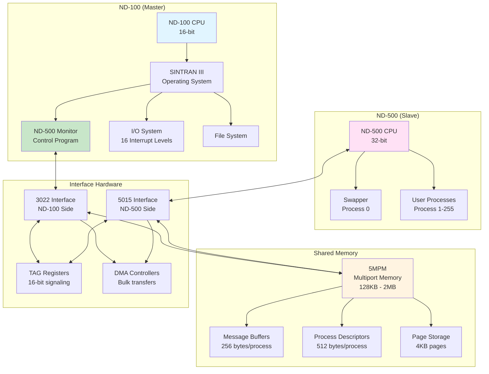
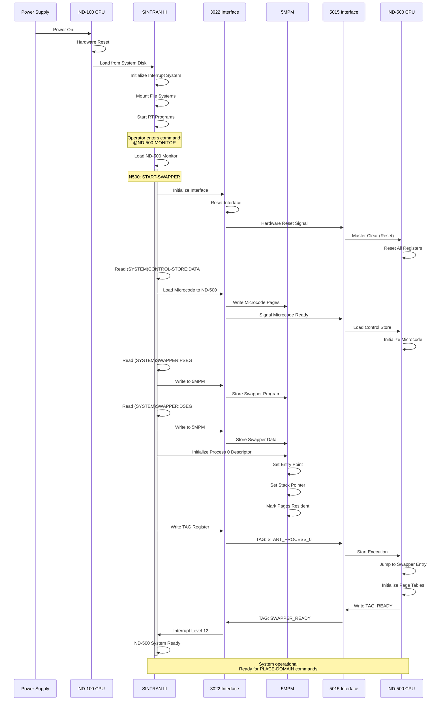
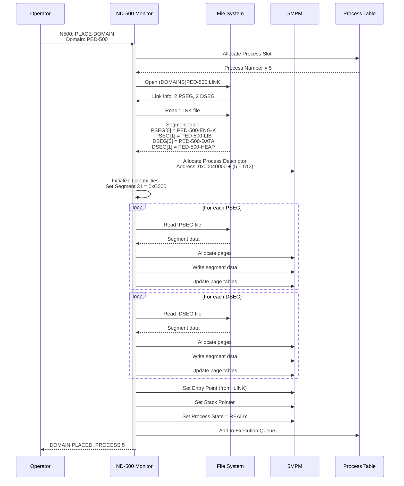
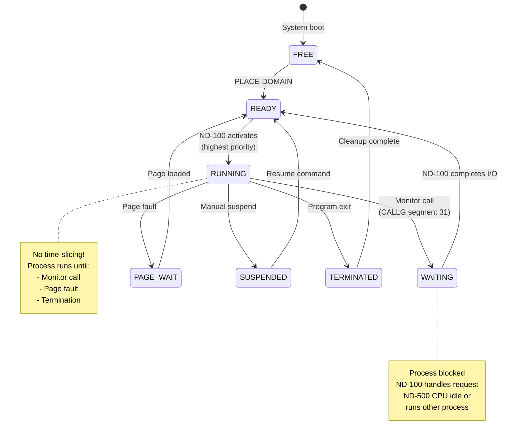
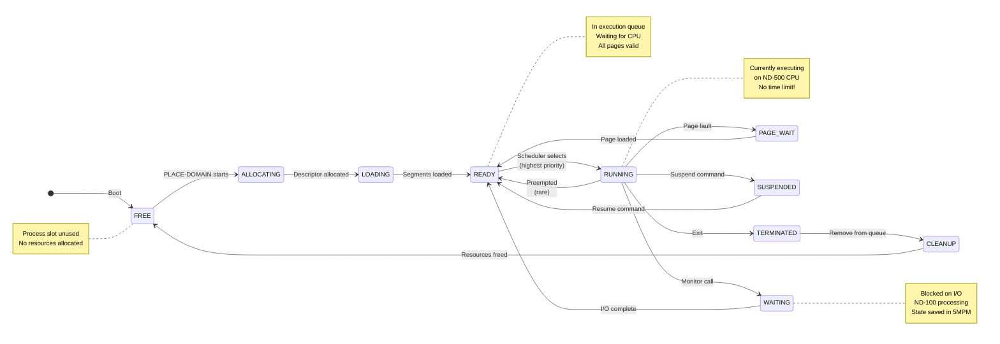

# ND-500 Initialization, Domain Loading, and Scheduling Architecture

## Complete Technical Reference for ND-100/ND-500 Communication and Control

---

## Table of Contents

1. [Architecture Overview](#architecture-overview)
2. [Critical Architectural Principle](#critical-architectural-principle)
3. [ND-500 Initialization Process](#nd-500-initialization-process)
4. [Domain Loading (PLACE-DOMAIN)](#domain-loading-place-domain)
5. [Scheduling Architecture](#scheduling-architecture)
6. [Process State Management](#process-state-management)
7. [Complete Initialization Example](#complete-initialization-example)
8. [Memory Layout and Addressing](#memory-layout-and-addressing)
9. [Performance Characteristics](#performance-characteristics)

---

## Architecture Overview

### The Dual-Processor System

The SINTRAN III system uses a **master-slave architecture** where:

- **ND-100 (Master)**: 16-bit front-end processor
  - Controls all I/O operations
  - Manages file system
  - Handles interrupts (16 hardware levels)
  - Runs the ND-500 Monitor (control software)
  - Schedules ND-500 processes

- **ND-500 (Slave)**: 32-bit computational processor
  - Pure computation engine
  - **NO I/O system**
  - **NO interrupt system**
  - Controlled entirely by ND-100 via shared memory



---

## Critical Architectural Principle

### ND-500 Has NO Interrupts or I/O System

**This is the fundamental principle of ND-500 architecture:**

| Aspect | ND-100 | ND-500 |
|--------|--------|--------|
| **Interrupts** | 16 hardware levels | **NONE** |
| **I/O System** | Direct device access | **NONE** |
| **Scheduling Control** | Self-scheduled + RT programs | **ND-100 controlled** |
| **Timers** | Hardware interval timer | **NONE** |
| **Device Drivers** | Yes (in OS) | **NONE** |
| **Monitor Calls** | Internal PMON instruction | **Trap to ND-100 via Segment 31** |

**Implications:**

1. **All I/O operations** must go through ND-100 via monitor calls
2. **All scheduling decisions** are made by ND-100
3. **No time-slicing** on ND-500 (processes run until blocked)
4. **ND-100 polls** TAG registers to detect ND-500 requests
5. **Process switching** only occurs when:
   - Process makes monitor call (blocks)
   - Process terminates
   - ND-100 explicitly suspends process
   - Page fault occurs (handled by swapper)

**Why this design?**

- ND-500 optimized for **pure computation** with minimal overhead
- Interrupt handling adds 5-10% overhead on ND-100
- ND-500 achieves **near-zero overhead** for computation
- Simplified hardware (no interrupt controller needed)
- All complexity isolated in ND-100 software

---

## ND-500 Initialization Process

### Boot Sequence Overview



### Detailed Step-by-Step Process

#### Phase 1: Hardware Initialization

**Step 1: Power-On Reset**
- ND-100 performs standard power-on self-test (POST)
- Memory test, CPU registers initialized
- Boot loader reads system disk

**Step 2: SINTRAN III Load**
```
Loading SINTRAN III from (SYSTEM)SINTRAN:PROGRAM
Interrupt system initialized
File system mounted
RT programs started on levels 1-15
```

**Step 3: Operator Invokes ND-500 Monitor**
```
@ND-500-MONITOR
ND-500 MONITOR ACTIVE
ENTER COMMAND:
```

#### Phase 2: Interface and Hardware Initialization

**Step 4: Initialize 3022/5015 Interface**

The ND-100 initializes the 3022 interface card:

```c
// ND-100 initialization code (pseudocode)
void Initialize3022Interface(void)
{
    // Base I/O address for 3022 interface
    #define IO_3022_BASE 0x0050

    // Reset interface hardware
    IOX(IO_3022_BASE + 0, 0x8000);  // Offset 0: Control register, bit 15 = Reset

    // Wait for reset complete (10ms)
    Delay(10);

    // Configure 5MPM base address (ND-100 sees it at 0x00040000)
    IOX(IO_3022_BASE + 1, 0x0400);  // Offset 1: MPM base address (high byte)
    IOX(IO_3022_BASE + 2, 0x0000);  // Offset 2: MPM base address (low byte)

    // Configure MPM size (example: 512KB)
    IOX(IO_3022_BASE + 3, 0x0080);  // Offset 3: Size in KB / 4

    // Enable DMA controller
    IOX(IO_3022_BASE + 4, 0x0001);  // Offset 4: DMA control, bit 0 = Enable

    // Configure interrupt vector for TAG events
    IOX(IO_3022_BASE + 5, 0x000C);  // Offset 5: Interrupt to level 12

    // Enable TAG interrupt system
    IOX(IO_3022_BASE + 0, 0x0001);  // Offset 0: Control register, bit 0 = INT enable

    printf("3022 Interface initialized\n");
}
```

**Step 5: Reset ND-500 Hardware**

```c
void ResetND500Hardware(void)
{
    // Send Master Clear to ND-500 via 3022
    IOX(IO_3022_BASE + 6, 0x0001);  // Offset 6: ND-500 control, bit 0 = RESET

    // Wait for ND-500 to complete reset
    Delay(100);  // 100ms

    // Clear reset signal
    IOX(IO_3022_BASE + 6, 0x0000);

    printf("ND-500 hardware reset complete\n");
}
```

#### Phase 3: Microcode Loading

**Step 6: Load ND-500 Control Store**

The ND-500 has writable microcode (control store) that must be loaded at boot:

```c
void LoadND500Microcode(void)
{
    // Open microcode file
    int fd = open("(SYSTEM)CONTROL-STORE:DATA", O_RDONLY);
    if (fd < 0) {
        printf("ERROR: Cannot open microcode file\n");
        return;
    }

    // Get file size
    struct stat st;
    fstat(fd, &st);
    uint32_t microcode_size = st.st_size;

    printf("Loading %d bytes of microcode...\n", microcode_size);

    // Microcode is written to special memory area in 5MPM
    // ND-500 address: 0x80000000 (start of MPM)
    // ND-100 address: 0x00040000 (mapped address)
    uint32_t mpm_address = 0x00040000;

    // Read and write in 4KB chunks
    uint8_t buffer[4096];
    uint32_t bytes_written = 0;

    while (bytes_written < microcode_size) {
        int bytes_read = read(fd, buffer, 4096);
        if (bytes_read <= 0) break;

        // Write to 5MPM using DMA
        DMA_Write(mpm_address + bytes_written, buffer, bytes_read);
        bytes_written += bytes_read;

        printf("  %d / %d bytes\r", bytes_written, microcode_size);
    }

    close(fd);
    printf("\nMicrocode loaded successfully\n");

    // Signal ND-500 to load control store from MPM
    IOX(IO_3022_BASE + 6, 0x0002);  // Bit 1 = LOAD_CONTROL_STORE

    // Wait for ND-500 to load microcode into control store
    // This takes ~1 second for full microcode
    Delay(1000);

    // Check status
    uint16_t status = IOX_READ(IO_3022_BASE + 7);  // Offset 7: Status
    if (status & 0x0001) {
        printf("Microcode loaded into ND-500 control store\n");
    } else {
        printf("ERROR: Microcode load failed\n");
    }
}
```

**What is Control Store?**

The ND-500 uses **writable microcode** (unlike most CPUs with fixed microcode in ROM):
- Control store = 4K × 96-bit microcode words
- Defines instruction execution at microcode level
- Allows custom instruction sets
- Loaded from disk at each boot
- Stored in high-speed writable memory inside CPU

#### Phase 4: Swapper Loading (Process 0)

**Step 7: START-SWAPPER Command**

```
N500: START-SWAPPER
```

This command performs the most critical initialization:

```c
void StartSwapper(void)
{
    printf("Starting ND-500 swapper (Process 0)...\n");

    // Step 1: Load swapper program segment
    LoadSwapperProgramSegment();

    // Step 2: Load swapper data segment
    LoadSwapperDataSegment();

    // Step 3: Initialize Process 0 descriptor
    InitializeProcess0Descriptor();

    // Step 4: Start ND-500 execution
    StartND500Execution();

    // Step 5: Wait for swapper ready signal
    WaitForSwapperReady();

    printf("ND-500 swapper operational\n");
}
```

**Step 7a: Load Swapper Program Segment**

```c
void LoadSwapperProgramSegment(void)
{
    // Read swapper program from disk
    int fd = open("(SYSTEM)SWAPPER:PSEG", O_RDONLY);

    struct stat st;
    fstat(fd, &st);
    uint32_t segment_size = st.st_size;
    uint32_t num_pages = (segment_size + 4095) / 4096;

    printf("  Swapper program: %d bytes (%d pages)\n", segment_size, num_pages);

    // Allocate physical pages in 5MPM for swapper
    // These pages are RESIDENT (never swapped out)
    uint32_t base_page = AllocateResidentPages(num_pages);

    // Physical address in 5MPM
    uint32_t phys_address = base_page * 4096;

    // ND-100 address (add MPM base)
    uint32_t nd100_address = 0x00040000 + phys_address;

    printf("  Loading at physical address 0x%08X\n", phys_address);

    // Read and write pages
    uint8_t page_buffer[4096];
    for (uint32_t page = 0; page < num_pages; page++) {
        int bytes_read = read(fd, page_buffer, 4096);

        // Write page to 5MPM
        DMA_Write(nd100_address + (page * 4096), page_buffer, 4096);

        // Mark page as RESIDENT in page allocation table
        MarkPageResident(base_page + page);
    }

    close(fd);

    // Store segment information for process descriptor
    swapper_pseg_base = phys_address;
    swapper_pseg_pages = num_pages;
}
```

**Step 7b: Load Swapper Data Segment**

```c
void LoadSwapperDataSegment(void)
{
    // Similar process for data segment
    int fd = open("(SYSTEM)SWAPPER:DSEG", O_RDONLY);

    struct stat st;
    fstat(fd, &st);
    uint32_t segment_size = st.st_size;
    uint32_t num_pages = (segment_size + 4095) / 4096;

    printf("  Swapper data: %d bytes (%d pages)\n", segment_size, num_pages);

    // Allocate resident pages
    uint32_t base_page = AllocateResidentPages(num_pages);
    uint32_t phys_address = base_page * 4096;
    uint32_t nd100_address = 0x00040000 + phys_address;

    printf("  Loading at physical address 0x%08X\n", phys_address);

    // Load pages
    uint8_t page_buffer[4096];
    for (uint32_t page = 0; page < num_pages; page++) {
        int bytes_read = read(fd, page_buffer, 4096);
        DMA_Write(nd100_address + (page * 4096), page_buffer, 4096);
        MarkPageResident(base_page + page);
    }

    close(fd);

    swapper_dseg_base = phys_address;
    swapper_dseg_pages = num_pages;
}
```

**Step 7c: Initialize Process 0 Descriptor**

```c
void InitializeProcess0Descriptor(void)
{
    // Process descriptors start at offset 0x80000000 in 5MPM (ND-500 view)
    // ND-100 sees this as 0x00040000
    uint32_t descriptor_base = 0x00040000;
    uint32_t process_0_descriptor = descriptor_base + (0 * 512);  // Process 0

    printf("  Initializing Process 0 descriptor at 0x%08X\n", process_0_descriptor);

    // Clear entire descriptor (512 bytes)
    uint8_t zero[512] = {0};
    DMA_Write(process_0_descriptor, zero, 512);

    // Set up segment capabilities
    // Process 0 needs access to all memory for page management

    // Program capabilities: Segment 0 = swapper code
    uint16_t prog_cap_0 = 0x8000;  // Bit 15 (I) = 1: Indirect translation
    WriteWord(process_0_descriptor + 0x00, prog_cap_0);

    // Program segment 31: Special "Other CPU" trap segment
    uint16_t prog_cap_31 = 0xC000;  // Bits 15,14 = 1: Indirect + Other CPU
    WriteWord(process_0_descriptor + (31 * 2), prog_cap_31);

    // Data capabilities: Segment 0 = swapper data
    uint16_t data_cap_0 = 0x8000;  // Indirect translation
    WriteWord(process_0_descriptor + 0x40 + 0x00, data_cap_0);

    // Set segment base addresses
    // These point to page table entries, not physical addresses
    uint32_t prog_page_table = swapper_pseg_base / 4096;  // Page number
    WriteDoubleWord(process_0_descriptor + 0x80 + (0 * 4), prog_page_table);

    uint32_t data_page_table = swapper_dseg_base / 4096;
    WriteDoubleWord(process_0_descriptor + 0x80 + (32 * 4), data_page_table);

    // Set process control information (offset 0x100 in descriptor)
    WriteByte(process_0_descriptor + 0x100, 0);  // Process number = 0
    WriteByte(process_0_descriptor + 0x101, 1);  // State = READY
    WriteWord(process_0_descriptor + 0x102, 255);  // Priority = highest

    // Set entry point (from :PSEG file header)
    WriteDoubleWord(process_0_descriptor + 0x104, 0x00000000);  // Entry point

    // Set stack pointer (top of data segment)
    uint32_t stack_pointer = 0x01000000 + (swapper_dseg_pages * 4096) - 4;
    WriteDoubleWord(process_0_descriptor + 0x108, stack_pointer);

    // Set heap pointer (start of data segment)
    WriteDoubleWord(process_0_descriptor + 0x10C, 0x01000000);

    // Initialize page tables for swapper
    InitializeSwapperPageTables(process_0_descriptor);

    printf("  Process 0 descriptor initialized\n");
}
```

**Step 7d: Initialize Page Tables**

```c
void InitializeSwapperPageTables(uint32_t descriptor_addr)
{
    // Page tables start at offset 0x140 in descriptor
    uint32_t page_table = descriptor_addr + 0x140;

    // Program segment 0: Map swapper code pages
    for (uint32_t page = 0; page < swapper_pseg_pages; page++) {
        uint32_t phys_page = (swapper_pseg_base / 4096) + page;

        // Page table entry format (32 bits):
        // Bits 31-12: Physical page number
        // Bit 11: Resident (1 = in memory)
        // Bit 10: Modified (1 = written to)
        // Bit 9: Referenced (1 = accessed)
        // Bits 8-0: Protection flags

        uint32_t pte = (phys_page << 12) | 0x0800 | 0x0001;  // Resident + Read-only
        WriteDoubleWord(page_table + (page * 4), pte);
    }

    // Data segment 0: Map swapper data pages
    for (uint32_t page = 0; page < swapper_dseg_pages; page++) {
        uint32_t phys_page = (swapper_dseg_base / 4096) + page;
        uint32_t pte = (phys_page << 12) | 0x0800 | 0x0003;  // Resident + Read/Write
        WriteDoubleWord(page_table + (32 + page) * 4, pte);
    }

    printf("  Page tables initialized (%d program + %d data pages)\n",
           swapper_pseg_pages, swapper_dseg_pages);
}
```

**Step 7e: Start ND-500 Execution**

```c
void StartND500Execution(void)
{
    printf("  Starting ND-500 CPU...\n");

    // Write TAG register to signal process start
    // TAG format: High byte = TAG code, Low byte = process number
    uint16_t tag_value = (0x01 << 8) | 0x00;  // TAG 0x01 = START, Process 0

    IOX(IO_3022_BASE + 8, tag_value);  // Offset 8: TAG-OUT register

    // The 3022 asserts a signal to 5015
    // The 5015 interrupts ND-500 microcode
    // ND-500 microcode reads process descriptor and starts execution
}
```

**Step 7f: Wait for Swapper Ready**

```c
void WaitForSwapperReady(void)
{
    printf("  Waiting for swapper initialization...\n");

    // Set up interrupt handler for TAG-IN events
    RegisterInterruptHandler(12, HandleND500Interrupt);

    // Enable interrupt level 12
    EnableInterrupt(12);

    // Wait for TAG signal from ND-500
    swapper_ready = false;
    int timeout = 10000;  // 10 seconds

    while (!swapper_ready && timeout > 0) {
        Delay(1);
        timeout--;
    }

    if (swapper_ready) {
        printf("  Swapper initialization complete!\n");
    } else {
        printf("  ERROR: Swapper did not respond (timeout)\n");
    }
}

void HandleND500Interrupt(void)
{
    // Read TAG-IN register to see what ND-500 wants
    uint16_t tag_in = IOX_READ(IO_3022_BASE + 9);  // Offset 9: TAG-IN

    uint8_t tag_code = (tag_in >> 8) & 0xFF;
    uint8_t process_num = tag_in & 0xFF;

    if (tag_code == 0x02 && process_num == 0) {
        // TAG 0x02 = READY signal from Process 0
        swapper_ready = true;
    }
}
```

#### Phase 5: Swapper Execution on ND-500

**What the Swapper Does on Startup:**

```c
// This code runs ON THE ND-500 CPU in Process 0

void swapper_main(void)
{
    // Swapper entry point

    // Initialize internal data structures
    initialize_page_allocation_bitmap();
    initialize_process_table();
    initialize_swap_file_management();

    // Mark swapper's own pages as allocated and resident
    for (int page = 0; page < SWAPPER_PAGE_COUNT; page++) {
        mark_page_resident(swapper_first_page + page);
    }

    // Initialize free page list
    build_free_page_list();

    // Signal ND-100 that initialization is complete
    // Use TAG register to send READY signal
    send_tag_to_nd100(TAG_SWAPPER_READY, 0);

    // Enter main swapper loop
    swapper_loop();
}

void swapper_loop(void)
{
    // The swapper runs continuously, handling page faults

    while (1) {
        // Check if any process needs pages loaded
        // The ND-100 writes requests to message buffer

        // Read message buffer for process 0 (swapper's own buffer)
        uint32_t msg_addr = 0x80000400;  // Swapper message buffer

        uint16_t flags = read_word(msg_addr + 0x46);

        if (flags & 0x0001) {  // ITMQUEUE flag set?
            // ND-100 has sent a request
            uint16_t request_type = read_word(msg_addr + 0x42);

            switch (request_type) {
                case REQ_LOAD_PAGE:
                    handle_page_load_request();
                    break;

                case REQ_SWAP_OUT:
                    handle_swap_out_request();
                    break;

                case REQ_ALLOCATE_PAGE:
                    handle_allocate_page();
                    break;
            }

            // Clear ITMQUEUE flag
            flags &= ~0x0001;
            write_word(msg_addr + 0x46, flags);

            // Signal completion
            send_tag_to_nd100(TAG_REQUEST_COMPLETE, 0);
        }

        // No busy-wait: swapper blocks when no work
        // ND-100 will wake it up via TAG when needed
    }
}
```

### Initialization Complete

After START-SWAPPER completes:

1. **ND-500 is running** Process 0 (swapper)
2. **5MPM contains**:
   - Swapper program pages (resident)
   - Swapper data pages (resident)
   - Process 0 descriptor (initialized)
   - Free pages available for user processes
3. **ND-100 monitor is ready** to accept PLACE-DOMAIN commands
4. **TAG registers are operational** for inter-CPU communication

---

## Domain Loading (PLACE-DOMAIN)

### What is a Domain?

A **domain** is an ND-500 executable program consisting of:
- Up to 32 **program segments** (:PSEG files) - executable code
- Up to 32 **data segments** (:DSEG files) - data and heap
- **Link information** (:LINK file) - segment dependencies
- **Entry point** - starting address for execution
- **Stack requirements** - initial stack size
- **Heap requirements** - dynamic memory needs

### Domain File Structure

Example domain: `PED-500` (Program Development System for ND-500)

```
Directory: (DOMAINS)

Files:
  PED-500:LINK               (linking information)
  PED-500-ENG-K:PSEG         (program segment 0 - main code)
  PED-500-LIB:PSEG           (program segment 1 - library routines)
  PED-500-DATA:DSEG          (data segment 0 - static data)
  PED-500-HEAP:DSEG          (data segment 1 - heap storage)
```

### PLACE-DOMAIN Command

```
N500: PLACE-DOMAIN
Domain-name: PED-500
Segment-name: (DOMAINS)
```

This command allocates a process descriptor and loads the domain into 5MPM.

### Complete PLACE-DOMAIN Process



### Detailed Implementation

```c
// ND-100 ND-500 Monitor code

typedef struct {
    char segment_name[64];
    uint8_t segment_number;
    uint8_t segment_type;  // 0=PSEG, 1=DSEG
    uint32_t file_size;
    uint32_t entry_offset;  // For PSEG[0]
} LinkSegmentInfo;

typedef struct {
    char domain_name[32];
    uint8_t num_psegs;
    uint8_t num_dsegs;
    uint32_t entry_point;
    uint32_t stack_size;
    uint32_t heap_size;
    LinkSegmentInfo segments[64];
} DomainLinkInfo;

void PlaceDomain(const char* domain_name, const char* directory)
{
    printf("Placing domain: %s\n", domain_name);

    // Step 1: Allocate process descriptor
    uint8_t process_num = AllocateProcessSlot();
    if (process_num == 0xFF) {
        printf("ERROR: No free process slots\n");
        return;
    }

    printf("  Allocated process number: %d\n", process_num);

    // Step 2: Read link information
    DomainLinkInfo link_info;
    if (!ReadLinkFile(domain_name, directory, &link_info)) {
        printf("ERROR: Cannot read link file\n");
        FreeProcessSlot(process_num);
        return;
    }

    printf("  Domain has %d PSEGs, %d DSEGs\n",
           link_info.num_psegs, link_info.num_dsegs);

    // Step 3: Initialize process descriptor
    uint32_t descriptor_addr = 0x00040000 + (process_num * 512);
    InitializeProcessDescriptor(descriptor_addr, process_num, &link_info);

    // Step 4: Load program segments
    for (int i = 0; i < link_info.num_psegs; i++) {
        LoadProgramSegment(descriptor_addr, &link_info.segments[i], i);
    }

    // Step 5: Load data segments
    for (int i = 0; i < link_info.num_dsegs; i++) {
        LoadDataSegment(descriptor_addr, &link_info.segments[link_info.num_psegs + i], i);
    }

    // Step 6: Set process state to READY
    SetProcessState(descriptor_addr, STATE_READY);

    // Step 7: Add to execution queue
    AddToExecutionQueue(process_num, link_info.priority);

    printf("DOMAIN PLACED, PROCESS %d\n", process_num);
}
```

**Step 1: Allocate Process Slot**

```c
uint8_t AllocateProcessSlot(void)
{
    // Process table tracks which slots are in use
    // Process 0 = swapper (always allocated)
    // Processes 1-255 available for user domains

    for (uint8_t proc = 1; proc < 256; proc++) {
        if (process_table[proc].state == STATE_FREE) {
            process_table[proc].state = STATE_ALLOCATING;
            return proc;
        }
    }

    return 0xFF;  // No free slots
}
```

**Step 2: Read Link File**

```c
bool ReadLinkFile(const char* domain_name, const char* directory,
                  DomainLinkInfo* link_info)
{
    // Construct filename: (DOMAINS)PED-500:LINK
    char filename[128];
    snprintf(filename, sizeof(filename), "%s%s:LINK", directory, domain_name);

    int fd = open(filename, O_RDONLY);
    if (fd < 0) {
        printf("ERROR: Cannot open %s\n", filename);
        return false;
    }

    // Read link file format (SINTRAN III specific format)
    // First 32 bytes: Domain name
    read(fd, link_info->domain_name, 32);

    // Next 2 bytes: Number of PSEGs
    read(fd, &link_info->num_psegs, 1);

    // Next 2 bytes: Number of DSEGs
    read(fd, &link_info->num_dsegs, 1);

    // Next 4 bytes: Entry point offset
    read(fd, &link_info->entry_point, 4);
    link_info->entry_point = ntohl(link_info->entry_point);  // Big-endian

    // Next 4 bytes: Stack size (in bytes)
    read(fd, &link_info->stack_size, 4);
    link_info->stack_size = ntohl(link_info->stack_size);

    // Next 4 bytes: Heap size (in bytes)
    read(fd, &link_info->heap_size, 4);
    link_info->heap_size = ntohl(link_info->heap_size);

    // Segment table entries
    for (int i = 0; i < link_info->num_psegs + link_info->num_dsegs; i++) {
        LinkSegmentInfo* seg = &link_info->segments[i];

        // 64 bytes: Segment filename
        read(fd, seg->segment_name, 64);

        // 1 byte: Segment number (0-31)
        read(fd, &seg->segment_number, 1);

        // 1 byte: Type (0=PSEG, 1=DSEG)
        read(fd, &seg->segment_type, 1);

        // 4 bytes: File size
        read(fd, &seg->file_size, 4);
        seg->file_size = ntohl(seg->file_size);

        // 4 bytes: Entry offset (for PSEG[0] only)
        read(fd, &seg->entry_offset, 4);
        seg->entry_offset = ntohl(seg->entry_offset);
    }

    close(fd);
    return true;
}
```

**Step 3: Initialize Process Descriptor**

```c
void InitializeProcessDescriptor(uint32_t descriptor_addr, uint8_t process_num,
                                 DomainLinkInfo* link_info)
{
    // Clear entire 512-byte descriptor
    uint8_t zero[512] = {0};
    DMA_Write(descriptor_addr, zero, 512);

    // Initialize ALL capability registers (32 program + 32 data = 64 total)

    // Program capabilities: Segments 0-31
    for (int seg = 0; seg < 32; seg++) {
        uint16_t capability;

        if (seg == 31) {
            // Segment 31: Special "Other CPU" trap segment
            // Bit 15 (I): Indirect translation = 1
            // Bit 14 (O): Other CPU trap = 1
            // Bits 13-12: Ring level = 00 (user mode)
            // Bits 11-0: Unused for segment 31
            capability = 0xC000;  // Binary: 1100 0000 0000 0000
        } else if (seg < link_info->num_psegs) {
            // Active program segment
            // Bit 15 (I): Indirect translation = 1
            // Bit 14 (O): Other CPU = 0
            // Bits 13-12: Ring level = 00
            // Bit 11 (X): Execute permission = 1
            // Bit 10 (R): Read permission = 1
            // Bit 9 (W): Write permission = 0 (code is read-only)
            capability = 0x8C00;  // Binary: 1000 1100 0000 0000
        } else {
            // Unused segment
            capability = 0x0000;
        }

        // Write capability to descriptor
        WriteWord(descriptor_addr + (seg * 2), capability);
    }

    // Data capabilities: Segments 0-31
    for (int seg = 0; seg < 32; seg++) {
        uint16_t capability;

        if (seg < link_info->num_dsegs) {
            // Active data segment
            // Bit 15 (I): Indirect translation = 1
            // Bit 11 (X): Execute = 0
            // Bit 10 (R): Read = 1
            // Bit 9 (W): Write = 1
            capability = 0x8600;  // Binary: 1000 0110 0000 0000
        } else {
            // Unused segment
            capability = 0x0000;
        }

        WriteWord(descriptor_addr + 0x40 + (seg * 2), capability);
    }

    // Segment base addresses (point to page tables)
    // These are initialized as segments are loaded

    // Process control block at offset 0x100
    WriteByte(descriptor_addr + 0x100, process_num);  // Process number
    WriteByte(descriptor_addr + 0x101, STATE_LOADING);  // Initial state
    WriteWord(descriptor_addr + 0x102, 128);  // Default priority

    // Entry point (will be finalized after segments loaded)
    WriteDoubleWord(descriptor_addr + 0x104, 0x00000000);

    // Stack pointer (top of first data segment)
    uint32_t stack_ptr = 0x01000000 + link_info->stack_size;
    WriteDoubleWord(descriptor_addr + 0x108, stack_ptr);

    // Heap pointer (after stack in data segment)
    uint32_t heap_ptr = stack_ptr;
    WriteDoubleWord(descriptor_addr + 0x10C, heap_ptr);

    // Store domain name for debugging
    for (int i = 0; i < 16 && i < strlen(link_info->domain_name); i++) {
        WriteByte(descriptor_addr + 0x11E + i, link_info->domain_name[i]);
    }

    printf("  Process descriptor initialized at 0x%08X\n", descriptor_addr);
}
```

**Step 4: Load Program Segment**

```c
void LoadProgramSegment(uint32_t descriptor_addr, LinkSegmentInfo* seg_info, int seg_num)
{
    printf("  Loading PSEG[%d]: %s (%d bytes)\n",
           seg_num, seg_info->segment_name, seg_info->file_size);

    // Open segment file
    int fd = open(seg_info->segment_name, O_RDONLY);
    if (fd < 0) {
        printf("ERROR: Cannot open segment file\n");
        return;
    }

    // Calculate number of pages needed
    uint32_t num_pages = (seg_info->file_size + 4095) / 4096;

    printf("    Allocating %d pages\n", num_pages);

    // Allocate physical pages in 5MPM
    uint32_t* page_numbers = AllocatePages(num_pages);
    if (page_numbers == NULL) {
        printf("ERROR: Cannot allocate pages\n");
        close(fd);
        return;
    }

    // Load segment data page by page
    uint8_t page_buffer[4096];
    uint32_t bytes_remaining = seg_info->file_size;

    for (uint32_t page_idx = 0; page_idx < num_pages; page_idx++) {
        // Read page from file
        memset(page_buffer, 0, 4096);  // Clear buffer
        int bytes_to_read = (bytes_remaining > 4096) ? 4096 : bytes_remaining;
        read(fd, page_buffer, bytes_to_read);
        bytes_remaining -= bytes_to_read;

        // Calculate physical address
        uint32_t phys_page = page_numbers[page_idx];
        uint32_t phys_addr = phys_page * 4096;
        uint32_t nd100_addr = 0x00040000 + phys_addr;

        // Write page to 5MPM
        DMA_Write(nd100_addr, page_buffer, 4096);

        // Create page table entry
        // Bits 31-12: Physical page number
        // Bit 11: Resident flag = 1
        // Bit 10: Modified flag = 0
        // Bit 9: Referenced flag = 0
        // Bits 8-0: Protection = 0x05 (Read + Execute, no Write)
        uint32_t pte = (phys_page << 12) | 0x0800 | 0x0005;

        // Write to page table in process descriptor
        uint32_t page_table_offset = 0x140 + (seg_num * 64 * 4) + (page_idx * 4);
        WriteDoubleWord(descriptor_addr + page_table_offset, pte);
    }

    // Update segment base address in descriptor
    // This points to the first page table entry
    uint32_t seg_base = page_numbers[0];  // First page number
    WriteDoubleWord(descriptor_addr + 0x80 + (seg_num * 4), seg_base);

    close(fd);
    free(page_numbers);

    printf("    PSEG[%d] loaded successfully\n", seg_num);
}
```

**Step 5: Load Data Segment**

```c
void LoadDataSegment(uint32_t descriptor_addr, LinkSegmentInfo* seg_info, int seg_num)
{
    printf("  Loading DSEG[%d]: %s (%d bytes)\n",
           seg_num, seg_info->segment_name, seg_info->file_size);

    // Similar to LoadProgramSegment, but:
    // 1. Data segments are writable
    // 2. Modified pages will be swapped to swap file
    // 3. Page protection = Read + Write (0x06)

    int fd = open(seg_info->segment_name, O_RDONLY);
    if (fd < 0) {
        printf("ERROR: Cannot open segment file\n");
        return;
    }

    uint32_t num_pages = (seg_info->file_size + 4095) / 4096;
    uint32_t* page_numbers = AllocatePages(num_pages);

    uint8_t page_buffer[4096];
    uint32_t bytes_remaining = seg_info->file_size;

    for (uint32_t page_idx = 0; page_idx < num_pages; page_idx++) {
        memset(page_buffer, 0, 4096);
        int bytes_to_read = (bytes_remaining > 4096) ? 4096 : bytes_remaining;
        read(fd, page_buffer, bytes_to_read);
        bytes_remaining -= bytes_to_read;

        uint32_t phys_page = page_numbers[page_idx];
        uint32_t phys_addr = phys_page * 4096;
        uint32_t nd100_addr = 0x00040000 + phys_addr;

        DMA_Write(nd100_addr, page_buffer, 4096);

        // Page table entry for DATA segment
        // Protection = 0x06 (Read + Write, no Execute)
        uint32_t pte = (phys_page << 12) | 0x0800 | 0x0006;

        uint32_t page_table_offset = 0x140 + ((32 + seg_num) * 64 * 4) + (page_idx * 4);
        WriteDoubleWord(descriptor_addr + page_table_offset, pte);
    }

    // Update segment base address
    WriteDoubleWord(descriptor_addr + 0x80 + ((32 + seg_num) * 4), page_numbers[0]);

    close(fd);
    free(page_numbers);

    printf("    DSEG[%d] loaded successfully\n", seg_num);
}
```

**Step 6: Finalize Process**

```c
void SetProcessState(uint32_t descriptor_addr, uint8_t new_state)
{
    WriteByte(descriptor_addr + 0x101, new_state);
}

void AddToExecutionQueue(uint8_t process_num, uint16_t priority)
{
    // Add process to priority-ordered execution queue
    ExecutionQueueEntry entry;
    entry.process_number = process_num;
    entry.priority = priority;
    entry.state = STATE_READY;
    entry.cpu_time_used = 0;

    // Insert in priority order (highest priority first)
    InsertIntoQueue(&execution_queue, &entry);

    printf("  Process %d added to execution queue (priority %d)\n",
           process_num, priority);
}
```

### Memory Layout After PLACE-DOMAIN

```
5MPM Memory Layout (ND-500 view = 0x80000000, ND-100 view = 0x00040000):

+----------------------+ 0x80000000 (ND-500) / 0x00040000 (ND-100)
| Process Descriptors  |
| 512 bytes × 256      | Process 0: Swapper
| = 128KB total        | Process 1-255: User domains
|                      |
| Process 5:           |
|   +0x000: Prog caps  | Segment 31 = 0xC000 (O-bit set)
|   +0x040: Data caps  |
|   +0x080: Seg bases  |
|   +0x100: Proc info  | State = READY
|   +0x140: Page table |
+----------------------+ +0x20000 (128KB)
| Message Buffers      |
| 256 bytes × 256      | Process 5 buffer at +0x500
| = 64KB total         | MICFU codes written here
+----------------------+ +0x30000 (192KB)
| Page Storage         |
|                      | Swapper pages (resident)
| 4KB pages            | Process 5 PSEG pages
|                      | Process 5 DSEG pages
|                      | Free pages
|                      |
| (remainder of MPM)   |
+----------------------+ +0xXXXXXX (end of MPM)
```

---

## Scheduling Architecture

### The Key Question: Who Controls ND-500 Scheduling?

**Answer: The ND-100 controls ALL ND-500 scheduling.**

### Why ND-100 Controls Scheduling

1. **ND-500 has no interrupts** - cannot preempt running process
2. **ND-500 has no timer** - cannot measure time slices
3. **ND-500 has no I/O** - cannot detect external events
4. **ND-500 is purely computational** - runs until blocked

Therefore:
- **ND-100 decides** which process runs
- **ND-100 tracks** CPU time used
- **ND-100 handles** all I/O requests
- **ND-500 only switches** when process blocks on monitor call

### Scheduling Model



### Execution Queue

The ND-100 maintains an **execution queue** of READY processes:

```c
typedef struct {
    uint8_t process_number;
    uint16_t priority;          // 0-255 (255 = highest)
    uint8_t state;              // READY, RUNNING, WAITING, etc.
    uint32_t cpu_time_used;     // Microseconds
    uint32_t wait_time;         // Time spent waiting
    uint32_t page_faults;       // Count of page faults
    uint64_t last_activation;   // Timestamp
} ExecutionQueueEntry;

ExecutionQueueEntry execution_queue[256];
int queue_length = 0;
```

### Process Selection Algorithm

```c
uint8_t SelectNextProcess(void)
{
    // Select highest priority READY process

    uint8_t best_process = 0xFF;
    uint16_t best_priority = 0;
    uint64_t oldest_time = UINT64_MAX;

    for (int i = 0; i < queue_length; i++) {
        ExecutionQueueEntry* entry = &execution_queue[i];

        // Skip if not READY
        if (entry->state != STATE_READY) {
            continue;
        }

        // Select by priority
        if (entry->priority > best_priority) {
            best_process = entry->process_number;
            best_priority = entry->priority;
            oldest_time = entry->last_activation;
        }
        // If same priority, use oldest (fairness)
        else if (entry->priority == best_priority) {
            if (entry->last_activation < oldest_time) {
                best_process = entry->process_number;
                oldest_time = entry->last_activation;
            }
        }
    }

    return best_process;
}
```

### Process Activation

When ND-100 decides to activate a process:

```c
void ActivateProcess(uint8_t process_num)
{
    printf("Activating process %d\n", process_num);

    // Update execution queue
    for (int i = 0; i < queue_length; i++) {
        if (execution_queue[i].process_number == process_num) {
            execution_queue[i].state = STATE_RUNNING;
            execution_queue[i].last_activation = GetTimestamp();
            break;
        }
    }

    // Update process descriptor state
    uint32_t descriptor_addr = 0x00040000 + (process_num * 512);
    WriteByte(descriptor_addr + 0x101, STATE_RUNNING);

    // Send TAG to ND-500 to start process
    uint16_t tag_value = (TAG_ACTIVATE_PROCESS << 8) | process_num;
    IOX(IO_3022_BASE + 8, tag_value);

    // ND-500 will:
    // 1. Load process descriptor
    // 2. Restore CPU state
    // 3. Start execution
}
```

### ND-500 Process Activation Handler

```c
// This runs in ND-500 microcode/firmware

void Handle_TAG_Activate_Process(uint8_t process_num)
{
    // Load process descriptor from 5MPM
    uint32_t descriptor_addr = 0x80000000 + (process_num * 512);

    // Load capability registers
    for (int i = 0; i < 32; i++) {
        CPU.ProgramCapabilities[i] = ReadWord(descriptor_addr + (i * 2));
        CPU.DataCapabilities[i] = ReadWord(descriptor_addr + 0x40 + (i * 2));
    }

    // Load segment base addresses
    for (int i = 0; i < 64; i++) {
        CPU.SegmentBases[i] = ReadDoubleWord(descriptor_addr + 0x80 + (i * 4));
    }

    // Check if this is initial activation or resume
    uint32_t msg_addr = 0x80000400 + (process_num * 0x100);
    uint16_t flags = ReadWord(msg_addr + 0x46);

    if (flags & 0x0002) {  // SAVED_STATE flag
        // Resume from saved state
        CPU.PC = ReadDoubleWord(msg_addr + 0x00);
        CPU.STATUS = ReadDoubleWord(msg_addr + 0x04);
        CPU.R0 = ReadDoubleWord(msg_addr + 0x08);
        CPU.R1 = ReadDoubleWord(msg_addr + 0x0C);
        // ... restore all registers ...

        // Clear SAVED_STATE flag
        flags &= ~0x0002;
        WriteWord(msg_addr + 0x46, flags);
    } else {
        // Initial activation - load from descriptor
        CPU.PC = ReadDoubleWord(descriptor_addr + 0x104);  // Entry point
        CPU.R15 = ReadDoubleWord(descriptor_addr + 0x108);  // Stack pointer (SP)
        CPU.STATUS = 0x00000000;  // Default status
        // All other registers = 0
    }

    // Set current process
    CPU.CurrentProcess = process_num;
    CPU.IsWaiting = false;

    // Start execution
    ExecutionLoop();
}
```

### Process Blocking (Monitor Call)

When process makes monitor call:

```c
// ND-500 trap handler
void HandleOtherCPUTrap(ND500CPU* cpu, uint32_t target_address)
{
    uint8_t process_num = cpu->CurrentProcess;
    uint32_t msg_addr = 0x80000400 + (process_num * 0x100);

    // Save complete CPU state
    WriteDoubleWord(msg_addr + 0x00, cpu->PC);
    WriteDoubleWord(msg_addr + 0x04, cpu->STATUS.raw);
    WriteDoubleWord(msg_addr + 0x08, cpu->R0);
    WriteDoubleWord(msg_addr + 0x0C, cpu->R1);
    // ... save all registers (64 bytes total) ...

    // MICFU code was already written by library before CALLG
    uint16_t micfu = ReadWord(msg_addr + 0x42);

    // Set flags
    uint16_t flags = ReadWord(msg_addr + 0x46);
    flags |= 0x0001;  // ITMQUEUE: Request pending
    flags |= 0x0002;  // SAVED_STATE: State saved
    WriteWord(msg_addr + 0x46, flags);

    // Update process state
    uint32_t descriptor_addr = 0x80000000 + (process_num * 512);
    WriteByte(descriptor_addr + 0x101, STATE_WAITING);

    // Signal ND-100
    SendTAG(TAG_MONITOR_CALL, process_num);

    // Block this process
    cpu->IsWaiting = true;
    cpu->CurrentProcess = 0xFF;  // No current process

    // ND-100 will now handle the request
    // ND-500 becomes idle (or ND-100 activates another process)
}
```

### ND-100 Monitor Call Handler

```c
// ND-100 interrupt level 12 handler
void HandleND500MonitorCall(void)
{
    // Read TAG to get process number
    uint16_t tag_in = IOX_READ(IO_3022_BASE + 9);
    uint8_t tag_code = (tag_in >> 8) & 0xFF;
    uint8_t process_num = tag_in & 0xFF;

    if (tag_code != TAG_MONITOR_CALL) return;

    // Read message buffer
    uint32_t msg_addr = 0x00040000 + 0x400 + (process_num * 0x100);
    uint16_t micfu = ReadWord(msg_addr + 0x42);

    // Decode MICFU and execute
    switch (micfu) {
        case 0x0001:  // DVIO - Device I/O
            HandleDVIO(process_num, msg_addr);
            break;

        case 0x0002:  // DVRD - Device Read
            HandleDVRD(process_num, msg_addr);
            break;

        case 0x0003:  // DVWR - Device Write
            HandleDVWR(process_num, msg_addr);
            break;

        case 0x0010:  // WAIT - Wait for time
            HandleWAIT(process_num, msg_addr);
            break;

        // ... hundreds of monitor calls ...
    }

    // Most monitor calls complete asynchronously
    // Process remains in WAITING state until I/O completes
}

void HandleDVIO_Complete(uint8_t process_num, uint16_t result_code)
{
    // I/O operation completed
    uint32_t msg_addr = 0x00040000 + 0x400 + (process_num * 0x100);

    // Write result code
    WriteWord(msg_addr + 0x44, result_code);

    // Clear ITMQUEUE flag
    uint16_t flags = ReadWord(msg_addr + 0x46);
    flags &= ~0x0001;
    WriteWord(msg_addr + 0x46, flags);

    // Update process state to READY
    uint32_t descriptor_addr = 0x00040000 + (process_num * 512);
    WriteByte(descriptor_addr + 0x101, STATE_READY);

    // Add back to execution queue
    AddToExecutionQueue(process_num);

    // Send TAG to ND-500: Resume process
    uint16_t tag_value = (TAG_RESUME_PROCESS << 8) | process_num;
    IOX(IO_3022_BASE + 8, tag_value);

    // ND-500 will activate this process when ready
}
```

### Scheduling Loop in ND-100

```c
// This runs as part of ND-500 Monitor (RT program on ND-100)

void ND500_Scheduler_Loop(void)
{
    while (1) {
        // Check for processes that need attention

        // 1. Check for completed I/O operations
        CheckCompletedIOOperations();

        // 2. Check for page faults that need handling
        CheckPageFaults();

        // 3. Select next process to run
        uint8_t next_process = SelectNextProcess();

        if (next_process != 0xFF && next_process != current_nd500_process) {
            // Context switch needed
            if (current_nd500_process != 0xFF) {
                // Current process is being preempted (rare)
                SuspendProcess(current_nd500_process);
            }

            // Activate new process
            ActivateProcess(next_process);
            current_nd500_process = next_process;
        }

        // Sleep briefly (this RT program runs on ND-100 interrupt level)
        WAIT(10);  // 10ms
    }
}
```

### No Time-Slicing Example

**Traditional OS (with interrupts):**
```
Process A runs for 20ms → TIMER INTERRUPT → Scheduler → Process B runs
```

**ND-500 (no interrupts):**
```
Process A runs → Makes I/O call → Blocks → Scheduler → Process B runs
```

If Process A never makes monitor calls, it runs **forever** (until termination).

**Mitigation:**
- Well-behaved programs call WAIT periodically
- WAIT(0) = yield to scheduler
- Allows fairness without hardware timer

Example:
```c
// ND-500 program
void compute_intensive_loop(void)
{
    for (int i = 0; i < 1000000; i++) {
        do_computation();

        if (i % 1000 == 0) {
            // Yield every 1000 iterations
            WAIT(0);  // Give other processes a chance
        }
    }
}
```

---

## Process State Management

### Complete State Diagram



### Process State Values

```c
// State field at offset 0x101 in process descriptor

#define STATE_FREE       0   // Slot not in use
#define STATE_ALLOCATING 1   // Being created
#define STATE_LOADING    2   // Loading segments
#define STATE_READY      3   // Ready to run
#define STATE_RUNNING    4   // Currently executing
#define STATE_WAITING    5   // Blocked on monitor call
#define STATE_PAGE_WAIT  6   // Waiting for page load
#define STATE_SUSPENDED  7   // Manually suspended
#define STATE_TERMINATED 8   // Exited, cleanup needed
#define STATE_CLEANUP    9   // Being removed
```

### State Transitions - Detailed

#### 1. FREE → ALLOCATING

**Trigger:** PLACE-DOMAIN command issued

```c
process_table[N].state = STATE_ALLOCATING;
```

**Actions:**
- Find free process slot
- Mark slot as ALLOCATING
- Begin reading link file

#### 2. ALLOCATING → LOADING

**Trigger:** Process descriptor allocated in 5MPM

```c
process_table[N].state = STATE_LOADING;
```

**Actions:**
- Descriptor initialized
- Capability registers configured
- Begin loading segments

#### 3. LOADING → READY

**Trigger:** All segments loaded

```c
process_table[N].state = STATE_READY;
execution_queue[M].state = STATE_READY;
```

**Actions:**
- All :PSEG and :DSEG files read
- Pages allocated and written to 5MPM
- Page tables populated
- Entry point set
- Process added to execution queue

#### 4. READY → RUNNING

**Trigger:** Scheduler selects this process

```c
execution_queue[M].state = STATE_RUNNING;
current_nd500_process = N;
```

**Actions:**
- ND-100 sends TAG_ACTIVATE_PROCESS
- ND-500 loads process descriptor
- ND-500 restores CPU state (or initializes if first run)
- ND-500 begins execution at entry point (or PC if resuming)

#### 5. RUNNING → WAITING

**Trigger:** Process executes CALLG into segment 31

```c
process_table[N].state = STATE_WAITING;
execution_queue[M].state = STATE_WAITING;
current_nd500_process = 0xFF;  // No process running
```

**Actions:**
- ND-500 saves complete CPU state to message buffer
- ND-500 sets ITMQUEUE flag
- ND-500 sends TAG_MONITOR_CALL to ND-100
- ND-500 blocks (IsWaiting = true)
- ND-100 receives interrupt level 12
- ND-100 reads MICFU code
- ND-100 begins processing request

#### 6. WAITING → READY

**Trigger:** ND-100 completes I/O operation

```c
process_table[N].state = STATE_READY;
execution_queue[M].state = STATE_READY;
```

**Actions:**
- ND-100 writes result code to message buffer
- ND-100 clears ITMQUEUE flag
- ND-100 sets state to READY
- ND-100 adds process back to execution queue
- Scheduler will select it again later

#### 7. RUNNING → PAGE_WAIT

**Trigger:** ND-500 accesses page not in memory

```c
process_table[N].state = STATE_PAGE_WAIT;
execution_queue[M].state = STATE_PAGE_WAIT;
```

**Actions:**
- ND-500 page fault detected
- ND-500 sends TAG_PAGE_FAULT to ND-100
- ND-500 blocks
- ND-100 requests swapper (Process 0) to load page
- Swapper reads page from swap file
- Swapper writes page to 5MPM
- Swapper updates page table
- Swapper signals completion

#### 8. PAGE_WAIT → READY

**Trigger:** Page loaded into memory

```c
process_table[N].state = STATE_READY;
execution_queue[M].state = STATE_READY;
```

**Actions:**
- Page now resident
- Page table entry updated (Resident bit = 1)
- Process becomes READY
- Will resume execution when scheduled

#### 9. RUNNING → SUSPENDED

**Trigger:** Operator issues SUSPEND-PROCESS command

```c
process_table[N].state = STATE_SUSPENDED;
execution_queue[M].state = STATE_SUSPENDED;
```

**Actions:**
- ND-100 sends TAG_SUSPEND to ND-500
- ND-500 saves CPU state
- ND-500 stops execution
- Process removed from active execution queue
- Process will not be scheduled until resumed

#### 10. SUSPENDED → READY

**Trigger:** Operator issues RESUME-PROCESS command

```c
process_table[N].state = STATE_READY;
execution_queue[M].state = STATE_READY;
```

**Actions:**
- Process added back to execution queue
- Scheduler can now select it
- Will resume from saved PC when scheduled

#### 11. RUNNING → TERMINATED

**Trigger:** Process calls EXIT monitor call

```c
process_table[N].state = STATE_TERMINATED;
execution_queue[M].state = STATE_TERMINATED;
```

**Actions:**
- Process voluntarily exits
- ND-100 receives EXIT monitor call
- ND-100 marks process TERMINATED
- Cleanup will be performed

#### 12. TERMINATED → CLEANUP

**Trigger:** ND-100 begins cleanup operations

```c
process_table[N].state = STATE_CLEANUP;
```

**Actions:**
- Close all open files
- Free all allocated pages
- Remove page table entries
- Remove from execution queue

#### 13. CLEANUP → FREE

**Trigger:** All resources freed

```c
process_table[N].state = STATE_FREE;
```

**Actions:**
- Process descriptor cleared
- Process slot available for reuse
- PLACE-DOMAIN can use this slot again

---

## Complete Initialization Example

### Scenario: Loading PED-500 Editor

Let's walk through a complete example of initializing the system and loading the PED-500 program.

### Timeline

```mermaid
gantt
    title ND-500 System Initialization and Program Loading
    dateFormat ss
    axisFormat %S

    section Hardware
    Power On            :milestone, 00, 0s
    ND-100 POST         :active, 00, 02
    ND-500 Reset        :active, 05, 01
    Interface Init      :active, 06, 01
    Microcode Load      :active, 07, 03

    section Software
    SINTRAN Boot        :active, 02, 03
    ND-500 Monitor      :active, 05, 50

    section Swapper
    Load PSEG           :active, 10, 02
    Load DSEG           :active, 12, 02
    Init Descriptor     :active, 14, 01
    Start Swapper       :active, 15, 02
    Swapper Ready       :milestone, 17, 0s

    section PED-500
    PLACE-DOMAIN Cmd    :milestone, 20, 0s
    Read Link File      :active, 20, 01
    Alloc Descriptor    :active, 21, 01
    Load Segments       :active, 22, 05
    Process Ready       :milestone, 27, 0s
    First Activation    :milestone, 30, 0s
    Running             :active, 30, 10
    Monitor Call        :milestone, 40, 0s
    I/O Processing      :active, 40, 05
    Resume              :milestone, 45, 0s
```



### Step-by-Step Walkthrough

#### T+0s: Power On

```
NORSK DATA ND-100/500
CPU: ND-100 16-bit
FPU: ND-500 32-bit
Memory: 2MB core, 512KB MPM

Executing POST...
```

#### T+2s: SINTRAN III Boot

```
Loading SINTRAN III Release 6
File system: 3 volumes mounted
RT programs: 12 loaded
Interrupt system: Operational
Terminal: Connected

SINTRAN III READY
```

#### T+5s: Operator Starts ND-500 Monitor

```
@ND-500-MONITOR
ND-500 MONITOR VERSION 6.2
INITIALIZING INTERFACE...
3022 INTERFACE: OK
5015 INTERFACE: OK
5MPM: 512KB DETECTED
ND-500 MONITOR ACTIVE
ENTER COMMAND:
```

#### T+7s: Loading Microcode

```
N500: LOAD-CONTROL-STORE
Reading (SYSTEM)CONTROL-STORE:DATA
File size: 49152 bytes
Loading... ████████████████████ 100%
Microcode loaded to ND-500 control store
READY
```

#### T+10s: Starting Swapper

```
N500: START-SWAPPER
Loading swapper (Process 0)...
  Reading (SYSTEM)SWAPPER:PSEG
    Size: 16384 bytes (4 pages)
    Physical address: 0x00030000
  Reading (SYSTEM)SWAPPER:DSEG
    Size: 8192 bytes (2 pages)
    Physical address: 0x00036000
  Initializing Process 0 descriptor at 0x00040000
  Page tables: 4 program + 2 data pages
  Entry point: 0x00000000
  Starting ND-500 CPU...
  Waiting for swapper initialization...

[ND-500 CPU starts executing]
  Swapper: Initializing page allocation bitmap
  Swapper: 120 free pages available
  Swapper: Process table initialized
  Swapper: Sending READY signal

SWAPPER OPERATIONAL
ND-500 SYSTEM READY
```

#### T+20s: Loading PED-500

Operator enters:

```
N500: PLACE-DOMAIN
Domain-name: PED-500
Segment-name: (DOMAINS)
```

Monitor executes:

```
Placing domain: PED-500
  Reading (DOMAINS)PED-500:LINK
  Domain has 2 PSEGs, 2 DSEGs
  Allocated process number: 1

  Initializing Process 1 descriptor at 0x00040200
    Program capabilities: Segment 31 = 0xC000 (O-bit)
    Data capabilities: Writable

  Loading PSEG[0]: (DOMAINS)PED-500-ENG-K:PSEG (32768 bytes)
    Allocating 8 pages
    Loading pages to 5MPM...
    Page table entries created
    PSEG[0] loaded successfully

  Loading PSEG[1]: (DOMAINS)PED-500-LIB:PSEG (16384 bytes)
    Allocating 4 pages
    Loading pages to 5MPM...
    PSEG[1] loaded successfully

  Loading DSEG[0]: (DOMAINS)PED-500-DATA:DSEG (8192 bytes)
    Allocating 2 pages
    Loading pages to 5MPM...
    DSEG[0] loaded successfully

  Loading DSEG[1]: (DOMAINS)PED-500-HEAP:DSEG (20480 bytes)
    Allocating 5 pages
    Loading pages to 5MPM...
    DSEG[1] loaded successfully

  Entry point: 0x00000100
  Stack pointer: 0x01002000
  Process state: READY
  Process 1 added to execution queue (priority 128)

DOMAIN PLACED, PROCESS 1
```

#### T+30s: First Activation

```
N500: LIST-EXECUTION-QUEUE
Process  State    Priority  CPU Time  Domain
-------  -------  --------  --------  ----------
   0     RUNNING      255      20.5s  SWAPPER
   1     READY        128       0.0s  PED-500

N500: ACTIVATE-PROCESS 1
```

Monitor activates Process 1:

```
Activating process 1
  Sending TAG_ACTIVATE_PROCESS to ND-500
```

ND-500 responds:

```c
// ND-500 microcode
Handle_TAG_Activate_Process(1)
{
    Load_Process_Descriptor(1);
    // First activation - no saved state
    CPU.PC = 0x00000100;  // Entry point
    CPU.R15 = 0x01002000;  // Stack pointer
    CPU.CurrentProcess = 1;
    ExecutionLoop();
}

// Execution begins at entry point
```

PED-500 program starts:

```assembly
; ND-500 assembly (first instruction)
00000100: CALLG R0, entry_main

entry_main:
    ; Initialize program
    CALLG R0, init_terminal    ; Monitor call
    ...
```

#### T+40s: First Monitor Call

PED-500 calls `init_terminal`:

```c
// PED-500 library function
void init_terminal(void)
{
    // Write MICFU code to message buffer
    uint32_t msg_addr = 0x80000500;  // Process 1 message buffer
    WriteWord(msg_addr + 0x42, 0x0050);  // MICFU: INIT_TERMINAL
    WriteWord(msg_addr + 0x48, 1);       // Param: Terminal number = 1

    // Call segment 31 (triggers trap)
    CALLG(0x1F000000);  // Segment 31, offset 0

    // Execution blocks here
    // Will resume when ND-100 completes operation
}
```

ND-500 trap handler:

```c
HandleOtherCPUTrap()
{
    // Save CPU state to message buffer
    SaveAllRegisters();

    // Set ITMQUEUE flag
    flags |= 0x0001;

    // Send TAG to ND-100
    SendTAG(TAG_MONITOR_CALL, 1);

    // Block process
    CPU.IsWaiting = true;
}
```

ND-100 interrupt handler:

```c
// Interrupt level 12 fires
HandleND500Interrupt()
{
    TAG_IN = 0x03 01  // Monitor call from process 1

    uint32_t msg_addr = 0x00040500;
    uint16_t micfu = ReadWord(msg_addr + 0x42);  // 0x0050

    switch (micfu) {
        case 0x0050:  // INIT_TERMINAL
            uint16_t term_num = ReadWord(msg_addr + 0x48);

            // Initialize terminal device
            InitializeTerminal(term_num);

            // Write result
            WriteWord(msg_addr + 0x44, 0x0000);  // Success

            // Clear ITMQUEUE
            flags &= ~0x0001;

            // Set state to READY
            SetProcessState(1, STATE_READY);

            // Send resume TAG
            SendTAG(TAG_RESUME_PROCESS, 1);
            break;
    }
}
```

#### T+45s: Process Resumes

ND-500 receives TAG_RESUME_PROCESS:

```c
Handle_TAG_Resume_Process(1)
{
    Load_Process_Descriptor(1);

    // Restore CPU state from message buffer
    uint32_t msg_addr = 0x80000500;
    CPU.PC = ReadDoubleWord(msg_addr + 0x00);
    CPU.R0 = ReadDoubleWord(msg_addr + 0x08);
    // ... restore all registers ...

    CPU.CurrentProcess = 1;
    CPU.IsWaiting = false;

    // Continue execution (returns from CALLG)
    ExecutionLoop();
}
```

PED-500 continues:

```c
// Execution resumes here (after CALLG returns)
void init_terminal(void)
{
    CALLG(0x1F000000);

    // <-- Execution resumes here

    // Check result code
    uint32_t msg_addr = 0x80000500;
    uint16_t result = ReadWord(msg_addr + 0x44);

    if (result == 0) {
        return SUCCESS;
    } else {
        return ERROR;
    }
}
```

### Memory State After Initialization

```
5MPM Layout (512KB total):

Address Range          Contents
-----------------      ----------------------
0x00000 - 0x1FFFF      Process Descriptors (128KB)
  0x00000              Process 0: Swapper
  0x00200              Process 1: PED-500
  0x00400 - 0x1FFFF    Process 2-255 (unused)

0x20000 - 0x2FFFF      Message Buffers (64KB)
  0x20000              Process 0 message buffer
  0x20100              Process 1 message buffer
  0x20200 - 0x2FFFF    Process 2-255 buffers

0x30000 - 0x35FFF      Swapper Pages (24KB)
  0x30000              Swapper PSEG (4 pages, 16KB)
  0x34000              Swapper DSEG (2 pages, 8KB)

0x36000 - 0x43FFF      PED-500 Pages (56KB)
  0x36000              PSEG[0] (8 pages, 32KB)
  0x3E000              PSEG[1] (4 pages, 16KB)
  0x42000              DSEG[0] (2 pages, 8KB)

0x44000 - 0x48FFF      PED-500 Heap DSEG[1] (20KB)

0x49000 - 0x7FFFF      Free Pages (220KB available)
```

---

## Memory Layout and Addressing

### Address Translation: ND-100 vs ND-500 View

The same physical 5MPM memory appears at different addresses:

```
Physical Memory (5MPM):
+------------------+
| 512KB Multiport  |
| Memory           |
+------------------+

ND-100 View:              ND-500 View:
0x00040000                0x80000000
    ↓                         ↓
+------------------+      +------------------+
| Process Desc.    |      | Process Desc.    |
| 0x00040000       |      | 0x80000000       |
+------------------+      +------------------+
| Message Bufs     |      | Message Bufs     |
| 0x00060000       |      | 0x80020000       |
+------------------+      +------------------+
| Pages            |      | Pages            |
| 0x00070000       |      | 0x80030000       |
| ...              |      | ...              |
+------------------+      +------------------+
    ↓                         ↓
0x000BFFFF                0x8007FFFF
```

**Address Translation:**

```c
// ND-100 to Physical
uint32_t nd100_to_phys(uint32_t nd100_addr) {
    return nd100_addr - 0x00040000;
}

// Physical to ND-500
uint32_t phys_to_nd500(uint32_t phys_addr) {
    return phys_addr + 0x80000000;
}

// ND-100 to ND-500 (direct)
uint32_t nd100_to_nd500(uint32_t nd100_addr) {
    return nd100_addr - 0x00040000 + 0x80000000;
}

// Example:
// ND-100 address 0x00050000 =
// Physical address 0x00010000 =
// ND-500 address 0x80010000
```

### Virtual to Physical Translation (ND-500)

ND-500 uses **segmented virtual memory**:

```
Virtual Address (32-bit):
+-------+-------+-----------+
| Seg   | Seg   | Offset    |
| Type  | Num   | (24 bits) |
| (1)   | (5)   |           |
+-------+-------+-----------+
  31     30-26    25-0

Segment Type:
  0 = Program segment
  1 = Data segment

Segment Number: 0-31

Offset: 0 to 16MB per segment
```

**Translation Process:**

```c
uint32_t TranslateVirtualAddress(uint32_t virtual_addr, ND500CPU* cpu)
{
    // Extract fields
    uint8_t seg_type = (virtual_addr >> 31) & 0x01;
    uint8_t seg_num = (virtual_addr >> 26) & 0x1F;
    uint32_t offset = virtual_addr & 0x03FFFFFF;

    // Get capability register
    uint16_t capability;
    if (seg_type == 0) {
        capability = cpu->ProgramCapabilities[seg_num];
    } else {
        capability = cpu->DataCapabilities[seg_num];
    }

    // Check if segment is accessible
    if (capability == 0x0000) {
        RaiseException(EXCEPTION_INVALID_SEGMENT);
        return 0xFFFFFFFF;
    }

    // Check permissions
    bool can_read = (capability & 0x0400) != 0;
    bool can_write = (capability & 0x0200) != 0;
    bool can_execute = (capability & 0x0800) != 0;

    // Check indirect translation bit
    if (!(capability & 0x8000)) {
        // Direct translation (not used in SINTRAN III)
        return offset;  // Simplified
    }

    // Indirect translation via page tables

    // Get page number and page offset
    uint32_t page_num = offset / 4096;
    uint32_t page_offset = offset % 4096;

    // Get segment base (points to page table)
    uint32_t segment_index = (seg_type == 0) ? seg_num : (32 + seg_num);
    uint32_t page_table_base = cpu->SegmentBases[segment_index];

    // Read page table entry from process descriptor
    uint32_t descriptor_addr = 0x80000000 + (cpu->CurrentProcess * 512);
    uint32_t pte_addr = descriptor_addr + 0x140 + (segment_index * 64 * 4) + (page_num * 4);
    uint32_t pte = ReadDoubleWord(pte_addr);

    // Check if page is resident
    if (!(pte & 0x0800)) {
        // Page fault - trigger page load
        RaiseException(EXCEPTION_PAGE_FAULT);
        return 0xFFFFFFFF;
    }

    // Extract physical page number
    uint32_t phys_page = (pte >> 12) & 0xFFFFF;

    // Calculate physical address
    uint32_t phys_addr = (phys_page * 4096) + page_offset;

    // Add 5MPM base address (ND-500 view)
    uint32_t final_addr = 0x80000000 + phys_addr;

    return final_addr;
}
```

### Example Translation

**Virtual address:** `0x00000500` (program segment 0, offset 0x500)

```
Segment type: 0 (program)
Segment number: 0
Offset: 0x000500 (1280 bytes)

Page number: 0x000500 / 4096 = 0 (first page)
Page offset: 0x000500 % 4096 = 1280

Look up: ProgramCapabilities[0] = 0x8C00 (indirect, execute, read)

Segment base: SegmentBases[0] = page table entry for segment 0

Read process descriptor at:
  0x80000000 + (ProcessNum × 512) + 0x140 + (0 × 64 × 4) + (0 × 4)

Page table entry: 0x00036801
  Bits 31-12: Physical page = 0x00036
  Bit 11: Resident = 1
  Bits 3-0: Protection = 0x01 (read + execute)

Physical page address: 0x00036000
Add page offset: 0x00036000 + 0x000500 = 0x00036500

Final address (ND-500 view): 0x80036500
```

---

## Performance Characteristics

### Initialization Time

| Phase | Duration | Notes |
|-------|----------|-------|
| Hardware POST | ~2 seconds | ND-100 power-on self-test |
| SINTRAN III Boot | ~3 seconds | OS load from disk |
| Interface Init | ~1 second | 3022/5015 hardware reset |
| Microcode Load | ~3 seconds | 49KB at ~16KB/s |
| Swapper Start | ~5 seconds | Load + initialize Process 0 |
| **Total System Ready** | **~14 seconds** | Ready for PLACE-DOMAIN |
| PLACE-DOMAIN (typical) | ~2-10 seconds | Depends on domain size |

### Process Activation Time

| Operation | Duration | Notes |
|-----------|----------|-------|
| Process descriptor load | ~50 μs | 512 bytes from 5MPM |
| Capability register load | ~10 μs | 64 × 16-bit registers |
| CPU state restore | ~20 μs | 12 × 32-bit registers |
| **Total activation** | **~80 μs** | Context switch overhead |

### Monitor Call Latency

| Component | Duration | Notes |
|-----------|----------|-------|
| Trap detection | ~1 μs | ND-500 microcode |
| State save | ~20 μs | 64 bytes to 5MPM |
| TAG signal | ~5 μs | Hardware signal |
| ND-100 interrupt | ~10 μs | Level 12 response time |
| MICFU decode | ~5 μs | Table lookup |
| **Minimum latency** | **~41 μs** | Best case (no I/O) |
| Typical I/O operation | 1-10 ms | Disk, terminal, etc. |
| Network operation | 10-100 ms | COSMOS/XMSG |

### Memory Access Performance

| Access Type | Bandwidth | Notes |
|-------------|-----------|-------|
| ND-500 → 5MPM Read | 40 MB/s | Single word access |
| ND-500 → 5MPM Write | 40 MB/s | Single word access |
| ND-100 → 5MPM DMA | 2 MB/s | Bulk transfer |
| Segment load (DMA) | ~2 MB/s | During PLACE-DOMAIN |
| Page fault service | ~5 ms | Load 4KB page from disk |

### Scheduling Overhead

Since ND-500 has no interrupts and no time-slicing:

- **Context switch overhead:** ~80 μs (only when process blocks)
- **No periodic timer interrupts:** 0% overhead
- **ND-100 scheduler:** ~5-10% of ND-100 CPU time
- **ND-500 compute efficiency:** ~99% (minimal overhead)

**Comparison to traditional OS:**

| Aspect | Traditional OS | ND-500 System |
|--------|----------------|---------------|
| Timer interrupts | Every 1-10 ms | None |
| Context switches | Forced by timer | Only when blocking |
| Interrupt overhead | 5-10% | 0% |
| Scheduling overhead | 2-5% | ~0.1% |
| **Compute efficiency** | **85-93%** | **~99%** |

### Typical Domain Sizes

| Domain | PSEGs | DSEGs | Total Size | Load Time |
|--------|-------|-------|------------|-----------|
| SWAPPER | 1 | 1 | 24 KB | ~5 sec |
| PED-500 | 2 | 2 | 77 KB | ~8 sec |
| FORTRAN-500 | 4 | 3 | 256 KB | ~20 sec |
| Large App | 8 | 8 | 1 MB | ~60 sec |

---

## Monitoring and Debugging

### Commands for Monitoring Processes

```
N500: LIST-PROCESSES
Process  State    Domain      PSEGs DSEGs  Pages  CPU Time
-------  -------  ----------  ----- -----  -----  --------
   0     RUNNING  SWAPPER        1     1      6     245.2s
   1     READY    PED-500        2     2     19       0.0s
   5     WAITING  FORTRAN-500    4     3     85      12.5s
  12     RUNNING  CALC-APP       3     2     42     128.7s

N500: LIST-EXECUTION-QUEUE
Process  Priority  State    Wait Reason
-------  --------  -------  -----------
   1        128    READY    -
   5        100    WAITING  DVIO (Terminal write)
  12        150    RUNNING  -

N500: SHOW-PROCESS 5
Process Number: 5
Domain: FORTRAN-500
State: WAITING
Priority: 100
CPU Time: 12.5 seconds
Wait Time: 0.3 seconds
Page Faults: 127
Segments: 4 PSEG, 3 DSEG
Pages: 85 (72 resident, 13 swapped)
Current Operation: DVIO - Device 1 (terminal)
Last Activated: 14:32:15.234
Monitor Calls: 1,247
```

### Internal State Inspection

```c
// Read process descriptor directly
void InspectProcess(uint8_t process_num)
{
    uint32_t desc_addr = 0x00040000 + (process_num * 512);

    printf("Process %d Descriptor (0x%08X):\n", process_num, desc_addr);

    // Read state
    uint8_t state = ReadByte(desc_addr + 0x101);
    printf("  State: %d (%s)\n", state, StateToString(state));

    // Read priority
    uint16_t priority = ReadWord(desc_addr + 0x102);
    printf("  Priority: %d\n", priority);

    // Read entry point
    uint32_t entry = ReadDoubleWord(desc_addr + 0x104);
    printf("  Entry Point: 0x%08X\n", entry);

    // Read segment 31 capability
    uint16_t seg31_cap = ReadWord(desc_addr + (31 * 2));
    printf("  Segment 31 Capability: 0x%04X\n", seg31_cap);
    if (seg31_cap & 0x4000) {
        printf("    O-bit SET (Other CPU trap enabled)\n");
    }

    // Read message buffer state
    uint32_t msg_addr = 0x00040000 + 0x400 + (process_num * 0x100);
    uint16_t flags = ReadWord(msg_addr + 0x46);
    printf("  Message Buffer Flags: 0x%04X\n", flags);
    if (flags & 0x0001) {
        printf("    ITMQUEUE: Request pending\n");
        uint16_t micfu = ReadWord(msg_addr + 0x42);
        printf("    MICFU Code: 0x%04X\n", micfu);
    }
}
```

---

## Summary

### Key Architectural Points

1. **ND-100 is the master**, ND-500 is the slave
2. **ND-500 has NO interrupts** - all scheduling controlled by ND-100
3. **ND-500 has NO I/O system** - all I/O via ND-100 monitor calls
4. **No time-slicing on ND-500** - processes run until they block
5. **Segment 31 mechanism** enables ND-500 → ND-100 communication
6. **5MPM shared memory** is the communication backbone
7. **Process descriptors** (512 bytes) define each ND-500 process
8. **Message buffers** (256 bytes) handle monitor call parameters
9. **TAG registers** provide fast inter-CPU signaling
10. **Swapper (Process 0)** handles page faults, always resident

### Initialization Sequence Summary

```
1. ND-100 boots SINTRAN III
2. Operator starts ND-500 Monitor
3. Monitor initializes 3022/5015 interface
4. Monitor resets ND-500 hardware
5. Monitor loads ND-500 microcode
6. Monitor loads swapper (Process 0) to 5MPM
7. Monitor starts ND-500 execution
8. Swapper initializes and signals ready
9. System ready for PLACE-DOMAIN commands
```

### Domain Loading Summary

```
1. PLACE-DOMAIN command issued
2. Monitor allocates process descriptor
3. Monitor reads :LINK file for domain structure
4. Monitor loads all :PSEG files to 5MPM
5. Monitor loads all :DSEG files to 5MPM
6. Monitor sets up page tables
7. Monitor configures Segment 31 with O-bit
8. Monitor sets process state to READY
9. Monitor adds process to execution queue
10. Process ready for activation
```

### Scheduling Summary

```
1. ND-100 scheduler selects highest priority READY process
2. ND-100 sends TAG_ACTIVATE_PROCESS
3. ND-500 loads process descriptor and starts execution
4. Process runs until monitor call or termination
5. On monitor call: ND-500 saves state, sends TAG to ND-100
6. ND-100 processes monitor call (I/O operation)
7. When complete: ND-100 sends TAG_RESUME_PROCESS
8. ND-500 restores state and resumes execution
9. Cycle repeats
```

---

## References

- **SINTRAN III System Supervisor Manual** (ND-30.003.007)
- **SINTRAN III System Documentation** (ND-60062-01D)
- **SINTRAN III Tuning Guide** (ND-30.049.1)
- **INTEGRATION-GUIDE-SEGMENT31.md** - Segment 31 implementation details
- **SEGMENT31-COMPLETE-DEEP-DIVE.md** - Complete technical reference

---

**Document Version:** 1.0
**Date:** 2025-11-26
**Author:** Generated from SINTRAN III documentation analysis
