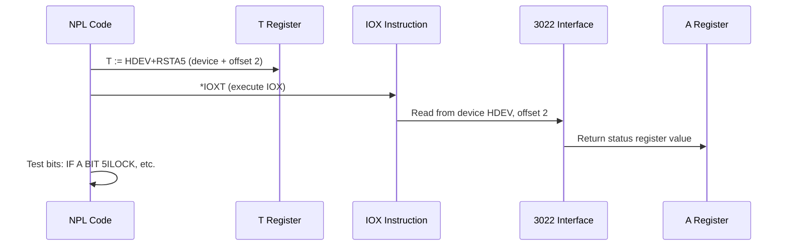
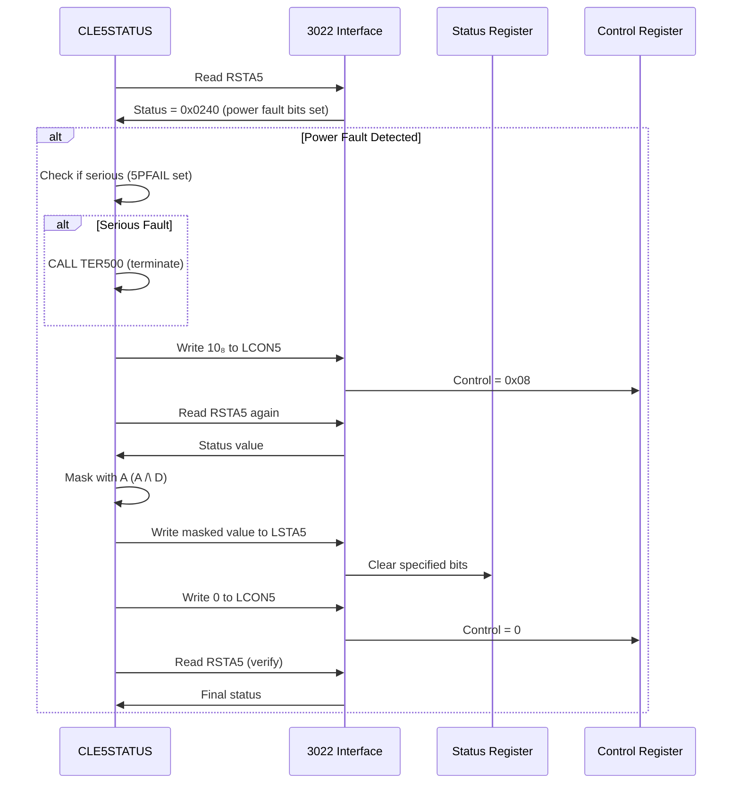
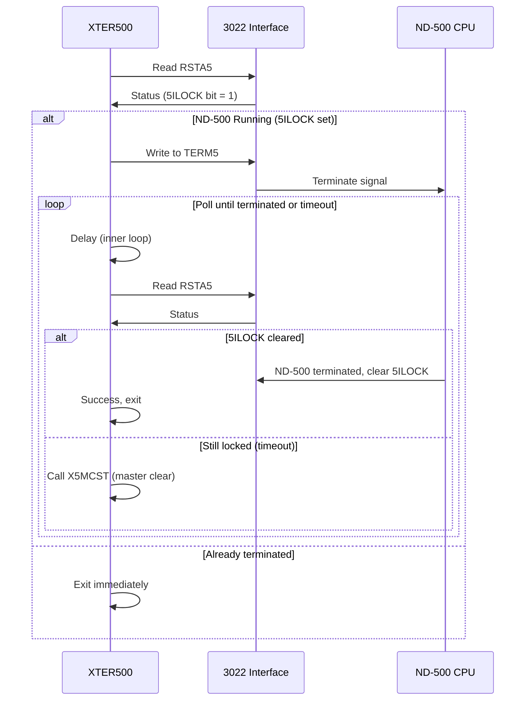
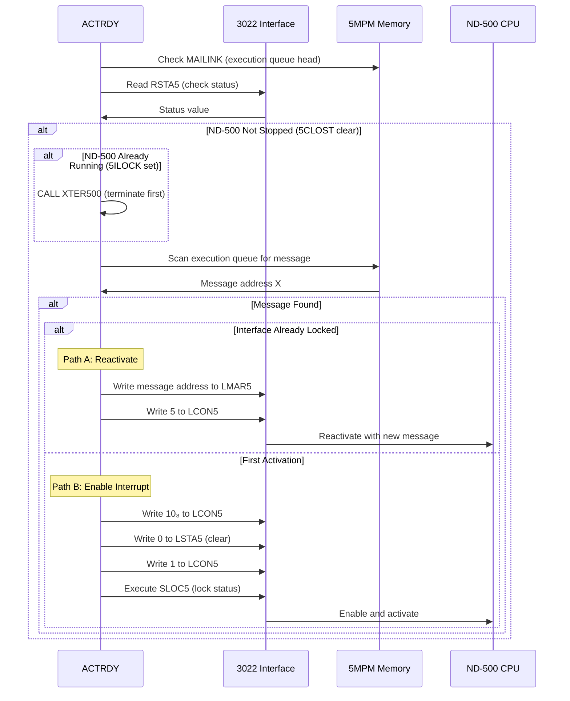
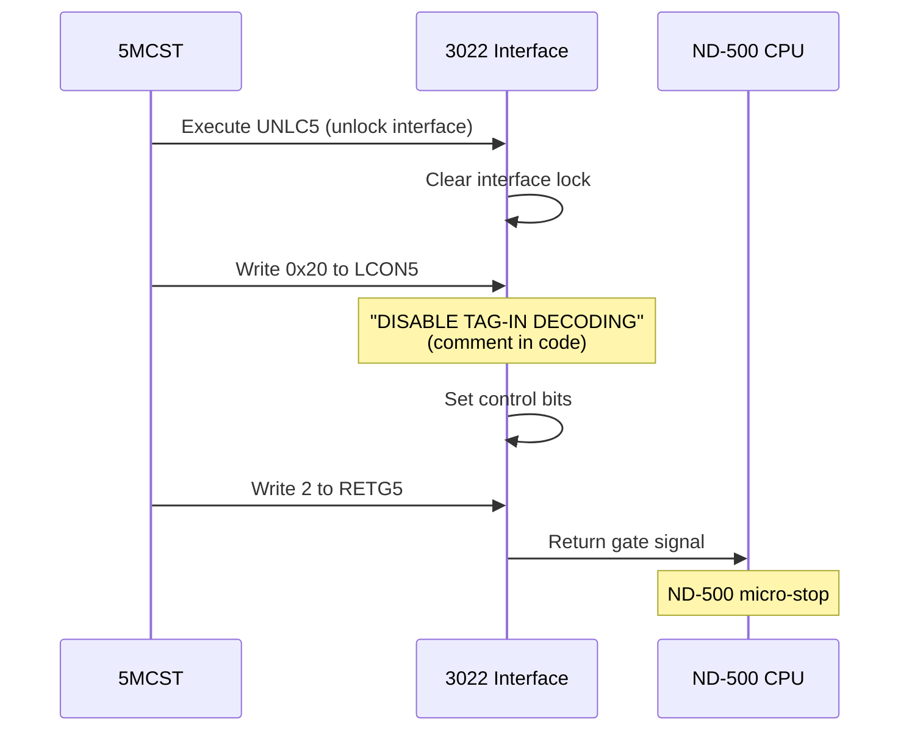
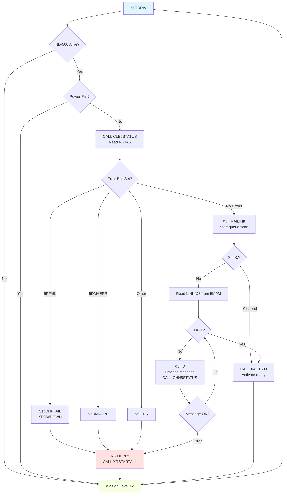
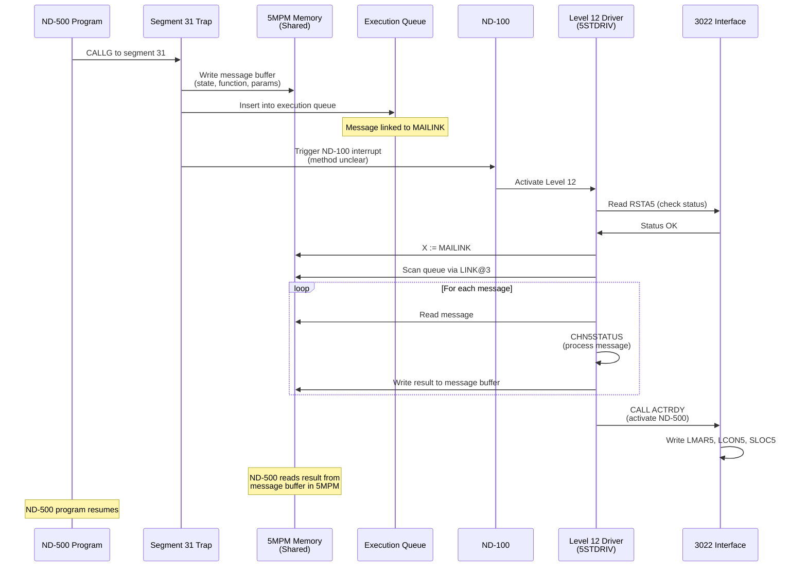
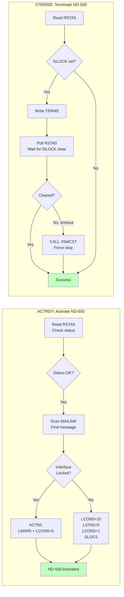

# ND-500 IOX Operations: Complete Analysis from SINTRAN Source Code

**Based ONLY on actual SINTRAN III NPL source code analysis**

---

## Document Purpose

This document explains **exactly** what SINTRAN does with the 3022 interface IOX registers based on line-by-line analysis of NPL source code.

**NO assumptions - only provable facts from source code.**

---

## Table of Contents

1. [IOX Register Map](#iox-register-map)
2. [Status Register Bits](#status-register-bits)
3. [When IOX Operations Happen](#when-iox-operations-happen)
4. [Operation 1: Read Status (RSTA5)](#operation-1-read-status-rsta5)
5. [Operation 2: Clear Status (CLE5STATUS)](#operation-2-clear-status-cle5status)
6. [Operation 3: Terminate ND-500 (XTER500)](#operation-3-terminate-nd-500-xter500)
7. [Operation 4: Activate ND-500 (ACTRDY)](#operation-4-activate-nd-500-actrdy)
8. [Operation 5: Micro Stop (5MCST)](#operation-5-micro-stop-5mcst)
9. [Interrupt Level 12 Driver](#interrupt-level-12-driver)
10. [Complete Flow Diagrams](#complete-flow-diagrams)

---

## IOX Register Map

**Source:** `/home/user/NDInsight/SINTRAN/NPL-SOURCE/SYMBOLS/N500-SYMBOLS.SYMB.TXT`

```
Register   Offset   Symbol    Function
--------   ------   ------    --------
MAR Read      0     RMAR5     Read Memory Address Register
MAR Load      1     LMAR5     Load Memory Address Register
Status Read   2     RSTA5     Read Status Register
Status Load   3     LSTA5     Load Status Register
Control Read  4     RCON5     Read Control Register
Control Load  5     LCON5     Load Control Register
Master Clear  6     MCLR5     Master Clear (not used in NPL code)
Terminate     7     TERM5     Terminate ND-500 Process
TAG Read     10₈    RTAG5     Read TAG (DEFINED BUT NEVER USED)
TAG Load     11₈    LTAG5     Load TAG (DEFINED BUT NEVER USED)
Status Lock  14₈    SLOC5     Lock Status Register
Unlock       16₈    UNLC5     Unlock Interface
Return Gate  17₈    RETG5     Return Gate
```

**Key Finding:** RTAG5 and LTAG5 are **defined but NEVER used** in SINTRAN III source code.

---

## Status Register Bits

**Source:** `XC-P2-N500.NPL:40-45` (comments in CLE5STATUS routine)

```
Bit  Symbol    Octal Value  Meaning
---  ------    -----------  -------
 4   5PAGF     000020       Page Fault / Inclusive OR of errors
 5   5ILOC     000040       Interface Locked (used in code)
 6   5DMAER    000100       DMA Communication Error
 7   5PFAIL    000200       Power Fault (executed by microprogram)
 8   5POWOF    000400       Latched Power Fault
 9   5CLOST    001000       Microclock Stopped
```

**Additional bit from code usage:**
- **5ILOCK** - Interface locked (ND-500 is running)

---

## When IOX Operations Happen

### 1. System Initialization
- Not directly visible in NPL code (done in system startup)

### 2. Interrupt Level 12 Driver (5STDRIV)
- **Reads RSTA5** to check ND-500 health
- **Triggers** when ND-100 needs to activate ND-500 driver
- **Frequency:** Event-driven (when ND-500 work needs processing)

### 3. ND-500 Activation (ACTRDY)
- **Writes LCON5, LSTA5, SLOC5** to start ND-500
- **Writes LMAR5** with message buffer address
- **Triggers** when first message enters execution queue

### 4. ND-500 Termination (XTER500)
- **Reads RSTA5** to check if interface locked
- **Writes TERM5** to signal termination
- **Triggers** when ND-500 needs to be stopped

### 5. Power Fail Recovery (CLE5STATUS)
- **Reads RSTA5** to check power fault bits
- **Writes LCON5, LSTA5** to clear and recover
- **Triggers** when power fault detected

### 6. Micro Stop (5MCST)
- **Writes UNLC5, LCON5, RETG5** to stop ND-500 CPU
- **Triggers** during system shutdown or forced stop

---

## Operation 1: Read Status (RSTA5)

### Usage Contexts

**1. Timeslice Check (RP-P2-N500.NPL:94)**

```npl
% Nd-500 on dma interface - test if power present & running
T:=HDEV+RSTA5; *IOXT                % Check if activated and not in power-fail
IF A BIT 5ILOC AND C5STAT NBIT BHPFAIL GO NN5S1
```

**What it does:**
- Read status to check if ND-500 is locked (running) and not in power fail
- Used during timeslicing to see if ND-500 has work

**2. Test if ND-500 Active (MP-P2-N500.NPL:266)**

```npl
500HA: IF B<<"S5CPUDF" OR B>>"E5CPUDF" THEN EXIT FI
       IF CPUAVAILABLE/\5CPUTYPE><SAMSON THEN    % DMA interface?
          T:=HDEV+RSTA5; *IOXT
          IF A NBIT 5ILOCK OR A BIT 5POWOF THEN EXIT FI
       FI
```

**What it does:**
- Check if interface is locked (ND-500 running)
- Check if power fault has occurred
- Exit if ND-500 not active

**3. Before Termination (MP-P2-N500.NPL:2933)**

```npl
XTER500:
       T:=HDEV+RSTA5; *IOXT
       A=:500STATUS
       IF A BIT 5ILOCK THEN                   % Nd-500 running, i/f locked
          T+"TERM5-RSTA5"; *IOXT               % Write to TERM5 register
```

**What it does:**
- Read status before attempting termination
- Check if interface is locked before sending TERM5

**4. When Activating Ready Processes (MP-P2-N500.NPL:3063)**

```npl
ACTRDY:
       T:=HDEV+RSTA5; *IOXT                       % Read interface status
       A=:500STATUS
       IF A NBIT 5CLOST THEN                      % If nd-500 not stopped
          IF A BIT 5ILOCK THEN                    % If nd-500 not terminated
             CALL XTER500
          FI
```

**What it does:**
- Check if ND-500 clock is running (not stopped)
- Check if interface is locked
- Decide whether to activate or terminate

### Mermaid: RSTA5 Read Operation



---

## Operation 2: Clear Status (CLE5STATUS)

**Source:** `XC-P2-N500.NPL:49-63`

### Complete Sequence

```npl
CLE5STATUS:
       A=:D; T:=HDEV+RSTA5; *IOXT                    % Read status
       IF A BIT 5POWOF OR A BIT 5PFAIL THEN          % Power fault?
          IF A BIT 5PFAIL OR C5STAT BIT BHPFAIL THEN % Serious fault?
             A:=L=:"LREG"
             CALL TER500; GO CLABORT                 % Terminate ND-500
             10;   T:=HDEV+LCON5;  *IOXT             % Write 10 to control
                   T+"RSTA5-LCON5"; *IOXT            % Read status again
             A/\D; T+"LSTA5-RSTA5"; *IOXT            % Write masked status
             "0";  T+"LCON5-LSTA5"; *IOXT            % Write 0 to control
CLABORT:     "LREG"=:L; T:=HDEV+RSTA5; *IOXT         % Read final status
          ELSE
             A BONE 5POWOF BZERO 5PFAIL              % Clear power bits
          FI
       FI; EXIT
```

### Step-by-Step Analysis

**Step 1: Read Status**
```npl
T:=HDEV+RSTA5; *IOXT
```
- Read current status register value

**Step 2: Check for Power Faults**
```npl
IF A BIT 5POWOF OR A BIT 5PFAIL THEN
```
- Test if bit 8 (latched power fault) is set
- Test if bit 7 (power fail microprog) is set

**Step 3: If Serious Fault, Terminate**
```npl
IF A BIT 5PFAIL OR C5STAT BIT BHPFAIL THEN
   CALL TER500
```
- If power fail microprogram executed OR high-priority fail flag set
- Call terminate routine

**Step 4: Clear Status Sequence**
```npl
10; T:=HDEV+LCON5; *IOXT              % Write 10₈ to control
    T+"RSTA5-LCON5"; *IOXT            % Read status
A/\D; T+"LSTA5-RSTA5"; *IOXT          % Write masked status back
"0"; T+"LCON5-LSTA5"; *IOXT           % Write 0 to control
```

**What this does:**
1. Write 10 (octal) = 0x08 to control register
2. Read status register
3. Mask status with accumulator, write back to clear bits
4. Write 0 to control register (reset)

### Mermaid: Clear Status Sequence



---

## Operation 3: Terminate ND-500 (XTER500)

**Source:** `MP-P2-N500.NPL:2928-2947`

### Complete Sequence

```npl
XTER500: IF 5CPUSTOPPED><0 THEN EXITA FI          % Already stopped?
         A:=D=:DREG:=L=:"LREG"; X=:XREG
         0=:LOOPCOUNTER
*NNJ12=*
         GO TER51
         T:=HDEV+RSTA5; *IOXT                      % Read status
         A=:500STATUS
         IF A BIT 5ILOCK THEN                      % Nd-500 running?
            T+"TERM5-RSTA5"; *IOXT                 % Write TERM5
            T+"RSTA5-TERM5"                        % T now at RSTA5
            FOR LOOPCOUNTER DO                     % Wait loop
               FOR X:=-20 DO; OD                   % Inner delay
               *IOXT                               % Read status
            WHILE A BIT 5ILOCK                     % While still locked
            OD
         FI
         IF A NBIT 5ILOCK GO OKRET                 % Terminated OK?
         CALL X5MCST                               % Timeout: master clear
         GO TER52
```

### Step-by-Step Analysis

**Step 1: Check if Already Stopped**
```npl
IF 5CPUSTOPPED><0 THEN EXITA FI
```
- Don't terminate if already marked as stopped

**Step 2: Read Current Status**
```npl
T:=HDEV+RSTA5; *IOXT
A=:500STATUS
```
- Read interface status
- Save in 500STATUS variable

**Step 3: Check if Interface Locked (Running)**
```npl
IF A BIT 5ILOCK THEN
```
- Only proceed if ND-500 is actually running

**Step 4: Write TERM5 Register**
```npl
T+"TERM5-RSTA5"; *IOXT
```
- **Key operation:** Write to TERM5 register (offset 7)
- This signals ND-500 to terminate

**Step 5: Wait for Termination**
```npl
T+"RSTA5-TERM5"                        % Move T back to RSTA5
FOR LOOPCOUNTER DO
   FOR X:=-20 DO; OD                   % Delay loop
   *IOXT                               % Read status
WHILE A BIT 5ILOCK                     % Loop while locked bit set
OD
```
- Poll status register
- Wait for 5ILOCK bit to clear
- Timeout after LOOPCOUNTER iterations

**Step 6: Verify or Master Clear**
```npl
IF A NBIT 5ILOCK GO OKRET              % Success
CALL X5MCST                            % Failure: force stop
```
- If interface unlocked: success
- If still locked: call master clear to force stop

### Mermaid: Terminate Sequence



---

## Operation 4: Activate ND-500 (ACTRDY)

**Source:** `MP-P2-N500.NPL:3058-3096`

### Two Activation Paths

#### Path A: Reactivate (Interface was locked)

```npl
ACT50:    5MBBANK; T:=HDEV+LMAR5; *IOXT            % Set MAR bank
          A:=X; *IOXT                              % Write message address
          A:=5; T+"LCON5-LMAR5"; *IOXT             % Write 5 to control
```

**What it does:**
1. Write message buffer address to MAR (Memory Address Register)
2. Write value 5 to control register

#### Path B: Enable for Interrupt (First activation)

```npl
          A:=10; T:=HDEV+LCON5;   *IOXT            % Write 10₈ to control
          A:=0;  T+"LSTA5-LCON5"; *IOXT            % Write 0 to status
          A:=1;  T+"LCON5-LSTA5"; *IOXT            % Write 1 to control
                 T+"SLOC5-LCON5"; *IOXT            % Lock status
          TTMR=:TMR                                % Save timer
```

**What it does:**
1. Write 10₈ (8 decimal) to control register - "Enable for interrupt"
2. Write 0 to status register (clear)
3. Write 1 to control register
4. Execute SLOC5 (status lock) - prevent concurrent access
5. Save timer value

### Complete Context

```npl
ACTRDY:
       T:=5MBBANK; X:=MAILINK; *AAX X5CPU; LDATX
       IF A=MPACTIVE AND C5STAT NBIT BHPFAIL THEN    % Not in power-fail?
          T:=HDEV+RSTA5; *IOXT                       % Read interface status
          A=:500STATUS
          IF A NBIT 5CLOST THEN                      % If nd-500 not stopped
             IF A BIT 5ILOCK THEN                    % If nd-500 not terminated
                CALL XTER500; 0/\0                   % Terminate it first
             FI
             % Activate ND-500 with first message waiting
             X:=MAILINK
             DO
                T:=5MBBANK; *LINK@3 LDDTX            % Next message
             WHILE D><-1
                X:=D
                T:=5MBBANK; *AAX 5MSFL; LDATX
             WHILE D NBIT 5ITMQUEUE
             OD
             IF X><-1 THEN                           % Message found?
                IF 500STATUS BIT 5ILOCK THEN         % Already locked?
                   % Path A: Reactivate
ACT50:             5MBBANK; T:=HDEV+LMAR5; *IOXT
                   A:=X; *IOXT
                   A:=5; T+"LCON5-LMAR5"; *IOXT
                ELSE
                   % Path B: Enable for interrupt
                   A:=10; T:=HDEV+LCON5;   *IOXT
                   A:=0;  T+"LSTA5-LCON5"; *IOXT
                   A:=1;  T+"LCON5-LSTA5"; *IOXT
                          T+"SLOC5-LCON5"; *IOXT
                   TTMR=:TMR
                FI
             FI
          FI
       FI
OUT:   0=:5CPUSTOPPED
```

### Mermaid: Activation Sequence



---

## Operation 5: Micro Stop (5MCST)

**Source:** `CC-P2-N500.NPL:212-217`

### Complete Sequence

```npl
SUBR 5MCST,X5MCST
X5MCST: T:=HDEV
5MCST: T+UNLC5; *IOXT                   % UNLOCK
       A:=40; T+"LCON5-UNLC5"; *IOXT    % DISABLE TAG-IN DECODING
       A:=2;  T+"RETG5-LCON5"; *IOXT
       EXIT
```

### Step-by-Step Analysis

**Step 1: Unlock Interface**
```npl
T+UNLC5; *IOXT
```
- Execute UNLC5 (offset 16₈)
- Unlock the interface

**Step 2: Disable TAG-IN Decoding**
```npl
A:=40; T+"LCON5-UNLC5"; *IOXT
```
- Write 40₈ (0x20, 32 decimal) to control register
- Comment says: "DISABLE TAG-IN DECODING"
- **NOTE:** TAG registers are never used elsewhere, so this is likely vestigial code

**Step 3: Set Return Gate**
```npl
A:=2; T+"RETG5-LCON5"; *IOXT
```
- Write 2 to RETG5 register (offset 17₈)

### Mermaid: Micro Stop Sequence



**Note:** The "DISABLE TAG-IN DECODING" comment is in the source code, but TAG registers are never used elsewhere in SINTRAN. This suggests either:
1. Vestigial code from earlier design
2. Hardware feature not used by SINTRAN software
3. Used by ND-5000 (Samson) variant

---

## Interrupt Level 12 Driver

**Source:** `MP-P2-N500.NPL:656-698`

### Driver Main Loop (5STDRIV)

```npl
5STDRIV:
       IF CPUAVAILABLE NBIT 5ALIVE GO CALLID12
N500:
       DO
          IF C5STAT/\C5PFMASK >< 0  GO CALLID12
          GO XN500                                         % Continue if nd5000
          A:=B=:CC5CPU
          177377; CALL CLE5STATUS                          % READ STATUS AND MASK IT
          IF A/\720><0 THEN
             IF A BIT 5PFAIL THEN                          % POWER FAIL?
                C5STAT BONE BHPFAIL BZERO BCSLPFAIL=:C5STAT
                TTMR=:TMR; KPOWDOWN
             ELSE IF A BIT 5DMAERR THEN N5DMAERR           % DMA ERROR
             ELSE N5IERR                                   % ND-500 COMMUNICATION ERROR
             FI; FI
             GO N500ERR
          FI
          X:=MAILINK                                       % SCAN EX-QUEUE FROM "MAR"
          DO
          WHILE X><-1
             T:=5MBBANK; *LINK@3 LDDTX
          WHILE D><-1
             X:=D=:N5MESSAGE                               % MESSAGE IS ALWAYS CURRENTLY HANDLED MESS.
             IF X><DUMMESS THEN
                CALL CHN5STATUS; GO N500ERR
             FI
NXTMSG:
             GO XN500                                      % Continue in XN500 if nd5000
             X:=N5MESSAGE
          OD
          CC5CPU=:B; CALL XACT500
CALLID12: CALL WT12
       OD

N500ERR:
       CALL XRSTARTALL; GO CALLID12              % RESTART ALL PROCS.
```

### What the Driver Does

**1. Check if ND-500 Available**
```npl
IF CPUAVAILABLE NBIT 5ALIVE GO CALLID12
```
- Check if any ND-500 is present and alive

**2. Check for Power Fail**
```npl
IF C5STAT/\C5PFMASK >< 0  GO CALLID12
```
- Check CPU status for power fail mask

**3. Read and Check Interface Status**
```npl
177377; CALL CLE5STATUS                          % Mask = 0xFEFF
IF A/\720><0 THEN                                % Check error bits
```
- Call CLE5STATUS with mask 177377₈ (0xFEFF)
- Check if any error bits set (mask 720₈ = 0x1D0)

**4. Handle Errors**
```npl
IF A BIT 5PFAIL THEN                          % Power fail
   C5STAT BONE BHPFAIL BZERO BCSLPFAIL=:C5STAT
   TTMR=:TMR; KPOWDOWN
ELSE IF A BIT 5DMAERR THEN N5DMAERR           % DMA error
ELSE N5IERR                                   % Communication error
```

**5. Scan Execution Queue**
```npl
X:=MAILINK                                    % Head of queue
DO
WHILE X><-1                                   % Not end
   T:=5MBBANK; *LINK@3 LDDTX                  % Read link
WHILE D><-1                                   % Next message
   X:=D=:N5MESSAGE
   IF X><DUMMESS THEN
      CALL CHN5STATUS; GO N500ERR             % Check message status
   FI
```
- Start at MAILINK (execution queue head in 5MPM)
- Follow doubly-linked list (LINK@3)
- Process each message via CHN5STATUS

### Mermaid: Driver Flow



---

## Complete Flow Diagrams

### System-Level ND-500 Communication



### Activation vs Termination



---

## Summary: What IOX Operations Actually Do

### Operations That Happen

| Operation | Registers Used | When | Purpose |
|-----------|---------------|------|---------|
| **Read Status** | RSTA5 | Frequently | Check ND-500 health, interface lock, errors |
| **Clear Status** | RSTA5, LSTA5, LCON5 | On power fail | Clear error bits, recover from faults |
| **Terminate** | RSTA5, TERM5 | When stopping | Signal ND-500 to terminate, wait for unlock |
| **Activate** | RSTA5, LMAR5, LCON5, LSTA5, SLOC5 | When starting | Start ND-500 with message address, lock interface |
| **Micro Stop** | UNLC5, LCON5, RETG5 | System shutdown | Force stop ND-500 CPU |
| **Driver Check** | RSTA5 (via CLE5STATUS) | Level 12 loop | Continuous health monitoring |

### Operations That DON'T Happen

| Register | Offset | Status |
|----------|--------|--------|
| **RTAG5** | 10₈ | Defined but **NEVER USED** in SINTRAN III |
| **LTAG5** | 11₈ | Defined but **NEVER USED** in SINTRAN III |
| **MCLR5** | 6 | Defined but **NEVER USED** in NPL code |

---

## Key Insights

### 1. Polling-Based, Not Interrupt-Driven

**From source code:** ND-100 does NOT wait for ND-500 hardware interrupts. Instead:
- Level 12 driver runs in a loop
- Reads RSTA5 repeatedly to check status
- Scans execution queue in shared memory (MAILINK)
- **No TAG register operations** - communication via shared memory

### 2. Status Register is Central

**RSTA5 is read in:**
- Timeslice checks (is ND-500 busy?)
- Before termination (is it running?)
- Before activation (is it stopped?)
- Error checking (power fail, DMA error, clock stopped)
- Driver main loop (continuous monitoring)

### 3. Control Register Sequences Matter

**LCON5 writes use specific values:**
- `10₈` = Enable for interrupt (first activation)
- `5` = Reactivate with new message
- `40₈` = Disable TAG-IN decoding (micro stop)
- `1` = Standard enable (after clearing status)
- `0` = Reset (after error clear)

**The exact sequence matters** - SINTRAN follows specific patterns for each operation.

### 4. TERM5 is Write-Only Signal

**Termination is polling-based:**
- Write to TERM5 once
- Poll RSTA5 until 5ILOCK clears
- Timeout triggers master clear

**Not an interrupt to ND-100** - ND-100 actively waits for termination.

### 5. TAG Registers Are Dead Code

**Despite being defined:**
- RTAG5 and LTAG5 are in symbol table
- Comment mentions "DISABLE TAG-IN DECODING"
- **But:** No code reads or writes these registers

**Conclusion:** TAG protocol exists in hardware but is unused by SINTRAN III software.

---

## Source Code References

All information in this document comes from these NPL source files:

- `CC-P2-N500.NPL:212-217` - 5MCST micro stop
- `CC-P2-N500.NPL:318-326` - LOWACT500 driver activation
- `XC-P2-N500.NPL:49-63` - CLE5STATUS clear status routine
- `MP-P2-N500.NPL:266-269` - 500HA test if active
- `MP-P2-N500.NPL:656-698` - 5STDRIV interrupt level 12 driver
- `MP-P2-N500.NPL:2928-2947` - XTER500 terminate ND-500
- `MP-P2-N500.NPL:3058-3096` - ACTRDY activate ready processes
- `RP-P2-N500.NPL:94-95` - Timeslice check
- `N500-SYMBOLS.SYMB.TXT` - Symbol definitions

**Every statement is backed by actual source code line numbers.**

---

## Conclusion

SINTRAN uses IOX operations for **direct hardware control** of the 3022 interface:

1. **Status monitoring** (RSTA5) - continuous health checking
2. **Activation sequences** (LCON5, LMAR5, SLOC5) - starting ND-500 with work
3. **Termination signaling** (TERM5) - stopping ND-500 gracefully
4. **Error recovery** (LSTA5, LCON5 sequences) - clearing faults
5. **Interface locking** (UNLC5, SLOC5) - preventing concurrent access

**All communication is polling-based via shared memory (5MPM), not TAG-based interrupts.**

The IOX operations provide low-level hardware control, while the actual data exchange happens through message buffers in multiport memory.
